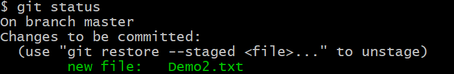

# 常用Linux命令:

pwd 			（显示当前位置）
tab键  		（自动补齐）

ls 为显示指定目录和文件的信息

​      -a 显示所有文件，包括隐藏文件

​      -l 详细信息显示

  	 -d 查看目录属性
  	
  	  -h 人性化显示文件大小属性

cd ..  			（上一级）
cd ～			 (家目录)
cd /			  	(根目录)
cd -				 (上次所在位置)
mkdir 名字1 名字2 名字3   		（创建  名字.....  文件夹）
mkdir -p 名字1/名字2		 （在名字1里面创建一个文件2）
rmdir  文件夹名字 			（删除文件夹 《文件夹里面必须为空》）
rm -r(文件夹) 文件夹名  		（删除非空文件夹）
rm -rf(文件夹) 文件夹名  		（强制删除非空文件夹）
rm  文件名 			（删除文件）
rm -f 文件名 			（强制删除文件）
touch 名字   			（创建  名字  文件）
echo "内容">>文件名			 (向文件里面添加内容)
cat 文件名 			（查看文件内容）
cp 路径  路径  			（拷贝文件）
cp -r 路径  路径  				（拷贝文件夹）
mv 当前路径文件夹1  当前路径文件夹2 （当前文件夹没有文件夹2   重命名）
mv 文件夹  文件夹 			（移动文件夹）
chmod 111 文件夹名
chmod u+w 文件夹名   (修改文件权限   r-4 w-2 x-1 u-所主 g-所组 o-其他)


# Git技术:公司必备,一定要会

# Git概念

​		Git是一个免费的,开源的分布式版本控制系统,可以快速高效地处理从小型到大型的项目.

# 什么是版本控制

​		版本控制是一种记录一个或若干文件内容变化,以便将来查阅特定版本修订情况的系统.

# 为什么要用版本控制

​		软件开发中采用版本控制系统是个明智的选择

​		有了它就可以将某个文件回溯到之前的状态,甚至将整个项目都回退到过去某个时间点的状态

​		就算把整个项目中的文件改的改删的删,也可以恢复到原先的样子	

​		但额外增加的工作量却微乎其微.


# 版本控制的分类

## 集中式的版本控制系统

​						集中化的版本控制系统诸如CVS,SVN以及Perforce等,都有一个单一的集中管理的服务器,保存所有文件的修订版本,而协同工作的人们都通过客户端连到这台服务器,取出最新的文件或者提交更新.

​						这种做法,每个人都可以在一定程度上看到项目中的其他人正在做些什么,而管理员也可以轻松掌握每个开发者的权限,并且管理一个集中化的版本控制系统,远比在各个客户端上维护本地数据库来的轻松容易.

​						缺点:	1.中央服务器的单点故障.如果服务器宕机一小时,那么在这一小时内,谁都无法提交更新,也就无法协同工作

​									 2.需要联网访问中央服务器

​									 3.只能存放这个版本与上个版本之间差异,想回滚到更以前的版本很耗时

​				

## 分布式的版本控制系统

​						在这类系统中,像Git,BitKeeper等,客户端并不只是提取最新版本的文件快照,而是把代码仓库完整地镜像下来.

​						更进一步,许多这类系统都可以指定和若干不同的远端代码仓库进行交互,这样,就可以再同一个项目中分别和不同工作小组的人相互协作.

​						分布式的版本控制系统在管理项目时存放的不是项目版本与版本之间的差异,它存的是索引(所需磁盘空间很少,所以每个客户端都可以放下整个项目的历史记录)


# 下载和安装

## 下载

​						官网:http://git-scm.com/,很慢,推荐使用网盘下载

## 安装

​						1.Information	--->  Next

​						2.Select Components	--->	Next

​						3.Choosing the default editor userd by Git	--->	Next(文本编辑器)

​						4.adjusting the name of the initial branch in new repositories	--->	Next

​						5.Adjusting your PATH environment	--->	"Use Git from Git Bash only"	--->	Next(选择PATH环境变量)

​						6.Choosing HTTPS  transport backend	--->	"Use the OpenSSL library"	--->	Next(选择本地库,远程库)

​						7.Configuring the line ending conversions	--->	"Checkout Windows-style,commit Unix-style line endings"	--->	Next(行末换行符的转换方式)

​						8.Configuring the terminal emuator to use with Git Bash	--->	"Use MinTTY"(选择Git默认终端)

​						9.Configuring  extra options	--->	"Enable file system caching"(启动文件缓存)

​						如有没说到,一般都是Next

## 运行

​						右击,选择"Git Bash Here",打开Git终端

# Git本地结构

​		**工作区**	--gitadd-->	**暂存区**	--git commit-->	**本地库**	

# 代码托管中心

​	1.我们已经有了本地库,本地库可以帮我们进行版本控制,为什么还需要代码托管中心呢?

​	它的任务是帮我们维护远程库

​	本地库和远程库的交互方式,分为两种

​		(1)团队内部协作

​		(2)跨团队协作

​	2.托管中心种类

​		局域网环境下:可以搭建GitLab服务器作为代码托管中心,GitLab可以自己去搭建

​		外网环境下:可以由GitHub或者Gitee(码云)作为代码托管中心,GitHub或者Gitee是线程的托管中心,不用自己去搭建

# 初始化本地仓库

​	【1】创建一个文件夹：

​	【2】打开“Git Bash Here”	--->	

​					调整字体	--->	右键“Options”	--->	Text	--->	设置编码集"Character set"/设置字体大小"Select"

​				快捷键

​						复制		Ctrl+ins/直接选中就复制

​						粘贴		Shift+ins/ins

​				在Git中命令和Linux一样

​				（1）查看git安装版本

​							git --version

​				（2）清屏

​							clear

​				**（3）设置用户名**

​							git config --global user.name "pp"

​				**（4）设置邮箱**

​							git config --global user.email "1215096271@qq.com"

​				**（5）本地仓库的初始化**

​							git init

​					注意:	.git目录下的本地库相关的子目录和子文件不要删除,不要胡乱修改

# Git常用命令

## 1.添加add/提交commit文件

​						【1】先手动创建一个文件

​						【2】将文件添加到暂存区

​									git add Demo.txt

​						【3】将暂存区的内容提交到本地库

​									git commit -m "这是我提交的第一个文件 Demo.txt" Demo.txt	（-m 后面跟着是注释部分）

> [master (root-commit) 141d236] 这是我提交的第一个文件 Demo.txt
>  1 file changed, 0 insertions(+), 0 deletions(-)
>  create mode 100644 Demo.txt

### 注意事项:

​						【1】不放在本地仓库中的文件,git是不进行管理的(必须放在自己创建的文件夹中且已经进行设置用户名,签名和进行初始化)

​						【2】即使放在本地仓库的文件,git也不管理,必须通过add,commit命令操作才可以将内容提交到本地库

## 2.查看工作区和暂存区的状态

​						**git status**

### 【1】如果全部提交到本地库中


### 【2】如果有文件没有添加到暂存区


​				 

### 【3】如果有文件没有提交到本地库中



### 【4】如果提交过本地库中，<u>再对文件进行修改</u>


#### 【4.1】重新添加到暂存区	 git add Demo2.txt


#### 【4.2】git commit -m "修改了Demo2文件,再测试status状态" Demo2.txt


## 3.显示从最近到最远的日志

​						**git log**


### 当历史记录过多时，有分页效果，一页显示不下

​							还有下一页显示  “ ：”

​							下一页：空格

​							上一页：b

​							到底了,显示（END）

​							退出：q


### 日志显示方式：

#### 【1】git  log    --->   分页

#### 【2】git log --pretty=oneline


#### 【3】git log --oneline


#### 【4】git reflog


## 4.前进或者后退历史版本

​								**git reset --hard 索引号**


### 回滚参数

#### 【1】hard参数

​										 git reset --hard [索引]

​											本地库的指针移动的同时,重置暂存区,重置工作区

#### 【2】mixed参数

​										git  reset --mixed [索引]

​											本地库的指针移动的同时,重置暂存区,但是工作区不动

#### 【3】soft参数

​										git  reset --soft[索引]

​											本地库的指针移动的同时,但是暂存区和工作区都不动

#### 总结:常用就是hard参数


## 5.删除

### 1.删除工作区中的文件

​							 rm Test2.txt	(这时文件夹内Test2文件已经被删除)

### 2.删除暂存区文件


​								如果这时候恢复暂存区的数据

​						

### 3.删除本地库


### 4.恢复本地库删除的文件

​								就是回滚到删除之前的索引


​						

### 总结:

​									不管怎么删除,想恢复就是查看日志,然后回滚到自己想回到的地方

## 6.查找不同

### 1.单个文件工作区和暂存区对比

​							git diff [文件名]

​								新建一个文件,添加暂存区,提交本地库,更改了工作区中的Text3.txt,增加内容(没有进行git add)

​									导致:**工作区**  和  **暂存区**  不一致  ,比对


​					总结: git diff [文件名]	--->	将工作区中的文件和暂存区中文件进行比较

### 2.多个文件的工作区和暂存区对比

​							git diff


​					总结: git diff  --->   比较工作区中和暂存区中的所有的差异.(自上次提交后更改的所有文件)

### 3.单个文件暂存区和本地库对比

​							git diff 索引 文件名

​								新建一个文件,添加暂存区,提交本地库,更改了工作区中的Text3.txt,增加内容,重新添加暂存区(没有进行git commit)

​									导致:**暂存区**   和  **本地库**  不一致  ,比对

​			            


# 分支

## 概念

​					在版本控制过程中,使用多条线同时推进多个任务,这里面说的多条线,就是多个分支

## 好处

​					同时多个分支可以并行开发,互相不耽误,互相不影响,提高开发效率

​					如果有一个分支功能开发失败,直接删除这个分支就可以了,不会对其他分支产生任何影响

## 步骤

### 1.在工作区创建一个Test4.txt文件,然后提交到暂存区,提交到本地库

### 2.查看分支

​								`git branch -v`


### 3.创建分支

​								 `git branch 分支名`

​									

### 4.切换分支

​								`git checkout 分支名`


### 5.在分支做操作

​								在分支下对文件进行修改工作区,添加到暂存区,提交到本地库

## 分支之间的冲突和解决

### 冲突

#### 1.回到主分支,并查看分支


#### 2.在主分支做操作

​								在主分支下对文件进行修改工作区,添加到暂存区,提交到本地库

​								这时,主分支和branch01分支的版本号都改变了,而且在不同分支下,Test4.txt的内容不同

#### 3.将branch01合并到  主分支  (前提在主分支)

​								`git merge 分支名`							


##### 此时,Test4.txt内容:出现冲突

###### <u>在同一个文件的同一个位置修改,两个内容冲突</u>

​		

### 解决方法

#### 1.手工修改冲突部分,只保留一个,删除其他分支修改的内容,让同一个位置只保留一个内容

​					

#### 2.然后再进行对Test4.txt文件的添加到暂存区和提交到本地库								


# GitHub

## 创建账号

## 创建远程库

### 1.本地创建本地库

#### 1.创建文件夹,GitResp2

#### 2.打开git,git init 初始化本地库

#### 3,创建一个文件,Test.txt

#### 4.添加到暂存区,git add Test.txt

#### 5.提交到本地库,git commit -m "测试创建GitHub远程库" Test.txt

### 2,在GitHub创建远程库

#### 1.在GitHub官网,点击右上角"＋"--->"New repository"创建新的资料库

#### 2.填写远程库的名字,"Repository name" 一般与本地库名字一样

#### 3."Description"可选项,对远程库的描述

#### 4.远程库的权限,别人是否能看见"public"或者"private"

#### 5.可选项,使用以下方法初始化此存储库："Initialize this repository with:",

#### 6.查询远程库的地址

##### 1.登录GitHub官网,

​								

##### 2.查看https地址


## 连接远程库

### 1.推送

#### 1.查看远程是否有别名         git remote -v

#### 2.起别名             git remote add  别名  本名(远程库地址)


#### 3.再次查看别名         git remote -v


#### 4.推送到远程库     git push 别名/远程库网址  分支名	


#### 5.推送成功以后,在GitHub上查看自己的远程库

##### 1.点击该远程库


##### 2.查看推进结果


### 2.克隆到本地库

#### 1.在GitHub,需要克隆的远程库中,查看克隆地址


#### 2.在需要克隆到的位置打开Git

#### 3.克隆到本地库                git clone 远程库克隆地址


#### 4.进入该仓库         cd  仓库名/  

#### 5.查看远程别名      git remote -v


#### 6.克隆操作可以帮我们完成

##### 1.初始化本地库

##### 2.将远程库内容完成的克隆到本地

##### 3.替我们创建远程库的别名

## 另一个用户与远程库连接

### 0.邀请用户


#### 2.填入用户账号


#### 3.点击复制邀请连接


#### 4.登录该用户,粘贴邀请码,进入团队

### 1.对工作区进行修改,创建一个新的文件,Test2.txt

### 2.添加到暂存区,git add Test2.txt

### 3.提交到本地库,git commit -m "另一个用户创建了Test2.txt" Test2.txt

### 4.推送到远程库,git push origin master

#### 1.发现可以直接push进去,并没有让验证信息,或者也没有提示错误

##### 原因:一台客户端操作git使用的时候在本地有缓存,将缓存删除


#### 2.重新推送到远程库

## 本用户修改本地库

### 1.确认远程库内容是否更新了

### 2.1.拉取         fetch+merge

#### 1.先是抓取操作    git fetch origin master

##### 在抓取操作执行后,只是将远程库的内容下载到本地,但是工作区中的文件并没有更新,工作区还是原先的内容.


#### 2.抓取后,可以切换到远程库分支,查看分支内容     git checkout origin/master


#### 3.发现内容都正确,就进行合并操作         git merge origin/master

##### 合并前应该将分支切换回来


### 2.2拉取  pull

#### 1.直接拉取,省略2.1所有步骤   git pull origin master

### 2.1和2.2差别

#### fetch+merge操作      --->      为了保险,慎重

#### pull	   --->       代码简单,省事


# 以上为团队内部协作

## 其中冲突问题没有操作

## 团队内部协作图


# 跨团队协作


## 1.得到A远程库地址,复制

## 2.B进行fork操作

### 1.进入到账号后,粘贴到网址栏

### 2.点击fork,这时B远程库已经有A远程库的东西

## 3.B克隆到本地,并且进行修改

## 4.添加到暂存区,提交到本地库,然后push到B的远程库

### git push B远程库的地址 分支名

## 5.进行pull requests操作


## 6.A进行审核    "Files changed":查看具体内容

## 7.合并"Merge pull request"   --->  "Confirm merge"


# 免密操作

## 1.进入用户的主目录中     cd  ~

## 2.执行命令,生成一个.ssh的目录

### ssh-keygen -t rsa -C 邮箱

### 三次回车,确定默认值


## 3.打开.ssh下的id_rsa.pub文件,复制秘钥 


#### 

## 4.登录GitHub官网

### 1.点击右上角头像,点击"Settings"

### 2.点击右侧导航栏的"SSH and GPG keys"

### 3.点击"New SSH key"

### 4."SSH keys/Add new" 下

#### "Title"名字随便填写

#### 将上一步复制的内容粘贴到"key"

### 5.找到远程库,点击"code"--->"SSH",将路径复制下来

## 5.进入工作区的git

### 1.起别名  git remote add origin_ssh git@github.com:ppsDog/GitResp2.git

### 2.对文件进行添加暂存区,提交本地库,然后push到远程库

#### git push 别名 分支名


# IDEA集成Git

## 1.在IDEA集成GIT


## 2.选择初始化目录

### (项目整 体变成工作区,【尽量别用一个项目,用一个模块】)


### 这时模块文件夹中有.git文件夹


## 3.右键模块module--->Git--->Add"添加到暂存区"

### 相当于git add 文件名

## 4.再右键模块--->Git--->Commit Directories...

### 把右侧"Before Commit"中的"Perform code analysis"和"Check TODO(Show All)"不勾选


### 在"Commit Message"中填写注释

### 相当于 git commit -m "注释" 文件名

## 5.在 IDEA 下方 "<u>9:</u>Version Control",可以查看git情况,相当于git的控制台


### 在"Console"查看记录

### 在"Log"中查看日志,和历史版本号

## 6.修改代码后,在最前面会出现提示,与上次版本的不一致的地方


## 7.打开模块文件夹,(.git所在文件夹)

## 8.打开git控制台

### 可以先查看当前本地库是否文件全部提交     git  status

### 拉取远程库    git pull 远程库网络地址 master --allow-unrelated-histories

#### 进如到一个编辑模式,进行注释,退出":wq"

### 推送远程库   git push -u 远程库网络地址 master -f    


## 在IDEA中推送

### 第一种方法


### 第二种方法,提交的同时推送


## 在IDEA克隆

### 1.


### 2.


### 克隆到本地后,这个目录既变成了一个本地仓库,又变成了工作空间

## 在修改文件之前,先pull操作,然后修改,再push报错

# 报错

### OpenSSL SSL_read: Connection was reset, errno 10054

​							**打开Git命令页面，执行git命令脚本：修改设置，解除ssl验证**

```
git config --global http.sslVerify "false"
```