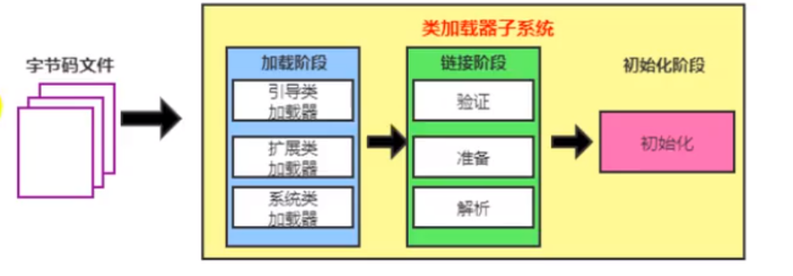
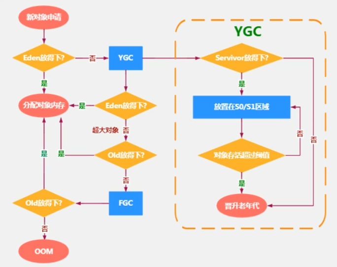
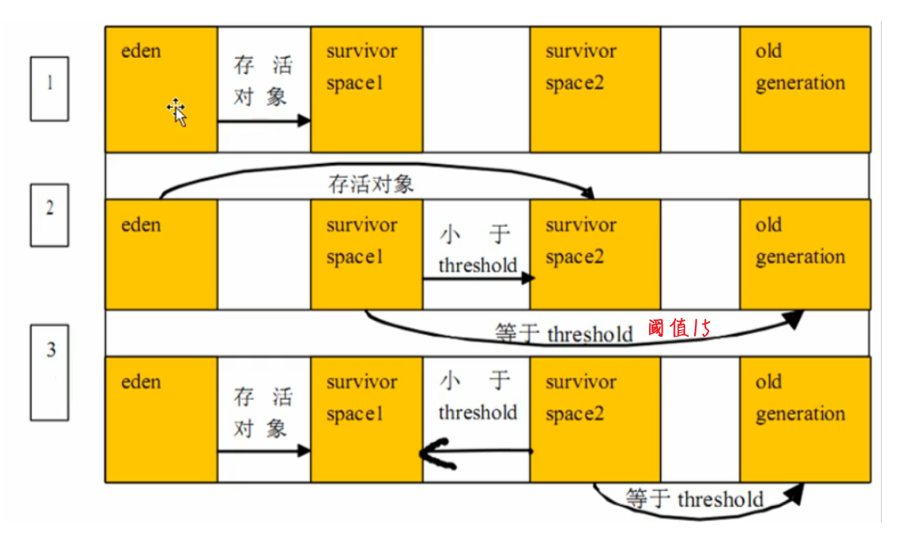

# 什么是字节码?采用字节码的好处是什么?

java中的编译器和解释器:
Java中引入了虚拟机的概念，即在机器和编译程序之间加入了一-层抽象的虚拟的机器。这台虚拟的机器在任何平台上都提供给编译程序一个的共同的接口。
编译程序只需要面向虚拟机，生成虚拟机能够理解的代码,然后由解释器来将虚拟机代码转换为特定系统的机器码执行。在Java中，这种供虚拟机理解的代码叫做字节码(即扩展名为.class的文件)，它不面向任何特定的处理器，只面向虚拟机。
每一种平台的解释器是不同的，但是实现的虚拟机是相同的。Java源程序经过编译器编译后变成字节码，字节码由虚拟机解释执行，虚拟机将每一条要执行的字节码送给解释器， 解释器将其翻译成特定机器上的机器码，然后在特定的机器上运行。这也就是解释了Java的编译与解释并存的特点。
Java源代码--->编译器--->jvm可执行的ava字节码(即虚拟指令--->-jvm--->jvm中解释器---机器可执行的二进制机器-->程序运行。
采用字节码的好处:
Java语言通过字节码的方式，在一定程度 上解决了传统解释型语言执行效率低的问题，同时又保留了解释型语言可移植的特点。所以ava程序运行时比较高效，而且,于字节码并不专对一种特定的机器,因此, Java程序无须重新编译便可在多种不同的计算机上运行。


# GC如何判断对象可以被回收

​			●引用计数法:每个对象有一个引用计数属性,新增-个引用时计数加1,引用释放时计数减1，计数为0时可以回收.(其他语言使用的)
​			●可达性分析法:从GC Roots开始向下搜索，搜索所走过的路径称为引用链。当一个对象到GC Roots没有任何引用链相连时，则证明此对象是不可用的，那么虚拟机就判断是可回收对象。
​		引用计数法，可能会出现A引用了B, B又引用了A,这时候就算他们都不再使用了，但因为相互引用计数器=1永远无法被回收。

## GC Roots的对象有:

●虚拟机栈(栈帧中的本地变量表)中引用的对象
●方法区中类静态属性引用的对象
●方法区中常量引用的对象
●本地方法栈中JN(即一般说的Native方法)弓|用的对象

可达性算法中的不可达对象并不是立即死亡的，对象拥有-次自我拯救的机会。对象被系统宜告死亡至少要经历两次标记过程:第-次是经过可达性分析发现没有与GC Roots相连接的引用链,第二次是在由虚拟机自动建立的Finalizer队列中判断是否需要执行finalize0)方法。


当对象变成(GC Roots)不可达时, GC会判断该对象是否覆盖了finalize方法,若未覆盖，则直接将其回收。否则,若对象未执行过finalize方法，将其放入F-Queue队列，由-低优先级线程执行该队列中对象的finalize方法。执行finalize方法完毕后，GC会再次判断该对象是否可达，若不可达，则进行回收,否则，对象”复活"

每个对象只能触发一次finalize()方法

由于finalize(方法运行代价高昂，不确定性大，无法保证各个对象的调用顺序，不推荐大家使用，建议遗忘它。

## 什么是Java虚拟机？为什么Java被称作是“平台无关的编程语言”？

Java虚拟机是一个可以执行Java字节码的虚拟机进程。Java源文件被编译成能被Java虚拟机执行的字节码文件。
Java被设计成允许应用程序可以运行在任意的平台，而不需要程序员为每一个平台单独重写或者是重新编译。Java虚拟机让这个变为可能，因为它知道底层硬件平台的指令长度和其他特性。

# JVM与Java体系结构

## java及JVM简介

​					互联网基于js,人工智能基于Python,微服务基于go语言

### java生态圈

​							Java是目前应用最为广泛的软件开发平台之一.

#### 作为一个平台,Java虚拟机扮演者举足轻重的作用,

​									Groovy,Scala,JRuby,KOtlin等都是Java平台的一部分

#### 作为一个文化,Java几乎成为了"开源"的代名词

​									第三方开源软件和框架.如Tomcat,Struts,MyBatista,Spring等

​									就连JDK和JVM自身也有不少开源的实现,如OpenJDK,Harmony

#### 作为一个社区,Java拥有全世界最多的技术拥护者和开源社区支持,有数不清的论坛和资料

​									从桌面应用软件,嵌入式开发到企业级应用,后台服务器,中间件,都可以看到java的身影

### java:跨平台的语言

​									所有的java虚拟机都遵守JVM虚拟机的规范,字节码本身就有跨平台性


### JVM:跨语言的平台

​							不一定非要是java文件,只需要字节码文件符合Java虚拟机的规范


### java不是最强大的语言,但是jvm是最强大的虚拟机

### 字节码

​								我们平时说的java字节码,指的是用java语言编译成的字节码.准确的说任何能在jvm平台上执行的字节码格式都是一样						的.所以应该统称为:**jvm字节码**

​								不同的编译器,可以编译出相同的字节码文件,字节码文件也可以在不同的jvm上运行

​								java虚拟机与java语言并没有必然的联系,它只与特定的二进制文件格式——Class文件格式所关联,Class文件包含了Java						虚拟机指令集(或者称为字节码,Bytecodes)和符号表,还有一些其他辅助信息

### 多语言混合编程

​								java平台上的**多语言混合编程**正成为主流,通过特定领域的语言去解决特定领域的问题是当前软件开发应对日趋复杂的						项目需求的一个方向

​								各种语言之间的交互不存在任何困难,就像使用自己语言的原生API一样方便,因为他们**最终都运行在一个虚拟机**上.

​								对这些运行于Java虚拟机上,Java之外的语言,来自系统级的,底层的支持正在迅速增强,以JSR-292为核心的一系列项目和						功能改进(如DaVinci Machine 项目,Nashorn引擎,InvokeDynamic指令,java.lang.invoke包等),**推动java虚拟机从"java语						言的虚拟机"向"多语言虚拟机"的方向发展**

​						

## 虚拟机与java虚拟机

### 虚拟机

​								所谓虚拟机(Virtual Machine),就是一台虚拟的计算机.它是一款**软件**,用来执行一系列虚拟计算机指令.大体上,虚拟机分						为**系统虚拟机**和**程序虚拟机**

​									*Visual Box,VMware就属于**系统虚拟机**,它们**完全是对物理计算机的仿真**,提供了一个可运行完整操作系统的软件平台

​									*程序虚拟机的典型代表就是Java虚拟机,它**专门为执行单个计算机程序而设计**,在java虚拟机中执行的指令我们称为									   java字节码指令

​								无论是系统虚拟机还是程序虚拟机,在上面运行的软件都被限制于虚拟机提供的资源中

### java虚拟机

​								java虚拟机是一台执行java字节码的虚拟计算机,它拥有独立的运行机制,其运行的java字节码也未必由java语言编译

​								jvm平台的各种语言可以共享java虚拟机带来的跨平台性,优秀的垃圾回收器,以及可靠的即时编译器

​								**java技术的核心就是Java虚拟机**(JVM,java virtual machine),因为所有的java程序都运行在java虚拟机内部

#### 作用

​									**java虚拟机就是二进制字节码的运行环境**,负责装载字节码到其内部,解释/编译为对应的平台上的机器指令执行.每一							台java指令,java虚拟机规范中都有详细定义,如怎么去操作数,怎么处理操作数,处理结果放在那里.

#### 特点

​									*一次编译,到处运行:编译成.class字节码文件,在哪个jvm环境都可以运行

​									*自动内存管理:降低内存泄漏和内存溢出的危险

​									*自动垃圾回收功能

### jvm的位置


​										JVM是运行在操作系统上的,它与硬件没有直接的交互


## JVM的整体结构

### 图1:大概图


### Java代码执行流程


## JVM的架构模型

​				java编译器输入的指令流基本上是一种**基于栈的指令集架构**,另外一种指令集架构则是**寄存器的指令集架构**.

​				具体来说:这两种的架构之间区别:

​				指令执行一般有两个部分,一个是地址,一个是操作数.零地址:就是没有地址,只有操作数,一地址:只有一个地址数

### 基于栈式架构的特点:

​								***设计和实现更简单,适用于资源受限的系统**

​								*避开了寄存器的分配难题:使用零地址指令方式分配

​								***指令多**

​								*指令流中的指令大部分是零地址指令,**每八位进行对齐**,其执行过程依赖于操作栈.**指令集更小**,编译器容易实现

​								***不需要硬件支持**,可移植性更好,更好实现跨平台

### 基于寄存器架构的特点

​								*典型的应用时x86的二进制指令集:比如传统的PC以及Android的Davlik虚拟机

​								*指令集架构则**完全依赖硬件,可移植性差**,**每十六位对齐,由CPU执行,与硬件耦合度高**

​								***性能优秀和执行更高效**

​								*花费更少的指令去完成一项操作

​								*在大部分情况下,基于寄存器架构的指令集往往都以一地址指令,二地址指令和三地址指令为主,而基于栈式架构的指令									集却是以零地址指令为主

### 总结:

​								**由于跨平台性的设计,java的指令都是根据栈来设计的**.不同平台CPU架构不同,所有不能设计为基于寄存器的.优点是跨						平台,指令集小,编译器容易实现,缺点是性能下降,实现同样的功能需要更多的指令

​								栈:

​									跨平台性,指令集小,指令多;**执行性能比寄存器差**


## JVM的生命周期

### 虚拟机的启动

​								java虚拟机的启动是通过引导类加载器(bootstrap class loader)创建一个初始类(initial class)来完成的,这个类由虚拟机						的具体实现指定的

### 虚拟机的执行

​								一个运行中的java虚拟机有着一个清晰的任务:执行java程序

​								程序开始执行时才运行,程序结束时就停止

​								执行一个所谓的java程序的时候,真真正正在执行的是一个叫做java虚拟机的进程

### 虚拟机的退出

​								有如下的几种情况:

​										*程序正常执行结束

​										*程序在执行过程中遇到了异常或错误而异常终止

​										*由于操作系统出现错误而导致java虚拟机进程终止

​										*某线程调用Runtime类或System类的exit方法,或Runtime类的halt方法,并且java安全管理器也允许这次exit或											halt操作

​										**除此之外,JNI(Java Native Interface)规范描述了JNI Invocation API来加载或卸载Java虚拟机时,java虚拟机的退											出情况


## 三大商用虚拟机

### 1.SUN公司的==Hotspot VM==

#### 市场地位:服务器,桌面到移动端,嵌入式

#### Hotspot值得就是他的热点代码探测技术

##### *通过计数器找到最具编译价值代码,触发即时编译或栈上替换

##### *通过编译器与解释器协同工作,在最优化的程序响应时间与最佳执行性能中取得平衡

### 2.BEA公司的JRockit

#### 市场地位:专注于服务器端应用

##### 不包含解析器实现,全部代码都考即时编译器编译后执行

#### JRockit JVM是世界上最快的jvm

#### 全面的java运行时解决方案组合

#### Oracle白打了整合两大优秀虚拟机的工作,是在Hotspot的基础上,一直JRockit的优秀特性

### 3.IBM公司的J9

#### 市场地位:服务器端,桌面应用,嵌入式等多用途VM

#### 广泛用于IBM的各种java产品

### **Graal VM 

​								在HotSpot基础上增强而成的跨语言全站虚拟机,可以作为"任何语言"的运行平台使用

# 类加载子系统(Class Loader)

## 内存结构概述


## 类加载器与类的加载过程



​		<span style="font-size:18px;font-weight:bold">1: 类加载器子系统负责从文件系统或者网络中==加载class文件,==class文件在文件开头有特定的文件标识</span>

​		<span style="font-size:18px;font-weight:bold">(java的是CA FE BA BE)</span>


​		<span style="font-size:18px;font-weight:bold">2: ClassLoader只负责class文件的加载,至于它是否可以运行,则由ExecutionEngine(执行引擎)决定</span>

​		<span style="font-size:18px;font-weight:bold">3: 加载的类信息存放于一块称为方法区的内存空间,除了类的信息外,方法区中还会存放运行时常量池信息,可能还包括字	符串字面量和数字常量(这部分常量信息是Class文件中常量池部分的内存映射)</span>

​		<span style="font-size:18px;font-weight:bold">4: 字节码文件是物理磁盘上的文件,</span>

### 类加载器ClassLoader角色


​							<span style="font-size:20px;font-weight:bold">1.class file存在于本地硬盘上,可以理解为设计师画在纸上的模板,而最终这个模板在执行的时候	是要加载到JVM当中来根据这个文件实例化n个一模一样的实例</span>

​							<span style="font-size:20px;font-weight:bold">2. class file加载到JVM中,被称为DNA元数据模板,放在方法区</span>

​							<span style="font-size:20px;font-weight:bold">3.在.class文件 -> JVM -> 最终称为元数据模板,此过程就要一个运输工具(类加载器 Class 	Loader),扮演一个快递员的角色</span>


### 类的加载过程

#### 1.加载    -->    2.链接     -->     3.初始化

​							<span style="font-size:20px;font-weight:bold">图1</span>


#### 加载:

##### 1.通过一个类的全限定名(全类名)获取定义此类的二进制字节流

##### 2.将这个字节流所代表的静态存储结构转化为方法区的运行时数据结构

##### 3.在内存中==生成一个代表这个类的java.lang.Class对象==,作为方法区这个类的各种数据的访问入口

##### 补充:加载.class文件的方式

​										* 从本地系统中直接加载

​										* 通过网络获取,典型场景:Web Applet

​										* 从zip压缩包中读取,成为日后jar,war格式的基础

​										* 运行时计算生成,使用最多的是:动态代理技术

​										* 由其他文件生成,典型场景:JSP应用

​										* 从专有数据库中提取.class文件,比较少见

​										* 从加密文件中获取,典型的防Class文件被反编译的保护措施

#### 链接

##### 验证(Verify):

​										* 目的在于确保Class文件的字节流包含信息符合当前虚拟机要求,保证被加载类的正确性,不会危害虚拟机自身安全

​										* 主要包括四种验证:文件格式验证,元数据验证,字节码验证,符号引用验证

##### 准备(Prepare):

​										* 为***<u>类变量</u>*** 分配内存并且设置该类变量的***<u>默认初始值</u>***,即零值

​										* 这里不包含用final修饰的static,因为**<u>final在编译的时候就会分配</u>** 了,准备阶段会**显式初始化**

​										* 这里**不会为实例变量分配初始化**,类变量会分配在方法区中,而实例变量是会随着对象一起分配到Java堆中(这时还											没加载对象)

##### 解析(Resolve):

​										* 将常量池内的符号引用转换为直接引用的过程

​										* 事实上,解析操作往往会伴随着JVM在执行完初始化之后在执行

​										* 符号引用就是一组符号来描述所引用的目标.符号引用的字面量形式明确定在《java虚拟机规范》的Class文件格											式中.直接引用的就是直接指向目标的指针,相对偏移量或一个间接定位到目标的句柄

​										* 解析动作主要针对类或接口,字段,类方法,接口方法,方法类型等,对应常量池中的CONSTANT_Class_info, 											CONSTANT_Fieldref_info, CONSTANT_Methodref_info等

#### 初始化

​										* 初始化阶段就是执行 类构造器方法 < clinit>() 的过程

​										* 此方法不许定义,是javac编译器自动收集类中的所有**类变量的赋值动作**和<u>**静态代码块**</u>中的语句合并而来

​									   	**(静态变量赋值或者静态代码执行,才会出现< clinit>()方法)**

​										* 构造器方法中指令按语句在源文件中出现的顺序执行

​										* < clinit>()不同于类的构造器(关联:构造器是虚拟机视角下的< init>())

​										* 若该类具有父类,JVM会保证子类的< clinit>()执行前,父类的< clinit>()已经执行完毕

​										* 虚拟机必须保证一个类的< clinit>()方法在多线程下被同步加锁


## 类加载器类

### 类加载器的分类

#### JVM两种类型的类加载器,分别为引导类加载器(Bootstrap ClassLoader) 和 自定义类加载器(User-Defined ClassLoader).

#### 从概念上来讲,自定义类加载器一般指的是程序中由开发人员自定义的一类类加载器,但是Java虚拟机规范却没有这么定义,而是将所有派生于抽象类ClassLoader的类加载器都划分为自定义类加载器

#### 无论类加载器的类型如何划分,在程序中我们最常见的类加载器始终只有3个


##### 这里的四者之间的关系是 <u>*包含*</u>  关系,不是上层下层,也不是字符类的继承关系

```java
public class ClassLoaderTest {
    public static void main(String[] args) {

        // 获取系统类加载器
        ClassLoader systemClassLoader = ClassLoader.getSystemClassLoader();
        System.out.println(systemClassLoader);//jdk.internal.loader.ClassLoaders$AppClassLoader@726f3b58

        // 获取其上层:扩展类加载器
        ClassLoader extClassLoader = systemClassLoader.getParent();	
        System.out.println(extClassLoader);     
        //jdk.internal.loader.ClassLoaders$PlatformClassLoader@e73f9ac

        // 获取其上层:获取不到引导类加载器
        ClassLoader bootstrapClassLoader = extClassLoader.getParent();
        System.out.println(bootstrapClassLoader);//null

        // 对于用户自定义类来说:默认使用系统类加载器进行加载
        ClassLoader classLoader = ClassLoaderTest.class.getClassLoader();
        System.out.println(classLoader);//jdk.internal.loader.ClassLoaders$AppClassLoader@726f3b58

        // String类使用引导类加载器进行加载的     --->    Java的核心类库都是使用引导类加载器进行加载的
        ClassLoader classLoader1 = String.class.getClassLoader();
        System.out.println(classLoader1);//null
    }
}
```

#### 虚拟机自带的加载器

##### 启动类加载器(引导类加载器,BootStrap ClassLoader)

​									*这个类加载使用**C/C++语言**实现的,嵌套在JVM内部

​									*它用来加载Java的核心库(JAVA_HOME/jre/lib/rt.jar,resources.jar或sun.boot.class.path路径下的内容),用于提供									    JVM自身需要的类

​									*并不继承自java.lang.ClassLoader,没有父加载器

​									*加载扩展类和应用程序类加载器,并指定为他们的父类加载器

​									*处于安全考虑,Bootstrap启动类加载器只加载包名为java,javax,sun等开头的类

​									** **不能直接获取到**

##### 扩展类加载器(Extension ClassLoader)

​									***Java语言编写**,由sun.misc.Launcher$ExtClassLoader实现

​									***派生于ClassLoader类**

​									*父类加载器为启动类加载器

​									*从java.ext.dirs系统属性所指定的目录中加载类库,或从JDK的安装目录的jre/lib/ext子目录(扩展目录)下加载类库.**如									   果用户创建的JAR放在此目录下,也会自动由扩展类加载器加载**

##### 应用程序加载器(系统类加载器,AppClassLoader)

​									***java语言编写**,由sun.misc.Launcher$AppClassLoader实现

​									***派生于ClassLoader类**

​									*父类加载器为扩展类加载器

​									*它负责加载环境变量classpath或系统属性java.class.path指定路径下的类库

​									***该类加载是程序中默认的类加载器**,一般来说,Java应用的类都是由它来完成来加载的,

​									*通过ClassLoader.getSystemClassLoader()方法可以获取到该类加载器


JDK自带有三个类加载器: bootstrap ClassLoader. ExtClassLoader. AppClassLoader.
BootStrapClassLoader是ExtClassLoader的父类加载器，默认负责加载%JAVA_ HOME%lib下的jar包和class文件。
ExtClassLoader是AppClassLoader的父类加载器，负责加载%6JAVA_ HOME%/ib/ext文件夹下的jar包和class类。
AppClassLqader是自定义类加载器的父类，负责加载classpath 下的类文件。
继承ClassLoader实现自定义类加载器


##### 用户自定义类加载器

​									在**Java**的日常应用程序开发中,类的加载几乎是由上述三种类加载器相互配合执行的,在必要时,我们还可以自定义类加									载器,来定制类的加载方式

###### 为什么要自定义类加载器?

​									      *隔离加载类

​									      *修改类加载的方式

​									      *扩展加载源

​									      *防止源码泄漏

##### 用户自定义类加载器实现步骤

​									1.开发人员可以通过继承抽象类java.lang.ClassLoader类的方式,实现自己的类加载器,以满足一些特殊的需求

​									2.在JDK1.2之前,在自定义类加载器时,总会去继承ClassLoader类并重写loadClass()方法,从而实现自定义的类加载类,									    但是在JDK1.2之后已不再建议用户去覆盖loadClass()方法,而是建议把自定义的类加载逻辑卸载findClass()方法中

​									3.在编写自定义类加载器时,如果没有太过于复杂的需求,可以直接继承URLClassLoader类,这样就可以避免自己去编									    写findClass()方法及其获取字节码流的方式,使自定义类加载起编写更加简洁


## 关于ClassLoader

​						ClassLoader类,它是一个抽象类,其后所有的类加载器都继承自ClassLoader(不包括启动类加载器)


### 获取ClassLoader的途径

#### 1,获取当前类的ClassLoader

​									clazz.getClassLoader()

​									Class.forName().getClassLoader

#### 2.获取当前线程上下文的ClassLoader

​									Thread.currentThread().getContextClassLoader()

#### 3.获取系统的ClassLoader

​									ClassLoader.getSystemClassLoader()

#### 4.获取调用者的ClassLoader

​									DriveManage.getCallerClassLoader()

## 双亲委派机制

​						Java虚拟机对class文件采用的是按需加载的方式,也就是说需要使用该类时才会将它的class文件加载到内存生成class对象.				而且加载某个类的class文件时,Java虚拟机采用的是双亲委派模式,即把请求交由父类处理,它是一种任务委派模式.

### 工作原理


​							1.如果一个类加载器收到了类加载请求,它并不会自己先去加载,而是把这个请求委托**给父类的加载器**去执行

​							2.如果父类加载器还存在其父类加载器,则**进一步向上委托**,依次递归,请求最终将**到达顶层的启动类加载器**

​							3.如果父类加载器可以完成类加载任务,就成功返回,倘若父类加载器无法完成此加载任务,子加载器才会尝试自己去加载

​							**(就像子父类加载,子类加载之前,父类要加载完成后,父类加载完,才会子类加载)**


### 优势

​							避免类的重复加载

​							保护程序安全,防止核心API被随意篡改

​										自定义类:java.lang.String

​										自定义类:java.lang.Test

### 沙箱安全机制

​							自定义String类,但是在加载自定义String类的时候会率先使用引导类在家器加载,二引导类加载器在加载的过程中会先加载						jdk自带的文件(rt.jar包中java\lang\String.class),报错信息说没有main放阿飞,就是因为加载的是rt.jar包中String类,这样可						以保证对java核心代码的保护,这就是沙箱安全机制

## 其他

### 在JVM中表示两个class对象是否为同一个类存在两个必要条件:

​								*类的完整类名必须一致,包括包名

​								*加载这个类的ClassLoader(指ClassLoader实例对象)必须相同

​							换句话说,在jvm中,即使这两个类对象(class对象)来源同一个Class文件,被同一个虚拟机所加载,但只要加载它们的						ClassLoader实例对象不同,那么这两个类对象也是不相等的

### 对类加载器的引用

​								JVM必须知道一个类型是由启动加载器加载的还是由用户类加载器加载的.如果一个类型是由用户类加载器加载的,那么						JVM会将这个类加载器的一个引用作为类型信息的一部分保存在方法区中.当解析一个类型到另一个类型的引用的时候,JVM						需要保证这两个类型的类加载器时相同的

### 类的主动使用和被动使用

​							Java程序对类的使用方式分为:主动使用和被动使用

​							主动使用,又分为**七种情况**

​									1.创建类的实例

​									2.访问某个类或接口的静态变量,或者对该静态变量赋值

​									3.调用类的静态方法

​									4.反射(比如:Class.forName("com.atguigu.Test"))

​									5.初始化一个类的子类

​									6.Java虚拟机启动时被标明为启动类的类

​									7.JDK 7开始提供的动态语言支持

​										java.lang.invoke.Methi的Handle实例的解析结果

​										REF_getStatic,REF_putStatic,REF_invokeStatic句柄对应的类没有初始化,则初始化

​							除了以上七种情况,其他使用Java类的方式都被看做是对类的**被动使用**,都不会导致==**类的初始化**==(类加载过程第三步).


# 运行时数据区概述及线程

## 概述


​		内存是非常重要的系统资源,是硬盘和cpu的中间仓库及桥梁,承载着操作系统和应用程序的实时运行,JVM内存布局规定了Java在运行过程中内存申请,分配,管理的策略,保证了jvm的高效稳定运行.**不同的jvm对于内存的划分方式和管理机制存在着部分差异**.结合jvm虚拟机规范,来探讨一下经典的jvm内存布局


​		Java虚拟定义了若干程序运行期间会使用到的运行时数据区,其中有一些会随着虚拟机启动而创建,随着虚拟机退出而销毁.另外一些则是与线程一一对应的,这些与线程对应的数据区域会随着线程开始和结束而创建和销毁

​			<span style="font-size:18px;font-weight:bold">每个线程:==独立包括程序计数器,虚拟机栈(vms),本地方法栈(nms)==</span>

​		<span style="font-size:18px;font-weight:bold">	线程间共享:==堆,方法区(堆外内存(永久代或元空间,代码缓存))==</span>

## 线程

​					线程是一个程序里的运行单元.JVM允许一个应用有多个线程并行的执行

​					在Hotspot JVM里,每个线程都与操作系统的本地线程直接映射

​							当一个Java线程准备好执行以后,此时一个操作系统的本地线程也同时创建.Java线程执行终止后,本地线程也会回收

​					操作系统负责所有线程的安排调度到任何一个可用的CPU上,一旦本地线程初始化成功,它就会调用Java线程中的run()方法

### JVM系统线程

​								如果你使用jconsole或者是任何一个调试工具,都能看到在后台有许多线程在运行.这些后台线程不包括调用public static  						void main(String[] args)的main线程以及所有这个main线程自己创建的线程

​								这些主要的后台系统线程在Hotspot JVM里主要是有以下几个:

​										1>**虚拟机线程**:这种线程的操作是需要JVM达到安全点才会出现,这些操作必须在不同的线程中发生的原因是他们都										需要JVM达到安全点,这样堆才不会变化.这种线程执行类型包括"stop-the-world"的垃圾收集,线程栈收集,线程挂起										以及偏向锁撤销

​										2>**周期任务线程**:这种线程是时间周期时间的体现(比如中断),他们一般用于周期性操作的调度执行

​										3>**GC线程**:这种线程对于JVM里不同种类的垃圾收集行为提供了支持

​										4>**编译线程**:这种线程在运行时会将字节码编译成到本地代码

​										5>**信号调度线程**:这种线程接收信号并发送给JVM,在它内部通过调用适当的方法进行处理


# 程序计数器(PC寄存器)

## 介绍

​					JVM中程序计数器(Program Counter Register)中,Register的命名源于CPU的寄存器,寄存器存储指令相关的现场信息.CPU只有			把数据装在到寄存器中才能够运行.

​					这里,并非是广义上所指的物理寄存器,或许将其翻译为PC计数器(或指令计数器)更加贴切(也称为**程序钩子**),并且也不容易引起			一些不必要的误会.JVM中的PC寄存器是对物理PC寄存器的一种抽象模拟.(行号指示器)

### 作用

​					PC寄存器用来存储指向**下一条指令的地址**,也即将要执行的指令代码.由执行引擎读取下一条指令.每个线程有一份


​					*它是一块很小的内存空间,几乎可以忽略不计.也是运行速度**最快**的存储区域.

​					*在JVM规范中,每个线程都有它自己的程序计数器,在线**程私有**的,生命周期与线程的生命周期保持一致(线程私有的生命周期都						和线程生命周期一致)

​					*任何时间一个线程都只有一个方法在执行,也就是所谓的**当前方法**,程序计数器会存储当前线程正在执行的Java方法的JVM指令					  地址,或者,如果是在执行native方法,则是未指定值(undefined)

​					*它是程序控制流的指示器,分支,循环,跳转,异常处理,线程恢复等基础功能都需要依赖这个计数器来完成

​					*字节码解释器工作时就是通过改变这个计数器的值来选取下一条需要执行的字节码指令

​					*它是唯一一个在Java虚拟机规范中没有规定任何OutOfMemoryError情况的区域

## 举例说明


## 常见问题

##### 使用PC寄存器存储字节码指令地址有什么用?        为什么使用PC寄存器记录当前线程的执行地址呢?

​					<span style='color:blue;font-size:24px'>答</span>:因为CPU需要不停的切换各个线程,这个时候切换回来以后,就得知道接着从哪开始继续执行

​							JVM的字节码解释器就需要通过改变PC寄存器的值来明确下一条应该执行什么样的字节码指令


##### PC寄存器为什么会被设定为线程私有?

​					<span style='color:blue;font-size:24px'>答</span>:我们都知道所谓的多线程在一个特定的时间段内只会执行其中某一个线程的方法,CPU会不停地做任务切换,这样必然导致					经常中断或恢复,如何保证分毫无差呢?**为了能够准确地记录各个线程正在执行的当前字节码指令地址,最好的办法自认是为每					一个线程都分配一个PC寄存器**,这样一来各个线程之间便可以进行独立计算,从而不会出现相互干扰的情况

​							由于CPU时间片轮限制,众多线程在**并发执行过程**中,任何一个确定的时刻,一个处理器或者多核处理器中的一个内核,都会执					行某个线程中的一条指令

​							这样必然导致经常中断或恢复,如何保证分毫无差呢,每个线程在创建后,都会产生自己的程序计数器和栈帧,程序计数器在					各个线程之间互不影响.

### CPU时间片

​									CPU时间片即CPU分配给各个程序的时间,每个线程被分配一个时间段,称作它的时间片

​									在宏观上:我们可以同时打开多个应用程序,每个程序并行不悖,同时运行

​									微观上:由于只有一个CPU,一次只能处理程序要求的一部分,如何处理公平,一种方法是引入时间片,每个程序轮流执行


# 虚拟机栈

## 虚拟机栈概述

### 虚拟机栈出现的背景

​								由于跨平台性的设计,Java的指令都是根据栈来设计的.不同平台CPU架构不同,所以不能设计为基于寄存器的

​								优点是跨平台,指令集小,编译器容易实现,缺点是性能下降,实现同样的功能需要更多地指令

### 内存中的栈与堆

​								栈是**运行时**的单位,而堆是**存储的**单位

​										栈解决程序的**运行问题**,即程序如何运行,或者说如何处理数据.

​										堆解决的是**数据存储的问题**,即数据怎么放,放在哪,默认堆是内存区是除了方法区最大的,或者说是比较大的

### 虚拟机栈基本内容

#### Java虚拟机栈是什么?

​									Java虚拟机栈(Java Virtual Machine Stack),早期也叫Java栈.每个线程在创建时都会创建一个虚拟机栈,其内部保存一							个个的栈帧(Stack Frame),对应着一次次的Java方法调用

​									<span style="color:red">**是线程私有的**</span>


#### 生命周期

​									生命周期和线程一致

#### 作用

​									主管Java程序的运行,它保存方法的局部变量(8种基本数据类型,对象的引用地址),部分结果,并参与方法的调用和返回.

#### 栈的特点(优点)

​									栈是一种**快速有效**的分配存储方式,访问速度仅次于程序计数器

​									JVM直接对Java栈的操作只有两个:

​											每个方法执行,伴随着进栈(入栈,压栈),**push**

​											执行结束后的出栈工作,**pop**

​									对于栈来说不存在垃圾回收问题(GC),但是有异常(OOM:Out Of Memory)

#### 面试题:开发中遇到的异常有哪些?

​									栈中可能出现的异常

​											Java虚拟机规范允许**Java栈的大小是动态的或者固定不变的**

​													*如果采用**固定大小**的Java虚拟机栈,那每一个线程的Java虚拟机栈容量可以在线程创建的时候独立选定,如												果线程请求分配的栈容量超过Java虚拟机栈允许的最大容量,Java虚拟机将会抛出一个**StackOverflowError** 												异常(栈溢出异常)

​													*如果Java虚拟机栈可以**动态扩展**,并且在尝试扩展的时候无法申请到足够的内存,或者在创建新的线程时没												有足够的内存去创建对应的虚拟机栈,那Java虚拟机将会抛出一个 **OutOfMemoryError** 异常(内存溢出异常)

#### 设置栈内存大小

​									 我们可以使用参数-Xss选项来设置线程的最大占空间,栈的大小直接决定了函数调用的最大可达深度

​									Run	→	Edit Configurations...	→	Application中选中该类	→	VM options:	→	填入-Xss256k

​									附加字母 k或K表示KB， m或M表示MB， g或G表示GB

```java
/**
 *  演示栈中的异常 StackOverflowError
 *
 *  默认情况下:count:11316
 *  设置栈的大小:-Xss256k    count:2354
 */

public class StackError {
    private static int count = 1;

    public static void main(String[] args) {
        System.out.println(count);
        count++;
        main(args);									// 出现异常
    }
}

```


## 栈的存储单位

### 栈中存储什么?

​							1 **每个线程都有自己的栈**,栈中的数据都是以**栈帧(Stack Frame)的格式存在**

​							2 在这个线程上正在执行的每个**方法**都各自对应**一个栈帧**(Stack Frame),方法和栈帧是一一对应的,一个方法的执行就对应								着一个栈帧的入栈,一个方法的执行结束就对应着一个栈帧的出栈

​							3 栈帧是一个内存区块,是一个数据集,维系着方法执行过程中的各种数据信息

### 栈运行原理

​							1 JVM直接对Java栈的操作只有两个,就是对栈帧的**压栈**和**出栈**,遵循"先进后出"/"后进先出"的原则

​							2 在一条活动线程中,一个时间点上,只会有一个活动的栈帧,即**只有当前正在执行的方法的栈帧(栈顶栈帧)是有效的**,这个栈								帧被称为**当前栈帧(Current Frame)**,与当前栈帧相对应的方法就是**当前方法(Current Method)**,定义这个方法的类就								是**当前类(Current Class)**

​							3 执行引擎运行的所有字节码指令只针对当前栈帧进行操作

​							4 如果在该方法中调用其他方法,对应的新的栈帧会被创建出来,放在栈的顶端,称为新的当前帧


```java
public class StackFrame {
    public static void main(String[] args) {
        System.out.println("main()开始执行...");
        StackFrame sf = new StackFrame();
        sf.method1();
        System.out.println("main()执行结束...");
    }
    
    private void method1(){
        System.out.println("method1()开始执行...");
        method2();
        System.out.println("method1()执行结束...");
    }

    private int method2() {
        System.out.println("method2()开始执行...");
        int i = 10;
        int m = (int) method3();
        System.out.println("method2()即将结束...");
        return i + m;
    }

    private double method3() {
        System.out.println("method3()开始执行...");
        double j = 20.0;
        System.out.println("method3()即将结束...");
        return j;
    }
}
```

> main()开始执行...
> method1()开始执行...
> method2()开始执行...
> method3()开始执行...
> method3()即将结束...
> method2()即将结束...
> method1()执行结束...
> main()执行结束...

​							1)不同线程中所包含的栈帧是**不允许存在相互引用的**,即不可能在一个栈帧之中引用另外一个线程的栈帧

​							2)如果当前方法调用了其他方法,方法返回之际,当前栈帧会传回此方法的执行结果给前一个栈帧,接着虚拟机惠丢弃当前栈								帧,使得前一个栈帧重新称为当前栈帧

​							3)Java方法有**两种返回函数的方式**,一种是正常的函数返回,使用return指令;另外一种是抛出异常,不管使用那种方式,都会								导致栈帧被弹出(方法结束的两种方式)

### 栈帧的内部结构

​							每个栈帧中存储着:

​									**1 局部变量表(Local Variables)**

​									**2 操作数栈(Operand Stack)(或表达式栈)**

​									3 动态链接(Dynamic Linking)(或指向运行时常量池的方法引用)

​									4 方法返回地址(Return Address)(或方法正常退出或者异常退出的定义)

​									5 一些附加信息


## 局部变量表(local variables)

​							1. 局部变量表也称之为局部变量数组或本地变量表

​							2. 定义为一个**数字数组**,**主要用于存储方法参数和定义在方法体内的==局部变量==**,这些数据类型包括各类基本数据类型,对象引								用(reference),以及returnAddress类型

​							3. 由于局部变量表是建立在线程的栈上,是线程的私有数据,因此**不存在数据安全问题**

​							4. 局部变量表所需的容量大小是在**编译器确定下来的**,并保存在方法的Code属性的maximum local variables数据项中.在								方法运行期间是**不会改变**局部变量表的大小的


​							5. **方法嵌套调用的次数由栈的大小决定**.一般来说,**栈越大,方法嵌套调用次数越多**.对一个函数而言,它的参数和局部变量越								多,使得局部变量表膨胀,它的栈帧就越大,以满足方法调用所需传递的信息增大的需求,进而函数调用就会占用更多的栈								空间,导致其嵌套调用次数就会减少

​							6. **局部变量表中的变量只在当前方法调用中有效**.在方法执行时,虚拟机通过使用局部变量表完成参数值到参数变量列表的								传递过程.**当方法调用结束后,随着方法栈帧的销毁,局部变量表也会随之销毁**


### 关于Slot的理解

​						●参数值的存放总是在局部变量数组的index0开始， 到数组长度-1的索引结束。
​						●局部变量表，**最基本的存储单元是Slot (变量槽)**
​						●局部变量表中存放编译期可知的各种基本数据类型(8种)，引用类型(reference)，returnAddress类型的变量。
​						●在局部变量表里,**32位以内的类型只占用一个slot (包括returnAddress类型),64位的类型(long和double)占用两个slot。**
​								➢byte 、short、char在存储前被转换为int，boolean 也被转换为int，0表示false，非0表示true。

​								➢long和double则占据两个Slot。


​						●JVM会为局部变量表中的每一个slot都分配一个访问索引，通过这个索引即可成功访问到局部变量表中指定的局部变量值
​						●当一个实例方法被调用的时候，它的方法参数和方法体内部定义的局部变量将会**按照(声明)顺序被复制**到局部变量表							中的每一个slot上
​						●**如果需要访问局部变量表中一个64bit的局部变量值时，只需要使用前一个索引即可。**(比如:访问long或double类型变							量)
​						●如果当前帧是由构造方法或者实例方法创建的，那么**该对象引用this将会存放在index为0的slot处**，其余的参数按照参数							表顺序继续排列。

### slot的重复利用

​								**栈帧中的局部变量表中的槽位是可以重用的**，如果一个局部变量过了其作用域，那么在其作用域之后申明的新的局部						变量就很有可能会复用过期局部变量的槽位，从而达到节省资源的目的。

### 静态变量和局部变量的区别

​					变量的分类：按照数据类型分：① 基本数据类型  ② 引用数据类型
​         		 		  按照在类中声明的位置分：① 成员变量：在使用前，都经历过默认初始化赋值
​                                       	      类变量： linking的prepare阶段：给类变量默认赋值  ---> initial阶段：给类变量显式赋值即静态代码块赋值
​                                     		    实例变量：随着对象的创建，会在堆空间中分配实例变量空间，并进行默认赋值
​                                		  ② 局部变量：在使用前，必须要进行显式赋值的！否则，编译不通过

### 补充说明

​							●在栈帧中，与性能调优关系最为密切的部分就是前面提到的局部变量表。在方法执行时，虚拟机使用局部变量表完成方								法的传递。
​							●**局部变量表中的变量也是重要的垃圾回收根节点，只要被局部变量表中直接或间接引用的对象都不会被回收。**


## 操作数栈(Operand Stack)

​					每一个独立的栈帧中除了包含局部变量表以外，还包含一个**后进先出**(Last-In-First-Out)的操作数栈，也可以称之为**表达式栈**		(Expression Stack) 。
​					**操作数栈，在方法执行过程中，根据字节码指令，往栈中写入数据或提取数据，即入栈(push) /出栈(pop)。**
​					➢某些字节码指令将值压入操作数栈，其余的字节码指令将操作数取出栈。使用它们后再把结果压入栈。
​					➢比如:执行复制、交换、求和等操作

​					

​					●**如果被调用的方法带有返回值的话，其返回值将会被压入当前栈帧的操作数栈中**，并更新PC寄存器中下一.条需要执行的字						节码指令。
​					●操作数栈中元素的数据类型必须与字节码指令的序列严格匹配，这由编译器在编译器期间进行验证，同时在类加载过程中的						类检验阶段的数据流分析阶段要再次验证。
​					●另外，我们说Java虚拟机的**解释引擎是基于栈的执行引擎**，其中的栈指的就是操作数栈。

​					

​					●操作数栈**，主要用于保存计算过程的中间结果，同时作为计算过程中变量临时的存储空间。**
​					●操作数栈就是JVM执行引擎的-一个工作区，当一个方法刚开始执行的时候, 一个新的栈帧也会随之被创建出来，**这个方法的						操作数栈是空的。**
​					●每一个操作数栈都会拥有一个明确的栈深度用于存储数值，其所需的最大深度在编译期就定义好了，保存在方法的Code属性						中，为max_ stack的值。
​					●栈中的任何一个元素都是可以任意的Java数据类型。
​						➢32bit的类型占用一个栈单位深度
​						➢64bit的类型占用两个栈单位深度
​					●操作数栈**并非采用访问索引的方式来进行数据访问**的，而是只能通过标准的入栈(push)和出栈(pop)操作来完成一次数据访						问。


### 代码追踪

```java
public class OperandStackTest {
    public void testAddOperation() {
        //byte、short、char、boolean：都以int型来保存
        byte i = 15;			// (常量加载到操作数栈)
        int j = 8;
        int k = i + j;  //(将局部变量加载到操作栈)
       // int m = 800;

    }
}
```

- 将一个局部变量加载到操作栈：Xload。
- 将一个数值从操作数栈存储到局部变量表：Xstore
- 将一个常量加载到操作数栈：bipush、sipush、ldc、ldc_w、ldc2_w、aconst_null、iconst_m1、iconst_<i>、lconst_<l>、fconst_<f>、dconst_<d>。


### 栈顶缓存(Top-of-Stack-Cashing)技术

​								前面提过，基于栈式架构的虚拟机所使用的零地址指令更加紧凑，但完成一项操作的时候必然需要使用更多的入栈和				出栈指令，这同时也就意味着将需要更多的指令分派( instruction dispatch) 次数和内存读/写次数。
​								由于操作数是存储在内存中的，因此频繁地执行内存读/写操作必然会影响执行速度。为了解决这个问题，HotSpot 				JVM的设计者们提出了栈顶缓存(ToS， Top-of-Stack Cashing)技术，**将栈项元素全部缓存在物理CPU的寄存器中，以此降低				对内存的谫/写次数，提升执行引擎的执行效率。**

## 动态链接(Dynamic Linking)

​					**动态链接(或执行运行时常量池的方法引用)**

​						●每一个栈帧内部都包含一个指向**运行时常量池**中**该栈帧所属方法的引用**,包含这个引用的目的就是为了支持当前方法的代码							能够实现动态链接(Dynamic Linking) 。比如: invokedynamic指令
​						●在Java源文件被编译到字节码文件中时，所有的变量和方法引用都作为许号引用(Symbolic Reference) 保存在class文件的							常量池里。比如:描述一个方法调用了另外的其他方法时，就是通过常量池中指向方法的符号引用来表示的，那么**动态							链接的作用就是为了将这些符号引用转换为调用方法的直接引用.**


### 为什么需要常量池呢?

​							常量池的作用，就是为了提供一-些符号和常量，便于指令的识别。

## 方法的调用:解析与分派

​							在JVM中，将符号引用转换为调用方法的直接引用与方法的绑定机制相关。

### ●静态链接:

​								当一个字节码文件被装载进JVM内部时，如果被调用的**目标方法在编译期可知**，且运行期保持不变时。这种情况下将调						用方法的符号引用转换为直接引用的过程称之为静态链接。

### ●动态链接:

​								如果被调用的方法在编译期无法被确定下来，也就是说，只能够在程序**运行期**将调用方法的符号引用转换为直接用，						由于这种引用转换过程具备动态性，因此也就被称之为动态链接。

​								对应的方法的绑定机制为:早期绑定(Early Binding)和晚期绑定(Late Binding) 。绑定是一个字段、方法或者类在符号引						用被替换为直接引用的过程，这仅仅发生一次。

### ●早期绑定:

​								早期绑定就是指被调用的**目标方法如果在编译期可知，且运行期保持不变时**，即可将这个方法与所属的类型进行绑						定，这样一来，由于明确了被调用的目标方法究竟是哪-一个，因此也就可以使用静态链接的方式将符号引用转换为直接引						用。

### ●晚期绑定:

​								如果**被调用的方法在编译期无法被确定下来，只能够在程序运行期根据实际的类型绑定相关的方法**，这种绑定方式也						就被称之为晚期绑定。


​								随着高级语言的横空出世，类似于Java-样的基于面向对象的编程语言如今越来越多，尽管这类编程语言在语法风格上						存在一定的差别，但是它们彼此之间始终保持着一个共性，那就是都支持封装、继承和多态等面向对象特性，既然**这一类的						编程语言具备多态特性，那么自然也就具备早期绑定和晚期绑定两种绑定方式。**
​								Java中任何一个普通的方法其实都具备虚函数的特征，它们相当于C++语言中的虛函数(C++中则需要使用关键字virtual						来显式定义)。如果在Java程序中不希望某个方法拥有虚函数的特征时，则可以使用关键字final来标.记这个方法。

### 非虚方法和虚方法:

#### 非虚方法

​									●如果方法在编译期就确定了具体的调用版本，这个版本在运行时是不可变的。这样的方法称为非虚方法。
​									●**静态方法、私有方法、final方法、实例构造器、父类方法**都是非虚方法。
​									●其他方法称为虚方法。
​							子类对象的多态性的使用前提:①类的继承关系②方法的重写


### 虚拟机中提供了以下几条方法调用指令:

#### 普通调用指令:

​									1.invokestatic: 调用静态方法，解析阶段确定唯一方法版本

​									2.invokespecial: 调用<init>方法、私有及父类方法，解析阶段确定唯一方法版本

​									3.invokevirtual:调用所有虛方法

​									4.invokeinterface: 调用接口方法

#### 动态调用指令:

​									5.invokedynamic: 动态解析出需要调用的方法，然后执行
​			前四条指令固化在虚拟机内部，方法的调用执行不可人为干预，而invokedynamic指令则支持由用户确定方法版本。其中invokestatic指令和invokespecial指令调用的方法称为非虚方法，其余的(final修饰的除外)称为虚方法。


​			●JVM字节码指令集一 直比较稳定，一直到Java7中才增加了一个.invokeIdynamic指令，这是**Java为了实现「动态类型语言」支持而做的种改进。**
​			●但是在Java7中并没有提供直接生成invokedynamic指令的方法，需要借助ASM这种底层字节码工具来产生	invokedynamic指令。**直到Java8的Lambda表达式的出现，invokedynamic指 令的生成，在Java中才有了直接的生成方式。**
​			●Java7中增加的动态语言类型支持的本质是对Java虚拟机规范的修改，而不是对Java语言规则的修改，这-块相对来讲比较复杂，增加了虚拟机中的方法调用，最直接的受益者就是运行在Java平台的动态语言的编译器。

### 动态类型语言和静态类型语言

​								动态类型语言和静态类型语言两者的区别就在于对类型的检查是在编译期还是在运行期，满足前者就是静态类型语						言，反之是动态类型语言。
​								说的再直白一点就是， 静**态类型语言是判断变量自身的类型信息;动态类型语言是判断变量值的类型信息，变量没有类						型信息，变量值才有类型信息**，这是动态语言的一个重要特征。

### 方法重写的本质:

​						**Java语言中方法重写的本质:**
​								1.找到操作数栈顶的第一个元素所执行的对象的实际类型，记作C。

​								2.如果在类型C中找到与常量中的描述符合简单名称都相符的方法，则进行访问权限校验，如果通过则返回这个方法的						直接引用，查找过程结束;如果不通过，则返回java. lang. IllegalAccessError异常。
​								3.否则，按照继承关系从下往上依次对C的各个父类进行第2步的搜索和验证过程。
​								4.如果始终没有找到合适的方法，则抛出java. lang .AbstractMethodError异常。

​						**IllegalAccessError介绍:**
​								程序试图访问或修改一个属性或调用一个方法，这个属性或方法，你没有权限访问。一般的，这个会引起编译器异						常。这个错误如果发生在运行时，就说明一个类发生了不兼容的改变。

### 虚方法表

​								●在面向对象的编程中，会很频繁的使用到动态分派，如果在每次动态分派的过程中都要重新在类的方法元数据中搜索						合适的目标的话就可能影响到执行效率。因此，**为了提高性能**，JVM采用在类的方法区建立一个虚方法表**(virtual method 						table) (非虚方法不会出现在表中)来实现。使用索引表来代替查找。**
​								●每个类中都有一个虚方法表，表中存放着各个方法的实际入口。
​								●那么虚方法表什么时候被创建?

​										虚方法表会在类加载的链接阶段被创建并开始初始化，类的变量初始值准备完成之后，JVM会把该类的方法表也初								始化完毕。


## 方法返回地址(Return Address)   

​					●存放调用该方法的pc寄存器的值。
​					●.一个方法的结束，有两种方式:
​							➢正常执行完成
​							➢出现未处理的异常，非正常退出
​					●无论通过哪种方式退出，在方法退出后都返回到该方法被调用的位置。方法正常退出时，**调用者的pc计数器的值作为返回地				址**，即调用该方法的指令的下一.条指令的地址。而通过异常退出的，返回地址是要通过异常表来确定，栈帧中一般不会保存这				部分信息。

​			

当一个方法开始执行后，只有两种方式可以退出这个方法:
		1、执行引擎遇到任意-一个方法返回的字节码指令(return)，会有返回值传递给上层的方法调用者，简称**正常完成出口;**

​			➢一个方法在正常调用完成之后究竟|需要使用哪一个返回指令还需要根据方法返回值的实际数据类型而定。
​			➢在字节码指令中，返回指令包含ireturn (当返回值是boolean、byte、char.short和int类型时使用)、lreturn、 freturn、 dreturn以及areturn，另外还有一个return指令供声明为void的方法、实例初始化方法、类和接口的初始化方法使用。

​		2、在方法执行的过程中遇到了异常(Exception) ，并且这个异常没有在方法内进行处理，也就是只要在本方法的异常表中没有搜索到匹配的异常处理器，就会导致方法退出。简称**异常完成出口。**

​		

​		方法执行过程中抛出异常时的异常处理，存储在一个异常处理表，方便在发生异常的时候找到处理异常的代码。


​		本质上，方法的退出就是当前栈帧出栈的过程。此时，需要恢复上层方法的局部变量表、操作数栈、将返回值压入调用番栈帧的操作数栈、设置PC寄存器值等，让调用者方法继续执行下去。
​		正常完成出口和异常完成出口的区别在于:通过异常完成出口退出的不会给他的，上层调用者产生任何的返回值。


## 一些附加信息

​			栈帧中还允许携带与Java虚拟机实现相关的- -些附加信息。例如,对程序调试提供支持的信息。


​			方法返回地址,动态链接,一些附加信息==>帧数据区

## 栈的相关面试题

### ●举例栈溢出的情况?(StackOverflowError)

​								通过-Xss设置栈的大小;OOM

### ●调整栈大小，就能保证不出现溢出吗?

​								不能保证,如果递归是死循环,还是会溢出

### ●分配的栈内存越大越好吗?

​								虽然能减少出现StackOverflowError的情况,但是会减少其他线程的内存空间

### ●垃圾回收是否会涉及到虚拟机栈?

​								不会的

| 内存空间   | Error | GC    |
| ---------- | ----- | ----- |
| 程序计数器 | **×** | **×** |
| 虚拟机栈   | **√** | **×** |
| 本地方法栈 | **√** | **×** |
| 堆         | **√** | **×** |
| 方法区     | **√** | **√** |


### ●方法中定义的局部变量是否线程安全?						

何为线程安全？

​		●如果只有一个线程才可以操作此数据，则必是线程安全的。

​		●如果有多个线程操作此数据，则此数据是共享数据。如果不考虑同步机制的话，会存在线程安全问题。

```java
public class StringBuilderTest {

    int num = 10;

    //s1的声明方式是线程安全的
    public static void method1(){
        //StringBuilder:线程不安全,自己使用,自己消亡
        StringBuilder s1 = new StringBuilder();
        s1.append("a");
        s1.append("b");
        //...
    }
    //sBuilder的操作过程：是线程不安全的,main内部线程和method2可能出现同时操作
    public static void method2(StringBuilder sBuilder){
        sBuilder.append("a");
        sBuilder.append("b");
        //...
    }
    //s1的操作：是线程不安全的,返回值可能被多个线程抢占
    public static StringBuilder method3(){
        StringBuilder s1 = new StringBuilder();
        s1.append("a");
        s1.append("b");
        return s1;
    }
    //s1的操作：是线程安全的
    public static String method4(){
        StringBuilder s1 = new StringBuilder();
        s1.append("a");
        s1.append("b");
        // s1其实消亡了,s1是安全的,新建的String可能不安全
        return s1.toString();
    }

    public static void main(String[] args) {
        StringBuilder s = new StringBuilder();


        new Thread(() -> {
            s.append("a");
            s.append("b");
        }).start();

        method2(s);

    }

}

```

# 本地方法接口

## 什么是本地方法?

​			简单地讲，一个**Native** Method就是一个Java调 用非Java代码的接口。一个Native Method是这样一个Java方法:该方法的实现由非Java语言实现，比如C。这个特征并非Java所特有，很多其它的编程语言都有这一 机制，比如在C++中，你可以用extern "C"告 知C++编译器去调用一个C的函数。
​			"A native method is a Java method whose implementation is  provided by non-java code.
​		

​			在定义一个native method时， 并不提供实现体(有些像定义一个Javainterface)，因为其实现体是由非java语言在外面实现的。

​			本地接口0的作用是融合不同的编程语言为Java所用，它的初衷是融合C/C++程序。


## 为什么要使用Native Method ?

​				Java使用起来非常方便，然而有些层次的任务用Java实现起来不容易，或者我们对程序的效率很在意时，问题就来了。

### ●与Java环境外交互:

​				**有时Java应用需要与Java外面的环境交互，这是本地方法存在的主要原因**。你可以想想Java需要与一些底层系统，如操作系统或某些硬件交换信息时的情况。本地方法正是这样-种交流机制:它为我们提供了一个非常简洁的接口，而且我们无需去了解Java应用之外的繁琐的细节。

### ●与操作系统交互:

​				JVM支持着Java语言本身和运行时库，它是Java程序赖以生存的平台，它由一个解释器(解释字节码)和一些连接到本地代码的库组成。然而不管怎样，它毕竟不是一个完整的系统，它经常依赖于一些底层系统的支持。这些底层系统常常是强大的操作系统。**通过使用本地方法，我们得以用Java实现了jre的与底层系统的交互，甚至JVM的一-些部分就是用c写的**。还有，如果我们要使用一些Java语言本身没有提供封装的操作系统的特性时，我们也需要使用本地方法。

### ●Sun' s Java

​				**Sun的解释器是用c实现的，这使得它能像一些普通的c-样与外部交互**。jre大部分是用Java实现的，它也通过一- .些本地方法与外界交互。例如:类java. lang . Thread的setPriority ()方法是用Java实现的，但是它实现调用的是该类里的本地方法setPriority0()。这个本地方法是用C实现的，并被植入JVM内部，在windows 95的平台.上，这个本地方法最终将调用win32 SetPriority() API。 这是一个本地方法的具体实现由JVM直接提供，更多的情况是本地方法由外部的动态链接库(external dynamic link library) 提供，然后被JVM调用。

## 现状

​				**目前该方法使用的越来越少了，除非是与硬件有关的应用**，比如通过Java程序驱动打印机或者Java系统管理生产设备，在企业级应用中已经比较少见。因为现在的异构领域间的通信很发达，比如可以使用Socket通信，也可以使用web Service等等， 不多做介绍。

# 本地方法栈

​				●**Java虛拟机栈用于管理Java方法的调用，而本地方法栈用于管理本地方法的调用。**
​				●本地方法栈，也是线程私有的。
​				●允许被实现成固定或者是可动态扩展的内存大小。(在内存溢出方面是相同的)
​						➢如果线程请求分配的栈容量超过本地方法栈允许的最大容量，Java 虚拟机将会抛出一个Stackover flowError异常。
​						➢如果本地方法栈可以动态扩展，并且在尝试扩展的时候无法申请到足够的内存，或者在创建新的线程时没有足够的内存去							创建对应的本地方法栈，那么Java虚拟机将会抛出一个OutOfMemoryError异常。
​				●本地方法是使用C语言实现的。
​				●它的具体做法是Native Method Stack中登记native方法，在Execution Engine 执行时加载本地方法库。

​				●**当某个线程调用一个本地方法时，它就进入了一个全新的并且不再受虚拟机限制的世界。它和虚拟机拥有同样的权限。**
​						➢本地方法可以通过本地方法接口来**访问虚拟机内部的运行时数据区。**
​						➢它甚至可以直接使用本地处理器中的寄存猴
​						➢直接从本地内存的堆中分配任意数量的内存。
​				●**并不是所有的JVM都支持本地方法。因为Java虚拟机规范并没有明确要求本地方法栈的使用语言、具体实现方式、数据结构					等**。如果JVM产品不打算支持native方法，也可以无需实现本地方法栈。
​				●在Hotspot JVM中， 直接将本地方法栈和虚拟机栈合二为一。


# 堆


## 堆的核心概述

一个进程就有一个JVM实例,一个进程只有一个方法区和堆,一个进程有多个线程,每个线程有一个程序计数器,本地方法栈,虚拟机栈.


​					●一个JVM实例只存在-一个堆内存，堆也是Java内存管理的核心区域。Java堆区在JVM启动的时候即被创建，其空间大小也就						确定了。是JVM管理的**最大一块**内存空间。
​								➢堆内存的大小是可以调节的。.
​					●《Java虚拟机规范》规定，堆可以处于**物理上不连续**的内存空间中，但在**逻辑上**它应该被视为**连续**的。
​					●所有的线程**共享Java堆**，在这里还可以划分线程私有的缓冲区(ThreadLocal Allocation Buffer， TLAB) 。

​					●《Java虚拟机规范》中对Java堆的描述是:**所有的对象实例以及数组**都应当在运行时分配在堆上。(The heap is the run-time 						data area from which memory for all class instances and arrays is allocated )
​								➢我要说的是:“几乎”所有的对象实例都在这里分配内存。一从实际使用角度看的。
​					●数组和对象可能永远不会存储在栈上，因为栈帧中保存引用，这个引用指向对象或者数组在堆中的位置。
​					●在方法结束后，堆中的对象不会马上被移除，仅仅在垃圾收集的时候才会被移除。
​					●堆，是**GC** ( Garbage Collection， 垃圾收集器)执行垃圾回收的重点区域。

### 堆的核心概述:内存细分

​				**现代垃圾收集器大部分都基于分代收集理论设计,堆空间细分为:**
​							●Java 7及之前堆内存逻辑上分为三部分:新生区+养老区+**永久区**
​							➢Young Generation Space			新生区			Young/New
​										✔又被划分为Eden区和Survivor区
​							➢Tenure generation space			养老区			0ld/ Tenure
​							➢**Permanent Space**						永久区			Pe rm
​							●Java 8及之后堆内存逻辑上分为三部分:新生区+养老区+**元空间**
​							➢Young Generation Space			新生区			Young/New
​										✔又被划分为Eden区和Survivor区
​							➢Tenure generation space			养老区			0ld/ Tenure
​							➢**Meta Space**									元空间			Meta
​							约定:新生区→新生代→年轻代		养老区→老年区→老年代 		永久区→永久代


## 设置堆内存大小与OOM

Run→Edit Configurations...→Application中选中该类→Use classpath of module →VM options:→填入-Xms20m -Xmx20m

​			初始内存大小为20M,最大内存大小20M

​					

​					●Java堆区用于存储Java对象实例,那么堆的大小在JVM启动时就已经设定好了,大家可以通过选项"-Xmx”和”- Xms"来进行设置。
​							➢“-Xms"用于表示堆区(新生代+老年代)的起始内存，等价于-XX: InitialHeapSize
​							➢“-Xmx" 则用于表示堆区(新生代+老年代)的最大内存， 等价于-XX: MaxHeapSize
​					●一旦堆区中的内存大小超过“-Xmx"所指定的最大内存时，将会抛出OutOfMemoryError异常。
​					●通常会将-Xms 和-Xmx两个参数配置相同的值，其**目的是为了能够在java垃圾回收机制清理完堆区后不需要重新分隔计算堆						区的大小，从而提高性能。**
​					●默认情况下，初始内存大小:物理电脑内存大小/ 64
​											 最大内存大小:物理电脑内存大小/ 4

查看设置的参数：方式一： jps(显示当前所有java进程pid)   和  jstat -gc 进程id


方式二：添加参数-XX:+PrintGCDetails


## 年轻代与老年代

​					●存储在JVM中的Java对象可以被划分为两类:
​							➢一类是**生命周期较短**的瞬时对象，这类对象的创建和消亡都非常迅速.(及时回收)
​							➢另外一类对象的**生命周期却非常长**，在某些极端的情况下还能够与JVM的生命周期保持一致。(老年代)
​					●Java堆区进一步细分的话， 可以划分为年轻代(YoungGen)和老年代(OldGen)
​					●其中年轻代又可以划分为Eden空间、Survivor0空间和Survivor1空间(有时也叫做from区、to区)。


### 配置新生代与老年代在堆结构的占比。(参数相当于新生代的倍数)

​			➢默认-XX:NewRatio=2，表示新生代占1，老年代占2，新生代占整个堆的1/3
​			➢可以修改-XX: NewRatio=4，表示新生代占1，老年代占4，新生代占整个堆的1/5

​			生命周期的对象偏多,老年代就设置大一点


​					●在HotSpot中，Eden空间和另外两个Survivor空间缺省所占的比例是8:1:1
​					●当然开发人员可以通过选项“-XX: SurvivorRatio"调整这个空间比例。比如-XX: SurvivorRatio=8
​					●**几乎所有**的Java对象都是在Eden区被new出来的。
​					●绝大部分的Java对象的销毁都在新生代进行了。
​							➢IBM公司的专门研究表明，新生代中80号 的对象都是“朝生夕死”的。
​					●可以使用选项"-Xmn"设置新生代最大内存大小
​							➢这个参数一般使用默认值就可以了。


```
* -XX:NewRatio ： 设置新生代与老年代的比例。默认值是2.
* -XX:SurvivorRatio ：设置新生代中Eden区与Survivor区的比例。默认值是8
* -XX:-UseAdaptiveSizePolicy ：关闭自适应的内存分配策略  （暂时用不到）
* -Xmn:设置新生代的空间的大小。 （一般不设置）
```


## 图解对象分配过程

### 概述

​							为新对象分配内存是一件非常严谨和复杂的任务，JVM的设计者们不仅需要考虑内存如何分配、在哪里分配等问题，并且					由于内存分配算法与内存回收算法密切相关，所以还需要考虑GC执行完内存回收后是否会在内存空间中产生内存碎片。


​							1.new的对象先放伊甸园区。此区有大小限制。
​							2.当伊甸园的空间填满时，程序又需要创建对象，JVM的垃圾回收器将对伊甸园区进行垃圾回收(Minor GC)，将伊甸园区								中的不再被其他对象所引用的对象进行销毁。再加载新的对象放到伊甸园区
​							3.然后将伊甸园中的剩余对象移动到幸存者0区。
​							4.如果再次触发垃圾回收，此时上次幸存下来的放到幸存者0区的，如果没有回收，就会放到幸存者1区。
​							5.如果再次经历垃圾回收，此时会重新放回幸存者0区，接着再去幸存者1区。
​							6.啥时候能去养老区呢?可以设置次数。默认是**15**次。

​									可以设置参数: -XX : MaxTenuringThreshold=< N>进行设置。

​							7.在养老区，相对悠闲。当养老区内存不足时，再次触发GC: Major GC, 进行养老区的内存清理。
​							8.若养老区执行了Major GC之后发现依然无法进行对象的保存，就会产生00M异常
​										java. lang. OutOfMemoryError: Java heap space


### 总结:

​								●针对幸存者s0, s1区的总结:复制之后有交换，谁空谁是to.
​								●关于垃圾回收:频繁在新生区收集，很少在养老区收集，几乎不在永久区/元空间收集。

​								优先在伊甸园区,

​								填满后将剩下的移动到幸存者0区(1),

​								如果没有回收，就会放到幸存者1区(2)。

​								一直在s0和s1区移动(2++),

​								直到超过15移动到老年代



## Minor GC、Major GC、Full GC

​						JVM在进行GC时，并非每次都对上面三个内存区域一起回收的，大部分时候回收的都是指新生代。
​						针对HotSpot VM的实现，它里面的GC按照回收区域又分为两大种类型:一种是部分收集(Partial GC) ，一种是整堆收集				(Fu11 GC)
​						●部分收集:不是完整收集整个Java堆的垃圾收集。其中又分为:
​								➢新生代收集(Minor GC / Young GC):只是新生代(Eden/s0/s1)的垃圾收集
​								➢老年代收集(Major GC/0ld GC):只是老年代的垃圾收集。.
​										✔目前，只有CMS GC会有单独收集老年代的行为。
​										✔**注意，很多时候Major GC会和Full GC混淆使用，需要具体分辨是老年代回收还是整堆回收。**
​								➢混合收集(MixedGC):收集整个新生代以及部分老年代的垃圾收集。
​										✔目前，只有G1 GC会有这种行为
​						●整堆收集(Ful1 GC): 收集整个java堆和方法区的垃圾收集。

### 最简单的分代式GC策略的触发条件

​								●年轻代GC(Minor GC)触发机制:
​										➢当年轻代空间不足时，就会触发Minor GC，这里的年轻代满指的是**Eden代满**，Survivor满不会引发GC。(每次 											Minor GC会清理年轻代的内存。)
​										➢因为Java 对象**大多都具备朝生夕灭**的特性，所以Minor GC非常频繁，一般回收速度也比较快。这一定义既清晰											又易于理解。
​										➢Minor GC会引发STW，暂停其它用户的线程，等垃圾回收结束，用户线程才恢复运行。



​								● 老年代GC (Major GC/Full GC)触发机制:
​										➢指发生在老年代的GC， 对象从老年代消失时，我们说“Major GC" 或“Full GC”发生了。
​										➢出现了Major GC，经常会伴随**至少一次的Minor GC下但非绝对的**，在Paral1elScavenge收集器的收集策略里											就有直接进行MajorGC的策略选择过程)
​												✔也就是在老年代空间不足时，会先尝试触发Minor GC。如果之后空间还不足，则触发Major GC
​										➢Major GC的速度一般会比Minor GC慢10倍以上，STW的时间更长。
​										➢如果Major GC后，内存还不足，就报OOM了。
​										➢Major GC的速度一般会比Minor GC**慢10倍**以上。

​								●Full GC触发机制: 
​								触发Fu1l GC执行的情况有如下五种:
​										(1)调用System.gc()时，系统建议执行Fu1l GC，但是不必然执行
​										(2)老年代空间不足
​										(3)方法区空间不足
​										(4)通过Minor GC后进入老年代的平均大小大于老年代的可用内存
​										(5)由Eden区、survivor space0 (From Space) 区向survivor space1 (To Space)区复制时，对象大小大于To Space											可用内存，则把该对象转存到老年代，且老年代的可用内存小于该对象大小
​								说明: **full gc是开发或调优中尽量要避免的。这样暂时时间会短一些。**

## 堆空间分代思想

​					为什么需要把Java堆分代?不分代就不能正常工作了吗?
​							●经研究，不同对象的生命周期不同。708-99号的对象是临时对象。
​								➢新生代:有Eden、两块大小相同的Survivor(又称为from/to，s0/s1)构成，to总为空。
​								➢老年代:存放新生代中经历**多次GC仍然存活**的对象。

​							●其实不分代完全可以，分代的唯一 理由就是**优化GC性能**。如果没有分代，那所有的对象都在一块，就如同把一个学校								的人都关在一个教室。GC的时候要找到哪些对象没用,这样就会对堆的所有区域进行扫描。而很多对象都是朝生夕死								的，如果分代的话，把新创建的对象放到某一地方，当GC的时候先把这块存储“朝生夕死”对象的区域进行回收，这样								就会腾出很大的空间出来。


## 内存分配策略(或对象提升(Promotion)规则)

​						如果对象在Eden出生并经过第一次Minor GC后仍然存活，并且能被Survivor容纳的话，将被移动到Survivor空间中，并将对象年龄设为1。对象在Survivor区中每熬过一次Minor GC，年龄就增加1岁，当它的年龄增加到一定程度(默认为15岁，其实每个JVM、每个GC都有所不同)时，就会被晋升到老年代(中。对象晋升老年代的年龄阈值，可以通过选项-XX:MaxTenuringThreshold来设置。


​						针对不同年龄段的对象分配原则如下所示:
​								● 优先分配到Eden
​								●大对象直接分配到老年代;
​										➢尽量避免程序中出现过多的大对象
​								●长期存活的对象分配到老年代
​								●动态对象年龄判断
​										➢如果Survivor 区中相同年龄的所有对象大小的总和大于Survivor空间的一半，年龄大于或等于该年龄的对象可											以直接进入老年代，无须等到MaxTenuringThreshold中要求的年龄。
​								●空间分配担保
​										➢-XX: HandlePromotionFailure

## 对象分配过程: TLAB

​					为什么有TLAB ( Thread Local Allocation Buffer ) ?
​							●堆区是线程共享区域，任何线程都可以访问到堆区中的共享数据
​							●由于对象实例的创建在JVM中非常频繁，因此在并发环境下从堆区中划分内存空间是**线程不安全的**
​							●为避免多个线程操作同一地址，需要使用加锁等机制，进而影响分配速度。

### 什么是TLAB ?

​								●从内存模型而不是垃圾收集的角度，对Eden区域继续进行划分，JVM为**每个线程分配了一个==私有==缓存区域**，它包									含在Eden空间内。
​								●多线程同时分配内存时，使用TLAB可以避免一系列的非线程安全问题，同时还能够提升内存分配的吞吐量，因此我									们可以将这种内存分配方式称之为**快速分配策略。**
​								●据我所知所有OpenJDK衍生出来的JVM都提供了TLAB的设计。


### TLAB的再说明:

​								●尽管不是所有的对象实例都能够在TLAB中成功分配内存，但**JVM确实是将TLAB作为内存分配的首选。**
​								●在程序中，开发人员可以通过选项“--XX:UseTLAB”设置是否开启TLAB空间。默认开启
​								●默认情况下，TLAB空间的内存非常小，仅**占有整个Eyden空间的1%**，当然我们可以通过选项“-XX : 									TLABWasteTargetPercent”设置TLAB空间所占用Eden空间的百分比大小。
​								●一旦对象在TLAB空间分配内存失败时，JVM就会尝试着通过使用**加锁机制**确保数据操作的原子性，从而直接在Eden									空间中分配内存。


## 小结堆空间的常用参数设置

```
 测试堆空间常用的jvm参数：
  -XX:+PrintFlagsInitial : 查看所有的参数的默认初始值
  -XX:+PrintFlagsFinal  ：查看所有的参数的最终值（可能会存在修改，不再是初始值）
       具体查看某个参数的指令： jps：查看当前运行中的进程
                              jinfo -flag SurvivorRatio 进程id
 
  -Xms：初始堆空间内存 （默认为物理内存的1/64）
  -Xmx：最大堆空间内存（默认为物理内存的1/4）
  -Xmn：设置新生代的大小。(初始值及最大值)
  -XX:NewRatio：配置新生代与老年代在堆结构的占比
  -XX:SurvivorRatio：设置新生代中Eden和S0/S1空间的比例(设置 几,Eden就是survivor区的 几倍 )
  		Eden区过大,s0/s1区过小时:s0/s1区过小,存的对象少,会导致Minor GC失去意义,
  		Eden区过小,s0/s1区过大时:Eden过小,会导致Minor GC频繁触发,促使STW总体时间更多
  -XX:MaxTenuringThreshold：设置新生代垃圾的最大年龄
  		如果设置过大,对象都在新生代区,不能进入老年代
  -XX:+PrintGCDetails：输出详细的GC处理日志
  打印gc简要信息：① -XX:+PrintGC   ② -verbose:gc
  -XX:HandlePromotionFailure：是否设置空间分配担保
```

​						在发生Minor GC之前，虚拟机会**检查老年代最大可用的连续空间是否大于新生代所有对象的总空间。**
​								●如果大于，则此次Minor GC是安全的
​								●如果小于，则虚拟机会查看-XX: HandlePromotionFailure设置值是否允许担保失败。
​										➢如果HandlePromotionFailure=true， 那么会**继续检查老年代最大可用连续空间是否大于==历次==晋升到老年代的											对象的平均大小。**(**现在最大空间和以前进来的对象比大小)**
​												✔如果大于，则尝试进行一次Minor GC，但这次Minor GC依然是有风险的;
​												✔如果小于，则改为进行一次Full GC。
​										➢如果HandlePromotionFailure=false， 则改为进行一次Full GC。
​						在JDK6 Update24之后， HandlePromotionFailure参数不会再影响到虛拟机的空间分配担保策略，观察OpenJDK中的源码				变化，虽然源码中还定义了HandlePromotionFailure参数， 但是在代码中已经不会再使用它。JDK6 Update24之后的规则变为				**只要老年代的连续空间大于新生代对象总大小**或者**历次晋升的平均大小就会进行Minor GC**，否则将进行Full GC。


## 堆是分配对象存储的唯一选择吗?

​									在《深入理解Java虚拟机》中关于Java堆内存有这样一段描述:
​									随着JIT编译期的发展与**逃逸分析技术**逐渐成熟，**栈上分配、标量替换优化技术**将会导致一些微妙的变化，所有的对						象都分配到堆上也渐渐变得不那么“绝对”了。
​									在Java虚拟机中，对象是在Java堆中分配内存的，这是一个普遍的常识。但是，有一种特殊情况，那就是**如果经过逃						逸分析(Escape Analysis)后发现， 一个对象并没有逃逸出方法的话，那么就可能被优化成栈上分配**。这样就无需在堆上分						配内存，也无须进行垃圾回收了。这也是最常见的堆外存储技术。
​									此外，前面提到的基于openJDK深度定制的TaoBaoVM，其中创新的GCIH (GC invisible heap) 技术实现off -heap，						将生命周期较长的Java对象从heap中移至heap外，并且Gc不能管理GCIH内部的Java对象，以此达到降低GC的回收频率和						提升GC的回收效率的目的。

### 逃逸分析概述

​									●如何将堆上的对象分配到栈，需要使用逃逸分析手段。
​									●这是一种可以有效减少Java程序中同步负载和内存堆分配压力的跨函数全局数据流分析算法。
​									●通过逃逸分析，JavaHotspot编译器能够分析出一个新的对象的引用的使用范围从而决定是否要将这个对象分配到										堆上。
​									●逃逸分析的基本行为就是分析对象动态作用域:
​											➢当一个对象在方法中被定义后，**对象只在方法内部使用，则认为没有发生逃逸。**
​											➢当一个对象在方法中被定义后,它被外部方法所引用,则认为发生逃逸。**例如作为调用参数传递到其他地方中。**

```java
public void my method( ){
    V v = new V();
    // user v
    // sometings
    v = null ;		// v = null;让没有对象指向它
}
```

​			没有发生逃逸的对象，则可以分配到栈上，随着方法执行的结束，栈空间就被移除。

```java
public static StringBuffer createStringBuffer(String s1, String s2.) {
    StringBuffer sb = new StringBuffer() ;
    sb.append(s1) ;
    sb.append(s2) ;
    return sb;
}
/**
	sb被方法返回出去,外部可能会使用到sb,这时发生了逃逸,不能将变量放到栈中.
*/
```

​				上述代码如果想要StringBuffer sb不逃出方法，可以这样写:

```java
public static String createStringBuffer(String s1, String s2) {
    StringBuffer sb = new StringBuffer() ;
    sb.append(s1);
    sb.append(s2);
    return sb.toString();
}
/**
	sb.toString();返回的是新的String对象,不再是StringBuffer sb对象.这样sb对象就在方法内部调用,没有发生逃逸
*/
```

#### 逃逸分析

​									如何快速的判断是否发生了逃逸分析，大家就看new的对象实体是否有可能在方法外被调用。

```java
public class EscapeAnalysis {

    public EscapeAnalysis obj;

    /*
    方法返回EscapeAnalysis对象，发生逃逸
     */
    public EscapeAnalysis getInstance() {
        // new EscapeAnalysis()的对象被返回,逃逸
        return obj == null ? new EscapeAnalysis() : obj;	
    }

    /*
    为成员属性赋值，发生逃逸
     */
    public void setObj() {
        // new EscapeAnalysis()的对象,逃逸到成员属性
        this.obj = new EscapeAnalysis();		
    }
    //思考：如果当前的obj引用声明为static的？仍然会发生逃逸。

    /*
    对象的作用域仅在当前方法中有效，没有发生逃逸
     */
    public void useEscapeAnalysis() {
        // new EscapeAnalysis()的对象在方法内部,没有返回等操作
        EscapeAnalysis e = new EscapeAnalysis();	
    }

    /*
    引用成员变量的值，发生逃逸
     */
    public void useEscapeAnalysis1() {
        EscapeAnalysis e = getInstance();
        // getInstance();内部有new EscapeAnalysis()的对象,这个对象逃逸, EscapeAnalysis e没有逃逸
        //getInstance().xxx()同样会发生逃逸
    }
}
```

### 参数设置:

​							●在JDK 6u23/JDK 7版本之后，HotSpot中默认就已经开启了逃逸分析。
​							●如果使用的是较早的版本，开发人员则可以通过:
​									➢选项“-XX: +DoEscapeAnalysis"显式开启逃逸分析
​									➢通过选项“-XX: +PrintEscapeAnalysis"查看 逃逸分析的筛选结果。


### 结论:

​							开发中能使用局部变量的，就不要使用在方法外定义。

### 逃逸分析:代码优化

​								使用逃逸分析，编译器可以对代码做如下优化:
​										一、**栈上分配**。将堆分配转化为栈分配。如果一个对象在子程序中被分配，要使指向该对象的指针永远不会逃										逸，对象可能是栈分配的候选，而不是堆分配。
​										二、**同步省略**。如果一个对象被发现只能从-一个线程被访问到，那么对于这个对象的操作可以不考虑同步。
​										三、**分离对象或标量替换**。有的对象可能不需要作为一个连续的内存结构存在也可以被访问到，那么对象的部分										(或全部)可以不存储在内存，而是存储在CPU寄存器中。

#### 代码优化之栈上分配

​									●JIT编译器在编译期间根据逃逸分析的结果，发现如果-一个对象并没有逃逸出方法的话，就可能被优化成栈上分							配。分配完成后，继续在调用栈内执行，最后线程结束，栈空间被回收，局部变量对象也被回收。这样就无须进行垃圾							回收了。
​									●常见的栈上分配的场景
​											➢在逃逸分析中，已经说明了。分别是给**==成员变量赋值、方法返回值、实例引用传递。==**

#### 代码优化之同步省略(消除)

​									●线程同步的代价是相当高的，同步的后果是降低并发性和性能。
​									●在动态编译同步块的时候，JIT编译器可以借助逃逸分析来**判断同步块所使用的锁对象是否只能够被一个线程访问而										没有被发布到其他线程**。如果没有，那么JIT编译器在编译这个同步块的时候就会取消对这部分代码的同步。这样										就能大大提高并发性和性能。这个取消同步的过程就叫同步省略，也叫**锁消除**。

​								如以下代码:

```java
public void f () {
    object hollis = new object();
    synchronized (hollis) {
        System.out.println(hollis);
    }
}
```

​							代码中对hollis这个对象进行加锁，但是hollis对 象的生命周期只在f()方法中，并不会被其他线程所访问到，所以在JIT编译阶段就会被优化掉。优化成:

```java
public void f() {
    Object hollis = new Object();
    System.out.println(hollis);
}
```

#### 代码优化之分离对象或标量替换

​										**标量(Scalar)**是指一个无法再分解成更小的数据的数据。Java中的原始数据类型就是标量。
​										相对的，那些还可以分解的数据叫做**聚合量(Aggregate)**，Java中 的对象就是聚合量，因为他可以分解成其他聚							合量和标量。
​										在JIT阶段，如果经过逃逸分析，发现一一个对象不会被外界访问的话，那么经过JIT优化，就会把这个对象拆解成							若干个其中包含的若干个成员变量来代替。这个过程就是**标量替换。**

```java
public static Vold main (String[] args) {
    alloc() ;

    private static void alloc (){
        Point point = new Point(1,2);
        System. out. println ("point.x = " + point.x + "; point.y = " + point.y);
    }
}

class Point{
    private int X;
    private int y;
}
```

以上代码，经过标量替换后，就会变成:

```java
private static void alloc() {
    int X = 1;
    int y = 2;
    System.out.println("point.x="+X+"; point.y="+y);
}
```

​							可以看到，Point这个聚合量经过逃逸分析后，发现他并没有逃逸，就被替换成两个聚合量了。那么标量替换有什么好处呢?就是可以大大减少堆内存的占用。因为一旦不需要创建对象了，那么就不再需要分配堆内存了。
​							标量替换为栈上分配提供了很好的基础。

##### 标量替换参数设置:

​									参数-XX: +EliminateAllocations:开启了标量替换(默认打开)，允许将对象打散分配在栈上。


​					上述代码在主函数中进行了1亿次alloc。调用进行对象创建，由于User对象实例需要占据约16字节的空间，因此累计分配空间达到将近1.5GB。如果堆空间小于这个值，就必然会发生GC。 使用如下参数运行上述代码:
​	`-server -Xmx100m Xms100m一 XX: +DoEscapeAnalysis -XX: +PrintGC - XX: +EliminateAl locations`
这里使用参数如下:
​				●参数-server:启动Server模式， 因为在Server模式下，才可以启用逃逸分析。
​				●参数-XX: +DoEscapeAnalysis: 启用逃逸分析
​				●参数-Xmx10m: 指定了堆空间最大为10MB
​				●参数-XX:+PrintGC:将打印GC日志。 
​				●参数-XX:+EliminateAllocations: 开启了标量替换(默认打开)，允许将对象打散分配在栈上，比如对 象拥有id和name两个字段，那么这两个字段将会被视为两个独立的局部变量进行分配。

### 逃逸分析小结:逃逸分析并不成熟

​								●关于逃逸分析的论文在1999年就已经发表了，但直到JDK1.6才有实现，而且这项技术到如今也并不是十分成熟的。
​								●其根本原因就是**无法保证逃逸分析的性能消耗一-定能高于他的消耗。虽然经过逃逸分析可以做标量替换、栈上分配、									和锁消除。但是逃逸分析自身也是需要进行一系列复杂的分析的，这其实也是一个相对耗时的过程。**
​								●一个极端的例子，就是经过逃逸分析之后，发现没有一个对象是不逃逸的。那这个逃逸分析的过程就白白浪费掉了。
​								●虽然这项技术并不十分成熟，但是它也是**即时编译器优化技术中一个十分重要的手段**。

​								●注意到有一-些观点，认为通过逃逸分析，JVM会在栈上分配那些不会逃逸的对象，这在理论上是可行的，但是取决于									JVM设计者的选择。据我所知，Oracle Hotspot JVM中并未这么做，这一点在逃逸分析相关的文档里已经说明，所以									可以明确所有的对象实例都是创建在堆上。


​								目前很多书籍还是基于JDK 7以前的版本，JDK已经发生了很大变化，intern字符串的缓存和静态变量曾经都被分配在永				久代上，而永久代已经被元数据区取代。但是，intern字符串缓存和静态变量并不是被转移到元数据区，而是直接在堆上分配，				所以这一点同样符合前面一点的结论:对象实例都是分配在堆上。

## 小结

​						●年轻代是对象的诞生、成长、消亡的区域，一个对象在这里产生、应用，最后被垃圾回收器收集、结束生命。
​						●老年代放置长生命周期的对象，通常都是从Survivor区域筛选拷贝过来的Java对象。当然，也有特殊情况，我们知道普通							的对象会被分配在TLAB上;如果对象较大，JVM会试图直接分配在Eden其他位置上;如果对象太大，完全无法在新生代找							到足够长的连续空闲空间，JVM就会直接分配到老年代。
​						●当GC只发生在年轻代中，回收年轻代对象的行为被称为MinorGC。当GC发生在老年代时则被称为MajorGC或者FullGC。							一般的，MinorGC 的发生频率要比MajorGC高很多，即老年代中垃圾回收发生的频率将大大低于年轻代。


