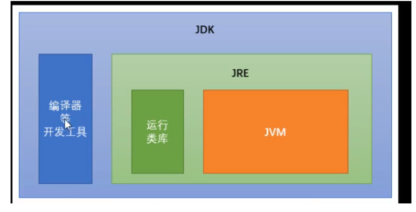

# <span style='color:red;'>进制转换</span>

### 		10->2

​			

### 	2->10

​		

# 存储单元

### 	位(bit)

​		一个数字(0或者一个数字1),代表一位

### 	字节(Byte)

​		每逢8位是一个字节,这是数据存储的最小单位
​				1 KB = 1024 Byte
​				1 MB = 1024KB
​				1 GB = 1024MB
​				1 TB = 1024GB
​				1 PB = 1024TB
​				1 EB = 1024PB
​				1 ZB = 1024EB

# 命令提示符(cmd)

​				启动
​					Win+R
​				切换盘符
​					盘符名称:
​				进入文件夹
​					cd 文件夹名称
​				进入多级文件夹
​					cd 文件夹1\文件夹2\文件夹3
​				返回上一级
​					cd ..
​				直接回根路径
​					cd \
​				查看当前内容
​					dir
​				清屏
​					cls
​				退出
​					exit

# JAVA环境

#### JVM

​								Java虚拟机,是Java程序的运行环境

##### 跨平台

​									任何软件的运行,都必须要运行在操作系统之上,而我们用Java编写的软件可以运行在任何的操作系统上

#### JRE

​									是Java程序的运行时环境,包含JVM和运行所需要的核心类库

#### JDK

​									是Java程序开发工具包,包含JRE和开发人员使用的工具

#### 三者关系



 		

# 配置环境

​		 此电脑 -->属性 -->高级系统设置 -->高级 -->环境变量 -->系统变量 -->添加JAVA_HOME,值为jdk路径 -->path添加jdk的bin路径

# java程序开发

​	1.编写源程序
​		编写.java文件
​	2.编译源程序
​		javac 类名.java
​		生成字节码文件.class
​		D: \> javac HelloWorld. java
​	3.运行
​		java 类名
​		D: \> java HelloWorld
​	4.注意
​		每次修改java文件,都要重新编译java文件

# 程序注释

​				1.// 单行注释
​				2./*
​						 多行注释(区块注释)

​					*/

# 	关键字

### 		特点

​			完全小写的字母
​			有不同的颜色


### 		常见关键字

```
abstract                表明类或者成员方法具有抽象属性
assert                  断言，用来进行程序调试
boolean                 基本数据类型之一，声明布尔类型的关键字
break                   提前跳出一个块
byte                    基本数据类型之一，字节类型
case                    用在switch语句之中，表示其中的一个分支
catch                   用在异常处理中，用来捕捉异常
char                    基本数据类型之一，字符类型
class                   声明一个类
const                   保留关键字，没有具体含义
continue                回到一个块的开始处
default                 默认，例如，用在switch语句中，表明一个默认的分支。Java8 中也作用于声明接口函数的默认实现
do                      用在do-while循环结构中
double                  基本数据类型之一，双精度浮点数类型
else                    用在条件语句中，表明当条件不成立时的分支
enum                    枚举
extends                 表明一个类型是另一个类型的子类型。对于类，可以是另一个类或者抽象类；对于接口，可以是另一个接口
final                   说明最终属性，表明一个类不能派生出子类，成员方法不能被覆盖，成员域的值不能被改变，用来定义常量
finally                 用于处理异常情况，用来声明一个基本肯定会被执行到的语句块
float                   基本数据类型之一，单精度浮点数类型
for                     一种循环结构的引导词
goto                    保留关键字，没有具体含义
if                      条件语句的引导词
implements              表明一个类实现了给定的接口
import                  表明要访问指定的类或包
instanceof              用来测试一个对象是否是指定类型的实例对象
int                     基本数据类型之一，整数类型
interface               接口
long                    基本数据类型之一，长整数类型
native                  用来声明一个方法是由与计算机相关的语言（如C/C++/FORTRAN语言）实现的
new                     用来创建新实例对象
package                 包
private                 一种访问控制方式：私用模式
protected              	一种访问控制方式：保护模式
public                  一种访问控制方式：共用模式
return                  从成员方法中返回数据
short                   基本数据类型之一,短整数类型
static                 	表明具有静态属性
strictfp                用来声明FP_strict（单精度或双精度浮点数）表达式遵循IEEE 754算术规范
super                   表明当前对象的父类型的引用或者父类型的构造方法
switch                  分支语句结构的引导词
synchronized            表明一段代码需要同步执行
this                    指向当前实例对象的引用
throw                   抛出一个异常
throws                  声明在当前定义的成员方法中所有需要抛出的异常
transient               声明不用序列化的成员域
try                     尝试一个可能抛出异常的程序块
void                    声明当前成员方法没有返回值
volatile                表明两个或者多个变量必须同步地发生变化
while                   用在循环结构中
```

# 标识符

### 概念

​								是指在程序中,<u>**我们自己定义内容**</u>
​								比如类的名字,方法的名字和变量的名字等待

### 命名规则

​							标识符可以包含英文字母(区分大小写)
​							0-9(数字)
​						   $(美元符号)
​							_(下划线)
​						**标识符不能以数字开头**
​						**标识符不能是关键字**

### 规范

#### 类名规范

​								首字母大写,后面每个单词首字母大写(大驼峰式)

#### 变量名规范

​								首字母小写,后面每个首字母大写(小驼峰式)

#### 方法名规范

​								首字母小写,后面每个首字母大写(小驼峰式)

# 常量

### 概念

​							在程序运行期间,固定不变的量

### 分类

#### 字符串常量

​									凡是用双引号引起来的部分

#### 整数常量

​									直接写上的数字,没有小数点

#### 浮点数常量

​									直接写上的数字,有小数点

#### 字符常量

​									凡是用单引号引起来的单个字符
​									必须有且只有字符

#### 布尔常量

​									只要两种取值.true,false

#### 空常量

​									null.代表没有任何数据
​									**<u>*不能直接打印*</u>**

# 	数据类型

### 八大基本数据类型

### 数值型

#### 整数型

​									byte
​										1字节8位
​										默认值:0
​										**-128~127**
​									short
​										2字节16位
​										默认值:0
​										-32768~32767
​									int
​										4字节32位
​										默认值:0
​										-2,147,483,648~2,147,483,647(十位数)
​										-2³¹~2³¹-1
​									long
​										8字节64位
​										默认值:0L
​										-9,223,372,036,854,775,808~9,223,372,036,854,775,807（十九位）
​										-2^63~2^63-1

#### 浮点型

​								float
​									4字节32位
​									默认值:0.0F
​									小数点后九位
​								double
​									8字节64位
​									默认值:0.0D
​									小数点后十八位
​									浮点型可能只是一个近似值,并非精确的值

#### 字符型

​								char
​									2字节16位
​									默认值:	'u0000'(空)

#### 布尔型

​								boolean
​									1字节8位
​									默认值:false
​									数据范围与字节数不一定相关.

### 六/三大引用数据类型

​								类
​									class
​								接口
​									interface
​								数组
​									[]
​								字符串
​									String
​								枚举类型
​								注解类型


# 数据类型转换

## 自动类型提升

​						**==只能小变大,不能大变小==** (与字节数无关)

​						需要满足两个条件:

​								1>两种类型是彼此兼容的

​								2>**转换的目标类型**的范围一定要**大于**转换的源类型,即,宗旨就是不能出现数据内存单元的截短,而只能扩大

​						表达式中的数据类型自动提升

​								Java定义了若干适用于表达式的类型提升规则

​										第一、byte，char，short → int

​										第二、如果有一个操作数是long，计算结果为long型

​										第三、如果有一个操作数是float，计算结果为float型

​										第四、如果有一个操作数是double，计算结果为double型

​							==byte==
​    								 ==存数字就是数字,==
​    								 ==存字母会自动转换成对应数字==

​							==char==
​         							==存数字会自动转换成对应字母==
​         							==存字母就是字母==         

## 强制类型转换

### 特点:

​								diamante需要进行特殊的格式处理,不能自动完成

### 格式:

​								范围小的类型  范围小的变量名  =  (范围小的类型) 原本范围大的数据;

### 注意事项

​								1.强制类型转换一般不推荐使用,因为有可能**发生精度损失**(浮点->整数),**数据溢出**(大数->小数)
​								2.byte/short/char这三种类型都可以发生数学运算
​								3.byte/short/char这三种类型在运算的时候,都会被**首先提升为int类型,然后在计算**
​								4.**boolean类型不能发生数据类型转换**

## java中的自动类型提升问题:

### 正向过程:由低字节向高字节自动转换

​									<span style="font-size:24px">==byte→ short/char→ int→ long→ float→ double==</span>							

```java
//自动类型提升,char->int
char a = 'a';
System.out.println(a + 1);
```

> 98

### 逆向过程:使用强制转换,可能丢失精度

​										相等的需要强制转换				

```java
//强制类型转换,int->char
int i = 97;
System.out.println((char)i);
```

> a

## 例题

### 1.数据超出byte类型取值范围

```java
// -128 ~ 127,想象钟表,一个圈,大于127就从-128继续开始,小于-128就从127继续开始
byte b1 = 127;						
byte b2 = (byte) 166;
byte b4 = (byte) -145;
System.out.println(b1);					// 127
System.out.println(b2);					// -90
System.out.println(166-127+(-128));		// 166-127代表溢出多少,+(-128)溢出的量从-128开始计算 -90
// 166-256
System.out.println(-145-(-128)+127);	// -145-(-128)代表溢出多少,+127溢出的量从+127开始计算 111
// 256-145
System.out.println(b4);					// 111
// 127是127,当数据为128时,b = -128,当数据为129时,b = -127
// 127	->	0111 1111 正数,补码还是 0111 1111 -> 127
// 128 不会		
// 不知对不对  166 ->   1010 0110 负数,补码是 1101 1010, 后七位为90,最高位是1,为负数,166 -> -90 
// -145 ->  1 1001 0001 负数,补码是 1 0110 1111,最高位自然丢失即为0110 1111 -> 111
// -129 ->  1 1000 0001 负数,补码是 1 0111 1111, 最高位自然丢失即为0111 1111 -> 127
// -130 -> 	1 1000 0010 负数,补码是 1 0111 1110, 最高位自然丢失即为0111 1110 -> 126
```


# 变量

### 概念		

​								程序运行期间,内容可以发生改变的量
​								数据类型  变量名称  =  数据值;

### 注意事项

​								如果创建多个变量,那么变量之间的名称**不可以重复**
​								对于**float和long**类型来说,字母后缀**F和L**不能丢掉
​								如果使用**byte或者short**类型的变量,那么右侧的数据值不能超过左侧类型的范围
​								没有进行赋值的变量,**不能直接使用**
​								变量使用不能超过作用域的氛围

​										作用域:

​      							  		从定义变量的一行开始,一直到直接所属的大括号结束为止
​								可以通过一个语句来创建多个变量


# 局部变量和成员变量

## 1.定义的位置不一样

​		局部变量:在方法的内部,形参,代码块中
​		成员变量:在方法的外部,直接写在类当中

​					类变量:有static修饰

​					实例变量:没有static修饰

## 2.作用范围不一样

​		局部变量:只用方法当中才可以使用,出了方法就不能在用
​		成员变量:整个类全都可以通用

​			当方法的局部变量和类的成员变量重名的时候,根据"**就近原则**",优先使用局部变量
​				如果需要访问**本类**当中的成员变量,需要使用格式:         	this.成员变量名		通过谁调用的方法,谁就是this

## 3.默认值不一样

​		局部变量:**没有默认值**,如果要想使用,必须手动进行赋值
​		成员变量:如果没有赋值,会**有默认值**

## 4.内存的位置不一样

​		局部变量:位于**栈**内存
​		成员变量:位于**堆**内存

## 5.生命周期不一样

​		局部变量:随着方法**进栈而诞生**,随着**方法出栈**而消失
​		成员变量:**随着对象**创建而诞生,随着对象被垃圾回收而消失

​		类变量:**随着类**的初始化而初始化,随着类的卸载而消亡,该类的所有对象的类变量是**共享的**

​	


# ASCII码表

​	==48   ->   '0'==
​	==65   ->   'A'==
​	==97   ->   'a'==


# 运算符

## 算术运算符

### 加法,+

​								1,对于数值来说,那就是加法
​								2.对于字符char类型来说,在计算之前**,char会被提升为int,然后再计算**
​								3.对于字符串String来说,加号代表字符串**连接操作**

### 减法,-

### 乘法,*

### 除法得到的商,/

​								对于一个整数的表达式来说,除法用的是整除,整数除以整数,结果仍然是整数.只看商,不看余数

### 除法得到的余数(取模),%

​								只有对于整数的除法来说,取模运算符才有余数的意义

### 自增/减	​

#### 自增: 操作数的值增加1,++	​

#### 自减: 操作数的值减少1,--

#### 使用方式

​									1.单独使用:不和其他任何操作混合,自己独立成为一个步骤
​									2.混合使用:和其他操作混合,例如与赋值混合,或者与打印操作混合

#### 使用区别

​									1.**单独使用**的时候,前++和后++**没有任何区别**
​									2.在混合的时候,有【重大区别】
​											A:如果是【前++】,那么变量【立刻马上+1】，然后拿着结果进行使用
​													先加后用,++i
​											B:如果是【后++】，那么首先使用变量本来的数值，【然后再让变量+1】
​													先用后加,i++

#### 注意事项

​									只用变量才能使用自增,自键运算符.常量不可发生改变,所以不能用

### 注意事项

​								一旦运算当中有**不同类型**的数据,那么结果将会是**数据类型范围大**的那种

## 赋值运算符

### 基本赋值运算符

​								就是一个等号"="

### 复合赋值运算符		

| 复合赋值运算符 | 应用     | 相当于        |
| -------------- | -------- | ------------- |
| +=             | a  +=  3 | a  =  a  +  3 |
| -=             | b  -=  4 | b  =  b  -  4 |
| *=             | c  *=  5 | c  =  c  *  5 |
| /=             | d  /=  6 | d  =  d  /  6 |
| %=             | e  %=  7 | e =  e  %  7  |

#### 注意事项

​									1.只有**变量**才能使用赋值运算符,**常量不能进行赋值**
​									2.复合赋值运算符其中**隐含了一个强制类型转换**

## 比较运算符

| 比较运算符 | 解释                                                         |
| ---------- | ------------------------------------------------------------ |
| ==         | 检查如果两个操作数的值是否相等，如果相等则条件为真。         |
| !=         | 检查如果两个操作数的值是否相等，如果值不相等则条件为真。     |
| >          | 检查左操作数的值是否大于右操作数的值，如果是那么条件为真     |
| <          | 检查左操作数的值是否小于右操作数的值，如果是那么条件为真     |
| >=         | 检查左操作数的值是否大于或等于右操作数的值，如果是那么条件为真。 |
| <=         | 检查左操作数的值是否小于或等于右操作数的值，如果是那么条件为真。 |

#### 注意事项

​									1.比较运算符的结果一定是一个**boolean值**,成立就是true,不成立就是false
​									2.如果进行多次判断,不能连这些
​											程序当中【不允许】这种写法: 1  <  x  <  3

## 逻辑运算符

| 逻辑运算符 | 解释                                                         |
| ---------- | ------------------------------------------------------------ |
| &&         | 与。当且仅当两个操作数都为真，条件才为真<br />全都是true,才是true;否则就是false |
| \|\|       | 或。如果任何两个操作数任何一个为真，条件为真<br/>至少一个是true,就是true;全都是false,才是false |
| !          | 非。用来反转操作数的逻辑状态<br/>本来是true,变成false;本来是false,变成true |

#### 短路效果

​									与"&&",或"||",具有短路效果
​									如果根据左边已经可以判断得到最终结果,那么右边的代码将不在执行,从而节省一定的性能
​									因为&&两个true才为true
​											当左边是false,,结果肯定是false,那么右边代码不在执行
​									因为||两个false才为false
​											当左边是true,结果肯定是true,那么右边的代码不再执行

### 注意事项:

​								1,逻辑运算符只能用boolean值
​								2.与,或需要左右各自有一个boolean值,但是取反只要有唯一的一个boolean值即可
​								3.与,或两种运算符,如果有多个条件,可以连续写
​										两个条件
​												条件A  &&  条件B
​										多个条件
​												条件A  &&  条件B  && 条件C

## 三元运算符

### 一元运算符

​							只需要一个数据就可以进行操作的运算符
​								例如:取反!,自增++,自减--

### 二元运算符

​							需要两个数据才可以进行操作的运算符
​									例如:加法+,赋值=

### 三元运算符

​							需要三个数据才可以进行操作的运算符

#### 格式:

​									数据类型  变量名称  =  条件判断  ?  表达式A  :  表达式B

#### 流程:

​									首先判断条件是否成立
​										如果成立为true,那么将表达式A的值赋值给左侧的变量
​										如果不成立为false,那么将表达式B的值赋值给左侧的变量

#### 注意事项

​									1.必须同时保证表达式A和表达式B都符合**左侧数据类型**的要求
​									2.三元运算符的结果**必须被使用**

# JShell

JShell脚本工具是JDK9的新特性
当我们编写的代码非常少的时候,而又不愿意编写类,main方法,也不愿意去编译和运行,这个时候可以使用JShell工具


# 编译器的两点优化

## 一

​		对于byte/short/char三种类型来说,如果右侧赋值的数值没有超过范围,那么javac编译器将会自动隐含地为我们补上一个(byte)(short)(char)
​			1.如果没有超过左侧的范围,编译器补上强转
​			2.如果右侧超过了左侧范围,那么直接编译器报错
​				byte  b  =  /* (byte)  */ 30;
​				char c = / * (char)*/ 65;

## 二,编译器的常量优化

​		再给变量进行赋值的时候,如果右侧的表达式当中全都是常量,没有任何变量,那么编译器javac将会直接将若干个常量表达式计算得到结果
​			short  result  =  5  +  8;
​					等号右边全都是常量,没有任何变量参与运算
​					编译之后,得到的.calss字节码文件当中相当于直接就是	== >	short  result  =  13;
​					右侧的常量结果数值,没有超过左侧范围,所以正确

### 注意事项

​							一旦表达式当汇总有**变量参与**,那么就不能进行这种优化了

# 流程结构

## 顺序结构

​						就是从上向下依次执行

## 选择结构

### if

#### 单if语句

```java
/*
首先判断关系表达式看其结果是true还是false
	如果是true就执行语句体
	如果是false就不执行语句体
*/
if(关系表达式) {
    语句体;
}
```

#### if...else

​		

```java
/*	
	首先判断关系表达式看其结果是true还是false
		如果是true就执行语句体1
		如果是false就执行语句体2
						*/	
if(关系表达式) {
    语句体1;
} else {
    语句体2;
}
```

#### if...else if ...else

```java
/*
	首先判断条件1看其结果是true还是false
		如果是true就执行语句体1
		如果是false就判断条件2看其结果是true还是false
			如果是true就执行语句体2
			如果是false就判断条件...看其结果是true还是false
			如果都不满足,就执行语句体n+1
	*/
if(判断条件1) {
    语句体1;
} else if(判断条件2) {
    语句体2;
}
....
else if(判断条件n) {
    语句体n;
}else{
    语句体n+1;
}
```

### switch			

```java
/*
	首先计算出表达式的值
    	其次,和case依次比较,一旦有对应的值,就会执行相应的语句,在执行的过程中,遇到break就会结束
        	最后,如果所有的case都和表达式的值不匹配,就会执行default语句体部分,然后程序结束掉
           
*/

switch(表达式) {
    case 常量值1:
        语句1;
        break;
    case 常量值2:
        语句2;
        break;
        .....
   case 常量值n:
        语句n;
        break;
    default:
        语句n;
        break;
}
```

####  注意事项

​									1.多个case后面的数值不可以重复
​									2.switch后面小括号当中只能是下列数据类型:可以是表达式，也可以（并通常）是变量
​											基本数据类型:**byte/short/char/int**
​											引用数据类型:**String字符串.enum枚举**
​									3.switch语句格式可以很灵活:前后顺序可以颠倒,而且break语句还可以省略
​											匹配到哪一个case就从哪一个位置向下执行,直到遇到break或者整体结束为止

## 循环结构

### 循环结构的基本组成部分

##### 初始化语句

​										再循环开始最初执行,而且只做唯一一次

##### 条件判断

​										如果成立,则循环继续;如果不成立,则循环退出

##### 循环体

​										重复要做的事情内容,若干行语句

##### 步进语句

​										每次循环之后都要进行的扫尾工作,每次循环结束后都要执行一次

### for

```java
for(初始化表达式①;布尔表达式②; 步进表达式④) {
    循环体③
}
/*
	执行顺序
    	①②③④  >  ②③④  >  ②③④  ....  ②不满足为止
        ①负责完成循环变量初始化
        ②负责判断是否满足循环条件,不满足则跳出循环
        ③具体执行的语句
        ④循环后,循环条件所涉及变量的变化情况

*/
```

### while

#### 标准格式

```java
while (条件判断) {
    循环体
}
```

#### 扩展格式

```java
初始化表达式①
while (布尔表达式② ) {
    循环体③;
    步进表达式④;
}

/*
	执行顺序
		①②③④  >  ②③④  >  ②③④  ....  ②不满足为止
        ①负责完成循环变量初始化
        ②负责判断是否满足循环条件,不满足则跳出循环
        ③具体执行的语句
        ④循环后,循环条件所涉及变量的变化情况
*/
```

### do...while

#### 标准格式

```java
do{
    循环体
}while (条件判断);
```

#### 扩展格式

```java
初始化表达式①;
do{
    循环体③;
    步进表达式④;
}while (布尔表达式② ) 
    
/*
	执行顺序
		①③④  >  ②③④  >  ②③④  ....  ②不满足为止
        ①负责完成循环变量初始化
        ②负责判断是否满足循环条件,不满足则跳出循环
        ③具体执行的语句
        ④循环后,循环条件所涉及变量的变化情况
*/
```

### 区别

​								1.如果条件判断从来没有满足过,那么for循环和while循环将会执行0次,但是**do-while循环会执行至少一次**
​								2.for循环的变量在小括号当中定义的,只有循环内部才可以使用,while循环和do-while循环初始化语句本来就在外面,所以出来循环之后还可以继续使用

### 关于循环的选择

​								凡是**次数确定**场景**多用for循环**;否则多用while循环

### 循环控制语句

#### break

​									常见用法有两种
​											1.可以用在switch语句当中,一旦执行,整个switch语句立刻结束
​											2.还可以用在循环语句当中,一旦执行,整个循环语句立刻结束.打断循环

```java
for (int i = 1; i <= 10; i++) {
    if (i == 4) {
        break;    // 到i==4,跳出for循环
    }
    System.out.println("第" + i + "个");
}
```

> 第1个
> 第2个
> 第3个

#### continue

​					一旦执行,立刻跳过当前次循环剩余内容,马上开始下一次循环

```java
for (int i = 1; i <= 10; i++) {
    if (i == 4) {
        continue;   
        //到i==4,跳出本次循环,进行下次i=5循环,(没有第4个)
    }
    System.out.println("第" + i + "个");
}
```

> 第1个
> 第2个
> 第3个
> 第5个
> 第6个
> 第7个
> 第8个
> 第9个
> 第10个


# Integrated Development Environment ,IDE,集成开发环境

# IntelliJ IDEA 

​		https://www.jetbrains.com/
​			IntelliJ IDEA   Ultimate  .exe

## 创建项目

​						Empty Protect

## 使用

### 设置字体

​							File	-->	Editor	-->	Font

### 设置补全快捷键

​							File		-->	Keymap	-->	Default copy	-->	Code	-->	Completion	-->	Basic	-->	双击修改

### 快捷键

| 用途                                   | 快捷键                                                       |
| -------------------------------------- | ------------------------------------------------------------ |
| 复制光标所在行的内容，插入光标位置下面 | Ctrl+D                                                       |
| 查找文本                               | Ctrl+F                                                       |
| 替换文本                               | Ctrl+R                                                       |
| 自动代码                               | Ctrl+J                                                       |
| 查看方法参数                           | Ctrl+P                                                       |
| 删除光标所在行                         | Ctrl+Y                                                       |
| 单行注释，再按取消注释                 | Ctrl+/                                                       |
| 关闭当前页面                           | Ctrl+F4                                                      |
| 进入类/方法                            | Ctrl+左键                                                    |
| 选中代码注释，多行注释，再按取消注释   | Ctrl+Shift+/                                                 |
| 取消撤回                               | Ctrl+Shift+Z                                                 |
| 格式化                                 | Ctrl+Alt+L                                                   |
| 优化导入的类和包                       | Ctrl+Alt+O                                                   |
| 替换                                   | Ctrl+Alt+R                                                   |
| 可以把代码包在一个块内:try             | Ctrl+Alt+T                                                   |
| 生成对象(同.var)                       | Ctrl+Alt+V                                                   |
| 新建                                   | Ctrl+Alt+insert                                              |
| 进入实现类/重写方法                    | Ctrl+Alt+左键                                                |
| 导入包,提示错误                        | Alt+Enter                                                    |
| 自动生成代码，toString, get, set等方法 | Alt+Insert<br />构造方法-->Constructor-->Select None-->全选  ->  OK<br/>Set/Get方法-->Getter and Setter-->全选  ->  OK |
| 移动当前代码行                         | Alt+上下箭头(自己修改的)                                     |
| 修改项目环境版本                       | Ctrl+Alt+Shift+S                                             |
| 重命名                                 | Shift+F6                                                     |
| 修改模板:                              | Editor ->File and Code Templates                             |
| html打开浏览器                         | Tools -> Web Browsers                                        |
| module环境                             | Build -> Java Compiler                                       |


​					Alt+Shift+上下箭头
​					
​						选中方法则移动整个方法


# 	内存图

​		Java的内存需要划分成为5个部分

## 1.栈(Stack)

​				存放的都是方法中的**局部变量**.方法的运行一定要在栈当中运行
​					局部变量:方法的参数,或者是方法{}内部的变量
​					作用域:一旦超出作用域,立刻从栈内存当中消失
​					**方法运行完就出栈**

## 2.堆(Heap)

​						凡是**new出来的东西,**都在堆当中,**实例变量**,数组
​						堆内存里面的东西都有一个地址值:16进制

## 3.方法区(Method Area)

​						存储**.class相关信息**,包含方法的信息,**静态变量,常量**

## 4.本地方法栈(Native Method Stack)

​						与操作系统相关

## 5.寄存器(pc Register)

​						与CPU相关

# 	数组

## 概念

​						是一种容器,可以同时存放多个数据值

## 特点

​						1.数组是一种引用数据类型
​						2.数组当中的多个数据,类型必须统一
​						3.数组的长度在程序运行期间不可改变

## 数组的初始化

​						在内存当中创建一个数组,并且向其中赋予一些默认值

### 方式

#### 1.动态初始化(指定长度)

​									在创建数组的时候,直接指定数组当中的数据元素个数

##### 格式

​									==数据类型[]  数组名称  =  new  数据类型[数组长度];==

###### 解析含义:

​										左侧数据类型:
​												也就是数组当中保存的数据,全都是**统一的**什么类型
​										左侧的中括号
​											代表是一个数组
​										左侧数组名称
​											给数组取一个名字
​										右侧的new
​											代表创建数组的动作
​										右侧数据类型
​											必须和左边的数据类型保持一致
​										右侧中括号的长度
​											也就是数组当中,到底可以保存多少个数据,是一个int数字

#### 2.静态初始化(指定内容)

​									在创建数组的时候,不直接指定数据个数多少,而是直接将具体的数据内容进行指定

##### 基本格式

​									==数据类型[]  数组名称 = new 数据类型[]{元素1,元素2,.... };==

##### 省略格式

​									==数据类型[]  数组名称  =  { 元素1,  元素2,  ....};==

##### 注意事项

​									1.虽然静态初始化没有直接告诉长度,但是根据大括号里面的元素具体内容,也可以自动推算出来长度
​									2.静态初始化标准格式可以拆分为两个步骤
​											==数据类型[]  数组名称;==
​											==数组名称  =  new 数据类型[]{元素1,元素2,.... };==
​									3.静态初始化也可以拆分为两个步骤
​											==数据类型[]  数组名称;==
​											==数组名称  = new  数据类型[数组长度];==
​									4.静态初始化一旦使用省略格式,就不能拆分称为两个步骤了
​									5.静态初始化其实**也有默认值的过程**,只不过**系统自动马上**将默认值替换成为了大括号当中的具体数值

##### 使用建议

​									如果不确定数组当中的具体内容,用动态初始化;否则,已经确定了具体的内容,用静态初始化

## 访问元素

​					直接打印数组名称,得到的是数组对应的"内存地址哈希值"
​								访问数组元素的格式:	数组名称[索引值]
​										索引值:就是一个int数字,代表数组当中元素的编号
​										从"0"开始,一直到"数组的长度 - 1"为止

## 数组的长度

```java
数组名.length
```

## 数组的遍历

```java
for (int i = 0; i < 数组名.length; i++) {
    System.out.println(数组名[i]);
}
```

## 打印数组

```java
Arrays.toString(数组名);
```

## 数组最大值/最小值

```java
int max = 数组名[0];
for (int i = 0; i < 数组名.length; i++) {
    if (max < 数组名[i]) {
        max = 数组名[i];
    }
}
```

## 数组反转

```java
int tmp;
for (int i = 0; i < array.length / 2; i++) {
    tmp = array[i];
    array[i] = array[array.length - 1 - i];
    array[array.length - 1 - i] = tmp;
}
for (int min = 0, max1 = arr.length - 1; min < max1; min++, max1--) {
    int tmp1 = arr[min];
    arr[min] = arr[max1];
    arr[max1] = tmp1;
}
```

# 索引

## 索引的基本原理

​					索引用来快速地寻找那些具有特定值的记录。如果没有索引，一般来说执行查询时遍历整张表。
​					索引的原理:就是把无序的数据变成有序的查询
​							1.把创建了索引的列的内容进行排序
​							2.对排序结果生成倒排表
​							3.在倒排表内容上拼上数据地址链
​							4.在查询的时候，先镎到倒排表内容，再取出数据地址链,从而拿到具体数据


# 冒泡排序

​			两个相邻位置比较,如果前面的元素比后面的元素大,就换位置,大的在后面

​			每次都是以 第一个和第二个进行比较 开始

​			每次比较后,确定最后一个位置的数字

```java
public class BubbleSort {
    public static void main(String[] args) {
        int[] arr1 = {12,58,69,10,31};
        System.out.print("原始数组：");
        print(arr1);								// 原始数组：12, 58, 69, 10, 31
        bubbleSort(arr1);
        System.out.print("冒泡排序：");
        print(arr1);								// 冒泡排序：10, 12, 31, 58, 69
    }

    /*
	 * 
	 * 		冒泡排序
	 * 		1，返回值类型，void
	 * 		2，参数列表，int[] arr
	 * 		  				i和j都是从0开始										j的取值范围
	 *		第一次：arr[0]与arr[1], arr[1]与arr[2], arr[2]与arr[3], arr[3]与arr[4]比较四次
	 		第二次：arr[0]与arr[1], arr[1]与arr[2], arr[2]与arr[3]比较三次
	 		第三次：arr[0]与arr[1], arr[1]与arr[2]比较两次
i的取值范围	 第四次：arr[0]与arr[1]比较一次
	 * 
	 * 		总长度length是五次，i是次数，j是比较次数
	 * 		j = length - i
	 * 
	 * 		i:0~4
	 * 		j:第一次循环是0~4，第二次循环是0~3，第三次是0~2，第四次是0~1
	 * 
	 */

    public static void bubbleSort(int[] arr) {
        /*
		 * 		外循环控制次数
		 * 		内循环控制一次的比较次数
		 * 
		 * */

        for (int i = 0; i < arr.length - 1; i++) {					// 外循环只需要比较arr.length-1次就可以了
            for (int j = 0; j < arr.length - 1 - i; j++) {		 	// - 1 为了if语句j+1防止索引越界,-i为了提高效率(-i不要也不错)
                if (arr[j] > arr[j + 1]) { 							// 第j+1个和第j+2个比较
                    /*int temp = arr[j];
					arr[j] = arr[j + 1];
					arr[j + 1] = temp;*/
                    swap(arr,j,j+1);
                }
            }
        }
    }
    
    
    /*
	 * 	打印数组
	 * 	1，返回值类型，void
	 * 	2，参数列表int[] arr
	 * 
	 */
    public static void print(int[] arr) {
        for (int i = 0; i < arr.length; i++) {
            if(i == arr.length - 1) {
                System.out.print(arr[i]);
            }else {
                System.out.print(arr[i] + ", ");
            }
        }
    }
    
    /*
	 * 
	 * 		换位操作
	 * 		1，返回值类型，void
	 * 		2，参数列表int[] arr, int i ,int j
	 * 	
	 * 		如果某个方法，只针对本类使用，不想让其他类使用就可以定义成私有的
	 */
	private static void swap(int[] arr, int i ,int j) {
		int temp = arr[i];
		arr[i] = arr[j];
		arr[j] = temp;  
	}
}
```

# 选择排序

​					用一个索引位置上的元素,依次与其他索引位置上的元素比较,小的放在前面,大的放在后面

​					每次以 下一个数字与后面的数字进行比较 开始

​					每次比较,确定第一个位置,下次由后一位(下一个)进行向后比较

```java
public class SelectSort {
	public static void main(String[] args) {	
		int[] arr2 = {22,99,66,11,33};
		System.out.print("原始数组：");
		print(arr2);									// 原始数组：22, 99, 66, 11, 33
		selectSort(arr2);
		System.out.print("选择排序：");
		print(arr2);									// 选择排序：11, 22, 33, 66, 99
	}	
	
	/*
	 * 
	 * 		选择排序
	 * 		1，返回值类型，void
	 * 		2，参数列表，int[] arr
	 * 
	 *		第一次：arr[0]与arr[1], arr[0]与arr[2], arr[0]与arr[3], arr[0]与arr[4]比较四次
	 		第二次：arr[1]与arr[2], arr[1]与arr[3], arr[2]与arr[4]比较三次
	 		第三次：arr[2]与arr[3], arr[1]与arr[4]比较两次
	 		第四次：arr[3]与arr[4]比较一次
	 		  				i		   j		     j的取值范围	
	 		第一次：		arr[0]分别与arr[1-4]比较，比较四次
	 		第二次：		arr[1]分别与arr[2-4]比较，比较三次
	 		第三次：		arr[2]分别与arr[3-4]比较，比较两次
i的取值范围	第四次：		arr[3]与arr[4]比较，比较一次
	 * 
	 */
	
	public static void selectSort(int[] arr) {
		/*
		 * 		外循环控制比较的数和次数
		 * 		内循环控制被比较数和一次的比较次数
		 * 		
		 * 
		 * */
		for (int i = 0; i < arr.length - 1; i++) {			//i:0~4
			for (int j = i + 1; j < arr.length; j++) {		//j:第一次循环是1~4，第二次循环是2~4，第三次是3~4，第四次是4
				if(arr[i] > arr[j]) {
					/*int temp = arr[i];
					arr[i] = arr[j];
					arr[j] = temp;*/
					swap(arr,i,j);
				}
			}
		}
	}
	
	/*
	 * 	打印数组
	 * 	1，返回值类型，void
	 * 	2，参数列表int[] arr
	 * 
	 */
	public static void print(int[] arr) {
		for (int i = 0; i < arr.length; i++) {
			if(i == arr.length - 1) {
				System.out.print(arr[i]);
			}else {
				System.out.print(arr[i] + ", ");
			}
		}
		
	}
	
	/*
	 * 
	 * 		换位操作
	 * 		1，返回值类型，void
	 * 		2，参数列表int[] arr, int i ,int j
	 * 	
	 * 		如果某个方法，只针对本类使用，不想让其他类使用就可以定义成私有的
	 */
	private static void swap(int[] arr, int i ,int j) {
		int temp = arr[i];
		arr[i] = arr[j];
		arr[j] = temp;  
	}	
	
}
```


# 二分查找

```java
/**
 * 

 * 		B:注意事项
 * 			如果数组无序，就不能使用二分查找
 * 			因为如果你排序了，但是你排序的时候已经改变了我最原始的元素索引
 * 
 *
 */
public class Thirteen_Erfen {
	public static void main(String[] args) {
		int[] arr = { 11, 22, 33, 44, 55, 66, 77, 88 };
		System.out.println(getIndex(arr, 22));					// 1
		System.out.println(getIndex(arr, 77));					// 6
		System.out.println(getIndex(arr, 56));					// -1
	}

	/*
	 * 
	 * 		二分查找
	 * 		1,返回值类型,int
	 * 		2,参数列表int[] arr ,int value
	 * 
	 */
	public static int getIndex(int[] arr,int value) {
		int min = 0;
		int max = arr.length-1;
		int mid = (min + max) / 2;
		
		while(arr[mid] != value) {							//当中间值不等于要找的值，就开始循环查找
			if(arr[mid] < value) {							//当中间值小于要找的值，
				min = mid + 1;								//最小的索引改变
			}else if(arr[mid] > value) {					//当中间值大于要找的值，
				max = mid - 1;								//最大的索引改变
			}
			
			mid = (min + max) / 2;							//无论最大还是最小改变，中间索引都会随之改变
			
			if(min > max) {									//如果最小索引大于最大索引
				return -1;
			}
		}
		
		return mid;
		
	}
}
```

# Arrays

​					public static String toString(int[] a):			数组转字符串

​					public static void sort(int[] a):					排序

​					public static int binarySearch(int[] a,int key):			 二分查找,key是需要查询的值

​								不存在的返回**负**的**插入点 ** **-1**,(插入点:如果这个值存在,那么应该在的位置)

​					static <T> List<T> asList(T... a)  		返回由指定数组支持的固定大小的列表。

​					static byte[] copyOf(byte[] original, int newLength) 		复制指定的数组，用零截取或填充，以便复制具有指定的长度。  

​					static char[] copyOf(char[] original, int newLength)  		复制指定的数组，截断或填充空字符，以便复制具有指定的长度。 

 

```java
public class Demo_Arrarys {
    public static void main(String[] args) {
        int[] arr = {11,22,33,44};

        System.out.println(Arrays.toString(arr));	// [11, 22, 33, 44]

        //排序
        int[] arr2 = {12,456,2,123,85,23};
        System.out.println("arr2原始:"+Arrays.toString(arr2));	// arr2原始:[12, 456, 2, 123, 85, 23]
        Arrays.sort(arr2);
        System.out.println("使用sort:"+Arrays.toString(arr2));	// 使用sort:[2, 12, 23, 85, 123, 456]

        System.out.println(Arrays.binarySearch(arr, 33));			// 2
        //不存在的返回负的插入点-1，34在33后面，33索引值为2，那么插入点为3，那么返回值为（-插入点）-1
        System.out.println(Arrays.binarySearch(arr, 34));			// -4 			
        System.out.println(Arrays.binarySearch(arr, 1));			// -1
    }
}
```


# 	数据结构

## 数组

​					查询快,修改也快
​					增删慢

## 链表

​					查询慢,修改也慢
​					增删快

## 栈

​					先进先出

## 队列

​					先进先出

## 红黑树

​			

​	用LinkedList模拟


# 面向对象

## 概述

### 面向过程:

​								当需要实现一个功能的时候,每一个具体的步骤都要亲力亲为,详细处理每一个细节
​								**每一个步骤都要自己写**
​										强调的是**步骤**

### 面向对象

​								当需要实现一个功能的时候,不关心具体的步骤,而是找一个已经具有该功能的方法,帮忙做事
​								找一个**JDK给我们提供的类**,类中有方法
​										强调的是**对象**

## 	特征

### 封装

### 继承

### 多态

### (抽象)

## 类

​					是一组相关**属性**和**行为**的集合,
​					属性
​						成员变量(一般情况)
​						就是该事物的状态信息
​					行为
​						成员方法
​						就是该事物能够做什么

## 对象

​						是一类事物的具体体现.对象是类的一个实例,必然具备该类事物的属性和行为

## 类与对象的关系

​						类是对一类事物的表述,是抽象的
​						对象是一类事物的实例,是具体的
​						类是对象的模板
​						对象是类的实体


# 封装

​				封装就是将一些细节信息隐藏起来,对于外界不可见
​				1.**方法**就是一种封装
​				2,**关键字private**也是一种封装
​					一旦使用了private进行修饰,那么本类当中仍然可以随意访问,但是,超出了本类范围之外,就不能再直接访问了
​					间接访问private成员变量,就是定义一对Getter/Setter方法


# Bean

​			一个标准的类通常要拥有下面四个组成部分
​				1.所有的成员变量都要使用**private**关键字修饰
​				2.为每一个成员变量编写一对**Getter/Setter**方法
​				3.编写一个**无参数**的构造方法
​				4.编写一个**全参数**的构造方法


# 	方法

## 概述

​						就是将一个功能抽取出来,把代码单独定义在一个大括号内,形成一个单独的功能
​						方法其实就是若干语句的功能集合
​								参数(原料):就是进入方法的数据
​								返回值(产出物):就是从方法中出来的数据

## 格式

```java
修饰符  返回值类型 方法名(参数类型  参数名称,....) {
    方法体;
    return  返回值;
}

/*
	修饰符
		public protected (default) private
	返回值类型
		也就是方法最宠产生的数据结果是什么类型
    方法名称
		方法的名字,规则和变量一样,小驼峰
    参数类型
		进入方法的数据是什么类型
	参数名称
		进入方法的数据对应的变量名称
		参数如果有多个,使用逗号进行分隔
	方法体
		方法需要做的事情,若干行代码
	return
		两个作用
			第一停止当前方法
			第二将后面的返回值还给调用处
	返回值
		也就是方法执行后最终产生的数据结果
*/
```

## 创建方法注意三要素

​								==返回值类型==
​								==方法名称==
​								==参数列表==

## 注意事项

​							1.方法定义的先后顺序无所谓
​							2.方法的定义**不能产生嵌套包含**关系
​							3.方法定义好了之后,不会自己执行.如果要想执行,一定要进行方法的【调用】
​							4.return后面的【返回值】,必须和方法名称前面的【返回值类型】,保持对应
​							5.返回值类型固定写为void,这种方法只能**单独调用**,不能进行打印调用或者赋值调用
​							6.对于一个void没有返回值的方法,不能写return后面的返回值,只能写return自己
​							7.对于一个void方法当中最后一行的return可以省略不写
​							8.一个方法当中可以有多个return语句,但是必须保证同时**只有一个会被执行到**,两个return不能连写

## 调用

### 1.单独调用

​								方法名称(参数);

### 2.打印调用

​								System.out.println(方法名称(参数));

### 3.赋值调用

​								数据类型  变量名称  =  方法名称(参数);

# 构造方法

## 概念

​						给对象的数据(属性)进行初始化

## 构造方法格式特点

​						a:方法名和类名相同(大小也要和类名一致)

​						b:没有返回值类型,连void都没有

​						c:没有具体的返回值return,但是有return语句,格式是return;一般省略了

## 注意事项

​						1.构造方法不能被对象调用

​						2.构造方法是一种特殊的方法，它是一个与类同名的方法。
​						3.对象的创建就是通过构造方法来完成，其功能主要是完成对象的初始化。
​						4.当类实例化一个对象时会自动调用构造方法。构造方法和其他方法一样也**可以重载。**

​						5:如果我们没有给出构造方法，系统将自动提供一个无参构造方法。

​						6:如果我们给出了构造方法，系统将不再提供默认的无参构造方法。

​								注意：这个时候，如果我们还想使用无参构造方法，就必须自己给出。建议永远自己给出无参构造方法

# 创建对象的步骤

Student s = new Student();

​	1,main方法进入方法区,Student.class加载进内存,进入方法区

​	2,主方法进栈,声明一个Student类型引用s,Student s

​	3,在堆内存创建对象,new Student(),开辟空间有一个地址值 

​	4,给对象中属性默认初始化值,给属性进行默认赋值,在堆中

​	5,属性进行显示初始化,把自己在类中设置的值赋值给变量,在堆中

​	6,构造方法进栈,构造方法中又有赋值,对对象中的属性赋值,构造方法弹栈,堆中的数据更改

​	7,将对象的地址值赋值给s


```java
public class Demo1_Student {
	
	public static void main(String[] args) {
        Student s = new Student();
        s.show();
    }
}

class Student{
    private String name = "张三";
    private int age = 23;
    
    public Student(){
        name = "李四";
        age = 24;
    }
    public void show(){
        System.out.println(name + "..." + age);
    }
}
```


# static

##  static关键字的特点

​				 1:随着类的加载而加载
​				 2:优先于对象存在
​	 			3:被类的所有对象共享
​			 				共性用静态static，特性（特有的属性）用非静态
​	 			 4:可以通过类名调用
​							 其实它本身也可以通过对象名调用
​							 推荐使用类名调用
​							 静态修饰的内容一般我们称其为：与类相关的类成员

## static的注意事项

### 1:在静态方法中是没有this关键字的

​								静态是随着**类的加载**而加载，this是随着**对象的创建**而存在。

​								静态比对象先存在。

### 2:静态方法只能访问静态的成员变量和静态的成员方法

#### 静态方法：

​									成员变量：只能访问静态变量

​									成员方法：只能访问静态成员方法

#### 非静态方法：

​									成员变量：可以是静态的，也可以是非静态的

​									成员方法：可是是静态的成员方法，也可以是非静态的成员方法。

#### 简单记：

​									静态只能访问静态。

#### 另一种记法

​									静态相当于解压缩文件，非静态相当于压缩文件
​									静态的是解压缩文件，可以直接查看
​									非静态是压缩文件，想查看就要先解压缩---》创建对象就相当于解压缩的过程

## 静态变量和成员变量的区别

​					静态变量也叫**类变量**，成员变量也叫**对象变量**,	static：属性值共享，所有对象都共用该属性值

### 1：所属不同

​								静态变量属于类，所以也称为类变量
​								成员变量属于对象，所以也称为实例变量（对象变量）

### 2：内存中位置不同

​								静态变量存储于***方法区的静态区***
​								成员变量存储于***堆内存***

### 3：内存出现时间不同

​								静态变量随着类的加载而加载，随着**类的消失**而消失
​								成员变量随着对象的创建而存在，随着**对象的消失**而消失

### 4：调用不同

​								静态变量可以通过类名调用，也可以通过对象调用
​								成员变量只能通过对象名调用


## 静态方法

​					如果一个类中所有的方法都是静态的，需要再多做一步，私有构造方法，
​					目的是不让其他类创建本类对象

# main方法的格式详细解释

## 格式

​						public static void main(String[] args) {}

## 针对格式的解释

​						public 被jvm调用，访问权限足够大。

​						static 被jvm调用，不用创建对象，直接类名访问

​						void被jvm调用，不需要给jvm返回值

​						main 一个通用的名称，虽然不是关键字，但是被jvm识别

​						String[] args 以前用于接收键盘录入的

# 代码块

## 概述

​						在Java中，使用{}括起来的代码被称为代码块。

## 分类

​						根据其位置和声明的不同，可以分为**<u>局部代码块</u>**，**<u>构造代码块</u>**，**<u>静态代码块</u>**，**<u>同步代码块</u>**(多线程)。

## 常见代码块的应用

### 局部代码块

​								只要是和局部有关的,都是和方法有关的

​								在方法中出现；限定变量生命周期，及早释放，提高内存利用率

### 构造代码块 (普通代码块/初始化块)

​								在类中方法外出现；多个构造方法方法中相同的代码存放到一起，**每次调用构造都执行**，并且在**构造方法前**执行

### 静态代码块 

​								在类中方法外出现，并加上static修饰；用于给类进行初始化，在加载的时候就执行，并且只执行一次。

​								一般用于加载驱动

## 代码块实例

```java
public class Test {
	public static void main(String[] args) {
		Father son = new Son();
		System.out.println(".................");
		
		Father son1 = new Son();
		System.out.println(".................");
		
		Son son2 = new Son();
	}
}

class Father{
	public Father() {
		System.out.println("父类无参构造方法");
	}
	private static int a = Help.fatherStaticMemberVarInit();
	static {
		System.out.println("父类静态代码块1");
	}
	{
		System.out.println("父类普通代码块1");
	}
	private  int b = Help.fatherMemberVarInit();
	{
		System.out.println("父类普通代码块2");
	}
	static {
		System.out.println("父类静态代码块2");
	}
	public Father(int v) {
		System.out.println("父类带参构造方法");
	}
}

class Son extends Father{
	static {
		System.out.println("子类静态代码块1");
	}
	private static int a = Help.sonStaticMemberVarInit();
	static {
		System.out.println("子类静态代码块2");
	}
	{
		System.out.println("子类普通代码块1");
	}
	private  int b = Help.sonMemberVarInit();
	{
		System.out.println("子类普通代码块2");
	}
	public Son() {
		System.out.println("子类无参构造方法");
	}
}

class Help{
	public static int fatherStaticMemberVarInit() {
		System.out.println("父类静态成员变量");
		return 0;
	}
	public static int fatherMemberVarInit() {
		System.out.println("父类普通成员变量");
		return 0;
	}
	public static int sonStaticMemberVarInit() {
		System.out.println("子类静态成员变量");
		return 0;
	}
	public static int sonMemberVarInit() {
		System.out.println("子类普通成员变量");
		return 0;
	}
}
```

> 父类静态成员变量
> 父类静态代码块1
> 父类静态代码块2
> 子类静态代码块1
> 子类静态成员变量
> 子类静态代码块2
> 父类普通代码块1
> 父类普通成员变量
> 父类普通代码块2
> 父类无参构造方法
> 子类普通代码块1
> 子类普通成员变量
> 子类普通代码块2
> 子类无参构造方法
> .................
> 父类普通代码块1
> 父类普通成员变量
> 父类普通代码块2
> 父类无参构造方法
> 子类普通代码块1
> 子类普通成员变量
> 子类普通代码块2
> 子类无参构造方法
> .................
> 父类普通代码块1
> 父类普通成员变量
> 父类普通代码块2
> 父类无参构造方法
> 子类普通代码块1
> 子类普通成员变量
> 子类普通代码块2
> 子类无参构造方法

## 优先级

​					==1.***<u>父类静态成员变量</u>***	和	<u>***父类静态代码块***</u>	 同级,谁在前先执行谁==

​					==2.***<u>子类静态成员变量</u>***	和	**<u>*子类静态代码块*</u>**	 同级,谁在前先执行谁==

​					==3.***<u>父类普通成员变量</u>***	和	*<u>**父类普通代码块	**</u>* 同级,谁在前先执行谁==

​					==4.父类构造方法==

​					==5.**<u>*子类普通成员变量*</u>**	和	**<u>*子类普通代码块*</u>** 	同级,谁在前先执行谁==

​					==6.子类构造方法==

​				<span style='color:red;font-size:24px'>最先初始化是静态域,其中包括静态变量,静态块,静态方法,其中需要初始化的是静态变量和静态块,谁在前先初始化谁</span>

## 注意:

​								静态内容只在类加载时执行一次,之后不在执行

​								默认调用父类的无参构造方法,可以在子类构造方法中利用super指定调用父类的哪个构造方法

​			

# 	重载(Overload)

## 概述

​					同一个类中,多个方法的名称一样,但是参数列表不一样.与返回值无关

## 好处

​			只需要记住唯一一个方法名称,就可以实现类似的多个功能
​			在调用输出语句的时候,println方法其实就是进行了多种数据类型的重载形式

## 相关因素

​			1.**参数个数**不同
​			2.**参数类型**不同
​			3.参数多类型**顺序**不同
​				method1(int a,double d)
​				method2(double d,int a)

## 无关因素

​			1.与**参数的名称**无关
​			2.与方法的**返回值类型**无关
​			3.和**修饰符**无关


# 	继承

## 概述

​						让类与类之间产生关系,子父类关系 

## 继承的好处：

​						 a：提高了代码的复用性
​						 b：提高了代码的维护性
​						 c：让类与类之间产生了关系，是多态的前提

## 继承的弊端

​			 			类的耦合性增强了

#### 开发的原则：

​									高内聚，低耦合
​											耦合:
​													类与类的关系
​											内聚:
​													就是自己完成某件事情的能力

## Java中类的继承特点

##### 1.Java只支持单继承，不支持多继承。（一个儿子只能有一个爹）

​				  					有些语言是支持多继承，格式：extends 类1，类2，....

##### 2.Java支持多层继承（继承体系）

​				  					如果想用这个体系的<u>***所用功能***</u>,用最底层的类创建对象
​				  					如果想看这个体系的*<u>**共性功能**</u>*,看最顶层的类

##### 3.子类中所有的构造方法默认都会访问父类中空参数的构造方法

​										因为子类会继承父类中的数据，可能还会使用父类的数据。

​										所以，子类初始化之前，一定要先完成父类数据的初始化。

​										每一个构造方法的第一条语句默认都是：super() Object类最顶层的父类。


## 继承的注意事项

​					1:子类只能继承父类所有**非私有的成员**（成员方法和成员变量）
​					2:子类不<u>能继承父类的构造方法</u>，但是<u>可以通过super关键字去访问</u>父类构造方法
​					3:不要为了部分功能而去继承
​					4:什么时候使用继承
​						 继承其实体现的是一种关系：“is a”
​					自己需要记得
​						子类的空参构造和无参构造都隐藏了一个super()访问父类的空参构造

## 继承中成员变量的关系

#### 访问变量

##### 局部变量

​										直接写成员变量名

##### 本类的成员变量

​										this.成员变量名

##### 父类的成员变量

​										super.成员变量名

##### 父类变量为私有方法

​										通过getXXX()方法获取

​										this.getName()  ---->  getName()			this相当于继承下来去使用

​										super.getName()  ---->  getName()		super是直接去访问父类的方法

​		

## 父类没有无参构造方法,子类怎么办?

​					super("王五", 25);		// 第一种方式：访问父类的有参构造
​					this("王五", 25); 		// 第二种方式：访问子类的有参构造，然后执行super访问父类的有参构造


# 	super和this

## super

​			1.在子类的成员方法中,访问父类的成员变量
​			2.在子类的成员方法中,访问父类的成员方法
​			3.在子类的构造方法中,访问父类的构造方法

## this

​			1.在本类的成员方法中,访问本类的成员变量
​			2.在本类的成员方法中,访问本类的另一个成员方法
​			3.在本类的构造方法中,访问本类的另一个构造方法
​				this(...)调用也必须是构造方法的第一个语句

​		 

​		super(); 空参构造隐藏了一个super方法，系统会默认加上，调用父类空参构造
​		this(): 既可以调用本类的，也可以调用父类的（本类没有的情况下）


# 重写

## 概念

​					子父类出现了一模一样的方法(注意:返回值类型可以是子父类)

## 应用

​					当子类需要父类的功能，而功能主体子类有自己特有内容时，可以重写父类中的方法。这样，即沿袭了父类的功能，又定义了子类特有的内容。

## 注意事项

#### 1:父类中私有方法不能被重写

​											因为父类私有方法子类根本就无法继承

#### 2:子类重写父类方法时，访问权限不能更低

​											最好就一致

#### 3:父类静态方法，子类也必须通过静态方法进行重写

​										其实这个算不上方法重写，但是现象确实如此，至于为什么算不上方法重写，多态中我会讲解(静态只能覆盖静态)

​										子类重写父类方法的时候，最好声明一模一样。

## 两同两小一大原则

​					方法名相同		参数类型相同

​					子类返回类型小于等于父类方法返回类型					子类抛出异常小于等于父类方法抛出异常

​					子类访问权限大于等于父类方法访问权限


## 重写和重载

​			Override和Overload的区别?Overload能改变返回值类型吗?

​					Overload可以改变返回值类型,只看参数列表

​					方法重写：子类中出现了和父类中方法声明一模一样的方法。与**返回值类型==有关==**,返回值是一致(或者是子父类)的

​					方法重载：本类中出现的方法名一样，**参数列表不同**的方法。与**返回值类型==无关==。**

​					子类对象调用方法的时候：

​							先找子类本身，再找父类。


# final

## 概念

​					final关键字代表最终,不可改变的

## 常见四种用法

### 1.可以用来修饰一个类

#### 格式

```java
public  final  class  类名称  {
    方法体
}
```

#### 含义

​								当前这个类不能有任何的子类,**不能被继承**

### 2.可以用来修饰一个方法

​								这个方法就是你最终方法,**不能被覆盖重写**

#### 格式

```java
修饰符   final  返回值类型   方法名称(参数列表)  {
    方法体
}
```

#### 注意事项

​								对于类/方法来说,**abstract关键字**和final关键字不能同时使用

### 3.可以用来修饰一个局部变量

​								对于**基本类型**来说,不可变说的是变量当中的**数据不可改变**
​								对于**引用类型**来说,不可变说的是变量当中的**地址值不可改变**,对象中的**属性可以改变**

### 4.可以用来修饰一个成员变量

​								1.由于成员变量具有默认值,是无效值,所以用了final之后**必须手动赋值**,不会再给默认值了
​								2.对于final的成员变量,要么使用直接赋值,要么通过构造方法赋值(在构造方法里面进行赋值)
​								3.必须保证类当中所有重载的构造方法,都最终会对final的成员变量进行赋值


# 多态

## 概念

​					事物存在的多种形态,同一个行为具有多个不同表现形式或形态的能力。

## 多态的前提

​					 a:要有继承/实现关系
​					 b:要有方法重写
​					 c:要有父类引用指向子类对象

## 格式

​					父类名称  对象名  =  new  子类名称();
​					接口名称  对象名  =  new  实现类名称();

## 多态的成员之间的访问

​					==编译：看报不报错==
​					==运行：得到的结果==
​					Father f = new Son();

### ①成员变量

​								编译看左边（父类），运行看左边（父类）

### ②成员方法（动态绑定）

​								编译看左边（父类），运行看右边（子类）

### ③静态方法

​								编译看左边（父类），运行看左边（父类）
​							（静态和类相关，算不上重写，相当于父类名.静态方法(),所以，访问还是左边 的）
​						只有非静态的成员方法，编译看左边，运行看右边

### 好处

​								无论右边new的时候换成哪个子类对象,等号左边调用方法都不会变化

## 转型

### 1.对象的向上转型,其实就是多态写法

#### 格式

​										父类名称   对象名  =  new 子类名称();

#### 含义:

​										右边创建一个子类对象,把它当做父类来看待使用

#### 注意事项

​										向上转型一定是安全的,从小范围转向了大范围,

#### 类似于

​										自动类型转换【并不真的是自动类型转换】

### 2.对象的向下转型,其实就是一个【还原】的动作

#### 格式

​										子类名称  对象名  =  (子类名称)  父类对象;

#### 含义

​										将父类对象,【还原】成为本来的子类对象

#### 注意事项

​										a.必须保证对象本来创建的时候,就是该子类,才能向下转型成为该子类
​										b.如果对象创建的时候本来不是该子类,现在非要向下转型为该子类,就会报错

#### 类似于

​										强制类型转换【并不真的是强制类型转换】

## 多态的好处和弊端

### 好处

​							提高了代码的维护性(继承保证)

​							提高了代码的扩展性(由多态保证)

​							可以当做形式参数,可以接收任意子类对象

### 弊端

​							不能使用子类的特有属性和行为(需要向下转型)

## instanceof

​					判断类型
​					格式
​							对象   instanceof   类名称
​					这将会得到一个boolean值结果,也就是判断前面的对象能不能当做后面类型的实例

```java
public class Nine_duotai_2ceshi {
	public static void main(String[] args) {
		
		Fu1 f = new Zi();
		// Zi类没有show，继承Fu1类的show()方法
		// 成员方法：编译看父类，运行看子类
		f.show();
        
        System.out.println("..........");

		Zi z = new Zi1();
		z.show();
	}
}

class Fu1{
	public void show() {
		show2();
	}
	public void show2() {
		System.out.println("fu show");
	}
}

class Zi extends Fu1 {
	/*
	 相当于有show()方法，继承父类的
	 
	public void show() {
		show2();		然后访问Zi中的show2()。
	}
	
	②Zi1访问Zi类中show()方法，然后访问本类（Zi1）中的show2()方法
	
	*/
	public void show2() {
		System.out.println("zi show");
	}	
}

class Zi1 extends Zi{
	public void show() {
		super.show(); 		//	①访问父类show()方法
	}
	public void show2() {
		System.out.println("zi1 show");	
	}
}

```

> zi show
>
> ..........
>
> zi1 show


# 抽象

## 概述

​						抽象就是看不懂的

## 特点

​						1.抽象类和抽象方法必须用abstract关键字修饰

​						2.**抽象类不一定有抽象方法,有抽象方法的类一定是抽象类或者是接口**

​						3.抽象类**不能实例化**,

​								按照多态的方式,由具体的子类实例化,其实这也是多态的一种,抽象类多态

​						4.抽象类的子类

​								要么是抽象类

​								要么重写抽象类中的**所有抽象方法**

## 抽象类的成员特点

​						1.成员变量:既可以是变量,也可以是常量,abstract不能修饰成员变量

​						2.构造方法:用于子类访问父类数据的初始化

​						3.成员方法:既可以是抽象的,也可以是非抽象的

## 抽象类的成员方法特性：

​						1:抽象方法 	强制要求子类做的事情

​						2:非抽象方法    子类继承的事情，提高代码复用性

## 面试题:

### 一个抽象类如果没有抽象方法，可不可以定义为抽象类？如果可以，有什么意义？

​								答：可以。

​								这么做目的只有一个，就是不让其他类创建本类对象，交给子类完成

### abstract不能和哪些关键字共存 

​								答：

​						①abstract和static	

​								被abstract修饰的方法没有方法体，不能实例化

​								被static修饰的可以用 类名.调用，但是类名.调用抽象方法是没有意义的

​						②abstract和final

​								被abstract修饰的方法强制子类重写

​								被final修饰的不让子类重写

​						③abstract和private

​								被abstract修饰的是为了子类看到并强制重写

​								被private修饰不让子类访问


# 	接口

## 概念

​						接口就是多个类的公共规范,从狭义的角度讲就是指java中的interface,从广义的角度讲对外提供规则的都是接口
​						接口是一种引用数据类型,最重要的内容就是其中的:		 抽象方法

## 接口的特点

​						1.接口用关键字interface表示

​								interface  接口名  {}

​						2.类实现接口用implements表示

​								class 类名 implements 接口名{}

​						3.接口不能实例化

​								按照多态的方式来实例化

​						4.接口的子类

​								可以是抽象类,但是意义不大

​								可以使具体类,要重写接口中的所有抽象方法(推荐方案)

## 版本问题

### 如果是Java  7 ,那么接口中可以包含内容有:

#### 1.常量:public static final

#### 2.抽象方法

​									public  abstract  返回值类型  方法名称(参数列表);

### 如果是Java  8 ,那么接口中可以包含内容有:

#### 3.默认方法								

```java
public  default  返回值类型  方法名称(参数列表) {
    方法体
}
```

​								接口的默认方法,可以通过接口实现类对象直接调用
​										直接对象.默认方法名()
​								接口的默认方法,也可以被接口实现类进行覆盖重写

##### 注意事项

​									默认方法不用重写,实现类直接调用
​									默认方法可以**解决接口升级**的问题

#### 4.静态方法

```java
public  static 返回值类型 方法名称(参数列表) {
    方法体
}
```

​									通过接口名称直接调用其中的静态方法
​										**接口名称**.静态方法名(参数);

##### 注意事项

​									不能通过接口实现类的对象来调用接口当中的静态方法

### 如果是Java  9 ,那么接口中可以包含内容有:

#### 5.私有方法

​									问题描述:
​											我们需要抽取一个共有方法,用来解决**多个默认/静态方法之间重复代码**的问题
​									解决方案
​										1.普通私有方法,解决多个默认方法之间重复代码问题

```java
private  返回值类型  方法名称(参数列表) {
    方法体
}
```

​										2.静态私有方法,解决多个静态方法之间重复代码问题

```java
private  static  返回值类型  方法名称(参数列表) {
    方法体
}
```

​										3.默认方法和静态方法直接调用私有方法

## 注意事项

​						1.接口是**没有静态代码块或者构造方法**的
​						2.一个类的直接父类是唯一的,但是一个类可以同时**实现多个接口**
​						3.如果实现类所实现的多个接口当中,存在重复的抽象方法,那么只需要覆盖重写一次即可
​						4.如果实现类没有覆盖重写所有接口当中的所有抽象方法,那么实现类就必须是一个抽象类
​						5.如果实现类所实现的多个接口当中,存在重复的默认方法,那么实现类一定要**对冲突的默认方法进行覆盖重写**
​						6.一个类如果直接父类当中的方法,和接口当中的默认方法产生了冲突,**优先用父类当中的方法**

## 接口间的继承

​						1.类与类之间是单继承的,直接父类只有一个
​						2.类与接口之间是多实现的,一个类可以实现多个接口
​						3.接口与接口之间是多继承的

### 注意事项

​								多个父接口当中的抽象方法如果重复,没关系
​								多个父接口当中的默认方法如果重复,那么子接口必须进行默认方法的覆盖重写【而且带着default关键字】


## 类与类，类与接口，接口与接口的关系

### a:类与类：

​									继承关系，只能单继承，可以多层继承。

### b:类与接口：

​									实现关系，可以单实现，也可以多实现。

​									并且还可以在继承一类的同时实现多个接口。

### c:接口与接口：

​									继承关系，可以单继承，也可以多继承

## 抽象类和接口的区别

### 成员区别

#### 抽象类:

​										成员变量:可以是**变量**,也可以是**常量**(任意类型)

​										构造方法:有

​										成员方法:可以抽象,也可以非抽象

#### 接口:

​										成员变量:只可以是常量(public static final)

​										构造方法:无

​										成员方法:不同版本不一样(JDK7之前是抽象方法,JDK8多了默认方法和静态方法,JDK9多了私有方法)

### 关系区别

#### 类与类：

​									继承关系，只能单继承，可以多层继承。

#### 类与接口：

​									实现关系，可以单实现，也可以多实现。

​									并且还可以在继承一类的同时实现多个接口。

#### 接口与接口：

​									继承关系，可以单继承，也可以多继承

### 设计理念区别

#### 抽象类

​									被继承体现的是:"is  a"的关系,抽象类中定义的是该继承体系的**共性功能**

#### 接口

​									被实现体现的是:"like  a"的关系.接口中定义的是该集成体系的**扩展功能**


# 	权限修饰符

​		Java中有四种权限修饰符		

|                      | public | protected | (default) | private |
| -------------------- | :----: | :-------: | :-------: | :-----: |
| 同一个类(我自己)     |  YES   |    YES    |    YES    |   YES   |
| 同一个包(我邻居)     |  YES   |    YES    |    YES    |         |
| 不同包子类(我儿子)   |  YES   |    YES    |           |         |
| 不同包非子类(陌生人) |  YES   |           |           |         |

​		注意事项:(default)并不是关键字"default",而是根本不写

​		同一个包
​			new 类名().属性名
​		子类
​			super.属性名

## 常见修饰符

###  A:修饰符：

​								权限修饰符：private，默认的，protected，public

​								状态修饰符：static，final

​								抽象修饰符：abstract

### B:类：

​								权限修饰符：默认修饰符，public（外部类不能用private）

​								状态修饰符：final （最终类，不能被继承）

​								抽象修饰符：abstract 

​								用的最多的就是：public

### C:成员变量：

​								权限修饰符：private，默认的，protected，public

​								状态修饰符：static，final（final常量）

​								用的最多的就是：private

### D:构造方法：

​								权限修饰符：private，默认的，protected，public
​									（private:所有的方法都是static）

​								用的最多的就是：public

### E:成员方法：

​								权限修饰符：private，默认的，protected，public

​								状态修饰符：static，final（final不能被重写）

​								抽象修饰符：abstract

​								用的最多的就是：public

### F:除此以外的组合规则：

​								成员变量：public static final

​								成员方法：

​									public static 	（静态的）

​									public abstract	（抽象的）	

​									public final   	（最终的）


# 	内部类

## 内部类访问特点

​						a:内部类可以直接访问外部类的成员，包括私有。

​						b:外部类要访问内部类的成员，必须创建对象。把内部类看成外部类的一个成员

​								外部类名.内部类名 对象名 = 外部类对象.内部类对象;

​								Outer2.Inner2 oi = new Outer2().new Inner2();

​						c:静态内部类创建对象：

​								1.外部类名.内部类名  对象名 = 外部类名.内部类对象;

​								Outer2.Inner2_1 oi2 = new Outer2.Inner2_1();

​											new其实是跟着内部类的,书写习惯,放在前面

​								外部类加载的时候,静态内部类不会被创建

​								调用getter方法的时候,静态内部类只会被装载一次

​						d:私有内部类创建对象：

​								在外部类内部创建一个public方法,在方法内创建访问私有内部类,然后创建外部类,直接调用该public方法就行


```java
public class Neibulei {
    public static void main(String[] args) {
        Outer2.Inner2 oi = new Outer2().new Inner2();		// 创建对象	
        oi.publicmethod();									// 访问内部类的public方法
        oi.print();											// 通过调用print()方法,调用内部类私有方法

        Outer2.Inner2_1 oi2 = new Outer2.Inner2_1();		//静态内部类,new其实是跟着内部类的,书写习惯在前面
        oi2.method();

        // 静态内部类的静态方法
        Outer2.Inner2_1.print();
        
        // 私有内部类访问
        Outer2 outer = new Outer2();
		outer.innerMethod();

    }
}

class Outer2 {
    private int num = 10;
    
    class Inner2 {
        public void publicmethod() {
            System.out.println("public内部类" + num);
        }

        // 外部类不能访问内部私有方法
        private void privatemethod() {
            System.out.println("private内部类" + num);
        }

        // 可以通过在内部创建一个public方法,public方法内调用内部类私有方法
        public void print() {
            Inner2 i = new Inner2();
            i.privatemethod();
        }
    }

    //	静态内部类
    static class Inner2_1 {
        public void method() {
            System.out.println("static 内部类 方法");
        }
        //		静态内部方法
        public static void print() {
            System.out.println("static内部类的static方法");
        }
    }
    
    // 私有内部类
    private class Inner{
		public void publicmethod() {
			System.out.println("私有内部类的方法");
		}
	}
	
    // 通过创建public方法,在本类内进行访问创建private内部类
	public void innerMethod() {
		Inner inner = new Inner();
		inner.publicmethod();
	}
    
}
```


## 分类

### 成员内部类

#### 格式

```java
修饰符   class   外部类名称  {
    修饰符   class  内部类名称  {
        内部方法体
    }
    外部方法体

}
```

#### 注意

​									内用外,随意访问
​									外用内需要内部类对象

#### 使用

##### 间接方法

​									在外部类的方法当中,使用内部类,然后main只是调用外部类的方法
​											在方法中实例化一个内部类对象
​											然后对内部类进行操作
​											main调用该方法

##### 直接方法

###### 格式

​											外部类名称.内部类名称  对象名 = new  外部类名称().new 内部类名称();

#### 成员变量

##### 格式

​									1.变量名
​											内部类的局部变量
​									2.this.变量名
​											内部类的成员变量
​									3.外部类名称.this.外部类成员变量名
​											外部类的成员变量


### 局部内部类(包括匿名内部类)

​								如果一个类是定义在**一个方法内部的,**那么这就是一个局部内部类
​						"局部"
​								只有当前所属的方法才能使用它,除了这个方法外面就不能用了

#### 格式				

```java
修饰符  class 外部类名称{
    修饰符  返回值类型  外部类方法名称(参数列表) {
        class  局部内部类名称{
            ....
        }
    }
}
```

#### 使用

​								在外部类的方法当中,使用内部类,然后main只是调用外部类的方法
​									在**方法中实例化一个内部类对象**
​									然后对内部类进行操作
​									main调用该方法

#### 注意事项

​								1.外部类
​									public  /  (default)
​								2.成员内部类
​									public / protected  /  (default)  /  private
​								3.局部内部类
​									什么都不能写

#### 成员变量

​								如果希望访问所在方法的局部变量,那么这个局部变量必须是【有效的final的】
​								从Java 8+开始,只要局部变量事实不变,那么final关键字可以省略
​								原因
​									1.new的对象在对内存当中
​									2.局部变量是跟着方法走的.在栈内存当中的
​									3.方法运行结束之后,立即出栈,局部变量就会立刻消失
​									4.但是new出来的对象会在堆当中持续存在,直到垃圾回收消失

#### 代码

```java
public class Jubuneibulei {
	public static void main (String[] args) {
		Outer3 o =new Outer3();
		o.method();
	}
}

class Outer3{
	public void method() {
		final int num =10;			//局部内部类访问外部类属性需是常量
		class Inner{
			public void print() {
				System.out.println("局部内部类");
				System.out.println(num);
			}
		}
		Inner i = new Inner();		//在局部内创建对象
		i.print();					//实例化对象在调用方法
	}
	
	/*
        public void run() {
            Inner i = new Inner();			//局部内部类，只能在其所在的方法中访问

        }
	*/
}

```


​		首先需要知道的一点是:**内部类和外部类是处于同一个级别的**，内部类不会因为定义在方法中就会随着方法的执行完毕就被销毁。
​		这里就会产生问题:当外部类的方法结束时，局部变量就会被销毁了,但是内部类对象可能还存在(只有没有人再引用它时，才会死亡。这里就出现了一个矛盾:内部类对象访问了一个不存在的变量。

​		为了解决这个问题,就将局部变量复制了一份作为内部类的成员变量， 这样当局部变量死亡后，内部类仍可以访问它，**实际访问的是局部变量的"copy"**。这样就好像延长了局部变量的生命周期将局部变量复制为内部类的成员变量时，必须保证这两个变量是一样的，也就是如果我们在内部类中修改了成员变量，方法中的局部变量也得跟着改变，怎么解决问题呢?

​		就将局部变量设置为final,对它初始化后,我就不让你再去修改这个变量,就保证了内部类的成员变量和方法的局部变量的一致性。这实际上也是一种妥协。 使得局部变量与内部类内**建立的拷贝保持一致。**


#### 匿名内部类

​								如果接口的实现类(或者是父类的子类)只需要使用唯一的一次
​									那么这种情况下就可以省略掉该类的定义,而改为使用【匿名内部类】

​								匿名内部类只针对重写一个方法时候使用

##### 格式

```java
接口名称 对象名 = new 类名或者接口名称(){
    覆盖重写所有抽象方法
};
```

​						1.new代表创建对象的动作
​						2.接口名称就是匿名内部类需要实现的接口
​						3.{...}才是匿名内部类的内容

```java
MyInterface i = new MyInterface() {
    @Override
    public void method() {
        System.out.println("匿名内部类");
    }
};
i.method();
```

​				==使用匿名内部类,但不是匿名对象,对象名称就叫自己定义的对象名==

##### 格式2

```java
new  接口名称(){
    覆盖重写所有抽象方法
};
```

​						==使用了匿名内部类,而且省略了对象名称,也是匿名对象==

```java
new MyInterface() {
    @Override
    public void method() {
        System.out.println("匿名对象");
    }
}.method();
```

##### 注意事项

​									1.匿名内部类,在【创建对象】的时候,只能**使用唯一一次**
​										如果希望多次创建对象,而且累的内容一样的话,那么就必须使用单独定义的实现类
​									2.匿名对象,在【调用方法】的时候,只能调用唯一一次
​										如果希望同一个对象,调用多次方法,那么必须给对象起个名字
​									3.匿名内部类是省略了【实现类/子类名称】,但是匿名对象是省略了【对象名称】

##### 代码

```java
public class Nimingneibulei {
    public static void main(String[] args) {
        //①因为类名.  ——>  TestOuter.，所以方法为static
        //②因为方法.  ——>  TestOuter.method().， 所以返回值类型为对象-> TestInter
        //③因为只有TestInter接口才有show方法，所以method返回就要实现TestInter接口-->创建TestInter子类对象
        TestOuter.method().show();			//链式编程，每次调用方法后还能继续调用方法，证明调用方法返回的类型是对象

        // 把上面的代码拆开
        TestInter i= TestOuter.method();
        i.show();
    }
}	


// 方便下部理解的例子
class P {
    public void p() {
        System.out.println("测试");
    }
}

class PP {
    public static P pp() {
        return new P();
    }
}


interface TestInter{
    /*public abstract*/ void show();
}


class TestOuter {
    public static TestInter method() {
        return new TestInter() {
            public void show() {
                System.out.println("HelloWorld");
            }
        };

        /*
		 * 	创建接口子类对象，相当于 new 接口名()
		  	new TestInter() {
					public void show() {
						System.out.println("HelloWorld");
					}
				};
		 * 
		 * 
		 * */
    }
}

```


# 匿名对象

​					匿名对象就是只有右边的对象,没有左边的名字和赋值运算符
​						new  类名(参数列表);
​					注意事项
​						匿名对象只能使用唯一的一次,下次再用不得不再创建一个新对象
​					使用建议
​						如果确定有一个对象只需要使用唯一的一次,就可以用匿名对象
​					使用意义
​						不用创建对象,使用匿名对象,然后可以调用该对象方法


# 	匿名内部类和匿名对象

## 匿名对象		

```java
new  类名(参数列表).实现的成员方法;  
```

## 匿名类，但有对象名

```java
接口名称 对象名 = new 接口名称(){
  	//覆盖重写所有抽象方法
};
```

## 匿名类+匿名对象

```java
new 接口名称(){
    //覆盖重写所有抽象方法
}.实现的成员方法();
```

​	匿名内部类，在创建对象的时候，只能使用唯一次。
​	如果希望多次创建对象，而且类的内容一样的话， 那么就必须使用单独定义的实现类了。
​	匿名对象，在调用方法的时候，只能调用唯一次。
​	如果希望同一个对象，调用多次方法，那么必须给对象起个名字。
​	匿名内部类是省略了实现类/子类名称，但是匿名对象是省略了对象名称
​	强调:匿名内部类和匿名对象不是一回事! ! !
​	匿名内部类可以作为方法的参数

# Object

## 概述

​					类层次结构的根类

​					所有类都直接或者间接的继承自该类

## 构造方法

​					public Object()

​					子类的构造方法默认访问的是父类的无参构造方法

## 方法

|    返回值类型    |             方法名             | 介绍                                                         |
| :--------------: | :----------------------------: | ------------------------------------------------------------ |
| protected Object |            clone()             | 创建并返回此对象的副本。                                     |
|     boolean      |       equals(Object obj)       | 指示一些其他对象是否等于此。                                 |
|  protected void  |           finalize()           | 当垃圾收集确定不再有对该对象的引用时，垃圾收集器在对象上调用该对象。 |
|     Class<?>     |           getClass()           | 返回此对象的运行时类。(获取对象的字节码文件)                 |
|       int        |           hashCode()           | 返回对象的哈希码值。                                         |
|       void       |            notify()            | 唤醒正在等待对象监视器的单个线程。                           |
|       void       |          notifyAll()           | 唤醒正在等待对象监视器的所有线程。                           |
|      String      |           toString()           | 返回对象的字符串表示形式。(重写toString()方法,可以更方便的显示属性值) |
|       void       |             wait()             | 导致当前线程等待，直到另一个线程调用该对象的 notify()方法或 notifyAll()方法。 |
|       void       |       wait(long timeout)       | 导致当前线程等待，直到另一个线程调用 notify()方法或该对象的 notifyAll()方法，或者指定的时间已过。 |
|       void       | wait(long timeout,  int nanos) | 导致当前线程等待，直到另一个线程调用该对象的 notify()方法或 notifyAll()方法，或者某些其他线程中断当前线程，或一定量的实时时间。 |


# ==和equals的区别

==是一个比较运算符号,既可以比较    **基本数据类型**     ,也可以比较       **引用数据类型**     , 基本数据类型比较的是    **值**     ,引用数据类型比较的是	**地址值**        。

equals方法是一个方法,只能比较     **引用数据类型**      ,所有的对象都会继承Object类中的方法,

如果没有重写Object类中的equals方法,equals方法和==号比较引用数据类型无区别, 重写后的equals方法比较的是对象中的属性


# ""和null的区别

""是字符串常量，同时也是一个String类的对象，既然是对象当然可以调用String类中的方法

null是空常量，不能调用任何的方法，否则会出现空指针异常，null常量可以给任意的引用数据类型赋值


# Scanner

## 构造方法原理

​					Scanner(InputStream source)

## 一般方法

​					hasNextXxx():判断是否还有下一个输入项,其中Xxx可以是Int,Double等数据类型(字符串为hasNextLine),返回为 boolean

​					nextXxx():获取下一个输入项,Xxx的含义是Int,Double等数据类型(字符串为nextLine),返回值类型Xxx类型


## 问题

```java
import java.util.Scanner;

public class Twelve_Scanner {
	public static void main(String[] args) {
		Scanner s = new Scanner(System.in);
		
		if(s.hasNextInt()) {					//hasNextXxx()判断是否还有下一个输入项
			int i = s.nextInt();				//nextXxx()获取下一个输入项
			System.out.println("i:"+i);
		}else {
			System.out.println("类型错误");
		}
		
		/*
		 * 	nextInt()是键盘录入整数的方法，当我们录入一个整数的时候
		其实在键盘上录入的是该整数和\r\n，nextInt()方法只获取整数就结束了
			nextLine()是键盘录入字符串的方法，可以接收任意类型，但是他凭什么能获取一行呢？
		通过\r\n，只要遇到\r\n就证明一行结束
			补充：	\n：换行符就是另起一新行，光标在新行的开头；
					\r：回车符就是光标回到一旧行的开头；(即光标目前所在的行为旧行)
		 */
		
		
		
//		输入一次整型，一次字符串   ！！！错！！！
		
		/*Scanner sc = new Scanner(System.in);
		int i1 = sc.nextInt();
		System.out.println("i1:"+i1);
		String line2 = sc.nextLine();
		System.out.println("line2:"+line2);*/
		
//		一：再创建一个Scanner对象，但是浪费空间
		Scanner sc = new Scanner(System.in);
		int i1 = sc.nextInt();
		System.out.println("i1:"+i1);
		Scanner sc1 = new Scanner(System.in);
		String line2 = sc1.nextLine();
		System.out.println("line2:"+line2);
		
//		二：键盘录入的都是字符串，都用nextLine方法,再将字符串型转换成整型
	}
}

```


# 	String

​			字符串是常量，一旦被赋值，就不能被改变。

## String的参数列表,转换成字符串

| 方法名                                                | 介绍                                                         |
| ----------------------------------------------------- | ------------------------------------------------------------ |
| public String();                                      | 空构造                                                       |
| public String(**byte[]** bytes):                      | 把**字节数组**转成**字符串**                                 |
| public String(byte[] bytes,int index,int **length**): | 把**字节数组**的**一部分**转成字符串,<br />index:从哪个开始；length:解码**多少个** |
| public String(**char[]** value):                      | 把**字符数组**转成**字符串**                                 |
| public String(char[] value,int index,int **count**):  | 把字符数组的一部分转成字符串<br />index:从哪个开始；count:转**多少个** |
| public String(String original):                       | 把字符串常量值转成字符串                                     |
| String(byte[] bytes, Charset charset)                 | 构造一个新的String由指定用指定的字节的数组解码charset 。     |


```java
public class Twelve_String_2gouzao {
	public static void main(String[] args) {
//		1、空参
		String s1 = new String();
		System.out.println("空参s1:"+s1);
		
//		2、字节数组
		byte[] arr1 = {97,98,99};					//解码，将计算机读的懂得转换成我们读的懂
		String s2 = new String(arr1);				//默认码表（项目右键首选项--Text file encoding）
		System.out.println("字节数组s2:"+s2);
		
//		3、字节数组的一部分
		byte[] arr2 = {97,98,99,100,101,102,'a'};	//数组从0开始	
		String s3 = new String(arr2,2,5);
		System.out.println("字节数组的一部分s3:"+s3);
		
//		4、字符数组
		char[] arr3 = {'a','b','c','d','e','d'};	
		String s4 = new String(arr3);
		System.out.println("字符数组s4:"+s4);
		
//		5、字符数组的一部分
		char[] arr4 = {'a','b','c','d','e','d'};	
		String s5 = new String(arr4,2,4);
		System.out.println("字符数组的一部分s5:"+s5);
		
//		6、字符串常量值
		String s6 = new String("abc");
		System.out.println("字符串常量值s6:"+s6);
		
	}
}
```

> 空参s1:
> 字节数组s2:abc
> 字节数组的一部分s3:cdefa
> 字符数组s4:abcded
> 字符数组的一部分s5:cded
> 字符串常量值s6:abc


## String的判断功能

| 方法名                                | 介绍                                 |
| ------------------------------------- | ------------------------------------ |
| boolean equals(object obj):           | 比较字符串的内容是否相同，区分大小写 |
| boolean equalsIgnoreCase(String str): | 比较字符串的内容是否相同，忽略大小写 |
| boolean contains(String str):         | 判断大字符串中是否包含小字符串       |
| boolean startsWith(String str):       | 判断字符串是否以某指定的字符串开头   |
| boolean endsWith(String str):         | 判断字符串是否以某指定的字符串结尾   |
| boolean isEmpty():                    | 判断字符串是否为空                   |

### 字符串常量池

​								程序当中直接写上的双引号字符串,就在字符串常量池中

```java
// 1.判断定义为String类型的s1和s2是否相等
private static void demo1() {
    String s1 = "abc";
    String s2 = "abc";
    System.out.println("demo1:");
    System.out.println(s1 == s2);					//true
    System.out.println(s1.equals(s2));				//true
}

// 2.下面这句话在内存中创建了几个对象
// 创建两个对象，一个在常量池中，一个在堆内存中
private static void demo2() {
    String s1 = new String("abc"); 					// String 在常量池，new在堆内存
    System.out.println("demo2:");					
    System.out.println(s1);
}

// 3.判断定义为String类型的s1和s2是否相等
private static void demo3() {
    String s1 = new String("abc"); 					// 堆内存
    String s2 = "abc"; 								// 常量池
    System.out.println("demo3:");
    System.out.println(s1 == s2);					// 地址值不一样,false
    System.out.println(s1.equals(s2));				// 值一样,true
}

// 4.判断定义为String类型的s1和s2是否相等
private static void demo4() {
    // 常量优化机制
    // byte b = 3 + 4; 在编译的时候就变成7，把7赋值给b,
    String s1 = "a" + "b" + "c";
    String s2 = "abc";
    System.out.println("demo4:");
    System.out.println(s1 == s2);					//true
    System.out.println(s1.equals(s2));				//true
}

// 5.判断定义为String类型的s1和s2是否相等
private static void demo5() {
    String s1 = "ab"; // 常量池
    String s2 = "abc"; // 常量池
    /*
		 * 先在堆内存里创建StringBuffer对象，通过append方法变成"abc",产生一个地址值X1,
		 * 再调用toString方法转换成String"abc",产生一个地址值X2, s3地址值为X2.
		 */
    String s3 = s1 + "c";
    System.out.println("demo5:");
    System.out.println(s3 == s2);					//false
    System.out.println(s3.equals(s2));				//true
}

private static void demo6() {
    System.out.println("demo6:");
    String s1 = "aaa";
    String s2 = "aaa";
    String s3 = "Aaa";
    System.out.println(s1.equals(s2));				//true
    System.out.println(s2.equals(s3));				//false
}

private static void demo7() {
    System.out.println("demo7:");
    String s1 = "aaa";
    String s2 = "aaa";
    String s3 = "Aaa";
    System.out.println(s1.equalsIgnoreCase(s2));				//true
    System.out.println(s2.equalsIgnoreCase(s3));				//true
}

// 判断大字符串中是否包含小字符串
private static void demo8() {
    System.out.println("demo8:");
    String s1 = "abcdefg";
    String s2 = "cde";
    String s3 = "abf";
    System.out.println(s1.contains(s2));			//true
    System.out.println(s1.contains(s3));			//false
}

// 判断字符串是否以某指定的字符串开头/结尾
private static void demo9() {
    System.out.println("demo9:");
    String s1 = "abcdefg";
    String s2 = "ab";
    String s3 = "fg";
    String s4 = "ac";
    String s5 = "eg";
    System.out.println(s1.startsWith(s2));				//true
    System.out.println(s1.endsWith(s3));				//true
    System.out.println(s1.startsWith(s4));				//false
    System.out.println(s1.endsWith(s5));				//false
}

// 判断字符串是否为空
private static void demo10() {
    System.out.println("demo10:");
    String s1 = "aaaa";
    String s2 = "";
    System.out.println(s1.isEmpty());					//false
    System.out.println(s2.isEmpty());					//true
    /*String s3 = null;
		System.out.println(s3.isEmpty());*/
}
```


## String获取功能

| 方法名                                 | 介绍                                                         |
| -------------------------------------- | ------------------------------------------------------------ |
| int length() :                         | 获取字符串的长度。获取的是每一个字符的个数，**中英文均为1**,*数组中的length是属性* |
| char charAt(**int index**):            | 获取指定**索引位置**的**字符**。从0开始                      |
| int indexOf(**int ch**):               | 返回指定**字符**在此字符串中**第一次**出现处的**索引**。从0开始,可以是**数字**也可以是一个**字符** |
| int indexOf(String str):               | 返回指定字符串在此字符串中第一次出现处的索引                 |
| int indexOf(int ch,int fromIndex):     | 返回指定字符在此字符串中从指定位置后第一次出现处的索引。     |
| int indexOf(String str,int fromIndex): | 返回指定字符串在此字符串中从指定位置后第一次出现处的索引。   |
| int lastIndexOf(int ch):               | 返回指定字符在此字符串中**从后向前**第一次出现处的索引。     |
| String substring(int start):           | 从指定位置开始截取字符串，默认到末尾。<br />substring会产生一个==**新的字符串**==，需要将新的字符串记录 |
| String substring(int start,int end)：  | 从指定位置开始到指定位置结束截取字符串。（**包含头不包含尾**,左闭右开[ )   ） |

​			

```java
// 获取字符长度length
private static void demo1() {
    String s1 = "abcd,我";		
    System.out.println(s1.length());		//6

    char c = s1.charAt(4);
    System.out.println(c);					//,
    //		System.out.println(s1.charAt(10));		//StringIndexOutOfBoundsException 字符串索引越界异常
}

// 字符获取indexOf、lastIndexOf
private static void demo2() {
    String s1 = "abcd,我a";

    int index1 = s1.indexOf(99);
    System.out.println("数字idnex1:"+index1);					// 数字idnex1:2

    int index2 = s1.indexOf('c');							 // 自动类型提升
    System.out.println("字符index2:"+index2);					// 字符index2:2

    int index3 = s1.indexOf('g');
    System.out.println("不存在字符index3: "+index3);				// 不存在字符index3: -1

    int index4 = s1.indexOf("bc");
    System.out.println("字符串:"+index4);						// 字符串:1

    int index5 = s1.indexOf("be");
    System.out.println("不存在字符串:"+index5);					// 不存在字符串:-1

    int index6 = s1.indexOf("a", 3);
    System.out.println("从指定位置字符:"+index6);					// 从指定位置字符:6

    int index7 = s1.lastIndexOf("a");
    System.out.println("从后向前:"+index7);						// 从后向前:6
}

// 字符截取substring
private static void demo3() {

    String s1 =	"abcd,我a";
    String s2 = s1.substring(2);
    String s3 = s1.substring(3, 5);		//包含头，不包含尾,左闭右开[ )
    System.out.println(s2);									// cd,我a
    System.out.println(s3);									// d,
    //substring会产生一个新的字符串，需要将新的字符串记录
    s1.substring(4);
    System.out.println(s1); 								// abcd,我a

}
```


## String转换功能,转换成其他,valueOf转换为字符串

| 方法名                             | 介绍                                                         |
| ---------------------------------- | ------------------------------------------------------------ |
| byte[] getBytes():                 | 把字符串转换为**字节数组**。转为字母对应的数字               |
| char[] toCharArrary():             | 把字符串转换为**字符数组**。                                 |
| static String valueOf(char[] chs): | 把字符数组转成字符串。                                       |
| static String valueOf(int i):      | 把int类型的数据转成字符串。<br />*注意：String类的**valueOf方法**可以把任意类型的数据**转成字符串**。 |
| String toLowerCase():              | 把字符串转成小写。产生一个==**新的字符串**==，需要将新的字符串记录 |
| String toUpperCase():              | 把字符串转成大写。产生一个==**新的字符串**==，需要将新的字符串记录 |
| String concat(String str):         | 把字符串拼接<br />1. "+"可以把字符串和**任意类型**拼接,<br />2. concat只能是**两个字符串**相连接,<br />3. append为StringBuffer的方法 |

```java
// 把字符数组转换为字符串
private static void demo1() {
    byte[] arr = { 'a', 'b', 'c', 'd', '6' };
    String s = new String(arr);
    System.out.println(s);								// abcd6  
}

// 把字符串转换为字符数组getBytes
private static void demo2() { 
    String s = "abc";
    byte[] arr = s.getBytes();				//通过gdk码表讲字符串转换为字节数组
    for(int i = 0 ; i<arr.length;i++) {
        System.out.print(arr[i]+"  ");						// 97  98  99 
    }  
}

// 把字符串转换为字符数组toCharArray
private static void demo3() { 
    String s = "abc";
    char[] arr = s.toCharArray();
    for(int i = 0 ; i<arr.length;i++) {
        System.out.print(arr[i]+"  ");						// a  b  c 
    }
}

// 把字符数组转成字符串valueOf
private static void demo4() {
    char[] arr = { 'a', 'b', 'c' };
    String s1 = String.valueOf(arr);			// 底层是由String类的构造方法完成的
    System.out.println(s1);						// abc
    String s2 = String.valueOf(100);			// 将100转换成字符串
    System.out.println(s2 + 100);				// 100100
}

// 把字符串进行大toUpperCase、小toLowerCase写转换和拼接concat
private static void demo5() {
    String s = "abcDEF";
    String s1 = s.toLowerCase();
    String s2 = s.toUpperCase();
    System.out.println("大写变小写："+s1);					// 大写变小写：abcdef
    System.out.println("小写变大写："+s2);					// 小写变大写：ABCDEF
    System.out.println("s1和s2拼接1："+s1+s2);					//用+拼接更强大，可以用字符串与任意类型相加
    System.out.println("s1和s2拼接2："+s1.concat(s2));			//concat方法调用的和传入的都必须是字符串
   // abcdefABCDEF
}
```


## 其他功能

| 方法名                                | 介绍                                                     |
| ------------------------------------- | -------------------------------------------------------- |
| String replace(char old,char new)     | 替换功能,产生一个==**新的字符串**==,需要有新的String接收 |
| String replace(String old,String new) | 替换功能,产生一个==**新的字符串**==,需要有新的String接收 |
| String trim()                         | 去除字符串两空格                                         |
| int compareTo(String str)             | 按字典顺序比较两个字符串,区分大小写                      |
| int compareToIgnoreCase(String str)   | 按字典顺序比较两个字符串,忽略大小写                      |

```java
// String的替换replace
private static void demoA() {
   	String s = "abcde";
    //用 'o'替换'a'
    String s1 = s.replace('a', 'o');			
    System.out.println("replace替换字符:"+s1);					// replace替换字符:obcde
    //'r'不存在，保留原字符不改变
    String s2 = s.replace('r', 'p');			
    System.out.println("replace不存在字符替换:"+s2);			 // replace不存在字符替换:abcde
    //用"fr"替换"cd"
    String s3 = s.replace("cd", "fr");			
    System.out.println("replace替换字符:"+s3);			   	  // replace替换字符:abfre
}

// 去除字符串两空格trim
private static void demoB() {
    String s = "  a  b  c  d  ";
    String s1 = s.trim();							//用途：用户注册防止有空格
    System.out.println("原字符串:"+s);					// 原字符串:  a  b  c  d  
    System.out.println("去掉空格字符串:"+s1);			 // 去掉空格字符串:a  b  c  d
}

// 按字典顺序比较两个字符串compareTo
private static void demoC() {
    String s1 = "abc";
    String s2 = "acd";			
    String s3 = "bbd";
    String s4 = "dcd";
    String s5 = "abcaa";
    String s6 = "ABC";
    int num1 = s1.compareTo(s2);		
    System.out.println("第一个相同，比较第二个:"+num1);			// 第一个相同，比较第二个:-1
    int num2 = s1.compareTo(s3);		
    System.out.println("第一个不同，比较第一个:"+num2);			// 第一个不同，比较第一个:-1
    int num3 = s1.compareTo(s4);		
    System.out.println("小的和大的比较，小的减去大的:"+num3);		  // 小的和大的比较，小的减去大的:-3
    int num4 = s4.compareTo(s1);		
    System.out.println("大的和小的比较，大的减去小的:"+num4);		  // 大的和小的比较，大的减去小的:3
    int num5 = s1.compareTo(s5);		
    System.out.println("字符都一样，比较长度:"+num5);				// 字符都一样，比较长度:-2
    int num6 = s1.compareTo(s6);		
    System.out.println("区别大小写:"+num6);						// 区别大小写:32
    int num7 = s1.compareToIgnoreCase(s6);		
    System.out.println("不区别大小写:"+num7);						// 不区别大小写:0
}
```

## 字符串反转,3种

```java
// 遍历字符数组，让第一个等于最后一个字符，以此类推
private static void demo1() {
    Scanner sc = new Scanner(System.in);
    String s = sc.nextLine();					// 通过键盘录入获取字符串Scanner
    char[] arr = s.toCharArray();				// 将字符串转换成字符数组
    char tmp=' ';

    for(int i = 0;i < arr.length/2; i++) {		// 遍历字符数组，让第一个等于最后一个字符，以此类推
        tmp = arr[i];
        arr[i] = arr[arr.length-1-i];
        arr[arr.length-1-i] = tmp;
    }
    System.out.println(arr);
}

// 倒着遍历字符数组，并再次拼接成字符串
private static void demo2() {	
    Scanner sc = new Scanner(System.in);		
    String s = sc.nextLine();						// 通过键盘录入获取字符串Scanner
    char[] arr = s.toCharArray();					// 将字符串转换成字符数组
    String tmp="";
    for (int i = arr.length-1; i >= 0; i--) {		// 倒着遍历字符数组，并再次拼接成字符串
        tmp = tmp + arr[i];
    }
    System.out.println(tmp);
}

// 将字符串变为StringBuffer对象,然后使用reverse方法
private static void demo3() {
    Scanner sc = new Scanner(System.in);
    String s = sc.nextLine();						// 通过键盘录入获取字符串Scanner
    StringBuffer sb = new StringBuffer(s);			// 将字符串转换成StringBuffer对象
    String str = sb.reverse().toString();			// 使用reverse方法,再将StringBuffer对象转换为String
    System.out.println(str);
}
```


## 字符串遍历,3种

#### 1.charAt(i)方法,逐一将字符串的每个字符遍历

#### 2.toCharArray()把字符串转换成字符数组,然后遍历

#### 3.substring方法遍历

```java
// charAt方法遍历 	a, b, c, d, e, f, @, $, F, G, 6, 6
private static void print1(String s) {
    for (int i = 0; i < s.length(); i++) {
        if (i != s.length() - 1) {
            System.out.print(s.charAt(i) + ", ");
        } else {
            System.out.println(s.charAt(i));
        }
    }
}

// toCharArray方法遍历 	a, b, c, d, e, f, @, $, F, G, 6, 6
// toCharArray  把字符串转换成字符数组,然后遍历  
private static void print2(String s) {
    char[] arr = s.toCharArray();
    for (int i = 0; i < arr.length; i++) {
        if (i != arr.length - 1) {
            System.out.print(arr[i] + ", ");
        } else {
            System.out.println(arr[i]);
        }
    }
}

// substring方法遍历 	a, b, c, d, e, f, @, $, F, G, 6, 6
private static void print3(String s) {
    for (int i = 0; i < s.length(); i++) {
        if (i != s.length() - 1) {
            System.out.print(s.substring(i,i + 1) + ", ");
        } else {
            System.out.println(s.substring(i));
        }
    }
}
```


# 	StringBuffer

​		**==线程安全==**的**==可变==**字符序列 

​		String是一个不可变的字符序列

​		StringBuffer是一个可变的字符序列 ,但不能修改,可以通过调用某些方法改变该序列的长度和内容

## 构造方法

### StringBuffer的构造方法:

​							*public StringBuffer():		无参构造
​							*public StringBuffer(int capacity):	指定容量的字符串缓冲区对象
​							*public StringBuffer(String str):		指定字符串内容的字符串缓冲区对象

### StringBuffer的方法:

​							*public int capacity():	返回当前容量。		理论值
​							*public int length():		返回长度(容器中的字符个数)。		实际值

```java
StringBuffer sb = new StringBuffer();
System.out.println("容器中的字符个数（实际值）：" + sb.length());			// 容器中的字符个数（实际值）：0
System.out.println("容器的初始容量（理论值）：" + sb.capacity());		// 容器的初始容量（理论值）：16

StringBuffer sb2 = new StringBuffer(10);
System.out.println("容器中的字符个数（实际值）：" + sb2.length());			// 容器中的字符个数（实际值）：0
System.out.println("容器的初始容量（理论值）：" + sb2.capacity());			// 容器的初始容量（理论值）：10

StringBuffer sb3 = new StringBuffer("abc");		
//实际字符的个数
System.out.println("容器中的字符个数（实际值）：" + sb3.length());		//容器中的字符个数（实际值）：3
//字符串的length + 初始容量
System.out.println("容器的初始容量（理论值）：" + sb3.capacity());		//容器的初始容量（理论值）：19
```


## 添加功能:修改的是原来的StringBuffer

### 原StringBuffer的值改变,不用新的StringBuffer接收

​								1.public StringBuffer append(String str):
​									可以把**任意类型**数据添加到字符串缓冲区里面，并**返回字符串缓冲区本身**
​								2.public StringBuffer insert(int offset,String str):	注意索引越界异常
​									在**指定位置**把**任意类型**的数据插入到字符串缓冲区里面，并**返回字符串缓冲区本身**

### 注意事项

​								StringBuffer是字符串缓冲区，当new的时候是在堆内存创建了一个对象，底层是一个**长度为16**的字符数组
 				当调用的方法时，**不会再重新创建对象**，在不断向原缓冲区添加字符


```java
// StringBuffer的添加功能append
private static void demo1() {
    StringBuffer sb1 = new StringBuffer();
    System.out.println("原始sb1:"+sb1.toString());

    StringBuffer sb2 = sb1.append(true);
    System.out.println("加上sb2:"+sb2.toString());

    StringBuffer sb3 = sb1.append(" abc ");
    System.out.println("加上sb3:"+sb3.toString());

    StringBuffer sb4 = sb1.append(100);
    System.out.println("加上sb4:"+sb4.toString());

    //		每次打印，改变后的结果
    System.out.println("全部加过之后在分别打印");
    System.out.println("原始sb1:"+sb1.toString());
    System.out.println("加上sb2:"+sb2.toString());
    System.out.println("加上sb3:"+sb3.toString());
    System.out.println("加上sb4:"+sb4.toString());
}

// StringBuffer的添加功能insert
private static void demo2() {
   	StringBuffer sb1 = new StringBuffer("123");
    System.out.println("原始sb1:"+sb1);

    StringBuffer sb2 = sb1.insert(3, "abc");		//在指定位置添加元素，如果没有指定位置的索引就会报索引越界异常

    System.out.println("加上sb2:"+sb2);
    StringBuffer sb3 = sb1.insert(2, "d");
    System.out.println("加上sb3:"+sb3);

    //		每次打印，改变后的结果
    System.out.println("全部加过之后在分别打印");
    System.out.println("原始sb1:"+sb1);
    System.out.println("加上sb2:"+sb2);
    System.out.println("加上sb3:"+sb3);
}
```

> 原始sb1:
> 加上sb2:true
> 加上sb3:true abc 
> 加上sb4:true abc 100
> 全部加过之后在分别打印
> 原始sb1:true abc 100
> 加上sb2:true abc 100
> 加上sb3:true abc 100
> 加上sb4:true abc 100
>
> 
>
>
> 原始sb1:123
> 加上sb2:123abc
> 加上sb3:12d3abc
>
> 全部加过之后在分别打印
> 原始sb1:12d3abc
> 加上sb2:12d3abc
> 加上sb3:12d3abc


## 删除功能:修改的是原来的StringBuffer

​								1.public StringBuffer deleteCharAt(int **index**):	注意索引越界异常
​									删除**指定位置**的字符，并返回本身	
​								2.public StringBuffer delete(int start,int end):
​									删除从**指定位置开始**指定**位置结束**的内容，并返回本身

```java
// tringBuffer的删除功能deleteCharAt
private static void demo1() {

    StringBuffer sb1 = new StringBuffer();

    sb1.append("abcd");							//当缓冲区中这个索引上没有元素的时候，就会报索引越界异常
    System.out.println("原始sb1:"+sb1);

    StringBuffer sb2 = sb1.deleteCharAt(3);		//根据索引删除索引位置上对应的字符
    System.out.println("删除sb2:"+sb2);
    System.out.println();

    System.out.println("全部删除过之后在分别打印");
    System.out.println("原始sb1:"+sb1);
    System.out.println("删除sb2:"+sb2);
}

// StringBuffer的删除功能delete
private static void demo2() {
    StringBuffer sb1 = new StringBuffer();
    sb1.append("abcd");									//当缓冲区中这个索引上没有元素的时候，就会报索引越界异常
    System.out.println("原始sb1:"+sb1);

    StringBuffer sb2 = sb1.delete(0,2);						//删除的时候包含头，不包含尾
    System.out.println("删除sb2:"+sb2);

    StringBuffer sb3 = sb1.delete(0,sb1.length());			//清空缓冲区
    System.out.println("清空缓冲区:"+sb3);

    System.out.println("全部删除过之后在分别打印");
    System.out.println("原始sb1:"+sb1);
    System.out.println("删除sb2:"+sb2);
    System.out.println("清空缓冲区:"+sb3);
}

```

> 原始sb1:abcd
> 删除sb2:abc
>
> 全部删除过之后在分别打印
> 原始sb1:abc
>
> 删除sb2:abc
>
> 
>
> 原始sb1:abcd
> 删除sb2:cd
> 清空缓冲区:
>
> 全部删除过之后在分别打印
> 原始sb1:
> 删除sb2:
> 清空缓冲区:


## 替换反转:修改的是原来的StringBuffer

​						1.public StringBuffer replace(int start,int end,String str):
​								从strat开始到end用str替换
​						2.public StringBuffer reverse():

​								反转整个StringBuffer

```java
// StringBuffer的替换功能replace
private static void demo1() {

    StringBuffer sb1 = new StringBuffer("abcd");
    System.out.println("原始sb1:"+sb1);

    StringBuffer sb2 = sb1.replace(1, 3, "ppp");		//含头不含尾，把"bc"替换成"ppp"
    System.out.println("修改sb2:"+sb2);
    System.out.println();

    System.out.println("全部修改过之后在分别打印");
    System.out.println("原始sb1:"+sb1);
    System.out.println("修改sb2:"+sb2);
}

// StringBuffer的反转功能reverse
private static void demo2() {
    StringBuffer sb1 = new StringBuffer("我爱总复习");
    System.out.println("原始sb1:"+sb1);

    StringBuffer sb2 = sb1.reverse();					
    System.out.println("反转sb2:"+sb2);
    System.out.println();

    System.out.println("反转过之后在分别打印");
    System.out.println("原始sb1:"+sb1);
    System.out.println("反转sb2:"+sb2);
}

```

> 原始sb1:abcd
> 修改sb2:apppd
>
> 全部修改过之后在分别打印
> 原始sb1:apppd
> 修改sb2:apppd
>
> 
>
> 原始sb1:我爱总复习
> 反转sb2:习复总爱我
>
> 反转过之后在分别打印
> 原始sb1:习复总爱我
> 反转sb2:习复总爱我


## 截取功能

​							public **String** substring(int start):
​								从指定位置截取到末尾
​							public **String** substring(int start,int end):
​								截取从指定位置开始到结束位置，包括开始位置，不包括结束位置

### 注意事项	

​							返回值类型不再是StringBuffer本身，而是**String类型**的字符串

```java
// StringBuffer的截取功能1
private static void demo1() {
   	StringBuffer sb = new StringBuffer("abcdefg");
    String str = sb.substring(2);
    System.out.println("原始的值sb:"+sb);				// abcdefg
    System.out.println("获取的str:"+str);				// cdefg
}

// StringBuffer的截取功能2
private static void demo2() {
    StringBuffer sb = new StringBuffer("pplovett");
    String str = sb.substring(2,6);
    System.out.println("原始的值sb:"+sb);					// 原始的值sb:pplovett
    System.out.println("获取的str:"+str);					// 获取的str:love
}
```


# 基本类型包装类

## 概述

​					将基本数据类型封装成对象的好处在于可以在对象中定义更多的功能方法操作该数据。

## 常用操作

​					用于基本数据类型与字符串之间的转换。

## 基本类型和包装类的对应

​					byte 				Byte
​					short				Short
​					int					Integer
​					long				Long
​					float				Float
​					double			Double
​					char				Character
​					boolean		Boolean

# Integer

## 概述

​				Integer 类在对象中包装了一个基本类型 int 的值

## 常用方法

| 返回类型      | 方法名                | 介绍                                                   |
| ------------- | --------------------- | ------------------------------------------------------ |
| static String | toBinaryString(int i) | 在基数2中返回整数参数的字符串表示形式为无符号整数。    |
| static String | toHexString(int i)    | 返回整数参数的字符串表示形式，作为16位中的无符号整数。 |
| static String | toOctalString(int i)  | 在基数8中返回整数参数的字符串表示形式为无符号整数。    |
| String        | toString()            | 返回 String表示此对象 Integer的价值。                  |
| static String | toString(int i)       | 返回一个 String指定整数的 String对象。                 |
| int           | intValue()            | 将 Integer的值作为 int 。                              |
| static int    | parseInt(String s)    | 将字符串参数解析为带符号的十进制整数。                 |

## 代码

```java
Integer i1 = new Integer(97);
Integer i2 = new Integer(97);
System.out.println(i1 == i2);					// false
System.out.println(i1.equals(i2));				// true
System.out.println("-----------");

Integer i3 = new Integer(197);
Integer i4 = new Integer(197);
System.out.println(i3 == i4);					// false
System.out.println(i3.equals(i4));				// true
System.out.println("-----------");

Integer i5 = 97;								// 自动装箱
Integer i6 = 97;								// 自动装箱
System.out.println(i5 == i6);					// true
System.out.println(i5.equals(i6));				// true
System.out.println("-----------");

/*
	-128~127是byte的取值范围,如果在这个取值范围内,自动装箱就不会新创建对象,而是从常量池获取
	如果超过了byte取值范围就会再创建新对象
*/

Integer i7 = 197;					
Integer i8 = 197;
System.out.println(i7 == i8);					// false
System.out.println(i7.equals(i8));				// true
```


# 	String,StringBuffer,数组,整型int

## String和StringBuffer的相互转换

### String  --->  StringBuffer

#### 1.通过构造方法

#### 2.通过append()方法

### StringBuffer  --->  String	

#### 1.通过构造方法

#### 2.通过toString()方法   (常用)

#### 3.通过subString(0,length)

```java
// String  --->  StringBuffer
private static void demo1() {
    StringBuffer sb1 = new StringBuffer("abcd");		//通过构造方法将字符串转换为StringBuffer对象(有参构造)
    System.out.println("有参构造方法:"+sb1);				// 有参构造方法:abcd

    StringBuffer sb2 = new StringBuffer();				//通过append()方法将字符串转换为StringBuffer对象
    String s = "abcd2";
    sb2.append(s);
    System.out.println("append()方法:"+sb2);			  // append()方法:abcd2
}

// StringBuffer  --->  String
private static void demo2() {
    StringBuffer sb = new StringBuffer("abcd");			//通过构造方法将StringBuffer对象转换为字符串(有参构造)
    String s1 = new String(sb);
    System.out.println("有参构造方法:"+s1);				// 有参构造方法:abcd

    String s2 = sb.toString();							// 通过toString方法
    System.out.println("toString()方法:"+s2);				// toString()方法:abcd

    String s3 = sb.substring(0, sb.length());			// 通过截取子字符串
    System.out.println("subString(0,length):"+s3);		// subString(0,length):abcd
}
```


## String,StringBuffer,StringBuilder的区别

### StringBuffer和StringBuilder的区别

​     						StringBuffer是jdk1.0版本的，是线程安全的，效率低
​     						StringBuilder是jdk1.5版本的，是线程不安全的，效率高

### String和StringBuffer,StringBuilder的区别

​      						  String是一个不可变得字符序列
​      						  StringBuffer，StringBuilder是可变的字符序列

### 场景

​							如果不经常改变字符串内容时,优先使用String,如果经常需要改变字符串内容时,使用StringBuffer和StringBuilder,优先使				用StringBuilder,多线程使用共享变量时使用StringBuffer


## 	字符串和字符数组的转换

### 字符串->字符数组

##### 1.利用charAt(i)方法,将获得的每个字符添加到数组中

##### 2.利用toCharArray()方法,获得的就是数组

### 字符数组->字符串

##### 1.利用String的构造方法

##### 2.利用String的valueOf方法:valueOf(char[] chars)

##### 3.用StringBuffer,然后用append方法,最后StringBuffer.toString返回字符串

##### 4.Arrays.toString(arr)方法


## String和StringBuffer作为参数

​				 在方法的参数传递时:

​						基本数据类型的值传递，不改变其值

​						引用数据类型的值传递，改变其值

​						String类虽然是引用数据类型，但是它当做**参数传递时和基本数据类型**是一样的 

```java
public static void main(String[] args) {
    String s = "String";
    System.out.println("原String类型：" + s);					// 原String类型：String

    change(s);
    System.out.println("调用方法后的String类型：" + s);			// 调用方法后的String类型：String

    StringBuffer sb = new StringBuffer("StringBuffer");
    System.out.println("原StringBuffer类型：" + sb);			// 原StringBuffer类型：StringBuffer

    change(sb);
    System.out.println("调用方法后的StringBuffer类型:" + sb);//调用方法后的StringBuffer类型:StringBuffer类型
}

public static void change(String s) {
    s += "类型";
    System.out.println("方法中String类型:" + s);					// 方法中String类型:String类型
}

public static void change(StringBuffer sb) {
    sb.append("leixing");
    System.out.println("方法中StringBuffer类型:" + sb);			// 方法中StringBuffer类型:StringBuffer类型

}
```


## 	String与int的相互转换

### int --->  String

#### 1.和""相连接

#### 2.public static String valueOf(int i)

#### 3.int -- Integer -- String(Integer类的toString方法())

#### 4.public static String toString(int i )(Integer类的静态方法)

### String ---> int

#### 1.String -- Integer  -- int				

#### 2.Integer方法:public static int parserInt(String s),

​				基本数据类型包装类有八种，其中**七种都有parseXXX**的方法，可以将这七种的字符串表现形式转换成基本数据类型
​				==**char的包装类Character中没有parseXXX的方法**==,字符串到字符的转换通过toCharArray()就可以把字符串转换为字符数组

### 代码

```java
// int ---> String
int i = 100;
String s1 = i + ""; 						// 推荐用
System.out.println("和“”相连接:" + s1);				// 和“”相连接:100
String s2 = String.valueOf(i); 				// 推荐用
System.out.println("valueOf方法:" + s2);			// valueOf方法:100

// 先将int --> Integer 再将 Integer --> String
Integer i2 = new Integer(i); 
String s3 = i2.toString();
String s4 = Integer.toString(i);
System.out.println("toString方法: 1、" + s3 + "  2、" + s4);		// toString方法: 1、100  2、100
System.out.println("==========================");

// String ---> int 
String s = "200";
Integer i3 = new Integer(s); 				// 将String转换成了Integer
int i4 = i3.intValue(); 					// 将Integer转换成了int数
System.out.println("intValue方法:" + i4);

int i5 = Integer.parseInt(s); 				// 推荐用
System.out.println("parseInt方法:" + i5);
```


# 	正则表达式

## 字符类

​			1.[abc]：	a、b或c(简单类)

​			2.[ ^abc] ：任何字符，除了a、b或c(否定)

​			3.[a-zA-Z]	：a 到 z 或 A 到 Z，两头的字母包含在内(范围)

​			4.[a-d(m-p)]	：a到d或m到p：[a-dm-p] (并集)

​			5.[a-z&&[def]]	：d、e或f(交集)

​			6.[a-z&&[ ^bc]  ：a到z,除了b和c：ad-z

​			7.[a-z&&[ ^m-p]：a到z，而非m到p：[a-lq-z]

```java
private static void demo1() {
    System.out.println("[abc] a、b或c(简单类)");
    String regex = "[abc]";						//[]代表单个字符
    System.out.println("a:"+"a".matches(regex));				// a:true
    System.out.println("b:"+"b".matches(regex));				// b:true
    System.out.println("c:"+"c".matches(regex));				// c:true
    System.out.println("d:"+"d".matches(regex));				// d:false
    System.out.println("1:"+"1".matches(regex));				// 1:false
    System.out.println("%:"+"%".matches(regex));				// %:false
    System.out.println("aa:"+"aa".matches(regex));				// aa:false
}

private static void demo2() {
    System.out.println("[^abc]任何字符，除了a、b或c(否定)");
    String regex = "[^abc]";		
    System.out.println("a:"+"a".matches(regex));				// a:false
    System.out.println("b:"+"b".matches(regex));				// b:false
    System.out.println("c:"+"c".matches(regex));				// c:false
    System.out.println("d:"+"d".matches(regex));				// d:true
    System.out.println("1:"+"1".matches(regex));				// 1:true
    System.out.println("%:"+"%".matches(regex));				// %:true
    System.out.println("10:"+"10".matches(regex));				// a:false	//"10"代表"1"和"0"两个字符
}

private static void demo3() {
    System.out.println("[a-zA-Z] a 到 z 或 A 到 Z，两头的字母包含在内(范围)");
    String regex = "[a-zA-Z]";		
    System.out.println("a:"+"a".matches(regex));				// a:true
    System.out.println("z:"+"z".matches(regex));				// z:true
    System.out.println("A:"+"A".matches(regex));				// A:true
    System.out.println("Z:"+"Z".matches(regex));				// Z:true
    System.out.println("b:"+"b".matches(regex));				// b:true
    System.out.println("%:"+"%".matches(regex));				// %:false
    System.out.println("1:"+"1".matches(regex));				// 1:false
}

private static void demo4() {
    System.out.println("[a-d(m-p)]a到d或m到p：[a-dm-p](并集)");
    String regex = "[a-d(m-p)]";		
    System.out.println("a:"+"a".matches(regex));				// a:true
    System.out.println("d:"+"d".matches(regex));				// d:true
    System.out.println("m:"+"m".matches(regex));				// m:true
    System.out.println("p:"+"p".matches(regex));				// p:true
    System.out.println("b:"+"b".matches(regex));				// b:true
    System.out.println("n:"+"n".matches(regex));				// n:true
    System.out.println("f:"+"f".matches(regex));				// f:false
    System.out.println("%:"+"%".matches(regex));				// %:false
    System.out.println("1:"+"1".matches(regex));				// 1:false
}

private static void demo5() {
    System.out.println("[a-z&&[def]]d、e或f(交集)");
    String regex = "[a-z&&[def]]";		
    System.out.println("a:"+"a".matches(regex));				// a:false
    System.out.println("z:"+"z".matches(regex));				// z:false
    System.out.println("d:"+"d".matches(regex));				// d:true
    System.out.println("b:"+"b".matches(regex));				// b:false
    System.out.println("%:"+"%".matches(regex));				// %:false
    System.out.println("1:"+"1".matches(regex));				// 1:false
}


private static void demo6() {
    System.out.println("[a-z&&[^bc]] a到z,除了b和c：[ad-z](减去)");
    String regex = "[a-z&&[^bc]]";		
    System.out.println("a:"+"a".matches(regex));				// a:true
    System.out.println("z:"+"z".matches(regex));				// z:true
    System.out.println("b:"+"b".matches(regex));				// b:false
    System.out.println("d:"+"d".matches(regex));				// d:true
    System.out.println("%:"+"%".matches(regex));				// %:false
    System.out.println("1:"+"1".matches(regex));				// 1:false
}


private static void demo7() {
    System.out.println("[a-z&&[^m-p]]a到z，而非m到p：[a-lq-z](减去)");
    String regex = "[a-z&&[^m-p]]";		
    System.out.println("a:"+"a".matches(regex));				// a:true
    System.out.println("z:"+"z".matches(regex));				// z:true
    System.out.println("t:"+"t".matches(regex));				// t:true
    System.out.println("m:"+"m".matches(regex));				// m:false
    System.out.println("p:"+"p".matches(regex));				// p:false
    System.out.println("n:"+"n".matches(regex));				// n:false
    System.out.println("%:"+"%".matches(regex));				// %:false
    System.out.println("1:"+"1".matches(regex));				// 1:false
}
```


## 预定义字符类

​			01： .			任何一个字符（与行结束符可能匹配也可能不匹配）

​			02： \d 		数字				[0-9]

​			03： \D 		非数字			[ ^0-9]

​			04： \s	 	空白字符			[ \t\n\x0B\f\r]

​			05： \S		非空白字符		[ ^\s]

​			06； \w		单词字符			[a-zA-Z_0-9] (注意有 _  )

​			07： \W		非单词字符		[ ^\w]

​			08：\t			tab键

​			09：\n			换行

​			10：\x0B		垂直制表符，垂直的tab键

​			11：\f			翻页

​			11：\r			回车

```java
private static void demo1() {
    System.out.println(".	任何字符（与行结束符可能匹配也可能不匹配）");
    String regex1 = ".";
    String regex2 = "..";
    System.out.println("a:"+"a".matches(regex1));				// a:true
    System.out.println("aa:"+"aa".matches(regex1));				// aa:false
    System.out.println("aa:"+"aa".matches(regex2));				// aa:true
}

private static void demo2() {
    System.out.println("\\d 数字	[0-9]");
    String regex = "\\d";					//\代表转义字符，如果想用表示\d的话，需要\\d
    System.out.println("0:"+"0".matches(regex));				// 0:true
    System.out.println("9:"+"9".matches(regex));				// 9:true
    System.out.println("a:"+"a".matches(regex));				// a:false
}

private static void demo3() {
    System.out.println("\\D 非数字		[^0-9]");
    String regex = "\\D";					//\代表转义字符，如果想用表示\d的话，需要\\d
    System.out.println("0:"+"0".matches(regex));				// 0:false
    System.out.println("9:"+"9".matches(regex));				// 9:false
    System.out.println("a:"+"a".matches(regex));				// a:true
}

private static void demo4() {
    System.out.println("\\s 空白字符		[ \\t\\n\\x0B\\f\\r]");
    String regex = "\\s";					//\代表转义字符，如果想用表示\d的话，需要\\d
    System.out.println("空格键:"+" ".matches(regex));			    // 空格键:true
    System.out.println("tab键:"+"	".matches(regex));			 // tab键:true
    System.out.println("四个空格:"+"    ".matches(regex));		   // 四个空格:false
    System.out.println("a:"+"a".matches(regex));				 // a:false
}

private static void demo5() {
    System.out.println("\\S	非空白字符		[^\\s]");
    String regex = "\\S";					//\代表转义字符，如果想用表示\d的话，需要\\d
    System.out.println("空格键:"+" ".matches(regex));			    // 空格键:false
    System.out.println("tab键:"+"	".matches(regex));			 // tab键:trfalseue
    System.out.println("四个空格:"+"    ".matches(regex));		   // 四个空格:false
    System.out.println("a:"+"a".matches(regex));				 // a:true
}

private static void demo6() {
    System.out.println("\\w	单词字符		[a-zA-Z_0-9]");
    String regex = "\\w";					//\代表转义字符，如果想用表示\d的话，需要\\d
    System.out.println("a:"+"a".matches(regex));				// a:true
    System.out.println("z:"+"z".matches(regex));				// z:true
    System.out.println("0:"+"0".matches(regex));				// 0:true
    System.out.println("_:"+"_".matches(regex));				// _:true
    System.out.println("!:"+"!".matches(regex));				// !:false
}

private static void demo7() {
    System.out.println("\\W	非单词字符		[^\\w]");
    String regex = "\\W";					//\代表转义字符，如果想用表示\d的话，需要\\d
    System.out.println("a:"+"a".matches(regex));				// a:false
    System.out.println("z:"+"z".matches(regex));				// z:false
    System.out.println("0:"+"0".matches(regex));				// 0:false
    System.out.println("_:"+"_".matches(regex));				// _:false
    System.out.println("!:"+"!".matches(regex));				// !:true
}
```


​	

## 数量词

​			1.X?				 X一次或一次也没有

​			2.X*				 X零次或多次(包括一次)

​			3.X+ 				X一次或多次

​			4.X{n} 			X恰好n次

​			5.X{n,} 			X至少n次

​			6.X{n,m} 			X至少n次，至多m次

```java
private static void demo1() {
    System.out.println("X? X	一次或一次也没有");
    String regex = "[abc]?";									// a.b.c出现一次或者出现多次
    System.out.println("a:" + "a".matches(regex));				// a:true
    System.out.println("b:" + "b".matches(regex));				// b:true
    System.out.println("c:" + "c".matches(regex));				// c:true
    System.out.println("一次也没有:" + "".matches(regex));		// 一次也没有:true
    System.out.println("d:" + "d".matches(regex));				// d:false
} 

private static void demo2() {
    System.out.println("X* X			零次或多次");
    String regex = "[abc]*"; 
    System.out.println("零次:" + "".matches(regex));				// 零次:true
    System.out.println("a:" + "a".matches(regex));				// a:true
    System.out.println("abc:" + "abc".matches(regex));			// abc:true
}

private static void demo3() {
    System.out.println("X+ X			一次或多次");
    String regex = "[abc]+"; 
    System.out.println("零次:" + "".matches(regex));				// 零次:false
    System.out.println("a:" + "a".matches(regex));				// a:true
    System.out.println("abc:" + "abc".matches(regex));			// abc:true
}

private static void demo4() {
    System.out.println("[abc]{5}   X{n} X	恰好n次");
    String regex = "[abc]{5}"; 
    System.out.println("abcba:" + "abcba".matches(regex));			// abcba:true
    System.out.println("abcde:" + "abcde".matches(regex));			// abcde:false
    System.out.println("abc:" + "abc".matches(regex));				// abc:false
}

private static void demo5() {
    System.out.println(" [abc]{5,}   X{n,} X	至少n次");
    String regex = "[abc]{5,}"; 
    System.out.println("三个:" + "abc".matches(regex));					// 三个:false
    System.out.println("五个:" + "abcba".matches(regex));					// 五个:true
    System.out.println("十个:" + "abcbaabcba".matches(regex));			// 十个:true
    System.out.println("abcde:" + "abcde".matches(regex));				// abcde:false
}

private static void demo6() {
    System.out.println("\"[abc]{5,10}\"  X{n,m} X	至少n次，至多m次");
    String regex = "[abc]{5,10}";
    System.out.println("三个:" + "abc".matches(regex));					 // 三个:false
    System.out.println("五个:" + "abcba".matches(regex));					 // 五个:true 	
    System.out.println("十个:" + "abcbaabcba".matches(regex));			 // 十个:true
    System.out.println("十一个:" + "abcbaabcbaa".matches(regex));			// 十一个:false
    System.out.println("abcde:" + "abcde".matches(regex));				 // abcde:false
}
```

## 分割

​					 public String[] split(String regex) 

```java
System.out.println("用空格切开");
String s1 = "皮 稻草人 小狗";
System.out.println("原始字符串:" + s1);
String[] arr1 = s1.split(" ");


System.out.println("用.切开");
String s2 = "皮.稻草人.小狗";
System.out.println("原始字符串:" + s2);
String[] arr2 = s2.split("\\.");					


System.out.println("用数字切开");
String s3 = "皮1稻草人2小狗";
System.out.println("原始字符串:" + s3);
String[] arr3 = s3.split("\\d");						
 
```


## 替换

​					String类的功能:public String replaceAll(String regex,String replacement)

```java
String s = "abcd123efg";
String regex = "\\d";

String s2 = s.replaceAll(regex, "");
System.out.println(s2);							// abcdefg

String s3 = s.replaceAll(regex, "%%");
System.out.println(s3);							// abcd%%%%%%efg
System.out.println(s);							// abcd123efg
```


## 分组

​					捕获组可以通过从左到右计算其开括号来编号。例如，在表达式((A)(B(C)))中，存在四个这样的组：

​								1,	((A)(B(C)))

​								2,	(A

​								3,	(B(C))

​								4,	(C)	

​				组零始终代表整个表达式。

```java
private static void demo1() {
    // 叠词AABB的正则
    System.out.println("叠词AABB的正则");
    String regex1 = "(.)\\1(.)\\2";				//(.)编组，\\1代表第一组又出现一次，\\2代表第二组又出现一次
    System.out.println("快快乐乐:"+"快快乐乐".matches(regex1));		// 快快乐乐:true
    System.out.println("快乐快乐:"+"快乐快乐".matches(regex1));		// 快乐快乐:false

    //叠词ABAB的正则
    System.out.println("叠词ABAB的正则");
    String regex2 = "(..)\\1";
    System.out.println("快快乐乐:"+"快快乐乐".matches(regex2));		// 快快乐乐:false
    System.out.println("快乐快乐:"+"快乐快乐".matches(regex2));		// 快乐快乐:true
}

private static void demo2() {
    System.out.println("请按照叠词切割：\"asqqfgkkkhjppppkl\"");
    String s = "asqqfgkkkhjppppkl";
    String regex = "(.)\\1+";					//+代表第一组出现一次到多次
    String[] arr = s.split(regex);
    for (int i = 0; i < arr.length; i++) {
        System.out.println(arr[i]);				// as fg hj kl
    }
}

// 请按照叠词切割：我我.....我...我.要...要要...要学....学学..学.编..编程.编.程.程.程..程
private static void demo3() {
    String s = "我我.....我...我.要...要要...要学....学学..学.编..编编.编.程.程.程..程";
    String s2 = s.replaceAll("\\.+", "");
    System.out.println(s2);									// 我我我我要要要要学学学学编编编编程程程程
    String s3 = s2.replaceAll("(.)\\1+", "$1");				//$1代表第一组中的内容
    System.out.println(s3);									// 我要学编程
}
```


## pattern和matcher

```java
Pattern p = Pattern.compile("a*b");
Matcher m = p.matcher("aaaaaab");
boolean b = m.matches();
```


# 	Mtah方法

​		绝对值:	public static int abs(int a)						
​		天花板:	public static double ceil(double a)
​		地   板:	public static double floor(double a)
​		取最大值:	public static int max(int a,int b) 	
​		取最小值:	public static int min(int a,int b)
​		次   方:	public static double pow(double a,double b)
​		随机数:	public static double random()
​		四舍五入:	public static int round(float a)   		
​		开平方:	public static double sqrt(double a)

```java
public class Demo_Math {
    public static void main(String[] args) {
        System.out.println("π："+Math.PI);						// π：3.141592653589793		
        System.out.println("绝对值:"+Math.abs(-10));			// 绝对值:10

        //ceil天花板	floor地板		结果为double数
        /*
		 *	13.0	天花板
		 *	12.3
		 *	12.0 	地板
		 * 
		 */
        System.out.println("12.3天花板:"+Math.ceil(12.3));		// 12.3天花板:13.0
        System.out.println("12.8天花板:"+Math.ceil(12.8));		// 12.8天花板:13.0

        System.out.println("12.3地板:"+Math.floor(12.3));		// 12.3地板:12.0
        System.out.println("12.8地板:"+Math.floor(12.8));		// 12.8地板:12.0

        //获取两数最值
        System.out.println("获取两数大值:"+Math.max(12, 04));	// 获取两数大值:12
        System.out.println("获取两数小值:"+Math.min(12, 04));	// 获取两数小值:4

        //前数的后数次方
        System.out.println("n次方:"+Math.pow(2, 3));			// n次方:8.0

        //生成0.0~1.0之间的随机小数，包括0.0，不包括1.0
        System.out.println("生成随机数:"+Math.random());			// 生成随机数:0.7084569254997524

        //四舍五入
        System.out.println("12.3四舍五入:"+Math.round(12.3));	// 12.3四舍五入:12
        System.out.println("12.5四舍五入:"+Math.round(12.5));	// 12.5四舍五入:13

        //开平方
        System.out.println("4开平方:"+Math.sqrt(4));			// 4开平方:2.0
        System.out.println("2开平方:"+Math.sqrt(2));			// 2开平方:1.4142135623730951
    }
}

```

## Random

### 概述

​								此类用于产生随机数如果用相同的种子创建两个 Random 实例，

​								则对每个实例进行相同的方法调用序列，它们将生成并返回相同的数字序列。

### 构造方法

​								public Random()										创建一个新的随机数生成器。

​								public Random(long seed)						设置一个种子

> 不含参的构造函数每次都使用当前时间作为种子，随机性更强
>
> 而含参的构造函数其实是伪随机，更有可预见性

### 成员方法

​								public int nextInt()										返回下一个伪随机数，从这个随机数发生器的序列中均匀分布 int值。 

​								**public int nextInt(int n)(重点掌握)**				返回伪随机的，均匀分布 int值介于0(含)和指定值(不包括)

```java
Random r = new Random();

for (int i = 0; i < 10; i++) {
    System.out.println("无参数:"+r.nextInt());
    System.out.println("参数为5:"+r.nextInt(5));			//生成0~5范围内的随机int数，包含0，不包含5 
    System.out.println("参数为100:"+r.nextInt(100));		//生成0~100范围内的随机int数，包含0，不包含100
}

Random r2 = new Random(1000);
int a = r2.nextInt();
int b = r2.nextInt();

System.out.println(a);
System.out.println(b);
```


# 	Sytem

## Sytem类的概述

​			System类包含一些有用的类字段和方法。它不能被实例化

## 成员方法

​						public static void gc()	

```java
//	重写finalize()方法
@Override
protected void finalize() throws Throwable {
    System.out.println("垃圾被扫清了");
}	
private static void demo1() {
    for (int i = 0; i <10; i++) {
        new Demo();
        System.gc();								//运行垃圾回收器，相当于呼喊finalize()
    }
}
```

​			   	public static void exit(int status)	非0状态是异常终止，退出jvm(Java虚拟机)	

```java
System.exit(0);	
```

​					public static **long** currentTimeMillis()		获取当前时间的毫秒值				

​										和 date.getTime()类似

```java
System.currentTimeMillis();		
```

​			public static void arraycopy(Object src,int srcPos,Object dest,int destPos,int length)
​				复制数组
​				Object src     原数组
​				int srcPos     原数组的开始位置
​				Object dest   目标数组
​				int destPos    目标数组的开始位置
​				int length       多长

```java
private static void demo4() {
    System.out.println("arraycopy()");	

    int[] src = {1,2,3,4,5};
    int[] dest = new int[8];

    for (int i = 0; i < dest.length; i++) {						//遍历原数组
        if (i == 0) {
            System.out.print("dest原始值:" + dest[i] + " ");
        } else {
            if (i == dest.length - 1) {
                System.out.println(dest[i]);
            } else {
                System.out.print(dest[i] + " ");		// dest原始值:0 0 0 0 0 0 0 0
            }
        }
    }

    System.arraycopy(src, 0, dest, 0, src.length);			// 调用arraycopy()方法

    for (int i = 0; i < dest.length; i++) {
        if(i == 0) {
            System.out.print("dest修改后:"+dest[i]+" ");
        }else {
            if(i == dest.length-1) {
                System.out.println(dest[i]);
            }else {
                System.out.print(dest[i]+" ");		// dest修改后:1 2 3 4 5 0 0 0
            }
        }
    }
}
```


# BigInteger

## 概述

​					可以让超过Integer范围内的数据进行运算

## 构造方法

​					public BigInteger(String val)

## 成员方法

​					public BigInteger add(BigInteger val)

​					public BigInteger subtract(BigInteger val)

​					public BigInteger multiply(BigInteger val)

​					public BigInteger divide(BigInteger val)

​					public **BigInteger[]** divideAndRemainder(BigInteger val)			取商和余数

```java
int num = 1234567890;							//十位数
long l = 1234567890123456789L;					//十九位数，且要加L

String s = "1234567890123456789012";
BigInteger bi = new BigInteger(s);

BigInteger bi1 = new BigInteger("100");
BigInteger bi2 = new BigInteger("2");
System.out.println("bi1:"+bi1+"  bi2:"+bi2);
System.out.println("加:"+bi1.add(bi2));					//加＋
System.out.println("减:"+bi1.subtract(bi2));				//减－
System.out.println("乘:"+bi1.multiply(bi2));				//乘×
System.out.println("除:"+bi1.divide(bi2));				//除÷		保持整数部分
System.out.println("============divideAndRemainder=================");

BigInteger bi3 = new BigInteger("45");
BigInteger bi4 = new BigInteger("6");
System.out.println("bi3:"+bi3+"  bi4:"+bi4);
BigInteger[] arr = bi3.divideAndRemainder(bi4);			//取商和余数

for (int i = 0; i < arr.length; i++) {
    if(i == 0) {
        System.out.println("商："+arr[i]);
    }else {
        System.out.println("余数："+arr[i]);
    }
}
```


# BigDecimal

## 概述

​						由于在运算的时候，float类型和double很容易**丢失精度**，演示案例。

​						所以，为了能精确的表示、计算浮点数，Java提供了BigDecimal

​						不可变的、任意精度的有符号十进制数。

## 构造方法

​						public BigDecimal(String val)

## 成员方法

​						public BigDecimal add(BigDecimal augend)								加		

​						public BigDecimal subtract(BigDecimal subtrahend)				减

​						public BigDecimal multiply(BigDecimal multiplicand)				乘

​						public BigDecimal divide(BigDecimal divisor)								除

​						**同BigInteger方法**

```java
public class Fourteen_BigDecimal {
    public static void main(String[] args) {
        float f = 0.123456789f; 				//float 小数点后九位 
        double d = 0.123456789012345678;			//double 小数点后十八位
        System.out.println("平常的2.0-1.1:");
        System.out.println(2.0 - 1.1); 				// 0.8999999999999 二进制保存的小数点损失

        // 这种方式在开发中不推荐，因为不够精确
        BigDecimal bd1 = new BigDecimal(2.0);
        BigDecimal bd2 = new BigDecimal(1.1);
        System.out.println("BigDecimal中double的2.0-1.1:\n" + bd1.subtract(bd2)); 	
        //0.899999999999999911182158029987476766109466552734375

        // 通过构造中传入字符串的方式，开发时推荐
        BigDecimal bd3 = new BigDecimal("2.0");
        BigDecimal bd4 = new BigDecimal("1.1");
        System.out.println("BigDecimal中String的2.0-1.1:\n" + bd3.subtract(bd4));	//0.9

        // 这种方式在开发中也是推荐的
        BigDecimal bd5 = BigDecimal.valueOf(2.0);
        BigDecimal bd6 = BigDecimal.valueOf(1.1);
        System.out.println("BigDecimal中静态方法valueOf的2.0-1.1:\n" + bd5.subtract(bd6));		// 0.9

    }
}

```


# 日期类型

## Date

### 概述

​							util包下的，不能导入sql包的
​							类Date表示特定的瞬间，精确到毫秒。

### 构造方法

​							public Date()						当前时间
​							public Date(long date)		传入的毫秒值,返回从1970年1月1日八点+毫秒值的时间
​										如果构造方法中参数传为0，代表的事1970年1月1日
​										因为是东八区所以是八点，不是零点

### 成员方法

​								public long getTime()			当前毫秒，通过时间对象获取毫秒值

​											和	System.currentTimeMillis();	类似	

​								public void setTime(long time)

```java
Date d1 = new Date();
System.out.println("当前时间:"+d1);
System.out.println("时间对象获取毫秒值:"+d1.getTime());					//当前毫秒，通过时间对象获取毫秒值
System.out.println("系统类的方法当前时间:"+System.currentTimeMillis());	//当前毫秒，通过系统类的方法获取当前时间毫秒值

// 通过毫秒值创建时间对象
Date d2 = new Date(0);								// 如果构造方法中参数传为0，代表的事1970年1月1日
System.out.println("Date(0):"+d2);					// Thu Jan 01 08:00:00 CST 1970

Date d3 = new Date();	
d3.setTime(1000);									// 设置毫秒值，改变时间对象,
System.out.println("setTime:"+d3);					//Thu Jan 01 08:00:01 CST 1970
```


## DateFormat/SimpleDateFormat

### DateFormat类的概述

​								DateFormat 是日期/时间格式化子类的抽象类，它以与语言无关的方式格式化并解析日期或时间。
​								是**抽象类**，所以使用其**子类SimpleDateFormat**
​									DateFormat df = new SimpleDateFormat();	

### SimpleDateFormat构造方法

​								public SimpleDateFormat()
​										SimpleDateFormat sdf = new SimpleDateFormat();	
​								public SimpleDateFormat(String pattern) 
​										pattern-->"yyyy年MM月dd日 HH:mm:ss"
​										SimpleDateFormat sdf1 = new SimpleDateFormat("yyyy年MM月dd日 HH:mm:ss");	

### 成员方法

​								public final **String** **format**(Date date)	SimpleDateFormat直接调用
​										sdf.format(d)
​								public **Date** **parse**(String sourse)			将**时间字符串**转换成日期对象

```java
Date d = new Date();									//获取当前时间对象
SimpleDateFormat sdf = new SimpleDateFormat();			//创建日期格式化类对象
System.out.println(sdf.format(d));						//系统当前时间，默认格式YY-MM-dd 上下午HH:mm

SimpleDateFormat sdf1 = new SimpleDateFormat("yyyy年MM月dd日 HH:mm:ss");	
System.out.println(sdf1.format(d));

SimpleDateFormat sdf2 = new SimpleDateFormat("yyyy/MM/dd HH:mm:ss");
System.out.println(sdf2.format(d));

//将时间字符串转换成日期对象
String str = "2000年08月08日 08:08:08";
SimpleDateFormat sdf = new SimpleDateFormat("yyyy年MM月dd日 HH:mm:ss");
Date d = sdf.parse(str);
System.out.println(d);

```

## Calendar

​			Calendar 类是一个抽象类，它为特定瞬间与一组诸如 YEAR、MONTH、DAY_OF_MONTH、HOUR等日历字段之间的转换提供了

一些方法，并为操作日历字段（例如获得下星期的日期）提供了一些方法。

### 成员方法

​							public static Calendar getInstance()
​									Calendar c = Calendar.getInstance();
​							public int get(int field)
​									c.get(Calendar.YEAR)								 通过字段获取年
​									c.get(Calendar.MONTH)							通过字段获取月，但是**月从0**开始编号的
​									c.get(Calendar.DAY_OF_MONTH)			通过字段获取一月中的第几天
​									c.get(Calendar.DAY_OF_WEEK)				通过字段获取一周中的第几天，**周日是第一天，周六是最后一天(第七天7)**

​						    public void add(int field,int amount)			对指定的字段进行向前减或向后加
​									c.add(Calendar.YEAR, -1);	
​							 public final void set(int year/int month,int date) 		修改指定字段
​									c.set(Calendar.YEAR, 2000);

​									c.set(Calendar.MONTH, 7);
​							public final void set(int year,int month,int date) 		修改指定字段
​									c.set(2000, 8, 8);	

```java
public class Calendar_1 {
    public static void main(String[] args) {
        //		Calendar calendar = new GregorianCalendar();		
        Calendar c = Calendar.getInstance();					//父类引用指向子类对象
        System.out.println(c);       //java.util.GregorianCalendar[time=1612534253310,areFieldsSet=true,areAllFieldsSet=true,lenient=true,zone=sun.util.calendar.ZoneInfo[id="Asia/Shanghai",offset=28800000,dstSavings=0,useDaylight=false,transitions=19,lastRule=null],firstDayOfWeek=1,minimalDaysInFirstWeek=1,ERA=1,YEAR=2021,MONTH=1,WEEK_OF_YEAR=6,WEEK_OF_MONTH=1,DAY_OF_MONTH=5,DAY_OF_YEAR=36,DAY_OF_WEEK=6,DAY_OF_WEEK_IN_MONTH=1,AM_PM=1,HOUR=10,HOUR_OF_DAY=22,MINUTE=10,SECOND=53,MILLISECOND=310,ZONE_OFFSET=28800000,DST_OFFSET=0]

        // 2021年2月5日 星期五
        System.out.println(c.get(Calendar.YEAR));				//通过字段获取年,2021
        System.out.println(c.get(Calendar.MONTH));				//通过字段获取月，但是月从0开始编号的,1
        System.out.println(c.get(Calendar.DAY_OF_MONTH));		//通过字段获取一月中的第几天,5
        System.out.println(c.get(Calendar.DAY_OF_WEEK));		//通过字段获取一周中的第几天，6

        System.out.println(c.get(Calendar.YEAR) + "年" + (getNum(c.get(Calendar.MONTH) + 1)) + "月" + 
                           getNum(c.get(Calendar.DAY_OF_MONTH)) + "日 " + getWeek(c.get(Calendar.DAY_OF_WEEK)));				//2021年02月05日 星期五

        //对指定的字段进行向前减或向后加
        System.out.println("------add方法修改年------");
        c.add(Calendar.YEAR, -1);						
        System.out.println(c.get(Calendar.YEAR) + "年" + (getNum(c.get(Calendar.MONTH) + 1)) + "月" + 
                           getNum(c.get(Calendar.DAY_OF_MONTH)) + "日 " + getWeek(c.get(Calendar.DAY_OF_WEEK)));

        //修改指定字段
        System.out.println("------set方法修改年和月------");
        c.set(Calendar.YEAR, 2000);
        c.set(Calendar.MONTH, 7);					// 编号7,其实是八月
        System.out.println(c.get(Calendar.YEAR) + "年" + (getNum(c.get(Calendar.MONTH) + 1)) + "月" + 
                           getNum(c.get(Calendar.DAY_OF_MONTH)) + "日 " + getWeek(c.get(Calendar.DAY_OF_WEEK)));

        //输出的月份就是设置的月份，因为getNum()方法月份+1，所以输出的月份大一了,真实月份为设置的月份+1
        c.set(2000, 8, 8);					
        System.out.println("------set方法修改年月日------");
        System.out.println(c.get(Calendar.YEAR) + "年" + (getNum(c.get(Calendar.MONTH) + 1)) + "月" + 
                           getNum(c.get(Calendar.DAY_OF_MONTH)) + "日 " + getWeek(c.get(Calendar.DAY_OF_WEEK)));
    }
}

/*
	 * 	如果是各位数字，前面补零
	 *  1、返回值类型String
	 *  2、参数列表int num
	 *  
	 * */

public static String getNum(int num) {
    //		if (num > 9) {
    //
    //			return "" + num;
    //		} else {
    //			return "0" + num;
    //		}

    return num > 9 ? "" + num : "0" + num;
}

/*
	 * 	将星期存储表中进行查表
	 * 	1.返回值类型String
	 * 	2.参数列表int week
	 * */

public static String getWeek(int week) {
    // String数组从0开始，week为1-7，1为星期日，2为星期一，3为星期二....
    String[] arr = {"","星期日","星期一","星期二","星期三","星期四","星期五","星期六"};

    return arr[week];
}
}
```


