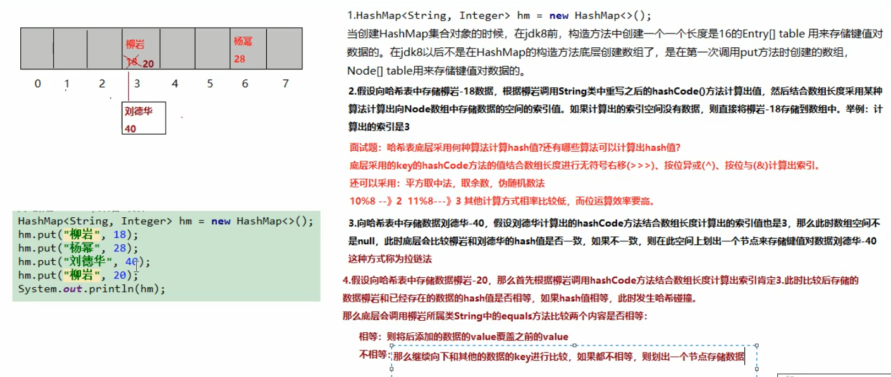
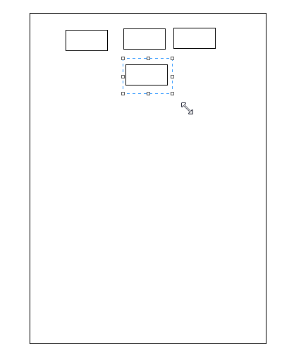

# 泛型

## 定义

​	泛型，即“参数化类型”。就是将类型由原来的具体的类型参数化，类似于方法中的变量参数，此时类型也定义成参数形式（可以称之为类型形参），然后在使用/调用时传入具体的类型（类型实参）。
​		E：元素（Element），多用于java集合框架
​		K：关键字（Key）
​		N：数字（Number）
​		T：类型（Type）
​		V：值（Value）

## 好处

​					提高安全性（将运行期的错误转换到编译器）
​					 省去强转的麻烦

## 基本使用

​					<>中放的必须是引用数据类型

## 泛型使用注意事项

​					前后的泛型必须一致，或者后面的泛型可以省略不写（1.7的新特性菱形泛型）
​					泛型最好不要定义成Object，没有意义 
​					加上泛型之后，类型就确定了，不能加入其它类型的对象

## 泛型的使用

### 泛型类

​							public class 类名<泛型类型1,....>

### 泛型方法

​									public<泛型类型> 返回类型 方法名 (泛型类型 变量名)
​									public void show(T t)											  非静态方法泛型最好与类的泛型一致		
​									public<P> void show1(P p)									非静态方法泛型与类的泛型不一致的时候	
​									public static<P> void print(P p)						     静态方法随着类加载而加载，必须自己声明泛型

```java
public class Tool<T> {								//泛型类，泛型为T
    private T t;

    public T getObj() {
        return t;
    }

    public void setObj(T t) {
        this.t = t;
    }

    public void show(T t) {								// 非静态方法泛型最好与类的泛型一致
        System.out.println(t);
    }

    public<P> void show1(P p) {							// 非静态方法泛型与类的泛型不一致
        System.out.println(p);
    }

    public static<P> void print(P p) {					// 静态方法随着类加载而加载，必须自己声明泛型
        System.out.println(p);
    }

}
```

​									

### 泛型接口

​								public interface 接口名<泛型类型>
​									class Demo implements Inter<String>
​								推荐
​									class Demo2<T> implements Inter<T>
​										没有必要再实现接口时候给自己类加泛型

```java
interface Inter<T>{
	public void show(T t);
}

class Demo implements Inter<String> {				// 推荐用这种
	public void show(String s) {
		System.out.println(s);
	}
}

class Demo2<T> implements Inter<T> {			//没有必要再实现接口时候给自己类加泛型
	@Override
	public void show(T t) {
		System.out.println(t);
	}
	
}
```


### 高级之通配符

​						主要是API中出现,自己一般不写,要能看懂

#### A:泛型通配符<?>

​									任意类型，如果没有明确，那么就是Object以及任意的Java类
​										当右边的泛型是不确定时，左边可以定为？

#### B:？ extends E

​									泛型固定上边界，向下限定，可以是**E及其子类**
​									该问题*<u>常见于addAll(Collection< ? extends E > c)</u>*
​											可以添加E或者E的子类,因为不知道是什么类型,所以用?代替

```java
List<?> l = new ArrayList<String>();  				//当右边的泛型是不确定时，左边可以定为？

ArrayList<Person> list1 = new ArrayList<>();
list1.add(new Person("张三",23));
list1.add(new Person("李四",24));
list1.add(new Person("王五",25)); 
System.out.println("Pserson的list1： "+list1);

ArrayList<Student> list2 = new ArrayList<>();
list2.add(new Student("赵六",26));
list2.add(new Student("周七",27));
System.out.println("Student的list2： "+list2);

list1.addAll(list2);												// list1是Person类型,也可以加子类类型
System.out.println("加上list2的list1： "+list1);
```

#### C:？ super E

​									泛型固定下边界，向上限定，可以是**E及其父类**
​									<u>*该问题常见于TreeSet和TreeMap的构造方法中,创建一个比较器,TreeXxx进行调用*</u>
​										    父类创建一个比较器,子类也可以使用

```java
public static void main(String[] args) {
    TreeSet<Student> ts1 = new TreeSet<>(new CompareByAge());
    ts1.add(new Student("张三",23));
    ts1.add(new Student("李四",24));
    ts1.add(new Student("王五",25));
    ts1.add(new Student("赵六",26));

    // BaseStudent也能用Student的比较器CompareByAge()方法
    TreeSet<BaseStudent> ts2 = new TreeSet<>(new CompareByAge());			
    ts2.add(new BaseStudent("张三",23));
    ts2.add(new BaseStudent("李四",24));
    ts2.add(new BaseStudent("王五",25));
    ts2.add(new BaseStudent("赵六",26));
    System.out.println(ts2);
}

class CompareByAge implements Comparator<Student> {

    @Override
    public int compare(Student s1, Student s2) {
        int num = s1.getAge() - s2.getAge();				// 按照年龄排序
        return num == 0 ? s1.getName().compareTo(s2.getName()) : num;	// 如果年龄相同,就按照姓名排序
    }

}
```


# 集合

​			数组和集合存储引用数据类型,存的都是地址值

## 集合的由来

​					**数组长度是固定**,当添加的元素超过了数组的长度时需要对数组重新定义,太麻烦,java内部给我们提供了集合类,能存储任意对				象,**长度是可以改变的**,随着元素的增加而增加,随着元素的减少而减少 

## 数组和集合的区别

​					区别1 : 

​							数组既可以存储基本数据类型,又可以存储引用数据类型,**基本数据类型存储的是值,引用数据类型存储的是地址值**

​							集合**只能存储引用数据类型(对象)**，集合中也可以存储基本数据类型,但是在存储的时候会**自动装箱变成对象**

​					区别2:

​							数组长度是**固定**的,不能自动增长

​							集合的长度的是**可变**的,可以根据元素的增加而增长

## 数组和集合什么时候用

​					1,如果元素个数是**固定**的推荐用数组

​					2,如果元素个数**不是固定**的推荐用集合

## Collection中的  set  与  Map  的相同点

​						**Hash算法**都要重写**hashCode()和equals()**方法
​						Tree二叉树
​							1.**实体类实现Comparable接口**,重写compareTo()方法
​							2.创建TreeSet对象时,匿名内部类**new Comparator<>()为参数**,重写compare()方法
​							3**.创建一个比较器类,**重写Comparator<>方法,创建TreeSet对象时,参数为**new 比较器名**

## Collection(单列集合的根接口)

### Collection的方法

#### 常用方法

​									boolean add(**E e**)							添加集合

​											  add方法如果是List集合一直都返回true，因为List集合是可以存储重复元素的
​	  										如果是Set集合当存储重复元素的时候，就会返回false

​									boolean remove(**Object o**)			移除该元素
​									void clear()										清空集合
​									boolean contains(Object o)			判断集合是否包含o
​									int size() 											获取元素个数
​									boolean isEmpty()							判断集合是否为空

```java
Collection c = new ArrayList();
c.add("a");
c.add("b");
c.add("c");
c.add("d");
System.out.println("a,b,c,d原始集合："+c);					// [a, b, c, d]

System.out.println("判断集合是否包含b："+c.contains("b"));	// 	true		//判断是否包含

System.out.println("获取元素个数："+c.size());				// 4
c.remove("b");		 									//删除指定元素,
System.out.println("移除b后的集合："+c);					// [a, c, d]

System.out.println("获取元素个数："+c.size());				// 3

System.out.println("判断集合是否包含b："+c.contains("b"));		//判断是否包含,false

System.out.println("判断集合是否为空："+c.isEmpty());		// false

c.clear();												//清空集合
System.out.println("清空后的集合："+c);					// []

System.out.println("判断集合是否为空："+c.isEmpty());		// true

System.out.println("获取元素个数："+c.size());				// 0
```


#### 带All的方法

​									boolean addAll(**Collection<? extends E> c**)
​										添加一个集合的每个元素     
​										如果用add(Collection c),那么将集合看成一个元素添加
​									boolean removeAll(Collection c)
​										删除的交集

​									boolean containAll(Collection c)
​										判断是否包含另一个集合
​									boolean retainAll(Collection c)
​										取交集，如果调用的集合改变就返回true，如果调用的集合不变就返回false，一样也为没有交集

```java
Collection c1 = new ArrayList();
c1.add("a");
c1.add("b");
c1.add("c");
c1.add("d");
System.out.println("原始c1："+c1);					// [a, b, c, d]


Collection c2 = new ArrayList();					
c2.add("a");
c2.add("b");
c2.add("z");
System.out.println("原始c2："+c2);					// [a, b, z]

Collection c3 = new ArrayList();					
c3.add("a");
c3.add("b");
System.out.println("原始c3："+c3);					// [a, b]

//取交集，如果调用的集合改变就返回true，如果调用的集合不变就返回false
//c1变了就是true,c1没变就是false，一样也为没有交集
boolean b = c1.retainAll(c2);								//取交集，值改变，值为交集
System.out.println("c1和c2取交集："+b);					// true
System.out.println("与c2交集后的c1："+c1);					// [a, b]


boolean b1 = c1.retainAll(c3);								// 此时c1为[a, b],c3是[a, b],
System.out.println("与c2交集后的c1和c3取交集："+b1);				// false
```


#### 迭代器

​							集合是用来存储元素,存储的元素需要查看,那么就需要迭代(遍历) 

​								Iterator中next()方法返回类型为E,也可以创建为Object对象

​										作用：返回迭代中的下一个元素

​								Iterator中hasNext()方法返回类型为boolean

​										作用：如果迭代具有更多元素，则返回true

​								Iterator中void remove()返回类型是void

​										作用:用来删除迭代器中集合的元素

```java
// 1,定义集合
Collection c = new ArrayList();
c.add(new Student("张三",23));
c.add(new Student("李四",24));
c.add(new Student("王五",25));
c.add(new Student("赵六",26));

// 2,获取集合的迭代器(集合.Iterator)
Iterator it = c.iterator();

// 	3,判断是否有下一个元素(hasNext())
while (it.hasNext()) {
    // 4,获取元素(next())
    Student s = (Student)it.next();				//向下转型
    System.out.println(s.getName()+"....."+s.getAge());

}
```

### ListIterator

​								迭代器迭代元素，迭代器修改元素(ListIterator的特有功能add)

​								集合遍历元素，集合修改元素

​							boolean hasNext()				  是否有下一个

​							boolean hasPrevious()		  是否有前一个

​							Object next(							返回下一个元素

​							Object previous();				  返回上一个元素

​							必须先有next(),才可以previous()

```java
List list = new ArrayList();
list.add("a");
list.add("b");
list.add("world");
list.add("d");
list.add("e");

/*Iterator it = list.iterator();*/			// 回报ConcurrentModificationException并发修改异常
ListIterator lit = list.listIterator();		//如果想在遍历的过程中添加元素,可以用ListIterator中的add方法
while(lit.hasNext()) {
	String str = (String)lit.next();
	if(str.equals("world")) {
		lit.add("javaee");	
		//list.add("javaee");				// 回报ConcurrentModificationException并发修改异常
	}
}

while(lit.hasPrevious()) {
			System.out.println(lit.previous());			//获取元素并将指针向前移动
}
```


### 子类

####  List                              

​									有序(**存和取顺序一致**),有索引可以**存储重复**

##### 常用List方法

​										void add(**int index,E element**)			在**指定位置**添加元素

​										E remove(**int index**)								删除该索引的元素
​										E get(i**nt index)**										获取该索引的元素	用于遍历(只限于List)
​										E set(int index,E element)						修改指定索引的元素值

```java
private static void demo1() {
    System.out.println("-----add(int index,E element)--------");
    List list = new ArrayList();

    list.add("a");
    list.add("b");
    list.add("c");
    list.add("d");
    System.out.println(list);							// [a, b, c, d]
    // 注意索引异常		0 <= index <= size
    list.add(1,"e");			//在指定位置添加元素
    System.out.println(list);							// [a, e, b, c, d]
}

private static void demo2() {
    //		Collection中的remove方法参数只能为元素值
    System.out.println("-----remove(int index)--------");
    List list = new ArrayList();
    list.add("a");
    list.add("b");
    list.add("c");
    list.add("d");
    System.out.println(list);							// [a, b, c, d]

    // 删除的时候不会自动装箱，参数只能是索引，不能是元素
    Object obj = list.remove(1);					//通过索引删除元素，将被删除的元素返回
    System.out.println("被该索引删除的元素："+obj);		// b
    System.out.println("删除元素后的list："+list);			// [a, c, d]
}

private static void demo3() {
    System.out.println("-----get(int index)--------");
    List list = new ArrayList();

    list.add("a");
    list.add("b");
    list.add("c");
    list.add("d");
    System.out.println(list);						// [a, b, c, d]
    Object obj1 = list.get(0);
    System.out.println(obj1);						// a
    // 通过索引遍历List集合
    for (int i = 0; i < list.size(); i++) {
        System.out.print(list.get(i) + " ");		// a b c d
    }
}

private static void demo4() {
    System.out.println("-----set(int index)--------");
    List list = new ArrayList();
    list.add("a");
    list.add("b");
    list.add("c");
    list.add("d");
    System.out.println(list);						// [a, b, c, d]
    list.set(1, "z");				//改变指定位置的元素
    System.out.println("set修改后的List："+list);	// [a, z, c, d]
}

```


##### 遍历的方法

###### 1.Iterator

###### 2.size()+get()	【List特有的遍历】

###### 3.ListIterator	【List特有的遍历】

```java
List list = new ArrayList();
list.add(new Student("张三",23));	//Object obj = new Student("张三",23);
list.add(new Student("李四",24));
list.add(new Student("王五",25));
list.add(new Student("赵六",26));

System.out.println("----------------通过size()和get()方法结合使用遍历----------------");
for (int i = 0; i < list.size(); i++) {
    //			System.out.println(list.get(i));

    Student stu = (Student)list.get(i);
    System.out.println(stu.getName()+"....."+stu.getAge());
}

System.out.println("----------------通过Iterator()方法----------------");
Iterator<Student> it = list.iterator();
while(it.hasNext()) {
    Student stu = it.next();
    System.out.println(stu.getName() + "....." + stu.getAge());
}

System.out.println("----------------通过ListIterator()方法----------------");
ListIterator lit = list.listIterator();
while(lit.hasNext()) {
    Student stu = (Student) lit.next();
    System.out.println(stu.getName() + "....." + stu.getAge());
}
```

​												

##### 实现类

###### ArrayList数组实现

​											存储自定义的对象
​												contains()方法判断是否包含，底层依赖的是equals()方法		**【要重写equals()】**
​												remove()方法判断是否删除，底层依赖的是equals() 方法		**【要重写equals()】**
​											ArrayList嵌套ArrayList
​												看成里层的ArrayList<>看成外层的ArrayList<>的集合类型
​													ArrayList< ArrayList<T> > list = new ArrayList<>();

```java
public static void main(String[] args) {
    ArrayList list = new ArrayList();

    list.add(new Person("张三",23));
    list.add(new Person("张三",23));
    list.add(new Person("李四",24));
    list.add(new Person("李四",24));
    list.add(new Person("李四",24));
    list.add(new Person("李四",24));

    System.out.println("list:"+list);

    ArrayList newList = getSingle(list);
    System.out.println("newList:"+newList);

}


public static ArrayList getSingle(ArrayList list) {
    // 1、创建新集合
    ArrayList newList = new ArrayList();

    // 2、根据传入的集合（老集合）获取迭代器
    Iterator it = list.iterator();

    //3、遍历老集合
    while (it.hasNext()) {
        Object obj = it.next();

        //4、通过新集合判断是否包含老集合中的元素，如果包含就不添加，如果不包含就添加
        if (!newList.contains(obj)) {
            newList.add(obj);
        }
    }
    return newList;
}

// Person类
@Override
	public boolean equals(Object obj) {
		Person p = (Person) obj;
		return this.name.equals(p.name) && this.age == p.age;		// 判断名字和年龄是否一致
	}
```


###### LinkedList链表实现

​											特有方法
​												public void addFirst(E e)					在集合第一个位置添加元素
​												public void addLast(E e)					在集合最后一个位置添加元素
​												public E getFirst()								获取第一个元素
​												public E getLast()								获取最后一个元素
​												public E removeFirst()						删除头元素,返回值为删除的元素
​												public E removeLast()						删除尾元素,返回值为删除的元素
​												public E get(int index)						获取该索引的元素

```java
LinkedList list = new LinkedList();
list.addFirst("a");
list.addFirst("b");
list.addFirst("c");
list.addFirst("d");
list.addLast("E");

System.out.println("原始集合："+list);							// [d, c, b, a, E]

System.out.println("获取集合第一元素："+list.getFirst());		// d
System.out.println("获取集合最后一个元素"+list.getLast());		// E

System.out.println("删除头："+list.removeFirst());				// d
System.out.println("删除尾："+list.removeLast());				// E
System.out.println("删除头和尾后的集合："+list);						  // [c, b, a]
```

​											模拟栈和队列
​												栈
​													利用addLast()进栈
​													利用removeLast()出栈
​													利用isEmpty()判断为空
​												队列
​													利用addLast()进队
​													利用removeFirst()出队
​													利用isEmpty()判断为空

###### Vector(数组实现)

```java
// 	1,创建Vector对象
Vector v = new Vector();
// 2,addElement()添加对象
v.addElement("a");
v.addElement("b");
v.addElement("c");
v.addElement("d");
// 3,Enumeration获取枚举
Enumeration en = v.elements();
// 4,判断是否有元素hasMoreElements()
while(en.hasMoreElements()) {	
    // 5,nextElement获取集合元素
    System.out.println(en.nextElement());	
}
// 类似迭代器
```


​				

###### 三个子类的特点

​											ArrrayList:
​												底层数据结构是**数组**，查询快，增删慢
​														**线程不安全**，效率高
​											LinkedList:
​												底层数据结构是**链表**，查询慢，增删快
​														**线程不安全**，效率高
​											Vector:
​												底层数据结构是**数组**，查询快，增删慢
​														**线程安全**，效率低
​											增删慢（Vector数组结构）


​									Vector相对ArrayList查询慢（线程安全的）

​									Vector相对LinkedList增删慢（数组结构）

​									Vector和ArrayList的区别

​											Vector是线程安全的，效率低

​											ArrayList是线程不安全的，效率高

​									ArrayList和LinkedList的区别

​											ArrayList低层是数据结构，查询和修改快

​											LinkedList低层是链表结构，增删比较快，查询和修改慢


###### List有三个儿子，使用谁？

​											查询多用ArrayList
​											增删多用LinkedList
​											如果都多ArrayList 

##### 遍历

​										1.普通for循环, 使用get()逐个获取
​										2.调用iterator()方法得到Iterator, 使用hasNext()和next()方法
​										3.增强for循环, 只要可以使用Iterator的类都可以用
​										4.Vector集合可以使用Enumeration的hasMoreElements()和nextElement()方法


#### Set              

​										无序(**存和取的顺序不一致**),无索引,**不可以存储重复**

​										Set方法和**Collection方法一样**

> ​			HashSet和TreeSet都有重写的方法
> ​				HashSet重写hashCode()和equals()
> ​				TreeSet重写
> ​						1.实体类实现Comparable接口,重写compareTo()方法
> ​						2.创建TreeSet对象时,匿名内部类new Comparator<>()为参数,重写compare()方法
> ​						3.创建一个比较器类,重写Comparator<>方法,创建TreeSet对象时,参数为new 比较器名


##### HashSet哈希算法(哈希表)

###### 底层原理

HashSet实际上是一个HashMap实例，都是一个存放链表的数组。它不保证存储元素的迭代顺序；此类允许使用null元素。HashSet中不允许有重复元素，这是因为HashSet是基于HashMap实现的，HashSet中的元素都存放在HashMap的key上面，而value中的值都是统一的一个固定对象private static final Object PRESENT = new Object();

​											1.当HashSet调用add()方法存储对象的时候<u>,先调用对象的hashCode()方法</u>得到一个哈希值,然后在集合中查找是												否有哈希值相同的对象
​											2.如果没有哈希值相同的对象就直接存入集合
​											3.如果有哈希值相同的对象,就和哈希值<u>相同的对象逐个进行equals()比较</u>,比较结果为false就存入,true则不存
​											HashSet存的元素是自定义类重写hashcode()和equals()方法

```java
/*
	 * 	为什么是31？
	 	* 1、31是一个质数，质数是能被1和自己本身整除的数
	 	* 2、31这个数既不大也不小
	 	* 3、31这个数好算，2的五次方-1，2向左移动5位
	 * 
	 * */
@Override
public int hashCode() {
    final int prime = 31;
    int result = 1;
    result = prime * result + age;
    result = prime * result + ((name == null) ? 0 : name.hashCode());
    return result;
}

// 按照年龄排序,自定义排序
@Override
public int compareTo(Person o) {
    int num = this.age - o.age;
    return num == 0 ? this.name.compareTo(o.name) : num;
}
```


###### LinkedHashSet

​												底层是链表实现的，是set集合中唯一一个能**保证怎么存就怎么取得**集合对象
​													怎么存就怎么取
​												因为HashSet的子类 ，所以也是保证元素唯一的，与HashSet的原理一样

##### TreeSet二叉树算法

​											用来对象元素进行排序的，同样他也可以**保证元素的唯一**

###### 自然顺序(Comparable)

​											TreeSet类的add()方法中会把存入的对象提升为Comparable类型
​											调用对象的compareTo()方法和集合中的对象比较
​											根据compareTo()方法返回的结果进行存储

```java
public class Person implements Comparable<Person> 
@Override
public int compareTo(Student1 o) {
int num = this.name.compareTo(o.name);					//姓名是主要条件
return num == 0 ? this.age - o.age : num;				//年龄是次要条件
}
```


###### 比较器顺序(Comparator)

​												创建TreeSet的时候可以制定 一个Comparator
​												如果传入了Comparator的子类对象, 那么TreeSet就会按照比较器中的顺序排序
​												add()方法内部会自动调用Comparator接口中compare()方法排序
​												调用的对象是compare方法的第一个参数,集合中的对象是compare方法的第二个参数

```java
//创建一个比较器类,重写Comparator<>方法,
class CompareByLen /*extends Object*/ implements Comparator<String> {		
    @Override
    public int compare(String s1, String s2) {				
        int num = s1.length() - s2.length();				
        return num == 0 ? s1.compareTo(s2) : num ;			
    }
}
// 创建TreeSet对象时,参数为new 比较器名
TreeSet<String> ts = new TreeSet<>(new CompareByLen());

```

​									匿名方法	

```java
// 创建TreeSet对象时,匿名内部类new Comparator<>()为参数,重写compare()方法
TreeSet<Student> ts = new TreeSet<>(new Comparator<Student>() {

    @Override
    public int compare(Student s1, Student s2) {
        int num = s1.getName().compareTo(s2.getName());
        return num == 0 ? s1.getAge() - s2.getAge() : num;
    }
});
```

​			

###### 两种方式的区别

​												TreeSet构造函数什么都不传, 默认按照类中Comparable的顺序(没有就报错ClassCastException)
​												TreeSet如果传入Comparator, 就优先按照Comparator
​													实体类实现Comparable接口,重写compareTo()方法

##### 遍历

​									调用iterator()方法得到Iterator, 使用hasNext()和next()方法
​									增强for循环, 只要可以使用Iterator的类都可以用


### 增强for循环Foreach

#### 格式:

```java
// 元素数据类型 变量:集合中存储的是什么类型,就定义什么类型
// 数组或者Collection集合:集合名或者数组名
for (元素数据类型 变量 : 数组或者Collection集合) {
    System.out.println(变量);
    使用变量即可，该变量就是元素
}
```

​							增强for循环底层依赖的是迭代器（Iterator）
​							只要能用迭代器迭代的，就可以使用增强for循环


### 三种迭代是否能删除

#### 普通for循环

​									通过索引删除元素,集合名.remove(index--)

​									因为删除之后,集合会随即向前移动,index--为了防止中间连续出现的元素,少删

​									如果元素重复，挨着会留一个，不挨着不删除,所以索引要list.remove(i--);

```java
ArrayList<String> list = new ArrayList<>();
list.add("b");
list.add("a");
list.add("b");
list.add("b");
list.add("b");
list.add("c");
list.add("b");
list.add("d");

for (int i = 0; i < list.size(); i++) {
    if("b".equals(list.get(i))) {
        list.remove(i--);							//通过索引删除元素
    }
}
```


#### 迭代器Iterator

​									it.remove();
​										用迭代器的方法

```java
ArrayList<String> list = new ArrayList<>();
list.add("a");
list.add("b");
list.add("b");
list.add("c");
list.add("b");
list.add("d");

Iterator<String> it = list.iterator();
while(it.hasNext()) {
    if("b".equals(it.next())) {
        //	list.remove("b");				//不能用集合的删除方法，因为迭代的过程中如果修改会出现并发修改异常
        it.remove();
    }
}

for(Iterator<String> it2 = list.iterator(); it2.hasNext();) {
    if("b".equals(it2.next())) {
        //	list.remove("b");				//不能用集合的删除方法，因为迭代的过程中如果修改会出现并发修改异常
        it2.remove();
    }
} 
```


#### 增强for循环

​									不能删除

### ...可变参数

​								可变参数其实是一个**数组**
​									没给数据参数
​										print();
​									给引用数据参数
​										print(arr);
​									直接给数据参数
​										print(44,66,77,99,11);
​									如果一个方法有可变参数，并且有多个参数，那么，可变参数肯定是最后一个 
​										public static void print2(int x,int y ,int ... arr)
​											参数列表前两个是x,y,剩下的是可变参数
​									public static void print(int ... arr)

### 集合和数组的相互转换

#### 数组转换成集合

​									**Arrays.asList(arr)**

​									数组转换集合，虽然**不能增加或减少元素**，但是可以用集合的思想操作数组，也就是说可以使用其他集合中的方法
​										1.字符串转换List集合
​											List<String> list = Arrays.asList(arr);	
​										2.整数转换List集合
​											Integer[] arrI = {11,22,33,44,55};
​											List<Integer> listI = Arrays.asList(arrI);
​												数组必须是**引用数据类型**

```java
private static void demo1() {
    System.out.println("-----------String数组转换集合----------------");
    String[] arr = {"a","b","c","d"};

    List<String> list = Arrays.asList(arr);			//将数组转换为集合
    System.out.println(list);						// [a, b, c, d]
}

private static void demo2() {
    System.out.println("---------基本数据类型正型-----------");

    // 集合只能放引用数据类型，正型数组转换集合，把整个数组看成一个整体
    int[] arr = {11,22,33,44,55};
    List list = Arrays.asList(arr);
    System.out.println(list);									// [[I@7852e922]

    // 数组转换集合，数组必须是引用数据类型
    System.out.println("---------包装类正型-----------");
    Integer[] arrI = {11,22,33,44,55};							// [11, 22, 33, 44, 55]
    List<Integer> listI = Arrays.asList(arrI);
    System.out.println(listI);
}
```


#### 集合转换成数组

​									String[] arr = **list.toArray**(new String[10]);		
​									当集合转换数组时，new XXX[x]中,x为数组长度 
​										 如果是**小于等于**集合的size时，转换后的数组长度的**等于集合的size**
​									 	如果是**大于**集合的size，分配的数组长度就和**指定的长度一样**

```java
private static void demo3() {
    System.out.println("---------集合转数组-----------");
    ArrayList<String> list = new ArrayList<>();
    list.add("a");
    list.add("b");
    list.add("c");
    list.add("d");

    // 当集合转换数组时，new XXX[x]中,x为数组长度 
    // 如果是	小于等于	集合的size时，转换后的数组长度的等于集合的size
    // 如果是	大	于	集合的size，分配的数组长度就和指定的长度一样
    String[] arr = list.toArray(new String[10]);		

    for (String string : arr) {
        System.out.println(string);
    }
}
```


## Map(双列集合的根接口)

### Map

​							**<u>==key 键不可以重复, value 值可以重复==</u>**

#### Map的方法

##### 添加功能

​										V **put**(K key,V value) :添加元素
​												如果键是第一次存储,就直接存储元素,返回null
​												如果键不是第一次存在,就用值把以前的值替换掉,返回以前的值value

##### 删除功能

​										void **clear**():移除所有的键值对元素
​										V **remove**(Object key):根据键删除键值对元素,并把值返回

##### 判断功能

​										boolean **containsKey**(Object key):判断集合是否包含指定的键
​										boolean **containsValue**(Object value):判断集合是否包含指定的值
​										boolean **isEmpty**():判断集合是否为空

##### 获取功能

​										Set<Map.Entry<K,V>>   **entrySet**():
​											entrySet()方法返回值类型为 Set<Map.Entry<K,V>>,Map.Entry说明,Entry是Map的内部接口
​										V  **get**(Object key):根据键获取值 
​										Set<K>  **keySet**():获取集合中所有键的集合
​										Collection<V>  **values**():获取集合中所有值的集合

##### 长度功能

​										int size():返回集合中的键值对的个数

#### 遍历

##### 根据键获取值

###### 使用迭代器				

​											创建键的set集合,map.keySet()
​											获取键集合的迭代器
​											遍历set集合,每个元素都是map的键Key,it.next()
​											根据Key获取值Value,map.get(key)

###### 增强for循环

​											map.keySet()是所有键的set集合,见迭代器第一句
​											遍历的每个key都是键Key
​											根据Key获取值Value,map.get(key)

##### 根据键值对对象找键和值

###### 使用迭代器

​											创建键值对的set集合,map.entrySet(),其中类型为Map.Entry<Key,Value>
​												 Map.Entry说明Entry是Map的内部接口,将键和值封装成了Entry对象,并存储在Set集合 
​											获取键值对集合的迭代器
​											遍历set集合,每个元素都是map的键值对Map.Entry<Key,Value>
​											分别获取键值对中的键和值,使用Map.Entry特有的方法
​												Map.Entry有getKey()和getValue()方法

###### 增强for循环


​											map.entrySet()是所有键值对的set集合,见迭代器第一句
​											遍历的每个en都是键值对对象
​											根据键值对分别获取键和值,使用Map.Entry特有的方法

### 实现类

#### HashMap(实现Map)

​									无序(**存和取的顺序不一致**),无索引,**不可以存储重复**

​									key 键不可以重复, value 值能重复

​									与HashSet一样,需要重写equals()和hashCode()方法

##### LinkedHashMap(继承HashMap,实现Map)

​									使用和LinkedHashSet类似,**保证怎么存就怎么取得**

##### HashMap和Hashtable

​										共同点:底层都是哈希算法,都是双列集合
​										 区别:
​											1.HashMap是线程不安全的，效率高，JDK1.2版本
​												Hashtable是线程安全的,效率低,JDK1.0版本
​											2.HashMap可以存储null键和null值
​												Hashtable不可以存储null键和null值

##### 底层实现:(数组+链表实现+红黑树)

​									jdk8开始链表高度到8、数组长度超过64,链表转变为红黑树，元素以内部类Node节点存在
​									●计算key的hash值，**二次**hash然后对数组长度取模，对应到数组下标,
​									●如果没有产生hash冲突(下标位置没有元素)，则直接创建Node**存入数组**,
​									●如果产生hash冲突,先进行equa比较,相同则**取代该元素**,不同,则判断链表高度插入链表,**链表高度达到8，并且数组**										**长度到64则转变为红黑树**,**长度低于6则将红黑树转回链表**
​									●key为null, 存在下标0的位置



#### TreeMap(红黑树)

​									用来对象元素进行排序的，同样他也可以保证元素的唯一

##### 自然顺序(Comparable)

​				调用对象的compareTo()方法和集合中的对象比较
​				根据compareTo()方法返回的结果进行存储
​		

```java
public class Student implements Comparable<Student>
    @Override
    public int compareTo(Student o) {
    int num = this.age - o.age;
    return num == 0 ? this.name.compareTo(o.getName()) : num;
}
```


##### 比较器顺序(Comparator)

​										创建TreeMap的时候可以制定 一个Comparator
​										如果传入了Comparator的子类对象, 那么TreeMap就会按照比较器中的顺序排序
​										put()方法内部会自动调用Comparator接口中compare()方法排序
​										调用的对象是compare方法的第一个参数,集合中的对象是compare方法的第二个参数
​		

```java
//	创建一个比较器类,重写Comparator<>方法,创建TreeMap对象时,参数为new 比较器名
class CompareByName /*extends Object*/ implements Comparator<String> {		
    @Override
    public int compare(Student1 s1, Student1 s2) {
        int num = s1.getName().compareTo(s2.getName());
        return num == 0 ? s1.getAge() - s2.getAge() : num;
    }
}
TreeMap<Student> ts = new TreeMap<>(new CompareByName ());
```

​									匿名方法

```java
// 匿名内部类new Comparator<>()为参数,重写compare()方法
TreeMap<Student1, String> tm = new TreeMap<>(new Comparator<Student1>() {
    @Override
    public int compare(Student1 s1, Student1 s2) {
        int num = s1.getName().compareTo(s2.getName());
        return num == 0 ? s1.getAge() - s2.getAge() : num;
    }
});
```

​					

##### 两种方式的区别

​				TreeMap构造函数什么都不传, 默认按照类中Comparable的顺序(没有就报错ClassCastException)
​				TreeMap如果传入Comparator, 就优先按照Comparator

#### Hashtable

​									子类
​										Properties

#### ConcurrentHashMap

​									线程安全


## Map和Collection的区别

​							 Map是双列的,Collection是单列的
​							 Map的键唯一,Collection的子体系Set是唯一的
​							Map集合的数据结构值针对键有效，跟值无关;Collection集合的数据结构是针对元素有效


## Collections

### 常用方法(都是静态的)

​							排序:public   static <T>   void   sort(**List**<T>     list)		

​									如果是自定义类,那么实体类需要**实现Comparable接口**

​							二分查找:public   static <T>   int   bianrySearch(List<T> list,T  key)
​									如果不存在就是     -的插入点-1
​							最大/小值:public  static <T>  T  max/min(Collection<?>  coll)
​							反转: public  static  void  reverse(**List**<?>  list)
​							随机置换:public  static  void  shuffle(**List**<?>  list)
​						

```java
// 排序
private static void demo1() {
    System.out.println("---------排序---------");
    ArrayList<String> list = new ArrayList<>();
    list.add("d");
    list.add("b");
    list.add("b");
    list.add("a");
    list.add("c");

    System.out.println("原来的ArrayList集合:"+list);				// [d, b, b, a, c]

    Collections.sort(list);						//将集合排序
    System.out.println("排序后的ArrayList集合:"+list);			// [a, b, b, c, d]
}

// 二分查找
private static void demo2() {
    System.out.println("--------二分查找---------");
    ArrayList<String> list = new ArrayList<>();
    list.add("a");
    list.add("b");
    list.add("d");

    System.out.println("原来的ArrayList集合:"+list);				// [a, b, d]
    System.out.println("二分查找_d:"+Collections.binarySearch(list, "d"));		// 2
    System.out.println("二分查找_b:"+Collections.binarySearch(list, "b"));		// 1
    System.out.println("二分查找_c:"+Collections.binarySearch(list, "c"));		// -3
}

// 获取最大/小值
private static void demo3() {
    System.out.println("--------获取最大/小值---------");
    ArrayList<String> list = new ArrayList<>();
    list.add("d");
    list.add("b");
    list.add("b");
    list.add("a");
    list.add("c");

    System.out.println("原来的ArrayList集合:" + list);				// [d, b, b, a, c]
    // 根据默认排序结果获取集合中的最大值
    System.out.println("获取最大值:" + Collections.max(list)); 		// d	
    // 根据默认排序结果获取集合中的最小值
    System.out.println("获取最小值:" + Collections.min(list)); 		// a

}

// 反转
private static void demo4() {
    System.out.println("--------反转---------");
    ArrayList<String> list = new ArrayList<>();
    list.add("d");
    list.add("b");
    list.add("b");
    list.add("a");
    list.add("c");

    System.out.println("原来的ArrayList集合:" + list);			// [d, b, b, a, c]
    Collections.reverse(list);
    System.out.println("反转后的ArrayList集合:" + list);			// [c, a, b, b, d]
}

// 随机置换(每次启动程序排序都不一样)
private static void demo5() {
    System.out.println("--------随机置换(每次启动程序排序都不一样)---------");
    ArrayList<String> list = new ArrayList<>();
    list.add("d");
    list.add("b");
    list.add("b");
    list.add("a");
    list.add("c");

    System.out.println("原来的ArrayList集合:" + list);
    Collections.shuffle(list);
    System.out.println("随机置换后的ArrayList集合:" + list);
}
```


# List_Set_Map

## Collection

### List(存取有序,有索引,可以重复,允许多个null元素对象)

#### A:List的三个子类的特点

##### ArrrayList:

###### 底层数据结构是<u>*数组*</u>，查询快，增删慢

###### 线程<u>*不安全*</u>，效率高

##### Vector:

###### 底层数据结构是<u>*数组*</u>，查询快，增删慢

###### 线程<u>*安全*</u>，效率低。

##### LinkedList:

###### 底层数据结构是<u>*链表*</u>，查询慢，增删快

###### 线程<u>*不安全*</u>，效率高

##### Vector相对ArrayList查询慢（线程安全的）

##### Vector相对LinkedList增删慢（数组结构）

##### Vector和ArrayList的区别

###### Vector是线程安全的，效率低

###### ArrayList是线程不安全的，效率高

##### ArrayList和LinkedList的区别

###### ArrayList低层是数据结构，查询和修改快

###### LinkedList低层是链表结构，增删比较快，查询和修改慢

#### B:List有三个儿子，使用谁？

##### 查询多用ArrayList

##### 增删多用LinkedList

##### 如果都多ArrayList 


### Set(存取无序,无索引,不可以重复,允许一个null元素对象)

#### A:Set的三个子类的特点

##### HashSet:

###### 底层是一个HashMap实例，都是一个存放链表的数组。实现的,基本类型可以自动排序

##### LinkedHashSet:

###### 底层是链表实现,但是也是可以保证元素唯一,和HashSet原理一样,怎么存,怎么取

##### TreeSet

###### 底层是二叉树算法实现的,基本类型可以自动排序

#### B: 一般在开发的时候不需要对存储的元素排序,所以在开发的时候大多用HashSet,HashSet的效率比较高

​								TreeSet在面试的时候比较多,问你有几种排序方式,和有几种排序方式的区别


## Map

### HashMap

##### 底层是哈希算法,针对键,基本类型可以自动排序

##### 底层实现:(数组+链表实现+红黑树)

​									jdk8开始链表高度到8、数组长度超过64,链表转变为红黑树，元素以内部类Node节点存在
​									●计算key的hash值，**二次**hash然后对数组长度取模，对应到数组下标,
​									●如果没有产生hash冲突(下标位置没有元素)，则直接创建Node**存入数组**,
​									●如果产生hash冲突,先进行equa比较,相同则**取代该元素**,不同,则判断链表高度插入链表,**链表高度达到8，并且数组**										**长度到64则转变为红黑树**,**长度低于6则将红黑树转回链表**
​									●key为null, 存在下标0的位置

### LinkedHashSet

##### 底层是链表,针对键,怎么存,怎么取

### TreeMap

##### 底层是二叉树算法,针对键,用来对象元素进行排序

### 开发中用HashMap比较多


<span style="color:#f0f;font-size:18px">如果**存储的重复**的元素,优先考虑**ArrayList**,如果**不需要重复**的元素,优先考虑**HashSet**, **双列集合直接考虑HashMap**,除非**需要排序**考虑TreeMap</span>


## JDK9的新特性:

​					List接口, Set接口, Map接口:里边增加了一个静态的方法of,可以给集合一次性添加多个元素
​					static <E> list<E> of (E... elements )

### 使用前提:

​							当集合中存储的元素的个数已经确定了,**不在改变**时使用

### 注意:

​							1.0f方法只适用于List接口, Set接口, Map接口,**不适用于接口的实现类**

​							2.of方法的返回值是一个**不能改变**的集合,集合**不能再使用add, put**方法添加元素,会抛出异常

​							3.Set接口和Map接口在调用of方法的时候，**不能有重复的元素**,否则会抛出异常


# Properties

​				Properties是Hashtable的子类

## Properties的概述

​					Properties 类表示了一个持久的属性集
​						Properties 可保存在流中或从流中加载。
​						属性列表中每个键及其对应值都是一个字符串。 			

```java
Properties prop = new Properties();
prop.put("abc", 123);
System.out.println(prop);					// {abc=123}
```


## Properties的特殊功能

​			public Object setProperty(String key,String value)		同Hashtable方法 put,添加元素 
​			public String getProperty(String key)								使用此属性列表中指定的键搜索属性。	同Map集合中的get(key)
​			public   Enumeration<String>   propertyNames()	

​			返回此属性列表中    **所有键**   的枚举，包括默认属性列表中的不同键，如果尚未从主属性列表中找到相同名称的键。 			

```java
Enumeration<String> en = (Enumeration<String>) prop.propertyNames();
while(en.hasMoreElements()) {
    String key = en.nextElement();				
    //获取Properties中的每一个键
    String value = prop.getProperty(key);		
    //根据键获取值
    System.out.println(key + "=" + value);				// name=张三	tel=123521412
}
```

​			Set<String>  stringPropertyNames
​				返回此属性列表中的   **一组键**   ，其中键及其对应的值为字符串，包括默认属性列表中的不同键，如果尚未从主属性列表中找到相同名称的键。同Map集合中的**keySet()**方法	

```java
Set<String> set = prop.stringPropertyNames();
for (String key : set) {
    String value = prop.getProperty(key);
    System.out.println(key + "=" + value);
}
```

​		

## 成员方法

### store

​							将集合中的键值对**写入到**文件上

#### store(OutputStream out, String comments) 

​										OutputStream  out 	字节输出流	不能写中文

​										String  comments是对列表参数的表述,可以给null,给null文档就不会表述,不能使用中文

```java
Properties prop = new Properties();
prop.setProperty("张三","23");
prop.setProperty("李四","24");
prop.setProperty("王五","25");
prop.setProperty("赵六","26");
FileWriter fw = new FileWriter("aa.txt");
prop.store(fw,"comaaaaa");					// comaaaaa注释
fw.close();
```

> #comaaaaa			
> #Fri Feb 26 15:07:07 CST 2021
> 赵六=26
> 王五=25
> 张三=23
> 李四=24

#### store(Writer writer, String comments) 

​										Writer writer		字符输出流		可以写中文


### load

#### load(InputStream inStream) 

​									将文件上的键值对**读取到**集合中	

​									文本中的数据，必须是**键值对**形式，可以使用**空格**、**等号**、**冒号**等符号分隔。	

​									字节输入流,不能读取含有中文的键值对	 

#### load(Reader reader) 

​									字符输入流,能读取含有中文的键值对

```java
Properties prop = new Properties();
prop.load(new FileReader("aa.txt"));
Set<String> set = prop.stringPropertyNames();
for (String key : set) {
    String value = prop.getProperty(key);
    System.out.println(key + "=" + value);
}
```


# 异常

## 概述

​					异常就是Java程序在运行过程中出现的错误

## 异常的分类 

​					Throwable

​							Error
​								服务器宕机,数据库崩溃等
​							Exception(异常)

​								RuntimeException

## 编译期异常和运行期异常的区别

​								Java的异常被分为两大类:编译时异常和运行时异常

#### 编译时异常

​										Java程序必须显示处理，否则程序就会发生错误，**无法通过编译**,编辑器自动编译(可以理解为,编辑器提示报错)
​										编译时异常也叫做未雨绸缪异常(自己的叫法)
​											未雨绸缪:在做某些事情的时候要做某些准备
​											在编译某个程序的时候,有可能会有这样那样的事情发生
​												比如文件找不到,这样的异常就必须在编译的时候处理,如果不处理编译通不过

​										**IOException**、**SQLException**、**FileNOtFoundException**

#### 运行时异常

​										无需显示处理，也可以和编译时异常一样处理
​										就是程序员所犯的错误,需要回来修改代码
​									所有的**RuntimeException**类及其子类的实例被称为运行时异常，其他的异常就是编译时异常

​							**算数异常(**ArithmeticException,分母为0)、**空指针**(NullPointerException )、**类型转换异常**(ClassCastException,)、**数组**					**越界异常**(ArrayIndexOutOfBoundsException)、**数字格式异常**（NumberFormateException）

## 异常处理

### try...catch...finally

#### 格式

​									try  catch
​									try  catch  finally
​									try   finally

#### 分别解释

​									try:用来检测异常
​									catch:用来捕获异常
​									finally:释放资源
​								当通过try...catch将问题处理了,程序会继续执行

#### try...catch的方式处理多个异常

​									try后面如果跟多个catch,那么小的异常放前面,大的异常放后面,根据 多态的原理,如果打的放前面,就会将所有的子类							对象接收后面的catch就没有意义了
​							JDK7
​								catch (ArithmeticException | ArrayIndexOutOfBoundsException e)
​						<span style="color:#00f;font-size:18px">只要可能发生的错误的代码,都要放在try中</span>


### Throwable

​						Throwable类是Java语言中所有错误和异常的Throwable类

#### Throwable的集合常见方法

##### getMessage()

​								获取异常信息,返回字符串.
​									System.out.println(e.getMessage());

##### toString()

​								获取异常类名和异常信息,返回字符串
​									System.out.println(e.toString());

##### printStackTrace()

​								获取异常类名和异常信息,以及异常出现在程序中的位置.返回值void 
​									e.printStackTrace();
​							catch (Exception e)

### throws

​								定义功能方法时,需要把出现的问题暴露出来让调用者去处理
​								那么就通过throws在方法上标识.

#### 编译期异常和运行期异常的区别

##### 方法中抛出一个编译时异常,在方法上就要做处理					

```java
public void setAge(int age) throws Exception {
    if(age > 0 && age <= 150) {
        this.age = age;
    } else {
        //			Exception e = new Exception("年龄非法");
        //			throw e;
        throw new Exception("年龄非法");
    }
}
```


##### 方法中抛出一个  运行时  异常,在方法上不用做任何处理		

```java
public void setAge(int age) /*throws RuntimeException*/ {
    if(age > 0 && age <= 150) {
        this.age = age;
    } else {
        throw new RuntimeException("年龄非法");
    }
}
```


#### throws和throw的区别

##### throws:

​									用在	方法声明后面(**方法上**)  	,跟的是异常类名
​									可以跟	    多个异常类名       	,用逗号隔开
​									表示抛出异常,由该方法的调用者来处理

##### throw

​								用在	     **方法体内**    	,跟的是异常对象名
​								只能抛出	   	一个异常对象名              ,
​								表示抛出异常,由方法体内的语句处理

### finally

#### finally的特点

​								被finally控制的语句体一定会执行
​								特殊情况:在执行到finally之前jvm退出了(比如System.exit(0))

#### finally的作用

​								用于释放资源,在IO流操作和数据库操作中会见到
​					return语句相当于是方法的最后一口气,那么在他将死之前会看一看有没有finally,帮其完成遗愿,如果有就将finally执行后再彻底返回

#### final,finally和finalize的区别

##### final:

​									1.修饰类,不能被继承;
​									2.修饰方法,不能被重写;
​									3.修饰变量,只能赋值一次

##### finally:

​									是try语句中的一个语句体,不能单独使用,**用来释放资源**

##### finalize:

​									当垃圾收集确定不再有对该对象的引用时，垃圾收集器在对象上调用该对象。

#### finally中return的问题

​								当finally中有return时,一定返回finally中的return
​								finally没有return
​									当try和catch都没return,return在外部时,返回finally的值
​									当try和catch分别有return时,判断是否有异常

```java
public class TryTest {
    @Test
    public void tryTest(){
        System.out.println(t1());
        System.out.println(t2());
        System.out.println(t3());
        System.out.println(t4());
        System.out.println(t5());
        System.out.println(t6());
    }

    //  finally 中有 return,或者 try 和 catch 同时有 return,外部就不能 return
    public String t1(){
        System.out.println("try{} catch(){} finally{} return;");
        try {

        } catch (Exception e){

        }finally {

        }
        return "waibu";
    }

    public String t2(){
        System.out.println("try{return;} catch(){} finally{} return;");
        try {
            return "try";
        } catch (Exception e){

        }finally {

        }
        return "waibu";
    }

    public String t3(){
        System.out.println("try{} catch(){return;} finally{} return;");
        try {
            int i = 1 / 0;
        } catch (Exception e){
            return "catch";
        }finally {

        }
        return "waibu";
    }

    public String t4(){
        System.out.println("try{return;} catch(){} finally{return;}");
        try {
            return "try";
        } catch (Exception e){

        }finally {
            return "finally";
        }
    }

    public String t5(){
        System.out.println("try{} catch(){return;} finally{return;}");
        try {
            int i = 1 / 0;
        } catch (Exception e){
            return "catch";
        }finally {
            return "finally";
        }
    }

    public String t6(){
        System.out.println("try{return;} catch(){return;} finally{return;}");
        try {
            int i = 1 / 0;
            return "try";
        } catch (Exception e){
            return "catch";
        }finally {
            return "finally";
        }
    }
}

```

> try{} catch(){} finally{} return;
> waibu
> try{return;} catch(){} finally{} return;
> try
> try{} catch(){return;} finally{} return;
> catch
> try{return;} catch(){} finally{return;}
> finally
> try{} catch(){return;} finally{return;}
> finally
> try{return;} catch(){return;} finally{return;}
> finally


### 自定义异常

#### 自定义异常概述

​									继承自Exception
​											所有牵扯的方法都要抛异常
​									继承自RuntimeException
​											不用在方法上抛异常

#### 为什么需要自定义异常

​							通过名字区分到底是什么异常,能更快的检索到错误
​							举例:人的年龄
​								实体中部分代码​			

```java
public void setAge(int age) throws  AgeOutOfBoundsException{
    if (age > 0 && age <= 120) {
        this.age = age;
    } else {
        throw new AgeOutOfBoundsException("年龄非法");
    }
} 
```

​			

​				自定义异常定义代码		

```java
class AgeOutOfBoundsException extends Exception{
    //	public AgeOutOfBoundsException() {		//无参构造,没有提示信息
    //		super();
    //	}
    public AgeOutOfBoundsException(String message) {
        super(message);
    }
}
```


### try和throws的区别

#### 异常注意事项

​									子类重写父类方法时,子类的方法必须抛出**相同的异常**或父类**异常的子类**.(父亲坏了,儿子不能比父亲更坏)
​									如果父类抛出了多个异常,子类重写父类时,只能抛出相同的异常或者是他的子集,子类**不能抛出父类没有的异常**
​									如果被重写的方法没有异常抛出,那么子类的方法绝对不可以抛出异常,如果子类方法内有异常发生,那么子类只能try,								不能throws

#### 如何使用异常处理

​							原则:
​									如果该功能内部可以将问题处理,用try,
​									如果处理不了,交由调用者处理,这是用throws
​							区别:
​								后续程序需要继续运行就try
​								后续程序不需要继续运行就throws


# File

## 概述

​					File更应该叫做一个路径

​							文件路径或者文件夹路径  

​							路径分为绝对路径和相对路径

​							绝对路径是一个固定的路径,从盘符开始

​							相对路径相对于某个位置,在eclipse下是指当前项目下,在dos下

​					写入数据的原理(内存->硬盘)
​							java程序	->	JVM(java虚拟机)	->	OS(虚拟机)	->	OS调用写数据的方法	->		把数据写入到文件中

## 构造方法

​					File(String pathname):						根据一个路径得到File对象		
​					File(String parent, String child):		根据一个目录和一个子文件/目录得到File对象	
​					File(File parent, String child):			根据一个父File对象和一个子文件/目录得到File对象
​		

```java
//File(String pathname)
private static void demo1() {
    System.out.println("---------File(String pathname)------------");
    File file = new File("E:\\Java视频\\day19\\day19\\video\\001_今日内容.avi");
    System.out.println("绝对路径:"+file.exists());				// 绝对路径:true

    File file2 = new File("file.txt");
    System.out.println("相对路径:"+file2.exists());				// 相对路径:false

    File file3 = new File("xxx.txt");
    System.out.println("文件不存在:"+file3.exists());			// 文件不存在:true
}

// File(String parent, String child)
private static void demo2() {
    System.out.println("---------File(String parent, String child)------------");
    String parent = "E:\\Java视频\\day19\\day19\\video";
    String child = "001_今日内容.avi";
    File file = new File(parent, child);
    System.out.println("判断file是否存在:"+file.exists());			// 判断file是否存在:true
}

// File(File parent, String child)
private static void demo3() {
    System.out.println("---------File(File parent, String child)------------");
    File parent = new File("E:\\Java视频\\day19\\day19\\video");
    String child = "001_今日内容.avi";
    File file = new File(parent, child);
    System.out.println("判断file是否存在:"+file.exists());			// 判断file是否存在:true
    System.out.println("判断parent是否存在:"+parent.exists());		// 判断parent是否存在:true
}
```


## 创建功能

​						public boolean createNewFile():		   创建文件,如果存在这样的文件,就不创建了
​						public boolean mkdir():						  创建文件夹,如果存在这样的文件夹,就不创建了
​						public boolean mkdirs():						创建多级文件夹,如果父文件夹不存在,会帮你创建出来

​				**如果没有就创建,返回true**	

```java
private static void demo1() throws IOException {
    System.out.println("---------------创建文件--------------");
    File file = new  File("yyy.txt");
    System.out.println(file.createNewFile());					// 如果没有就创建,返回true
}

private static void demo2() {
    System.out.println("---------------创建文件夹--------------");
    File dir1 = new File("aaa");
    System.out.println(dir1.mkdir());

    File dir2 = new File("bbb.txt");				//这样写是可以的,文件夹也是可以有后缀的
    System.out.println(dir2.mkdir());
}

private static void demo3() {
    System.out.println("---------------创建多层文件夹--------------");

    File dir1 = new File("xx\\yy\\zz");
    System.out.println(dir1.mkdirs());
}
```


## 重命名和删除

### 重命名功能

​							public boolean renameTo(File dest):			把文件重命名为指定的文件路径

#### 重命名注意事项

​								如果路径名相同,就是**改名**
​								如果路径名不同,就是**改名并剪切**(原文件没有了,在指定的路径中产生一个新名字的文件)

```java
private static void demo1() {
    System.out.println("-------------重命名----------");
    File file1 = new File("ooo.txt");
    File file2 = new File("xxx.txt");
    System.out.println(file1.renameTo(file2));						// 将ooo.txt改为xxx.txt
    File file3 = new File("D:\\yyy.txt");
    System.out.println(file2.renameTo(file3));						// 将xxx.txt剪切到D盘下,并改名为yyy.txt
}
```


### 删除功能

​							public boolean delete():		删除文件或者文件夹

#### 删除注意事项:

​									Java中的删除不走回收站.
​									要删除一个文件夹,请注意该文件夹内**不能包含文件或者文件夹** ,**必须是空的**

```java
private static void demo2() {
    System.out.println("-------------删除----------");
    File file = new File("file.txt");
    System.out.println(file.delete());

    File file2 = new File("aaa");
    System.out.println(file2.delete());

    File file3 = new File("xx");					// 如果删除一个文件夹,那么文件夹必须是空的
    System.out.println(file3.delete());
}
```


## 判断功能

​						public boolean isDirectory():		   判断是否是目录(文件夹)
​						public boolean isFile():					  判断是否是文件
​						public boolean exists():				 	判断是否存在
​						public boolean canRead():				判断是否可读
​						public boolean canWrite():				判断是否可写	windows可以设置为不可写
​						public boolean isHidden():				判断是否隐藏		隐藏需要直接对文件操作修改,不是代码修改

```java
private static void demo1() {
    System.out.println("--------判断是否是目录---------");
    File dir = new File("xx");
    System.out.println("xx是否是文件夹:" + dir.isDirectory());

    File dir2 = new File("zz");
    System.out.println("zz是否是文件夹:" + dir2.isDirectory());
}

private static void demo2() {
    System.out.println("--------判断是否是文件---------");
    File dir = new File("xx.txt");
    System.out.println("xx.txt是否是文件夹:" + dir.isFile());

    File dir2 = new File("zz");
    System.out.println("zz是否是文件夹:" + dir2.isFile());
}

private static void demo3() {
    System.out.println("--------判断是否可读/写/隐藏---------");

    File dir = new File("xxx.txt");
    dir.setReadable(false);							// 无用 	SetWritable()无法修改
    System.out.println(dir.canRead());				// true			// windows认为所有的文件都是可读的

    dir.setWritable(false);
    System.out.println(dir.canWrite());				// false		// windows可以设置为不可写


    System.out.println(dir.isHidden());				// false		// 隐藏需要直接对文件操作修改,不是代码修改
}
```


## 获取功能

​						public String getAbsolutePath():			 获取绝对路径
​						public String getPath():						 	获取路径		获取构造方法中传入的路径
​						public String getName():						  获取名称
​								和toString的区别
​										**getName**是获取**名字带上类型**(文件夹没有类型)

​										**toString**和对象名是**该文件**或者文件夹的**绝对路径**

​						public long length():							     获取长度.字节数
​						public long lastModified():				  	获取最后一次的修改时间,毫秒值
​						public String[] list():								  获取指定目录下的所有文件或者文件夹的**名称数组**
​						public File[] listFiles():							   获取指定目录下的所有文件或者文件夹的**File数组**

```java
File file = new File("xxx.txt");
System.out.println("获取绝对路径:" + file.getAbsolutePath());// E:\eclipse\eclipse-workspace\test\xxx.txt

System.out.println("获取路径:" + file.getPath());			// xxx.txt		//获取构造方法中传入路径

System.out.println("获取名称:"+file.getName());				// xxx.txt

System.out.println("获取长度(字节数):"+file.length());			// 3(内容为abc)

Date date = new Date(file.lastModified());
SimpleDateFormat sdf = new SimpleDateFormat("yyyy年MM月dd日 HH:mm:ss");
System.out.println("获取最后一次的修改时间(毫秒值):"+ sdf.format(date));	// 2020年10月21日 16:46:18

File dir = new File("xx");
String[] arr = dir.list();
System.out.println("获取指定目录下的所有文件或者文件夹的名称数组");			// 仅为了获取文件名
for (String s : arr) {
    System.out.println(s);						// yy zz
}

System.out.println("获取指定目录下的所有文件或者文件夹的File数组");			// 获取文件对象
File[] subFiles = dir.listFiles();
for (File file2 : subFiles) {
    System.out.println(file2);					// xx\yy  xx\zz
}
```


## 过滤器

​						在File类中有两个和ListFiles重载的方法,方法的参数传递的就是过滤器

### File[]  listFiles(FileFilter  filter)

​		FileFilter  接口:用于抽象路径名(File对象)的过滤器
​		作用
​			用来过滤文件(File对象)
​		抽象方法
​			用来过滤文件的方法
​			boolean  accept(File  pathname)  	测试指定抽象路径名是否应该包含在某个路径名表中
​					File  path那么:使用ListFiles方法遍历目录,得到的每一个文件对象

### File[]  listFiles(FilenameFilter  filter)

​		FilenameFilter  接口:实现此接口的类实例可用于过滤器文件名
​		作用
​			用于过滤文件的方法
​		抽象方法
​			用来过滤文件的方法
​			boolean  accept(File  dir, String  name)  	测试指定文件是否应该包含在某一文件表中
​					File  dir :				构造方法中传递的被遍历的目录

​					String  name:		使用ListFiles方法遍历目录,获取的每一个文件/文件夹的名称 

```java
// 打印D盘下的所有的图片
File dir = new File("D:\\");
/*
	list方法一共做了3件事情:
		1.listFiles方法会对构造方法中传递的目录进行遍历,获取目录中的每一个文件/文件夹--> 封装为File对象
		2.listFiles方法会调用参数传递的过滤器中的方法accept
		3.listFiles方法会把遍历得到的 每一个File对象 传递过accept方法的参数pathname	
*/
String[] arr1 = dir.list(new FilenameFilter() {

    @Override
    public boolean accept(File dir, String name) {
        File file = new File(dir, name);				// 将文件夹下的所有文件和文件夹都传到 accept 方法中
        // 当该传入的file 是文件 且 名字是以.jpg结尾,返回true,将该file返回到数组中,否则被拦截下来
        return file.isFile() && file.getName().endsWith(".jpg");
    }

});

for (String string : arr1) {
    System.out.println(string);		// 1.jpg  图片.jpg
}
```


### 注意

​								两个过滤器接口是没有实现类的,需要我们自己写实现类,重写过滤的方法accept,在方法中自己定义过滤的规则

## 路径分隔符

​	File.pathSeparator
​	Windows**分号**
​	Linux**冒号**

## 文件名称分隔符

​	File.separator
​	Windows **反斜杠\ **
​	Linux**正斜杠/**


# IO流

## 概念

​					IO流用来处理设备之间的数据传输

​					Java对数据的操作是通过流的方式

​					Java用于操作流的类都在**IO包**中,需要导包

​					流按流向分为两种：输入流，输出流。

​					流按操作类型分为两种：

​							字节流 : 字节流可以操作任何数据,因为在计算机中任何数据都是以字节的形式存储的

​							字符流 : 字符流只能操作纯字符数据，比较方便。

## IO程序书写

​					使用前，导入IO包中的类

​					使用时，进行IO异常处理

​					使用后，释放资源

## IO流常用父类

### 字节流的抽象父类：

​							InputStream 										  (输入字节流的所有类的超类)

​									FileInputStream					   	  (从文件系统中的文件获取输入字节,读)

​									FilterInputStream 

​											BufferedInputStream		   (缓冲区)

​									ObjectInputStream					   (反序列化先前使用ObjectOutputStream编写的原始数据和对象,读取对象)

​									SequenceInputStream				 (序列流,整合多个输入流)

​							OutputStream										(字节输出流的所有类的超类)

​									FileOutputStream						  (将数据写入到文件,写入)

​									FilterOutputStream

​											BufferedOutputStream			(缓冲区)

​											PrintStream								(打印的字节流)

​									ByteArrayOutputStream				  (内存输出流,写入字节数组的输出流)

​									ObjectOutputStream						(序列化:将对象写到文件上)

### 字符流的抽象父类：

​							Reader 

​									InputStreamReader						(可以指定码表)

​											FileReader								 (读取字符流)

​									BufferedReader								(缓冲区)

​											LineNumberReader				 (缓冲字符输入流，跟踪行号)

​							Writer	

​									OutputStreamWriter							(可以指定码表,它使用的字符集可以由名称指定，也可以被明确指定)

​											FileWriter									(写入字符流)

​									BufferedWriter								  (缓冲区)

​									PrintWriter										 (打印的字符流)

## 字节流

​					字节流可以操作任何数据,因为在计算机中任何数据都是以字节的形式存储的

### 字节流的抽象父类：

​								InputStream 
​								OutputStream
​							因为是抽象的,所以不能创建对象

### 子类

#### FileInputStream

##### 构造函数

> ```java
> FileInputStream(File file) 
> 通过打开与实际文件的连接创建一个 FileInputStream ，该文件由文件系统中的 File对象 file命名。  
> FileInputStream(FileDescriptor fdObj) 
> 创建 FileInputStream通过使用文件描述符 fdObj ，其表示在文件系统中的现有连接到一个实际的文件。  
> FileInputStream(String name) 
> 通过打开与实际文件的连接来创建一个 FileInputStream ，该文件由文件系统中的路径名 name命名。  
> ```
>

​									**读出**该文件里面的内容
​										read()一次读取一个字节,返回值是int,不是byte,读取到字节后,转成对应码表值
​												int read() 													从该输入流读取一个字节的数据。  返回值为读取的值

​												int read(byte[] b) 									  从该输入流读取最多 b.length个字节的数据为字节数组。  

​																															byte[]:起到缓冲作用,存储每次读取到的多个字节

​																															int:每次读取的有效字节个数

​												int read(byte[] b, int off, int len) 			从该输入流读取最多 len字节的数据为字节数组。 			

```java
//只能读一个字节
FileInputStream fis = new FileInputStream("xxx.txt");	
int x = fis.read();										//从硬盘上读取一个字节
System.out.println(x);
```

​		

```java
//	循环读文件所有字节
//	类似有个指针,每读一次,指针就会向后移动一次
//	结束标记就是   -1  
FileInputStream fis = new FileInputStream("xxx.txt");		// a b c
int x; 
while ( (x = fis.read()) != -1) {
    System.out.println(x);						// 97 98 99
}

byte[] bytes = bew byte[1024];			// 存储读取到的多个字节
int len = 0;							// 记录每次读取的有效字节个数
while((len = fis.read(bytes) != -1)){
    System.out.println(new String(bytes,0,len));
}

fis.close;

```

​			

#### FileOutputStream

##### 构造函数

> ```java
> FileOutputStream(File file) 
> 创建文件输出流以写入由指定的 File对象表示的文件。  
> FileOutputStream(File file, boolean append) 
> 创建文件输出流以写入由指定的 File对象表示的文件。  
> FileOutputStream(FileDescriptor fdObj) 
> 创建文件输出流以写入指定的文件描述符，表示与文件系统中实际文件的现有连接。  
> FileOutputStream(String name) 
> 创建文件输出流以指定的名称写入文件。  
> FileOutputStream(String name, boolean append) 
> 创建文件输出流以指定的名称写入文件。  
> ```
>


​								**写进**该文件内容
​										write()一次写出一个字节
​											void write(byte[] b) 								 将 b.length个字节从指定的字节数组写入此文件输出流。  
​											void write(byte[] b, int off, int len) 		将 len字节从位于偏移量 off的指定字节数组写入此文件输出流。  

​																												b - 数据		off - 数据中的起始偏移量		len - 要写入的字节数

​											void write(int b) 										将指定的字节写入此文件输出流。  

##### 换行:

​										windows:\r\n

​										linux:/n

​										mac:/r

```java
//	如果没有该文件就自动创建这个文件
//	如果有这个文件就会将这个文件清空
FileOutputStream fos = new FileOutputStream("yyy.txt");	

// 如果想续写,就在第二个参数传入true
// FileOutputStream fos = new FileOutputStream("yyy.txt",true);	
fos.write(97);									// a
fos.write(98);									// b
fos.write("\r\n");								// 换行
fos.write(99);									// c
fos.write(100);									// d
fos.close();
```


​			

#### 使用完之后,都要关流

​									fis.close();
​									fos.close();

### 拷贝

#### 第一种拷贝

​									 逐个字节拷贝.
​								 	效率低

```java
FileInputStream fis = new FileInputStream("图1.png");		
FileOutputStream fos = new FileOutputStream("copy.png");	
int b ;
while( (b = fis.read()) != -1) {						
    fos.write(b);													
}
fis.close();
fos.close();
```

#### 第二种拷贝

​								定义大数组,文件多大就创建多大的
​								内存溢出

```java
//	创建与文件大小一样大小的字节数组
//	将文件上的字节读取到内存中
//	将字节数组中的字节数据写到文件上
FileInputStream fis = new FileInputStream("6.mp3");		
FileOutputStream fos = new FileOutputStream("c1.mp3");	
int len = fis.available();
byte[] arr = new byte[len];
fis.read(arr);										
fos.write(arr);										
fis.close();
fos.close();
```

#### 第三种拷贝

​									定义小数组,1024的整数倍

```java
// 如果忘记加arr,返回的就不是读取的字节个数,而是获取到的字节的码表值
FileInputStream fis = new FileInputStream("xxx.txt");
FileOutputStream fos = new FileOutputStream("yyy.txt"); 
byte[] arr = new byte[1024 * 8];
int len;  
while ( (len = fis.read(arr) ) != -1) {
    fos.write(arr,0,len);
}
fis.close();
fos.close();
```

#### 带缓冲区的拷贝

##### 缓冲思想

​									字节流一次读写一个数组的速度明显比一次读写一个字节的速度快很多，

​									这是加入了数组这样的缓冲区效果，java本身在设计的时候，

​									也考虑到了这样的设计思想，所以提供了字节缓冲区流

##### BufferedInputStream

​									BufferedInputStream内置了一个缓冲区(数组)

​									从BufferedInputStream中读取一个字节时

​									BufferedInputStream会一次性从文件中读取8192个, 存在缓冲区中, 返回给程序一个

​									程序再次读取时, 就不用找文件了, 直接从缓冲区中获取

​									直到缓冲区中所有的都被使用过, 才重新从文件中读取8192个

###### 构造方法

​											BufferedInputStream(**InputStream** in) 
​												又因为InputStream是抽象类,不能直接创建,所以只能创建InputStream子类对象FileInputStream
​											BufferedInputStream bis = new BufferedInputStream(new FileInputStream("6.mp3"));

##### BufferedOutputStream

​									BufferedOutputStream也内置了一个缓冲区(数组)

​									程序向流中写出字节时, 不会直接写到文件, 先写到缓冲区中

​									直到缓冲区写满, BufferedOutputStream才会把缓冲区中的数据一次性写到文件里

###### 构造方法

​											BufferedOutputStream(**OutputStream** out) 
​													又因为OutputStream是抽象类,不能直接创建,所以只能创建OutputStream子类对象FileOutputStream
​											BufferedOutputStream bos = new BufferedOutputStream(new FileOutputStream("copy3.mp3"));

```java
BufferedInputStream bis = new BufferedInputStream(new FileInputStream("6.mp3"));
BufferedOutputStream bos = new BufferedOutputStream(new FileOutputStream("copy3.mp3"));

int b;
while ((b = bis.read()) != -1) {
    bos.write(b);
    bos.flush();
    // bos.close();
}
bos.close();
bos.flush();
```


#### 小数组的读写和带Buffered的读取哪个更快?

​									定义小数组如果是8192个字节大小和Buffered比较的话

​									定义小数组会略胜一筹,因为读和写操作的是同一个数组

​									而Buffered操作的是两个数组

### close和flush的区别

#### close方法

​					 具备刷新的功能,在关闭流之前,就会先刷新一次缓冲区,**将缓冲区的字节全部刷新文件**上,在关闭,close方法刷完之后**就不能写**了

#### flush

​				  具备刷新的功能,**刷完之后还可以继续写**
​		只有BufferedOutputStream和字符流有该方法,

### 读写中文

​		字节流在读中文的时候有可能会读到半个中文,造成乱码 
​		字节流直接操作的字节,所以写出中文必须将字符串转换成字节数组 **fos.write("亚希蜡泪".getBytes());**

写出回车换行 write("\r\n".getBytes());

### 流的标准异常处理

#### 1.6版本以前			

​									try finally的嵌套目的是能关一个尽量关一个	

```java
private static void demo1() throws  IOException {
    FileInputStream fis = null;
    FileOutputStream fos = null;
    try {
        fis = new FileInputStream("xxx.txt");
        fos = new FileOutputStream("yyy.txt");
        int b;
        while ((b = fis.read()) != -1) {
            fos.write(b);
        }
    } finally {
        try {               
            if (fis != null)
                fis.close();
        } finally {									
            if (fos != null)
                fos.close();
        }
    }
}
```

#### 1.7版本之后,自动关流

​		

```java
try (
    FileInputStream fis = new FileInputStream("xxx.txt");
    FileOutputStream fos = new FileOutputStream("yyy.txt");
    // Myclose mc = new Myclose(); 			
    Myclose1 mc = new Myclose1(); 			
) 
{
    int b;
    while ((b = fis.read()) != -1) {
        fos.write(b);
    }
}
```

​					// Myclose 报错
​					Myclose1 实现AutoCloseable接口,重写close()方法
​					 原理
​        在try()中创建的流对象必须实现了AutoCloseable这个接口,如果实现了,在try后面的{}(读写代码)执行后就会自动调用,流对象的close方法将流关掉 ​		

```java
class Myclose1 implements AutoCloseable{
    public void close() {
        System.out.println("关闭");
    }
}
```


### 图片加密

​		将写出的字节异或上一个数,这个数就是秘钥,解密的时候再次异或

#### 加密		

```java
BufferedInputStream bis1 = new BufferedInputStream(new FileInputStream("图1.png"));
BufferedOutputStream bos1 = new BufferedOutputStream(new FileOutputStream("加密.png"));
int b1;
while ( (b1 = bis1.read()) != -1) {
    bos1.write(b1 ^ 123);
} 
```


#### 解密		

```java
BufferedInputStream bis2 = new BufferedInputStream(new FileInputStream("加密.png"));
BufferedOutputStream bos2 = new BufferedOutputStream(new FileOutputStream("解密.png"));
int b2;
while ( (b2 = bis2.read()) != -1) {
    bos2.write(b2 ^ 123);
}
```


## 字符流

​						字符流只能操作纯字符数据，比较方便

​								* 字符流是可以直接读写字符的IO流

​						字符流读取字符, 就要先读取到字节数据, 然后转为字符. 如果要写出字符, 需要把字符转为字节再写出.    

### 字符流的抽象父类

​							Reader 
​							Writer
​							因为是抽象的,所以不能创建对象

### 字符流类之间的继承关系

​								Reader
​											InputStreamReader 
​													FileReader
​										Writer
​											OutputStreamWriter 
​													FileWriter

### InputStreamReader 

​									InputStreamReader 是从字节流到字符流的桥：它读取字节，并使用指定的charset将其**解码为字符** 。 它使用的字						符集可以由名称指定，也可以被明确指定，或者可以接受平台的默认字符集。 

#### 构造方法

​									InputStreamReader(InputStream in) 											创建一个使用默认字符集。  

​									InputStreamReader(InputStream in, String charsetName) 		创建一个使用命名字符集。  

​																InputStream in:字节输入流,可以读取文件中保存的字节

​																String charsetName:指定的编码表名称,不区分大小写,可以是utf-8,gbk/GBK,不指定默认使用utf-8

#### 注意事项:

​									构造方法中指定的编码表名称要和文件的编码相同,否则会发生乱码

```java
public class InputStreamReaderTest {
    public static void main(String[] args) throws Exception {
        //  1.创建 InputStreamReader 对象,构造方法中传递字节输入流和指定的编码表名称
        InputStreamReader isr = new InputStreamReader(new FileInputStream("aa.txt"), "gbk");

        //  2.使用 InputStreamReader 对象中的方法read读取文件
        int len = 0;
        while ((len = isr.read()) != -1) {
            System.out.println((char)len);
        }

        //  3.释放资源
        isr.close();
    }
}
```


### OutputStreamWriter 

​									OutputStreamWriter 是字符的桥梁流以字节流：向其写入的字符**编码**成使用指定的字节charset 。它使用的字符集						可以由名称指定，也可以被明确指定，或者可以接受平台的默认字符集。 

#### 构造方法

​									OutputStreamWriter(OutputStream out) 												创建一个使用默认字符编码  

​									OutputStreamWriter(OutputStream out, String charsetName) 			创建一个使用命名字符集

​																OutputStream out:字节输出流,可以用来写转换之后的字节到文件中

​																String charsetName:指定的编码表名称,不区分大小写,可以是utf-8,gbk/GBK,不指定默认使用utf-8

```java
public class OutputStreamWriterTest {
    public static void main(String[] args) throws Exception {
        // 1.创建 OutputStreamWriter 对象,构造方法中传递字节输出流和指定的编码表名称
        OutputStreamWriter osw = new OutputStreamWriter(new FileOutputStream("bb.txt"),"gbk");

        // 2.使用 OutputStreamWriter 对象中的方法write,把字符转换为字节存储缓冲区中(编码)
        osw.write("哈哈哈");

        // 3.释放资源
        osw.close();
    }
}
```

 

### 子类

#### FileReader

​									FileReader类的read()方法可以按照字符大小读取
​											int read() 																读一个字符   

​											int read(char[] cbuf, int offset, int length) 		将字符读入数组的一部分。 		

```java
// 	通过项目默认的码表一次读取一个字符
FileReader fr = new FileReader("zzz.txt");
int x;
while ((x = fr.read()) != -1) {							
    System.out.print((char) x);
}
fr.close();
```

​			

#### FileWriter

​									 FileWriter类的write()方法可以自动把字符转为字节写出,把数据**写入到内存缓冲区中**(字符转换为字节的过程)
​											void write(char[] cbuf, int off, int len) 			写入字符数组的一部分。  

​											void write(int c) 											 	写一个字符  

​											void write(String str, int off, int len) 				写一个字符串的一部分。 
​								如果不调用close()方法或者flush()方法,数据不会写入到硬盘文件中,该数据还存在内存缓冲区中.

```java
// 写一个字符 
FileWriter fw = new FileWriter("yyy.txt");
fw.write("阿西吧");
fw.write(97);
fw.close();									// 先把内存缓冲区中的数据刷新到文件中
```

### 拷贝

#### 第一种拷贝

​								writer类中有一个2k的小缓冲区,如果不关流,就会将内容写到缓冲区里,关流会将缓冲区内容刷新,在关闭

```java
FileReader fr = new FileReader("xxx.txt");
FileWriter fw = new FileWriter("aaa.txt");
int c;
while ((c = fr.read()) != -1) {
    fw.write(c);
}
fr.close();
fw.close();
```


​			

#### 第二种拷贝

​									将文件上的数据读取到字符数组中
​									将字符数组中的数据写到文件上

```java
FileReader fr = new FileReader("xxx.txt");
FileWriter fw = new FileWriter("aaa.txt");
char[] arr = new char[1024];
int len;
while ((len = fr.read(arr)) != -1) {				
    fw.write(arr,0,len);								
}
fr.close();
fw.close();
```


​					

#### 带缓冲区的拷贝

​					BufferedReader的read()方法读取字符时会一次读取若干字符到缓冲区, 然后逐个返回给程序, 降低读取文件的次数, 提高效率

​					BufferedWriter的write()方法写出字符时会先写到缓冲区, 缓冲区写满时才会写到文件, 降低写文件的次数, 提高效率

##### BufferedReader

###### 构造方法

​											BufferedReader(Reader in) 
​												又因为Reader是抽象类,不能直接创建,所以只能创建Reader子类对象FileReader
​											BufferedReader br = new BufferedReader(new FileReader("xxx.txt"));

###### 成员方法    ==readLine()==

​											**包含行**的内容的字符串，不包括任何行终止字符，如果已达到流的末尾，则为**null** ,整行整行的读

```java
BufferedReader br = new BufferedReader(new FileReader("xxx.txt"));

String line;
while ((line = br.readLine()) != null) {
    System.out.println(line);
}
br.close();
```

###### 子类    LineNumberReader

​											LineNumberReader是BufferedReader的子类, 具有相同的功能, 并且可以统计行号	

​													调用getLineNumber()方法可以获取当前行号

​													调用setLineNumber()方法可以设置当前行号					

```java
//  从101开始获取
//	setLineNumber(int lineNumber) 
//	getLineNumber() 
LineNumberReader lnr = new LineNumberReader(new FileReader("yyy.txt"));
String line;
lnr.setLineNumber(100); 				
while((line = lnr.readLine()) != null) {
    System.out.println(lnr.getLineNumber() + ":" + line);		// 行号:内容
}
lnr.close();
```


​								

##### BufferedWriter

###### 构造方法

​											BufferedWriter(Writer out) 
​												又因为Writer是抽象类,不能直接创建,所以只能创建Writer子类对象FileWriter
​											BufferedWriter bw = new BufferedWriter(new FileWriter("yyy.txt"));

###### 成员方法   ==newLine()==

​											newLine()与\r\n的区别
​												newLine()是跨平台的方法
​												\r\n只支持的是windows系统							

```java
BufferedReader br = new BufferedReader(new FileReader("xxx.txt"));
BufferedWriter bw = new BufferedWriter(new FileWriter("bbb.txt"));
String line;
while ((line = br.readLine()) != null) {
    bw.write(line);
    bw.newLine(); 										
}
br.close();
```


### 什么情况下使用字符流

#### 只读或者只写

​									程序需要读取一段文本, 或者需要写出一段文本的时候可以使用字符流

#### 拷贝不推荐

​								*字符流也可以拷贝文本文件, 但不推荐使用. 因为读取时会把字节转为字符, 写出时还要把字符转回字节

​								*读取的时候是按照字符的大小读取的,不会出现半个中文

​								*写出的时候可以直接将字符串写出,不用转换为字节数组


### 字符流不可以拷贝非纯文本的文件

​							因为在读的时候会将字节转换为字符,在转换过程中,可能找不到对应的字符,就会用?代替,写出的时候会将字符转换成字节					写出去

​						如果是?,直接写出,这样写出之后的文件就乱了,看不了了  

### 使用指定的码表读写字符

​								FileReader是使用默认码表读取文件, 如果需要使用指定码表读取, 那么可以使用**InputStreamReader**(字节流,编码表)

​								FileWriter是使用默认码表写出文件, 如果需要使用指定码表写出, 那么可以使用**OutputStreamWriter**(字节流,编码表)

```java
private static void demo1() throws FileNotFoundException, IOException {
    FileReader fr = new FileReader("utf-8.txt");
    FileWriter fw = new FileWriter("gbk.txt");

    int c;
    while ( (c = fr.read()) != -1) {
        fw.write(c);
    }
    fr.close();
    fw.close();
}

private static void demo3() throws UnsupportedEncodingException, FileNotFoundException, IOException {

    BufferedReader br = 					
        new BufferedReader(new InputStreamReader(new FileInputStream("utf-8.txt"),"utf-8"));
    // BufferedReader(Reader in)  →  Reader子类InputStreamReader(InputStream in, String charsetName)
    BufferedWriter bw = 
        new BufferedWriter(new OutputStreamWriter(new FileOutputStream("gbk.txt"),"gbk"));	
    // 默认是gbk,可以省略
    // BufferedWriter(Writer out)  →  Writer子类OutputStreamWriter(OutputStream out, String charsetName) 
    while((c = br.read()) != -1) {
        bw.write(c);
    }
    br.close();
    bw.close();
}

```


## 其他流      

### 序列流

#### 整合两个输入流

​				SequenceInputStream(InputStream s1, InputStream s2) ​	

```java
FileInputStream fis1 = new FileInputStream("xxx.txt");
FileInputStream fis2 = new FileInputStream("zzz.txt");
SequenceInputStream sis = new SequenceInputStream(fis1,fis2);
FileOutputStream fos = new FileOutputStream("a.txt");
int b;
while((b = sis.read()) != -1) {
    fos.write(b); 
}
sis.close();
fos.close();
```


#### 整合多个输入流

​				SequenceInputStream(Enumeration<? extends InputStream> e) 	参数为Enumeration集合,类型为InputStream及其子类	

```java
// 创建三个输入流对象,关联不同的文件
// 创建vector集合对象
// 将流对象添加
// 获取枚举引用
// 传递给SequenceInputStream构造

FileInputStream fis1 = new FileInputStream("xxx.txt");
FileInputStream fis2 = new FileInputStream("zzz.txt");
FileInputStream fis3 = new FileInputStream("a.txt");
Vector<FileInputStream> v = new Vector<>();
v.add(fis1);
v.add(fis2);
v.add(fis3);
Enumeration<FileInputStream> en = v.elements();
SequenceInputStream sis = new SequenceInputStream(en);			
FileOutputStream fos = new FileOutputStream("b.txt");
int b;
while((b = sis.read()) != -1) {
    fos.write(b);
}
sis.close();
fos.close();
```


### 内存流

#### 内存输出流

​									ByteArrayOutputStream			解决字节流FileInputStream读取中文的问题

##### 构造方法

```java
ByteArrayOutputStream() 
创建一个新的字节数组输出流。  
ByteArrayOutputStream(int size) 
创建一个新的字节数组输出流，具有指定大小的缓冲区容量（以字节为单位）。 
```

```java
// 在内存中创建了可以增长的内存数组
// 将读取到的数据逐个写到内存中
// 将缓冲区的数据全部获取出来,并赋值给arr数组			
FileInputStream fis = new FileInputStream("a.txt");
ByteArrayOutputStream baos = new ByteArrayOutputStream(); 		
int b;
while ((b = fis.read()) != -1) {
    baos.write(b); 												
}
byte[] arr = baos.toByteArray(); 						
System.out.println(new String(arr));
System.out.println(baos); 					
fis.close();
```

```java
// 将缓冲区的内容转换为了字符串,在输出语句中可以省略toString()方法
byte[] arr = baos.toByteArray(); 						
System.out.println(new String(arr));
==>
System.out.println(baos); 
```

#### 内存输入流

​								ByteArrayInputStream

```java
ByteArrayInputStream(byte[] buf) 
创建一个 ByteArrayInputStream ，使其使用 buf作为其缓冲区数组。  
ByteArrayInputStream(byte[] buf, int offset, int length) 
创建 ByteArrayInputStream使用 buf作为其缓冲器阵列。  
```


### 对象操作流

​							该流可以将一个对象写出, 或者读取一个对象到程序中. 也就是执行了序列化和反序列化的操作

#### ObjectOutputStream

##### 序列化:Java序列化就是指把Java对象转换为字节序列的过程

​										**public class Person implements Serializable**
​									实体要**实现Serializable接口**

##### 构造方法

​									ObjectOutputStream(OutputStream out) 

```java
// 先把对象存在集合中
// 在创建ObjectOutputStream对象
// 再利用writeObject(Object obj) 方法把集合写入文档   自动提升到Object类型
Person p1 = new Person("张三",23);
Person p2 = new Person("李四",24);
Person p3 = new Person("王五",25);
Person p4 = new Person("赵六",26);
ArrayList<Person> list = new ArrayList<>();
list.add(p1);
list.add(p2);
list.add(p3);
list.add(p4);
ObjectOutputStream  oos = new ObjectOutputStream(new FileOutputStream("c.txt"));
oos.writeObject(list); 
oos.close();
```


#### ObjectInputStream

##### 对象输入流,反序列化: Java反序列化就是指把字节序列恢复为Java对象的过程。

##### 反序列化的前提:

​									1.**实体类必须实现Serializable**
​									2.必须存在类对应的class文件

##### 构造方法

​									ObjectInputStream(InputStream in) 				

```java
// 创建ObjectInputStream对象
ObjectInputStream ois = new ObjectInputStream( new FileInputStream("c.txt"));
// 读取文档中的集合  	需要强转回ArrayList<Person>
ArrayList<Person> list =  (ArrayList<Person>)ois.readObject();
// 遍历集合
for (Person person : list) {
    System.out.println(person);
}
ois.close();
```

#### 注意事项

##### 一、什么样的对象，变量不能被序列化

​									static关键字:静态关键字
​											静态优先于非静态加载到内存中(静态优先于对象进入到内存中)
​											被static修饰的成员变量**不能被序列化**的，序列化的都是对象

​									transient关键字:瞬态关键字
​											被transient修饰成员变量,不能被序列化

##### 二、版本号有啥用？

​									另外,当JVM反序列化对象时.能找到class文件,但是class文件在序列化对象之后发生了修改,那么反序列化操
​						作也会失败,抛出一一个InvalidClassException异常。发生这个异常的原因如下:

​									该类的序列版本号与从流中读取的类描述符的**版本号不匹配**
​									该类包含未知数据类型
​									该类没有可访问的无参数构造方法

​							给实体类提供一个序列版本号,该版本号的目的在于验证序列化的对象和对应类是否版本匹配,给定一个版本号,实体类不管				怎么修改都和文件中的序列化对象的版本号都一致

```java
public class Person implements Serializable {
    // 序列版本号
    private static final long serialVersionUID = 1L;
    private int age;
    private String name;
    public Person() {
    }
    public Person(int age, String name) {
        this.age = age;
        this.name = name;
    }
    public int getAge() {
        return age;
    }
    public void setAge(int age) {
        this.age = age;
    }
    public String getName() {
       return name;
    }
    public void setName(String name) {
        this.name = name;
    }
    @Override
    public String toString() {
        return "Person{" +
                "age=" + age +
                ", name='" + name + '\'' +
                '}';
    }
}
```


### 打印流

#### PrintStream

​									Printstream为其他输出流添加了功能，使它们能够方便地打印各种数据值表示形式。

##### PrintStream特点:

​									1.只负责数据的输出，不负责数据的读取
​									2.与其他输出流不同，PrintStream 永远不会抛出IOException
​									3.有特有的方法，print, println
​											void **print** (任意类型的值)
​											void println(任意类型的值并换行)

##### 构造方法:

​									PrintStream(File file);							输出的目的地是- -个文件
​									PrintStream(Outputstream out) :		输出的目的地是一个字节输出流
​									PrintStream(String fileName) :			输出的目的地是- -个文件路径

##### PrintStream extends OutputStream

​								继承自父类的成员方法:
​										public void close() ;关闭此输出流并释放与此流相关联的任何系统资源。
​										public void flush() :刷新此输出流并强制任何缓冲的输出字节被写出。
​										public void **writer**(byte[] b): 将b. length字节从指定的字节数组写入此输出流。
​										public void write(byte[] b, int off, int len) :从指定的字节数组写入len字节， 从偏移量off开始输出到此输出流。
​										public obstract void write(int b) :将指定的字节输出流。|

##### 注意:

​									如果使用继承自父类的**write方法**写数据,那么查看数据的时候会**查询编码表97->a**
​									如果使用自己**特有的方法print/println**方法写数据,写的数据**原样输出**97->97

​							该流可以很方便的将对象的toString()结果输出, 并且自动加上换行, 而且可以使用自动刷出的模式		

```java
PrintStream ps = System.out;					//获取标注输出流
ps.println("println:"+97);						//底层通过Integer.toString()将97转换成字符串并打印
ps.print("write:");
ps.write(97);									//查找码表,找到对应的a并打印
ps.println();		
Person p1 = new Person("张三", 23);
ps.println(p1);	
```

##### 可以改变输出语句的目的地(打印流的流向)

​										输出语句，默认在控制台输出
​										使用System. setout方法改变输出语句的目的地改为参数中传递的打印流的目的地
​										static void setOut(PrintStream
​										重新分配“标准"输出流。

```java
@Test
public void t() throws FileNotFoundException {
    System.out.println("没改输出流前的输出");				// 打印"没改输出流前的输出"
    PrintStream ps = new PrintStream("cc.txt");
    System.setOut(ps);      // 把输出语句的目的地改变为打印流的目的地
    System.out.println("改输出流之后的输出");				// 在"cc.txt"文件中写入"改输出流之后的输出"
}
```


#### PrintWriter

##### 构造方法

​									PrintWriter(OutputStream out, boolean autoFlush) 
​									从现有的OutputStream创建一个新的PrintWriter。 		

```java
PrintWriter pw = new PrintWriter(new FileOutputStream("d.txt",true));
pw.println(97);        // 自动刷新功能只针对的是println方法
pw.write(97);
pw.close();
```


### 标准输入输出流(改变)

```java
System.setIn(new FileInputStream("a.txt"));		//改变标准输入流
System.setOut(new PrintStream("b.txt"));		//改变标准输出流
InputStream is = System.in;						//获取标准的键盘录入流,默认指向键盘,改变后指向文件
PrintStream ps = System.out;					//获取标准输出流,默认指向的是控制台,改变后就指向文件
int b;
while ( (b = is.read()) != -1) {
    ps.write(b);
}
System.out.println();
//也是一个输出流,不用关,因为没有和硬盘上的文件产生关联的管道
is.close();
ps.close();
```


### 随机访问流

#### RandomAccessFile概述

​								RandomAccessFile类不属于流，是Object类的子类。但它融合了InputStream和OutputStream的功能。
​									支持对随机访问文件的读取和写入。

#### 构造方法

​								RandomAccessFile(File file, String mode) 
​									"r"			以只读方式打开。调用结果对象的任何write方法都将导致抛出IOException。
​									"rw"		 打开以便读取和写入。如果该文件尚不存在，则尝试创建该文件。
​									“rws"		打开以便读取和写入，对于"rw"， 还要求对文件的内容或元数据的每个更新都同步写入到底层存储设备。
​									" rwd"		 打开以便读取和写入，对于“rw"， 还要求对文件内容的每便新都同步写入到底层存储设备。

#### 成员方法

​								read()
​								write()
​								seek(long pos)		在指定位置设置指针

### 数据输入输出流

​							 DataInputStream, DataOutputStream可以按照基本数据类型大小读写数据

​							例如按Long大小写出一个数字, 写出时该数据占8字节. 读取的时候也可以按照Long类型读取, 一次读取8个字节.

#### DataOutputStream 

##### 构造方法

​									DataOutputStream(OutputStream out) 	

```java
DataOutputStream dos = new DataOutputStream(new FileOutputStream("g.txt"));
dos.writeInt(997);
dos.writeInt(998);
dos.writeInt(999);
dos.close();
```


#### DataInputStream

##### 构造方法

​									DataInputStream(InputStream in) 			

```java
int x = dis.readInt();
int y = dis.readInt();
int z = dis.readInt();
System.out.println(x);	
System.out.println(y);	
System.out.println(z);	
dis.close();
```


# 装饰设计模式

步骤
	1,获取被装饰类的引用
	2,在**构造方法**中传入被装饰类的对象
	3,对原有的功能进行升级
好处:
	耦合性不强,被装饰类的类的变化与装饰类的变化无关

```java
public class IO_09Wrap {

    public static void main(String[] args) {
        HeiMaStudent hms = new HeiMaStudent(new Student());
        hms.code();

    }

}


interface Coder {
    public void code() ;
}

class Student implements Coder {

    @Override
    public void code() {
        System.out.println("javase");
        System.out.println("javaweb");
    }

}

class HeiMaStudent implements Coder {
    // 1,获取被装饰类的引用
    private Student s;							//获取学生引用

    // 2,在构造方法中传入被装饰类的对象
    public HeiMaStudent(Student s) {
        super();
        this.s = s;
    }

    // 3,对原有的功能进行升级
    @Override
    public void code() {
        s.code();
        System.out.println("ssh");
        System.out.println("数据库");
        System.out.println("大数据");
        System.out.println("...");
    }

}

```

> javase
> javaweb
> ssh
> 数据库
> 大数据
> ...


# 递归

方法调用自己
递归的弊端:不能调用次数过多,容易导致栈内存溢出
递归的好处:不用知道循环次数
注意事项
	构造方法不能使用递归调用
	递归调用不一定有返回值(可以有,也可以没有,直接打印)


# 	多线程

## 概述

​					线程是程序执行的一条路径, 一个进程中可以包含多条线程

​					多线程并发执行可以提高程序的效率, 可以同时完成多项工作

## 并行和并发

​					并行就是两个任务同时运行，就是甲任务进行的同时，乙任务也在进行。(需要多核CPU)
​					并发是指两个任务都请求运行，而处理器只能按受一个任务，就把这两个任务安排轮流进行，由于时间间隔较短，使人感觉两个任务都在运行。

### 并发的三大特性

#### ●原子性

​										原子性是指在一个操作中cpu不可以在中途暂停然后再调度，即不被中断操作,要不全部执行完成，要不都不执								行。就好比转账，从账户A向账户B转1000元，那么必然包括2个操作:从账户A减去1000元，往账户B加上1000元。2个								操作必须全部完成。

​								**关键字**: synchronized

#### ●可见性

​										当多个线程访问同一个变量时，一个线程修改了这个变量的值,其他线程能够立即看得到修改的值。若两个线程在								不同的cpu，那么线程1改变了i的值还没刷新到主存,线程2又使用了i,那么这个i值肯定还是之前的，线程1对变量的修								改线程没看到这就是可见性问题。

​								**关键字**: volatile、 synchronized、 final 

#### ●有序性

​										虚拟机在进行代码编译时,对于那些改变顺序之后不会对最终结果造成影响的代码，虚拟机不定会按照我们写的代								码的顺序来执行,有可能将他们重排序。实际上，对于有些代码进行重排序之后，虽然对变量的值没有造成影响，但有								可能会出现线程安全问题。

​								**关键字**: volatile、 synchronized


## 线程和进程

### 进程

​								是指一个内存中运行的应用程序,每个进程都有一个独立的内存空间,一个应用程序可以同时运行多个进程；进程也是程					序的一次执行过程，是系统运行程序的基本单位；系统运行一个程序即是一个进程从创建、运行到消亡的过程。

### 线程

​								线程是进程中的一个执行单元，负责当前进程中程序的执行，一个进程中至**少有一个线程**。一个进程中是可以有多个				线程的，这个应用程序也可以 称之为多线程程序

### 简而言之

​								一个程序运行至少有一个进程，一个进程汇总可以包含多个线程。

## Java程序运行原理

### A:Java程序运行原理

​								Java命令会启动java虚拟机，启动JVM，等于启动了一个应用程序，也就是启动了一个进程。该进程会自动启动一个 						“主线程” ，然后主线程去调用某个类的 main 方法。

### B:JVM的启动是多线程的吗

​							JVM启动至少启动了垃圾回收线程和主线程，所以是多线程的。

## 多线程程序实现

### 方式1     继承Thread

​							1>定义类继承Thread

​							2>重写run方法

​							3>把新线程要做的事写在run方法中

​							4>创建线程对象

​							5>开启新线程, 内部会自动执行run方法

​							6>开启线程,不执行start方法,还是单线程 
​		

```java
public class Thread_02Extends {
    public static void main(String[] args) {
        // 4,创建Thread类的子类对象
        MyThread mt = new MyThread();	
        // 5,开启线程,不执行start方法,还是单线程 
        mt.start();						
        for (int i = 0; i < 1000; i++) {
            System.out.println("bb");
        }

        // 另一种写法:匿名内部类
        // 1,继承Thread类
        new Thread() {				
            // 2,重写run方法
            public void run() {	
                // 3,将要执行的代码写在run方法中
                for (int i = 0; i < 1000; i++) {		
                    System.out.println("aaaaaaa");
                }
            }
            // 4,开启线程
        }.start();	
    }

}

class MyThread extends Thread {		
    // 1,继承Thread
    public void run() {	
        // 2,重写run方法
        for (int i = 0; i < 1000; i++) {		
            // 3,将要执行的代码写在run方法中
            System.out.println("aaaaaaaaaaaaaaaaaaaaa");
        }
    }
}


```

​									

### 方式2     实现Runnable

​							1>定义类实现Runnable接口

​							2>实现run方法

​							3>把新线程要做的事写在run方法中

​							4>创建自定义的Runnable的子类对象

​							5>创建Thread对象, 传入Runnable

​							6>调用start()开启新线程, 内部会自动调用Runnable的run()方法


```java

public class Thread_03Runnable {
    public static void main(String[] args) {
        MyRunnable mr = new MyRunnable();	
        // 4,创建Runnable的子类对象
        //Runnable target = mr;	
        Thread t = new Thread(mr);
        // 5,将其当做参数传递给Thread的构造函数
        t.start();	
        // 6,开启线程 
        for (int i = 0; i < 1000; i++) {
            System.out.println("bb");
        }

        /*
            1,先写new Runnable()完整代码
            2,再写new Thread()
            3,把new Runnable()完整代码,给new Thread()的当参数
        */
        // 另一种写法:匿名内部类
        // 1,将Runnable的子类对象当做参数传递给Thread的构造方法
        new Thread(new Runnable() {	
            // 2,重写run方法
            public void run() {
                // 3,将要执行的代码写在run方法中
                for (int i = 0; i < 1000; i++) {			
                    System.out.println("bb");
                }
            }
            // 4,开启线程
        }).start();										

    }
}

class MyRunnable implements Runnable {	
    // 1,定义一个类,实现Runnable
    @Override
    public void run() {		
        // 2,重写run方法
        for (int i = 0; i < 1000; i++) {		
            // 3,将要执行的代码写在run方法中
            System.out.println("aaaaaaaaaaaa");					
        }
    }
}


```
### 两种方式的区别

#### 查看源码的区别:

##### 继承Thread:

​       						   由于子类重写了Thread类的run(),当调用start()时,直接找子类的run()方法

##### 实现Runnable:

​          						构造函数中传入了Runnable的引用,成员变量记住了它,start()调用run()方法时内部判断成员变量的引用是否为空,不为							空编译时看的是Runnable的run(),运行时执行的是子类的run()方法Runnable

#### 区别

##### 继承Thread

###### 好处是:

​        							 可以直接使用Thread类中的方法,代码简单

###### 弊端是:

​      							   如果已经有了父类,就不能用这种方法

##### 实现Runnable接口

###### 好处是:

​      							  即使自己定义的线程类有了父类也没关系,因为有了父类也可以实现接口,而且接口是可以多实现的

###### 弊端是:

​         							不能直接使用Thread中的方法需要先获取到线程对象后,才能得到Thread的方法,代码复杂	


### 方式3,实现Callable<T>

​				 提交的是Callable
​			

```java
public class Demo_06Callable {

    public static void main(String[] args) throws InterruptedException, ExecutionException {
        ExecutorService pool = Executors.newFixedThreadPool(2);				//池子可以放两个
        Future<Integer> f1 = pool.submit(new MyCallable(100));				// 将线程放进池子里并执行			
        Future<Integer> f2 = pool.submit(new MyCallable(50));

        System.out.println(f1.get());
        System.out.println(f2.get());

        pool.shutdown(); 								// 关闭线程池
    }

}												

class MyCallable implements Callable<Integer>{
    private int num ;
    public MyCallable(int num) {
        this.num = num;
    }
    @Override
    public Integer call() throws Exception {
        int sum = 0;
        for (int i = 1; i <= num; i++) {
            sum += i;
        }
        return sum;
    }
}
```

​		

#### 多线程程序实现的方式3的好处和弊端

##### 好处：

​										可以有返回值
​										可以抛出出异常

##### 弊端：

​										代码比较复杂，所以一般不用


## 常见方法

### 1.获取名字

​					通过getName()方法获取线程对象的名字.Thread方法
​					线程的名字:Thread-x,默认是从0开始

```java
new Thread() {
    public void run() {
        System.out.println(this.getName() + ".....ccccc");		// Thread-0.....cccccc
    }
}.start();
```


### 2.设置名字,Thread方法

​					1>通过构造函数可以传入String类型的名字

```java
new Thread("hiao") {											// 利用构造方法给线程设置名字		
    public void run() {
        System.out.println(this.getName() + "..... bb");
    }
}.start();
```

​					 2>通过setName(String str)方法可以设置线程对象的名字,在run()方法里面

```java
new Thread() {
    public void run() {
        this.setName("白嫖hiao");										// 给线程设置名字
        System.out.println(this.getName() + ".....ccccc");			// 白嫖hiao.....ccccc
    }
}.start();
```


### 3.获取当前线程的对象

​					Thread.currentThread(), 主线程也可以获取		

​					获取当前线程,给**Runnable使用**,Runnable的弊端就显示出现了,不能直接用Thread的方法
​				

```java
new Thread(new Runnable() {
    public void run() {
        for(int i = 0; i < 1000; i++) {
            System.out.println(Thread.currentThread().getName() + "...aaaaaaaaaaaaaaaaaaaaa");
        }
    }
}).start();

new Thread(new Runnable() {
    public void run() {
        for(int i = 0; i < 1000; i++) {
            System.out.println(Thread.currentThread().getName() + "...bb");
        }
    }
}).start();

Thread.currentThread().setName("我是主线程");					//获取主函数线程的引用,并改名字
System.out.println(Thread.currentThread().getName());		//获取主函数线程的引用,并获取名字
```

​				

### 4.休眠线程

​					Thread.sleep(毫秒), 控制当前线程休眠若干毫秒1秒= 1000毫秒 
​					Thread.sleep(1000);

```java

for (int i = 5; i >= 0; i--) {
    Thread.sleep(1000);							// 线程休眠1000毫秒/1秒
    System.out.println("倒计时第" + i + "秒");
}

new Thread() {

    public void run() {
        for(int i = 0; i < 10; i++) {
            System.out.println(getName() + "...aaaaaaaaaaaaaaaaaaaaaa");
            try {
                Thread.sleep(10);
            } catch (InterruptedException e) {
                e.printStackTrace();
            }
        }
    }
}.start();

new Thread() {
    public void run() {
        for(int i = 0; i < 10; i++) {
            System.out.println(getName() + "...bb");
            try {
                Thread.sleep(10);
            } catch (InterruptedException e) {
                e.printStackTrace();
            }
        }
    }
}.start();
```


### 5.守护线程

​							setDaemon(), 设置一个线程为守护线程, 该线程不会单独执行, 当其他非守护线程都执行结束后, 自动退出

​							当其他自己创建的线程结束后,守护线程也会随之结束

```java
Thread t1 = new Thread() {
    public void run() {
        for(int i = 0; i < 50; i++) {
            System.out.println(getName() + "...aaaaaaaaaaaaaaaaaaaaaa");
            try {
                Thread.sleep(10);
            } catch (InterruptedException e) {
                e.printStackTrace();
            }
        }
    }
};

Thread t2 = new Thread() {
    public void run() {
        for(int i = 0; i < 5; i++) {
            System.out.println(getName() + "...bb");
            try {
                Thread.sleep(10);
            } catch (InterruptedException e) {
                e.printStackTrace();
            }
        }
    }
};

t1.setDaemon(true);						//将t1设置为守护线程

t1.start();
t2.start();
```

​									

### 6.加入线程

​								join(), 当前**线程暂停**, 等待指定的线程执行结束后, 当前线程再继续
​								join(int), 可以等待指定的毫秒之后继续执行
​								插队指定的时间,过了指定时间后,两条线程交替执行

```java
final Thread t1 = new Thread() {
	public void run() {
		for(int i = 0; i < 50; i++) {
			System.out.println(getName() + "...aaaaaaaaaaaaaaaaaaaaaa");
			try {
				Thread.sleep(10);
			} catch (InterruptedException e) {
				e.printStackTrace();
			}
		}
	}
};

Thread t2 = new Thread() {
	public void run() {
		for(int i = 0; i < 50; i++) {
			if(i == 2) {
				try {
					//t1.join();						//插队,加入
					t1.join(30);						//加入,有固定的时间,过了固定时间,两条线程继续交替执行
					Thread.sleep(10);
				} catch (InterruptedException e) {
					
					e.printStackTrace();
				}
			}
			System.out.println(getName() + "...bb");
		
		}
	}
};

t1.start();
t2.start();
```


### 7.礼让线程

​					 yield让出cpu
​						礼让线程,效果不太明显

```java
public class ThreadMethod_06Yield {

	public static void main(String[] args) {
		new MyThread().start();
		new MyThread().start();
	}

}
class MyThread extends Thread {
    public void run() {
        for (int i = 0; i <= 1000; i++) {
            if (i % 10 == 0) {
                Thread.yield();							
            }
            System.out.println(getName() + "...." + i);
        }
    }
}
```


### 8.设置线程的优先级

​					setPriority()设置线程的优先级
​						最小为1,最大为10,默认为5			

```java
t1.setPriority(Thread.MIN_PRIORITY);
t1.setPriority(10);								
t2.setPriority(Thread.MAX_PRIORITY);	
t2.setPriority(1);
```


## 同步代码块

### 什么情况下需要同步

​							当多线程并发, 有多段代码同时执行时, 我们希望某一段代码执行的过程中CPU不要切换到其他线程工作. 这时就需要同步.
​							如果两段代码是同步的, 那么同一时间只能执行一段, 在一段代码没执行结束之前, 不会执行另外一段代码.

### 同步代码块

​							使用synchronized关键字加上一个锁对象来定义一段代码, 这就叫同步代码块
​							多个同步代码块如果使用**相同的锁对象**, 那么他们就是同步的
​	

```java
class Printer {
	Demo d = new Demo();
	public static void print1() {
		synchronized(d){				//锁对象可以是任意对象,但是被锁的代码需要保证是同一把锁,不能用匿名对象
			System.out.print("黑");
			System.out.print("马");
			System.out.print("程");
			System.out.print("序");
			System.out.print("员");
			System.out.print("\r\n");
		}
	}

	public static void print2() {	
		synchronized(d){	
			System.out.print("传");
			System.out.print("智");
			System.out.print("播");
			System.out.print("客");
			System.out.print("\r\n");
		}
	}
}
```

​				同步代码块,锁机制,锁对象可以是任意的
​				**锁对象不能用匿名对象**,因为匿名对象不是同一个对象
​				**==为了避免死锁的出现,不要同步代码块嵌套同步代码块==**

## volatile和synchronized的区别

​			volatile本质是在告诉jvm当前变量在寄存器（工作内存）中的值是不确定的，需要从主存中读取； synchronized则是锁定当前变量，只有当前线程可以访问该变量，其他线程被阻塞住。
​			volatile仅能使用在**变量**级别；synchronized则可以使用在**变量、方法、和类级别**的
​			volatile仅能实现变量的**修改可见性，不能保证原子性**；而synchronized则可以保证变量的修改可见性和原子性
​			volatile不会造成线程的阻塞；synchronized可能会造成线程的阻塞。
​			volatile标记的变量不会被编译器优化；synchronized标记的变量可以被编译器优化.


## 同步方法

​			 非静态的同步方法的锁是什么?
​				答:**非静态**的同步方法的锁对象是**this** 
​				

```java
class Printer_2_0 {
    public synchronized void print1() { 		
        System.out.print("黑");
        System.out.print("马");
        System.out.print("程");
        System.out.print("序");
        System.out.print("员");
        System.out.print("\r\n");
    }
    public  void print2() {
        synchronized (this) { 
            System.out.print("传");
            System.out.print("智");
            System.out.print("播");
            System.out.print("客");
            System.out.print("\r\n");
        }
    }
}
```

​		

​		静态的同步方法的锁对象是什么?
​				答:是该类的字节码对象,类名.class			

```java
class Printer_2_1 {
    public static synchronized void print1() {			
        System.out.print("黑");
        System.out.print("马");
        System.out.print("程");
        System.out.print("序");
        System.out.print("员");
        System.out.print("\r\n");
    }
    public static  void print2() {
        synchronized (Printer_2_1.class) {
            System.out.print("传");
            System.out.print("智");
            System.out.print("播");
            System.out.print("客");
            System.out.print("\r\n");
        }
    }
}
```

## 线程安全的

​			看源码：Vector,StringBuffer,Hashtable,Collections.synchroinzed(xxx)
​				Vector是线程安全的,ArrayList是线程不安全的
​					add()方法,Vector添加synchronized,而ArrayList没有加
​				StringBuffer是线程安全的,StringBuilder是线程不安全的
​					append()方法,StringBuffer添加synchronized,而StringBuilder没有加
​				Hashtable是线程安全的,HashMap是线程不安全的
​					put()方法,Hashtable添加synchronized,而HashMap没有加


## Runtime

​    Runtime类是一个单例类

```java
Runtime r = Runtime.getRuntime();						// 获取运行时对象	
//r.exec("shutdown -s -t 3000");							// 关机
r.exec("shutdown -a");									// 取消关机(修改上一个线程)
```

​		

## 计时器

​		Timer类:计时器

```java
Timer t = new Timer();
// 在指定时间安排指定任务
// 第一个参数:安排的任务
// 第二个参数:执行的时间(年份-1900,月0-11,日,时,分,秒)
// 第三个参数:到时间后,过长时间再执行一次任务
t.schedule(new MyTimerTask(), new Date(120, 9, 28, 14, 57, 10),3000);		

while (true) {
    Thread.sleep(1000);
    System.out.println(new Date());
}
class MyTimerTask extends TimerTask{
    @Override
    public void run() {
        System.out.println("起床");
    }	
}
```


## 通信

### 1.什么时候需要通信

​				多个线程并发执行时, 在默认情况下CPU是随机切换线程的
​				如果我们希望他们有规律的执行, 就可以使用通信, 例如每个线程执行一次打印

### 2.怎么通信

​				如果希望**线程等待, 就调用wait()**
​				如果希望**唤醒等待的线程, 就调用notify();**
​				这两个方法必须在同步代码中执行, 并且使用同步锁对象来调用

### 两个线程间的通信

​				this.notify();随机唤醒单个等待的线程
​				

```java
class Printer_1_1 {
    private int flag = 1;
    public void print1() throws InterruptedException {
        synchronized (this) {
            if(flag != 1) {
                this.wait();		
                // 当前线程等待
            }
            System.out.print("黑");
            System.out.print("马");
            System.out.print("程");
            System.out.print("序");
            System.out.print("员");
            System.out.print("\r\n");
            flag = 2;
            this.notify();			
            // 随机唤醒单个等待的线程
        }
    }
    public void print2() throws InterruptedException {
        synchronized (this) {
            if(flag != 2) {
                this.wait();
            }
            System.out.print("传");
            System.out.print("智");
            System.out.print("播");
            System.out.print("客");
            System.out.print("\r\n");
            flag = 1;
            this.notify();
        }
    }
}
```


### 三个或三个以上间的线程通信

​				  this.notifyAll();唤醒全部的线程
​								while循环是循环判断,每次都会判断

```java
class Printer_1_1 {
    private int flag = 1;
    public void print1() throws InterruptedException {
        synchronized (this) {
            while(flag != 1) {
                this.wait();		
                // 当前线程等待
            }
            System.out.print("黑");
            System.out.print("马");
            System.out.print("程");
            System.out.print("序");
            System.out.print("员");
            System.out.print("\r\n");
            flag = 2;
            this.notifyAll();			
            // 随机唤醒单个等待的线程
        }
    }
    public void print2() throws InterruptedException {
        synchronized (this) {
            while(flag != 2) {
                this.wait();
            }
            System.out.print("传");
            System.out.print("智");
            System.out.print("播");
            System.out.print("客");
            System.out.print("\r\n");
            flag = 3;
            this.notifyAll();
        }
    }
    public void print3() throws InterruptedException {
        synchronized (this) {
            while(flag != 3) {
                this.wait();	
                //线程3在此等待,if语句是在哪里等待,就在那里起来
            }
            System.out.print("i");
            System.out.print("l");
            System.out.print("o");
            System.out.print("v");
            System.out.print("e");
            System.out.print("u");
            System.out.print("\r\n");
            flag = 1;
            this.notifyAll();
        }
    }
}
```

​				

### 通信问题

​							*1,在同步代码块中,用哪个对象锁,就用哪个对象调用wait方法
​							*2,为什么wait方法和notify方法定义在Object这类中
​								*因为锁对象可以是任意对象,Object是所有的类的基类,所以wait方法和notify方法需要定义在Object这个类中
​							*3,sleep方法和wait方法的区别
​								  *sleep方法**必须传入**参数,参数就是时间,时间到了**自动醒来**
​						         	wait方法可以传入参数,也可以不传入参数,传入参数就是在参数的时间结束后等待,不传入参数就是直接等待
​							   	*sleep方法在同步函数或同步代码块中,不释放锁,睡着了也抱着锁睡
​						      		wait方法在同步函数或同步代码块中,释放锁

## 互斥锁

#### 1.同步

​								*使用ReentrantLock类的lock()和unlock()方法进行同步

#### 2.通信

​								*使用ReentrantLock类的**newCondition()**方法可以获取Condition对象
​								*需要等待的时候使用Condition的**await()**方法, 唤醒的时候用**signal()**方法
​								***不同的线程使用不同的Condition**, 这样就能区分唤醒的时候找哪个线程了

#### 和synchronized代码块类似

​					

```java
public class Demo_03ReentrantLock {

    public static void main(String[] args) {
        final Printer_3_1 p = new Printer_3_1();

        new Thread() {
            public void run() {
                while (true) {
                    try {
                        p.print1();
                    } catch (InterruptedException e) {

                        e.printStackTrace();
                    }
                }
            }
        }.start();

        new Thread() {
            public void run() {
                while (true) {
                    try {
                        p.print2();
                    } catch (InterruptedException e) {

                        e.printStackTrace();
                    }
                }
            }
        }.start();

        new Thread() {
            public void run() {
                while (true) {
                    try {
                        p.print3();
                    } catch (InterruptedException e) {

                        e.printStackTrace();
                    }
                }
            }
        }.start();

    }
}

class Printer_3_1 {
    private ReentrantLock r = new ReentrantLock();
    private Condition c1 = r.newCondition();					// 监视器
    private Condition c2 = r.newCondition();
    private Condition c3 = r.newCondition();


    private int flag = 1;

    public void print1() throws InterruptedException {
        r.lock(); 												// 获取锁
        if (flag != 1) {
            c1.await();										// 当前线程等待
        }
        System.out.print("黑");
        System.out.print("马");
        System.out.print("程");
        System.out.print("序");
        System.out.print("员");
        System.out.print("\r\n");
        flag = 2;
        c2.signal();									
        r.unlock(); 												// 释放锁

    }

    public void print2() throws InterruptedException {
        r.lock();
        if (flag != 2) {
            c2.await();									// 线程2在此等待
        }
        System.out.print("传");
        System.out.print("智");
        System.out.print("播");
        System.out.print("客");
        System.out.print("\r\n");
        flag = 3;
        c3.signal();
        r.unlock();
    }

    public void print3() throws InterruptedException {
        r.lock();
        if (flag != 3) {
            c3.await();						// 线程3在此等待,if语句是在哪里等待,就在那里起来
           									 // while循环是循环判断,每次都会判断
        }
        System.out.print("i");
        System.out.print("l");
        System.out.print("o");
        System.out.print("v");
        System.out.print("e");
        System.out.print("u");
        System.out.print("\r\n");
        flag = 1;
        c1.signal();
        r.unlock();
    }

}
```


## 线程组

```java
class MyRunnable implements Runnable {

    @Override
    public void run() {
        for (int i = 0; i < 1000; i++) {
            System.out.println(Thread.currentThread().getName() + "..." + i);
        }
    }

}

public class Demo_04ThreadGroup {

    public static void main(String[] args) {
        demo1();
        demo2();

    }

    private static void demo1() {
        MyRunnable mr = new MyRunnable();
        Thread t1 = new Thread(mr,"张三");
        Thread t2 = new Thread(mr,"李四");

        ThreadGroup tg1 = t1.getThreadGroup();
        ThreadGroup tg2 = t2.getThreadGroup();

        System.out.println(tg1.getName());						//默认的是主线程
        System.out.println(tg2.getName());
    }

    private static void demo2() {
        ThreadGroup tg = new ThreadGroup("我是一个新的线程组");				//创建新的线程组
        MyRunnable mr = new MyRunnable();								//创建Runnable的子类对象

        Thread t1 = new Thread(tg, mr, "张三");							//将线程t1放在组中
        Thread t2 = new Thread(tg, mr, "李四");							//将线程t2放在组中

        System.out.println(t1.getThreadGroup().getName());				//获取组名
        System.out.println(t2.getThreadGroup().getName());				//获取组名

        tg.setDaemon(true);												// 设置整组的优先级或者守护线程
    }
}


```

## 线程的五种状态

##### 1.新建

##### 2.就绪

##### 3.运行

##### 4.阻塞

##### 5.死亡

### 线程的生命周期?线程有几种状态

​							1.线程通常有五种状态,创建，就绪，运行、阻塞和死亡状态。
​							2.阻塞的情况又分为三种:
​									(1).**等待阻塞**:运行的线程执行**wait**方法，该线程会释放占用的所有资源，JVM会把该线程放入"等待池"中。进入这个										状态后，是不能自动唤醒的，必须依靠其他线程调用notify或ntifyll方法才能被唤醒，wait是object类的方法
​									(2).同步阻塞:运行的线程在获取对象的同步锁时，若该同步锁被别的线程占用，则JVM会把该线程放入”锁池”中。
​									(3).其他阻塞:运行的线程执行**sleep或join**方法，或者发出了I/0请求时, JVM会把该线程置为阻塞状态。当sleep状态										超时、join等待线程终止或者超时、或者I/0处理完毕时， 线程重新转入就绪状态。sleep是Thread类的方法

### 线程的五种状态

​							1.新建状态(New) :新创建了一个线程对象。
​							2.就绪状态(Runnable) :线程对象创建后，其他线程调用了该对象的**start**方法。该状态的线程位于可运行线程池中，变得								可运行，等待获取CPU的使用权。
​							3.运行状态(Running) :就绪状态的线程获取了CPU,执行程序代码。
​							4.阻塞状态(Blocked) :阻塞状态是线程因为某种原因放弃CPU使用权,暂时停止运行。直到线程进入就绪状态，才有机会转								到运行状态。
​							5.死亡状态(Dead) :线程执行完了或者因异常退出了run方法，该线程结束生命周期。

## 线程池

### 线程池概述

​										程序启动一个新线程成本是比较高的，因为它涉及到要与操作系统进行交互。而使用线程池可以很好的提高性							能，尤其是当程序中要创建大量生存期很短的线程时，更应该考虑使用线程池。线程池里的每一个线程代码结束后，并							不会死亡，而是再次回到线程池中成为空闲状态，等待下一个对象来使用。在JDK5之前，我们必须手动实现自己的线程							池，从JDK5开始，Java内置支持线程池.

​							1、降低资源消耗;提高线程利用率，降低创建和销毁线程的消耗。
​							2、提高响应速度;任务来了，直接有线程可用可执行，而不是先创建线程，再执行。
​							3、提高线程的可管理性;线程是稀缺资源，使用线程池可以统一分配调优监控。

### 内置线程池的使用概述

​								JDK5新增了一个**Executors工厂类**来产生线程池，有如下几个方法

​									public static ExecutorService newFixedThreadPool(int nThreads)	创建线程池,设置好线程池初始放置线程个数

​									public static ExecutorService newSingleThreadExecutor()			创建线程池,只让存放一个线程

​									这些方法的返回值是ExecutorService对象，该对象表示一个线程池，可以执行Runnable对象或者Callable对象									代表的线程。它提供了如下方法

​											Future<?> submit(Runnable task)

​											<T> Future<T> submit(Callable<T> task)

### 使用步骤：

​											1.创建线程池对象

​											2.创建Runnable实例

​											3.提交Runnable实例

​											4.关闭线程池

```java
public class Demo_05Executors {

    public static void main(String[] args) {
        ExecutorService pool = Executors.newFixedThreadPool(2);				//池子可以放两个
        pool.submit(new MyRunnable());										//将线程放进池子里并执行
        pool.submit(new MyRunnable());
        pool.shutdown(); 													//关闭线程池
    }
}
```

### 线程池中线程复用原理

​								线程池将线程和任务进行解耦，线程是线程，任务是任务，摆脱了之前通过Thread创建线程时的一个线程必须对应一						个任务的限制。
​								在线程池中，同一个线程可以从阻塞队列中不断获取新任务来执行，其核心原理在于线程池对Thread进行了封装，并						不是每次执行任务都会调用Thread.start()来创建新线程，而是让每个线程去执行一个“循环任务”,在这个”循环任务”中不停检						查是否有任务需要被执行,如果有则直接执行,也就是**调用任务中的run方法**,将run方法当成一个普通的方法执行， 通过这种						方式只使用固定的线程就将所有任务的run方法串联起来。


## sleep()、wait()、 join()、 yield()的区别

### 1.锁池

​								所有需要竞争同步锁的线程都会放在锁池当中，比如当前对象的锁已经被其中一个线程得到，则其他线程需要在这个锁池进行等待,当前面的线程释放同步锁后锁池中的线程去竞争同步锁，当某个线程得到后会进入就绪队列进行等待cpu资源分配。

### 2.等待池

​								当我们调用**wait** () 方法后，线程会放到等待池当中，等待池的线程是不会去竞争同步锁。只有调用了notify ()或notify AIl)后等待池的线程才会开始去竞争锁，notify () 是随机从等待池选出一个线程放到锁池，而notifyAl()是将等待池的所有线程放到锁池当中

### sleep()、wait()的区别

​					1、sleep 是Thread类的静态本地方法，wait 则是Object类的本地方法。
​					2、sleep方法不会释放lock,但是wait会释放, 且会加入到等待队列中（等待池）。

> sleep就是把cpu的执行资格和执行权释放出去，不再运行此线程，当定时时间结束再取回cpu资源，参与cpu的调度，获取到cpu资源后就可以继续运行了。而如果sleep时该线程有锁，那么**==sleep不会释放这个锁==**，而是把锁带着进入了冻结状态，也就是说其他需要这个锁的线程根本不可能获取到这个锁。也就是说无法执行程序。如果在睡眠期间其他线程调用了这个线程的interrupt方法，那么这个线程也会抛出interruptexception异常返回，这点和wait是一样的。

​					3、sleep方法不依赖于同步器synchronized, 但是wait需要依赖synchronized关键字。
​					4、sleep不需要被唤醒(休眠之后推出阻塞)， 但是wait需要 (不指定时间需要被别人中断)。
​					5、sleep 一般用于当前线程休眠，或者轮循暂停操作, wait则多用于多线程之间的通信。
​					6、sleep 会让出CPU执行时间且强制下文切换，而wait则不一定，wait 后可能还是有机会重新竞争到锁继续执行的。

### join()、 yield()的区别

​							yield ()执行后线程直接进入**就绪状态,**马上释放了cpu的执行权，但是依然保留了cpu的执行资格,所以有可能cpu下次进行					线程调度还会让这个线程获取到执行权继续执行
​							join ()执行后线程进入**阻塞状态**,例如在线程B中,线程A调用了的join ()，那线程B会进入到阻塞队列，直到线程A结束或中					断线程.


## 对线程安全的理解

​				不是线程安全、应该是内存安全,堆是共享内存,可以被所有线程访问

> 当多个线程访问一个对象时，如果不用进行额外的同步控制或其他的协调操作，调用这个对象的行为都可以获得正确的结果，我们就说这个对象是线程安全的


​				**堆**是进程和线程**共有的空间**，分全局堆和局部堆。全局堆就是所有没有分配的空间，局部堆就是用户分配的空间。堆在操作系统对进程初始化的时候分配，运行过程中也可以向系统要额外的堆，但是用完了要还给操作系统，要不然就是内存泄漏。


> 在Java中，堆是Java虚拟机所管理的内存中最大的一块，是所有线程共享的-块内存区域,在虚拟机启动时创建。堆所存在的内存区域的唯一目的就是存放对象实例， 几乎所有的对象实例以及数组都在这里分配内存。


​				**栈**是每个线程**独有的**，保存其运行状态和局部自动变量的。栈在线程开始的时候初始化，每个线程的栈互相独立,因此，**栈是线程安全的**。操作系统在切换线程的时候会自动切换栈。栈空间不需要在高级语言里面显式的分配和释放。


​				目前主流操作系统都是多任务的，即多个进程同时运行。为了保证安全,每个进程只能访问分配给自己的内存空间，而不能访问别的进程的,这是由操作系统保障的。
​				在每个进程的内存空间中都会有一块特殊的公共区域，通常称为堆(内存)。进程内的所有线程都可以访问到该区域，这就是造成问题的潜在原因。


## 简单工厂模式

### 简单工厂模式概述

​							又叫静态工厂方法模式，它定义一个具体的工厂类负责创建一些类的实例

### 优点

​							客户端不需要在负责对象的创建，从而明确了各个类的职责

### 缺点

​							这个静态工厂类负责所有对象的创建，如果有新的对象增加，或者某些对象的创建方式不同，就需要不断的修改工厂						类，不利于后期的维护

#### 案例演示

​									动物抽象类：public abstract Animal { public abstract void eat(); }

​									具体狗类：public class Dog extends Animal {}

​									具体猫类：public class Cat extends Animal {}

​							开始，在测试类中每个具体的内容自己创建对象，但是，创建对象的工作如果比较麻烦，就需要有人专门做这个事情，							所以就知道了一个专门的类来创建对象。

```java
public class AnimalFactory {
    private AnimalFactory(){}

    //public static Dog createDog() {return new Dog();}
    //public static Cat createCat() {return new Cat();}

    //改进
    public static Animal createAnimal(String animalName) {
        if(“dog”.equals(animalName)) {}
        else if(“cat”.equals(animale)) {

        }else {
            return null;
        }
    }
} 

// 测试类
public class Test {

	public static void main(String[] args) {
	/*	Dog d = AnimalFactory.createDog();
		System.out.println(d);
		*/
		Dog d = (Dog) AnimalFactory.creatAnimal("dog");
		d.eat();
		
		Cat c = (Cat) AnimalFactory.creatAnimal("cat");
		c.eat();
		
	}

}
```


## 	工厂方法模式

### 工厂方法模式概述

​							工厂方法模式中抽象工厂类负责定义创建对象的接口，具体对象的创建工作由继承抽象工厂的具体类实现。

### 优点

​							客户端不需要在负责对象的创建，从而明确了各个类的职责，如果有新的对象增加，只需要增加一个具体的类和具体的工厂类即可，不影响已有的代码，后期维护容易，增强了系统的扩展性

### 缺点

​							需要额外的编写代码，增加了工作量

```java
//动物抽象类：
public abstract Animal { 
    public abstract void eat(); 
}
//工厂接口：
public interface Factory {
    public abstract Animal createAnimal();
}
//具体狗类：
public class Dog extends Animal {
    @Override
    public void eat() {
        System.out.println("狗吃肉");
    }
}
//具体猫类：
public class Cat extends Animal {
    @Override
    public void eat() {
        System.out.println("猫吃鱼");
    }
}
//开始，在测试类中每个具体的内容自己创建对象，但是，创建对象的工作如果比较麻烦，就需要有人专门做这个事情，所以就知道了一个专门的类来创建对象。发现每次修改代码太麻烦，用工厂方法改进，针对每一个具体的实现提供一个具体工厂。

//狗工厂：
public class DogFactory implements Factory {
    @Override
    public Animal createAnimal() {
        return new Dog();
    }
}
//猫工厂：
public class CatFactory implements Factory {
    @Override
    public Animal createAnimal() {
        return new Cat();
    }
}  
// 测试类
public class Test {
    public static void main(String[] args) {
        DogFactory df = new DogFactory();
        Dog d = (Dog) df.createAnimal();
        d.eat();
    }

}
```


# GUI

### 创建窗口

​								Frame f = new Frame("我的第一窗口");

### 设置窗体可见

​								f.setVisible(true); 

### 设置窗体大小

​								f.setSize(400, 600);

### 设置窗体位置

​								f.setLocation(300,50);

### 设置窗体图标

​								f.setIconImage(Toolkit.getDefaultToolkit().createImage("图1.png"));

### 增加按钮

​								Button b1 = new Button("按钮");
​								f.add(b1);

### 布局管理器

​								f.setLayout(new FlowLayout());	

#### 管理器

##### FlowLayout（流式布局管理器）



​									从左到右的顺序排列。
​									Panel默认的布局管理器。

##### BorderLayout（边界布局管理器）


​									东，南，西，北，中

​									Frame默认的布局管理器。

##### GridLayout（网格布局管理器）

​										规则的矩阵

##### CardLayout（卡片布局管理器）

​										选项卡

##### GridBagLayout（网格包布局管理器）

​										非规则的矩阵

### 窗体监听

​							关闭

```java
f.addWindowListener(new WindowAdapter() {
    @Override
    public void windowClosing(WindowEvent e) {
        System.exit(0);
    }
});
```


### 鼠标监听

```java
b1.addMouseListener(new MouseAdapter() {
    @Override
    public void mouseReleased(MouseEvent e) {		
        //释放
        System.exit(0);
    }
});
```


### 键盘监听和键盘事件

```java
b1.addKeyListener(new KeyListener() {
    @Override
    public void keyReleased(KeyEvent e) {
        System.out.println(e.getKeyCode());
        //if(e.getKeyCode() == 32) {
        if(e.getKeyCode() == KeyEvent.VK_SPACE) {
            System.exit(0);
        }
    }
});
```


### 动作监听

```java
b2.addActionListener(new ActionListener() {					
    //添加动作监听,鼠标左键和空格键
    @Override
    public void actionPerformed(ActionEvent e) {
        System.exit(0);
    }
});
```

### 整体代码

```java
public class Demo_01Frame {

    public static void main(String[] args) {
        Frame f = new Frame("我的第一窗口");

        f.setSize(400, 600);										//设置窗体大小
        f.setLocation(300,50);										//设置窗体位置
        f.setIconImage(Toolkit.getDefaultToolkit().createImage("图1.png"));

        Button b1 = new Button("按钮一");
        Button b2 = new Button("按钮二");
        f.add(b1);
        f.add(b2);
        f.setLayout(new FlowLayout());								//设置布局管理器
        //		f.addWindowListener(new MyWindowListener());
        //		f.addWindowListener(new MyWindowAdapter());
        f.addWindowListener(new WindowAdapter() {

            @Override
            public void windowClosing(WindowEvent e) {

                System.exit(0);
            }

        });

        b1.addMouseListener(new MouseAdapter() {

            /*@Override
			public void mouseClicked(MouseEvent e) {				//单击

				System.exit(0);
			}*/

            @Override
            public void mouseReleased(MouseEvent e) {				//释放

                System.exit(0);
            }

        });

        b1.addKeyListener(new KeyListener() {

            @Override
            public void keyTyped(KeyEvent e) {
            }

            @Override
            public void keyReleased(KeyEvent e) {
                //				System.out.println(e.getKeyCode());
                //				System.exit(0);
                //				if(e.getKeyCode() == 32) {
                if(e.getKeyCode() == KeyEvent.VK_ENTER) {
                    System.exit(0);
                }

            }

            @Override
            public void keyPressed(KeyEvent e) {
            }
        });

        b2.addActionListener(new ActionListener() {					//添加动作监听,鼠标左键和空格键

            @Override
            public void actionPerformed(ActionEvent e) {
                System.exit(0);
            }
        });

        f.setVisible(true); 										//设置窗体可见

    }

}
```


### 适配器

#### a.什么是适配器

​									在使用监听器的时候,需要定义一个类事件监听器接口

​									通常接口中有多个方法,而程序中不一定所有的都用到,但又必须重写

​									适配器简化了这些操作,我们定义监听器时只要继承适配器,然后重写需要的方法即可

#### b.适配器原理

​									适配器就是一个类,实现了监听器接口,所有抽象方法都重写了,但是方法全是空的

​									适配器类需要定义成抽象的,因为创建该类对象,调用空方法是没有意义的

​									目的就是为了简化程序员的操作,定义监听器时继承适配器,只重写需要的方法就可以了

### 需要知道的

​								事件:用户的一个操作
​								事件源:被操作的组件
​								监听器:一个自定义类的对象,实现了监听器接口,包含事件处理方法,把监听器添加在事件源上,当事件发生的时候虚拟									机就会自动调用监听器中的时间处理方法

# 网络编程

## 网络编程三要素

### IP

​							每个设备在**网络中的唯一标识**
​							每台网络终端在网络中都有一个独立的地址，我们在网络中传输数据就是使用这个地址。 
​							ipconfig：查看本机IP192.168.12.42
​							ping：测试连接192.168.40.62
​							本地回路地址：127.0.0.1 255.255.255.255是广播地址
​							IPv4：4个字节组成，4个0-255。大概42亿，30亿都在北美，亚洲4亿。2011年初已经用尽。 
​							IPv6：8组，每组4个16进制数。

### 端口号

​							每个程序在**设备上的唯一标识**
​							每个网络程序都需要绑定一个端口号，传输数据的时候除了确定发到哪台机器上，还要明确发到哪个程序。
​							端口号范围从0-**65535**
​							编写网络应用就需要绑定一个端口号，尽量使用1024以上的，1024以下的基本上都被系统程序占用了。

### 协议

​							为计算机网络中进行数据交换而建立的规则、标准或约定的集合。

#### UDP

​								面向**无连接**，数据不安全，速度快。不区分客户端与服务端。

#### TCP

​								面向**连接（三次握手）**，数据安全，速度略低。分为客户端和服务端。
​								三次握手: 客户端先向服务端发起请求, 服务端响应请求, 传输数据

## 编码

​						字符(能看懂的)  --->>  字节(看不懂的)

## 解码

​						字节(看不懂的) --->>  字符(能看懂的)

## socket

### Socket套接字概述

​							网络上具有唯一标识的IP地址和端口号组合在一起才能构成唯一能识别的标识符**套接字(id:端口号)**。
​							通信的两端都有Socket。
​							网络通信其实就是Socket间的通信。
​							数据在两个Socket间通过IO流传输。
​							Socket在应用程序中创建，通过一种绑定机制与驱动程序建立关系，告诉自己所对应的IP和port。

### UDP传输

#### 1.发送Send

​								1.创建**DatagramSocket**, 随机端口号

​								2.创建**DatagramPacket**, 指定**数据, 长度, 地址, 端口**

​								3.使用DatagramSocket发送DatagramPacket

​								4.关闭DatagramSocket						

```java
// 创建Socket相当于创建码头
DatagramSocket socket = new DatagramSocket();	

// 创建Packet相当于集装箱
DatagramPacket packet = 									
    new DatagramPacket(str.getBytes(), str.getBytes().length, InetAddress.getByName("127.0.0.1"), 6666);

// 发货,将数据发出去
socket.send(packet); 										

// 关闭码头
socket.close(); 
```


#### 2.接收Receive

​								1.创建**DatagramSocket**, 指定**端口号**

​								2.创建**DatagramPacket**, 指定**数组, 长度**

​								3.使用DatagramSocket接收DatagramPacket

​								4.从DatagramPacket中获取数据

​								5.关闭DatagramSocket						

```java
// 创建Socket相当于创建码头
DatagramSocket socket = new DatagramSocket(6666);

//创建pocket相当于创建集装箱
DatagramPacket packet = new DatagramPacket(new byte[1024], 1024);  		

//接货,接收数据
socket.receive(packet);				

// 获取数据
byte[] arr = packet.getData();									

// 获取有效的字节个数
int len = packet.getLength();									
System.out.println(new String(arr,0,len));
socket.close();
```


#### 3.接收方获取ip和端口号					

```java
String ip = packet.getAddress().getHostAddress();
int port = packet.getPort();
```


#### 执行

​					先启动receive
​						E:\eclipse\eclipse-workspace\test\bin> java day26.socket.Demo01_02Receive
​					在启动send
​						E:\eclipse\eclipse-workspace\test\bin  java day26.socket.Demo01_01Send

## TCP

### 1.客户端

​								1.创建Socket连接服务端(**指定ip地址,端口号**)通过ip地址找对应的服务器

​								2.调用Socket的**getInputStream**()和**getOutputStream**()方法获取和服务端相连的IO流

​								3.输入流可以读取服务端输出流写出的数据

​								4.输出流可以写出数据到服务端的输入流					

```java
Socket socket = new Socket("127.0.0.1",12345);

// 获取客户端的输入流
BufferedReader br = 
    new BufferedReader(new InputStreamReader(socket.getInputStream()));	// 将字节流包装成了字符流

// 获取客户端的输出流
PrintStream ps = new PrintStream(socket.getOutputStream());			// PrintStream中有写出换行的方法

// 读取服务器发过来的数据
System.out.println(br.readLine());

// 客户端向服务器写数据
ps.println("I think so");

System.out.println(br.readLine());

ps.println("");

socket.close();
```


### 2.服务端

​								1.创建ServerSocket(需要指定端口号)

​								2.调用ServerSocket的**accept**()方法接收一个客户端请求，得到一个**Socket**

​								3.调用Socket的**getInputStream**()和**getOutputStream**()方法获取和客户端相连的IO流

​								4.输入流可以读取客户端输出流写出的数据

​								5.输出流可以写出数据到客户端的输入流				

```java
ServerSocket server = new ServerSocket(12345);

while (true) {

    final Socket socket = server.accept(); 				// 接收客户端的请求

    new Thread() {
        public void run() {

            try {
                // 获取客户端的输入流
                BufferedReader br = new BufferedReader(new InputStreamReader(socket.getInputStream())); // 将字节流包装成了字符流

                // 获取客户端的输出流
                PrintStream ps = new PrintStream(socket.getOutputStream()); //PrintStream中有写出换行的方法
                
                // 服务器向客服端写出数据
                ps.println("hiao傻");

                // 将数据转换成字符串并打印
                System.out.println(br.readLine());
                
                // 服务器向客服端写出数据
                ps.println("英雄所见略同");

                System.out.println(br.readLine());
            } catch (IOException e) {

                e.printStackTrace();
            }
        }
    }.start();

    socket.close();
}
```


## 上传文件

​						1.客户端使用本地的字节输入流,读取要上传的文件
​						2.客户端使用网络字节输出流,把读取到的文件上传到服务器
​						3.服务器使用网络字节输入流,读取客户端上传的文件
​						4.服务器使用本地字节输出流,把读取到的文件,保存到服务器的硬盘上
​						5.服务器使用网络字节输出流,给客户端回写一个"上传成功"
​						6.客户端使用网络字节输入流,读取到服务器会写的数据

### 客户端代码

```java
public class Test2_1UpdateClient {
	public static void main(String[] args) throws UnknownHostException, IOException {
		
		// 1.提示输入要上传的文件路径,验证路径是否存在以及是否是文件夹
		File file = getFile();
		
		// 2.发送文件名到服务器
		Socket socket = new Socket("127.0.0.1",12345);
		BufferedReader br = new BufferedReader(new InputStreamReader(socket.getInputStream()));
		PrintStream ps = new PrintStream(socket.getOutputStream());
		ps.println(file.getName());
		
		// 6.接收结果,如果存在给予提示,程序直接退出
		String result = br.readLine();							// 读取存在或不存在的结果
		
		if("存在".equals(result)) {
			System.out.println("已存在");
			socket.close();
			return;		
		} 
		
		// 7.如果不存在,定义FileInputStream读取文件,写出到网络
		FileInputStream fis = new FileInputStream(file);
		byte[] arr = new byte[8192];
		int len;
		
		while ((len = fis.read(arr) ) != -1) {
			ps.write(arr,0,len);
		}
		fis.close();
		socket.close();
		
	}

	private static File getFile() {
		Scanner sc = new Scanner(System.in);
		System.out.println("文件路径");
		
		while(true) {
			String line = sc.nextLine();
			File file = new File(line);
			if(!file.exists()) {
				System.out.println("路径不存在");
			} else if(file.isDirectory()) {
				System.out.println("文件夹路径");
			} else {
				return file;
			}
		}
	}
}
```

### 服务端代码

```java
public class Test2_2UpdateServer {
    public static void main(String[] args) throws IOException {
        // 3.建立多线程的服务器
        ServerSocket server = new ServerSocket(12345);
        System.out.println("服务器启动,绑定12345端口号");

        while (true) {
            // 4.读取文件名
            Socket socket = server.accept();				// 接受请求
            new Thread() {
                public void run() {
                    try {
                        InputStream is = socket.getInputStream();
                        BufferedReader br = new BufferedReader(new InputStreamReader(is));
                        PrintStream ps = new PrintStream(socket.getOutputStream());

                        String fileName = br.readLine();

                        // 5.判断文件是否存在,将结果发送给客户端
                        File dir = new File("update");
                        dir.mkdir();						//创建文件夹

                        File file = new File(dir,fileName);		// 封装成File对象

                        if(file.exists()) {
                            ps.println("存在");
                            socket.close();
                            return;
                        } else {
                            ps.println("不存在");
                        }

                        // 8.定义FileOutputStream,从网络读取到数据,存储到本地
                        FileOutputStream fos = new FileOutputStream(file);
                        byte[] arr = new byte[8192];
                        int len;

                        while ( (len = is.read(arr)) != -1) {
                            fos.write(arr,0,len);
                        }

                        fos.close();
                        socket.close();

                    } catch (IOException e) {

                        e.printStackTrace();
                    }
                }
            }.start();
        }
    }
}
```


# 	Lambda

​				简写匿名内部类,匿名函数

## 匿名内部类当参数			

```java
new Thread(new Runnable() {
    @Override
    public void run() {
        System.out.println("匿名内部类");
    }
}).start();
```

## 使用Lambda			 

```java
new Thread(() -> {
    System.out.println( "Lambda");
}).start();
```

## ()  ->  { System.out.println( "Lambda");}

​				前面的()即run方法,无参数,所以()为空,代表不需要任何条件
​				中间的一个箭头代表将前面的参数传递给后面的代码
​				后面的输出语句即业务逻辑代码

## 格式

### a.一些参数

### b.一个箭头

### c.一段代码

### 	(参数列表 )  ->  {一些重写方法的代码};

​							():接口中重写方法的参数列表,没有参数,就空着;有参数就写出参数,多个参数使用逗号分隔
​							->:传递的意思,把参数传递给方法体{}
​							{}:重写接口的抽象方法的**方法体**

## 有参数的例子			

```java
Arrays.sort(arr1, new Comparator<Person>() {
    @Override
    public int compare(Person o1, Person o2) {
        return o1.getAge() - o2.getAge();
    }
});

Arrays.sort(arr2,(Person o1, Person o2) ->  {
    return o1.getAge() - o2.getAge();
});
```

### 省略格式

​			凡是根据上下文推到出来的内容,都可以省略书写(可推导,可省略)
​				1.(参数列表):括号参数列表的数据类型,可以省略不写
​				2.(参数列表):括号中的参数如果只有一个,那么类型和()都可以省略
​				3.{一些代码}:如果{}中的代码只有一行,无论是否有返回值,都可以省略【{} , return,分号】
​					注意:**三者要一起省略**

```java
Arrays.sort(arr2,(Person o1, Person o2) ->  o1.getAge() - o2.getAge() );
```


## 注意事项

​				1.使用Lambda必须具有==**接口,且要求接口中又切仅有一个抽象方法**==
​					无论是JDK内置的Runnable、Comparator接口还是自定义的接口,只有当接口中的抽象方法存在且唯一时,才可以使用Lambda
​				2.使用Lambda必须具有上下文推断
​					也就是方法的参数或局部变量类型必须为Lambda对应的接口类型,才能使用Lambda作为该接口的实例

### 备注:

​						**有且仅有一个抽象方法的接口,称为"函数式接口"**


# 函数式编程

## 生产

​			Supplier<T>
​				仅包含一个无参的方法:T get().用来获取一个泛型参数指定类型的**对象数据**		**get**				

```java
public static String getString(Supplier<String> sup) {
    return sup.get();
}

String s1 = getString(new Supplier<String>() {
    @Override
    public String get() {
        return "hiao1";
    }
});
```


## 消费

​			Consumer<T>
​				  它不是生产一个数据,而是消费(**使用**)一个数据,其数据类型有泛型决定(目前使用都是用来当参数)
​				Consumer接口中包含抽象方法 void accept(T t) ,意为消费一个指定泛型的数据	**accept**

### 代码演示					

```java
public static void method(String name , Consumer<String> con) {
    con.accept(name);
}

method("张三", new Consumer<String>() {
    @Override
    public void accept(String name) {
        System.out.println(name);
    }
});
```

### 成员方法

​					andThen(Consumer)
​						需要两个Consumer接口,可以把两个Consumer接口组合到一起,再对数据进行消费(类型要一致)
​							谁写前边谁先消费

#### 代码演示							

```java
public static void method(String name, Consumer<String> con1, Consumer<String> con2) {
    con2.andThen(con1).accept(name);        
    // con2先消费,第一个Lambda表达式是con2的
}

method("ZhangSan",
       (name) -> {
           System.out.println(name.toUpperCase());
           // con2进行消费,但是方法中又是第二个参数,所以第二个输出
       },
       (name) -> {
           System.out.println(name.toLowerCase());
           // con1进行消费,因为方法中是第一个参数,所以第一个输出
       }
      );
```


## 转换

​			Function<T, R>
​				用来根据一个类型的数据得到另一个类型的数据

前者称为前置条件,后者称为后置条件
将前者变为后者的类型
			R apply(T t) ,根据类型T的参数获取类型R的结果
				apply
			代码演示
				public static void change(String s, Function<String, Integer> fun) {
 Integer in = fun.apply(s);
 System.out.println(in);
}
				 change(s, new Function<String, Integer>() {
        @Override
        public Integer apply(String s) {
            return Integer.parseInt(s);
        }
    });
			成员方法
				andThen
					使用andThen方法,把两次转换组合在一起使用
					代码演示
						  public static void change(String s, Function<String, Integer> fun1,Function<Integer,String > fun2) {
    String ss = fun1.andThen(fun2).apply(s);
    System.out.println(ss);
}
							fun1先调用apply方法,把字符串转换为Integer
fun2在调用apply方法,把Integer转换为字符串

## 判断

​		Predicate<T>
​			对某种数据类型的数据进行判断,结果返回一个boolean值
​			boolean test(T t):用来对指定数据类型数据进行判断的方法
​				test
​			代码演示
​				 public static boolean checkString(String s, Predicate<String> pre) {
​    return pre.test(s);
}
​				 boolean b = checkString(s,(str) -> str.length()>5);
​			成员方法
​				and与
​					public static boolean checkString(String s, Predicate<String> pre1, Predicate<String> pre2) {
​    // return pre1.test(s) && pre2.test(s);
​    return pre1.and(pre2).test(s);
}
​					boolean b = checkString(s,
​            str -> str.length() > 5,
​            str -> str.contains("a")
​    );
​				or或
​					 public static boolean checkString(String s, Predicate<String> pre1, Predicate<String> pre2) {
​    // return pre1.test(s) || pre2.test(s);
​    return pre1.or(pre2).test(s);
}
​					 boolean b = checkString(s,
​            str -> str.length() > 5,
​            str -> str.contains("a")
​    );
​				negate非
​					 public static boolean checkString(String s, Predicate<String> pre1) {
​    // return !pre1.test(s);
​    return pre1.negate().test(s);
}
​					 boolean b = checkString(s,
​            str -> str.length() > 5
​    );

# Stream流式

​	java.util.stream.Stream<T>是Java 8新加入的最常用的流接口(这并不是一个函数式接口)
​	Stream流属于管道流,只能被消费(使用)一次
第一个Stream流调用完毕方法,数据就会流转到下一个Stream上
而这时第一个Stream流已经使用完毕,就会关闭了,
所以第一个Stream流就不能在调用方法了
​	获取一个流非常简单
​		所有的Collection集合都可以通过stream默认方法获取流
​			default Stream<E> stream()
​			List<String> list = new ArrayList<>();
Stream<String> stream1 = list.stream();
​		Stream接口的静态方法of可以获取数组对应的流()(创建流)
​			static <T> Stream<T> of (T ... values)
​			参数是一个可变参数,那么我们就可以传递一个数组
​			Stream<Integer> integerStream = Stream.of(1, 2, 3, 4);
Stream<String> s = Stream.of("S", "2", "asf");
​	常用的方法
​		分类
​			延迟方法
​				返回值类型仍然是Stream接口自身类型的方法.因此支持链式调用(除了终结方法外,其余方法均为延迟方法)
​			终结方法
​				返回值类型不再是Stream接口自身类型的方法因此不再支持链式调用.
​					本小节中,终结方法包括count和forEach方法
​		1.forEach
​			void forEach(Consumer<? super T> action);
​			该方法接收一个Consumer接口函数,会将每一个流元素交给该函数进行处理
Consumer接口是一个消费型的函数式接口,可以传递Lambda表达式,消费数据
​			代码
​				常规
​					integerStream.forEach(new Consumer<Integer>() {
@Override
public void accept(Integer integer) {
​    System.out.println(integer);
}
});
​				优化
​					integerStream.forEach(in -> System.out.println(in));
​		2.filter
​			用于对Stream流中的数据进行过滤
​			Stream<T> filter(Predicate<? super T> predicate);
​			filter方法的参数Predicate是一个函数式接口,所以可以传递Lambda表达式,对数据进行过滤
​			Predicate中的抽象方法:
​    boolean test(T t)
​			代码
​				常规
​					Stream<String> stream2 = stream.filter(new Predicate<String>() {
@Override
public boolean test(String s) {
​    return s.startsWith("张");
}
});
​				优化
​					Stream<String> stream1 = stream.filter(name -> name.startsWith("张"));

# 测试

## 黑盒测试

​		不需要写代码,给输入值,看程序是否能够输出期望的值

## 白盒测试

​		需要写代码.关注程序具体的执行流程

###  Junit使用:白盒测试

​			1.定义一个测试类(测试用例)
​				* 测试类名:被测试的类名Test       CalculatorTest
​				* 包名:xxx.xxx.xx.test            cn.itcast.test
​			2.定义测试方法:可以独立运行
​				* 方法名:test测试的方法名            testAdd()
​				* 返回值:void
​				* 参数列表:空参
​			3.给方法加@Test
​			4.导入Junit依赖环境(加上@Test,点击报错提示)
​			判断结果:
​				console红色:失败
​				console绿色:成功

#### 断言

​				一般我们会使用**断言**操作来处理结果
​				Assert.assertEquals(期望的结果,运算的结果);

​						1.如果两者一致, 程序继续往下运行. 2. 如果两者不一致, 中断测试方法, 抛出异常信息

​			补充:
​				@Before:
​					        修饰的方法会在测试方法之前被自动执行
​				@After
​					        修饰的方法会在测试方法执行之后自动执行
​			代码​			

```java
@Test
public void testAdd(){
    // 1.创建对象
    Calculator c = new Calculator();

    // 2.调用方法
    int addResult = c.add(1, 2);
    System.out.println(addResult);

    // 3.断言
    Assert.assertEquals(3,addResult);
}
```


# 反射

## 类的加载概述

​				当程序要使用某个类时，如果该类还未被加载到内存中，则系统会通过加载，连接，初始化三步来实现对这个类进行初始化。

### 加载 

​							 就是指将class文件读入内存，并为之创建一个Class对象。任何类被使用时系统都会建立一个Class对象。

### 连接

​							 验证 是否有正确的内部结构，并和其他类协调一致
​							 准备 负责为类的静态成员分配内存，并设置默认初始化值
​			 				解析 将类的二进制数据中的符号引用替换为直接引用

### 初始化 

​							默认初始化,显式初始化,构造方法初始化

## 加载时机

​					创建类的实例
​					访问类的静态变量，或者为静态变量赋值
​					调用类的静态方法
​					使用反射方式来强制创建某个类或接口对应的java.lang.Class对象
​					初始化某个类的子类
​					直接使用java.exe命令来运行某个主类

## 类加载器

### 概述

​								负责将.class文件加载到内存中，并为之生成对应的Class对象。虽然我们不需要关心类加载机制，但是了解这个机制我						们就能更好的理解程序的运行。

### 作用

​							Bootstrap ClassLoader 根类加载器
​								 也被称为引导类加载器，负责Java核心类的加载
​								 比如System,String等。在JDK中JRE的lib目录下rt.jar文件中
​							Extension ClassLoader 扩展类加载器
​								负责JRE的扩展目录中jar包的加载。
​								在JDK中JRE的lib目录下ext目录
​							Sysetm ClassLoader 系统类加载器
​								负责在JVM启动时加载来自java命令的class文件，以及classpath环境变量所指定的jar包和类路径

## 框架

​						半成品软件.可以在框架的基础上进行软件开发,简化编码

## 反射

​						将类的各个组成部分**封装为其他对象**,这就是反射机制,JAVA语言编译之后会生成一个.class文件，反射就是通过字节码文件				找到某一个类、类中的方法以及属性

### 好处

​							1.可以在程序运行过程中,操作这些对象
​							2,可以解耦,提高程序的可扩展性

### 概述

​								JAVA反射机制是在运行状态中，**对于任意一个类，都能够知道这个类的所有属性和方法；**
​								**对于任意一个对象，都能够调用它的任意一个方法和属性；**
​								这种动态获取的信息以及动态调用对象的方法的功能称为java语言的反射机制。
​								要想解剖一个类,必须**先要获取到该类的字节码文件对象**。
​								而解剖使用的就是Class类中的方法，所以先要获取到每一个字节码文件对应的Class类型的对象。

### 三种方式

​								Class类中静态方法forName("全类名"),读取配置文件(源文件阶段)
​								类名.class,静态方法的锁对象(字节码阶段)
​								Object类的getClass()方法,判断两个对象是否是同一个字节码文件(创建对象阶段)

## Class

### 获取Class对象的方式

#### 1.Class.forName("全类名"):

​								将字节码文件加载进内存,返回Class对象	多用于配置文件,将类名定义在配置文件中.读取文件,加载类
​						 		Class cls1 = Class.forName("cn.itcast.domain.Person");

#### 2.类名.class:

​								通过类名的属性class获取	多用于参数的传递
​								Class cls2 = Person.class;

#### 3.对象.getClass():

​								getClass()方法在Object类中定义着	多用于对象的获取字节码的方式
​								Person p = new Person();
​								Class cls3 = p.getClass();

#### 结论:

​        						同一个字节码文件( *.class)在一次程序运行过程中,只会**被加载一次**,不论通过哪一种方式获取的class对象**都是同一个**

```java
Class clazz1 = Class.forName("day27.bean.Person");
Class clazz2 = Person.class;

Person p = new Person();
Class clazz3 = p.getClass();


System.out.println(clazz1 == clazz2);			// true
System.out.println(clazz2 == clazz3);			// true
```


### Class对象功能

#### 1.获取成员变量们

​									1.Field[]     getFields()  						获取所有**public**修饰的成员变量											

```java
Field[] fields = personClass.getFields();
```

​									2.Field     getField(String name)  		获取指定名称的**public**修饰的成员变量											

```java
Field a = personClass.getField("a");
Person p = new Person();
Object value = a.get(p);
```

​									3.Field[]      getDeclaredFields() 		获取**所有的成员变量**,不考虑修饰符							 

```java
Field[] declaredFields = personClass.getDeclaredFields();
```

​									4.Field     getDeclaredField(String name) 		获取指定名称的成员变量
​										如果成员变量是**private**修饰的,那么不能get/set,需要**暴力反射**							

```java
Field name = personClass.getDeclaredField("name");
name.setAccessible(true);           // 暴力反射
Object o = name.get(p);
```

##### Field:成员变量

###### 1.设置值

​											void  set(Object  obj,Object  value)
​												a.set(p,"hiao");

###### 2.获取值

​											get(Object  obj)
​												Object value1 = a.get(p);

```java
Class clazz = Class.forName("day27.bean.Person");
Constructor c = clazz.getConstructor(String.class,int.class);			// 获取有参构造
Person p = (Person) c.newInstance("张三",23);								// 通过有参构造创建对象

//		Field f= clazz.getField("name");										// 获取姓名字段
//		f.set(p, "李四");															// 修改姓名的值

Field f = clazz.getDeclaredField("name");								// 暴力反射获取字段
f.setAccessible(true); 													// 去除私有权限
f.set(p, "李四");

System.out.println(p);			// Person [name=李四, age=23]
```


#### 2.获取构造方法们

​					1.Constructor<?>[]       getConstructors() 
​					2.Constructor<T>   getConstructor(类<?>... parameterTypes) 
​							因为每个构造参数的参数不一样,所以需要指定参数类型,从而选择具体到哪个构造方法
​							(类<?>... parameterTypes
​								参数类型.Class
​					3.Constructor<?>[]    getDeclaredConstructors() 
​					4.Constructor<T>    getDeclaredConstructor(类<?>... parameterTypes) 

##### Constructor:构造方法

​								创建对象
​									T    **newInstance**(Object... initargs) 		initargs:参数
​								 	Object person = constructor.newInstance("张三", 23);
​								如果是空参构造
​									Object person = personClass.newInstance();

```java
Class clazz = Class.forName("day27.bean.Person");
// 通过无参构造创建对象
/*	Person p = (Person) clazz.newInstance();
		System.out.println(p);*/

Constructor c = clazz.getConstructor(String.class,int.class);	// 获取有参构造	
Person p = (Person) c.newInstance("张三",23);						// 通过有参构造创建对象
System.out.println(p);						// Person [name=张三, age=23]
```


#### 3.获取成员方法们

​									1.Method[]      getMethods() 		包括父类中的方法
​									2.Method   getMethod(String name, 类<?>... parameterTypes) 
​											方法名,方法参数类型.class
​											如果是空参,可以只写方法名
​									3.Method[]     getDeclaredMethods() 
​									4.Method     getDeclaredMethod(String name, 类<?>... parameterTypes) 

##### Method:方法对象

​									执行方法
​										Object **==invoke==**(Object obj, Object... args) 
​											(对象,具体传递参数)
​									获取方法名称
​										String  **getName**

```java
Class clazz = Class.forName("day27.bean.Person");						// Person类定义了eat()方法
Constructor c = clazz.getConstructor(String.class,int.class);			// 获取有参构造
Person p = (Person) c.newInstance("张三",23);							// 通过有参构造创建对象

Method m = clazz.getMethod("eat");										// 获取eat方法
m.invoke(p);

Method m2 = clazz.getMethod("eat",int.class);							// 获取有参的eat方法
m2.invoke(p,10);
```


#### 4.获取类名

​									String getName()  

```java
Class clazz = Class.forName("day27.bean.Person");						// Person类定义了eat()方法
String name = clazz.getName();											// day27.bean.Person
```


# 枚举

## 概述

​					是指将变量的值一一列出来,变量的值只限于列举出来的值的范围内。举例：一周只有7天，一年只有12个月等。

​					多例类就是一个类有多个实例，但不是无限个数的实例，而是有限个数的实例。这才能是枚举类。

## 自己实现枚举类

### 方式一:空参

```java
public class Week {
    public static final Week MON = new Week();
    public static final Week TUE = new Week();
    public static final Week WED = new Week();

    private Week() {}								// 私有构造,不让其他类创建本类对象
}

// 测试类
private static void demo1() {
    System.out.println("------------空参------------");
    Week mon = Week.MON;
    Week tue = Week.TUE;
    Week wed = Week.WED;

    System.out.println(mon);				// day27.枚举.Week@7852e922
}
```


### 方式二:有参

```java
public class Week2 {
    public static final Week2 MON = new Week2("星期一");
    public static final Week2 TUE = new Week2("星期二");
    public static final Week2 WED = new Week2("星期三");

    private String name;

    private Week2(String name) {
        this.name = name;
    }

    public String getName() {
        return name;
    }
}

// 测试类
private static void demo2() {
    System.out.println("------------有参------------");
    Week2 mon = Week2.MON;
    System.out.println(mon.getName());						// 星期一
}
```


### 方式三:抽象方法

```java
abstract public class Week3 {
	
	public static final Week3 MON = new Week3("星期一") {
		public void show() {
			System.out.println("星期一");
		}
	};
	
	public static final Week3 TUE = new Week3("星期二"){
		public void show() {
			System.out.println("星期二");
		}
	};
	
	private String name;
	
	private Week3(String name) {
		this.name = name;
	}
	
	public abstract void show();

}

// 测试类
private static void demo2() {
    System.out.println("------------抽象方法------------");
    Week3 mon = Week3.MON;
    mon.show();									// 星期一
}
```

## 通过enum实现枚举类

### 方式一:空参

```java
public enum Week {
    MON,TUE,WED;
    // public static final Week MON = new Week();
}

// 测试类
private static void demo1() {
    Week mon = Week.MON;
    System.out.println(mon);								// MON
}
```


### 方式二:有参

```java
public enum Week2 {
	MON("星期一"),TUE("星期二"),WED("星期三");
	// public static final Week2 MON = new Week2("星期一");
	
	private String name;
	private Week2(String name) {
		this.name = name;
	}
	public String getName() {
		return name;
	}
	
	public String toString() {
		return name;
	}
}

// 测试类
private static void demo2() {
		Week2 mon = Week2.MON;
		System.out.println(mon.getName());							// 星期一
	}
```


### 方式三:抽象方法

```java
public enum Week3 {
	MON("星期一") {
		public void show() {
			System.out.println("星期一");
		}
	},
	TUE("星期二") {
		public void show() {
			System.out.println("星期一");
		}
	},
	private String name;

	private Week3(String name) {
		this.name = name;
	}

	public abstract void show();

}

// 测试类
private static void demo3() {
		Week3 mon = Week3.MON;
		mon.show();								// 星期一
	}
```

## 注意事项

​						1.定义枚举类要用**关键字enum**

​						2.所有枚举类都是**Enum的子类**

​						3.枚举类的**第一行上必须是枚举项**，最后一个枚举项后的分号是可以省略的，但是如果枚举类有其他的东西，这个分号就不						能省略。建议不要省略

​						4.枚举类可以有构造器，但必须是**private**的，它默认的也是private的。

​						5.枚举类也可以有**抽象方法**，但是枚举项**必须重写该方法**

​						6.枚举在switch语句中的使用

```java
// 枚举在switch语句中的使用
Week3 mon = Week3.MON;

switch (mon) {
    case MON:
        System.out.println("星期一");
        break;
    case TUE:
        System.out.println("星期二");
        break;

    default:
        break;
}

// 星期一
```

## 枚举类的常见方法

​						int ordinal()																	返回此枚举常数的序数:

​						int compareTo(E o)														将此枚举与指定的对象进行比较:

​						String name()																返回此枚举常量的名称:

​						String toString()															返回声明中包含的此枚举常量的名称:

​						<T> T valueOf(Class<T> type,String name)			返回具有指定名称的指定枚举类型的枚举常量:

​						values() :						此方法虽然在JDK文档中查找不到,但每个枚举类都具有该方法,他遍历枚举类的所有枚举值非常方便

```java
public class Demo_2Enum {

    public static void main(String[] args) {
        Week2 mon = Week2.MON;
        Week2 tue = Week2.TUE;
        Week2 wed = Week2.WED;

        System.out.println("-----------ordinal------------");		// 枚举项都是有编号的
        System.out.println(mon.ordinal());							// 0			
        System.out.println(tue.ordinal());							// 1		
        System.out.println(wed.ordinal());							// 2

        System.out.println("-----------compareTo------------");		// 比较的是编号
        System.out.println(mon.compareTo(tue));						// -1
        System.out.println(mon.compareTo(wed));						// -2

        System.out.println("-----------name------------");
        System.out.println(mon.name());								// MON

        System.out.println("-----------toString------------");		// 调用重写之后的toString方法
        System.out.println(mon.toString());							// 星期一		

        System.out.println("-----------valueOf------------");
        Week2 tue1 = Week2.valueOf(Week2.class,"TUE");				// 通过字节码对象获取枚举项
        System.out.println(tue1);									// 星期二

        System.out.println("-----------values------------");
        Week2[] arr = Week2.values();
        for (Week2 week : arr) {
            System.out.println(week);								// 星期一 星期二 星期三
        }
    }
}
```


# 注解

## 概念

​		说明程序的.给计算机看的

## 注释:

​		用文字描述程序的,给程序员看的

## 定义

​		注解,也叫元数据,是一种代码级别的说明,它是JDK1.5及以后版本引入的一个特性,与类,接口,枚举是在同一个层次.它可以声明在包,类,字段,方法,局部变量,方法参数等的前面,用来对这些元素进行说明,注释
​	概念描述
​		JDK1.5之后的新特性
​		说明程序的
​		使用注解:@注解名称
​	作用分类
​		1.编写文档
​			通过代码里标识的注解生成文档【生成doc文档】
​		2.代码分析
​			通过代码里标识的注解对代码进行分析【使用反射】
​		3.编译检查
​			通过代码里标识的注解让编译器能够实现基本的编译检查
​	JDK中预定义的一些注解
​		@Override:检测被该注解标注的方法是否是继承自父类(接口)的
​		@Deprecated:该注解标注的内容,表示已过时
​		@SuppressWarnings:压制警告
​			@SuppressWarnings("all"):在类上标记,整个类都压制警告
​	自定义注解
​		注解本质上就是接口，默认继承Annotation接口
public interface MyAnno extends java.lang.annotation.Annotation{}
​		属性:接口中的抽象方法
​			因为使用自定义注解的时候要给方法名赋值,所以抽象方法也叫注解的属性
​		要求:
​			1.属性的返回值类型
​				基本数据类型
​					 int age();
​				String
​					String name() default "张三";
​				枚举
​				注解
​					MyAnno1 anno();
​				以上类型的数组
​					String[] arr();
​		2.定义了属性,在使用时需要给属性赋值
​			1.如果定义属性时,使用default关键字给属性默认初始化值,则使用注解时,可以不进行属性的赋值
​			2.如果只有一个属性需要赋值,并且属性的名称是value,则value可以省略,直接定义值即可
​			3.数组赋值时,值使用{}包裹.如果数组中只有一个值,则{}省略
​		元注解:用于描述注解的注解
​			@Target:        描述注解能够作用的位置
​				ElementType取值:  (可以写多个值)
​				@Target({ElementType.FIELD,ElementType.TYPE,ElementType.METHOD})
​				TYPE:   可以作用于类上
​				METHOD: 可以作用于方法上
​				FIELD:  可以作用于成员变量上
​			@Retention:     描述注解被保留的阶段
​				@Retention(RetentionPolicy.RUNTIME):当前被描述的注解,会保留到class字节码文件中,并被JVM读取到
​				@Retention(RetentionPolicy.CLASS):当前被描述的注解,会保留到class字节码文件中
​				@Retention(RetentionPolicy.SOURCE):当前被描述的注解,连class字节码文件都不会保留
​			@Documented:    描述注解是否抽取到api文档中
​			@Inherited:     描述注解是否被子类继承
​		解析注解
​			// 1.解析注解
// 1.1获取该类的字节码文件对象
​				Class<ReflectTest> reflectTestClass = ReflectTest.class;
​			// 2.获取上边的注解对象
// 其实就是在内存中生成了一个该注解接口的子类实现对象
​				Pro an = reflectTestClass.getAnnotation(Pro.class);
​			// 3.调用注解对象中定义的抽象方法,获取返回值 
​				String className = an.className();
String methodName = an.methodName();
​	小结
​		1.以后大多数时候,我们会使用注解,而不是自定义注解
​		2.注解给谁用
​			1.编译器
​			2.给解析程序用
​		3.注解不是程序的一部分,可以理解为注解就是一个标签


