# mybatis的优缺点

## 优点:

​			1、基于SQL语包编程，相当灵活,不会对应用程序或者数据库的现有设计造成任何影响，SQL写在XML里,解除sql与程序代码的耦合,便于统一管理;提供XML标签，支持编写动态SQL语句，并可重用。

​			2、与JDBC相比,减少了50%以上的代码量,消除了JDBC大量冗余的代码,不需要手动开关连接;

​			3、很好的与各种数据库兼容(因为MyBatis使用JDBC来连接数据库,所以只要JDBC支持的数据库MyBatis都支持)。

​			4、能够与Spring很好的集成;

​			5、提供映射标签，支持对象与数据库的ORM字段关系映射;提供对象关系映射标签，支持对象关系组件维护。

## 缺点:

​				1、SQL语句的编写工作量较大，尤其当字段多、关联表多时，对开发人员编写SQL语句的功底有一定要求。

​				2、SQL 语句依赖于数据库，导致数据库移植性差，不能随意更换数据库。

# Mybatis简介

## 原始jdbc操作的分析

​					原始jdbc开发存在的问题如下:
​							①数据库连接创建、释放频繁造成系统资源浪费从而影响系统性能
​							②sql 语句在代码中硬编码,造成代码不易维护，实际应用sql变化的可能较大，sql 变动需要改变java代码。
​							③查询操作时，需要手动将结果集中的数据手动封装到实体中。插入操作时,需要手动将实体的数据设置到sq|语句的占位							符位置
​					应对上述问题给出的解决方案:
​							①使用数据库连接池初始化连接资源
​							②将sq|l语句抽取到xm配置文件中
​							③使用反射、内省等底层技术，自动将实体与表进行属性与字段的自动映射

## 什么是mybatis

​					●mybatis 是一个优秀的基于java的**持久层框架**, 它**内部封装了jdbc**,使开发者只需要关注sql语句本身,而不需要花费精力处理加			载驱动、创建连接、创建statement等繁杂的过程。
​					●mybatis通过xml或注解的方式将要执行的各种statement配置起来，并通过java对象和statement中sql的动态参数进行映			射生成最终执行的sq|语句。
​					●最后mybatis框架执行sql并将结果映射为java对象并返回。采用ORM(Object Relational Mapping)思想解决了实体和数据库			映射的问题,对jdbc进行了封装,屏蔽了jdbc api底层访问细节，使我们不用与jdbc api打交道，就可以完成对数据库的持久化操作。

## MyBatis快速入门

### MyBatis开发步骤:

​								①添加MyBatis的坐标
​								②创建user数据表
​								③编写User实体类
​								④编写映射文件UserMapper.xml
​								⑤编写核心文件SqlMapConfig.xml
​								⑥编写测试类

#### pom.xml

```xml
<dependencies>
    <dependency>
        <groupId>mysql</groupId>
        <artifactId>mysql-connector-java</artifactId>
        <version>5.1.32</version>
    </dependency>

    <dependency>
        <groupId>org.mybatis</groupId>
        <artifactId>mybatis</artifactId>
        <version>3.4.6</version>
    </dependency>

    <dependency>
        <groupId>junit</groupId>
        <artifactId>junit</artifactId>
        <version>4.12</version>
    </dependency>

    <dependency>
        <groupId>log4j</groupId>
        <artifactId>log4j</artifactId>
        <version>1.2.17</version>
    </dependency>
</dependencies>
```

#### UserMapper.xml

```xml
<?xml version="1.0" encoding="UTF-8" ?>
<!DOCTYPE mapper PUBLIC "-//mybatis.org//DTD Mapper 3.0//EN" "http://mybatis.org/dtd/mybatis-3-mapper.dtd">

<mapper namespace="userMapper">
    <!--查询操作,user 为别名,否则写成全类名-->
    <select id="findAll" resultType="user">
        select * from user
    </select>
</mapper>
```

#### sqlMapConfig.xml核心文件

```xml
<?xml version="1.0" encoding="UTF-8" ?>
<!DOCTYPE configuration PUBLIC "-//mybatis.org//DTD Config 3.0//EN" "http://mybatis.org/dtd/mybatis-3-config.dtd">

<configuration>

    <!--通过properties标签加载外部properties文件-->
    <properties resource="jdbc.properties"></properties>

    <!--自定义别名-->
    <typeAliases>
        <typeAlias type="com.domain.User" alias="user"></typeAlias>
    </typeAliases>

    <!--数据源环境-->
    <environments default="developement">
        <environment id="developement">
            <!-- 事务类型 -->
            <transactionManager type="JDBC"></transactionManager>
             <!-- 数据源类型 ,池子 -->
            <dataSource type="POOLED">
                <property name="driver" value="${jdbc.driver}"/>
                <property name="url" value="${jdbc.url}"/>
                <property name="username" value="${jdbc.username}"/>
                <property name="password" value="${jdbc.password}"/>
            </dataSource>
        </environment>
    </environments>

    <!--加载映射文件-->
    <mappers>
        <mapper resource="com/mapper/UserMapper.xml"></mapper>
    </mappers>


</configuration>
```

#### 测试类

```java
@Test
//查询操作
public void test1() throws IOException {
    //获得核心配置文件
    InputStream resourceAsStream = Resources.getResourceAsStream("sqlMapConfig.xml");
    //获得session工厂对象
    SqlSessionFactory sqlSessionFactory = new SqlSessionFactoryBuilder().build(resourceAsStream);
    //获得session回话对象
    SqlSession sqlSession = sqlSessionFactory.openSession();
    //执行操作  参数：namespace+id
    List<User> userList = sqlSession.selectList("userMapper.findAll");
    //打印数据
    System.out.println(userList);
    //释放资源
    sqlSession.close();
}
```

### 快速生成 配置文件

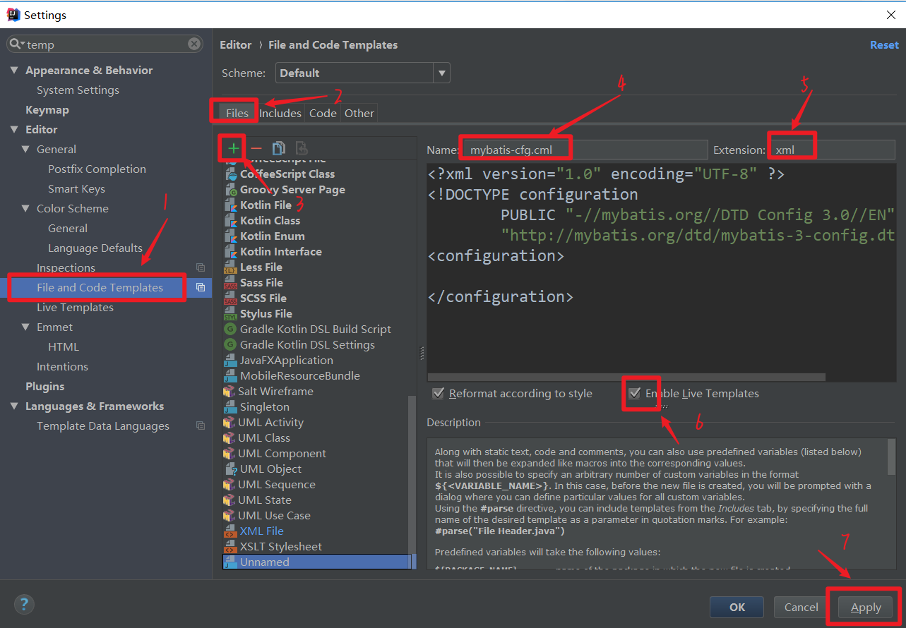

### 快速生成 对应的 实体mapper/dao的xml文件

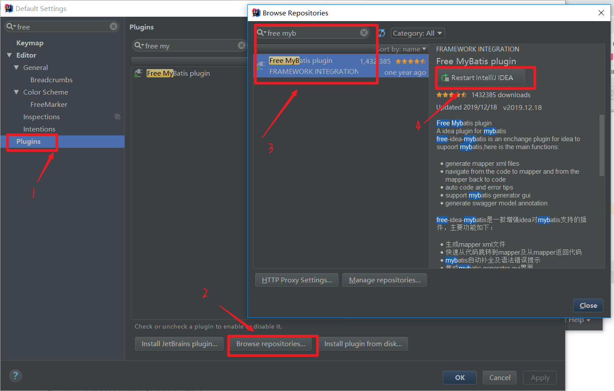

<span style="font-size:20px;font-weight:bold">下载好插件,在对应的mapper/dao接口按  alt+enter ,然后选择路径</span>

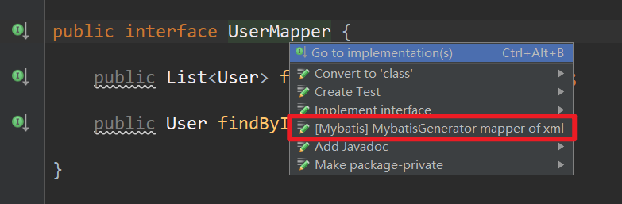


<span style="font-size:20px;font-weight:bold">内部方法同理,alt+enter </span>

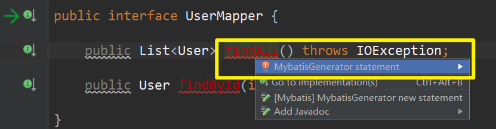

<span style="font-size:20px;font-weight:bold">然后在xml文件中,编写sql语句</span>

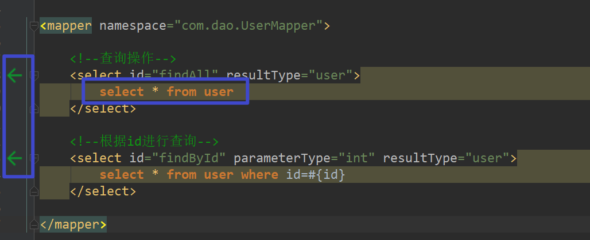

<span style="font-size:20px;font-weight:bold">编辑好,有对应的箭头提示</span>

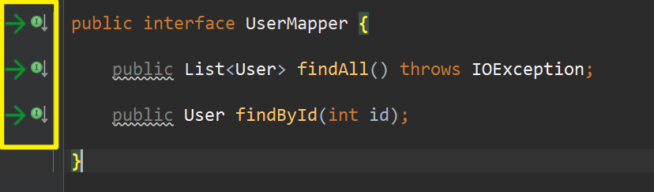!

## MyBatis的映射文件概述

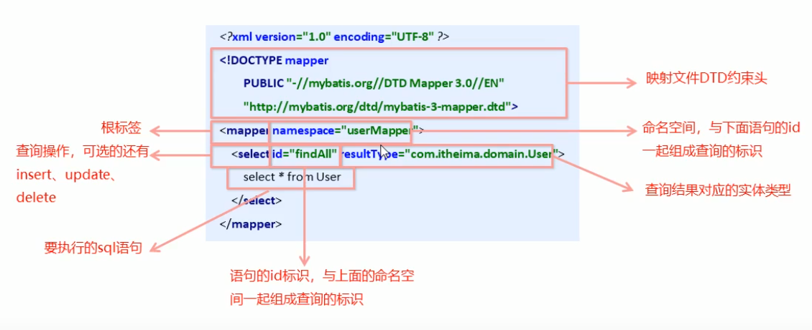

## MyBatis的增删改查操作

### 增

​							•插入语句使用insert标签

​							• 在映射文件中使用**parameterType**属性**指定要插入的数据类型**

​							•Sql语句中使用**#{实体属性名}**方式引用**实体中的属性值**

​							•如果参数只是一个值,#{可以写任意},但一般都写有意义的

​							•插入操作使用的API是**sqlSession.insert(“命名空间.id”,实体对象)**;

​							•插入操作涉及**数据库数据变化**，所以要使用sqlSession对象显示的==**提交事务**==，即sqlSession.commit() 

#### UserMapper.xml

```xml
<?xml version="1.0" encoding="UTF-8" ?>
<!DOCTYPE mapper PUBLIC "-//mybatis.org//DTD Mapper 3.0//EN" "http://mybatis.org/dtd/mybatis-3-mapper.dtd">

<mapper namespace="userMapper">  
    <!--插入操作-->
    <insert id="save" parameterType="com.domain.User">
        insert into user values(#{id},#{username},#{password})
    </insert>
</mapper>
```

#### 测试类

```java
@Test
//插入操作
public void test2() throws IOException {

    //模拟user对象
    User user = new User();
    user.setUsername("xxx");
    user.setPassword("abc");

    //获得核心配置文件
    InputStream resourceAsStream = Resources.getResourceAsStream("sqlMapConfig.xml");
    //获得session工厂对象
    SqlSessionFactory sqlSessionFactory = new SqlSessionFactoryBuilder().build(resourceAsStream);
    //获得session回话对象,参数为是否自动提交，如果设置为true，那么不需要手动提交事务 
    SqlSession sqlSession = sqlSessionFactory.openSession(true);
    //执行操作  参数：namespace+id
    sqlSession.insert("userMapper.save",user);

    //mybatis执行更新操作  提交事务
    // sqlSession.commit();

    //释放资源
    sqlSession.close();
}

```

### 改

​							• 修改语句使用update标签

​							• 修改操作使用的API是**sqlSession.update(“命名空间.id”,实体对象)**;

#### UserMapper.xml

```xml
<?xml version="1.0" encoding="UTF-8" ?>
<!DOCTYPE mapper PUBLIC "-//mybatis.org//DTD Mapper 3.0//EN" "http://mybatis.org/dtd/mybatis-3-mapper.dtd">

<mapper namespace="userMapper">  
    <!--修改操作-->
    <update id="update" parameterType="com.domain.User">
        update user set username=#{username},password=#{password} where id=#{id}
    </update>
</mapper>
```

#### 测试类

```java

@Test
//修改操作
public void test3() throws IOException {

    //模拟user对象
    User user = new User();
    user.setId(7);
    user.setUsername("lucy");
    user.setPassword("123");

    //获得核心配置文件
    InputStream resourceAsStream = Resources.getResourceAsStream("sqlMapConfig.xml");
    //获得session工厂对象
    SqlSessionFactory sqlSessionFactory = new SqlSessionFactoryBuilder().build(resourceAsStream);
    //获得session回话对象
    SqlSession sqlSession = sqlSessionFactory.openSession();
    //执行操作  参数：namespace+id
    sqlSession.update("userMapper.update",user);

    //mybatis执行更新操作  提交事务
    sqlSession.commit();

    //释放资源
    sqlSession.close();
}

```

### 删

​							• 删除语句使用delete标签

​							•Sql语句中使用**#{任意字符串}**方式引用传递的单个参数

​							•删除操作使用的API是**sqlSession.delete(“命名空间.id”,Object);**

#### UserMapper.xml

```xml
<?xml version="1.0" encoding="UTF-8" ?>
<!DOCTYPE mapper PUBLIC "-//mybatis.org//DTD Mapper 3.0//EN" "http://mybatis.org/dtd/mybatis-3-mapper.dtd">

<mapper namespace="userMapper">  
    <!--删除操作-->
    <delete id="delete" parameterType="int">
        delete from user where id=#{abc}
    </delete>
</mapper>
```

#### 测试类

```java
@Test
//删除操作
public void test4() throws IOException {

    //获得核心配置文件
    InputStream resourceAsStream = Resources.getResourceAsStream("sqlMapConfig.xml");
    //获得session工厂对象
    SqlSessionFactory sqlSessionFactory = new SqlSessionFactoryBuilder().build(resourceAsStream);
    //获得session回话对象
    SqlSession sqlSession = sqlSessionFactory.openSession();
    //执行操作  参数：namespace+id
    sqlSession.delete("userMapper.delete",8);

    //mybatis执行更新操作  提交事务
    sqlSession.commit();

    //释放资源
    sqlSession.close();
}

}
```

### 查

#### UserMapper.xml

```xml
<?xml version="1.0" encoding="UTF-8" ?>
<!DOCTYPE mapper PUBLIC "-//mybatis.org//DTD Mapper 3.0//EN" "http://mybatis.org/dtd/mybatis-3-mapper.dtd">

<mapper namespace="userMapper">  

    <!--查询操作-->
    <select id="findAll" resultType="user">
        select * from user
    </select>

    <!--根据id进行查询-->
    <select id="findById" resultType="user" parameterType="int">
        select * from user where id=#{id}
    </select>

</mapper>
```

#### 测试类

```java
@Test
//查询操作
public void test1() throws IOException {
    //获得核心配置文件
    InputStream resourceAsStream = Resources.getResourceAsStream("sqlMapConfig.xml");
    //获得session工厂对象
    SqlSessionFactory sqlSessionFactory = new SqlSessionFactoryBuilder().build(resourceAsStream);
    //获得session回话对象
    SqlSession sqlSession = sqlSessionFactory.openSession();
    //执行操作  参数：namespace+id
    List<User> userList = sqlSession.selectList("userMapper.findAll");
    //打印数据
    System.out.println(userList);
    //释放资源
    sqlSession.close();
}

@Test
//查询一个对象
public void test5() throws IOException {
    //获得核心配置文件
    InputStream resourceAsStream = Resources.getResourceAsStream("sqlMapConfig.xml");
    //获得session工厂对象
    SqlSessionFactory sqlSessionFactory = new SqlSessionFactoryBuilder().build(resourceAsStream);
    //获得session回话对象
    SqlSession sqlSession = sqlSessionFactory.openSession();
    //执行操作  参数：namespace+id
    User user = sqlSession.selectOne("userMapper.findById", 1);
    //打印数据
    System.out.println(user);
    //释放资源
    sqlSession.close();
}
```


### 小结,增删改查映射配置与API：

#### ==查询数据==

##### 映射配置

```java
List<User> userList = sqlSession.selectList("userMapper.findAll");

// 根据id进行查询
User user = sqlSession.selectOne("userMapper.findById", 1);
```

##### API

```xml
<select id="findAll" resultType="com.domain.User">
    select * from User
</select>

<!--根据id进行查询-->
<select id="findById" resultType="user" parameterType="int">
    select * from user where id=#{id}
</select>
```

#### ==添加数据==

##### 映射配置

```java
 sqlSession.insert("userMapper.add", user);
```

##### API

```xml
<insert id="add" parameterType="com.domain.User">
    insert into user values(#{id},#{username},#{password})
</insert>
```

#### ==修改数据==

##### 映射配置 

```java
sqlSession.update("userMapper.update", user);
```

##### API

```xml
<update id="update" parameterType="com.domain.User">
    update user set username=#{username},password=#{password} where id=#{id}
</update>
```

#### ==删除数据==

##### 映射配置

```java
sqlSession.delete("userMapper.delete",3);
```

##### API

```xml
<delete id="delete" parameterType="java.lang.Integer">
    delete from user where id=#{id}
</delete>
```


## 整合

```xml
<?xml version="1.0" encoding="UTF-8" ?>
<!DOCTYPE mapper PUBLIC "-//mybatis.org//DTD Mapper 3.0//EN" "http://mybatis.org/dtd/mybatis-3-mapper.dtd">


<mapper namespace="userMapper">

    <!--删除操作-->
    <delete id="delete" parameterType="int">
        delete from user where id=#{abc}
    </delete>

    <!--修改操作-->
    <update id="update" parameterType="com.domain.User">
        update user set username=#{username},password=#{password} where id=#{id}
    </update>

    <!--插入操作-->
    <insert id="save" parameterType="com.domain.User">
        insert into user values(#{id},#{username},#{password})
    </insert>

    <!--查询操作-->
    <select id="findAll" resultType="user">
        select * from user
    </select>

    <!--根据id进行查询-->
    <select id="findById" resultType="user" parameterType="int">
        select * from user where id=#{id}
    </select>

</mapper>
```


## 4. 参数获取

### 4.1 一个参数

#### 4.1.1 基本参数

​	我们可以使用#{}直接来取值，写任意名字都可以获取到参数。但是一般用方法的参数名来取。

例如：

接口中方法定义如下

~~~~java
User findById(Integer id);
~~~~

xml中内容如下:

```xml
<select id="findById" resultType="com.sangeng.pojo.User">  select * from user where id = #{id}</select>
```


#### 4.1.2 POJO

​	我们可以使用POJO中的属性名来获取对应的值。

例如：

接口中方法定义如下

~~~~java
User findByUser(User user);
~~~~

xml中内容如下：

~~~~xml
    <select id="findByUser" resultType="com.sangeng.pojo.User">
        select * from user where id = #{id} and username = #{username} and age = #{age} and address = #{address}
    </select>
~~~~


#### 4.1.3 Map

​	我们可以使用map中的key来获取对应的值。

例如：

接口中方法定义如下

~~~~java
User findByMap(Map map);
~~~~

xml中内容如下：

~~~~xml
<select id="findByMap" resultType="com.sangeng.pojo.User">
    select * from user where id = #{id} and username = #{username} and age = #{age} and address = #{address}
</select>
~~~~

方法调用：

~~~~java
Map map = new HashMap();
map.put("id",2);
map.put("username","PDD");
map.put("age",25);
map.put("address","上海");
userDao.findByMap(map);
~~~~


###  4.2 多个参数

​	Mybatis会把多个参数放入一个Map集合中，默认的key是argx和paramx这种格式。

例如：

接口中方法定义如下

~~~~java
User findByCondition(Integer id,String username);
~~~~

最终map中的键值对如下：

~~~~java
{arg1=PDD, arg0=2, param1=2, param2=PDD}
~~~~


​	我们虽然可以使用对应的默认key来获取值，但是这种方式可读性不好。我们一般在方法参数前使用@Param来设置参数名。

例如：

接口中方法定义

~~~~java
User findByCondition(@Param("id") Integer id,@Param("username") String username);
~~~~

最终map中的键值对如下：

~~~~
{id=2, param1=2, username=PDD, param2=PDD}
~~~~

所以我们就可以使用如下方式来获取参数

~~~~xml
    <select id="findByCondition" resultType="com.sangeng.pojo.User">
         select * from user where id = #{id} and username = #{username}
    </select>
~~~~

### 当实体类的属性名和表中的字段名不一致时:

#### 实体类

```java
public class User{
    private int id;
    private String lastName;
    private int deptId;
}
```

#### user表

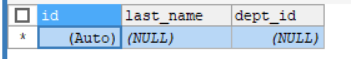

#### 1.写sql语句时起别名

```xml
<select id="findById" resultType="com.sangeng.pojo.User">
    select id,last_name lastName,dept_id deptId from user where id = #{id}
</select>
```

#### 2.开启驼峰命名规则

​										

​										开启驼峰命名规则,可以精数据库中的下划线映射为驼峰命名,例如last_name可以映射为lastName

##### config.xml配置文件

```xml
<settings>
    <!--开启自动驼峰命名映射-->
    <setting name="mapUnderscoreToCamelCase" value="true"/>
</settings>
```

##### mapper文件

```xml
<select id="findById" resultMap="userMap">
    select * from user where id = #{id}
</select>
```


#### 3.在Mapper映射文件中使用resultMap自定义映射规则

```xml
<resultMap id="userMap" type="user">
    <!--手动指定字段与实体属性的映射关系
            column: 数据表的字段名称
            property：实体的属性名称
        -->
    <id column="id" property="id"></id>
    <result column="last_name" property="lastName"></result>
    <result column="dept_id" property="deptId"></result> 
</resultMap>

<select id="findById" resultMap="userMap">
    select * from user where id = #{id}
</select>
```


### 4.3 总结

​	建议如果只有一个参数的时候不用做什么特殊处理。如果是有多个参数的情况下一定要加上@Param来设置参数名。


## MyBatis核心配置文件概述

### MyBatis核心配置文件层级关系

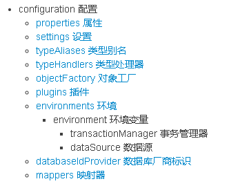

### MyBatis常用配置解析

#### 1.environments标签

​										**数据库环境的配置**，支持多环境配置

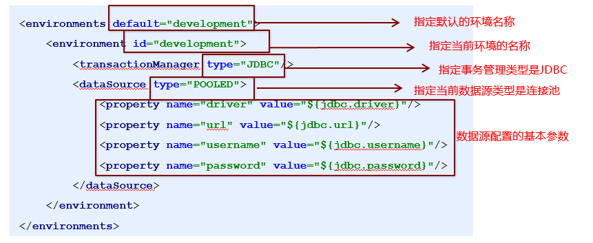

​						其中，**事务管理器（transactionManager）类型有两种：**

​							•**JDBC**：这个配置就是直接使用了JDBC 的提交和回滚设置，它依赖于从数据源得到的连接来管理事务作用域。

​							•**MANAGED**：这个配置几乎没做什么。它从来不提交或回滚一个连接，而是让容器来管理事务的整个生命周期（比如 					JEE 应用服务器的上下文）。 默认情况下它会关闭连接，然而一些容器并不希望这样，因此需要将 closeConnection 属性设					置为 false 来阻止它默认的关闭行为。

​						

​						其中，**数据源（dataSource）类型有三种：**

​							•**UNPOOLED**：这个数据源的实现只是每次被请求时打开和关闭连接。

​							•**POOLED**：这种数据源的实现利用“池”的概念将 JDBC 连接对象组织起来。

​							•**JNDI**：这个数据源的实现是为了能在如 EJB 或应用服务器这类容器中使用，容器可以集中或在外部配置数据源，然后放					置一个 JNDI 上下文的引用。

#### 2,mapper标签

​									该标签的作用是**加载映射**的，加载方式有如下几种：

​										•使用相对于**类路径的资源**引用，

​												例如：<mapper resource="org/mybatis/builder/AuthorMapper.xml"/>

​										•使用**完全限定资源定位符（URL）**，

​												例如：<mapper url="file:///var/mappers/AuthorMapper.xml"/>

​										•使用映射器接口实现类的**完全限定类名，**

​												例如：<mapper class="org.mybatis.builder.AuthorMapper"/>

​										•将包内的映射器接口实现全部注册为映射器，

​												例如：<package name="org.mybatis.builder"/>


#### 3.Properties标签

​									实际开发中，习惯将数据源的配置信息单独抽取成一个properties文件，该标签可以加载额外配置的properties文件

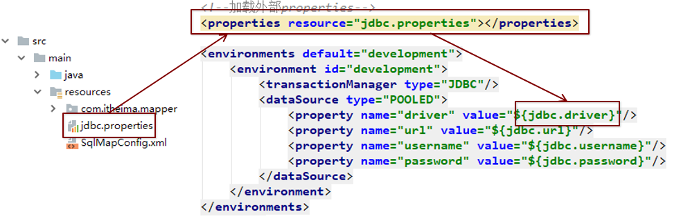


#### 4.typeAliases标签

​									**类型别名**是为Java 类型设置一个短的名字。原来的类型名称配置如下

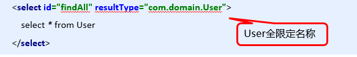

​									配置typeAliases，为com.domain.User定义别名为user

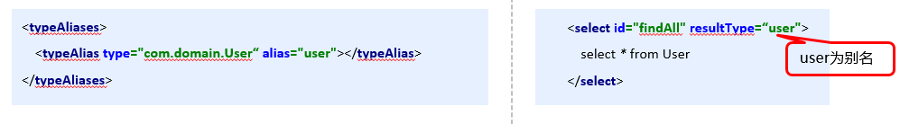

​								上面我们是自定义的别名，mybatis框架已经为我们设置好的一些常用的类型的别名

|  别名   | 数据类型 |
| :-----: | :------: |
| string  |  String  |
|  long   |   Long   |
|   int   | Integer  |
| double  |  Double  |
| boolean | Boolean  |
| ......  | .......  |

```xml
<!--定义别名-->
<typeAliases>
    <!--<typeAlias type="com.domain.Account" alias="account"></typeAlias>-->
    <!-- 将com.domain包下的所有实体,都起别名,不用每个实体都加一个别名语句 -->
    <package name="com.domain"></package>
</typeAliases>
```


### MyBatis相应API

#### SqlSession工厂构建器SqlSessionFactoryBuilder

​									常用API：SqlSessionFactory build(InputStream inputStream)

​									通过加载mybatis的核心文件的输入流的形式构建一个SqlSessionFactory对象

```java
String resource = "org/mybatis/builder/mybatis-config.xml"; 
InputStream inputStream = Resources.getResourceAsStream(resource); 
SqlSessionFactoryBuilder builder = new SqlSessionFactoryBuilder(); 
SqlSessionFactory factory = builder.build(inputStream);
```

​									其中， Resources 工具类，这个类在 org.apache.ibatis.io 包中。Resources 类帮助你从类路径下、文件系统或一							个 web URL 中加载资源文件。

#### SqlSession工厂对象SqlSessionFactory

​									SqlSessionFactory 有多个个方法创建 SqlSession 实例。常用的有如下两个：

|             **方法**             | **解释**                                                     |
| :------------------------------: | :----------------------------------------------------------- |
|          openSession()           | 会默认开启一个事务，但事务**不会自动提交**，<br />也就意味着需要手动提交该事务，更新操作数据才会持久化到数据库中 |
| openSession(boolean  autoCommit) | 参数为是否自动提交，如果设**置为true**，那么不需要手动提交事务 |

#### SqlSession会话对象

​									SqlSession 实例在 MyBatis 中是非常强大的一个类。在这里你会看到所有执行语句、提交或回滚事务和获取映射器							实例的方法。

##### 执行语句的方法主要有：

​											<T> T **selectOne**(String statement, Object parameter) 

​											<E> List<E> **selectList**(String statement, Object parameter) 

​											int **insert**(String statement, Object parameter) 

​											int **update**(String statement, Object parameter) 

​											int **delete**(String statement, Object parameter)

​											<T> T **getMapper**(Class<T> var1);								用于代理开发Dao层

##### 操作事务的方法主要有：

​											void **commit**() 

​											void **rollback**()

# Mybatis的Dao层实现

## 传统开发方式

​					①编写UserDao接口

​					②编写UserDaoImpl实现

​					③测试传统方式

#### UserMapper.xml

```xml
<?xml version="1.0" encoding="UTF-8" ?>
<!DOCTYPE mapper PUBLIC "-//mybatis.org//DTD Mapper 3.0//EN" "http://mybatis.org/dtd/mybatis-3-mapper.dtd">

<mapper namespace="userMapper">

    <!--查询操作-->
    <select id="findAll" resultType="user">
        select * from user
    </select>

    <!--根据id进行查询-->
    <select id="findById" parameterType="int" resultType="user">
        select * from user where id=#{id}
    </select>

</mapper>
```

#### sqlMapConfig.xml

```xml
<?xml version="1.0" encoding="UTF-8" ?>
<!DOCTYPE configuration PUBLIC "-//mybatis.org//DTD Config 3.0//EN" "http://mybatis.org/dtd/mybatis-3-config.dtd">
<configuration>

    <!--通过properties标签加载外部properties文件-->
    <properties resource="jdbc.properties"></properties>

    <!--自定义别名-->
    <typeAliases>
        <typeAlias type="com.domain.User" alias="user"></typeAlias>
    </typeAliases>

    <!--数据源环境-->
    <environments default="developement">
        <environment id="developement">
            <transactionManager type="JDBC"></transactionManager>
            <dataSource type="POOLED">
                <property name="driver" value="${jdbc.driver}"/>
                <property name="url" value="${jdbc.url}"/>
                <property name="username" value="${jdbc.username}"/>
                <property name="password" value="${jdbc.password}"/>
            </dataSource>
        </environment>
    </environments>


    <!--加载映射文件-->
    <mappers>
        <mapper resource="com/mapper/UserMapper.xml"></mapper>
    </mappers>


</configuration>
```


#### 接口

```java
public interface UserMapper {

    public List<User> findAll() throws IOException;
    public User findById(int id);

}

```

#### 实现类

```java
public class UserMapperImpl implements UserMapper {
    public List<User> findAll() throws IOException {
        InputStream resourceAsStream = Resources.getResourceAsStream("sqlMapConfig.xml");
        SqlSessionFactory sqlSessionFactory = new SqlSessionFactoryBuilder().build(resourceAsStream);
        SqlSession sqlSession = sqlSessionFactory.openSession();
       
        List<User> userList = sqlSession.selectList("userMapper.findAll");
        return userList;
    }

    public User findById(int id) {
        return null;
    }
}

```

#### 测试类

```java
@Test
public void testTraditionDao() throws IOException {
    UserMapper userDao = new UserMapperImpl();
    List<User> all = userDao.findAll();
    System.out.println(all);
}
```

## 代理开发方式

#### 代理开发方式介绍

​								采用 Mybatis 的代理开发方式实现 DAO 层的开发，这种方式是我们后面进入企业的主流。

​								Mapper 接口开发方法只需要程序员编写Mapper 接口（相当于Dao 接口），由Mybatis 框架根据接口定义创建接口的								动态代理对象，代理对象的方法体同上边Dao接口实现类方法。

​								Mapper 接口开发需要遵循以下规范：

​										1、 Mapper.xml文件中的**namespace**与mapper**接口的全限定名**相同

​										2、 Mapper**接口方法名**和Mapper.xml中定义的每个statement的**id**相同

​										3、 Mapper**接口方法的输入参数类型**和mapper.xml中定义的每个sql的**parameterType的类型**相同

​										4、 Mapper**接口方法的输出参数类型**和mapper.xml中定义的每个sql的**resultType的类型**相同

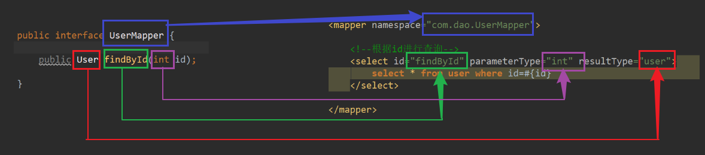


#### 接口

```java
public interface UserMapper {

    public List<User> findAll() throws IOException;

    public User findById(int id);
}

```

#### UserMapper.xml

```xml
<?xml version="1.0" encoding="UTF-8" ?>
<!DOCTYPE mapper PUBLIC "-//mybatis.org//DTD Mapper 3.0//EN" "http://mybatis.org/dtd/mybatis-3-mapper.dtd">

<mapper namespace="com.dao.UserMapper">

    <!--查询操作-->
    <select id="findAll" resultType="user">
        select * from user
    </select>

    <!--根据id进行查询-->
    <select id="findById" parameterType="int" resultType="user">
        select * from user where id=#{id}
    </select>

</mapper>
```

#### 测试类

```java
public class ServiceDemo {

    public static void main(String[] args) throws IOException {

        InputStream resourceAsStream = Resources.getResourceAsStream("sqlMapConfig.xml");
        SqlSessionFactory sqlSessionFactory = new SqlSessionFactoryBuilder().build(resourceAsStream);
        SqlSession sqlSession = sqlSessionFactory.openSession();
		
        UserMapper mapper = sqlSession.getMapper(UserMapper.class);
        
        List<User> all = mapper.findAll();
        System.out.println(all);

        User user = mapper.findById(1);
        System.out.println(user);

    }

}
```

## 获取参数时 #{}和${}的区别

​	如果使用#{}.他是**预编译**的sql可以防止SQL注入攻击
​	如果使用${}他是直接把参数值拿来进行拼接，这样会有**SQL注入的危险**

### 如果使用的是#{}来获取参数s值日志如下：

Preparing: select * from user where id = **?** and username = **?** and age = **?** and address = **?** 
Parameters: 2(Integer), 快乐风男(String), 29(Integer), 北京(String)

### 如果使用${}来获取参数值日志如下：

Preparing: select * from user where id = 2 and username = 快乐风男 and age = 29 and address = 北京 


​			#{}是预编译处理、是占位符，${}是字符串替换、是拼接符。
​			Mybatis在处理#{}时,会将sql中的#{}替换为?号,调用PreparedStatement来赋值;
​			Mybatis在处理${}时，就是把${}替换成变 量的值，调用Statement来赋值;
​			#{}的变量替换是在DBMS(数据库管理系统)中、变量替换后，#{} 对应的变量自动加上单引号
​			${}的变量替换是在DBMS(数据库管理系统)外、变鼂替换后，${} 对应的变量不会加上单引号
​			使用#{}可以有效的防止SQL注入，提高系统安全性。


# 动态sql语句


## 动态 SQL 之< if>

​						我们根据实体类的不同取值，使用不同的 SQL语句来进行查询。比如在 id如果不为空时可以根据id查询，如果username 				不同空时还要加入用户名作为条件。这种情况在我们的多条件组合查询中经常会碰到。


​						where标签等价于：

~~~~xml
<trim prefix="where" prefixOverrides="and|or" ></trim>
~~~~

​	可以使用where标签动态的拼接where并且去除  **第一个拼接的if语句的前缀**  的and或者or。

### UserMapper.xml

```xml
<select id="findByCondition" parameterType="user" resultType="user">
        <!-- select * from User where 1=1 and id=#{id} and username=#{username}-->
    select * from User
    <where>
        <if test="id!=0">
            and id=#{id}
        </if>
        <if test="username!=null">
            and username=#{username}
        </if>
    </where>
</select>
```

### 测试类

```java
@Test
public void test1() throws IOException {
    InputStream resourceAsStream = Resources.getResourceAsStream("sqlMapConfig.xml");
    SqlSessionFactory sqlSessionFactory = new SqlSessionFactoryBuilder().build(resourceAsStream);
    SqlSession sqlSession = sqlSessionFactory.openSession();

    UserMapper mapper = sqlSession.getMapper(UserMapper.class);

    //模拟条件user
    User condition = new User();
    //condition.setId(1);
    condition.setUsername("zhangsan");
    //condition.setPassword("123");

    List<User> userList = mapper.findByCondition(condition);

}
```


## 动态 SQL 之trim

​	可以使用该标签动态的添加前缀或后缀，也可以使用该标签动态的消除前缀。


### prefixOverrides属性

​	用来设置需要被清除的前缀,多个值可以用|分隔，注意|前后不要有空格。例如： and|or

例如：

~~~~xml
    <select id="findByCondition" resultType="com.sangeng.pojo.User">
        select * from user where
        <trim prefixOverrides="and|or" >
            and id = #{id}
        </trim>
    </select>
~~~~

最终执行的sql为： select * from user where id = ?


### suffixOverrides属性

​	用来设置需要被清除的后缀,多个值可以用|分隔，注意|前后不要有空格。例如： and|or

例如：

~~~~xml
    <select id="findByCondition" resultType="com.sangeng.pojo.User">
        select * from user where
        <trim suffixOverrides="or|and" >
            id = #{id} and
        </trim>
    </select>
~~~~

最终执行的sql为： select * from user where id = ?  去掉了后缀and


### prefix属性

​	用来设置动态添加的前缀，**如果标签中有内容**就会添加上设置的前缀

例如：

~~~~xml
    <select id="findByCondition" resultType="com.sangeng.pojo.User">
        select * from user
        <trim prefix="where" >
           1=1
        </trim>
    </select>
~~~~

最终执行的sql为：select * from user where 1=1   动态增加了前缀where


### suffix属性

​	用来设置动态添加的后缀，**如果标签中有内容**就会添加上设置的后缀

~~~~xml
    <select id="findByCondition" resultType="com.sangeng.pojo.User">
        select * from user
        <trim suffix="1=1" >
           where
        </trim>
    </select>
~~~~

最终执行的sql为：select * from user where 1=1   动态增加了后缀1=1


### 动态添加前缀where 并且消除前缀and或者or

~~~~java
User findByCondition(@Param("id") Integer id,@Param("username") String username);
~~~~

~~~~xml
    <select id="findByCondition" resultType="com.sangeng.pojo.User">
        select * from user
        <trim prefix="where" prefixOverrides="and|or" >
            <if test="id!=null">
                id = #{id}
            </if>
            <if test="username!=null">
                and username = #{username}
            </if>
        </trim>
    </select>
~~~~

调用方法时如果传入的id和username为null则执行的SQL为：select * from user

调用方法时如果传入的id为null，username不为null，则执行的SQL为：select * from user where username = ?


## 动态 SQL 之< foreach>

​						循环执行sql的拼接操作

### UserMapper.xml

```xml
<select id="findByIds" parameterType="list" resultType="user">
    <!--select * from user where id in (1,2,5)-->
    select * from User
    <where>
 		<!--
				collection:list集合,array数组;
				open:where后面固定的语句;
				close:最后结尾的语句;
				item:属性名;
				separator:分割符号
		-->
        <foreach collection="list" open="id in(" close=")" item="id" separator=",">#{id}</foreach>
    </where>
</select>
```

### 测试类

```java
@Test
public void test1() throws IOException {
    InputStream resourceAsStream = Resources.getResourceAsStream("sqlMapConfig.xml");
    SqlSessionFactory sqlSessionFactory = new SqlSessionFactoryBuilder().build(resourceAsStream);
    SqlSession sqlSession = sqlSessionFactory.openSession();

    UserMapper mapper = sqlSession.getMapper(UserMapper.class);

    //模拟ids的数据
    List<Integer> ids = new ArrayList<Integer>();
    ids.add(1);
    ids.add(2);

    // int[] ids = new int[]{2,5};
    // List<User> userList = mapper.findByIds(ids);
    // System.out.println(userList);

    List<User> userList = mapper.findByIds(ids);
    System.out.println(userList);
}
```

### foreach标签的属性含义如下：

​							< foreach>标签用于遍历集合，它的属性：

​									•collection：代表要遍历的集合元素，注意编写时不要写#{}

​									•open：代表语句的开始部分

​									•close：代表结束部分

​									•item：代表遍历集合的每个元素，生成的变量名

​									•sperator：代表分隔符


## 动态 SQL 之set

​	set标签等价于

~~~~xml
<trim prefix="set" suffixOverrides="," ></trim>
~~~~

​	可以使用set标签动态的拼接set并且去除后缀的逗号。

例如：

~~~~xml
    <update id="updateUser">
        UPDATE USER
        <set>
            <if test="username!=null">
                username = #{username},
            </if>
            <if test="age!=null">
                age = #{age},
            </if>
            <if test="address!=null">
                address = #{address},
            </if>
        </set>
        where id = #{id}
    </update>
~~~~

如果调用方法时传入的User对象的id为2，username不为null，其他属性都为null则最终执行的sql为：

​			UPDATE USER SET username = ? where id = ? 


## SQL片段抽取

​					Sql 中可将重复的 sql 提取出来，使用时用 include 引用即可，最终达到 sql 重用的目的

```xml
<?xml version="1.0" encoding="UTF-8" ?>
<!DOCTYPE mapper PUBLIC "-//mybatis.org//DTD Mapper 3.0//EN" "http://mybatis.org/dtd/mybatis-3-mapper.dtd">
<mapper namespace="com.mapper.UserMapper">

    <!--<select id="findByCondition" parameterType="user" resultType="user">-->
    <!--select * from User where 1=1 and id=#{id} and username=#{username}-->
    <!--select * from User-->
    <!--<where>-->
    <!--<if test="id!=0">-->
    <!--and id=#{id}-->
    <!--</if>-->
    <!--<if test="username!=null">-->
    <!--and-->
    <!--username=#{username}-->
    <!--</if>-->
    <!--</where>-->
    <!--</select>


    <!--sql语句抽取-->
    <sql id="selectUser">select * from user</sql>

    <select id="findByCondition" parameterType="user" resultType="user">
        <!--select * from User-->
        <include refid="selectUser"></include>

        <where>
            <if test="id!=0">
                and id=#{id}
            </if>
            <if test="username!=null">
                and username=#{username}
            </if>
            <if test="password!=null">
                and password=#{password}
            </if>
        </where>
    </select>
</mapper>
```

# MyBatis核心配置文件深入

## typeHandlers标签

​							无论是 MyBatis 在预处理语句（PreparedStatement）中设置一个参数时，还是从结果集中取出一个值时， 都会用**类型				处理器**将获取的值以合适的方式**转换成 Java 类型**。

​							你可以重写**类型处理器**或创建你自己的类型处理器来处理不支持的或非标准的类型。具体做法为：实现 							org.apache.ibatis. type.TypeHandler接口，或继承一个很便利的类 org.apache.ibatis.type.BaseTypeHandler， 然后可以选择性地将它映射到一个JDBC类型。例如需求：一个Java中的Date数据类型，我想将之存到数据库的时候存成一个1970年至今的毫秒数，取出来时转换成java的Date，即java的Date与数据库的varchar毫秒值之间转换。

### 开发步骤：

​								①定义转换类继承类**BaseTypeHandler<T>**

​								②覆盖**4个未实现的方法**，其中**setNonNullParameter**为**java程序**设置数据**到数据库**的回调方法，							**getNullableResult**为查询时 **mysql**的字符串类型**转换成 java**的Type类型的方法

​								③在MyBatis核心配置文件中进行注册

​								④测试转换是否正确

#### DateTypeHandler

```java
public class DateTypeHandler extends BaseTypeHandler<Date> {
    //将java类型 转换成 数据库需要的类型
    public void setNonNullParameter(PreparedStatement preparedStatement, int i, Date date, JdbcType jdbcType) throws SQLException {
        long time = date.getTime();
        preparedStatement.setLong(i,time);
    }

    //将数据库中类型 转换成java类型
    //String参数  要转换的字段名称
    //ResultSet 查询出的结果集
    public Date getNullableResult(ResultSet resultSet, String s) throws SQLException {
        //获得结果集中需要的数据(long) 转换成Date类型 返回
        long aLong = resultSet.getLong(s);
        Date date = new Date(aLong);
        return date;
    }

    //将数据库中类型 转换成java类型
    public Date getNullableResult(ResultSet resultSet, int i) throws SQLException {
        long aLong = resultSet.getLong(i);
        Date date = new Date(aLong);
        return date;
    }

    //将数据库中类型 转换成java类型
    public Date getNullableResult(CallableStatement callableStatement, int i) throws SQLException {
        long aLong = callableStatement.getLong(i);
        Date date = new Date(aLong);
        return date;
    }
}
```

#### 配置文件sqlMapConfig.xml

```xml
<!--注册类型处理器-->
<typeHandlers>
    <typeHandler handler="com.handler.DateTypeHandler"></typeHandler>
</typeHandlers>
```

#### UserMapper.xml

```xml
<?xml version="1.0" encoding="UTF-8" ?>
<!DOCTYPE mapper PUBLIC "-//mybatis.org//DTD Mapper 3.0//EN" "http://mybatis.org/dtd/mybatis-3-mapper.dtd">
<mapper namespace="com.mapper.UserMapper">

    <insert id="save" parameterType="user">
        insert into user values(#{id},#{username},#{password},#{birthday})
    </insert>

    <select id="findById" parameterType="int" resultType="user">
        select * from user where id=#{id}
    </select>

    <select id="findAll" resultType="user">
        select * from user
    </select>

</mapper>
```

#### 测试类

```java
// 将java数据存到数据库
@Test
public void test1() throws IOException {
    InputStream resourceAsStream = Resources.getResourceAsStream("sqlMapConfig.xml");
    SqlSessionFactory sqlSessionFactory = new SqlSessionFactoryBuilder().build(resourceAsStream);
    SqlSession sqlSession = sqlSessionFactory.openSession();
    UserMapper mapper = sqlSession.getMapper(UserMapper.class);

    //创建user
    User user = new User();
    user.setUsername("ceshi");
    user.setPassword("abc");
    user.setBirthday(new Date());
    //执行保存造作
    mapper.save(user);

    sqlSession.commit();
    sqlSession.close();
}

// 将数据库中的数据取出转为java数据
@Test
public void test2() throws IOException {
    InputStream resourceAsStream = Resources.getResourceAsStream("sqlMapConfig.xml");
    SqlSessionFactory sqlSessionFactory = new SqlSessionFactoryBuilder().build(resourceAsStream);
    SqlSession sqlSession = sqlSessionFactory.openSession();
    UserMapper mapper = sqlSession.getMapper(UserMapper.class);

    User user = mapper.findById(15);
    System.out.println("user中的birthday："+user.getBirthday());

    sqlSession.commit();
    sqlSession.close();
}

```

## plugins标签

​						MyBatis可以使用**第三方的插件**来对功能进行扩展，分页助手PageHelper是将分页的复杂操作进行封装，使用简单的方式				即可获得分页的相关数据

### 开发步骤：

​							①导入通用PageHelper的坐标

​							②在mybatis核心配置文件中配置PageHelper插件

​							③测试分页数据获取

#### pom.xml

```xml
<!-- 分页助手 -->
<dependency>
    <groupId>com.github.pagehelper</groupId>
    <artifactId>pagehelper</artifactId>
    <version>3.7.5</version>
</dependency>
<dependency>
    <groupId>com.github.jsqlparser</groupId>
    <artifactId>jsqlparser</artifactId>
    <version>0.9.1</version>
</dependency>
```

#### 配置文件sqlMapConfig.xml

```xml
<!--配置分页助手插件 注意：分页助手的插件  配置在通用mapper之前 -->
<plugins>
    <plugin interceptor="com.github.pagehelper.PageHelper">
        <!--指定方言 -->
        <property name="dialect" value="mysql"></property>
    </plugin>
</plugins>
```

#### 测试类

```java
@Test
public void test3() throws IOException {
    InputStream resourceAsStream = Resources.getResourceAsStream("sqlMapConfig.xml");
    SqlSessionFactory sqlSessionFactory = new SqlSessionFactoryBuilder().build(resourceAsStream);
    SqlSession sqlSession = sqlSessionFactory.openSession();
    UserMapper mapper = sqlSession.getMapper(UserMapper.class);

    //设置分页相关参数   当前页+每页显示的条数
    PageHelper.startPage(3,3);

    List<User> userList = mapper.findAll();
    for (User user : userList) {
        System.out.println(user);
    }

    //获得与分页相关参数
    PageInfo<User> pageInfo = new PageInfo<User>(userList);
    System.out.println("当前页："+pageInfo.getPageNum());
    System.out.println("每页显示条数："+pageInfo.getPageSize());
    System.out.println("总条数："+pageInfo.getTotal());
    System.out.println("总页数："+pageInfo.getPages());
    System.out.println("上一页："+pageInfo.getPrePage());
    System.out.println("下一页："+pageInfo.getNextPage());
    System.out.println("是否是第一个："+pageInfo.isIsFirstPage());
    System.out.println("是否是最后一个："+pageInfo.isIsLastPage());

    sqlSession.close();
}
```


# MyBatis常用配置解析

## MyBatis核心配置文件常用标签：

#### 1、properties标签：该标签可以加载外部的properties文件

#### 2、typeAliases标签：设置类型别名

#### 3、environments标签：数据源环境配置标签

#### 4、typeHandlers标签：配置自定义类型处理器

#### 5、plugins标签：配置MyBatis的插件

#### 6、mapper标签：加载映射


# Mybatis多表查询

## 一对一查询 

###  一对一查询的模型

​								用户表和订单表的关系为，一个用户有多个订单，一个订单只从属于一个用户

​								一对一查询的需求：查询一个订单，与此同时查询出该订单所属的用户


###  一对一查询的语句

​								对应的sql语句：select * from orders o,user u where o.uid=u.id;

### OrderMapper.xml

```xml
<?xml version="1.0" encoding="UTF-8" ?>
<!DOCTYPE mapper PUBLIC "-//mybatis.org//DTD Mapper 3.0//EN" "http://mybatis.org/dtd/mybatis-3-mapper.dtd">
<mapper namespace="com.mapper.OrderMapper">

    <resultMap id="orderMap" type="order">
        <!--手动指定字段与实体属性的映射关系
            column: 数据表的字段名称
            property：实体的属性名称
        -->
        <id column="oid" property="id"></id>
        <result column="ordertime" property="ordertime"></result>
        <result column="total" property="total"></result>
       
        <!--<result column="uid" property="user.id"></result>
        <result column="username" property="user.username"></result>
        <result column="password" property="user.password"></result>
        <result column="birthday" property="user.birthday"></result>-->

        <!--
            property: 当前实体(Order)中的属性名称(private User user)
            javaType: 当前实体(Order)中的属性的类型(User),用了别名
        -->
        <association property="user" javaType="user">
            <id column="uid" property="id"></id>
            <result column="username" property="username"></result>
            <result column="password" property="password"></result>
            <result column="birthday" property="birthday"></result>
        </association>

    </resultMap>

    <select id="findAll" resultMap="orderMap">
         SELECT *,o.id oid FROM orders o,USER u WHERE o.uid=u.id
    </select>

</mapper>
```

### 测试类

```java
@Test
public void test1() throws IOException {
    InputStream resourceAsStream = Resources.getResourceAsStream("sqlMapConfig.xml");
    SqlSessionFactory sqlSessionFactory = new SqlSessionFactoryBuilder().build(resourceAsStream);
    SqlSession sqlSession = sqlSessionFactory.openSession();

    OrderMapper mapper = sqlSession.getMapper(OrderMapper.class);
    List<Order> orderList = mapper.findAll();
    for (Order order : orderList) {
        System.out.println(order);
    }

    sqlSession.close();
}
```

## 一对多查询

### 一对多查询的模型

用户表和订单表的关系为，一个用户有多个订单，一个订单只从属于一个用户

一对多查询的需求：查询一个用户，与此同时查询出该用户具有的订单


###  一对多查询的语句

对应的sql语句：select *,o.id oid from user u left join orders o on u.id=o.uid;

### OrderMapper.xml

```xml
<?xml version="1.0" encoding="UTF-8" ?>
<!DOCTYPE mapper PUBLIC "-//mybatis.org//DTD Mapper 3.0//EN" "http://mybatis.org/dtd/mybatis-3-mapper.dtd">
<mapper namespace="com.mapper.UserMapper">


    <resultMap id="userMap" type="user">
        <id column="uid" property="id"></id>
        <result column="username" property="username"></result>
        <result column="password" property="password"></result>
        <result column="birthday" property="birthday"></result>
        <!--配置集合信息
            property:集合名称
            ofType：当前集合中的数据类型
        -->
        <collection property="orderList" ofType="order">
            <!--封装order的数据-->
            <id column="oid" property="id"></id>
            <result column="ordertime" property="ordertime"></result>
            <result column="total" property="total"></result>
        </collection>
    </resultMap>

    <select id="findAll" resultMap="userMap">
        SELECT *,o.id oid FROM USER u,orders o WHERE u.id=o.uid
    </select>

</mapper>
```

### 测试类

```java
@Test
public void test2() throws IOException {
    InputStream resourceAsStream = Resources.getResourceAsStream("sqlMapConfig.xml");
    SqlSessionFactory sqlSessionFactory = new SqlSessionFactoryBuilder().build(resourceAsStream);
    SqlSession sqlSession = sqlSessionFactory.openSession();

    UserMapper mapper = sqlSession.getMapper(UserMapper.class);
    List<User> userList = mapper.findAll();
    for (User user : userList) {
        System.out.println(user);
    }

    sqlSession.close();
}
```

## 多对多查询 

### 多对多查询的模型

用户表和角色表的关系为，一个用户有多个角色，一个角色被多个用户使用

多对多查询的需求：查询用户同时查询出该用户的所有角色

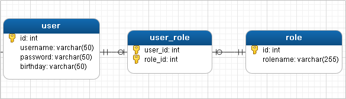

### 多对多查询的语句

对应的sql语句：SELECT * FROM sys_user u  LEFT JOIN sys_user_role ur ON u.id=ur.userId LEFT JOIN sys_role r  ON ur.roleId=r.id

### OrderMapper.xml

```xml
<?xml version="1.0" encoding="UTF-8" ?>
<!DOCTYPE mapper PUBLIC "-//mybatis.org//DTD Mapper 3.0//EN" "http://mybatis.org/dtd/mybatis-3-mapper.dtd">
<mapper namespace="com.mapper.UserMapper">

    <resultMap id="userRoleMap" type="user">
        <!--user的信息-->
        <id column="userId" property="id"></id>
        <result column="username" property="username"></result>
        <result column="password" property="password"></result>
        <result column="birthday" property="birthday"></result>

        <!--user内部的roleList信息-->
        <collection property="roleList" ofType="role">
            <id column="roleId" property="id"></id>
            <result column="roleName" property="roleName"></result>
            <result column="roleDesc" property="roleDesc"></result>
        </collection>
    </resultMap>

    <select id="findUserAndRoleAll" resultMap="userRoleMap">
        SELECT * FROM USER u,sys_user_role ur,sys_role r WHERE u.id=ur.userId AND ur.roleId=r.id
    </select>

</mapper>
```

### 测试类

```java
@Test
public void test3() throws IOException {
    InputStream resourceAsStream = Resources.getResourceAsStream("sqlMapConfig.xml");
    SqlSessionFactory sqlSessionFactory = new SqlSessionFactoryBuilder().build(resourceAsStream);
    SqlSession sqlSession = sqlSessionFactory.openSession();

    UserMapper mapper = sqlSession.getMapper(UserMapper.class);
    List<User> userAndRoleAll = mapper.findUserAndRoleAll();
    for (User user : userAndRoleAll) {
        System.out.println(user);
    }

    sqlSession.close();
}
```

## 分步查询(一对多,多对多)

​	如果有需要多表查询的需求我们也可以选择用多次查询的方式来查询出我们想要的数据。Mybatis也提供了对应的配置。

​	例如我们需要查询用户，要求还需要查询出该用户所具有的角色信息。我们可以选择先查询User表查询用户信息。然后在去查询关联的角色信息。	

### 2.2.1实现步骤

​	具体步骤如下：

#### ①定义查询方法

​	因为我们要分两步查询: 1.查询User 2.根据用户的id查询Role  所以我们需要定义下面两个方法，并且把对应的标签也先写好


1.查询User

~~~~java
    //根据用户名查询用户，并且要求把该用户所具有的角色信息也查询出来
    User findByUsername(String username);
~~~~


2.根据user_id查询Role

~~~~java
public interface RoleDao {
	//根据userId查询所具有的角色
    List<Role> findRoleByUserId(Integer userId);
}

~~~~

~~~~xml
    <!--根据userId查询所具有的角色-->
    <select id="findRoleByUserId" resultType="com.sangeng.pojo.Role">
        select 
            r.id,r.name,r.desc
        from 
            role r,user_role ur
        where 
            ur.role_id = r.id
            and ur.user_id = #{userId}
    </select>
~~~~

#### ②配置分步查询

​	我们期望的效果是调用findByUsername方法查询出来的结果中就包含角色的信息。所以我们可以设置findByUsername方法的RestltMap，指定分步查询

~~~~xml
    <resultMap id="userMap" type="com.sangeng.pojo.User">
        <id property="id" column="id"></id>
        <result property="username" column="username"></result>
        <result property="age" column="age"></result>
        <result property="address" column="address"></result>
    </resultMap>
    <!--
           select属性：指定用哪个查询来查询当前属性的数据 写法：包名.接口名.方法名
           column属性：设置当前结果集中哪列的数据作为select属性指定的查询方法需要参数
       -->
	<resultMap id="userRoleMapBySelect" type="com.sangeng.pojo.User" extends="userMap">
        <collection property="roles"
                    ofType="com.sangeng.pojo.Role"
                    select="com.sangeng.dao.RoleDao.findRoleByUserId"
                    column="id">
        </collection>
    </resultMap>
~~~~

​	指定findByUsername使用我们刚刚创建的resultMap

~~~~xml
    <!--根据用户名查询用户-->
    <select id="findByUsername" resultMap="userRoleMapBySelect">
        select id,username,age,address from user where username = #{username}
    </select>
~~~~

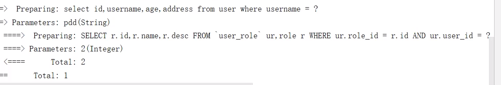

### 设置按需加载

​	我们可以设置按需加载，这样在我们代码中需要用到关联数据的时候才会去查询关联数据。

​	有两种方式可以配置分别是全局配置和局部配置


1. 局部配置

	设置fetchType属性为lazy

	~~~~xml
		<resultMap id="userRoleMapBySelect" type="com.sangeng.pojo.User" extends="userMap">
	        <collection property="roles"
	                    ofType="com.sangeng.pojo.Role"
	                    select="com.sangeng.dao.RoleDao.findRoleByUserId"
	                    column="id" fetchType="lazy">
	        </collection>
	    </resultMap>
	~~~~

	

2. 全局配置

	设置lazyLoadingEnabled为true

	~~~~xml
	    <settings>
	       <setting name="lazyLoadingEnabled" value="true"/>
	    </settings>
	~~~~


## Mybatis缓存

​	Mybatis的缓存其实就是把之前查到的数据存入内存（map）,下次如果还是查相同的东西，就可以直接从缓存中取，从而提高效率。

​	Mybatis有一级缓存和二级缓存之分，一级缓存（默认开启）是sqlsession级别的缓存。二级缓存相当于mapper级别的缓存。


### 一级缓存

几种不会使用一级缓存的情况
	1.调用相同方法但是传入的参数不同
	2.调用相同方法参数也相同，但是使用的是另外一个SqlSession
	3.如果查询完后，对同一个表进行了增，删改的操作，都会清空这sqlSession上的缓存
	4.如果手动调用SqlSession的clearCache方法清除缓存了，后面也使用不了缓存

### 二级缓存

​	注意：只在sqlsession调用了close或者commit后的数据才会进入二级缓存。

#### 开启二级缓存

①全局开启

在Mybatis核心配置文件中配置

~~~~xml
    <settings>
        <setting name="cacheEnabled" value="true"/>
    </settings>
~~~~


②局部开启

在要开启二级缓存的mapper映射文件中设置 cache标签

~~~~xml
<?xml version="1.0" encoding="UTF-8" ?>
<!DOCTYPE mapper PUBLIC "-//mybatis.org//DTD Mapper 3.0//EN" "http://mybatis.org/dtd/mybatis-3-mapper.dtd" >
<mapper namespace="com.sangeng.dao.RoleDao">
    <cache></cache>
</mapper>
~~~~


#### 使用建议

​	二级缓存在实际开发中基本不会使用。


# Mybatis的注解开发

## MyBatis的常用注解 

​							这几年来注解开发越来越流行，Mybatis也可以使用注解开发方式，这样我们就可以减少编写Mapper映射文件了。我们				先围绕一些基本的CRUD来学习，再学习复杂映射多表操作。

​							@Insert：实现新增

​							@Update：实现更新

​							@Delete：实现删除

​							@Select：实现查询

​							@Result：实现结果集封装

​							@Results：可以与@Result 一起使用，封装多个结果集

​							@One：实现一对一结果集封装

​							@Many：实现一对多结果集封装

## 增删改查

### sqlMapConfig.xml

```xml
<?xml version="1.0" encoding="UTF-8" ?>
<!DOCTYPE configuration PUBLIC "-//mybatis.org//DTD Config 3.0//EN" "http://mybatis.org/dtd/mybatis-3-config.dtd">
<configuration>

    <!--通过properties标签加载外部properties文件-->
    <properties resource="jdbc.properties"></properties>

    <!--自定义别名-->
    <typeAliases>
        <typeAlias type="com.domain.User" alias="user"></typeAlias>
    </typeAliases>

    <!--数据源环境-->
    <environments default="developement">
        <environment id="developement">
            <transactionManager type="JDBC"></transactionManager>
            <dataSource type="POOLED">
                <property name="driver" value="${jdbc.driver}"/>
                <property name="url" value="${jdbc.url}"/>
                <property name="username" value="${jdbc.username}"/>
                <property name="password" value="${jdbc.password}"/>
            </dataSource>
        </environment>
    </environments>

    <!--加载映射关系-->
    <mappers>
        <!--指定接口所在的包-->
        <package name="com.mapper"></package>
    </mappers>

</configuration>
```

### 增

#### UserMapper接口

```java
public interface UserMapper {

    @Insert("insert into user values(#{id},#{username},#{password},#{birthday})")
    public void save(User user);

}

```

#### 测试类

```java
public class MyBatisTest {
    
    private UserMapper mapper;

    @Before
    public void before() throws IOException {
        InputStream resourceAsStream = Resources.getResourceAsStream("sqlMapConfig.xml");
        SqlSessionFactory sqlSessionFactory = new SqlSessionFactoryBuilder().build(resourceAsStream);
        SqlSession sqlSession = sqlSessionFactory.openSession(true);
        mapper = sqlSession.getMapper(UserMapper.class);
    }

    @Test
    public void testSave(){
        User user = new User();
        user.setUsername("tom");
        user.setPassword("abc");
        mapper.save(user);
    }
}
```

### 删

#### UserMapper接口

```java
public interface UserMapper {

    @Delete("delete from user where id=#{id}")
    public void delete(int id);

}

```

#### 测试类

```java
public class MyBatisTest {

    private UserMapper mapper;

    @Before
    public void before() throws IOException {
        InputStream resourceAsStream = Resources.getResourceAsStream("sqlMapConfig.xml");
        SqlSessionFactory sqlSessionFactory = new SqlSessionFactoryBuilder().build(resourceAsStream);
        SqlSession sqlSession = sqlSessionFactory.openSession(true);
        mapper = sqlSession.getMapper(UserMapper.class);
    }

    @Test
    public void testDelete(){
        mapper.delete(18);
    }

}

```

### 改

#### UserMapper接口

```java
public interface UserMapper {

    @Update("update user set username=#{username},password=#{password} where id=#{id}")
    public void update(User user);

}
```

#### 测试类

```java
public class MyBatisTest {

    private UserMapper mapper;

    @Before
    public void before() throws IOException {
        InputStream resourceAsStream = Resources.getResourceAsStream("sqlMapConfig.xml");
        SqlSessionFactory sqlSessionFactory = new SqlSessionFactoryBuilder().build(resourceAsStream);
        SqlSession sqlSession = sqlSessionFactory.openSession(true);
        mapper = sqlSession.getMapper(UserMapper.class);
    }
  
    @Test
    public void testUpdate(){
        User user = new User();
        user.setId(18);
        user.setUsername("lucy");
        user.setPassword("123");
        mapper.update(user);
    }
}
```

### 查

#### UserMapper接口

```java
public interface UserMapper {

    @Select("select * from user where id=#{id}")
    public User findById(int id);

    @Select("select * from user")
    public List<User> findAll();

}
```

#### 测试类

```java
public class MyBatisTest {

    private UserMapper mapper;

    @Before
    public void before() throws IOException {
        InputStream resourceAsStream = Resources.getResourceAsStream("sqlMapConfig.xml");
        SqlSessionFactory sqlSessionFactory = new SqlSessionFactoryBuilder().build(resourceAsStream);
        SqlSession sqlSession = sqlSessionFactory.openSession(true);
        mapper = sqlSession.getMapper(UserMapper.class);
    }

    @Test
    public void testFindById(){
        User user = mapper.findById(2);
        System.out.println(user);
    }

    @Test
    public void testFindAll(){
        List<User> all = mapper.findAll();
        for (User user : all) {
            System.out.println(user);
        }
    }

}
```

## MyBatis的注解实现复杂映射开发 

​								实现复杂关系映射之前我们可以在映射文件中通过配置< resultMap>来实现，使用注解开发后，我们可以使用					**@Results**注解，**@Result**注解，**@One**注解，**@Many**注解组合完成复杂关系的配置

| **注解**          | **说明**                                                     |
| ----------------- | ------------------------------------------------------------ |
| @Results          | 代替的是标签< resultMap>该注解中可以使用单个@Result注解，也可以使用@Result集合。<br />使用格式：@Results（{@Result（），@Result（）}）或@Results（@Result（）） |
| @Resut            | 代替了< id>标签和< result>标签  @Result中属性介绍： <br />column：数据库的列名 <br /> property：需要装配的属性名  <br />one：需要使用的@One  注解（@Result（one=@One）（））） <br />many：需要使用的@Many  注解（@Result（many=@many）（））） |
| @One  （一对一）  | 代替了<assocation>  标签，是多表查询的关键，在注解中用来指定子查询返回单一对象。  <br />@One注解属性介绍：  <br />select:  指定用来多表查询的  sqlmapper  <br />使用格式：@Result(column="  ",property="",one=@One(select="")) |
| @Many  （多对一） | 代替了<collection>标签,  是是多表查询的关键，在注解中用来指定子查询返回对象集合。  <br />使用格式：@Result(property="",column="",many=@Many(select="")) |

### 一对一查询 

#### OrderMapper接口

```java
public interface OrderMapper {

    // select * from orders  查询所有order,获得uid,然后根据 uid 在 user表中查找该订单对应user
    // select * from user where id=#{id}
    @Select("select * from orders")
    @Results({
        @Result(column = "id",property = "id"),
        @Result(column = "ordertime",property = "ordertime"),
        @Result(column = "total",property = "total"),
        @Result(
            property = "user", //要封装的属性名称
            column = "uid", //根据那个字段去查询user表的数据,orders表的列名
            javaType = User.class, //要封装的实体类型
            //select属性 代表查询那个接口的方法获得数据
            one = @One(select = "com.mapper.UserMapper.findById")
        )
    })
    public List<Order> findAll();

    /*@Select("select *,o.id oid from orders o,user u where o.uid=u.id")
    @Results({
            @Result(column = "oid",property = "id"),
            @Result(column = "ordertime",property = "ordertime"),
            @Result(column = "total",property = "total"),
            @Result(column = "uid",property = "user.id"),
            @Result(column = "username",property = "user.username"),
            @Result(column = "password",property = "user.password")
    })
    public List<Order> findAll();*/

}

```

#### UserMapper接口

```java
public interface UserMapper {

    @Select("select * from user where id=#{id}")
    public User findById(int id);

}
```

#### 测试类

```java
public class MyBatisTest2 {
    private OrderMapper mapper;

    @Before
    public void before() throws IOException {
        InputStream resourceAsStream = Resources.getResourceAsStream("sqlMapConfig.xml");
        SqlSessionFactory sqlSessionFactory = new SqlSessionFactoryBuilder().build(resourceAsStream);
        SqlSession sqlSession = sqlSessionFactory.openSession(true);
        mapper = sqlSession.getMapper(OrderMapper.class);
    }

    @Test
    public void testSave(){
        List<Order> all = mapper.findAll();
        for (Order order : all) {
            System.out.println(order);
        }
    }
}
```


### 一对多查询

#### UserMapper接口

```java
public interface UserMapper {

    // select * from user  查询所有用户,获得id,根据id == order表中的 uid,查找该user对应的多个order
    // select * from orders where uid=#{uid}
    @Select("select * from user")
    @Results({
        @Result(id = true, column = "id", property = "id"),
        @Result(column = "username", property = "username"),
        @Result(column = "password", property = "password"),
        @Result(
            property = "orderList",
            column = "id",				// user表中列名 id
            javaType = List.class,
            many = @Many(select = "com.mapper.OrderMapper.findByUid")
        )
    })
    public List<User> findUserAndOrderAll();

}
```

#### OrderMapper接口

```java
public interface OrderMapper {

    @Select("select * from orders where uid=#{uid}")		// user表中的id在orders表中对应uid列
    public List<Order> findByUid(int uid);
}
```

#### 测试类

```java
public class MyBatisTest3 {

    private UserMapper mapper;

    @Before
    public void before() throws IOException {
        InputStream resourceAsStream = Resources.getResourceAsStream("sqlMapConfig.xml");
        SqlSessionFactory sqlSessionFactory = new SqlSessionFactoryBuilder().build(resourceAsStream);
        SqlSession sqlSession = sqlSessionFactory.openSession(true);
        mapper = sqlSession.getMapper(UserMapper.class);
    }

    @Test
    public void testSave(){
        List<User> userAndOrderAll = mapper.findUserAndOrderAll();
        for (User user : userAndOrderAll) {
            System.out.println(user);
        }
    }

}
```


### 多对多查询

#### UserMapper接口

```java
public interface UserMapper {

    //	SELECT * FROM USER 查询所有用户,获得id,根据id查找中间表和role表中,对应的user
    // 中间表的.roleId = role表中主键,然后该roleId对应的userId即为上句查找到的user的id
    // SELECT * FROM sys_user_role ur,sys_role r WHERE ur.roleId=r.id AND ur.userId=#{uid}
    @Select("SELECT * FROM USER")
    @Results({
        @Result(id = true, column = "id", property = "id"),
        @Result(column = "username", property = "username"),
        @Result(column = "password", property = "password"),
        @Result(
            property = "roleList",
            column = "id",
            javaType = List.class,
            many = @Many(select = "com.mapper.RoleMapper.findByUid")
        )
    })
    public List<User> findUserAndRoleAll();

}
```

#### RoleMapper接口

```java
public interface OrderMapper {

    @Select("SELECT * FROM sys_user_role ur,sys_role r WHERE ur.roleId=r.id AND ur.userId=#{uid}")
    public List<Role> findByUid(int uid);
}
```

#### 测试类

```java
public class MyBatisTest3 {

    private UserMapper mapper;

    @Before
    public void before() throws IOException {
        InputStream resourceAsStream = Resources.getResourceAsStream("sqlMapConfig.xml");
        SqlSessionFactory sqlSessionFactory = new SqlSessionFactoryBuilder().build(resourceAsStream);
        SqlSession sqlSession = sqlSessionFactory.openSession(true);
        mapper = sqlSession.getMapper(UserMapper.class);
    }


    @Test
    public void testSave(){
        List<User> userAndRoleAll = mapper.findUserAndRoleAll();
        for (User user : userAndRoleAll) {
            System.out.println(user);
        }
    }

}
```

