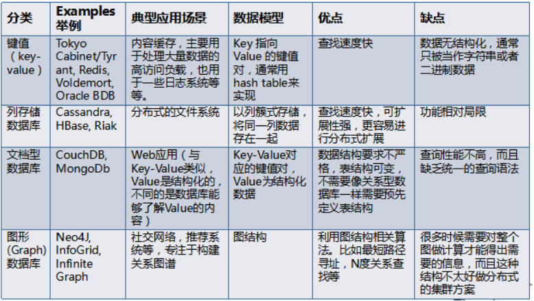
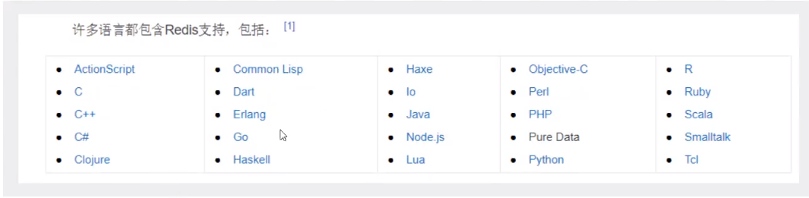
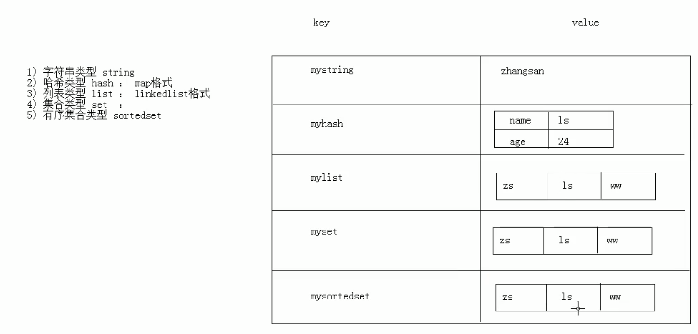
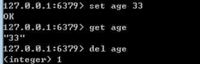
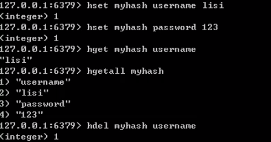
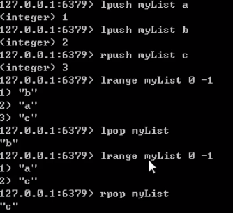
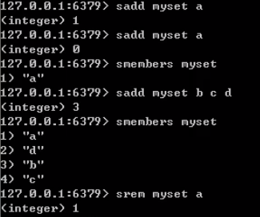
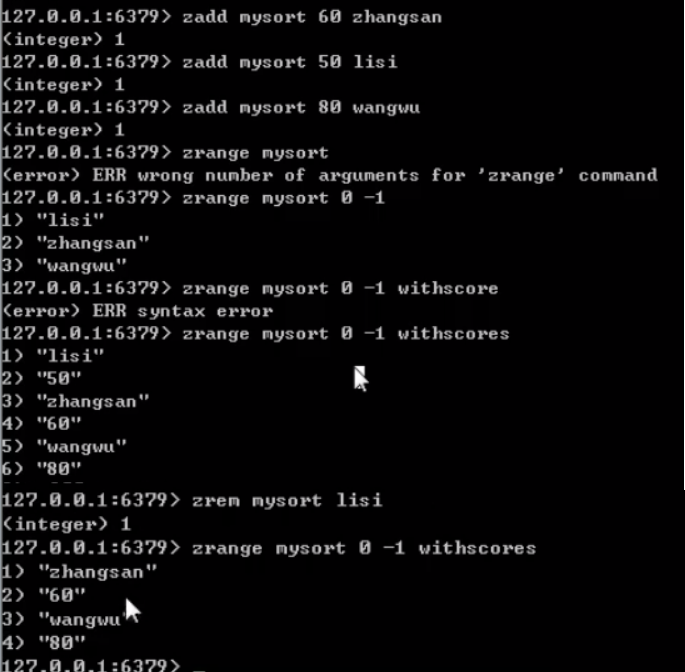
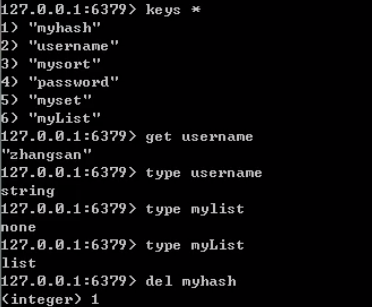

# 一、NOSQL特点

解耦!
1、方便扩展(数据之间没有关系,很好扩展! )
2、大数据量高性能( Redis一秒写8万次,读取11万, NoSQL的缓存记录级,是一种细粒度的缓存,性能会比较高! )
3、数据类型是多样型的! (不需要事先设计数据库!随取随用!如果是数据量十分大的表,很多人就无法设计了! )
4、传统RDBMS和NoSQL

```
传统的RDBMS
- 结构化组织
- SQL
- 数据和关系都存在单独的表中
- 操作操作，数据定义语言
- 严格的一致性
- 基础的事务
- ...
```


```
Nosql
- 不仅仅是数据
- 没有固定的查询语言
- 键值对存储，列存储，文档存储，图形数据库(社交关系) 
- 最终一致性，
- CAP定理和BASE (异地多活)初级架构师! 
- 高性能，高可用，高可扩
- ....
```

### 了解: 3V+3高

​								大数据时代的3V :主要是描述问题的
​										1.海量Volume
​										2.多样Variety
​										3.实时Velocity
​								大数据时代的3高:主要是对程序的要求
​										1.高并发
​										2.高可扩
​										3.高性能

# 二、NoSQL的四大分类

## 2.1 KV键值对:

​					●新浪: Redis
​					●美团: Redis + Tair
​					●阿里、百度: Redis + memecache

## 2.2 文档型数据库( bson格式和json一样) :

​					●**MongoDB** ( -般必须要掌握)
​							。MongoDB是一 个基于分布式文件存储的数据库, C++编写,主要用来处理大量的文档!
​							。MongoDB 是一个介于关系型数据库和非关系型数据中中间的产品! MongoDB是非关系型数据库中功能最丰富,最像关
​								系型数据库的!
​					●ConthDB

## 2.3 列存储数据库

​					●HBase
​					●分布式文件系统

## 2.4 图关系型数据库

​					●他不是存图形,放的是关系,比如:朋友圈社交网络,广告推荐!
​					●**Neo4j** , InfoGrid ;

## 2.5 四者对比




# 三、Redis入门

## 3.1 概述

### 3.1.1 Redis是什么?

​					Redis ( Remote Dictionary Server ),即远程字典服务!
​					是一个开源的使用ANSI C语言编写、支持网络、可基于内存亦可持久化的日志型、Key-Value数据库 ,并提供多种语言的API.



​		redis会周期性的把更新的数据写入磁盘或者把修改操作写入追加的记录文件,并且在此基础上实现了master-slave(主从)同步。

​		免费和开源!是当下最热i门]的NoSQL技术之一! 也被人们称之为结构化数据库!

### 3.1.2 Redis能干什么

​								1、内存存储、持久化,内存中是断电即失、所以说持久化很重要(rdb、 aof )
​								2、效率高,可以用于高速缓存
​								3、发布订阅系统
​								4、地图信息分析
​								5、计时器、计数器(浏览量!)
​								6、.....

### 3.1.3 特性

​								1、多样的数据类型
​								2、持久化
​								3、集群
​								4、事务

# Redis

## 概念

​						redis是一款高性能的NOSQL系列的非关系型数据库

### 关系型数据库

​							mysql.oracle...
​								1.数据之间有关联关系
​								2.数据存储在硬盘的文件上

### 非关系型数据库(NOSQL)

​							redis,hbase...
​							1.数据之间没有关联关系
​							2.数据存储在内存中

### 总结

​				关系型数据库与NOSQL数据库并非对立而是互补的关系,即通常情况下使用关系型数据库,在适合使用NOSQL的时候使用NOSQL数据库,让NOSQL数据库对关系型数据库的不足进行弥补
​				一般会将数据存储在关系型数据库中,在nosql数据库中备份存储关系型数据库的数据

## 命令操作

### 1.Redis的数据结构

​							redis存储的是:
​                     			 key,value
​					其中可以都是字符串,value有5中不同的数据结构

#### value的数据结构

##### 1) 字符串类型  String

##### 2)  哈希类型  hash

​									map格式

##### 3)  列表类型  list

​									linkedlist格式
​									支持重复元素

##### 4)  集合类型  set

​									不允许重复元素

##### 5)  有序集合类型   sortedset

​									不允许重复元素,且元素有顺序



#### 1).字符串类型  string

##### 1.存储

###### set  key  value

​											set name hiao

##### 2.获取

###### get  key

​											get name

##### 3.删除

###### del  key

​											del name



#### 2).哈希类型  hash

​									key : map集合
​									field : Map集合中的key
​									value  :  MAP集合中的value

##### 1.存储

###### hset  key field  value

​											hset myhash name lisi

##### 2.获取

###### hget  key  field  

​											hget myhash name

###### hgetall  key

​											 hgetall myhash

##### 3.删除

###### hdel  key  field  

​											hdel myhash name



#### 3).列表类型    list

​									可以添加一个元素到列表的头部(左边)或者尾部(右边)

##### 				1.添加

###### 1.lpush key value

​											将元素加入列表左边
​											lpush mylist a
​											lpush list a b c d

###### 2.rpush key value

​											将元素加入列表右边
​											rpush mylist b
​											 rpush list a b c d

##### 				2.获取

###### lrange  key  start  end

​											范围获取
​											-1 为结尾
​											lrange mylist 0 -1

##### 				3.删除

###### lpop key

​											删除列表最左边的元素,并将元素返回
​											lpop mylist

###### rpop key

​											删除列表最右边的元素,并将元素返回
​											 rpop mylist



#### 			4)  集合类型  set

​									不允许重复元素

##### 				1.存储

###### sadd key value

​											value可以是多个
​											sadd myset a b c d

##### 				2.获取

###### smembers key

​											获取set集合中所有元素
​											smembers myset

##### 				3.删除

###### srem  key  value

​											删除set集合中的某个元素
​											srem myset a



#### 			5)  有序集合类型   sortedset

​									不允许重复元素,且元素有顺序
​										排序是排的的  score  的顺序

##### 				1.存储

###### zadd  key  score value

​											可以覆盖
​											zadd mysort 50 lisi

##### 				2.获取

###### zrange key start end

​											zrange mysort 0 -1

###### zrange key start end  withscores

​											 zrange mysort 0 -1 withscores

##### 				3.删除

###### zrem key value

​										 zrem mysort lisi



#### 			6) 通用命令

##### 				1.keys *

​										查询所有的键

##### 				2.type key

​										获取键对应的value的类型

##### 				3.del  key

​										删除指定的key  value




## 持久化 

### 1.redis是一个内存数据库,当redis服务器重启,获取电脑重启,数据会丢失, 我们可以将redis内存中的数据持久化保存到硬盘的文件中 

### 2.redis持久化机制 

#### 1.RDB 

​									默认方式,不需要进行配置,默认就使用这种机制 

​									在一定的间隔时间中,检测key变化情况,然后持久化数据 

##### 1.编辑redis.conf文件 

​									save 900 1 

​									save 300 10 

​									save 60 10000 

​									after 900 sec (15 min) if at least 1 key changed 

​									after 300 sec (5 min) if at least 10 keys changed 

​									after 60 sec if at least 10000 keys changed 

​											15分钟至少改一个key 

​											3分钟至少改十个key 

​											1分钟至少改1000个key 

##### 2.重新启动redis服务器,并制定配置文件名称 

​									在当前目录下打开命令窗口 

​									redis-server.exe    redis.conf 

##### 3.一定的时间间隔中,key的变化情况符合条件,自动创建一个dump.rdb 

###### 优点: 

​											1、整个Redis数据库将只包含一个文件 dump.rdb,方便持久化。 

​											2、容灾性好,方便备份。 

​											3、性能最大化，fork 子进程来完成写操作，让主进程继续处理命令,所以是10最大化。使用单独子进程来进行												持久化，主进程不会进行任何10操作,保证了redis 的高性能 

​											4.相对于数据集大时，比AOF的启动效率更高。 

###### 缺点: 

​											1、数据安全性低。RDB是间隔一段时间进行持久化，如果持久化之间redis发生故障，会发 生数据丢失。所以										这 种方式更适合数据要求不严谨的时候) 

​											2、由于RDB是通过fork子进程来协助完成数据持久化工作的，因此,如果当数据集较大时， 可能会导致整个服										务器停止服务几百毫秒,甚至是1秒钟。 

#### 2.AOF 

 								日志记录的方式,可以记录每一条命令的操作.可以每一次命令操作后,持久化数据 

##### 1.编辑redis.conf文件 

 										appendonly no (关闭AOF) ---> appendonly yes(开启AOF) 
 	
 										appendfsync always 每一次操作都进行持久化 
 	
 										appendfsync everysec 每隔一秒进行一次持久化 
 	
 										appendfsync no 不进行持久化 

##### 2.重新启动redis服务器,并制定配置文件名称 

​									在当前目录下打开命令窗口 

​									redis-server.exe redis.conf 

##### 3.每隔一秒检测key的变化,自动创建一个appendonly.aof 

###### 优点: 

​									1、数据安全, Redis中提供了3中同步策略，即每秒同步、每修改同步和不同步。事实上,每秒 同步也是异步完成  												的，效率也是非常高的，所差的是一旦系统出现宕机现象，那么这一秒 钟之内修改的数据将会丢失。而海修  												改同步，我们可以将其视为同步持久化，即每次发 生的数据变化都会被立即记录到磁盘中。 

​									2、通过append模式写文件,即使中途服务器宕机也不会破坏已经存在的内容，可以通过 redis-check-aof具解决 												数据**一致性**问题。 

​									3、AOF 机制的rewrite模式。定期对AOF文件进行重写，以达到压缩的目的 

###### 缺点: 

​									1、AOF文件比RDB文件大，且恢复速度慢。 

​									2、数据集大的时候，比rdb启动效率低。 

​									3、运行效率没有RDB高 

#### 区别 

​									AOF文件比RDB更新频率高，优先使用AOF还原数据。 

​									AOF比RDB更安全也更大 

​									RDB性能比AOF好 

​									如果两个都配了**优先加载AOF** 


## Redis的过期键的删除策略 

​						Redis是key-value数据库,我们可以设置Redis中缓存的key的过期时间。Redis的过期策略就是指当Redis 中缓存的key过期 			了，Redis如何处理。 


​						●惰性过期:只有当访问一个key时,才会判断该key是否已过期，过期则清除。该策略可以最大化地节省 CPU资源，却对内存							非常不友好。极端情况可能出现大量的过期key没有再次被访问，从而不会被清除，占用大量内存。

​						●定期过期:每隔一定的时间，会扫描一定数量的数据库的expires字典中一定数量的key,并清除其中已过 期的key。该策略是							前两者(惰性过期,定时过期)的一个折中方案。通过调整定时扫描的时间间隔和每次扫描的限 定耗时，可以在不同情况下							使得CPU和内存 资源达到最优的平衡效果。 


​						(expires字典会保存所有设置了过期时间的key的过期时间数据，其中，key是指向键空间中的某个键的 指针,value是该键的						毫 秒精度的UNIX时间戳表示的过期时间。键空间是指该Redis集群中保存的所有键。) 


​						Redis中同时使用了惰性过期和定期过期两种过期策略。 


## 事务 

​						multi:开启事务

​						sadd jobs zhuanzhang:事务的第一条命令进入队列 

​						sadd jobs daozhang：事务的第二条命令进入队列 

​						exec:提交事务 

### 1、事务开始 

​								**MULTI**命令的执行，标识着一个事务的开始。 MULTI命令 会将客户端状态的flags属性中打开 REDIS_ MULTI 标识来完 						成的。 

### 2、命令入队 

​								当一个客户端切换到事务状态之后，服务器会根据这个客户端发送来的命令来执行不同的操作。 如果客户端发送的命 						令为MULTI、EXEC、 WATCH、 DISCARD中的一个， 立即执行这个命令,否则将命 令放入一个事务队列里面，然后向客户						端 返回QUEUED回复 

​						●如果客户端发送的命令为EXEC、DISCARD、 WATCH、MULTI 四个命令的其中一个, 那么服务器 立即执行这个命令。 

​						●如果客户端发送的是四个命令以外的其他命令,那么服务器并不立即执行这个命令。 


​								首先检查此命令的格式是否正确，如果不正确，服务器会在客户端状态(redisClient) 的flags属性 关闭REDIS_MULTI标 						识，并且返回错误信息给客户端。 

​						

​								如果正确，将这个命令放入一个事务队列里面，然后向客户端返回QUEUED回复. 


​								事务队列是按照FIFO的方式保存入队的命令 

### 3、事务执行 

​								客户端发送EXEC命令,服务器执行EXEC命令逻辑。 

​								●如果客户端状态的flags属性不包含REDIS_ MULTI 标识，或者包含REDIS DIRTY_ CAS或者 REDIS_ DIRTY_ EXEC标									识， 那么就直接取消事务的执行。 

​								●否则客户端处于事务状态(flags 有REDIS_ MULTI 标识)，服务器会遍历客户端的事务队列，然后执行事务队列中的所 									有命令,最后将返回结果全部返回给客户端; 


​								redis不枝持事务回滚机制，但是它会检查每一个事务中的命令是否错误。 

​								Redis事务不支持检查那些程序员自己逻辑错误。例如对String类型的数据库键执行对HashMap 类型的操作! 

### 常见命令 

​								●**WATCH**命令是一个乐观锁，可以为Redis事务提供check-and-set (CAS) 行为。可以监控一个或 多个键,一旦其中有一									个键被修改(或删除)，之后的事务就不会执行，监控一直持续到EXEC命令 。 

​								●**MULTI**命令用于开启一个事务，它总是返回OK。MULTI执行之后, 客户端可以继续向服务器发送 任意多条命令,这些									命令不会立即被执行，而是被放到一个队列中，当EXEC命令被调用时，所有队列中的命令才会被执行。 

​								●**EXEC**:执行所有事务块内的命令。返回事务块内所有命令的返回值，按命令执行的先后顺序排 列。当操作被打断时， 										返回空值null。

​								●通过调用**DISCARD**,客户端可以清空事务队列，并放弃执行事务，并诅客户端会从事务状态中退 出。 

​								●**UNWATCH**命令可以取消watch对所有key的监控。


# Jedis

```java
	// 1.获取连接

Jedis jedis = new Jedis("localhost",6379);
// 2.操作
jedis.set("username","zhangsan");
// 3.关闭连接
jedis.close();
```

​			Jedis jedis = new Jedis();
​			如果使用空参构造,默认值"localhost",6379端口

## 命令操作

### 			1).字符串类型  string

​				jedis.setex("action",10,"hiao");
​				将 action:hiao 键值对存入redis,并且10秒后自动删除该键值对

#### 				1.存储

​					set  key  value
​						jedis.set("username","zhangsan");

#### 				2.获取

​					get  key
​						String username = jedis.get("username");

#### 				3.删除

​					del  key

### 			2).哈希类型  hash

#### 				1.存储

​					hset  key field  value
​						jedis.hset("jhash","name","fff");

#### 				2.获取

​					hget  key  field  

​						String name = jedis.hget("jhash","name");
​					hgetall  key
​						Map<String, String> jhash = jedis.hgetAll("jhash");

#### 				3.删除

​					hdel  key  field  

### 			3).列表类型    list

​				可以添加一个元素到列表的头部(左边)或者尾部(右边)

#### 				1.添加

​					1.lpush key value
​						将元素加入列表左边
​						 jedis.lpush("jlist","a","b","c");
​					2.rpush key value
​						将元素加入列表右边
​						jedis.rpush("jlist","a","b","c");

#### 				2.获取

​					lrange  key  start  end
​						范围获取
​						-1 为结尾
​						List<String> jlist = jedis.lrange("jlist", 0, -1);

#### 				3.删除

​					lpop key
​						删除列表最左边的元素,并将元素返回
​						String lpop = jedis.lpop("jlist");
​					rpop key
​						删除列表最右边的元素,并将元素返回
​						String rpop = jedis.rpop("jlist");

### 			4)  集合类型  set

​				不允许重复元素

#### 				1.存储

​					sadd key value
​						value可以是多个
​						jedis.sadd("jset","a","b","c");

#### 				2.获取

​					smembers key
​						获取set集合中所有元素
​						Set<String> jset = jedis.smembers("jset");

#### 				3.删除

​					srem  key  value
​						删除set集合中的某个元素
​						srem myset a

### 			5)  有序集合类型   sortedset

​				不允许重复元素,且元素有顺序
​					排序是排的的  score  的顺序

#### 				1.存储

​					zadd  key  score value
​						可以覆盖
​						jedis.zadd("jsorted",40,"hiao");

#### 				2.获取

​					zrange key start end
​						Set<String> jsorted = jedis.zrange("jsorted", 0, -1);
​					zrange key start end  withscores
​						 zrange mysort 0 -1 withscores

#### 				3.删除

​					zrem key value
​						 zrem mysort lisi

### 			6) 通用命令

#### 				1.keys *

​					查询所有的键

#### 				2.type key

​					获取键对应的value的类型

#### 				3.del  key

​					删除指定的key  value24