# 描述一下Spring Bean的生命周期?

1、解析类得到BeanDefinition
2、如果有多个构造方法，则要推断构造方法
3、确定好构造方法后,进行实例化得到一个对象
4、对对象中的加了@Autowired注解的属性进行属性填充
5、回调Aware方法，比如BeanNameAware, BeanFactoryAware
6、调用BeanPostProcessor的初始化前的方法
7、调用初始化方法
8、调用BeanPostProcessor的初始化后的方法，在这里会进行AOP
9、如果当前创建的bean是单例的则会把bean放入单例池
10、使用bean
11、Spring容器关闭时调用DisposableBean中destory)方法

# Spring

## 概述

​					Spring是分层的Java SE/EE应用**full-stack(全栈,各层都有解决方案)轻量级开源**框架,以**IOC**(Inverse Of Control:反转控制,反转Bean的创建权)和**AOP**(Aspect Oriented programming:面向切面编程)为内核。

​					提供了**展现层SpringMVC**和**持久层Spring JDBCTemplate**以及**业务层事务管理**等众多的企业级应用技术，还能整合开源世界众多著名的第三方框架和类库，主键称为使用最多的Java EE企业应用开源框架。

​				

​					--从大小与开销两方面而言Spring都是轻量级的。
​					--通过控制反转(IoC)的技术达到松耦合的目的I
​					--提供了面向切面编程的丰富支持，允许通过分离应用的业务逻辑与系统级服务进行内聚性的开发
​					--包含并管理应用对象(Bean)的配置和生命周期，这个意义上是一个容器。
​					--将简单的组件配置、组合成为复杂的应用,这个意义上是一个框架。

## Spring的优势

### 1）方便解耦，简化开发

​							通过Spring提供的IoC容器，可以将对象间的依赖关系交由Spring进行控制，避免硬编码所造成的的过度耦合。用户也不必再为单例模式类、属性文件解析等这些很底层的需求编写代码，可以更专注于上层的应用。

### 2）AOP编程的支持

​							通过Spring的AOP功能，方便进行面向切面编程，许多不容易用传统OOP实现的功能可以通过AOP轻松实现。

### 3）声明式事务的支持

​							可以将我们从单调烦闷的事务管理代码中解脱出来，通过声明式方式灵活的进行事务管理，提高开发效率和质量。

### 4）方便程序的测试

​							可以用非容器依赖的编程方式进行几乎所有的测试工作，测试不再试昂贵的操作，而是随手可做的事情。

### 5）方便继承各种优秀框架

​							Spring对各种优秀框架(Struts、hibernate、hessian、Quartz等)的支持。

### 6）降低JavaEE API的使用难度

​							Spring对JavaEE API(如JDBC、JavaMail、远程调用等)进行了饱饱的封装层，使这些API的使用难度大为降低。

### 7）Java源码是经典学习范例

​								Spring的源代码设计精妙、结构清晰、匠心独用,处处体现着大师对Java设计模式灵活运用以及对Java技术的高深造诣。它的源代码无意是Java技术的最佳实践的范例。

## Spring程序开发步骤

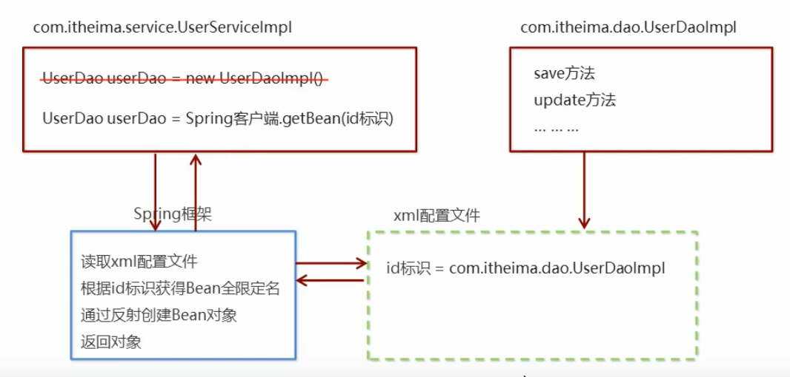

​							

### 创建Spring步骤

##### 1.在IdeaProjects文件夹下创建Spring文件夹

##### 2.IDEA->File->Open->选择Spring文件夹 

##### 3.新建modules->maven->Next->输入GroupId和ArtifactId

##### 4.Project Structure->Project(Project SDK/Project language level/Project compiler output(选择modules路径))

##### 5.Project Structure->Facets->+->Web->选择modules文件

##### 6.修改Deployment Descriptors(路径\项目名\modules名\ ==src\main\webapp==\WEB-INF\web.xml)和Web Resource Directories(路径\项目名\modules名\src\main\webapp)

### 快速入门

#### 1.配置pom.xml文件

```xml
<!-- 如果版本有问题,可以使用右侧Maven Projects 刷新Maven,等待即可  -->
<dependencies>
    <dependency>
        <groupId>org.springframework</groupId>
        <artifactId>spring-context</artifactId>
        <version>5.0.5.RELEASE</version>
    </dependency>
</dependencies>
```

#### 2.在src/main/java创建com/dao文件夹,创建接口UserDao(创建Bean)

#### 3.在dao文件夹下创建impl文件夹,创建实现类UserDaoImpl

#### 4.在resources文件夹下创建New->XML Configuration File -> Spring Config(如果没有 Spring Config,则是因为Maven版本有问题(个人看法))->创建applicationContext.xml

#### 5.配置applicationContext.xml文件

```xml
 <bean id="userDao" class="com.dao.impl.UserDaoImpl"></bean>
```

#### 6.创建测试类

```java
public class UserDaoDemo {
    public static void main(String[] args) {
        ApplicationContext app = new ClassPathXmlApplicationContext("applicationContext.xml");
        UserDao userDao = (UserDao) app.getBean("userDao");
        userDao.save();						// save running.....
    }
}
```

## 配置文件详解

​					用于配置对象交由Spring来创建。
​					默认情况下它调用的是类中的**无参构造函数**,如果没有无参构造函数则不能创建成功。

### 基本属性:

​							●**id**: Bean实例在Spring容器中的唯一标识
​							●**class**: Bean的全限定名称,全包名

### scope

​							值对象的作用范围,取值如下:

| 取值范围       | 说明                                                         |
| -------------- | ------------------------------------------------------------ |
| **singleton**  | **默认值,单例的**                                            |
| **prototype**  | **多例的,原型模式(克隆)**                                    |
| request        | WEB项目中,Spring创建一个Bean的对象,将对象存入到request域中   |
| session        | WEB项目中,Spring创建一个Bean的对象,将对象存入到session域中   |
| global session | WEB项目中,应用在Portlet环境,如果没有Porlet环境,那么global session相当于session |

#### singleton

​								Bean的 实例化个数:1个

​								Bean的实例化时机:当**Spring核心文件被加载**时,实例化配置的Bean实例

​										`ApplicationContext app = new ClassPathXmlApplicationContext("applicationContext.xml");`

​								Bean的生命周期:

​										对象创建:当应用加载,创建容器时,对象就被创建了

​										对象运行:只要容器在,对象一直活着

​										对象销毁:当应用卸载,销毁容器时,对象就被销毁了.


​								applicationContext.xml文件

```xml
<bean id="userDao" class="com.dao.impl.UserDaoImpl" scope="singleton"></bean>
```

​								测试类

```java
public void test1(){
    ApplicationContext app = new ClassPathXmlApplicationContext("applicationContext.xml");
    UserDao userDao1 = (UserDao) app.getBean("userDao");
    UserDao userDao2 = (UserDao) app.getBean("userDao");

    System.out.println(userDao1);				
    System.out.println(userDao2);
    System.out.println(userDao1 == userDao2);			// true
}
```

#### prototype

​								Bean的 实例化个数:多个

​								Bean的实例化时机:当**调用getBean()方法**时实例化Bean

​								Bean的生命周期:

​										对象创建:当使用对象时,创建新的对象实例.

​										对象运行:只要对象在使用中,就一直活着

​										对象销毁:当对象长时间不用时,被Java的垃圾回收器回收了


​								applicationContext.xml文件

```xml
<bean id="userDao" class="com.dao.impl.UserDaoImpl" scope="prototype"></bean>
```

​								测试类

```java
public void test1(){
    ApplicationContext app = new ClassPathXmlApplicationContext("applicationContext.xml");
    UserDao userDao1 = (UserDao) app.getBean("userDao");
    UserDao userDao2 = (UserDao) app.getBean("userDao");

    System.out.println(userDao1);				
    System.out.println(userDao2);
    System.out.println(userDao1 == userDao2);			// false
}
```

### 生命周期配置

#### init-method

​								指定类中的初始化方法名称(UserDao中的方法),先创建对象,再执行init方法

#### destroy-method

​								指定类中销毁方法名称

```xml
<bean id="userDao" class="com.dao.impl.UserDaoImpl" init-method="init" destroy-method="destory"></bean>
```

### 实例化三种方式

#### 无参构造方法实例化									

```xml
<bean id="userDao" class="com.dao.impl.UserDaoImpl"></bean>
```


#### 工厂静态方法实例化

```java
// 静态方法
public class StaticFactory {

    public static UserDao getUserDao(){
        return new UserDaoImpl();
    }
}
```

##### 配置文件

```xml
<bean id="userDao" class="com.factory.StaticFactory" factory-method="getUserDao" ></bean>
```


#### 工厂实例方法实例化

```java
// 工厂方法
public class DynamicFactory {
    public UserDao getUserDao(){
        return new UserDaoImpl();
    }
}

```

##### 配置文件

```xml
<bean id="factory" class="com.factory.DynamicFactory"  ></bean>
<bean id="userDao" factory-bean="factory" factory-method="getUserDao"></bean>
```


### 依赖注入

​							依赖注入(Dependency Injection) :它是Spring框架核心**I0C的具体实现**。
​								在编写程序时，通过控制反转,把**对象的创建交给了Spring**,但是代码中不可能出现没有依赖的情况。
​								I0C解耦只是降低他们的依赖关系，但不会消除。例如:业务层仍会调用持久层的方法。
​								那这种业务层和持久层的依赖关系，在使用Spring之后，就让Spring来维护了。
​								简单的说，就是坐等框架把持久层对象传入业务层，而不用我们自己去获取。

#### 1) set方法注入

##### 配置文件

```xml
<bean id="userDao" class="com.dao.impl.UserDaoImpl"  ></bean>
<!--name是UserServiceImpl属性名;ref引入是容器中bean的id-->
<bean id="userService" class="com.service.impl.UserServiceImpl"  >
    <property name="userDao" ref="userDao">

    </property>
</bean>
```

##### UserServiceImpl

```java
public class UserServiceImpl implements UserService {
    private UserDao userDao;            // 当一个属性

    // set方法注入
    public void setUserDao(UserDao userDao){
        this.userDao = userDao;
    }

    public void save() {
        userDao.save();
    }

}
```

##### UserController

```java
public class UserController {
    public static void main(String[] args) {
        ApplicationContext app = new ClassPathXmlApplicationContext("applicationContext.xml");
        UserService userService = (UserService) app.getBean("userService");
        userService.save();
        // UserService userService = new UserServiceImpl();
        // NullPointerException,没有从容器中拿出来,自己new出来的,没有userDao参数
        // userService.save();
    }
}
```

##### P命名空间

​								P命名空间注入本质也是set方法注入，但比起上述的set坊法注入更加方便,主要体现在配置文件中，如下:
​								首先，需要**引入P命名空间**:

```xml
xmlns:p="http://www.springframework.org/schema/p"
```

###### 配置文件

```xml
<bean id="userDao" class="com.dao.impl.UserDaoImpl"  ></bean>
<bean id="userService" class="com.service.impl.UserServiceImpl" p:userDao-ref="userDao"></bean>
```

#### 2)构造方法注入

##### 配置文件

```xml
<bean id="userDao" class="com.dao.impl.UserDaoImpl"  ></bean>
<!--name是UserServiceImpl构造方法参数名;ref引入是容器中bean的id-->
<bean id="userService" class="com.service.impl.UserServiceImpl">
    <constructor-arg name="userDao" ref="userDao"></constructor-arg>
</bean>
```

##### UserServiceImpl

```java
public class UserServiceImpl implements UserService {
    private UserDao userDao;            // 当一个属性

     // 构造方法注入
    public UserServiceImpl(UserDao userDao) {
        this.userDao = userDao;
    }

    public UserServiceImpl() {
    }

    public void save() {
        userDao.save();
    }

}
```

##### UserController

```java
public class UserController {
    public static void main(String[] args) {
        ApplicationContext app = new ClassPathXmlApplicationContext("applicationContext.xml");
        UserService userService = (UserService) app.getBean("userService");
       	userService.save();        
    }
}
```


### Bean的依赖注入的数据类型

​							上面的操作，都是注入的引用Bean,处了**对象的引用**可以注入，普通数据类型，集合等都可以在容器中进行注入。

#### 注入数据的三种数据类型

##### 普通数据类型

###### 配置文件

```xml
<!--注入普通数据-->
<!--构造方法注入-->
<bean id="userDao" class="com.dao.impl.UserDaoImpl">
    <property name="username" value="张三"></property>
    <property name="age" value="23"></property>
</bean>

<!--name是UserServiceImpl属性名;ref引入是容器中bean的id-->
<bean id="userService" class="com.service.impl.UserServiceImpl">
    <constructor-arg name="userDao" ref="userDao"></constructor-arg>
</bean>
```

###### UserDaoImpl

```java
public class UserDaoImpl implements UserDao {

    private String username;
    private int age;

    public void setUsername(String username) {
        this.username = username;
    }

    public void setAge(int age) {
        this.age = age;
    }

    public void save() {
        System.out.println("save running.....");
        System.out.println(username+"="+age);
    }

}
```

###### UserController

```java
public class UserController {
    public static void main(String[] args) {
        ApplicationContext app = new ClassPathXmlApplicationContext("applicationContext.xml");
        UserService userService = (UserService) app.getBean("userService");
       	userService.save();				//   save running.....		张三=23
    }
}
```

##### 引用数据类型

##### 集合数据类型

###### 配置文件

```xml
<!--name是UserServiceImpl属性名;ref引入是容器中bean的id-->
<bean id="userService" class="com.service.impl.UserServiceImpl">
    <constructor-arg name="userDao" ref="userDao"></constructor-arg>
</bean>

<!--用户引用-->
<bean id="user1" class="com.domain.User">
    <property name="name" value="张三"></property>
    <property name="addr" value="北京"></property>
</bean>
<bean id="user2" class="com.domain.User">
    <property name="name" value="李四"></property>
    <property name="addr" value="上海"></property>
</bean>

<!--注入集合数据-->
<!--构造方法注入-->
<bean id="userDao" class="com.dao.impl.UserDaoImpl">
   
    <!--list集合-->
    <property name="strList">
        <list>
            <value>aaa</value>
            <value>bbb</value>
            <value>ccc</value>
        </list>
    </property>

    <!--map集合-->
    <property name="userMap">
        <map>
            <!--value-ref引用,必须是容器中存在的,所以在下面引用User对象-->
            <entry key="u1" value-ref="user1"></entry>
            <entry key="u2" value-ref="user2"></entry>
        </map>
    </property>

    <!--properties-->
    <property name="properties">
        <props>
            <prop key="a3">aaa</prop>
            <prop key="b3">bbb</prop>
            <prop key="c3">ccc</prop>
        </props>
    </property>

</bean>


```

###### User

```java
public class User {
    private String name;
    private String addr;

    public User() {
    }

    public User(String name, String addr) {
        this.name = name;
        this.addr = addr;
    }

    public String getName() {
        return name;
    }

    public void setName(String name) {
        this.name = name;
    }

    public String getAddr() {
        return addr;
    }

    public void setAddr(String addr) {
        this.addr = addr;
    }

    @Override
    public String toString() {
        return "User{" +
            "name='" + name + '\'' +
            ", addr='" + addr + '\'' +
            '}';
    }
}
```

###### UserDaoImpl

```java
public class UserDaoImpl implements UserDao {    
    private List<String> strList;
    private Map<String,User> userMap;
    private Properties properties;

    public void setStrList(List<String> strList) {
        this.strList = strList;
    }

    public void setUserMap(Map<String, User> userMap) {
        this.userMap = userMap;
    }

    public void setProperties(Properties properties) {
        this.properties = properties;
    }

    public void save() {
        System.out.println("save running.....");
        System.out.println(strList);
        System.out.println(userMap);
        System.out.println(properties);
    }
}
```

###### UserController

```java
public class UserController {
    public static void main(String[] args) {
        ApplicationContext app = new ClassPathXmlApplicationContext("applicationContext.xml");
        UserService userService = (UserService) app.getBean("userService");
       	userService.save();				//   save running.....		张三=23
    }
}
```

> [aaa, bbb, ccc]
> {u1=User{name='张三', addr='北京'}, u2=User{name='李四', addr='上海'}}
> {c3=ccc, b3=bbb, a3=aaa}


### 引入其他配置文件(分模块开发)

​							实际开发中，Spring的配置内容非常多,这就导致Spring配置很繁杂且体积很大,所以，可以将部分配置拆解到其他
​							配置文件中，而在Spring主配置文件通过import标签进行加载

```xml
<import resource="applicationContext-user.xml"></import>
```

## 谈谈你对I0C的理解

### ioc容器:

​								实际上就是个map (key, value) ,里面**存的是各种对象**(在xml里配置的bean节点 @repository,@service,@controller,						@component) ，在项目启动的时候会读取配置文件里面的bean节点,根据全限定类名使用反射创建对象放到map里、扫描						到打上.上述注解的类还是通过反射创建对象放到map里。

​								这个时候map里就有各种对象了，接下来我们在代码里需要用到里面的对象时,再通过DI注入(autowired.resource等注						解，xml里bean节 点内的ref属性，项目启动的时候会读取xm|节点ref属性根据id注入,也会扫描这些注解，根据类型或id注						入; id就是对象名)。

### 控制反转:

​								没有引入I0C容器之前，对象A依赖于对象B,那么对象A在初始化或者运行到某-点的时候， 自己必须主动去创建对象B或						者使用已经创建的对象B。无论是创建还是使用对象B,控制权都在自己手上。

​								引入I0C容器之后，对象A与对象B之间失去了直接联系，当对象A运行到需要对象B的时候，I0C容器会主动创建一个对						象B注入到对象A需要的地方。
​								通过前后的对比，不难看出来:**对象A获得依赖对象B的过程，由主动行为变为了被动行为，控制权颠倒过来了**，这就						是"控制反转"这个名称的由来。
​								全部对象的控制权全部上缴给"第三方"10C容器，所以，I0C容器成 了整个系统的关键核心，它起到了一种类似“粘
​						合剂”的作用，把系统中的所有对象粘合在-起发挥作用, 如果没有这个“粘合剂”，对象与对象之间会彼此失去联
​						系，这就是有人把I0C容器比喻成"粘合剂"的由来,

### 依赖注入:

​								“获得依赖对象的过程被反转了”。控制被反转之后，获得依赖对象的过程由自身管理变为了由IOC容器主动注入。

​								**依赖注入是实现IOC的方法**，就是由IOC容器在运行期间，动态地将某种依赖关系注入到对象之中。


## 如何实现一个I0C容器

​					1、配置文件配置包扫描路径
​					2、递归包扫描获取.class文件
​					3、反射、确定需要交给I0C管理的类
​					4、对需要注入的类进行依赖注入
●配置文件中指定需要扫描的包路径
●定义一些注解,分别表示访问控制层、业务服务层、数据持久层、依赖注入注解、获取配置文件注解
●从配置文件中获取需要扫描的包路径,获取到当前路径下的文件信息及文件夹信息，我们将当前路径下所有以.class结尾的文件添加到一个Set集合中进行存储
●遍历这个set集合,获取在类上有指定注解的类,并将其交给I0C容器,定义一个安全的Map用来存储这些对象
●遍历这个IOC容器，获取到每一 个类的实例，判断里面是有有依赖其他的类的实例,然后进行递归注入


## Spring相关API

### BeanFactory和ApplicationContext有什么区别?

​							ApplicationContext是BeanFactory的子接口
​							ApplicationContext提供了更完整的功能:
​									①继承MessageSource,因此支持国际化。
​									②统一的资源文件访问方式。
​									③提供在监听器中注册bean的事件。
​									④同时加载多个配置文件。
​									⑤载入多个(有继承关系)上下文，使得每一个上下文都专注于一个特定的层次，比如应用的web层。

### ApplicationContext的实现类

#### 1)ClassPathXmlApplicationContext

​									它是从类的根路径下加载配置文件 推荐使用这种

```java
ApplicationContext app = new ClassPathXmlApplicationContext("applicationContext.xml");
```

#### 2)FileSystemXmlApplicationContext

​									它是从磁盘路径上加载配置文件,配置文件可以在磁盘的任意位置

```java
ApplicationContext app = new FileSystemXmlApplicationContext("E:\\IdeaProjects\\Spring\\spring_ioc\\src\\main\\resources\\applicationContext.xml");
```

#### 3)AnnotationConfigApplicationContext

​									当使用注解配置容器对象时,需要使用此类来创建spring容器.它用来读取注解.


## getBean()

#### 1.public Object getBean(String name)

​									name:容器中id的值

```java
UserService userService = (UserService) app.getBean("userService");
```

#### 2.public <T> T getBean(Class<T> requiredType)

​									requiredType:字节码对象

```java
 UserService userService = (UserService) app.getBean(UserService.class);
```

### 注意事项

​							其中，当参数的数据类型是字符串时，表示根据**Bean的id从容器中获得Bean实例**，返回是Object, **需要强转**。
​							当参数的数据类型是Class类型时，表示根据类型从容器中匹配Bean实例，当容器中相同类型的**Bean有多个**时,
​							则此方法会报错。

​							**有多个Bean时,建议使用通过id获取,同一个类型设置不同的id值**


## Spring配置数据源

### 数据源(连接池)的作用

​								●数据源(连接池)是提高程序性能如出现的
​								●事先实例化数据源，初始化部分连接资源
​								●使用连接资源时从数据源中获取
​								●使用完毕后将连接资源归还给数据源

​								●常见的数据源(连接池): **DBCP**、**C3P0**、**BoneCP**、**Druid**等

### 手动创建数据源

#### pom.xml

```xml
<dependencies>
    <dependency>
        <groupId>mysql</groupId>
        <artifactId>mysql-connector-java</artifactId>
        <version>5.1.32</version>
    </dependency>

    <dependency>
        <groupId>c3p0</groupId>
        <artifactId>c3p0</artifactId>
        <version>0.9.1.2</version>
    </dependency>

    <dependency>
        <groupId>com.alibaba</groupId>
        <artifactId>druid</artifactId>
        <version>1.1.10</version>
    </dependency>

    <dependency>
        <groupId>junit</groupId>
        <artifactId>junit</artifactId>
        <version>4.11</version>
    </dependency>

</dependencies>
```

#### 测试类

```java
@Test
// 测试手动创建才 c3p0 数据源
public void test1() throws Exception {

    ComboPooledDataSource dataSource = new ComboPooledDataSource();
    dataSource.setDriverClass("com.mysql.jdbc.Driver");
    dataSource.setJdbcUrl("jdbc:mysql://localhost:3306/test");
    dataSource.setUser("root");
    dataSource.setPassword("root");
    Connection connection = dataSource.getConnection();
    System.out.println(connection);
    connection.close();
}

@Test
// 测试手动创建才 druid 数据源
public void test2() throws Exception {

    DruidDataSource dataSource = new DruidDataSource();
    dataSource.setDriverClassName("com.mysql.jdbc.Driver");
    dataSource.setUrl("jdbc:mysql://localhost:3306/test");
    dataSource.setUsername("root");
    dataSource.setPassword("root");
    Connection connection = dataSource.getConnection();
    System.out.println(connection);
    connection.close();
}

@Test
// 测试手动创建才 c3p0 数据源(加载properties配置文件,方便解耦)
public void test3() throws Exception {
    // 读取配置文件 jdbc.properties,相对resources文件夹的位置
    ResourceBundle rb = ResourceBundle.getBundle("jdbc");
    String driver = rb.getString("driver");
    String url = rb.getString("url");
    String username = rb.getString("username");
    String password = rb.getString("password");

    // 创建数据源对象,设置连接参数
    ComboPooledDataSource dataSource = new ComboPooledDataSource();
    dataSource.setDriverClass(driver);
    dataSource.setJdbcUrl(url);
    dataSource.setUser(username);
    dataSource.setPassword(password);
    Connection connection = dataSource.getConnection();
    System.out.println(connection);
    connection.close();

}
```

### Spring配置数据源

#### pom.xml

```xml
<dependencies>
    <dependency>
        <groupId>mysql</groupId>
        <artifactId>mysql-connector-java</artifactId>
        <version>5.1.32</version>
    </dependency>

    <dependency>
        <groupId>c3p0</groupId>
        <artifactId>c3p0</artifactId>
        <version>0.9.1.2</version>
    </dependency>

    <dependency>
        <groupId>com.alibaba</groupId>
        <artifactId>druid</artifactId>
        <version>1.1.10</version>
    </dependency>

    <dependency>
        <groupId>junit</groupId>
        <artifactId>junit</artifactId>
        <version>4.11</version>
    </dependency>

    <dependency>
        <groupId>org.springframework</groupId>
        <artifactId>spring-context</artifactId>
        <version>5.0.5.RELEASE</version>
    </dependency>
</dependencies>
```

#### 配置文件

```xml
<bean id="dataSource" class="com.mchange.v2.c3p0.ComboPooledDataSource">
    <property name="driverClass" value="com.mysql.jdbc.Driver"></property>
    <property name="jdbcUrl" value="jdbc:mysql://localhost:3306/test"></property>
    <property name="user" value="root"></property>
    <property name="password" value="root"></property>
</bean>
```

#### 测试类

```java
@Test
    // 测试spring容器产生数据源对象
    public void test4() throws Exception {
        ApplicationContext app = new ClassPathXmlApplicationContext("applicationContext.xml");
        DataSource dataSource = app.getBean(DataSource.class);
        Connection connection = dataSource.getConnection();
        System.out.println(connection);
        connection.close();
    }
```

### Spring容器加载Properties文件

#### 配置文件

​									创建context命名空间

```xml
<!--xmlns:context就是第一句xmlns复制,然后beans改成context -->
<!--schemaLocation就是第一句复制,在引号内在粘贴一份,然后把所有beans改成context-->
<?xml version="1.0" encoding="UTF-8"?>
<beans xmlns="http://www.springframework.org/schema/beans"
       xmlns:xsi="http://www.w3.org/2001/XMLSchema-instance"
       xmlns:context="http://www.springframework.org/schema/context"
       xsi:schemaLocation=
               "http://www.springframework.org/schema/beans http://www.springframework.org/schema/beans/spring-beans.xsd
               http://www.springframework.org/schema/context http://www.springframework.org/schema/context/spring-context.xsd">

    <!--加载外部的properties文件 location为properties文件名,如果在resources文件夹下加上classpath:-->
    <context:property-placeholder location="classpath:jdbc.properties"></context:property-placeholder>

    <bean id="dataSource" class="com.mchange.v2.c3p0.ComboPooledDataSource">
        <property name="driverClass" value="${driver}"></property>
        <property name="jdbcUrl" value="${url}"></property>
        <property name="user" value="${username}"></property>
        <property name="password" value="${password}"></property>
    </bean>
</beans>
```

#### 测试类

```java
@Test
    // 测试spring容器产生数据源对象
    public void test4() throws Exception {
        ApplicationContext app = new ClassPathXmlApplicationContext("applicationContext.xml");
        DataSource dataSource = app.getBean(DataSource.class);
        Connection connection = dataSource.getConnection();
        System.out.println(connection);
        connection.close();
    }
```


## Spring注解

### Spring原始注解

​							Spring是**轻代码而重配置**的框架，配置比较繁重,影响开发效率,所以注解开发是一种趋势， **注解代替xml配置**
​							文件可以简化配置，提高开发效率。

​						Spring原始注解主要是替代<Bean>的配置

| 注解           | 说明                                              |
| -------------- | ------------------------------------------------- |
| @Component     | 使用在类上用于实例化Bean                          |
| @Controller    | 使用在web层类上用于实例化Bean                     |
| @Service       | 使用在service层类上用于实例化Bean                 |
| @Repository    | 使用在dao层类上用于实例化Bean                     |
| @Autowired     | 使用在字段上用于根据**类型**依赖注入              |
| @Qualifier     | 结合@Autowired-起使用用于根据名称进行依赖注入     |
| @Resource      | 相当于@Autowired+ @Qualifier,按照**名称**进行注入 |
| @Value         | 注入普通属性                                      |
| @Scope         | 标注Bean的作用范围                                |
| @PostConstruct | 使用在方法上标注该方法是Bean的初始化方法          |
| @PreDestroy    | 使用在方法上标注该方法是Bean的销毁方法            |

#### 注意:

​								使用注解进行开发时,需要在applicationContext.xml中配置组件扫描， 作用是指定哪个包及其子包下的Bean
​								需要进行扫描以便识别使用注解配置的类、字段和方法。

#### 配置文件

​									配置组件扫描,在context命名空间下

```xml
<?xml version="1.0" encoding="UTF-8"?>
<beans xmlns="http://www.springframework.org/schema/beans"
       xmlns:xsi="http://www.w3.org/2001/XMLSchema-instance"
       xmlns:context="http://www.springframework.org/schema/context"
       xsi:schemaLocation=
               "http://www.springframework.org/schema/beans http://www.springframework.org/schema/beans/spring-beans.xsd
                 http://www.springframework.org/schema/context http://www.springframework.org/schema/context/spring-context.xsd">

    <!--加载外部的properties文件 如果在resources文件夹下加上classpath-->
    <context:property-placeholder location="classpath:jdbc.properties"></context:property-placeholder>

    <bean id="dataSource" class="com.mchange.v2.c3p0.ComboPooledDataSource">
        <property name="driverClass" value="${driver}"></property>
        <property name="jdbcUrl" value="${url}"></property>
        <property name="user" value="${username}"></property>
        <property name="password" value="${password}"></property>
    </bean>

    <!-- 扫描com包下的所有注解 -->
    <context:component-scan base-package="com"></context:component-scan>
    
</beans>
```

#### 实例类

```java
//<bean id="userService" class="com.service.impl.UserServiceImpl"></bean>
@Service("userService")
@Scope("singleton")
public class UserServiceImpl implements UserService {

    @Value("${driver}")
    private  String name;

    // 依赖注入
    // <property name="userDao" -> Autowired    ref="userDao" -> Qualifier></property>
    @Autowired              // 按照数据类型从Spring容器中进行匹配的
    @Qualifier("userDao")   // 是按照id值从容器中进行匹配的,但是主要此处 @Qualifier 结合@Autowired一起使用
   // @Resource(name = "userDao")  // @Resource相当于 @Autowired + @Qualifier
    private UserDao userDao;

    public void save() {
        userDao.save();
        System.out.println(name);
    }

    @PostConstruct
    public void init(){
        System.out.println("初始化....");
    }

    @PreDestroy
    public void destroy(){
        System.out.println("销毁....");
    }
}

```

#### 测试类

```java
public class UserController {
    public static void main(String[] args) {
        ApplicationContext app = new ClassPathXmlApplicationContext("applicationContext.xml");
        UserService userService = app.getBean(UserService.class);
        userService.save();
    }
}
```


### Spring新注解

| 注解            | 说明                                                         |
| --------------- | ------------------------------------------------------------ |
| @Configuration  | 用于指定当前类是一个Spring配置类，当创建容器时会从该类上加载注解 |
| @ComponentScan  | 用于指定Spring在初始化容器时要扫描的包。<br />作用和在Spring的xml配置文件中的<br /><context:component-scan base-package="com.itheima"/>-样 |
| @Bean           | 使用在方法上，标注将该方法的返回值存储到Spring容器中         |
| @PropertySource | 用于加载properties文件中的配置                               |
| @lmport         | 用于导入其他配置类                                           |

#### SpringConfiguration类

```java
// 标志该类时Spring的核心配置类
@Configuration
//  <context:component-scan base-package="com"></context:component-scan>
@ComponentScan("com")
//  <import resource="xxx.xml"></import>
@Import(DataSourceConfiguration.class)
public class SpringConfiguration {


}
```

#### DataSourceConfiguration类

```java
// <context:property-placeholder location="classpath:jdbc.properties"></context:property-placeholder>
@PropertySource("classpath:jdbc.properties")
public class DataSourceConfiguration {
   
    @Value("${driver}")
    private String driver;

    @Value("${url}")
    private String jdbcUrl;

    @Value("${username}")
    private String user;

    @Value("${password}")
    private String password;

    @Bean("dataSource")     // Spring会将当前方法的返回值以指定名称存储到Spring容器中
    public DataSource getDataSource() throws Exception{
        ComboPooledDataSource dataSource = new ComboPooledDataSource();
        dataSource.setDriverClass(driver);
        dataSource.setJdbcUrl(jdbcUrl);
        dataSource.setUser(user);
        dataSource.setPassword(password);
        return dataSource;
    }
}
```

#### 测试类

```java
public class UserController {
    public static void main(String[] args) {
        ApplicationContext app = new AnnotationConfigApplicationContext(SpringConfiguration.class);
        UserService userService = app.getBean(UserService.class);

        userService.save();

    }
}
```


### Spring集成Junit步骤

​							①导入spring集成Junit的坐标
​							②使用@**Runwith**注解替换原来的**运行器**
​							③使用**@ContextConfiguration**指定**配置文件或配置类**
​							④使用**@Autowired**注入需要**测试的对象**
​							⑤创建测试方法进行测试

#### pom.xml

​									// 注意Junit版本要≥4.12

```xml
<!--①导入spring集成Junit的坐标-->
<dependency>
    <groupId>org.springframework</groupId>
    <artifactId>spring-test</artifactId>
    <version>5.0.5.RELEASE</version>
</dependency>
```

#### 测试类

```java
// ②使用@Runwith注解替换原来的运行器
@RunWith(SpringJUnit4ClassRunner.class)

//③使用@ContextConfiguration指定配置文件或配置类
//@ContextConfiguration("classpath:applicationContext.xml")
@ContextConfiguration(classes = SpringConfiguration.class)
public class SpringJunitTest {

    // ④使用@Autowired注入需要测试的对象
    @Autowired
    private UserService userService;

    @Autowired
    private DataSource dataSource;

    // ⑤创建测试方法进行测试
    @Test
    public void test1() throws SQLException {
        userService.save();
        System.out.println(dataSource.getConnection());
    }
}

```

## Spring的AOP的简介

### 什么是AOP

​								AOP为Aspect Oriented Programming的缩写，意思为**面向切面(目标方法+增强)编程**,是通过预编译方式和**运行期						动态代理**
​						实现程序功能的统一维护的一 种**技术**。
​								AOP是OOP的延续，是软件开发中的一个热点，也是Spring框架中的一个重要内容,是函数式编程的一种衍
​						生范型。利用AOP可以对业务逻辑的各个部分进行隔离，从而使得业务逻辑各部分之间的**耦合度降低**，提高程序
​						的可重用性，同时提高了开发的效率。


​								AOP:将程序中的交叉业务逻辑(比如安全,日志,事务等)，封装成一个切面,然后注入到目标对象(具体业务逻辑)中去。						AOP可以对某个对象或某些对象的功能进行增强，比如对象中的方法进行增强，可以在执行某个方法之前额外的做一些事						情， 在某个方法执行之后额外的做一些事情

### AOP的作用及其优势

​							●作用: 在程序运行期间,在不修改源码的情况下对方法进行功能增强
​							●优势: 减少重复代码,提高开发效率,并且便于维护

### AOP的底层实现

​							实际上，AOP的底层是通过Spring提供的的动态代理技术实现的。在运行期间，Spring通过动态代理技 术动态
​							的生成代理对象，代理对象方法执行时进行增强功能的介入，在去调用目标对象的方法,从而完成功能的增强。

### 常用的动态代理技术

​							●JDK 代理:基于**接口**的动态代理技术
​							●cglib代理:基于父类的动态代理技术,可以没有接口

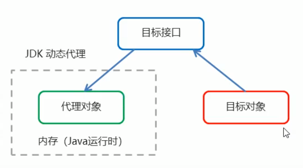


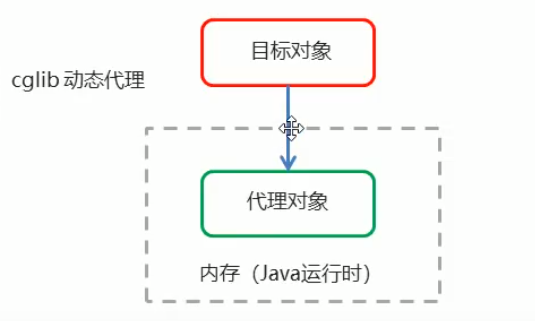


### JDK 动态代理

#### 接口

```java
public interface TargetInterface {
    public void save();
}

```

#### 实现类/被代理对象

```java
public class Target implements TargetInterface {
    public void save() {
        System.out.println("save running .....");
    }
}
```

#### 增强代理

```java
public class Advice {
    public void before(){
        System.out.println("前置增强...");
    }
    public void afterRunning(){
        System.out.println("后置增强...");
    }
}
```

#### 测试类

```java
public class ProxyTest {
    public static void main(String[] args) {
        
        final Target target = new Target();
        final Advice advice = new Advice();
        // 返回值就是动态生成的代理对象
        TargetInterface proxy = (TargetInterface) Proxy.newProxyInstance(
            target.getClass().getClassLoader(),    // 目标对象类加载器
            target.getClass().getInterfaces(),      // 目标对象相同的接口字节码数组
            new InvocationHandler() {
                // 调用代理对象的任何方法,实质执行的都是invoke方法
                public Object invoke(Object proxy, Method method, Object[] args) throws Throwable {
                    // 前置增强
                    advice.before();
                    method.invoke(target, args);     // 执行目标方法
                    // 后置增强
                    advice.afterRunning();
                    return null;
                }
            }
        );
        // 调用代理对象的方法
        proxy.save();
    }
}
```


### cglib动态代理

#### 被代理对象

```java
public class Target{
    public void save() {
        System.out.println("save running .....");
    }
}
```

#### 增强代理

```java
public class Advice {

    public void before(){
        System.out.println("前置增强...");
    }
    public void afterRunning(){
        System.out.println("后置增强...");
    }
}
```

#### 测试类

```java
public class ProxyTest {
    public static void main(String[] args) {
        
        final Target target = new Target();
        final Advice advice = new Advice();
        // 返回值就是动态生成的代理对象 基于cglib
        // 1.创建增强器
        Enhancer enhancer = new Enhancer();
        // 2.设置父类(目标)
        enhancer.setSuperclass(Target.class);
        // 3.设置回调
        enhancer.setCallback(new MethodInterceptor() {
            public Object intercept(Object proxy, Method method, Object[] args, MethodProxy methodProxy) throws Throwable {
                // 前置增强
                advice.before();
                method.invoke(target, args);     // 执行目标方法
                // 后置增强
                advice.afterRunning();
                return null;
            }
        });
        // 4.创建代理对象
        Target proxy = (Target) enhancer.create();
        proxy.save();

    }
}
```

### AOP相关概念

​						Spring的AOP实现底层就是对上面的动态代理的代码进行了封装,封装后我们只需要对需要关注的部分进行代码编
​						写,并通过配置的方式完成指定目标的方法增强。
​						常用的术语如下:
​							●Target (目标对象) :代理的目标对象
​							●Proxy (代理) : -个类被AOP织入增强后,就产生- 个结果代理类
​							●**Joinpoint (连接点)** :所谓连接点是指那些被拦截到的点。在spring中,，这些点指的是==**方法**==，因为spring只支持方
​							法类型的连接点,【可以增强的方法.】

​							●**==Pointcut== (切入点)** : 所谓切入点是指我们要对哪些Joinpoint进行拦截的定义【已经被增强的方法.】

​							●**==Advice== (通知/增强)** :所谓通知是指拦截到Joinpoint之后所要做的事情就是通知【增强逻辑所在的方法】

​							●**==Aspect== (切面)** :是切入点和通知(引介)的结合【切入点+通知】

​							●**==Weaving== (织入)** :是指把增强应用到目标对象来创建新的代理对象的过程。spring采用动态代理织入，而
​														Aspect采用编译期织入和类装载期织入【将切点和通知的结合过程】

### AOP开发明确的事项

#### 1.需要编写的内容

​									●编写核心业务代码(目标类的目标方法)
​									●编写切面类，切面类中有通知(增强功能方法)
​									●在配置文件中， 配置织入关系，即将哪些通知与哪些连接点进行结合

#### AOP技术实现的内容

​									Spring框架监控切入点方法的执行。一旦监控到切入点方法被运行，使用代理机制，动态创建目标对象的
​									代理对象，根据通知类别，在代理对象的对应位置,将通知对应的功能织入，完成完整的代码逻辑运行。

#### AOP底层使用哪种代理方式

​									在spring中,框架会根据目标类**是否实现了接口**来决定采用哪种动态代理的方式。

## 基于XML的AOP开发

### 快速入门

​							①导入AOP相关坐标
​							②创建目标接口和目标类(内部有切点)
​							③创建切面类(内部有增强方法)
​							④将目标类和切面类的对象创建权交给spring
​							⑤在applicationContextxml中配置织入关系
​							⑥测试代码

#### pom.xml

​									<span style="color:red;font-size:25px">注意版本要一致</span>

```xml
<dependencies>

    <dependency>
        <groupId>org.springframework</groupId>
        <artifactId>spring-context</artifactId>
        <version>5.0.5.RELEASE</version>
    </dependency>

    <dependency>
        <groupId>org.springframework</groupId>
        <artifactId>spring-core</artifactId>
        <version>5.0.5.RELEASE</version>
    </dependency>

    <dependency>
        <groupId>org.aspectj</groupId>
        <artifactId>aspectjweaver</artifactId>
        <version> 1.8.4</version>
    </dependency>

    <dependency>
        <groupId>junit</groupId>
        <artifactId>junit</artifactId>
        <version>4.11</version>
    </dependency>

    <dependency>
        <groupId>org.springframework</groupId>
        <artifactId>spring-test</artifactId>
        <version>5.0.5.RELEASE</version>
    </dependency>
    <dependency>
        <groupId>junit</groupId>
        <artifactId>junit</artifactId>
        <version>RELEASE</version>
    </dependency>
    <dependency>
        <groupId>org.springframework</groupId>
        <artifactId>spring-beans</artifactId>
        <version>5.0.5.RELEASE</version>
    </dependency>

</dependencies>
```

#### 目标接口

```java
// 目标接口
public interface TargetInterface {
    public void save();
}
```

#### 目标类

```java
// 目标类
public class Target implements TargetInterface {
    public void save() {
        System.out.println("save running .....");
    }
}
```

#### 切面类

```java
// 切面类
public class MyAspect {
    public void before(){
        System.out.println("前置增强...");
    }
}
```

#### 配置文件applicationContext.xml

​									**引入aop命名空间**

```xml
<?xml version="1.0" encoding="UTF-8"?>
<beans xmlns="http://www.springframework.org/schema/beans"
       xmlns:xsi="http://www.w3.org/2001/XMLSchema-instance"
       xmlns:aop="http://www.springframework.org/schema/aop"
       xsi:schemaLocation="
                           http://www.springframework.org/schema/beans http://www.springframework.org/schema/beans/spring-beans.xsd
                           http://www.springframework.org/schema/aop http://www.springframework.org/schema/aop/spring-aop.xsd">

    <!-- 目标对象 -->
    <bean id="target" class="com.aop.Target"></bean>
    <!--切面对象-->
    <bean id="myAspect" class="com.aop.MyAspect"></bean>
    
    <!--配置织入,告诉spring框架 哪些方法(切点)需要进行哪些增强(前置、后置...)-->
    <aop:config>
        <!--声明切面-->
        <aop:aspect ref="myAspect">
            <!--切面:切点+通知 method切面类的前置方法名 pointcut需要增强的目标方法-->
            <aop:before method="before" pointcut="execution(public void com.aop.Target.save())"></aop:before>
        </aop:aspect>
    </aop:config>
</beans>
```

#### 测试类

```java
@RunWith(SpringJUnit4ClassRunner.class)
@ContextConfiguration("classpath:applicationContext.xml")
public class AopTest {

    @Autowired
    private TargetInterface target;

    @Test
    public void test1(){
        target.save();
    }

}
```


### XML配置AOP详解

#### 1.切点表达式的写法

​								表达式语法:
​									execution([修饰符] **返回值类型 包名类名.方法名(参数)**)
​										●访问修饰符可以省略
​										●返回值类型、 包名、类名、方法名可以**使用星号***代表任意

​										●包名与类名之间一个点 **.代表当前包下的类**，**两个点.. 表示当前包及其子包下的类**
​										●参数列表可以使用两个点 .. 表示任意个数,任意类型的参数列表

```xml
execution(public void com.aop.Target.method())		com.aop.Target类中的method方法,无返回值和参数
execution (void com.aop.Target.*(..))				com.aop.Target类中的任意方法*,任意参数(..)
execution(* com.aop.*.*(..))						任意返回类型的com.aop包下的任意类的任意方法,任意参数
execution(* com.aop..*.*(..))						任意返回类型的com.aop包及其子包下的任意类的任意方法,任意参数
execution(* *..*.*(..) )							任意返回类型的任意包及其子包下的任意类的任意方法,任意参数
```

#### 2.通知的类型

​								通知的配置语法:
​									<aop:通知类型 method=“切面类中方法名”pointcut= "切点表达式"></ aop:通知类型>

| 名称         | 标签                   | 说明                                                         |
| ------------ | ---------------------- | ------------------------------------------------------------ |
| 前置通知     | <aop:before >          | 用于配置前置通知。指定增强的方法在切入点方法之前执行         |
| 后置通知     | <aop:after-returning > | 用于配置后置通知。指定增强的方法在切入点方法之后执行         |
| 环绕通知     | <aop:around >          | 用于配置环绕通知。指定增强的方法在切入点方法之前和之后都执行 |
| 异常抛出通知 | <aop:throwing >        | 用于配置异常抛出通知。指定增强的方法在出现异常时执行         |
| 最终通知     | <aop:after >           | 用于配置最终通知。无论增强方式执行是否有异常都会执行         |

##### 配置文件

```xml
 <!--配置织入,告诉spring框架 哪些方法(切点)需要进行哪些增强(前置、后置...)-->
    <aop:config>
        <!--声明切面-->
        <aop:aspect ref="myAspect">
            
            <!--抽取切点表达式-->
            <aop:pointcut id="myPointcut" expression="execution(* com.aop.*.*(..))"></aop:pointcut>
            
            <!--切面:切点+通知 method切面类的前置方法名 pointcut需要增强的目标方法-->
            <aop:before method="before" pointcut-ref="myPointcut"></aop:before>
            <aop:after-returning method="afterRunning" pointcut="execution(* com.aop.*.*(..))"></aop:after-returning>
            <aop:around method="around" pointcut="execution(* com.aop.*.*(..))"></aop:around>
            <aop:after-throwing method="afterThrowing" pointcut-ref="myPointcut"></aop:after-throwing>
            <aop:after method="after" pointcut-ref="myPointcut"></aop:after>
        </aop:aspect>
    </aop:config>
```

##### 切面类

```java
// 切面类
public class MyAspect {
    public void before(){
        System.out.println("前置增强...");
    }

    public void afterRunning(){
        System.out.println("后置增强...");
    }

    // ProceedingJoinPoint:正在执行的连接点==>切点
    public Object around(ProceedingJoinPoint pjp) throws Throwable {
        System.out.println("环绕前...");
        Object proceed = pjp.proceed();  //切点方法
        System.out.println("环绕后...");
        return proceed;
    }

    // 在目标类写入一个异常:int a = 1/0;
    public void afterThrowing(){
        System.out.println("异常增强...");
    }

    public void after(){
        System.out.println("最终增强...");
    }
}
```


## 基于注解的AOP开发

### 快速入门

​							①创建目标接口和目标类(内部有切点)
​							②创建切面类(内部有增强方法)
​							③将目标类和切面类的对象创建权交给spring
​							④在切面类中使用注解配置织入关系
​							⑤在配置文件中开启组件扫描和AOP的自动代理
​							⑥测试

#### pom.xml

​									<span style="color:red;font-size:25px">注意版本要一致</span>

```xml
<dependencies>

    <dependency>
        <groupId>org.springframework</groupId>
        <artifactId>spring-context</artifactId>
        <version>5.0.5.RELEASE</version>
    </dependency>

    <dependency>
        <groupId>org.springframework</groupId>
        <artifactId>spring-core</artifactId>
        <version>5.0.5.RELEASE</version>
    </dependency>

    <dependency>
        <groupId>org.aspectj</groupId>
        <artifactId>aspectjweaver</artifactId>
        <version> 1.8.4</version>
    </dependency>

    <dependency>
        <groupId>junit</groupId>
        <artifactId>junit</artifactId>
        <version>4.11</version>
    </dependency>

    <dependency>
        <groupId>org.springframework</groupId>
        <artifactId>spring-test</artifactId>
        <version>5.0.5.RELEASE</version>
    </dependency>
    <dependency>
        <groupId>junit</groupId>
        <artifactId>junit</artifactId>
        <version>RELEASE</version>
    </dependency>
    <dependency>
        <groupId>org.springframework</groupId>
        <artifactId>spring-beans</artifactId>
        <version>5.0.5.RELEASE</version>
    </dependency>

</dependencies>
```

#### 目标接口

```java
// 目标接口
public interface TargetInterface {
    public void save();
}
```

#### 目标类

```java
// 目标类
@Component("target")
public class Target implements TargetInterface {
    public void save() {
        System.out.println("save running .....");
    }
}
```

#### 切面类

```java
// 切面类
@Component("myAspect")
@Aspect     // 标注当前MyAspect是一个切面类
public class MyAspect {
    
    // 配置前置增强
    @Before("execution(* com.anno.*.*(..))")
    public void before(){
        System.out.println("前置增强...");
    }
    
}
```

#### 配置文件applicationContext.xml

​									**引入aop命名空间**

```xml
<?xml version="1.0" encoding="UTF-8"?>
<beans xmlns="http://www.springframework.org/schema/beans"
       xmlns:xsi="http://www.w3.org/2001/XMLSchema-instance"
       xmlns:aop="http://www.springframework.org/schema/aop"
       xmlns:context="http://www.springframework.org/schema/context"
       xsi:schemaLocation="
       http://www.springframework.org/schema/beans http://www.springframework.org/schema/beans/spring-beans.xsd
        http://www.springframework.org/schema/aop http://www.springframework.org/schema/aop/spring-aop.xsd
        http://www.springframework.org/schema/context http://www.springframework.org/schema/context/spring-context.xsd">

    <!--组件扫描-->
   <context:component-scan base-package="com.anno"></context:component-scan>

    <!--aop自动代理-->
    <aop:aspectj-autoproxy></aop:aspectj-autoproxy>

</beans>
```

#### 测试类

```java
@RunWith(SpringJUnit4ClassRunner.class)
@ContextConfiguration("classpath:applicationContext-anno.xml")
public class AnnoTest {

    @Autowired
    private TargetInterface target;

    @Test
    public void test1(){
        target.save();
    }
}

```

### 注解配置AOP详解

#### 1.注解通知的类型

​									通知的配置语法: @通知注解(“切点表达式)

| 名称         | 注解            | 说明                                                         |
| ------------ | --------------- | ------------------------------------------------------------ |
| 前置通知     | @Before         | 用于配置前置通知。指定增强的方法在切入点方法之前执行         |
| 后置通知     | @AfterReturning | 用于配置后置通知。指定增强的方法在切入点方法之后执行         |
| 环绕通知     | @Around         | 用于配置环绕通知。指定增强的方法在切入点方法之前和之后都执行 |
| 异常抛出通知 | @AfterThrowing  | 用于配置异常抛出通知。指定增强的方法在出现异常时执行         |
| 最终通知     | @After          | 用于配置最终通知。无论增强方式执行是否有异常都会执行         |

##### 切面类

```java
// 切面类
@Component("myAspect")
@Aspect     // 标注当前MyAspect是一个切面类
public class MyAspect {

      //  定义切点表达式
    @Pointcut("execution(* com.anno.*.*(..))")
    public void pointcut(){

    }

    // 配置前置增强
    @Before("execution(* com.anno.*.*(..))")
    public void before(){
        System.out.println("前置增强...");
    }

    @AfterReturning("pointcut()")					// 引用方法1
    public void afterRunning(){
        System.out.println("后置增强...");
    }

    // ProceedingJoinPoint:正在执行的连接点==>切点
    @Around("MyAspect.pointcut()")					// // 引用方法2
    public Object around(ProceedingJoinPoint pjp) throws Throwable {
        System.out.println("环绕前...");
        Object proceed = pjp.proceed();  //切点方法
        System.out.println("环绕后...");
        return proceed;
    }

    @AfterThrowing("execution(* com.anno.*.*(..))")
    public void afterThrowing(){
        System.out.println("异常增强...");
    }

    @After("execution(* com.anno.*.*(..))")
    public void after(){
        System.out.println("最终增强...");
    }


}
```

## Spring JdbcTemplate基本使用

###  JdbcTemplate概述

​							它是spring框架中提供的一个对象， 是对原始繁琐的Jdbc API对象的简单封装。spring框架为我们提供了很多的操作
​							**模板类**。例如:操作关系型数据的JdbcTemplate和HibernateTemplate,操作nosq|数据库的RedisTemplate, 操
​							作消息队列的JmsTemplate等等。

###  JdbcTemplate开发步骤

​							①导入spring-jdbc和spring-tx坐标
​							②创建数据库表和实体
​							③创建JdbcTemplate对象
​							④执行数据库操作

#### pom.xml文件

```xml
<?xml version="1.0" encoding="UTF-8"?>
<project xmlns="http://maven.apache.org/POM/4.0.0"
         xmlns:xsi="http://www.w3.org/2001/XMLSchema-instance"
         xsi:schemaLocation="http://maven.apache.org/POM/4.0.0 http://maven.apache.org/xsd/maven-4.0.0.xsd">
    <modelVersion>4.0.0</modelVersion>

    <groupId>com</groupId>
    <artifactId>spring_jdbc</artifactId>
    <version>1.0-SNAPSHOT</version>


    <!--<name>spring_jdbc Maven Webapp</name>-->
    <!--<url>http://www.example.com</url>-->

    <dependencies>

        <dependency>
            <groupId>mysql</groupId>
            <artifactId>mysql-connector-java</artifactId>
            <version>5.1.32</version>
        </dependency>
        <dependency>
            <groupId>c3p0</groupId>
            <artifactId>c3p0</artifactId>
            <version>0.9.1.2</version>
        </dependency>
        <dependency>
            <groupId>com.alibaba</groupId>
            <artifactId>druid</artifactId>
            <version>1.1.10</version>
        </dependency>
        <dependency>
            <groupId>junit</groupId>
            <artifactId>junit</artifactId>
            <version>4.12</version>
        </dependency>
        <dependency>
            <groupId>org.springframework</groupId>
            <artifactId>spring-context</artifactId>
            <version>5.0.5.RELEASE</version>
        </dependency>
        <dependency>
            <groupId>org.springframework</groupId>
            <artifactId>spring-web</artifactId>
            <version>5.0.5.RELEASE</version>
        </dependency>
        <dependency>
            <groupId>org.springframework</groupId>
            <artifactId>spring-webmvc</artifactId>
            <version>5.0.5.RELEASE</version>
        </dependency>
        <dependency>
            <groupId>javax.servlet</groupId>
            <artifactId>javax.servlet-api</artifactId>
            <version>3.0.1</version>
        </dependency>
        <dependency>
            <groupId>javax.servlet.jsp</groupId>
            <artifactId>javax.servlet.jsp-api</artifactId>
            <version>2.2.1</version>
            <scope>provided</scope>
        </dependency>
        <dependency>
            <groupId>com.fasterxml.jackson.core</groupId>
            <artifactId>jackson-core</artifactId>
            <version>2.9.0</version>
        </dependency>
        <dependency>
            <groupId>com.fasterxml.jackson.core</groupId>
            <artifactId>jackson-databind</artifactId>
            <version>2.9.0</version>
        </dependency>
        <dependency>
            <groupId>com.fasterxml.jackson.core</groupId>
            <artifactId>jackson-annotations</artifactId>
            <version>2.9.0</version>
        </dependency>
        <dependency>
            <groupId>commons-fileupload</groupId>
            <artifactId>commons-fileupload</artifactId>
            <version>1.3.1</version>
        </dependency>
        <dependency>
            <groupId>commons-io</groupId>
            <artifactId>commons-io</artifactId>
            <version>2.3</version>
        </dependency>
        <dependency>
            <groupId>org.springframework</groupId>
            <artifactId>spring-jdbc</artifactId>
            <version>5.0.5.RELEASE</version>
        </dependency>
        <dependency>
            <groupId>org.springframework</groupId>
            <artifactId>spring-tx</artifactId>
            <version>5.0.5.RELEASE</version>
        </dependency>
    </dependencies>    
</project>
```


#### 测试类

```java
public class JdbvTemplateTest {
    @Test
    public void test1() throws PropertyVetoException {
        // 创建数据源对象
        ComboPooledDataSource dataSource = new ComboPooledDataSource();
        dataSource.setDriverClass("com.mysql.jdbc.Driver");
        dataSource.setJdbcUrl("jdbc:mysql://localhost:3306/test");
        dataSource.setUser("root");
        dataSource.setPassword("root");

        JdbcTemplate jdbcTemplate = new JdbcTemplate();
        // 设置数据源对象,知道数据库在哪
        jdbcTemplate.setDataSource(dataSource);
        // 执行操作
        int row = jdbcTemplate.update("insert into account values(?,?)","tom",5000);
        System.out.println(row);
    }
}
```

### Spring产生JdbcTemplate对象

​							我们可以将JdbcTemplate的创建权交给Spring,将数据源DataSource的创建权也交给Spring,在Spring容器内部将
​							数据源DataSource注入到JdbcTemplate模版对象中，配置如下:

```xml
 <!--加载jdbc.properties-->
    <context:property-placeholder location="classpath:jdbc.properties"></context:property-placeholder>

    <!--数据源对象-->
    <!--<bean id="dataSource" class="com.mchange.v2.c3p0.ComboPooledDataSource">-->
        <!--<property name="driverClass" value="com.mysql.jdbc.Driver"></property>-->
        <!--<property name="jdbcUrl" value="jdbc:mysql://localhost:3306/test"></property>-->
        <!--<property name="user" value="root"></property>-->
        <!--<property name="password" value="root"></property>-->
    <!--</bean>-->

    <bean id="dataSource" class="com.mchange.v2.c3p0.ComboPooledDataSource">
        <property name="driverClass" value="${driver}"></property>
        <property name="jdbcUrl" value="${url}"></property>
        <property name="user" value="${username}"></property>
        <property name="password" value="${password}"></property>
    </bean>

    <!--JDBC模板对象-->
    <bean id="jdbcTemplate" class="org.springframework.jdbc.core.JdbcTemplate">
        <property name="dataSource" ref="dataSource"></property>
    </bean>
```

### JdbcTemplate的常用操作

```java
@RunWith(SpringJUnit4ClassRunner.class)
@ContextConfiguration("classpath:applicationContext.xml")
public class JdbcTemplateCRUDTest {

    @Autowired
    private JdbcTemplate jdbcTemplate;

    // 修改
    @Test
    public void testUpdate(){
        jdbcTemplate.update("UPDATE account set money = ? where NAME = ?",500,"tom");
    }

    // 删除
    @Test
    public void testDelete(){
        jdbcTemplate.update("DELETE from account  where NAME = ?","tom");
    }

    // 查询全部
    @Test
    public void testQueryAll(){
        List<Account> query = jdbcTemplate.query("select * from account", new BeanPropertyRowMapper<Account>(Account.class));
        System.out.println(query);
    }

    // 查询一个
    @Test
    public void testQueryOne(){
        Account account = jdbcTemplate.queryForObject("select * from account where name = ?", new BeanPropertyRowMapper<Account>(Account.class),"zhangsan");
        System.out.println(account);
    }

    // 聚合查询
    @Test
    public void testQueryCount(){
        Long aLong = jdbcTemplate.queryForObject("select count(*) from account ", Long.class);
        System.out.println(aLong);
    }
}

```


## 编程式事务控制相关对象

### PlatformTransactionManager

​							PlatformTransactionManager接口是spring的事务管理器，它里面提供了我们常用的操作事务的方法。

| 方法                                                         | 说明               |
| ------------------------------------------------------------ | ------------------ |
| TransactionStatus  getTransact ion (TransactionDefination defination) | 获取事务的状态信息 |
| void commit (TransactionStatus status)                       | 提交事务           |
| void rollback (TransactionStatus status)                     | 回滚事务           |

#### 注意:

​								PlatformTransactionManager是接口类型，不同的Dao层技术则有不同的实现类,例如: Dao层技术是jdbc
​								或mybatis时: org.springframework. jdbc.datasource.DataSourceTransactionManager
​								Dao层技术是hibernate时: org.springframework.orm.hibernate5.HibernateTransactionManager

### TransactionDefinition

​							TransactionDefinition是事务的定义信息对象，里面有如下方法:

| 方法                          | 说明               |
| ----------------------------- | ------------------ |
| int getIsolationLevel ()      | 获得事务的隔离级别 |
| int getPropogationBehavior () | 获得事务的传播行为 |
| int getTimeout ()             | 获得超时时间       |
| boolean isReadonly()          | 是否只读           |

#### 事务隔离级别

​								设置隔离级别，可以解决事务并发产生的问题，如脏读、不可重复读和虚读。
​									●ISOLATION_DEFAULT
​									●ISOLATION_READ_UNCOMMITTED
​									●ISOLATION_READ_COMMITTED
​									●ISOLATION_REPEATABLE_READ
​									●ISOLATION_SERIALIZABLE

#### 事务传播行为

​								●**REQUIRED:如果当前没有事务,就新建一个事务，如果已经存在一个事务中，加入到这个事务中。一般的选择(默认值)**

​										A业务方法调用B业务方法,B业务方法看A业务方法当前有没有事务,如果没有B就新建一个,如果有,B就加入A中

​								●**SUPPORTS:支持当前事务,如果当前没有事务,就以非事务方式执行(没有事务)**

​										A调B,B看A当前有没有事务,如果有,B就加入A中,如果没有B就用非事务方法执行

​								●MANDATORY: 使用当前的事务,如果当前没有事务,就抛出异常

​										A调B,B看A当前有没有事务,如果有,B就加入A中,如果没有就抛出异常

​								●REQUERS_ NEW:新建事务,如果当前在事务中，把当前事务挂起。

​								●NOT_SUPPORTED:以非事务方式执行操作,如果当前存在事务,就把当前事务挂起

​								●NEVER:以非事务方式运行,如果当前存在事務,抛出异常

​								●NESTED: 如果当前存在事务，则在嵌套事务内执行。如果当前没有事务,则执行REQUIRED类似的操作

​								●超时时间:默认值是-1,没有超时限制。如果有，以秒为单位进行设置

​								●是否只读:建议查询时设置为只读

### TransactionStatus

​							TransactionStatus接口提供的是事务具体的运行状态，方法介绍如下。

| 方法                       | 说明           |
| -------------------------- | -------------- |
| boolean hasSavepoint()     | 是否存储回滚点 |
| boolean isCompleted ()     | 事务是否完成   |
| boolean isNewTransaction() | 是否是新事务   |
| boolean isRollbackonly()   | 事务是否回滚   |

## 基于XML的声明式事务控制

### 什么是声明式事务控制

​							Spring的声明式事务顾名思义就是**采用声明的方式来处理事务**。这里所说的声明，就是指在**配置文件中声明**
​						，用在Spring配置文件中声明式的处理事务来代替代码式的处理事务。

#### 声明式事务处理的作用

​									●事务管理不侵入开发的组件。 具体来说，业务逻辑对象就不会意识到正在事务管理之中，事实上也应该如
​							此，因为事务管理是属于系统层面的服务,而不是业务逻辑的一部分,如果想要改变事务管理策划的话,
​							也只需要在定义文件中重新配置即可

​									●在不需要事务管理的时候， 只要在设定文件上修改一下, 即可移去事务管理服务,无需改变代码重新编译
​							，这样维护起来极其方便
​				**注意: Spring 声明式事务控制底层就是AOP。**

### pom.xml

```xml
<?xml version="1.0" encoding="UTF-8"?>
<project xmlns="http://maven.apache.org/POM/4.0.0"
         xmlns:xsi="http://www.w3.org/2001/XMLSchema-instance"
         xsi:schemaLocation="http://maven.apache.org/POM/4.0.0 http://maven.apache.org/xsd/maven-4.0.0.xsd">
    <modelVersion>4.0.0</modelVersion>

    <groupId>com</groupId>
    <artifactId>spring_tx</artifactId>
    <version>1.0-SNAPSHOT</version>

    <dependencies>
        <dependency>
            <groupId>org.springframework</groupId>
            <artifactId>spring-context</artifactId>
            <version>5.0.5.RELEASE</version>
        </dependency>
        <dependency>
            <groupId>org.springframework</groupId>
            <artifactId>spring-jdbc</artifactId>
            <version>5.0.5.RELEASE</version>
        </dependency>
        <dependency>
            <groupId>org.aspectj</groupId>
            <artifactId>aspectjweaver</artifactId>
            <version>1.8.4</version>
        </dependency>
        <dependency>
            <groupId>org.springframework</groupId>
            <artifactId>spring-tx</artifactId>
            <version>5.0.5.RELEASE</version>
        </dependency>
        <dependency>
            <groupId>org.springframework</groupId>
            <artifactId>spring-test</artifactId>
            <version>5.0.5.RELEASE</version>
        </dependency>
        <dependency>
            <groupId>c3p0</groupId>
            <artifactId>c3p0</artifactId>
            <version>0.9.1.1</version>
        </dependency>
        <dependency>
            <groupId>mysql</groupId>
            <artifactId>mysql-connector-java</artifactId>
            <version>5.1.32</version>
        </dependency>
        <dependency>
            <groupId>junit</groupId>
            <artifactId>junit</artifactId>
            <version>4.12</version>
        </dependency>
        <dependency>
            <groupId>org.springframework</groupId>
            <artifactId>spring-context</artifactId>
            <version>5.0.5.RELEASE</version>
        </dependency>
    </dependencies>    
</project>
```

### AccountDaoImpl

```java
public class AccountDaoImpl implements AccountDao{
    private JdbcTemplate jdbcTemplate;

    public void setJdbcTemplate(JdbcTemplate jdbcTemplate) {
        this.jdbcTemplate = jdbcTemplate;
    }

    public void out(String outMan, double money) {
        jdbcTemplate.update("UPDATE account set money = money-? where name = ?",money,outMan);
    }

    public void in(String inMan,double money) {
        jdbcTemplate.update("UPDATE account set money = money+? where name = ?",money,inMan);
    }

}

```

### AccountServiceImpl

```java
public class AccountServiceImpl implements AccountService {
    private AccountDao accountDao;

    public void setAccountDao(AccountDao accountDao){
        this.accountDao = accountDao;
    }

    public void transfer(String outMan,String inMan,double money){
        accountDao.out(outMan,money);
        int i = 1/0;						// 测试事务是否控制住业务,会报错,观察数据有几条变化
        accountDao.in(inMan,money);
    }
}
```

### AccountController

```java
public class AccountController {
    public static void main(String[] args) {

        ApplicationContext app = new ClassPathXmlApplicationContext("applicationContext.xml");
        AccountService bean = app.getBean(AccountService.class);
        bean.transfer("zhangsan","lisi",100);

    }
}
```

### 配置文件

```xml
<?xml version="1.0" encoding="UTF-8"?>
<beans xmlns="http://www.springframework.org/schema/beans"
       xmlns:xsi="http://www.w3.org/2001/XMLSchema-instance"
       xmlns:context="http://www.springframework.org/schema/context"
       xmlns:aop="http://www.springframework.org/schema/aop"
       xmlns:tx="http://www.springframework.org/schema/tx"
       xsi:schemaLocation="
                           http://www.springframework.org/schema/beans http://www.springframework.org/schema/beans/spring-beans.xsd
                           http://www.springframework.org/schema/context http://www.springframework.org/schema/context/spring-context.xsd
                           http://www.springframework.org/schema/aop http://www.springframework.org/schema/aop/spring-aop.xsd
                           http://www.springframework.org/schema/tx http://www.springframework.org/schema/tx/spring-tx.xsd">


    <!--数据源对象-->
    <bean id="dataSource" class="com.mchange.v2.c3p0.ComboPooledDataSource">
        <property name="driverClass" value="com.mysql.jdbc.Driver"></property>
        <property name="jdbcUrl" value="jdbc:mysql://localhost:3306/test"></property>
        <property name="user" value="root"></property>
        <property name="password" value="root"></property>
    </bean>
    <!--JDBC模板对象-->
    <bean id="jdbcTemplate" class="org.springframework.jdbc.core.JdbcTemplate">
        <property name="dataSource" ref="dataSource"></property>
    </bean>

    <bean id="accountDao" class="com.dao.impl.AccountDaoImpl">
        <property name="jdbcTemplate" ref="jdbcTemplate"></property>
    </bean>

    <!--目标对象,内部的方法就是切点-->
    <bean id="accountService" class="com.service.impl.AccountServiceImpl">
        <property name="accountDao" ref="accountDao"></property>
    </bean>

    <!--配置平台事务管理器-->
   <bean id="transactionManager" class="org.springframework.jdbc.datasource.DataSourceTransactionManager">
        <property name="dataSource" ref="dataSource"></property>
    </bean>

    <!-- 通知,事务的增强-->
    <tx:advice id="txAdvice" transaction-manager="transactionManager">
        <!--设置事务的属性信息,以方法为单位-->
        <tx:attributes>
            <!--name:方法名,isolation:隔离级别,propagation:传播行为,timeout:申请时间,read-only:是否只读 -->
            <!-- 对 AccountServiceImpl 中的方法进行事务管理-->
            <tx:method name="*" isolation="DEFAULT" propagation="REQUIRED" timeout="-1" read-only="false"/>
        </tx:attributes>
    </tx:advice>

    <!--配置事务的aop织入-->
    <aop:config>
        <!-- 将上面的 事务增强 和 service中切点 进行织入-->
        <aop:advisor advice-ref="txAdvice" pointcut="execution(* com.service.impl.*.*(..))">			      	 </aop:advisor>
    </aop:config>

</beans>
```


​					其中，< tx:method> 代表切点方法的事务参数的配置,例如: 
​		<tx :method name= =" transfer" is olation="REPEATABLE READ" propagation="REQUIRED" timeout="-1 ” "read-only="false"/>
​					●name:切点方法名称
​					●isolation :事务的隔离级别
​					●propogation: 事务的传播行为
​					●timeout: 超时时间
​					●read-only:是否只读


## 基于注解的声明式事务控制

### AccountDaoImpl

```java
@Repository("accountDao")
public class AccountDaoImpl implements AccountDao{

    @Autowired
    private JdbcTemplate jdbcTemplate;

    public void setJdbcTemplate(JdbcTemplate jdbcTemplate) {
        this.jdbcTemplate = jdbcTemplate;
    }

    public void out(String outMan, double money) {
        jdbcTemplate.update("UPDATE account set money = money-? where name = ?",money,outMan);
    }

    public void in(String inMan,double money) {
        jdbcTemplate.update("UPDATE account set money = money+? where name = ?",money,inMan);
    }

}
```

### AccountServiceImpl

```java
@Service("accountService")

// 每个方法都符合该事务规定
@Transactional(isolation = Isolation.READ_COMMITTED)	
public class AccountServiceImpl implements AccountService {

    @Autowired
    private AccountDao accountDao;

    public void setAccountDao(AccountDao accountDao){
        this.accountDao = accountDao;
    }

    // @Transactional(isolation = Isolation.READ_COMMITTED,propagation = Propagation.REQUIRED)
    // 就近原则
    public void transfer(String outMan,String inMan,double money){
        accountDao.out(outMan,money);
        int i = 1/0;
        accountDao.in(inMan,money);
    }
}

```

### AccountController

```java
public class AccountController {
    public static void main(String[] args) {

        ApplicationContext app = new ClassPathXmlApplicationContext("applicationContext.xml");
        AccountService bean = app.getBean(AccountService.class);
        bean.transfer("zhangsan","lisi",100);

    }
}
```

### 配置文件

```xml
<?xml version="1.0" encoding="UTF-8"?>
<beans xmlns="http://www.springframework.org/schema/beans"
       xmlns:xsi="http://www.w3.org/2001/XMLSchema-instance"
       xmlns:context="http://www.springframework.org/schema/context"
       xmlns:aop="http://www.springframework.org/schema/aop"
       xmlns:tx="http://www.springframework.org/schema/tx"
       xsi:schemaLocation="
       http://www.springframework.org/schema/beans http://www.springframework.org/schema/beans/spring-beans.xsd
        http://www.springframework.org/schema/context http://www.springframework.org/schema/context/spring-context.xsd
        http://www.springframework.org/schema/aop http://www.springframework.org/schema/aop/spring-aop.xsd
        http://www.springframework.org/schema/tx http://www.springframework.org/schema/tx/spring-tx.xsd">

    <context:component-scan base-package="com"></context:component-scan>

    <!--数据源对象-->
    <bean id="dataSource" class="com.mchange.v2.c3p0.ComboPooledDataSource">
        <property name="driverClass" value="com.mysql.jdbc.Driver"></property>
        <property name="jdbcUrl" value="jdbc:mysql://localhost:3306/test"></property>
        <property name="user" value="root"></property>
        <property name="password" value="root"></property>
    </bean>


    <!--JDBC模板对象-->
    <bean id="jdbcTemplate" class="org.springframework.jdbc.core.JdbcTemplate">
        <property name="dataSource" ref="dataSource"></property>
    </bean>

    <!--配置平台事务管理器-->
    <bean id="transactionManager" class="org.springframework.jdbc.datasource.DataSourceTransactionManager">
        <property name="dataSource" ref="dataSource"></property>
    </bean>


    <!--事务注解驱动-->
    <tx:annotation-driven transaction-manager="transactionManager"></tx:annotation-driven>

</beans>
```

## spring事务什么时候会失效?

spring事务的原理是AOP,进行了切面增强，那么失效的根本原因是这个AOP不起作用了!常见情况有如几种
1、发生自调用，类里面使用this调用本类的方法(this通常省略) ，此时这个this对象不是代理类，而是UserService对象本身!
		解决方法很简单，让那个this变成UserService的代理类即可!
2、方法不是public的
@Transactional只能用于pub1ic 的方法上，否则事务不会失效，如果要用在非public 方法上， 可以开启AspectJ代理模式。
3、数据库不支持事务
4、没有被spring管理
5、异常被吃掉，事务不会回滚(或者抛出的异常没有被定义，默认为RuntimeException


# SpringMVC

## Spring集成web环境

​				注意如果Tomcat没有artifact添加项目,那么修改如下图,问题

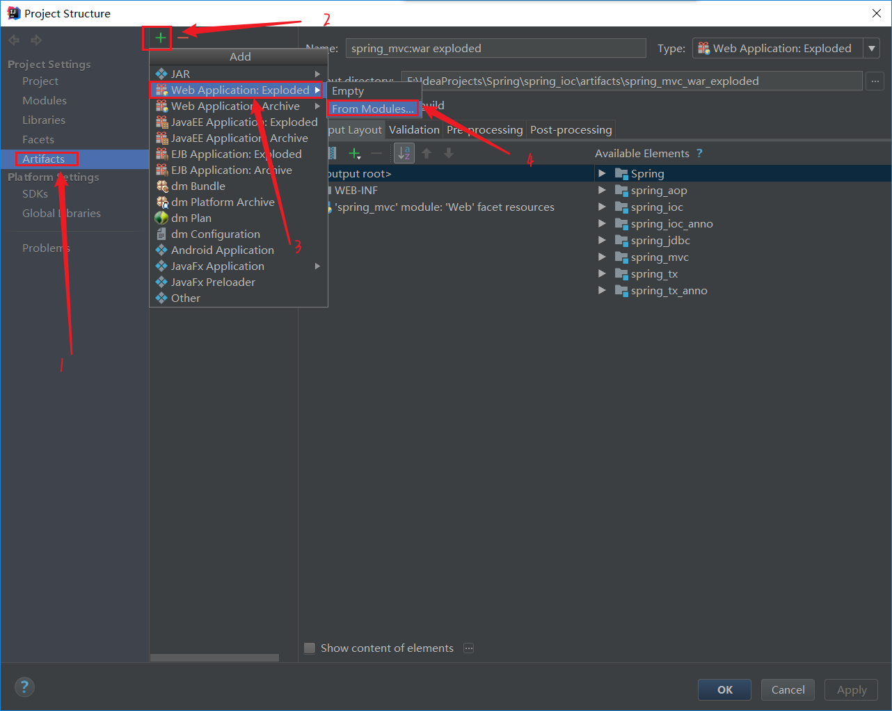

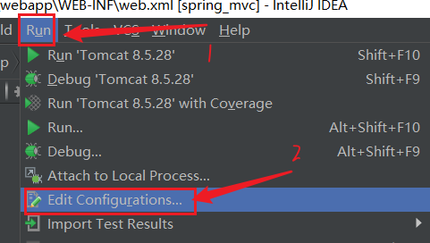

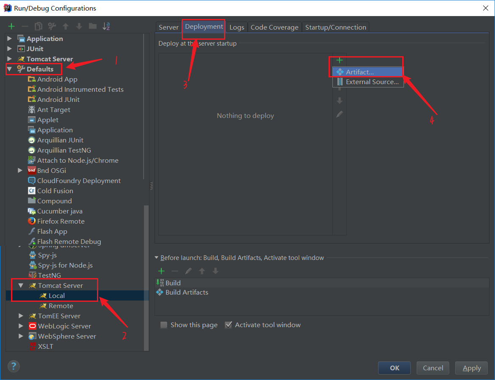


### ApplicationContext应用上下文获取方式

​							应用上下文对象是通过**new ClasspathXmlApplicationContext(spring配置文件)**方式获取的，但是每次从
​							容器中获得Bean时都要编写new ClasspathXmlApplicationContext(spring配置文件)，**这样的弊端是配置**
​							**文件加载多次，应用上下文对象创建多次。**
​							在Web项目中，可以使用**ServletContextListener监听Web应用的启动**， 我们可以在Web应用启动时，就加
​							载Spring的配置文件，创建应用上下文对象**ApplicationContext**,在将其存储到最大的域**servletContext**域
​							中，这样就可以在任意位置从域中获得应用上下文**ApplicationContex**对象了。

​				

​						**不用手动实现,用于理解**

#### web.xml

```xml
<?xml version="1.0" encoding="UTF-8"?>
<web-app xmlns="http://xmlns.jcp.org/xml/ns/javaee"
         xmlns:xsi="http://www.w3.org/2001/XMLSchema-instance"
         xsi:schemaLocation="http://xmlns.jcp.org/xml/ns/javaee http://xmlns.jcp.org/xml/ns/javaee/web-app_4_0.xsd"
         version="4.0">
   
    <!--全局初始化参数-->
    <context-param>
        <param-name>contextConfigLocation</param-name>
        <param-value>applicationContext.xml</param-value>
    </context-param>

    <servlet>
        <servlet-name>UserServlet</servlet-name>
        <servlet-class>com.web.UserServlet</servlet-class>
    </servlet>

    <servlet-mapping>
        <servlet-name>UserServlet</servlet-name>
        <url-pattern>/userServlet</url-pattern>
    </servlet-mapping>

    <!--配置监听器-->
    <listener>
        <listener-class>com.listener.ContextLoaderListener</listener-class>
    </listener>
</web-app>
```

#### ContextLoaderListener

```java
public class ContextLoaderListener implements ServletContextListener {

    public void contextInitialized(ServletContextEvent servletContextEvent) {

        ServletContext servletContext = servletContextEvent.getServletContext();

        // 读取web.xml中全局参数
        String contextConfigLocation = servletContext.getInitParameter("contextConfigLocation");

        // ApplicationContext app = new ClassPathXmlApplicationContext("applicationContext.xml");
        ApplicationContext app = new ClassPathXmlApplicationContext(contextConfigLocation);

        // 将Spring的应用上下文对象存储到 ServletContext 域中
        servletContext.setAttribute("app",app);
        System.out.println("Spring容器创建完毕");
    }

    public void contextDestroyed(ServletContextEvent servletContextEvent) {

    }
```

#### WebApplicationContextUtils

```java
public class WebApplicationContextUtils {
    public static ApplicationContext getWebApplicationContext(ServletContext servletContext){
        return (ApplicationContext) servletContext.getAttribute("app");
    }
}

```

#### UserServlet

```java
public class UserServlet extends HttpServlet {
    protected void doPost(HttpServletRequest request, HttpServletResponse response) throws ServletException, IOException {

        // ApplicationContext app = new ClassPathXmlApplicationContext("applicationContext.xml");
        ServletContext servletContext = request.getServletContext();
       // ApplicationContext app = (ApplicationContext) servletContext.getAttribute("app");
        ApplicationContext app = WebApplicationContextUtils.getWebApplicationContext(servletContext);
        UserService userService = app.getBean(UserService.class);

        userService.save();

    }

    protected void doGet(HttpServletRequest request, HttpServletResponse response) throws ServletException, IOException {
        this.doPost(request, response);
    }
}

```


### Spring提供获取应用上下文的工具

​							上面的分析不用手动实现，Spring提供 了一个监听器**ContextLoaderListener**就是对 上述功能的封装,该监
​							听器内部加载Spring配置文件，创建应用上下文对象,并存储到**ServletContext**域中， 提供了一个客户端工
​							具**WebApplicationContextUtils**供使用者获得应用上下文对象。

#### 所以我们需要做的只有两件事:

​									①在**web.xmI**中配置**ContextLoaderListener**监听器 (导入spring-web坐标)
​									②使用**WebApplicationContextUtils**获得应用 上下文对象**ApplicationContext**


#### pom.xml

```xml
<?xml version="1.0" encoding="UTF-8"?>
<project xmlns="http://maven.apache.org/POM/4.0.0"
         xmlns:xsi="http://www.w3.org/2001/XMLSchema-instance"
         xsi:schemaLocation="http://maven.apache.org/POM/4.0.0 http://maven.apache.org/xsd/maven-4.0.0.xsd">
    <modelVersion>4.0.0</modelVersion>

    <groupId>com</groupId>
    <artifactId>spring_mvc</artifactId>
    <version>1.0-SNAPSHOT</version>

    <dependencies>
        <dependency>
            <groupId>org.springframework</groupId>
            <artifactId>spring-context</artifactId>
            <version>5.0.5.RELEASE</version>
        </dependency>
        <dependency>
            <groupId>org.springframework</groupId>
            <artifactId>spring-jdbc</artifactId>
            <version>5.0.5.RELEASE</version>
        </dependency>
        <dependency>
            <groupId>org.aspectj</groupId>
            <artifactId>aspectjweaver</artifactId>
            <version>1.8.4</version>
        </dependency>
        <dependency>
            <groupId>org.springframework</groupId>
            <artifactId>spring-tx</artifactId>
            <version>5.0.5.RELEASE</version>
        </dependency>
        <dependency>
            <groupId>org.springframework</groupId>
            <artifactId>spring-test</artifactId>
            <version>5.0.5.RELEASE</version>
        </dependency>
        <dependency>
            <groupId>c3p0</groupId>
            <artifactId>c3p0</artifactId>
            <version>0.9.1.1</version>
        </dependency>
        <dependency>
            <groupId>mysql</groupId>
            <artifactId>mysql-connector-java</artifactId>
            <version>5.1.32</version>
        </dependency>
        <dependency>
            <groupId>junit</groupId>
            <artifactId>junit</artifactId>
            <version>4.12</version>
        </dependency>
        <dependency>
            <groupId>org.springframework</groupId>
            <artifactId>spring-context</artifactId>
            <version>5.0.5.RELEASE</version>
        </dependency>
        <dependency>
            <groupId>javax.servlet</groupId>
            <artifactId>javax.servlet-api</artifactId>
            <version>3.0.1</version>
        </dependency>
        <dependency>
            <groupId>javax.servlet.jsp</groupId>
            <artifactId>javax.servlet.jsp-api</artifactId>
            <version>2.2.1</version>
        </dependency>
        <dependency>
            <groupId>org.springframework</groupId>
            <artifactId>spring-web</artifactId>
            <version>5.0.5.RELEASE</version>
        </dependency><dependency>
        <groupId>org.springframework</groupId>
        <artifactId>spring-web</artifactId>
        <version>5.0.5.RELEASE</version>
    </dependency>
    </dependencies>
</project>
```

#### web.xml

```xml
<?xml version="1.0" encoding="UTF-8"?>
<web-app xmlns="http://xmlns.jcp.org/xml/ns/javaee"
         xmlns:xsi="http://www.w3.org/2001/XMLSchema-instance"
         xsi:schemaLocation="http://xmlns.jcp.org/xml/ns/javaee http://xmlns.jcp.org/xml/ns/javaee/web-app_4_0.xsd"
         version="4.0">

    <!--全局初始化参数-->
    <context-param>
        <param-name>contextConfigLocation</param-name>
        <param-value>classpath:applicationContext.xml</param-value>
    </context-param>
    
    <servlet>
        <servlet-name>UserServlet</servlet-name>
        <servlet-class>com.web.UserServlet</servlet-class>
    </servlet>
    
    <servlet-mapping>
        <servlet-name>UserServlet</servlet-name>
        <url-pattern>/userServlet</url-pattern>
    </servlet-mapping>

    <!--配置监听器-->
    <listener>
        <listener-class>org.springframework.web.context.ContextLoaderListener</listener-class>
    </listener>
</web-app>
```

#### UserServlet

```java
public class UserServlet extends HttpServlet {
    protected void doPost(HttpServletRequest request, HttpServletResponse response) throws ServletException, IOException {

        // ApplicationContext app = new ClassPathXmlApplicationContext("applicationContext.xml");
        ServletContext servletContext = request.getServletContext();
        // ApplicationContext app = (ApplicationContext) servletContext.getAttribute("app");
        // ApplicationContext app = WebApplicationContextUtils.getWebApplicationContext(servletContext);
        ApplicationContext app = WebApplicationContextUtils.getWebApplicationContext(servletContext);
        UserService userService = app.getBean(UserService.class);
        userService.save();
    }

    protected void doGet(HttpServletRequest request, HttpServletResponse response) throws ServletException, IOException {
        this.doPost(request, response);
    }
}
```


## SpringMVC简介

### SpringMVC概述

​							**SpringMVC**是一种基于Java的实现**MVC设计模型**的请求驱动类型的轻量级**Web框架**，属于**SpringFrameWork**的后续产				品，已经融合在Spring Web Flow中。
​							SpringMVC已经成为目前最主流的MVC框架之一, 并且随着Spring3.0 的发布,全面超越Struts2,成为最优秀的MVC框架。				它通过一套注解，让一个简单的Java类成为处理请求的控制器，而无须实现任何接口。同时它还支持**RESTful**编程风格的请求。

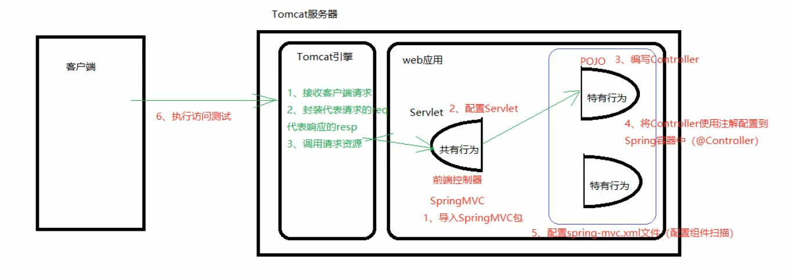

### SpringMVC快速入门

​								需求:客户端发起请求，服务器端接收请求，执行逻辑并进行视图跳转。
​								开发步骤: 
​								①导入SpringMVC相关坐标
​								②配置SpringMVC核心控制器DispathcerServlet
​								③创建Controller类和视图页面
​								④使用注解配置Controller类中业务方法的映射地址
​								⑤配置SpringMVC核心文件spring-mvc.xml
​								⑥客户端发起请求测试

Tomcat启动不起来,看日志,Error configuring application listener of class org.springframework.web.context.ContextLoaderListener

解决如下

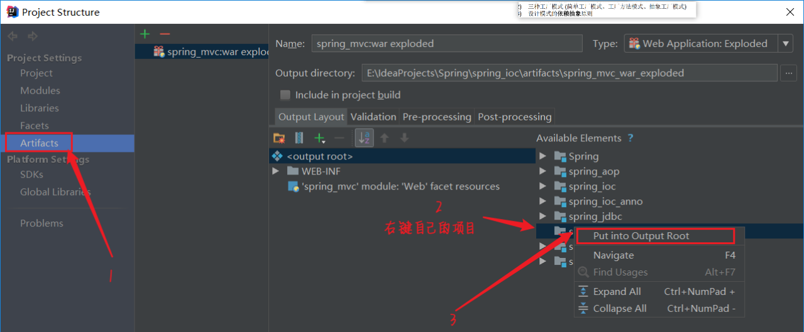

#### web.xml

```xml
<!--配置SpringMVC的前端控制器-->
<servlet>
    <servlet-name>DispatcherServlet</servlet-name>
    <servlet-class>org.springframework.web.servlet.DispatcherServlet</servlet-class>
    <init-param>
        <param-name>contextConfigLocation</param-name>
        <param-value>classpath:spring-mvc.xml</param-value>
    </init-param>
    <!--在服务器启动时,创建-->
    <load-on-startup>1</load-on-startup>
</servlet>

<servlet-mapping>
    <servlet-name>DispatcherServlet</servlet-name>
    <url-pattern>/</url-pattern>
</servlet-mapping>

```

#### UserController

```java
@Controller
public class UserController {

    @RequestMapping("/quick")
    public String save(){
        System.out.println("Controller save running....");
        return "success.jsp";
    }
}
```

#### spring-mvc.xml

```xml
<?xml version="1.0" encoding="UTF-8"?>
<beans xmlns="http://www.springframework.org/schema/beans"
       xmlns:xsi="http://www.w3.org/2001/XMLSchema-instance"
       xmlns:context="http://www.springframework.org/schema/context"
       xsi:schemaLocation="
       http://www.springframework.org/schema/beans http://www.springframework.org/schema/beans/spring-beans.xsd
        http://www.springframework.org/schema/context http://www.springframework.org/schema/context/spring-context.xsd">


    <!--Controller组件扫描-->
    <context:component-scan base-package="com.controller"></context:component-scan>

</beans>
```

### SpringMVC流程图示

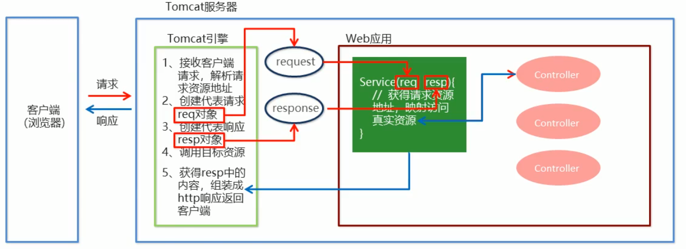


## SpringMVC组件解析

### SpringMVC的执行流程

​							①用户发送请求至**前端控制器DispatcherServlet**.
​							②DispatcherServlet收到请求调用**HandlerMapping处理器映射器**。
​							③处理器映射器找到具体的处理器(可以根据xm|配置、注解进行查找)，生成处理器对象及处理器拦截器(如果有则生成)						一并返回给DispatcherServlet.
​							④DispatcherServlet调用**HandlerAdapter处理器适配器**。
​							⑤HandlerAdapter经过适配调用具体的**处理器(Controller, 也叫后端控制器)**。
​							⑥Controller执行完成返回ModelAndView。
​							⑦HandlerAdapter将controller执行结果ModelAndView返回给DispatcherServlet.
​							⑧DispatcherServlet将ModelAndView传给**ViewReslover视图解析器**。
​							⑨ViewReslover解析后返回具体View。
​							⑩DispatcherServlet根据View进行渲染视图 (即将模型数据填充至视图中)。DispatcherServlet响应用户。

### SpringMVC注解解析

#### @RequestMapping

​									作用:用于建立请求URL和处理请求方法之间的对应关系

##### 位置:

​										●类上，请求URL的第一级访问目录。此处不写的话，就相当于应用的根目录
​										●方法上，请求URL的第二级访问目录,与类上的使用@RequestMapping标注的一 级目录起组成访问虚拟路径

##### 属性:

​									●**value**: 用于指定请求的URL。它和path属性的作用是一 样的
​									●**method**:用于指定请求的方式.枚举类型的
​									●**params**:用于指定限制请求参数的条件。它支持简单的表达式。要求请求参数的key和value必须和配置的一模一样

​											例如:
​											params = {"accountName"},表示请求参数必须有accountName
​											params = {"moeny!100"},表示请求参数中money不能是100

```java
// 访问url是/quick,请求方式是get,请求参数必须有username
@RequestMapping(value = "/quick",method = RequestMethod.GET,params = {"username"})
```

### SpringMVC的相关组件

​								●前端控制器: DispatcherServlet
​								●处理器映射器: HandlerMapping
​								●处理器适配器: HandlerAdapter
​								●处理器: Handler
​								●视图解析器: View Resolver
​								●视图: View

### 内部资源视图解析器

```xml
<!--配置内部资源视图解析器-->
<bean id="viewResolver" class="org.springframework.web.servlet.view.InternalResourceViewResolver">
    <!--/jsp/success.jsp-->
    <!-- 转发前缀-->
    <property name="prefix" value="/jsp/"></property>
    <!--转发后置-->
    <property name="suffix" value=".jsp"></property>
</bean>
```

## SpringMVC的数据响应

## 页面跳转

### 1.返回字符串形式

​							直接返回字符串:此种方式会将返回的字符串与视图解析器的前后缀拼接后跳转。

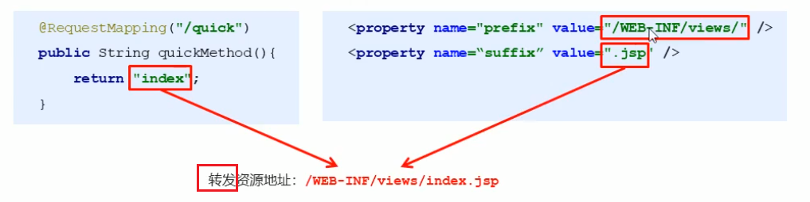

#### 返回带有前缀的字符串:

​								转发: forward: /WEB-INE /views/index. jsp
​								重定向: redirect:/index. jsp


### 2.返回ModelAndView对象

```java
@RequestMapping(value = "/quick2")
public ModelAndView save2(){
    /*
            Model:模型 作用封装数据
            View: 视图 作用展示数据
         */
    ModelAndView modelAndView = new ModelAndView();
    // 设置模型数据,相当于将数据存到request域中
    modelAndView.addObject("username","张三");

    // 设置视图名称
    modelAndView.setViewName("success");            // 同样适用于内部资源视图解析器
    return modelAndView;
}
```

#### success.jsp

```jsp
<%@ page contentType="text/html;charset=UTF-8" language="java" %>
<html>
    <head>
        <title>Title</title>
    </head>
    <body>
        <h1>Success!${username}</h1>
    </body>
</html>

```

## 回写数据

### 1.直接返回字符串

​									Web基础阶段,客户端访问服务器端，如果想直接回写字符串作为响应体返回的话，只需要使用			

​						response.getWriter0.print( "hello world" )即呵,那么在Controller中想直 接回写字符串该怎样呢?
​									①通过SpringMVC框架注入的response对象， 使用response.getWriter0.print( "hello world" )回写数据,此时不需						要视图跳转,业务方法返回值为void。

```java
@RequestMapping(value = "/quick3")
public void save3(HttpServletResponse response) throws IOException {
    response.getWriter().print("hello");

}
```

​								②将需要回写的字符串直接返回,但此时需要通过**==@ResponseBody==**注解告知SpringMVC框架, 方法	返回的字符串不					是跳转是直接在http响应体中返回。

```java
@RequestMapping(value = "/quick4")
@ResponseBody               // 告知SpringMVC框架,不进行视图跳转,直接进行数据响应
public String save4()  {
    return "写在页面上";
}
```

​									Json数据字符串

```java
@RequestMapping(value = "/quick5")
@ResponseBody
public String save5()  {
    // 引号需要转义
    return "{\"username\":\"zhangsan\",\"age\":18}";

}

```

### 2.返回对象或集合

#### 使用json的转换工具

##### pom.xml

```xml
<dependency>
    <groupId>com.fasterxml.jackson.core</groupId>
    <artifactId>jackson-core</artifactId>
    <version>2.9.0</version>
</dependency>

<dependency>
    <groupId>com.fasterxml.jackson.core</groupId>
    <artifactId>jackson-databind</artifactId>
    <version>2.9.0</version>
</dependency>

<dependency>
    <groupId>com.fasterxml.jackson.core</groupId>
    <artifactId>jackson-annotations</artifactId>
    <version>2.9.0</version>
</dependency>
```

##### 测试类

```java
@RequestMapping(value = "/quick6")
@ResponseBody
public String save6() throws JsonProcessingException {
    User user = new User("zhangsan",18);

    // 使用json的转换工具将对象转换成json格式字符串再返回
    ObjectMapper mapper = new ObjectMapper();
    String s = mapper.writeValueAsString(user);
    return s;
}
```


#### SpringMVC自动将User转换成json格式的字符串

​								在SpringMVC的各个组件中，**处理器映射器、处理器适配器、视图解析器**称为SpringMVC的三大组件。
​				使用< mvc:annotation-driven>自动加载RequestMappingHandlerMapping (处理映射器)和RequestMappingHandlerAdapter 				(处理适配器)，可用在Spring-xml.xm配置文件中使用< mvc:annotation-driven>替代注解处理器和适配器的配置。
​				同时使用<mvc:annotation- driven>默认底层就会集成jackson进行对象或集合的json格式字符串的转换。

```xml
<!--配置处理器映射器-->
<bean class="org.springframework.web.servlet.mvc.method.annotation.RequestMappingHandlerAdapter">
    <property name="messageConverters">
        <list>
            <bean class="org.springframework.http.converter.json.MappingJackson2HttpMessageConverter"></bean>
        </list>
    </property>
</bean>

<!-- mvc 的注解驱动,省略以上代码-->
<!-- 引入mvc命名空间-->
<mvc:annotation-driven></mvc:annotation-driven>
```

##### 测试类

```java
@RequestMapping(value = "/quick7")
@ResponseBody
// SpringMVC自动将User转换成json格式的字符串
public User save7(){
    User user = new User("lisi",24);
    return user;
}
```

#### 遇到如下错误


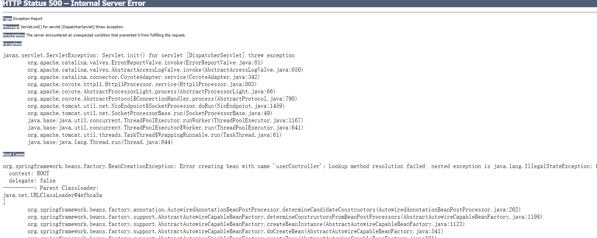

#### 解决如下

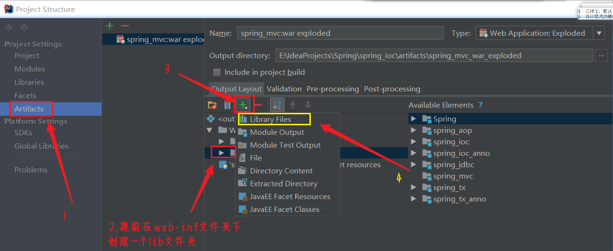


## SpringMVC获得请求数据

### 获得请求参数

​							客户端请求参数的格式是: name=value&name=value.....
​							服务器端要获得请求的参数，有时还需要进行数据的封装，SpringMVC可以接收如下类型的参数:

#### ●基本类型参数

```java
@RequestMapping(value = "/quick8")
@ResponseBody
// http://localhost:8080/quick8?username=zhangsan&age=18
public User save8(String username, int age) {
    User user = new User(username, age);
    System.out.println(username);
    System.out.println(age);
    return user;
}
```

#### ●POJO类型参数

​									Controller中的业务方法的POJO参数的**属性名**与请求参数的**name**一致， 参数值会自动映射匹配。

```java
@RequestMapping(value = "/quick9")
@ResponseBody
// http://localhost:8080/quick9?name=zhangsan&age=18
public User save9(User user) {
    System.out.println(user.getName());
    System.out.println(user.getAge());
    return user;

}
```


#### ●数组类型参数(key一样时,封装成数组,比如爱好,复选择框)

​									Controller中的业务方法数组名称与请求参数的name-致,参数值会自动映射匹配。

```java
@RequestMapping(value = "/quick10")
@ResponseBody
// http://localhost:8080/quick10?aihao=sanshang&aihao=boduo&aihao=cang
public void save10(String[] aihao) {
    System.out.println(Arrays.asList(aihao));
    System.out.println(Arrays.toString(aihao));
}
```


#### ●集合类型参数(和数组类似)

​									需要将集合整合到一个POJO对象中

##### 手动提交

###### VO类

```java
public class VO {
    private List<User> userList;

    public VO() {
    }
    public VO(List<User> userList) {
        this.userList = userList;
    }
    public List<User> getUserList() {
        return userList;
    }
    public void setUserList(List<User> userList) {
        this.userList = userList;
    }
    @Override
    public String toString() {
        return "VO{" +
            "userList=" + userList +
            '}';
    }
}
```

###### 测试类

```java
@RequestMapping(value = "/quick11")
@ResponseBody
public void save11(VO vo) {
    List<User> userList = vo.getUserList();

    for (User user : userList) {
        System.out.println(user);
    }

}
```

###### form表单

```jsp
<form action="${pageContext.request.contextPath}/quick11" method="post">
 	<%--VO属性名是userList,所以name要是userList;
        因为userList是集合,所以[0]表明该集合的第几个元素;
        每个元素都是User对象,User对象对应的属性名为name
        ***整体表示,userList第一个元素User的name属性值--%>
    <input type="text" name="userList[0].name" />
    <input type="text" name="userList[0].age" />

    <input type="text" name="userList[1].name" />
    <input type="text" name="userList[1].age" />
    <input type="submit" />

</form>
```

###### web.xml

​											此时form表单提交**中文会乱码**,在web.xml配置全局过滤

```xml
<!--配置全局过滤的filter-->
<filter>
    <filter-name>CharacterEncodingFilter</filter-name>
    <filter-class>org.springframework.web.filter.CharacterEncodingFilter</filter-class>
    <init-param>
        <param-name>encoding</param-name>
        <param-value>UTF-8</param-value>
    </init-param>
</filter>

<filter-mapping>
    <filter-name>CharacterEncodingFilter</filter-name>
    <url-pattern>/*</url-pattern>
</filter-mapping>
```


##### ajax提交

​								当使用ajax提交时，可以指定**contentType为json**形式, 那么在方法参数位置使用**@RequestBody**可以
​									直接接收集合数据而无需使用POJO进行包装ss。

###### jsp文件

```jsp
<script src="${pageContext.request.contextPath}/js/jquery-3.3.1.js"></script>
    <script>
        var userList = new Array();
        userList.push({name:"张三",age:23});
        userList.push({name:"李四",age:24});

        $.ajax({
            type:"Post",
            url:"${pageContext.request.contextPath}/quick12",
            data:JSON.stringify(userList),
            contentType:"application/json;charset=utf-8"
        });
    </script>
```

###### 配置文件

​											jsp文件访问jQuery文件,需要配置**开放资源访问**

```xml
<!--开放静态资源访问-->
<!-- <mvc:resources mapping="/js/**" location="/js/"></mvc:resources> -->
<!-- <mvc:resources mapping="/img/**" location="/img/"></mvc:resources> -->

<mvc:default-servlet-handler></mvc:default-servlet-handler>
```

###### 测试类

```java
@RequestMapping(value = "/quick12")
@ResponseBody
public void save12(@RequestBody List<User> userList) {
    for (User user : userList) {
        System.out.println(user);
    }
}
```


### 参数绑定注解@requestParam

​						注解**@RequestParam**还有如下参数可以使用:
​							value:与请求参数名称
​							required:此在指定的请求参数是否必须包括，默认是true, 提交时如果没有此参数则报错
​							defaultValue:当没有指定请求参数时，则使用指定的默认值赋值

```java
@RequestMapping(value = "/quick13")
@ResponseBody
// 将请求参数username的值赋值给name,不是必须填的数据,默认值为zhangsan
public void save13(@RequestParam(value = "username",required = false,defaultValue = "zhangsan") String name) {
    System.out.println(name);
}
```


### 获得Restful风格的参数

​								Restful是一种**软件架构风格、 设计风格**，而不是标准，只是提供了一组设计原则和约束条件。 主要用于客户端和服务
​						器交互类的软件,基于这个风格设计的软件可以更简洁,更有层次，更易于实现缓存机制等。
​								Restful风格的请求是使用"**url+ 请求方式**”表示次请求目的的，HTTP 协议里面四个表示操作方式的动词如下:
​										●GET:用于获取资源
​										●POST:用于新建资源
​										●PUT:用于更新资源
​										●DELETE:用于删除资源

​								例如:
​										●/user/1 	GET :			得到id=1的user
​										●/user/1	 DELETE: 		删除id= 1的user 
​										●/user/1 	PUT:			更新id=1的user
​										●/user		POST:			新增user

​						上述url地址/user/1中的1就是要获得的请求参数,在SpringMVC 可以使用占位符进行参数绑定。地址/user/1可以写成
​					/user/id},占位符{id}对应的就是1 的值。在业务方法中我们可以使用**==@PathVariable==**注解进行占位符的匹配获取工作。

```java
@RequestMapping(value = "/quick14/{username}")
@ResponseBody
// http://localhost:8080/quick14/zhangsan
public void save14(@PathVariable(value = "username") String name) {

    System.out.println(name);       // zhangsan

}
```

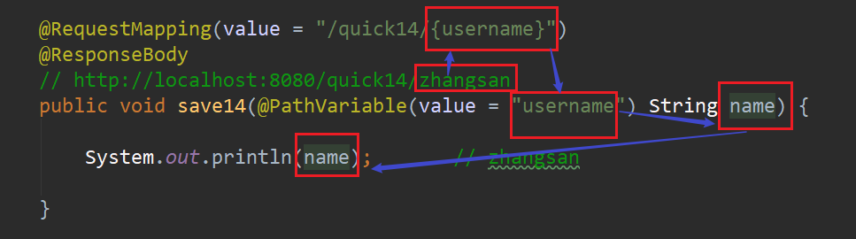


### 自定义类型转换器

​						●SpringMVC默认已经提供了一 些常用的类型转换器，例如客户端提交的字符串转换成int型进行参数设置。
​						●但是不是所有的数据类型都提供了转换器,没有提供的就需要自定义转换器，

​								例如:日期类型的数据就需要自定义转换器。

#### 自定义类型转换器的开发步骤:

​									①定义转换器类实现Converter接口
​									②在配置文件中声明转换器
​									③在<annotation-driven>中引用转换器

#### 实现类DataConverter

```java
public class DataConverter implements Converter<String, Date> {

    public Date convert(String dataStr) {
        // 将日期字符串转换成真正日期对象
        SimpleDateFormat simpleDateFormat = new SimpleDateFormat("yyyy-MM-dd");
        Date date = null;
        try {
            date = simpleDateFormat.parse(dataStr);
        } catch (ParseException e) {
            e.printStackTrace();
        }
        return date;
    }
}
```

#### 配置文件

```xml
<!-- mvc 的注解驱动-->
<mvc:annotation-driven conversion-service="conversionService"> </mvc:annotation-driven>

<!--声明转换器-->
<bean id="conversionService" class="org.springframework.context.support.ConversionServiceFactoryBean">
    <property name="converters">
        <list>
            <bean class="com.converter.DataConverter"></bean>
        </list>
    </property>

</bean>
```

#### 测试类

```java
@RequestMapping(value = "/quick15")
@ResponseBody
// http://localhost:8080/quick15?date=2021-3-29
public void save15(Date date) {

    System.out.println(date);

}
```


### 获得请求头

#### @RequestHeader

​									使用@RequestHeader可以获得请求头信息，相当于web阶段学习的request.getHeader(name)
​									@RequestHeader注解的属性如下:
​											●value:请求头的名称
​											●required: 是否必须携带此请求头

```java
@RequestMapping(value = "/quick17")
@ResponseBody
public void save17(@RequestHeader(value = "User-Agent",required = false)String user_agent) {
    System.out.println(user_agent);
}
```

#### @CookieValue

​									使用@CookieValue可以获得指定Cookie的值
​									@CookieValue注解的属性如下:
​									●value: 指定cookie的名称
​									●required:是否必须携带此cookie

```java
@RequestMapping(value = "/quick18")
@ResponseBody
public void save18(@CookieValue(value = "JSESSIONID")String jsessiongId) {
    System.out.println(jsessiongId);
}
```

### 文件上传

#### 1.文件上传客户端三要素

​									●表单项type= "file"
​									●表单的提交方式是post
​									●表单的enctype属性是多部分表单形式， 及enctype= "multipart/form-data"

#### 2.文件上传原理

​									●当form表单修改为多部分表单时，request.getParameter0将失效。
​									●enctype= "application/x www -form-urlencoded"时, form表单的正文内容格式是:**键值对**

​										key= value&key=value&key=value
​									●当form表 单的enctype取值为Mutilpart/form-data时,请求正文内容就变成多部分形式:

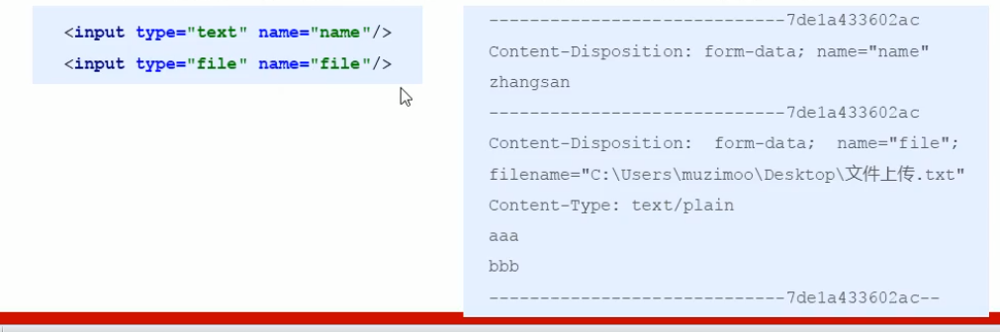

#### 单文件上传步骤

​									①导入fileupload和io坐标
​									②配置文件上传解析器
​									③编写文件上传代码

##### pom.xml

```xml
<dependency>
    <groupId>commons-fileupload</groupId>
    <artifactId>commons-fileupload</artifactId>
    <version>1.3.1</version>
</dependency>

<dependency>
    <groupId>commons-io</groupId>
    <artifactId>commons-io</artifactId>
    <version>2.3</version>
</dependency>
```

##### 配置文件

```xml
<bean id="multipartResolver" class="org.springframework.web.multipart.commons.CommonsMultipartResolver">
    <!--上传文件总大小-->
    <property name="maxUploadSize" value="5242800"></property>
    <!--上传单个文件的大小-->
    <property name="maxUploadSizePerFile" value="5242800"></property>
    <!--上传文件的编码类型-->
    <property name="defaultEncoding" value="UTF-8"></property>
</bean>
```

##### form表单

```jsp
<form action="${pageContext.request.contextPath}/quick18" method="post" enctype="multipart/form-data">
    名称:<input type="text" name="name"><br>
    文件:<input type="file" name="upload"><br>
    <input type="submit">
</form>
```

##### 测试类

```java
@RequestMapping(value = "/quick18")
@ResponseBody
public void save18(String name, MultipartFile upload) throws IOException {
    System.out.println(name);
    // 获得上传文件的名称
    String originalFilename = upload.getOriginalFilename();
    // 上传到D盘的根目录
    upload.transferTo(new File("D:\\"+originalFilename));

}
```


#### 多文件上传

##### form表单

```jsp
<form action="${pageContext.request.contextPath}/quick19" method="post" enctype="multipart/form-data">
    名称:<input type="text" name="name"><br>
    文件:<input type="file" name="upload"><br>
    文件:<input type="file" name="upload"><br>
    文件:<input type="file" name="upload"><br>
    <input type="submit">


</form>
```

##### 测试类

```java
@RequestMapping(value = "/quick19")
@ResponseBody
public void save19(String name, MultipartFile[] upload) throws IOException {
    System.out.println(name);
    for (MultipartFile multipartFile : upload) {

        // 获得上传文件的名称
        String originalFilename = multipartFile.getOriginalFilename();
        multipartFile.transferTo(new File("D:\\"+originalFilename));
    }

}
```


## SpringMVC拦截器

### 拦截器(interceptor) 的作用

​									Spring MVC的拦截器类似于Servlet开发中的过滤器Filter,于对处理器进行预处理和后处理。
​							将拦截器按一定的顺序联结成**一条链**，这条链称为**拦截器链(Interceptor Chain)**。在访问被拦截的方
​							法或字段时，拦截器链中的拦截器就会按其**之前定义的顺序**被调用。**拦截器也是AOP思想的具体实现。**

### 拦截器和过滤器区别

| 区别     | 过滤器                                                       | 拦截器                                                       |
| -------- | ------------------------------------------------------------ | ------------------------------------------------------------ |
| 使用范围 | 是servlet规范中的一部分，<br />任何Java Web工程都可以使用    | 是SpringMVC框架自己的，<br />只有使用了SpringMVC框架的工程才能用 |
| 拦截范围 | 在url-pattern中配置了/*之后，<br/>可以对所有要访问的资源拦截 | 只会拦截访问的控制器方法，如果访问的<br/>是**jsp,html,css,image或者js**是**不会进行拦截**的 |

### 拦截器方法说明

| 方法名            | 说明                                                         |
| ----------------- | ------------------------------------------------------------ |
| preHandle()       | 方法将在**请求处理之前**进行调用，该方法的返回值是布尔值Boolean类型的，<br />当它返回为**false**时，表示请求结束，后续的**Interceptor(拦截器) 和Controler都不会再执行**;<br />当返回值为true时就会继续调用下一个Interceptor 的preRrandle方法或Controller的目标方法 |
| postHandle()      | 该方法是在当前**请求进行处理之后**被调用，前提是preHandle方法的返回值为true时才能被调用，<br />且它会在DispatcherServlet 进行视图返回渲染之前被调用，<br/>所以我们可以在这个方法中对**Controller处理之后**的ModelAndView对象进行操作 |
| afterCompletion() | 该方法将在**整个请求结束之后**，也就是在DispatcherServlet 渲染了对应的视图<br/>之后执行，前提是preHandle方法的返回值为true时才能被调用 |

### 定义拦截器步骤

​							①创建拦截器类实现HandlerInterceptor接口
​							②配置拦截器
​							③测试拦截器的拦截效果

#### 配置文件spring-mvc.xml

```xml
<?xml version="1.0" encoding="UTF-8"?>
<beans xmlns="http://www.springframework.org/schema/beans"
       xmlns:xsi="http://www.w3.org/2001/XMLSchema-instance"
       xmlns:mvc="http://www.springframework.org/schema/mvc"
       xmlns:context="http://www.springframework.org/schema/context"
       xsi:schemaLocation="
                           http://www.springframework.org/schema/beans http://www.springframework.org/schema/beans/spring-beans.xsd
                           http://www.springframework.org/schema/mvc http://www.springframework.org/schema/mvc/spring-mvc.xsd
                           http://www.springframework.org/schema/context http://www.springframework.org/schema/context/spring-context.xsd">

    <!--1.mvc注解驱动-->
    <mvc:annotation-driven></mvc:annotation-driven>

    <!--2.配置视图解析器-->
    <bean class="org.springframework.web.servlet.view.InternalResourceViewResolver">
        <property name="prefix" value="/"></property>
        <property name="suffix" value=".jsp"></property>
    </bean>

    <!-- 3.静态资源权限开放-->
    <mvc:default-servlet-handler></mvc:default-servlet-handler>

    <!--4.组件扫描 扫描Controller-->
    <context:component-scan base-package="com.controller"></context:component-scan>

    <!--配置拦截器-->
    <mvc:interceptors>
        <mvc:interceptor>
            <!--配置对哪些资源执行拦截操作-->
            <mvc:mapping path="/**"/>
            <!--配置哪些资源 排除 拦截操作-->
            <mvc:exclude-mapping path="/login"></mvc:exclude-mapping>
            <bean class="com.interceptor.MyInterceptor1"></bean>
        </mvc:interceptor>

        <!--第二个拦截器-->
        <!--<mvc:interceptor>-->
        <!-- 	<mvc:mapping path="/**"/>-->
        <!-- 	<bean class="com.interceptor.MyInterceptor2"></bean>-->
        <!-- </mvc:interceptor>	-->

    </mvc:interceptors>

</beans>
```

#### 拦截器

```java
public class MyInterceptor1 implements HandlerInterceptor {

    // 目标方法执行之前执行
    public boolean preHandle(HttpServletRequest request, HttpServletResponse response, Object handler) throws Exception {
        System.out.println("preHandle.......");
        String name = request.getParameter("name");
        if ("lisi".equals(name)) {
            return true;        // 返回true代表放行
        } else {
            request.getRequestDispatcher("/error.jsp").forward(request,response);
            return false;       // 返回false代表不放行
        }
    }

    // 目标方法执行之后,视图对象返回之前执行
    public void postHandle(HttpServletRequest request, HttpServletResponse response, Object handler, ModelAndView modelAndView) throws Exception {
        modelAndView.addObject("name","postHandle");
        System.out.println("postHandle......");

    }

    // 流程都执行完毕后,执行
    public void afterCompletion(HttpServletRequest request, HttpServletResponse response, Object handler, Exception ex) throws Exception {
        System.out.println("afterCompletion.......");

    }
}

```

#### 测试类

```java
@Controller
public class TargetController{

    @RequestMapping("/target")
    // http://localhost/target?name=lisi
    // hello!postHandle
    public ModelAndView show(){
        System.out.println("目标资源执行.....");
        ModelAndView modelAndView = new ModelAndView();
        modelAndView.addObject("name","zhangsan");
        modelAndView.setViewName("index");
        return modelAndView;
    }
}
```

> preHandle.....
> 目标资源执行.....
> postHandle. . .
> afterCompletion. .
>
> 


### 多个拦截器

​							取决于在  spring-mvc.xml 定义的顺序

> preHandle.....
>
> preHandle2222.....
>
> 目标资源执行......
>
> postHandle222...
>
> postHandle...
>
> afterCompletion222....
>
> afterCompletion....


## SpringMVC异常处理

### 异常处理的思路

​								系统中异常包括两类:**预期异常**和**运行时异常**RuntimeException,前者通过捕获异常从而获取异常信息，后者主要通过						规范代码开发、测试等手段减少运行时异常的发生。
​								系统的**Dao**、**Service**、**Controller**出现都通过throws Exception向上抛出，最后由SpringMVC前端控制器交由异常处						理器进行异常处理，如下图:

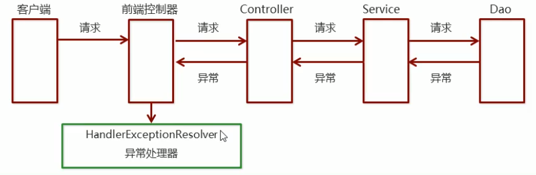


### 异常处理两种方式

​								●使用Spring MVC提供的简单异常处理器**SimpleMappingExceptionResolver**
​								●实现Spring的异常处理**接口HandlerExceptionResolver** 定义自己的异常处理器

### 简单异常处理器SimpleMappingExceptionResolver

​							SpringMVC已经定义好了该类型转换器,在使用时可以根据项目情况进行相应异常与视图的映射配置

#### 自定义异常

```java
public class MyException extends Exception {

}
```

#### 接口类

```java
public interface DemoService {
    void show1();

    void show2();

    void show3() throws FileNotFoundException;

    void show4();

    void show5() throws MyException;
}
```

#### 接口实现类

```java
public class DemoServiceImpl implements DemoService {
    public void show1() {
        System.out.println("抛出类型转换异常....");
        Object str = "zhangsan";
        Integer num = (Integer)str;
    }

    public void show2() {
        System.out.println("抛出除零异常....");
        int i = 1/0;
    }

    public void show3() throws FileNotFoundException {
        System.out.println("文件找不到异常....");
        InputStream in = new FileInputStream("C:/xxx/xxx/xxx.txt");
    }

    public void show4() {
        System.out.println("空指针异常.....");
        String str = null;
        str.length();
    }

    public void show5() throws MyException {
        System.out.println("自定义异常....");
        throw new MyException();
    }
}
```

#### 配置类

```xml
<?xml version="1.0" encoding="UTF-8"?>
<beans xmlns="http://www.springframework.org/schema/beans"
       xmlns:xsi="http://www.w3.org/2001/XMLSchema-instance"
       xmlns:mvc="http://www.springframework.org/schema/mvc"
       xmlns:context="http://www.springframework.org/schema/context"
       xsi:schemaLocation="
       http://www.springframework.org/schema/beans http://www.springframework.org/schema/beans/spring-beans.xsd
       http://www.springframework.org/schema/mvc http://www.springframework.org/schema/mvc/spring-mvc.xsd
       http://www.springframework.org/schema/context http://www.springframework.org/schema/context/spring-context.xsd
">

    <!--1、mvc注解驱动-->
    <mvc:annotation-driven/>

    <!--2、配置视图解析器-->
    <bean class="org.springframework.web.servlet.view.InternalResourceViewResolver">
        <property name="prefix" value="/"/>
        <property name="suffix" value=".jsp"/>
    </bean>

    <!--3、静态资源权限开放-->
    <mvc:default-servlet-handler/>

    <!--4、组件扫描  扫描Controller-->
    <context:component-scan base-package="com.controller"/>

    <!--配置异常处理器-->
    <bean class="org.springframework.web.servlet.handler.SimpleMappingExceptionResolver">
        <!--通用的错误页面-->
        <property name="defaultErrorView" value="error"/>
        
        <property name="exceptionMappings">
            <map>
                <entry key="java.lang.ClassCastException" value="error1"/>
                <entry key="com.exception.MyException" value="error2"/>
            </map>
        </property>
    </bean>


</beans>
```


#### 测试类

```java
@Controller
public class DemoController {

    @Autowired
    private DemoService demoService;

    @RequestMapping(value = "/show")
    public String show() throws FileNotFoundException, MyException {
        System.out.println("show running......");
        //demoService.show1();
        //demoService.show2();
        //demoService.show3();
        //demoService.show4();
        demoService.show5();
        return "index";
    }

}
```

### 自定义异常处理步骤

​								①创建异常处理器类实现HandlerExceptionResolver
​								②配置异常处理器
​								③编写异常页面
​								④测试异常跳转

#### 配置文件

```xml
<!--自定义异常处理器-->
<bean class="com.resolver.MyExceptionResolver"/>
```


#### 异常处理器类

```java
public class MyExceptionResolver implements HandlerExceptionResolver {

    /*
        参数Exception：异常对象
        返回值ModelAndView：跳转到错误视图信息
     */
    public ModelAndView resolveException(HttpServletRequest httpServletRequest, HttpServletResponse httpServletResponse, Object o, Exception e) {
        ModelAndView modelAndView = new ModelAndView();

        if(e instanceof MyException){
            modelAndView.addObject("info","自定义异常");
        }else if(e instanceof ClassCastException){
            modelAndView.addObject("info","类转换异常");
        }

        modelAndView.setViewName("error");

        return modelAndView;
    }
}
```


## 项目配置

### web.xml

​						<span style="font-size:24px;color:red;font-weight:bold">在 webapp/WEB-INF 下</span>

```xml
<?xml version="1.0" encoding="UTF-8"?>
<web-app xmlns="http://xmlns.jcp.org/xml/ns/javaee"
         xmlns:xsi="http://www.w3.org/2001/XMLSchema-instance"
         xsi:schemaLocation="http://xmlns.jcp.org/xml/ns/javaee http://xmlns.jcp.org/xml/ns/javaee/web-app_4_0.xsd"
         version="4.0">

    <!--解决乱码的过滤器-->
    <filter>
        <filter-name>CharacterEncodingFilter</filter-name>
        <filter-class>org.springframework.web.filter.CharacterEncodingFilter</filter-class>
        <init-param>
            <param-name>encoding</param-name>
            <param-value>UTF-8</param-value>
        </init-param>
    </filter>
    <filter-mapping>
        <filter-name>CharacterEncodingFilter</filter-name>
        <url-pattern>/*</url-pattern>
    </filter-mapping>

    <!--全局的初始化参数-->
    <context-param>
        <param-name>contextConfigLocation</param-name>
        <param-value>classpath:applicationContext.xml</param-value>
    </context-param>
    <!--Spring的监听器-->
    <listener>
        <listener-class>org.springframework.web.context.ContextLoaderListener</listener-class>
    </listener>


    <!--SpringMVC的前端控制器-->
    <servlet>
        <servlet-name>DispatcherServlet</servlet-name>
        <servlet-class>org.springframework.web.servlet.DispatcherServlet</servlet-class>
        <init-param>
            <param-name>contextConfigLocation</param-name>
            <param-value>classpath:spring-mvc.xml</param-value>
        </init-param>
        <load-on-startup>2</load-on-startup>
    </servlet>
    <servlet-mapping>
        <servlet-name>DispatcherServlet</servlet-name>
        <url-pattern>/</url-pattern>
    </servlet-mapping>

</web-app>
```


### spring-mvc.xml

​						<span style="font-size:24px;color:red;font-weight:bold">在 resources 文件夹下</span>

```xml
<?xml version="1.0" encoding="UTF-8"?>
<beans xmlns="http://www.springframework.org/schema/beans"
       xmlns:xsi="http://www.w3.org/2001/XMLSchema-instance"
       xmlns:mvc="http://www.springframework.org/schema/mvc"
       xmlns:context="http://www.springframework.org/schema/context"
       xsi:schemaLocation="
       http://www.springframework.org/schema/beans http://www.springframework.org/schema/beans/spring-beans.xsd
       http://www.springframework.org/schema/mvc http://www.springframework.org/schema/mvc/spring-mvc.xsd
       http://www.springframework.org/schema/context http://www.springframework.org/schema/context/spring-context.xsd
">

    <!--1、mvc注解驱动-->
    <mvc:annotation-driven/>

    <!--2、配置视图解析器-->
    <bean class="org.springframework.web.servlet.view.InternalResourceViewResolver">
        <property name="prefix" value="/pages/"/>
        <property name="suffix" value=".jsp"/>
    </bean>

    <!--3、静态资源权限开放-->
    <mvc:default-servlet-handler/>

    <!--4、组件扫描  扫描Controller-->
    <context:component-scan base-package="com.controller"/>

    <mvc:interceptors>
        <mvc:interceptor>
            <!--配置对哪些资源执行拦截操作-->
            <mvc:mapping path="/**"/>
            <!--配置哪些资源排除拦截操作-->
            <mvc:exclude-mapping path="/login"></mvc:exclude-mapping>
            <bean class="com.interceptor.MyInterceptor1"></bean>
        </mvc:interceptor>
    </mvc:interceptors>

</beans>
```

### jdbc.properties

​						<span style="font-size:24px;color:red;font-weight:bold">在 resources 文件夹下</span>

```properties
jdbc.driver=com.mysql.jdbc.Driver
jdbc.url=jdbc:mysql://localhost:3306/test?useUnicode=true&characterEncoding=utf8
jdbc.username=root
jdbc.password=root
```

### applicationContext.xml

​						<span style="font-size:24px;color:red;font-weight:bold">在 resources 文件夹下</span>

```xml
<?xml version="1.0" encoding="UTF-8"?>
<beans xmlns="http://www.springframework.org/schema/beans"
       xmlns:xsi="http://www.w3.org/2001/XMLSchema-instance"
       xmlns:context="http://www.springframework.org/schema/context"
       xsi:schemaLocation="
                           http://www.springframework.org/schema/beans http://www.springframework.org/schema/beans/spring-beans.xsd
                           http://www.springframework.org/schema/context http://www.springframework.org/schema/context/spring-context.xsd
                           ">


    <!--1、加载jdbc.properties-->
    <context:property-placeholder location="classpath:jdbc.properties"/>

    <!--2、配置数据源对象-->
    <bean id="dataSource" class="com.mchange.v2.c3p0.ComboPooledDataSource">
        <property name="driverClass" value="${jdbc.driver}"/>
        <property name="jdbcUrl" value="${jdbc.url}"/>
        <property name="user" value="${jdbc.username}"/>
        <property name="password" value="${jdbc.password}"/>
    </bean>

    <!--3、配置JdbcTemplate对象-->
    <bean id="jdbcTemplate" class="org.springframework.jdbc.core.JdbcTemplate">
        <property name="dataSource" ref="dataSource"></property>
    </bean>

    <!--配置RoleService-->
    <bean id="roleService" class="com.service.impl.RoleServiceImpl">
        <property name="roleDao" ref="roleDao"/>
    </bean>

    <!--配置RoleDao-->
    <bean id="roleDao" class="com.dao.impl.RoleDaoImpl">
        <property name="jdbcTemplate" ref="jdbcTemplate"/>
    </bean>

    <!--配置UserService-->
    <bean id="userService" class="com.service.impl.UserServiceImpl">
        <property name="userDao" ref="userDao"/>
        <property name="roleDao" ref="roleDao"/>
    </bean>

    <!--配置UserDao-->
    <bean id="userDao" class="com.dao.impl.UserDaoImpl">
        <property name="jdbcTemplate" ref="jdbcTemplate"/>
    </bean>


</beans>
```


# ssm整合

## 1.创建maven项目

## 2.配置项目

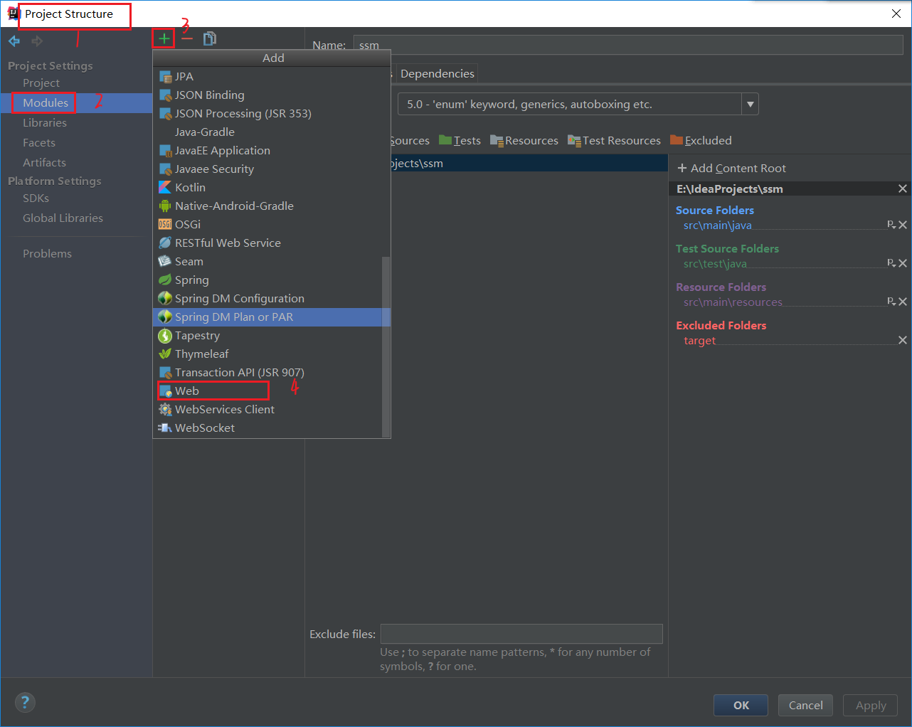

​				<span style="font-size:18px">修改Deployment Descriptors(路径\项目名\modules名\ ==src\main\webapp==\WEB-INF\web.xml)和Web Resource Directories(路径\项目名\modules名\src\main\webapp)</span>

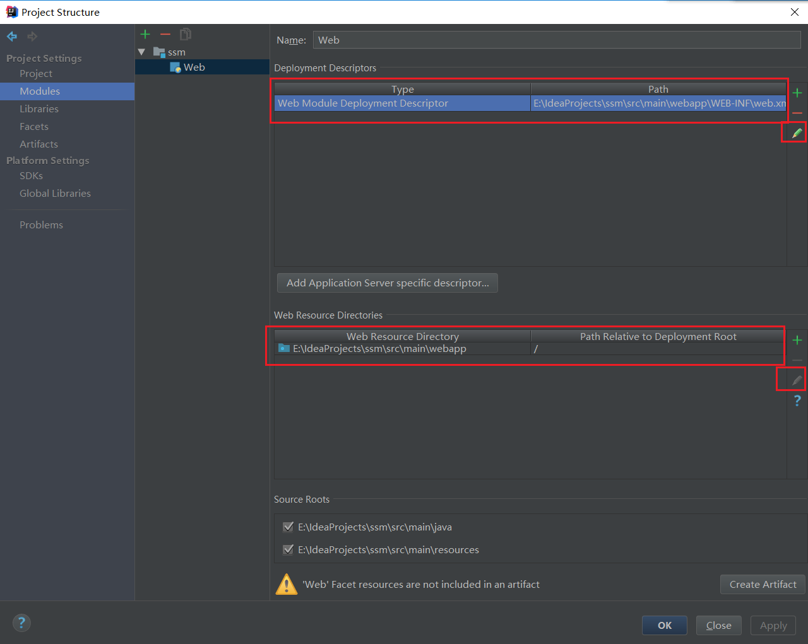


## 3.目录

​						<span style="font-size:18px;color:red;margin:40px 0">**mapper文件在resources再创建一个mapper文件夹**</span>

​						<span style="font-size:18px;color:red;margin:40px 0">**web.xml在webapp/WEB-INF下**</span>

​						<span style="font-size:18px;color:red;margin:40px 0">**其余都在resources文件夹下**</span>

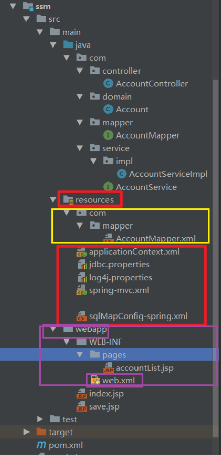

### 3.1编写项目

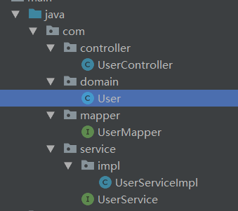

### 3.2所需配置文件

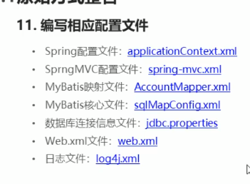


​							<span style="font-size:18px;color:red;margin:40px 0">**应该先编写pom.xml文件,但是为了笔记观看,吧pom.xml文件放在最后**</span>

### ①jdbc.properties(数据库连接信息)

​							<span style="font-size:18px;margin:40px 0">**==New  →  File文件==**</span>	

```properties
jdbc.driver=com.mysql.jdbc.Driver
jdbc.url=jdbc:mysql://localhost:3306/test?useUnicode=true&characterEncoding=utf8
jdbc.username=root
jdbc.password=root
```


### ②log4j.properties(日志文件)

​							<span style="font-size:18px;margin:40px 0">**==New  →  File文件==**</span>	

```properties
#
# Hibernate, Relational Persistence for Idiomatic Java
#
# License: GNU Lesser General Public License (LGPL), version 2.1 or later.
# See the lgpl.txt file in the root directory or <http://www.gnu.org/licenses/lgpl-2.1.html>.
#

### direct log messages to stdout ###
log4j.appender.stdout=org.apache.log4j.ConsoleAppender
log4j.appender.stdout.Target=System.err
log4j.appender.stdout.layout=org.apache.log4j.PatternLayout
log4j.appender.stdout.layout.ConversionPattern=%d{ABSOLUTE} %5p %c{1}:%L - %m%n

### direct messages to file hibernate.log ###
#log4j.appender.file=org.apache.log4j.FileAppender
#log4j.appender.file.File=hibernate.log
#log4j.appender.file.layout=org.apache.log4j.PatternLayout
#log4j.appender.file.layout.ConversionPattern=%d{ABSOLUTE} %5p %c{1}:%L - %m%n

### set log levels - for more verbose logging change 'info' to 'debug' ###

log4j.rootLogger=all, stdout

```


### ③web.xml(监听器/端控制器/乱码过滤器)

> ⑴spring 监听器
>
> ⑵springmvc的前端控制器
>
> ⑶乱码过滤器

```xml
<?xml version="1.0" encoding="UTF-8"?>
<web-app xmlns:xsi="http://www.w3.org/2001/XMLSchema-instance"
         xmlns="http://java.sun.com/xml/ns/javaee"
         xsi:schemaLocation="http://java.sun.com/xml/ns/javaee http://java.sun.com/xml/ns/javaee/web-app_2_5.xsd" id="WebApp_ID" version="2.5">

    <!--spring 监听器-->
    <context-param>
        <param-name>contextConfigLocation</param-name>
        <param-value>classpath:applicationContext.xml</param-value>
    </context-param>
    <listener>
        <listener-class>org.springframework.web.context.ContextLoaderListener</listener-class>
    </listener>

    <!--springmvc的前端控制器-->
    <servlet>
        <servlet-name>DispatcherServlet</servlet-name>
        <servlet-class>org.springframework.web.servlet.DispatcherServlet</servlet-class>
        <init-param>
            <param-name>contextConfigLocation</param-name>
            <param-value>classpath:spring-mvc.xml</param-value>
        </init-param>
        <load-on-startup>1</load-on-startup>
    </servlet>
    <servlet-mapping>
        <servlet-name>DispatcherServlet</servlet-name>
        <url-pattern>/</url-pattern>
    </servlet-mapping>

    <!--乱码过滤器-->
    <filter>
        <filter-name>CharacterEncodingFilter</filter-name>
        <filter-class>org.springframework.web.filter.CharacterEncodingFilter</filter-class>
        <init-param>
            <param-name>encoding</param-name>
            <param-value>UTF-8</param-value>
        </init-param>
    </filter>
    <filter-mapping>
        <filter-name>CharacterEncodingFilter</filter-name>
        <url-pattern>/*</url-pattern>
    </filter-mapping>

</web-app>

```


### ④sqlMapConfig-spring.xml(Mybatis核心文件)

​							<span style="font-size:18px;margin:40px 0">**==New  →  File文件==**</span>	

```xml
<?xml version="1.0" encoding="UTF-8" ?>
<!DOCTYPE configuration
        PUBLIC "-//mybatis.org//DTD Config 3.0//EN"
        "http://mybatis.org/dtd/mybatis-3-config.dtd">
<configuration>

    <!--定义别名-->
    <typeAliases>
        <!--<typeAlias type="com.domain.Account" alias="account"></typeAlias>-->
        <package name="com.domain"></package>
    </typeAliases>

</configuration>
```


### ⑤AccountMapper.xml(MyBatis映射文件)

​							<span style="font-size:18px;margin:40px 0">**==New  →  File  →  com/mapper/XXX.xml文件==**</span>	

```xml
<?xml version="1.0" encoding="UTF-8" ?>
<!DOCTYPE mapper
        PUBLIC "-//mybatis.org//DTD Mapper 3.0//EN"
        "http://mybatis.org/dtd/mybatis-3-mapper.dtd">

<mapper namespace="com.mapper.AccountMapper">
    <insert id="save" parameterType="account">
        insert into account1 values(#{id},#{name},#{money})
    </insert>
    <select id="findAll" resultType="account">
        select * from account1
    </select>
</mapper>
```

### ⑥applicationContext.xml(Spring配置文件)

​							<span style="font-size:18px;margin:40px 0">**==Spring Config文件==**</span>

​							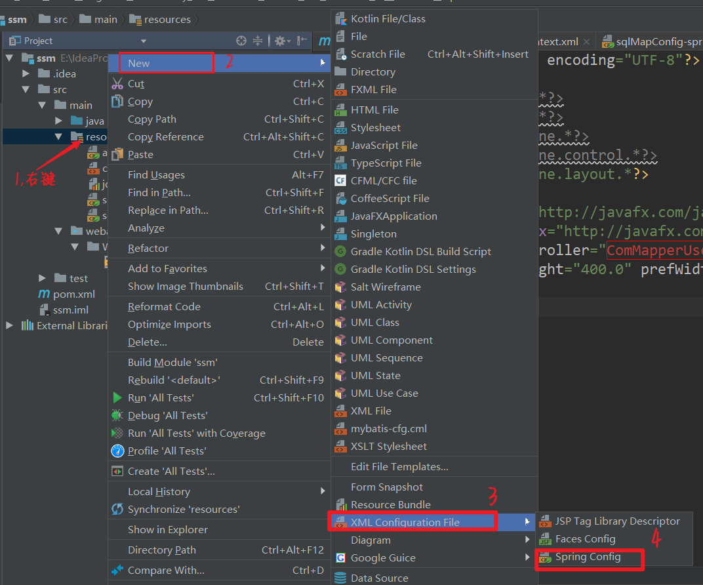

> ⑴组件扫描 扫描service和mapper
>
> ​		排除controller的扫描
>
> ⑵加载propeties文件
>
> ⑶配置数据源信息
>
> ⑷配置sessionFactory
>
> ​		加载mybatis核心文件
>
> ⑸扫描mapper所在的包 为mapper创建实现类   
>
> ⑹声明式事务控制/平台事务管理器
> ⑺配置事务增强
>
> ⑻事务的aop织入

```xml
<?xml version="1.0" encoding="UTF-8" ?>
<beans xmlns="http://www.springframework.org/schema/beans"
       xmlns:xsi="http://www.w3.org/2001/XMLSchema-instance"
       xmlns:aop="http://www.springframework.org/schema/aop"
       xmlns:tx="http://www.springframework.org/schema/tx"
       xmlns:context="http://www.springframework.org/schema/context"
       xsi:schemaLocation="http://www.springframework.org/schema/beans
                           http://www.springframework.org/schema/beans/spring-beans.xsd
                           http://www.springframework.org/schema/tx
                           http://www.springframework.org/schema/tx/spring-tx.xsd
                           http://www.springframework.org/schema/aop
                           http://www.springframework.org/schema/aop/spring-aop.xsd
                           http://www.springframework.org/schema/context
                           http://www.springframework.org/schema/context/spring-context.xsd">

    <!--组件扫描 扫描service和mapper-->
    <context:component-scan base-package="com">
        <!--排除controller的扫描,controller是springmvc进行控制的-->
        <context:exclude-filter type="annotation" expression="org.springframework.stereotype.Controller"></context:exclude-filter>
    </context:component-scan>

    <!--加载propeties文件-->
    <context:property-placeholder location="classpath:jdbc.properties"></context:property-placeholder>

    <!--配置数据源信息-->
    <bean id="dataSource" class="com.mchange.v2.c3p0.ComboPooledDataSource">
        <property name="driverClass" value="${jdbc.driver}"></property>
        <property name="jdbcUrl" value="${jdbc.url}"></property>
        <property name="user" value="${jdbc.username}"></property>
        <property name="password" value="${jdbc.password}"></property>
    </bean>

    <!--配置sessionFactory-->
    <bean id="sqlSessionFactory" class="org.mybatis.spring.SqlSessionFactoryBean">
        <property name="dataSource" ref="dataSource"></property>
        <!--加载mybatis核心文件-->
        <property name="configLocation" value="classpath:sqlMapConfig-spring.xml"></property>
    </bean>

    <!--扫描mapper所在的包 为mapper创建实现类-->
    <bean class="org.mybatis.spring.mapper.MapperScannerConfigurer">
        <property name="basePackage" value="com.mapper"></property>
    </bean>


    <!--声明式事务控制-->
    <!--平台事务管理器-->
    <bean id="transactionManager" class="org.springframework.jdbc.datasource.DataSourceTransactionManager">
        <property name="dataSource" ref="dataSource"></property>
    </bean>

    <!--配置事务增强-->
    <tx:advice id="txAdvice">
        <tx:attributes>
            <tx:method name="*"/>
        </tx:attributes>
    </tx:advice>

    <!--事务的aop织入-->
    <aop:config>
        <aop:advisor advice-ref="txAdvice" pointcut="execution(* com.service.impl.*.*(..))"></aop:advisor>
    </aop:config>

</beans>
```


### ⑦spring-mvc.xml(SpringMVC配置文件)

​							<span style="font-size:18px;margin:40px 0">**==Spring Config文件==**</span>

> ⑴组件扫描  主要扫描controller
> ⑵配置mvc注解驱动
>
> ⑶内部资源视图解析器
>
> ⑷开发静态资源访问权限

```xml
<?xml version="1.0" encoding="UTF-8" ?>
<beans xmlns="http://www.springframework.org/schema/beans"
       xmlns:mvc="http://www.springframework.org/schema/mvc"
       xmlns:context="http://www.springframework.org/schema/context"
       xmlns:xsi="http://www.w3.org/2001/XMLSchema-instance"
       xsi:schemaLocation="http://www.springframework.org/schema/beans
                           http://www.springframework.org/schema/beans/spring-beans.xsd
                           http://www.springframework.org/schema/mvc
                           http://www.springframework.org/schema/mvc/spring-mvc.xsd
                           http://www.springframework.org/schema/context
                           http://www.springframework.org/schema/context/spring-context.xsd">

    <!--组件扫描  主要扫描controller-->
    <context:component-scan base-package="com.controller"></context:component-scan>
    <!--配置mvc注解驱动-->
    <mvc:annotation-driven></mvc:annotation-driven>
    <!--内部资源视图解析器-->
    <bean id="resourceViewResolver" class="org.springframework.web.servlet.view.InternalResourceViewResolver">
        <property name="prefix" value="/WEB-INF/pages/"></property>
        <property name="suffix" value=".jsp"></property>
    </bean>
    <!--开发静态资源访问权限-->
    <mvc:default-servlet-handler></mvc:default-servlet-handler>


</beans>
```


### pom.xml(坐标)

```xml
<?xml version="1.0" encoding="UTF-8"?>
<project xmlns="http://maven.apache.org/POM/4.0.0"
         xmlns:xsi="http://www.w3.org/2001/XMLSchema-instance"
         xsi:schemaLocation="http://maven.apache.org/POM/4.0.0 http://maven.apache.org/xsd/maven-4.0.0.xsd">
    <modelVersion>4.0.0</modelVersion>

    <groupId>com</groupId>
    <artifactId>ssm</artifactId>
    <version>1.0-SNAPSHOT</version>

    <properties>
        <project.build.sourceEncoding>UTF-8</project.build.sourceEncoding>
        <maven.compiler.source>1.8</maven.compiler.source>
        <maven.compiler.target>1.8</maven.compiler.target>
    </properties>

    <dependencies>
        <!--spring相关-->
        <!--上下文-->
        <dependency>
            <groupId>org.springframework</groupId>
            <artifactId>spring-context</artifactId>
            <version>5.0.5.RELEASE</version>
        </dependency>

        <!--aop-->
        <dependency>
            <groupId>org.aspectj</groupId>
            <artifactId>aspectjweaver</artifactId>
            <version>1.8.7</version>
        </dependency>

        <!--jdbc-->
        <dependency>
            <groupId>org.springframework</groupId>
            <artifactId>spring-jdbc</artifactId>
            <version>5.0.5.RELEASE</version>
        </dependency>

        <!--事务-->
        <dependency>
            <groupId>org.springframework</groupId>
            <artifactId>spring-tx</artifactId>
            <version>5.0.5.RELEASE</version>
        </dependency>

        <!--测试-->
        <dependency>
            <groupId>org.springframework</groupId>
            <artifactId>spring-test</artifactId>
            <version>5.0.5.RELEASE</version>
        </dependency>

        <!--springmvc-->
        <dependency>
            <groupId>org.springframework</groupId>
            <artifactId>spring-webmvc</artifactId>
            <version>5.0.5.RELEASE</version>
        </dependency>

        <!--servlet和jsp-->
        <dependency>
            <groupId>javax.servlet</groupId>
            <artifactId>servlet-api</artifactId>
            <version>2.5</version>
        </dependency>
        <dependency>
            <groupId>javax.servlet.jsp</groupId>
            <artifactId>jsp-api</artifactId>
            <version>2.0</version>
        </dependency>

        <!--mybatis相关-->
        <dependency>
            <groupId>org.mybatis</groupId>
            <artifactId>mybatis</artifactId>
            <version>3.4.5</version>
        </dependency>

        <!--mybatis整合spring的包-->
        <dependency>
            <groupId>org.mybatis</groupId>
            <artifactId>mybatis-spring</artifactId>
            <version>1.3.1</version>
        </dependency>

        <!--mysql-->
        <dependency>
            <groupId>mysql</groupId>
            <artifactId>mysql-connector-java</artifactId>
            <version>5.1.6</version>
        </dependency>

        <!--数据源-->
        <dependency>
            <groupId>c3p0</groupId>
            <artifactId>c3p0</artifactId>
            <version>0.9.1.2</version>
        </dependency>

        <!--Junit测试-->
        <dependency>
            <groupId>junit</groupId>
            <artifactId>junit</artifactId>
            <version>4.12</version>
        </dependency>

        <!--jstl-->
        <dependency>
            <groupId>jstl</groupId>
            <artifactId>jstl</artifactId>
            <version>1.2</version>
        </dependency>

    </dependencies>

    <build>
        <finalName>ssm</finalName>
        <pluginManagement><!-- lock down plugins versions to avoid using Maven defaults (may be moved to parent pom) -->
            <plugins>
                <plugin>
                    <artifactId>maven-clean-plugin</artifactId>
                    <version>3.0.0</version>
                </plugin>
                <!-- see http://maven.apache.org/ref/current/maven-core/default-bindings.html#Plugin_bindings_for_war_packaging -->
                <plugin>
                    <artifactId>maven-resources-plugin</artifactId>
                    <version>3.0.2</version>
                </plugin>
                <plugin>
                    <artifactId>maven-compiler-plugin</artifactId>
                    <version>3.7.0</version>
                </plugin>
                <plugin>
                    <artifactId>maven-surefire-plugin</artifactId>
                    <version>2.20.1</version>
                </plugin>
                <plugin>
                    <artifactId>maven-war-plugin</artifactId>
                    <version>3.2.0</version>
                </plugin>
                <plugin>
                    <artifactId>maven-install-plugin</artifactId>
                    <version>2.5.2</version>
                </plugin>
                <plugin>
                    <artifactId>maven-deploy-plugin</artifactId>
                    <version>2.8.2</version>
                </plugin>
            </plugins>
        </pluginManagement>
    </build>

</project>
```


### 3.3项目代码


#### 3.3.1Account

```java
public class Account {
    private int id;
    private String name;
    private double money;
	// 省去 空参构造方法,有参构造方法,setter/getter方法,重写toString方法
}
```


#### 3.3.2AccountMapper

```java
public interface AccountMapper {

    public void save(Account account);

    public List<Account> findAll();
}
```


#### 3.3.3AccountService

```java
public interface AccountService {

    public void save(Account account);

    public List<Account> findAll();
}
```


#### 3.3.4AccountServiceImpl

```java
@Service("accountService")
public class AccountServiceImpl implements AccountService {

    @Autowired
    private AccountMapper accountMapper;

    @Override
    public void save(Account account) {
        accountMapper.save(account);
    }

    @Override
    public List<Account> findAll() {
        return accountMapper.findAll();
    }
}
```


#### 3.3.5AccountController

```java
@Controller
@RequestMapping("/account")
public class AccountController {

    @Autowired
    private AccountService accountService;

    //保存
    @RequestMapping(value = "/save",produces = "text/html;charset=UTF-8")
    @ResponseBody
    public String save(Account account){
        accountService.save(account);
        System.out.println(account);
        return "保存成功";
    }

    //查询
    @RequestMapping("/findAll")
    public ModelAndView findAll(){
        List<Account> accountList = accountService.findAll();
        ModelAndView modelAndView = new ModelAndView();
        modelAndView.addObject("accountList",accountList);
        modelAndView.setViewName("accountList");
        return modelAndView;
    }

}
```


