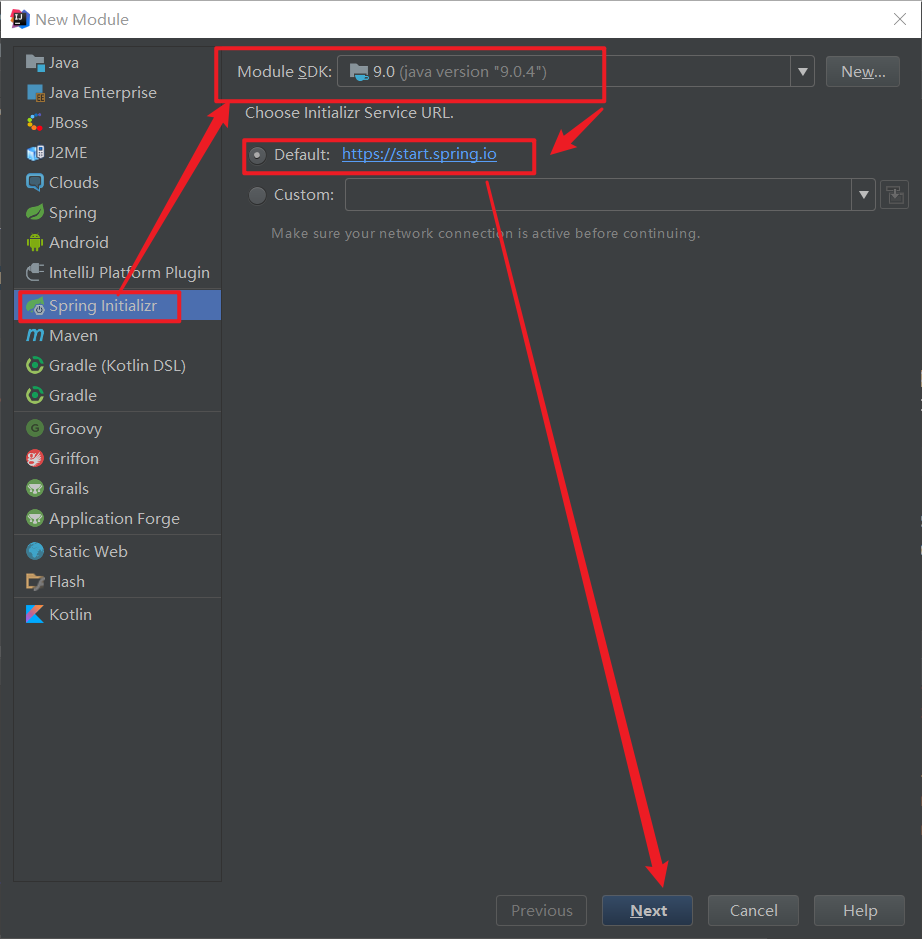
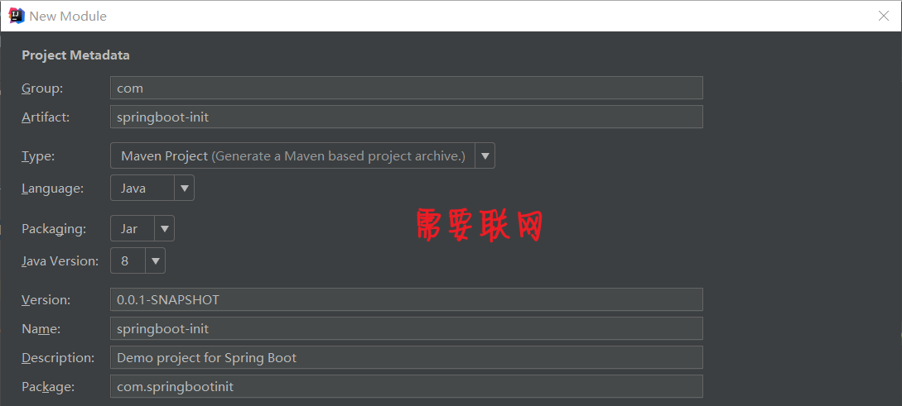
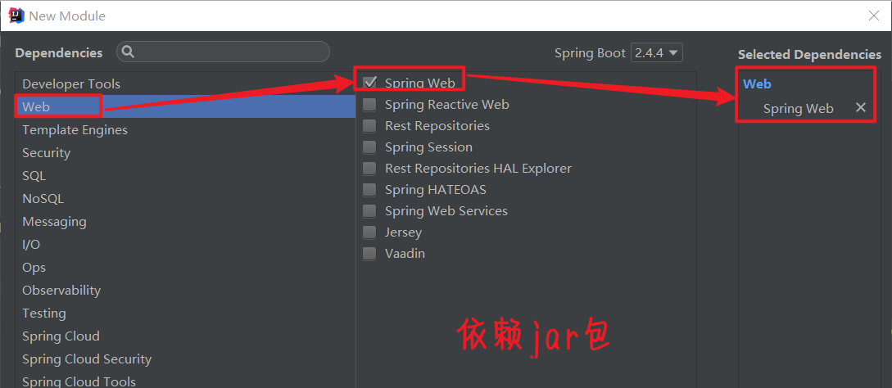
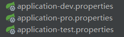
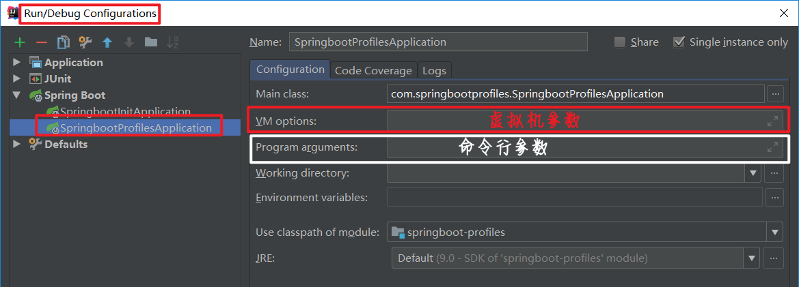
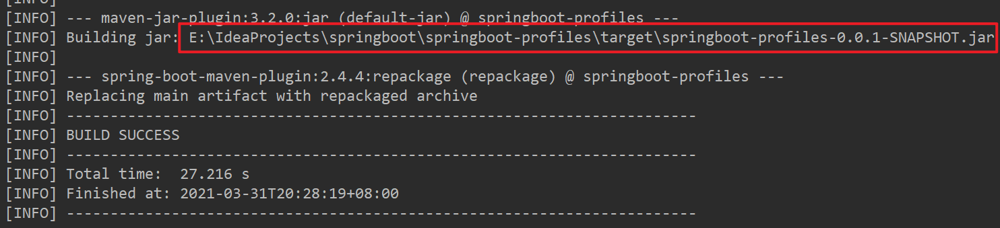
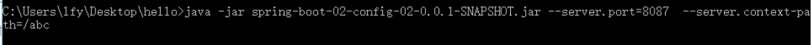

# 概述

## 概念

​			SpringBoot提供了一种**快速使用Spring的方式**，基于约定优于配置的思想，可以让开发人员不必在配置与逻辑业务之间进行思维的切换，全身心的投入到逻辑业务的代码编写中，从而大大提高了开发的效率，一定程度上缩短了项目周期。2014年4 月，SpringBoot 1.0.0发布。Spring的顶级项目之一 (https://spring.io)。


## Spring缺点

### 1) 配置繁琐

​			虽然Spring的组件代码是轻量级的,但它的**配置却是重量级**的。一开始, Spring用XML配置,而且是很多XML配置。Spring2.5引入 了基于注解的组件扫描，这消除了大量针对应用程序自身组件的显式XML配置。Spring 3.0引入了基于Java的配置，这是一种类型安全的可重构配置方式，可以代替XML。

​			所有这些配置都代表了开发时的损耗。因为在思考Spring特性配置和解决业务问题之间需要进行思维切换,所以编写配置挤占了编写应用程序逻辑的时间。和所有框架一样, Spring实用， 但它要求的回报也不少。

### 2)依赖繁琐

​			项目的依赖管理也是一件耗时耗力的事情。在环境搭建时,需要分析要导入哪些库的坐标，而且还需要分析导入与之有依赖关系的其他库的坐标，一旦选错了**依赖的版本**，随之而来的不兼容问题就会严重阻碍项目的开发进度。


## SpringBoot功能

### 1)自动配置

​			Spring Boot的自动配置是一个运行时 (更准确地说，是应用程序启动时)的过程,考虑了众多因素,才决定Spring配置应该用哪个,不该用哪个。该过程是SpringBoot自动完成的。

### 2)起步依赖

​			起步依赖本质上是-个Maven项目对象模型(Project Object Model, POM)，定义了对其他库的传递依赖，这些东西加在一起即支持某项功能。简单的说，起步依赖就是将具备某种功能的坐标打包到一起,并提供-些默认的功能。

### 3)辅助功能

​		提供了-些大型项目中常见的非功能性特性，如嵌入式服务器、安全、指标,健康检测、外部配置等。


# 快速入门

## 实现步骤

​			①创建Maven项目
​			②导入SpringBoot起步依赖
​			③定义Controller
​			④编写引导类
​			⑤启动测试

## pom.xml

```xml
<?xml version="1.0" encoding="UTF-8"?>
<project xmlns="http://maven.apache.org/POM/4.0.0"
         xmlns:xsi="http://www.w3.org/2001/XMLSchema-instance"
         xsi:schemaLocation="http://maven.apache.org/POM/4.0.0 http://maven.apache.org/xsd/maven-4.0.0.xsd">
    <modelVersion>4.0.0</modelVersion>

    <groupId>com</groupId>
    <artifactId>springboot-helloworld</artifactId>
    <version>1.0-SNAPSHOT</version>

    <!--springboot 工程需要继承的父工程-->
    <parent>
        <groupId>org.springframework.boot</groupId>
        <artifactId>spring-boot-starter-parent</artifactId>
        <version>2.1.8.RELEASE</version>
        <relativePath/> <!-- lookup parent from repository -->
    </parent>

    <dependencies>
        <!--web开发的起步依赖-->
        <dependency>
            <groupId>org.springframework.boot</groupId>
            <artifactId>spring-boot-starter-web</artifactId>
        </dependency>
    </dependencies>

</project>
```

## Controller类

```java
// @ResponseBody
// @Controller
@RestController
public class HelloWorld {

    @RequestMapping("hello")
    // http://localhost:8080/hello
    public String hello(){
        return "hello Spring Boot !";
    }
}
```

## 引导类

```java
@SpringBootApplication
public class HelloApplication {
    public static void main(String[] args) {
        SpringApplication.run(HelloApplication.class,args);
    }
}
```

## 小结

​				●SpringBoot在创建项目时,使用jar的打包方式。
​				●SpringBoot的引导类, 项目入口，运行main方法就可以启动项目。
​				●使用SpringBoot和Spring构建的项目， 业务代码编写方式完全一样。

# IDEA 快速搭建SpringBoot项目









# Spring Boot HelloWorld

一个功能：

浏览器发送hello请求，服务器接受请求并处理，响应Hello World字符串；


### 1、创建一个maven工程；（jar）

### 2、导入spring boot相关的依赖

```xml
    <parent>
        <groupId>org.springframework.boot</groupId>
        <artifactId>spring-boot-starter-parent</artifactId>
        <version>1.5.9.RELEASE</version>
    </parent>
    <dependencies>
        <dependency>
            <groupId>org.springframework.boot</groupId>
            <artifactId>spring-boot-starter-web</artifactId>
        </dependency>
    </dependencies>
```

### 3、编写一个主程序；启动Spring Boot应用

```java
/**
 *  @SpringBootApplication 来标注一个主程序类，说明这是一个Spring Boot应用
 */
@SpringBootApplication
public class HelloWorldMainApplication {

    public static void main(String[] args) {

        // Spring应用启动起来
        SpringApplication.run(HelloWorldMainApplication.class,args);
    }
}
```

### 4、编写相关的Controller、Service

```java
@Controller
public class HelloController {

    @ResponseBody
    @RequestMapping("/hello")
    public String hello(){
        return "Hello World!";
    }
}

```

### 5、运行主程序测试

### 6、简化部署

```xml
 <!-- 这个插件，可以将应用打包成一个可执行的jar包；-->
    <build>
        <plugins>
            <plugin>
                <groupId>org.springframework.boot</groupId>
                <artifactId>spring-boot-maven-plugin</artifactId>
            </plugin>
        </plugins>
    </build>
```

将这个应用打成jar包，直接使用java -jar的命令进行执行；

# Hello World探究

### 1、POM文件

#### 1、父项目

```xml
<parent>
    <groupId>org.springframework.boot</groupId>
    <artifactId>spring-boot-starter-parent</artifactId>
    <version>1.5.9.RELEASE</version>
</parent>

他的父项目是
<parent>
  <groupId>org.springframework.boot</groupId>
  <artifactId>spring-boot-dependencies</artifactId>
  <version>1.5.9.RELEASE</version>
  <relativePath>../../spring-boot-dependencies</relativePath>
</parent>
他来真正管理Spring Boot应用里面的所有依赖版本；

```

Spring Boot的版本仲裁中心；

以后我们导入依赖默认是不需要写版本；（没有在dependencies里面管理的依赖自然需要声明版本号）

#### 2、启动器

```xml
<dependency>
    <groupId>org.springframework.boot</groupId>
    <artifactId>spring-boot-starter-web</artifactId>
</dependency>
```

**spring-boot-starter**-==web==：

​	spring-boot-starter：spring-boot场景启动器；帮我们导入了web模块正常运行所依赖的组件；


Spring Boot将所有的功能场景都抽取出来，做成一个个的starters（启动器），只需要在项目里面引入这些starter相关场景的所有依赖都会导入进来。要用什么功能就导入什么场景的启动器


### 2、主程序类，主入口类

```java
/**
 *  @SpringBootApplication 来标注一个主程序类，说明这是一个Spring Boot应用
 */
@SpringBootApplication
public class HelloWorldMainApplication {

    public static void main(String[] args) {

        // Spring应用启动起来
        SpringApplication.run(HelloWorldMainApplication.class,args);
    }
}

```

@**SpringBootApplication**:    Spring Boot应用标注在某个类上说明这个类是SpringBoot的主配置类，SpringBoot就应该运行这个类的main方法来启动SpringBoot应用；


```java
@Target(ElementType.TYPE)
@Retention(RetentionPolicy.RUNTIME)
@Documented
@Inherited
@SpringBootConfiguration
@EnableAutoConfiguration
@ComponentScan(excludeFilters = {
      @Filter(type = FilterType.CUSTOM, classes = TypeExcludeFilter.class),
      @Filter(type = FilterType.CUSTOM, classes = AutoConfigurationExcludeFilter.class) })
public @interface SpringBootApplication {
```

@**SpringBootConfiguration**:Spring Boot的配置类；

​		标注在某个类上，表示这是一个Spring Boot的配置类；

​		@**Configuration**:配置类上来标注这个注解；

​			配置类 -----  配置文件；配置类也是容器中的一个组件；@Component


@**EnableAutoConfiguration**：开启自动配置功能；

​		以前我们需要配置的东西，Spring Boot帮我们自动配置；@**EnableAutoConfiguration**告诉SpringBoot开启自动配置功能；这样自动配置才能生效；

```java
@AutoConfigurationPackage
@Import(EnableAutoConfigurationImportSelector.class)
public @interface EnableAutoConfiguration {
```

​      	@**AutoConfigurationPackage**：自动配置包

​		@**Import**(AutoConfigurationPackages.Registrar.class)：

​		Spring的底层注解@Import，给容器中导入一个组件；导入的组件由AutoConfigurationPackages.Registrar.class；

==将主配置类（@SpringBootApplication标注的类）的所在包及下面所有子包里面的所有组件扫描到Spring容器；==

​	@**Import**(EnableAutoConfigurationImportSelector.class)；

​		给容器中导入组件？

​		**EnableAutoConfigurationImportSelector**：导入哪些组件的选择器；

​		将所有需要导入的组件以全类名的方式返回；这些组件就会被添加到容器中；

​		会给容器中导入非常多的自动配置类（xxxAutoConfiguration）；就是给容器中导入这个场景需要的所有组件，并配置好这些组件；		

有了自动配置类，免去了我们手动编写配置注入功能组件等的工作；

​		SpringFactoriesLoader.loadFactoryNames(EnableAutoConfiguration.class,classLoader)；


==Spring Boot在启动的时候从类路径下的META-INF/spring.factories中获取EnableAutoConfiguration指定的值，将这些值作为自动配置类导入到容器中，自动配置类就生效，帮我们进行自动配置工作；==以前我们需要自己配置的东西，自动配置类都帮我们；

J2EE的整体整合解决方案和自动配置都在spring-boot-autoconfigure-1.5.9.RELEASE.jar；


## 6、使用Spring Initializer快速创建Spring Boot项目

### 1、IDEA：使用 Spring Initializer快速创建项目

IDE都支持使用Spring的项目创建向导快速创建一个Spring Boot项目；

选择我们需要的模块；向导会联网创建Spring Boot项目；

默认生成的Spring Boot项目；

- 主程序已经生成好了，我们只需要我们自己的逻辑
- resources文件夹中目录结构
	- static：保存所有的静态资源； js css  images；
	- templates：保存所有的模板页面；（Spring Boot默认jar包使用嵌入式的Tomcat，默认不支持JSP页面）；可以使用模板引擎（freemarker、thymeleaf）；
	- application.properties：Spring Boot应用的配置文件；可以修改一些默认设置；

### 2、STS使用 Spring Starter Project快速创建项目


# SpringBoot起步依赖原理分析

## 起步依赖原理分析

​			1) spring-boot-starter-parent
​			2) spring-boot-starter-web

## 小结

​			●在spring-boot-starter- parent中定义了各种技术的版本信息，组合了一套最优搭配的技术版本。
​			●在各种starter中，定义了完成该功能需要的坐标合集，其中大部分版本信息来自于父工程。
​			●我们的工程继承parent,引入starter后, 通过依赖传递,就可以简单方便获得需要的jar包，并且不会存在版本冲突等问题。


# SpringBoot配置

## 配置文件分类

​					SpringBoot是基于约定的，所以很多配置都有默认值,但如果想使用自己的配置替换默认配置的话，就可以使用application.properties或者application.yml (application.yaml) 进行配置。

### ●properties:

​							server.port=8080

### ●yml:

​							server :
​								port:  8080

### 小结

​							●SpringBoot提供了2种配置文件类型: properteis和yml/yaml
​							●默认配置文件名称: application
​							●在同一级目录下优先级为: properties > yml > yaml

## YAML

​				YAML全称是YAML Ain't Markup Language。YAML是一种直观的能够被电脑识别的的数据数据序列化格式， 并且容易被人类阅
读，容易和脚本语言交互的，可以被支持YAML库的不同的编程语言程序导入，比如: C/C+ +, Ruby, Python, Java, Perl, C#, PHP等。YML文件是以数据为核心的,比传统的xml方式更加简洁。
​				YAML文件的扩展名可以使用.yml或者:yaml.简洁，以数据为核心

#### ●properties:

```properties
server.port=8080
server.address=127.0.0.1
```

#### ●xml:

```xml
<server>
    <port>8080</port>
    <adress>127.0.0.1</address>
</server>
```

#### ●yml:

```yaml
server :
	# : 和后面的值中间有  空格
	port: 8080 			
	address: 127.0.0.1
```

### YAML:基本语法

​							●大小写敏感
​							●数据值前边必须有**空格**，作为分隔符
​							●使用缩进表示层级关系
​							●缩进时不允许使用Tab键,只允许使用空格(各个系统Tab对应的空格数目可能不同，导致层次混乱)。
​							●缩进的空格数目不重要，只要相同层级的元素左侧对齐即呵
​							●#表示注释,从这个字符一 直到行尾，都会被解析器忽略。

```yaml
server :
  port: 8080 
  address: 127.0.0.1
name: abc
```

### YAML:数据格式

#### ●对象(map):键值对的集合。

​									k: v：在下一行来写对象的属性和值的关系；注意缩进

​										对象还是k: v的方式

```yaml
name: lisi
#对象
person:
  name: zhangsan
  age: 20
# 对象行内写法
person2: {name: ${name},age: 20}
```

#### ●数组:一组按次序排列的值

​									用  **-** 值表示数组中的一个元素

```yaml
address:
  - beijing
  - shanghai
#行内写法
address: [beijing, shanghai]
```

#### ●纯量:单个的、不可再分的值

##### 字面量：普通的值（数字，字符串，布尔）

​									k: v：字面直接来写；

​											字符串默认不用加上单引号或者双引号；

​											""：双引号；不会转义字符串里面的特殊字符；特殊字符会作为本身想表示的意思

​													name:   "zhangsan \n lisi"：输出；zhangsan 换行  lisi

​											''：单引号；会转义特殊字符，特殊字符最终只是一个普通的字符串数据

​													name:   ‘zhangsan \n lisi’：输出；zhangsan \n  lisi

```yaml
msg1: 'he1lo \n world'  #单引忽略转义字符,原样展示
msg2: "hello \n world"  #双引识别转义字符,进行换行
```


### YAML:小结

#### 1)配置文件类型

​									●properties: 和以前一样
​									●yml/yaml:注意空格

#### 2) yaml: 简洁，以数据为核心

##### 基本语法

​									●大小写敏感
​									●数据值前边必须有空格,作为分隔符
​									●使用空格缩进表示层级关系，相同缩进表示同- -级

##### 数据格式

​									●对象的
​									●数组:使用“- ”表示数组每个元素
​									●纯量

##### 参数引用

​									●${key}


### 读取配置内容

​							读取上面配置文件的内容

#### 1) @Value

#### 2) Environment

#### 3) @ConfigurationProperties

#### pom.xml

​									解决下图中Person类的问题

```xml
<dependency>
    <groupId>org.springframework.boot</groupId>
    <artifactId>spring-boot-configuration-processor</artifactId>
    <optional>true</optional>
</dependency>
```


#### application.yaml

```yaml
server:
  port: 8082

name: lisi
#对象
person:
  name: ${name}
  age: 20
# 对象行内写法
person2: {name: zhangsan,age: 20}

# 数组
address:
  - beijing
  - shanghai
# 数组行内写法
address2: [beijing,shanghai]

# 纯量
msg1: 'he1lo \n world'  #单引忽略转义字符,原样展示
msg2: "hello \n world"  #双引识别转义字符,进行换行

```

#### Person类

​									用于使用@ConfigurationProperties

```java
/**
 * 将配置文件中配置的每一个属性的值，映射到这个组件中
 * @ConfigurationProperties：告诉SpringBoot将本类中的所有属性和配置文件中相关的配置进行绑定；
 *      prefix = "person"：配置文件中哪个下面的所有属性进行一一映射
 *
 * 只有这个组件是容器中的组件，才能容器提供的@ConfigurationProperties功能；
 *
 */
@Component
@ConfigurationProperties(prefix = "person2")
public class Person {
    private String name;
    private int age;
	// 省略setter/getter/toString方法
}
```

#### 测试类

```java
@RestController
public class HelloController {

    // 单数据
    @Value("${name}")
    private String name;

    @RequestMapping("/hello2")
    public String hello2() {
        System.out.println(name);           // lisi
        return name;
    }

    // 对象
    @Value("${person2.name}")
    private String name2;

    @Value("${person2.age}")
    private int age;

    @RequestMapping("/hello3")
    public String hello3() {
        System.out.println(name2);              // zhangsan
        System.out.println(age);                // 20
        return "name:" + name2 + "   " + "age:" + age;
    }

    // 数组
    @Value("${address[0]}")
    private String address;

    @RequestMapping("/hello4")
    public String hello4() {
        System.out.println(address);        // beijing
        return address;
    }

    // 纯量
    @Value("${msg1}")
    private String msg1;
    @Value("${msg2}")
    private String msg2;

    @RequestMapping("/hello5")
    public String hello5() {
        System.out.println(msg1);                   // he1lo \n world
        System.out.println(msg2);
        /*
            hello
             world
         */
        return "msg1:" + msg1 + "  msg2:" + msg1;
    }


    // org.springframework.core.env.Environment;
    @Autowired
    private Environment env;
    @RequestMapping("/hello6")
    public String hello6() {

        System.out.println(env.getProperty("person.name"));         // lisi
        System.out.println(env.getProperty("address[0]"));          // beijing
        System.out.println(env.getProperty("msg1"));                // he1lo \n world
        return "yaml获取数据";
    }
    
    @Autowired
    private Person person;

    @RequestMapping("/hello7")
    public String hello7() {

        // @ConfigurationProperties,prefix默认不设置
        System.out.println(person);     // Person{name='lisi', age=0},

        // @ConfigurationProperties(prefix = "person")
        System.out.println(person);     // Person{name='lisi', age=20},

        // @ConfigurationProperties(prefix = "person2")
        System.out.println(person);     // Person{name='zhangsan', age=20}

        return "yaml获取数据";
    }
}
```

#### 1、properties配置文件在idea中默认utf-8可能会乱码

调整


#### 2、@Value获取值和@ConfigurationProperties获取值比较

|                      | @ConfigurationProperties | @Value     |
| -------------------- | ------------------------ | ---------- |
| 功能                 | 批量注入配置文件中的属性 | 一个个指定 |
| 松散绑定（松散语法） | 支持                     | 不支持     |
| SpEL                 | 不支持                   | 支持       |
| JSR303数据校验       | 支持                     | 不支持     |
| 复杂类型封装         | 支持                     | 不支持     |

配置文件yml还是properties他们都能获取到值；

如果说，我们只是在某个业务逻辑中需要获取一下配置文件中的某项值，使用@Value；

如果说，我们专门编写了一个javaBean来和配置文件进行映射，我们就直接使用@ConfigurationProperties；


#### 3、配置文件注入值数据校验

```java
@Component
@ConfigurationProperties(prefix = "person")
@Validated
public class Person {

    /**
     * <bean class="Person">
     *      <property name="lastName" value="字面量/${key}从环境变量、配置文件中获取值/#{SpEL}"></property>
     * <bean/>
     */

   //lastName必须是邮箱格式
    @Email
    //@Value("${person.last-name}")
    private String lastName;
    //@Value("#{11*2}")
    private Integer age;
    //@Value("true")
    private Boolean boss;

    private Date birth;
    private Map<String,Object> maps;
    private List<Object> lists;
    private Dog dog;
```


#### 4、@PropertySource&@ImportResource&@Bean

@**PropertySource**：加载指定的配置文件；

```java
/**
 * 将配置文件中配置的每一个属性的值，映射到这个组件中
 * @ConfigurationProperties：告诉SpringBoot将本类中的所有属性和配置文件中相关的配置进行绑定；
 *      prefix = "person"：配置文件中哪个下面的所有属性进行一一映射
 *
 * 只有这个组件是容器中的组件，才能容器提供的@ConfigurationProperties功能；
 *  @ConfigurationProperties(prefix = "person")默认从全局配置文件中获取值；
 *
 */
@PropertySource(value = {"classpath:person.properties"})
@Component
@ConfigurationProperties(prefix = "person")
//@Validated
public class Person {

    /**
     * <bean class="Person">
     *      <property name="lastName" value="字面量/${key}从环境变量、配置文件中获取值/#{SpEL}"></property>
     * <bean/>
     */

   //lastName必须是邮箱格式
   // @Email
    //@Value("${person.last-name}")
    private String lastName;
    //@Value("#{11*2}")
    private Integer age;
    //@Value("true")
    private Boolean boss;

```


@**ImportResource**：导入Spring的配置文件，让配置文件里面的内容生效；

Spring Boot里面没有Spring的配置文件，我们自己编写的配置文件，也不能自动识别；

想让Spring的配置文件生效，加载进来；@**ImportResource**标注在一个配置类上

```java
@ImportResource(locations = {"classpath:beans.xml"})
导入Spring的配置文件让其生效
```


不来编写Spring的配置文件

```xml
<?xml version="1.0" encoding="UTF-8"?>
<beans xmlns="http://www.springframework.org/schema/beans"
       xmlns:xsi="http://www.w3.org/2001/XMLSchema-instance"
       xsi:schemaLocation="http://www.springframework.org/schema/beans http://www.springframework.org/schema/beans/spring-beans.xsd">


    <bean id="helloService" class="com.atguigu.springboot.service.HelloService"></bean>
</beans>
```

SpringBoot推荐给容器中添加组件的方式；推荐使用全注解的方式

1、配置类**@Configuration**------>Spring配置文件

2、使用**@Bean**给容器中添加组件

```java
/**
 * @Configuration：指明当前类是一个配置类；就是来替代之前的Spring配置文件
 *
 * 在配置文件中用<bean><bean/>标签添加组件
 *
 */
@Configuration
public class MyAppConfig {

    //将方法的返回值添加到容器中；容器中这个组件默认的id就是方法名
    @Bean
    public HelloService helloService02(){
        System.out.println("配置类@Bean给容器中添加组件了...");
        return new HelloService();
    }
}
```


### 配置文件占位符

#### 1、随机数

```java
${random.value}、${random.int}、${random.long}
${random.int(10)}、${random.int[1024,65536]}

```

#### 2、占位符获取之前配置的值，如果没有可以是用:指定默认值

```properties
person.last-name=张三${random.uuid}
person.age=${random.int}
person.birth=2017/12/15
person.boss=false
person.maps.k1=v1
person.maps.k2=14
person.lists=a,b,c
person.dog.name=${person.hello:hello}_dog
person.dog.age=15
```


## profile

​						我们在开发Spring Boot应用时,通常同一套程序会被安装到不同环境，比如:开发、测试、产等。其中数据库地址、服务器端口等等配置都不同，如果每次打包时，都要修改配置文件，那么非常麻烦。profile功能就是来进行动态配置切换的。

### 1) profile配置方式

​							●多profile文件方式

​							●yml多文档方式

#### 多profile文件方式



```properties
# application-dev.properties
server.port=8081

# application-pro.properties
server.port=8082

# application-test.properties
server.port=8083

# application.properties
# 启用 application-dev.properties 文件
spring.profiles.active=dev
```

#### yml多文档方式

​									创建 application.yml 文件

```yaml
---

server:
  port: 8081

spring:
  profiles: dev

---

server:
  port: 8082

spring:
  profiles: test

---

server:
  port: 8083

spring:
  profiles: pro

---
# profile激活
spring:
  profiles:
    active: pro
```


### 2) profile激活方式

​							●配置文件

​							●虚拟机参数
​							●命令行参数

#### 基于IDEA的虚拟机参数和命令行参数



​							VM options:-Dspring.profiles.active=test

​							Program arguments:-- spring.profiles.active=dev

#### 使用命令窗口

##### 打包出错

​			①resources (default-resources) on project springboot-profiles: Input length = 1 -> [Help 1]

​				springboot版本和maven版本冲突

```xml
<plugin>
    <groupId>org.apache.maven.plugins</groupId>
    <artifactId>maven-resources-plugin</artifactId>
    <version>2.4.3</version>
</plugin>
```

​			②无效的目标发行版: 11 -> [Help 1]

​					修改项目中所有java的版本

##### 打包成功




在该目录下打开命令窗口,java -jar .\springboot-profiles-0.0.1-SNAPSHOT.jar


使用

​		java -jar .\springboot-profiles-0.0.1-SNAPSHOT.jar --spring. profiles. active=pro

修改执行


### Profile-小结

​								1) profile是用来完成不同环境下，配置动态切换功能的。
​								2) profile配置方式
​											多profile文件方式:提供多个配置文件,每个代表-种环境。
​													●application-dev.properties/yml开发环境
​													●application-test.properties/yml 测试环境
​													●application-pro.properties/yml生产环境
​											yml多文档方式:
​													●在yml中使用 --- 分隔不同配置
​								3) profile激活方式
​										配置文件:再配置文件中配置: spring.profiles.active=dev
​										虚拟机参数:在VM options指定: -Dspring.profiles.active=dev
​										命令行参数: java -jar xxx.jar -- spring.profiles.active=dev


## 内部配置加载顺序

​				Springboot程序启动时，会从以下位置加载配置文件:

​						1.file:./config/	: 当前项目下的/config目录下

​						2.file:./	:   当前项目的根目录

​						3.classpath:/config/	: resources的/config目录

​						4.classpath:/	 : resources的根目录
​				加载顺序为上文的排列顺序,高优先级配置的属性会生效

## 外部配置加载顺序

​		**==SpringBoot也可以从以下位置加载配置； 优先级从高到低；高优先级的配置覆盖低优先级的配置，所有的配置会形成互补配置==**

​				**1.命令行参数**

​						所有的配置都可以在命令行上进行指定

​						java -jar spring-boot-02-config-02-0.0.1-SNAPSHOT.jar --server.port=8087  --server.context-path=/abc

​						多个配置用空格分开； --配置项=值



​				2.来自java:comp/env的JNDI属性

​				3.Java系统属性（System.getProperties()）

​				4.操作系统环境变量

​				5.RandomValuePropertySource配置的random.*属性值

​		==**由jar包外向jar包内进行寻找；**==

​		==**优先加载带profile**==

​				**6.jar包外部的application-{profile}.properties或application.yml(带spring.profile)配置文件**

​				**7.jar包内部的application-{profile}.properties或application.yml(带spring.profile)配置文件**

​		==**再来加载不带profile**==

​				**8.jar包外部的application.properties或application.yml(不带spring.profile)配置文件**

​				**9.jar包内部的application.properties或application.yml(不带spring.profile)配置文件**

​				10.@Configuration注解类上的@PropertySource

​				11.通过SpringApplication.setDefaultProperties指定的默认属性

​						所有支持的配置加载来源；		[参考官方文档](https://docs.spring.io/spring-boot/docs/1.5.9.RELEASE/reference/htmlsingle/#boot-features-external-config)

## 自动配置原理

配置文件到底能写什么？怎么写？自动配置原理；

[配置文件能配置的属性参照](https://docs.spring.io/spring-boot/docs/1.5.9.RELEASE/reference/htmlsingle/#common-application-properties)


### 1、**自动配置原理：**

1）、SpringBoot启动的时候加载主配置类，开启了自动配置功能 ==@EnableAutoConfiguration==

**2）、@EnableAutoConfiguration 作用：**

 - 利用EnableAutoConfigurationImportSelector给容器中导入一些组件？

- 可以查看selectImports()方法的内容；

- List<String> configurations = getCandidateConfigurations(annotationMetadata,      attributes);获取候选的配置

	- ```java
		SpringFactoriesLoader.loadFactoryNames()
		扫描所有jar包类路径下  META-INF/spring.factories
		把扫描到的这些文件的内容包装成properties对象
		从properties中获取到EnableAutoConfiguration.class类（类名）对应的值，然后把他们添加在容器中
		
		```

		

**==将 类路径下  META-INF/spring.factories 里面配置的所有EnableAutoConfiguration的值加入到了容器中；==**

```properties
# Auto Configure
org.springframework.boot.autoconfigure.EnableAutoConfiguration=\
org.springframework.boot.autoconfigure.admin.SpringApplicationAdminJmxAutoConfiguration,\
org.springframework.boot.autoconfigure.aop.AopAutoConfiguration,\
org.springframework.boot.autoconfigure.amqp.RabbitAutoConfiguration,\
org.springframework.boot.autoconfigure.batch.BatchAutoConfiguration,\
org.springframework.boot.autoconfigure.cache.CacheAutoConfiguration,\
org.springframework.boot.autoconfigure.cassandra.CassandraAutoConfiguration,\
org.springframework.boot.autoconfigure.cloud.CloudAutoConfiguration,\
org.springframework.boot.autoconfigure.context.ConfigurationPropertiesAutoConfiguration,\
org.springframework.boot.autoconfigure.context.MessageSourceAutoConfiguration,\
org.springframework.boot.autoconfigure.context.PropertyPlaceholderAutoConfiguration,\
org.springframework.boot.autoconfigure.couchbase.CouchbaseAutoConfiguration,\
org.springframework.boot.autoconfigure.dao.PersistenceExceptionTranslationAutoConfiguration,\
org.springframework.boot.autoconfigure.data.cassandra.CassandraDataAutoConfiguration,\
org.springframework.boot.autoconfigure.data.cassandra.CassandraRepositoriesAutoConfiguration,\
org.springframework.boot.autoconfigure.data.couchbase.CouchbaseDataAutoConfiguration,\
org.springframework.boot.autoconfigure.data.couchbase.CouchbaseRepositoriesAutoConfiguration,\
org.springframework.boot.autoconfigure.data.elasticsearch.ElasticsearchAutoConfiguration,\
org.springframework.boot.autoconfigure.data.elasticsearch.ElasticsearchDataAutoConfiguration,\
org.springframework.boot.autoconfigure.data.elasticsearch.ElasticsearchRepositoriesAutoConfiguration,\
org.springframework.boot.autoconfigure.data.jpa.JpaRepositoriesAutoConfiguration,\
org.springframework.boot.autoconfigure.data.ldap.LdapDataAutoConfiguration,\
org.springframework.boot.autoconfigure.data.ldap.LdapRepositoriesAutoConfiguration,\
org.springframework.boot.autoconfigure.data.mongo.MongoDataAutoConfiguration,\
org.springframework.boot.autoconfigure.data.mongo.MongoRepositoriesAutoConfiguration,\
org.springframework.boot.autoconfigure.data.neo4j.Neo4jDataAutoConfiguration,\
org.springframework.boot.autoconfigure.data.neo4j.Neo4jRepositoriesAutoConfiguration,\
org.springframework.boot.autoconfigure.data.solr.SolrRepositoriesAutoConfiguration,\
org.springframework.boot.autoconfigure.data.redis.RedisAutoConfiguration,\
org.springframework.boot.autoconfigure.data.redis.RedisRepositoriesAutoConfiguration,\
org.springframework.boot.autoconfigure.data.rest.RepositoryRestMvcAutoConfiguration,\
org.springframework.boot.autoconfigure.data.web.SpringDataWebAutoConfiguration,\
org.springframework.boot.autoconfigure.elasticsearch.jest.JestAutoConfiguration,\
org.springframework.boot.autoconfigure.freemarker.FreeMarkerAutoConfiguration,\
org.springframework.boot.autoconfigure.gson.GsonAutoConfiguration,\
org.springframework.boot.autoconfigure.h2.H2ConsoleAutoConfiguration,\
org.springframework.boot.autoconfigure.hateoas.HypermediaAutoConfiguration,\
org.springframework.boot.autoconfigure.hazelcast.HazelcastAutoConfiguration,\
org.springframework.boot.autoconfigure.hazelcast.HazelcastJpaDependencyAutoConfiguration,\
org.springframework.boot.autoconfigure.info.ProjectInfoAutoConfiguration,\
org.springframework.boot.autoconfigure.integration.IntegrationAutoConfiguration,\
org.springframework.boot.autoconfigure.jackson.JacksonAutoConfiguration,\
org.springframework.boot.autoconfigure.jdbc.DataSourceAutoConfiguration,\
org.springframework.boot.autoconfigure.jdbc.JdbcTemplateAutoConfiguration,\
org.springframework.boot.autoconfigure.jdbc.JndiDataSourceAutoConfiguration,\
org.springframework.boot.autoconfigure.jdbc.XADataSourceAutoConfiguration,\
org.springframework.boot.autoconfigure.jdbc.DataSourceTransactionManagerAutoConfiguration,\
org.springframework.boot.autoconfigure.jms.JmsAutoConfiguration,\
org.springframework.boot.autoconfigure.jmx.JmxAutoConfiguration,\
org.springframework.boot.autoconfigure.jms.JndiConnectionFactoryAutoConfiguration,\
org.springframework.boot.autoconfigure.jms.activemq.ActiveMQAutoConfiguration,\
org.springframework.boot.autoconfigure.jms.artemis.ArtemisAutoConfiguration,\
org.springframework.boot.autoconfigure.flyway.FlywayAutoConfiguration,\
org.springframework.boot.autoconfigure.groovy.template.GroovyTemplateAutoConfiguration,\
org.springframework.boot.autoconfigure.jersey.JerseyAutoConfiguration,\
org.springframework.boot.autoconfigure.jooq.JooqAutoConfiguration,\
org.springframework.boot.autoconfigure.kafka.KafkaAutoConfiguration,\
org.springframework.boot.autoconfigure.ldap.embedded.EmbeddedLdapAutoConfiguration,\
org.springframework.boot.autoconfigure.ldap.LdapAutoConfiguration,\
org.springframework.boot.autoconfigure.liquibase.LiquibaseAutoConfiguration,\
org.springframework.boot.autoconfigure.mail.MailSenderAutoConfiguration,\
org.springframework.boot.autoconfigure.mail.MailSenderValidatorAutoConfiguration,\
org.springframework.boot.autoconfigure.mobile.DeviceResolverAutoConfiguration,\
org.springframework.boot.autoconfigure.mobile.DeviceDelegatingViewResolverAutoConfiguration,\
org.springframework.boot.autoconfigure.mobile.SitePreferenceAutoConfiguration,\
org.springframework.boot.autoconfigure.mongo.embedded.EmbeddedMongoAutoConfiguration,\
org.springframework.boot.autoconfigure.mongo.MongoAutoConfiguration,\
org.springframework.boot.autoconfigure.mustache.MustacheAutoConfiguration,\
org.springframework.boot.autoconfigure.orm.jpa.HibernateJpaAutoConfiguration,\
org.springframework.boot.autoconfigure.reactor.ReactorAutoConfiguration,\
org.springframework.boot.autoconfigure.security.SecurityAutoConfiguration,\
org.springframework.boot.autoconfigure.security.SecurityFilterAutoConfiguration,\
org.springframework.boot.autoconfigure.security.FallbackWebSecurityAutoConfiguration,\
org.springframework.boot.autoconfigure.security.oauth2.OAuth2AutoConfiguration,\
org.springframework.boot.autoconfigure.sendgrid.SendGridAutoConfiguration,\
org.springframework.boot.autoconfigure.session.SessionAutoConfiguration,\
org.springframework.boot.autoconfigure.social.SocialWebAutoConfiguration,\
org.springframework.boot.autoconfigure.social.FacebookAutoConfiguration,\
org.springframework.boot.autoconfigure.social.LinkedInAutoConfiguration,\
org.springframework.boot.autoconfigure.social.TwitterAutoConfiguration,\
org.springframework.boot.autoconfigure.solr.SolrAutoConfiguration,\
org.springframework.boot.autoconfigure.thymeleaf.ThymeleafAutoConfiguration,\
org.springframework.boot.autoconfigure.transaction.TransactionAutoConfiguration,\
org.springframework.boot.autoconfigure.transaction.jta.JtaAutoConfiguration,\
org.springframework.boot.autoconfigure.validation.ValidationAutoConfiguration,\
org.springframework.boot.autoconfigure.web.DispatcherServletAutoConfiguration,\
org.springframework.boot.autoconfigure.web.EmbeddedServletContainerAutoConfiguration,\
org.springframework.boot.autoconfigure.web.ErrorMvcAutoConfiguration,\
org.springframework.boot.autoconfigure.web.HttpEncodingAutoConfiguration,\
org.springframework.boot.autoconfigure.web.HttpMessageConvertersAutoConfiguration,\
org.springframework.boot.autoconfigure.web.MultipartAutoConfiguration,\
org.springframework.boot.autoconfigure.web.ServerPropertiesAutoConfiguration,\
org.springframework.boot.autoconfigure.web.WebClientAutoConfiguration,\
org.springframework.boot.autoconfigure.web.WebMvcAutoConfiguration,\
org.springframework.boot.autoconfigure.websocket.WebSocketAutoConfiguration,\
org.springframework.boot.autoconfigure.websocket.WebSocketMessagingAutoConfiguration,\
org.springframework.boot.autoconfigure.webservices.WebServicesAutoConfiguration
```

每一个这样的  xxxAutoConfiguration类都是容器中的一个组件，都加入到容器中；用他们来做自动配置；

3）、每一个自动配置类进行自动配置功能；

4）、以**HttpEncodingAutoConfiguration（Http编码自动配置）**为例解释自动配置原理；

```java
@Configuration   //表示这是一个配置类，以前编写的配置文件一样，也可以给容器中添加组件
@EnableConfigurationProperties(HttpEncodingProperties.class)  //启动指定类的ConfigurationProperties功能；将配置文件中对应的值和HttpEncodingProperties绑定起来；并把HttpEncodingProperties加入到ioc容器中

@ConditionalOnWebApplication //Spring底层@Conditional注解（Spring注解版），根据不同的条件，如果满足指定的条件，整个配置类里面的配置就会生效；    判断当前应用是否是web应用，如果是，当前配置类生效

@ConditionalOnClass(CharacterEncodingFilter.class)  //判断当前项目有没有这个类CharacterEncodingFilter；SpringMVC中进行乱码解决的过滤器；

@ConditionalOnProperty(prefix = "spring.http.encoding", value = "enabled", matchIfMissing = true)  //判断配置文件中是否存在某个配置  spring.http.encoding.enabled；如果不存在，判断也是成立的
//即使我们配置文件中不配置pring.http.encoding.enabled=true，也是默认生效的；
public class HttpEncodingAutoConfiguration {
  
  	//他已经和SpringBoot的配置文件映射了
  	private final HttpEncodingProperties properties;
  
   //只有一个有参构造器的情况下，参数的值就会从容器中拿
  	public HttpEncodingAutoConfiguration(HttpEncodingProperties properties) {
		this.properties = properties;
	}
  
    @Bean   //给容器中添加一个组件，这个组件的某些值需要从properties中获取
	@ConditionalOnMissingBean(CharacterEncodingFilter.class) //判断容器没有这个组件？
	public CharacterEncodingFilter characterEncodingFilter() {
		CharacterEncodingFilter filter = new OrderedCharacterEncodingFilter();
		filter.setEncoding(this.properties.getCharset().name());
		filter.setForceRequestEncoding(this.properties.shouldForce(Type.REQUEST));
		filter.setForceResponseEncoding(this.properties.shouldForce(Type.RESPONSE));
		return filter;
	}
```

根据当前不同的条件判断，决定这个配置类是否生效？

一但这个配置类生效；这个配置类就会给容器中添加各种组件；这些组件的属性是从对应的properties类中获取的，这些类里面的每一个属性又是和配置文件绑定的；


5）、所有在配置文件中能配置的属性都是在xxxxProperties类中封装者‘；配置文件能配置什么就可以参照某个功能对应的这个属性类

```java
@ConfigurationProperties(prefix = "spring.http.encoding")  //从配置文件中获取指定的值和bean的属性进行绑定
public class HttpEncodingProperties {

   public static final Charset DEFAULT_CHARSET = Charset.forName("UTF-8");
```


**精髓：**

​	**1）、SpringBoot启动会加载大量的自动配置类**

​	**2）、我们看我们需要的功能有没有SpringBoot默认写好的自动配置类；**

​	**3）、我们再来看这个自动配置类中到底配置了哪些组件；（只要我们要用的组件有，我们就不需要再来配置了）**

​	**4）、给容器中自动配置类添加组件的时候，会从properties类中获取某些属性。我们就可以在配置文件中指定这些属性的值；**


xxxxAutoConfigurartion：自动配置类；

给容器中添加组件

xxxxProperties:封装配置文件中相关属性；


### 2、细节


#### 1、@Conditional派生注解（Spring注解版原生的@Conditional作用）

作用：必须是@Conditional指定的条件成立，才给容器中添加组件，配置配里面的所有内容才生效；

| @Conditional扩展注解            | 作用（判断是否满足当前指定条件）                 |
| ------------------------------- | ------------------------------------------------ |
| @ConditionalOnJava              | 系统的java版本是否符合要求                       |
| @ConditionalOnBean              | 容器中存在指定Bean；                             |
| @ConditionalOnMissingBean       | 容器中不存在指定Bean；                           |
| @ConditionalOnExpression        | 满足SpEL表达式指定                               |
| @ConditionalOnClass             | 系统中有指定的类                                 |
| @ConditionalOnMissingClass      | 系统中没有指定的类                               |
| @ConditionalOnSingleCandidate   | 容器中只有一个指定的Bean，或者这个Bean是首选Bean |
| @ConditionalOnProperty          | 系统中指定的属性是否有指定的值                   |
| @ConditionalOnResource          | 类路径下是否存在指定资源文件                     |
| @ConditionalOnWebApplication    | 当前是web环境                                    |
| @ConditionalOnNotWebApplication | 当前不是web环境                                  |
| @ConditionalOnJndi              | JNDI存在指定项                                   |

**自动配置类必须在一定的条件下才能生效；**

我们怎么知道哪些自动配置类生效；

**==我们可以通过启用  debug=true属性；来让控制台打印自动配置报告==**，这样我们就可以很方便的知道哪些自动配置类生效；

```java
=========================
AUTO-CONFIGURATION REPORT
=========================


Positive matches:（自动配置类启用的）
-----------------

   DispatcherServletAutoConfiguration matched:
      - @ConditionalOnClass found required class 'org.springframework.web.servlet.DispatcherServlet'; @ConditionalOnMissingClass did not find unwanted class (OnClassCondition)
      - @ConditionalOnWebApplication (required) found StandardServletEnvironment (OnWebApplicationCondition)
        
    
Negative matches:（没有启动，没有匹配成功的自动配置类）
-----------------

   ActiveMQAutoConfiguration:
      Did not match:
         - @ConditionalOnClass did not find required classes 'javax.jms.ConnectionFactory', 'org.apache.activemq.ActiveMQConnectionFactory' (OnClassCondition)

   AopAutoConfiguration:
      Did not match:
         - @ConditionalOnClass did not find required classes 'org.aspectj.lang.annotation.Aspect', 'org.aspectj.lang.reflect.Advice' (OnClassCondition)
        
```


# SpringBoot整合其他框架

## SpringBoot整合Junit。

​						①搭建SpringBoot工程
​						②引入starter-test起步依赖(默认引入)
​						③编写测试类
​						④添加测试相关注解
​								@RunWith(SpringRunner.class)
​								@SpringBootTest(classes =启动类.class)
​						⑤编写测试方法

### 测试类

```java
@RunWith(SpringRunner.class)
@SpringBootTest(classes = SpringbootTestApplication.class)
public class UserServiceTest {

    @Autowired
    private UserService userService;

    @Test
    public void testAdd(){
        userService.add();
    }
}
```


## SpringBoot整合Redis.

​						①搭建SpringBoot工程
​						②引入redis起步依赖(NOSQL)
​						③配置redis相关属性
​						④注入RedisTemplate模板
​						⑤编写测试方法,测试

### 测试类

```java
@RunWith(SpringRunner.class)
@SpringBootTest
class SpringbootRedisApplicationTests {

    @Autowired
    private RedisTemplate redisTemplate;

    @Test
    public void testSet() {
        // 存入数据
        redisTemplate.boundValueOps("name").set("zhangsan");
    }

    @Test
    public void testGet() {
        // 读取数据
        Object name = redisTemplate.boundValueOps("name").get();
        System.out.println(name);
    }
}
```

​					默认只能连接本地redis数据库

### application.yml

​									修改连接redis的ip和端口号

```yaml
spring:
  redis:
    host: 127.0.0.1 # reids的主机ip
    port: 6379
```


## SpringBoot整合MyBatis。

​						①搭建SpringBoot工程
​						②引入mybatis起步依赖, 添加mysql驱动(SQL->MySQL Driver、MyBatis Framework)
​						③编写DataSource和MyBatis相关配置
​						④定义表和实体类
​						⑤编写dao和mapper文件/纯注解开发
​						⑥测试

### 基于接口开发

#### application.yml

```yaml
# datasource
spring:
  datasource:
    url: jdbc:mysql://localhost:3306/test?serverTimezone=UTC  # 时区
    username: root
    password: root
    driver-class-name: com.mysql.cj.jdbc.Driver
```

#### 接口UserMapper

```java
@Mapper
@Repository
public interface UserMapper {

    @Select("select * from t_user")
    public List<User> findAll();
}

```

#### 测试类

```java
@RunWith(SpringRunner.class)
@SpringBootTest
class SpringbootMybatisApplicationTests {

    @Autowired
    private UserMapper userMapper;

    @Test
    void testFindAll() {
        List<User> list = userMapper.findAll();
        for (User user : list) {
            System.out.println(user);
        }
    }
  
}
```


### 基于注解开发

#### application.yml

```yaml
# datasource
spring:
  datasource:
    url: jdbc:mysql://localhost:3306/test?serverTimezone=UTC  # 时区
    username: root
    password: root
    driver-class-name: com.mysql.cj.jdbc.Driver

# mybatis
mybatis:
  mapper-locations: classpath:mapper/*Mapper.xml        # mapper 的映射文件
  type-aliases-package: com.springbootmybatis.domain    # 别名
  # config-location:  # 指定mybatis的核心配置文件
```

#### 接口UserXmlMapper

```java
@Mapper
@Repository
public interface UserXmlMapper {

    public List<User> findAll();
}
```

#### mapper.xml

```xml
<?xml version="1.0" encoding="UTF-8" ?>
<!DOCTYPE mapper PUBLIC "-//mybatis.org//DTD Mapper 3.0//EN" "http://mybatis.org/dtd/mybatis-3-mapper.dtd">

<mapper namespace="com.springbootmybatis.mapper.UserXmlMapper">

    <select id="findAll" resultType="user">
       select * from t_user;
    </select>

</mapper>
```

#### 测试类

```java
@RunWith(SpringRunner.class)
@SpringBootTest
class SpringbootMybatisApplicationTests {

   @Autowired
	private UserXmlMapper userXmlMapper;

	@Test
	void testFindAll2() {
		List<User> list = userXmlMapper.findAll();
		for (User user : list) {
			System.out.println(user);
		}
	}  
}
```


# SpringBoot的自动配置

## Condition

​					Condition是在Spring 4.0增加的条件判断功能,通过这个可以功能可以实现选择性的创建Bean操作。

### 思考:静态

​								SpringBoot是如何知道要创建哪个Bean的?比如SpringBoot如何知道要创建Redis Template的?

#### Condition

```java
public class ClassCondition implements Condition{

    @Override
    public boolean matches(ConditionContext conditionContext, AnnotatedTypeMetadata annotatedTypeMetadata) {
        // 导入jedis坐标后创建bean
        // 思路:判断 redis.clients.jedis.Jedis.class  文件是否存在

        boolean flag = true;
        try {
            Class<?> aClass = Class.forName("redis.clients.jedis.Jedis");

        } catch (ClassNotFoundException e) {
            flag = false;
        }

        return flag;
    }


}
```

#### Config

```java
@Configuration
public class UserConfig {
    @Bean
    @Conditional(ClassCondition.class)
    public User user(){
        return new User();
    }
}
```

#### 启动类

```java
@SpringBootApplication
public class SpringbootConditionApplication {

    public static void main(String[] args) {

        ConfigurableApplicationContext context = SpringApplication.run(SpringbootConditionApplication.class, args);

        Object user = context.getBean("user");
        System.out.println(user);
    }
}
```

### 思考:动态

​							在Spring的I0C容器中有一一个User的Bean,现要求:
​									1.导入Jedis坐标后,加载该Bean,没导入，则不加载。
​									2.将类的判断定义为**动态**的。判断哪个字节码文件存在可以动态指定。

#### ConditionOnClass注解

```java
@Target({ElementType.TYPE, ElementType.METHOD})
@Retention(RetentionPolicy.RUNTIME)
@Documented
@Conditional(ClassCondition.class)
public @interface ConditionOnClass {
    String[] value();
}
```

#### UserConfig类

```java
@Configuration
public class UserConfig {

    @Bean
    //@Conditional(ClassCondition.class)
    @ConditionOnClass("redis.clients.jedis.Jedis")
    public User user(){
        return new User();

    }
    
    // pringBoot 提供的常用条件
     @Bean
    // 在 application.properties 文件中配置 name=zhangsan 才可创建成功
    @ConditionalOnProperty(value = "name",havingValue = "zhangsan")
    public User user2(){
        return new User();
    }

}
```

#### ClassCondition类

```java
public class ClassCondition implements Condition {
    /**
     * @param conditionContext 上下文对象,用于获取环境,IOC容器,ClassLoader对象
     * @param metadata         注解元对象.可以用于获取注解定义的属性值
     * @return
     */
    @Override
    public boolean matches(ConditionContext conditionContext, AnnotatedTypeMetadata metadata) {
        // 导入 通过注解属性值value指定坐标后创建bean
        // 获取注解属性值 value
        Map<String, Object> map = metadata.getAnnotationAttributes(ConditionOnClass.class.getName());
        String[] value = (String[]) map.get("value");
        boolean flag = true;
        try {
            for (String className : value) {
                // System.out.println(className);
                Class<?> aClass = Class.forName(className);
            }

        } catch (ClassNotFoundException e) {
            flag = false;
        }

        return flag;
    }
}
```

#### 启动类

```java
@SpringBootApplication
public class SpringbootConditionApplication {

	public static void main(String[] args) {

		ConfigurableApplicationContext context = SpringApplication.run(SpringbootConditionApplication.class, args);

		Object user = context.getBean("user");
		System.out.println(user);
	}
}
```


### Condition -小结

#### 自定义条件:

​									①定义条件类:自定义类实现Condition接口，重写matches方法,在matches方法中进行逻辑判断,返回boolean值。											matches 方法两个参数:
​													context:.上下文对象， 可以获取属性值，获取类加载器,获取BeanFactory等。
​													metadata:元数据对象，用于获取注解属性。
​									②判断条件:在初始化Bean时，使用@Conditional (条件类. class)注解

#### SpringBoot 提供的常用条件注解:

​									●ConditionalonProperty: 判断配置文件中是否有对应属性和值才初始化Bean
​									●ConditionalOonClass: 判断环境中是否有对应字节码文件才初始化Bean
​									●ConditionalOnMi ssingBean: 判断环境中没有对应Bean才初始化Bean

案例: 需求
自定义redis-starter。要求当导入redis坐标时，SpringBoot自动创建 Jedis的Bean。
0案例:实现步骤
①创建redis- spring-boot-autoconfigure模块
②创建redis- spring-boot starter模块,依赖redis-spring-
boot-autoconfigure的模块
③在redis-spring-boot -autoconfigure模块中初始化Jedis的
Bean。并定义META-INF/spring.factories 文件
④在测试模块中引入自定义的redis-starter依赖,测试获取
Jedis的Bean,操作redis.