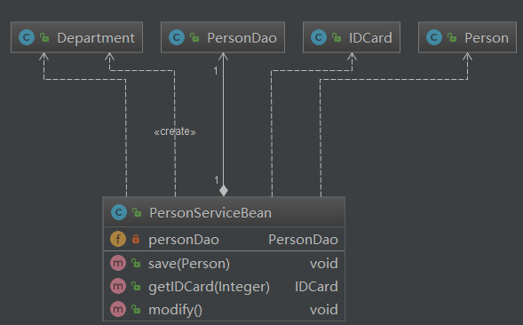
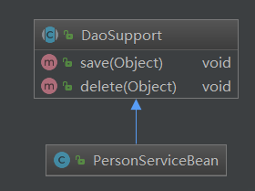

# UML基本介绍

​		1) UML——Unified modeling language UML (统一建模语言)，是一种用于软件系统 分析和设计的语言工具，它用于帮助软件开发人员进行思考和记录思路的结果 

​		2) UML本身是一套符号的规定，就像数学符号和化学符号一样，这些符号用于描述软件模型中的各个元素和他们之间的关系，比如类、接口、实现、泛化、依赖、组合、聚合等:

​		 3) 使用UML来建模，常用的工具有 Rational Rose , 也可以使用一些插件来建模


# UML图

​			画UML图与写文章差不多，都是把自己的思想描述给别人看，关键在于思路和条理， 

​			UML图分类： 

​					1) 用例图(use case) 

​					2) 静态结构图：**类图**、对象图、包图、组件图、部署图 

​					3) 动态行为图：交互图（时序图与协作图）、状态图、活动图 

​			说明： 

​					1) 类图是描述类与类之间的关系的，是UML图中最核心的 

​					2) 在讲解设计模式时，我们必然会使用类图

# UML类图 

​				1) 用于描述系统中的类(对象)本身的组成和类(对象)之间的各种静态关系。

​				2) 类之间的关系：**==依赖、泛化（继承）、实现、关联、聚合与组合==** 

​				3) 类图简单举例

```java
public class Person{ //代码形式->类图
	private Integer id;
	private String name;
	public void setName(String name){
		this.name=name;
	}
	public String getName(){
		return  name;
	}
}
```


# 类图—依赖关系（Dependence）

​				只要是在类中用到了对方，那么他们之间就存在依赖关系。如果没有对方，连编绎都通过不了。

```java
public class PersonServiceBean {

    // 类的成员属性 
    private PersonDao personDao;// 类  // 也是聚合的一种

    // 方法接收的参数类型 
    public void save(Person person) {
    }

    // 方法的返回类型 
    public IDCard getIDCard(Integer personid) {
        return null;
    }

    // 违反了迪米特法则,Department 类在局部变量中出现,非直接朋友
    public void modify() {
        // 方法中使用到
        // new 实例化 Department 对象,不可分开,也是组合关系
        Department department = new Department();
    }

}
```

## 类图

​					本类  -->  用到的类



## 小结 

​					**类中用到了对方** 

​					1) 类的成员属性 

​					2) 方法的返回类型 

​					3) 方法接收的参数类型 

​					4) 方法中使用到


# 类图—泛化关系(generalization） 

​				泛化关系实际上就是**继承**关系，他是<u>*依赖关系的特例*</u>

```java
// 父类
public abstract class DaoSupport{
	public void save(Object entity){
	}
	public void delete(Object id){
	}
}

// 子类
public class PersonServiceBean extends DaoSupport {

}
```

## 类图

​					子类   -->    父类



## 小结:

​					1) 泛化关系实际上就是**继承**关系 

​					2) 如果A类继承了B类，我们就说A和B存在泛化关系


# 类图—实现关系（Implementation） 

​			实现关系实际上就是A类实现B接口，他是*<u>依赖关系的特例</u>*

```java
// 接口
public interface PersonService {
	public void delete(Integer id);
}

// 实现类
public class PersonServiceBean implements PersonService{
	@Override
	public void delete(Integer id) {
		// TODO Auto-generated method stub
		System.out.println("delete..");
	}
}
```

## 类图

​					实现类  -->  接口


## 小结:

​					1) 实现关系实际上就是**实现**关系 

​					2) 如果A类实现了B类，我们就说A和B存在实现关系


# 类图—关联关系（Association） 

​			关联关系实际上就是类与类之间的联系，他是<u>*依赖关系的特例*</u> 

​			关联具有导航性：即双向关系或单向关系 

​			关系具有多重性：如“1”（表示有且仅有一个），“0...”（表示0个或者多个）， “0，1”（表示0个或者一个），“n...m”(表示n到 m个都可以),“m...*”（表示至少m 个）。 

#### 单向一对一关系

```java
// 这段代码,单向聚合
public class Person {
    private IDCard card;
}
public class IDCard{}
```


                                                

#### 双向一对一关系 

```java
// 这段代码,双向聚合
public class Person {
    private IDCard card;
}
public class IDCard{
    private Person person
}
```

                                      


# 类图—聚合关系（Aggregation） 

​			聚合关系（Aggregation）表示的是整体和部分的关系，整体与部分**<u>可以分开</u>**。(不可以分开是  组合关系)

​			聚合关系是<u>*关联关系的特例*</u>，所以他具有关联的导航性与多重性。 

​			如：一台电脑由键盘(keyboard)、显示器(monitor)，鼠标等组成；组成电脑的各个 配件是可以从电脑上分离出来的，使用带空心菱形的实线来表示：

```java
public class Computer {
    private Mouse mouse; //鼠标可以和computer分离
    private Moniter moniter;//显示器可以和Computer分离
    public void setMouse(Mouse mouse) {
        this.mouse = mouse;
    }
    public void setMoniter(Moniter moniter) {
        this.moniter = moniter;
    }
}
```

## 类图

​					箭头指向被引用对象类,菱形指向引用类


# 类图—组合关系（Composition） 

​			组合关系：也是整体与部分的关系，但是整体与部分**不可以分开。** 

​			再看一个案例：在程序中我们定义实体：Person与IDCard、Head, 那么 Head 和 Person 就是组合，IDCard 和 Person 就是聚合。 但是如果在程序中Person实体中定义了对IDCard进行级联删除，即删除Person时 连同IDCard一起删除，那么IDCard 和 Person 就是组合了.

```java
public class Person {
    private IDCard card; //聚合关系
    private Head head = new Head(); //组合关系
    
    // 虚线,方法参数,依赖关系
    public void setCard(IDCard card) {
        this.card = card;
    }
    // 虚线,方法参数,依赖关系
    public void setHead(Head head) {
        this.head = head;
    }
}
```


# 总结

## 依赖关系

##### 虚线箭头

##### 成员属性（聚合和组合） 、方法参数、返回类型、方法中使用到

##### 本类  -->  用到的类

## 泛化关系

##### 实线箭头

##### 继承关系

##### 子类   -->    父类

###### 依赖关系的特例

## 实现关系

##### 虚线三角箭头

##### 实现关系

##### 实现类  -->  接口

###### 依赖关系的特例

## 关联关系

##### 双向关系或单向关系

##### 具体看  聚合关系  和  组合关系

###### 依赖关系的特例

## 聚合关系

##### 实线、头：箭头、尾：菱形

##### 可分割、对象成员变量（一种情况、非new对象）

##### 箭头指向被引用对象类,菱形指向引用类

###### 关联关系的特例

## 组合关系

##### 虚线箭头（含有create字样）

##### 不可分割、new对象(一种情况)

##### 本类  -->  new对象类

###### 关联关系的特例


设计模式分为三种类型，共23种 

1) 创建型模式(站在对象创建的角度)：单例模式(只有一个对象)、抽象工厂模式、原型模式(克隆,深拷贝,浅拷贝)、建造者模式、工厂模式。

2) 结构型模式(软件结构有更好的伸缩性,扩展性)：适配器模式、桥接模式、装饰模式(解决类爆炸)、组合模式、外观模式、享 元模式、代理模式。 

3) 行为型模式(站在方法的角度)：模版方法模式、命令模式、访问者模式、迭代器模式、观察者 模式、中介者模式、备忘录模式、解释器模式（Interpreter模式）、状态模 式、策略模式、职责链模式(责任链模式)。