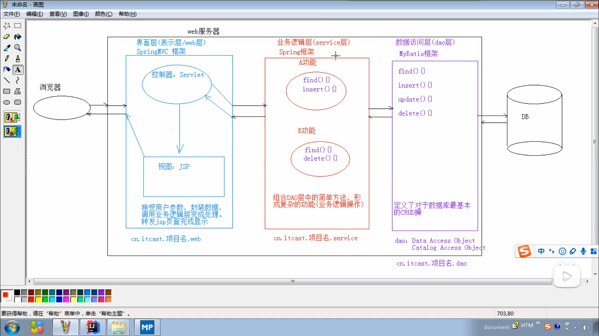
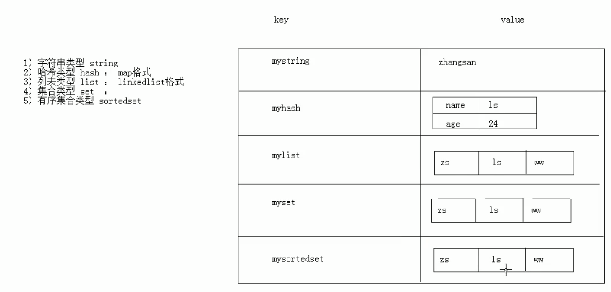
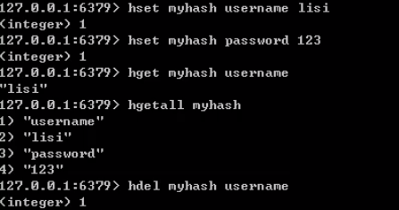
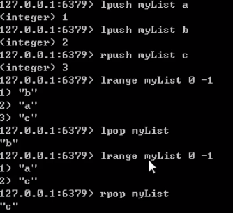
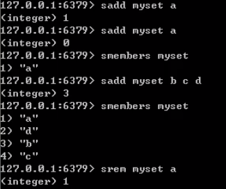
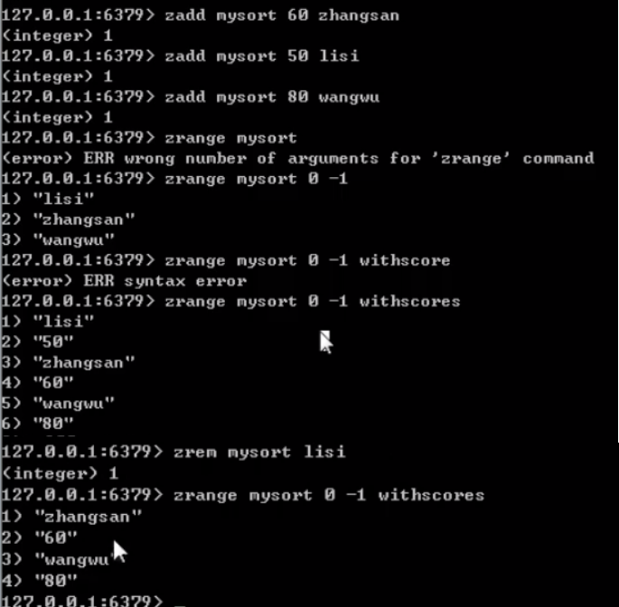
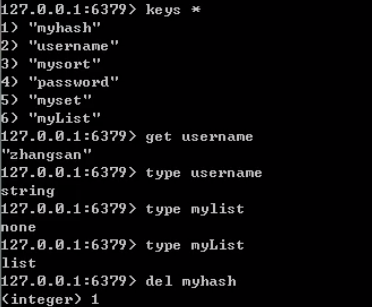

# jQuery

## 概念

​						一个JavaScript框架,简化JS开发
​								JavaScript框架:本质上是一些js文件,封装了js的原生代码而已

## 步骤

​						1.下载jQuery相关js包

​								1.jquery-xxx.js:开发版本,给程序员看的,有良好的缩进和注释.体积大一些

​								2.jquery-xxx.min.js:生产版本,程序中使用,没有缩进,体积小一些,程序加载更快

​						2.JQuery的js文件,导入min.js文件
​						3.使用		

```js
var div1 = $("#div1");		// id选择器
alert(div1.html());
```


## JQuery对象和JS对象区别与转换

​					1.JQuery对象在操作时,更加方便
​					2.JQuery对象和js对象方法不通用的
​					3.两者相互转换
​							jq  -->  js
​									jq对象[索引] 
​											$divs[0].js方法
​									jq对象.get(索引)
​											$divs.get(1).js方法
​							js  -->  jq
​								$(js对象)
​										$(div).jq方法

## 入口函数

​					js

```js
window.onload = function () {
    
}
```

​		JQuery:dom文档加载完成之后执行该函数中的代码

```js
$(function () {
    
})
```


​					区别
​						window.onload只能定义一次,如果定义多次,后边的会将前边的覆盖掉
​						$(function)可以定义多次

## 选择器

​		1.分类

### 1.基本选择器

#### 1.标签选择器(元素选择器)

​									$("html标签名")
​											获得所有匹配标签名称的元素

#### 2.id选择器

​									$("#id的属性值")
​											获得与指定id属性值匹配的元素

#### 3.类选择器

​									$(".class的属性值")
​											获得与指定的class属性值匹配的元素

#### 4.交集选择器

​									$("选择器1,选择器2...")
​										获取多个选择器选中的所有元素

```js
  /*<!--基本选择器-->*/
// <input type="button" value="改变 id 为 one的元素的背景色为 红色" id="b1"/>
$(function () {
    $("#b1").click(function () {
        $("#one").css("backgroundColor", "pink")
    })
})
// <input type="button" value="改变元素名<div> 的所有元素的背景色 红色" id="b2"/>
$(function () {
    $("#b2").click(function () {
        $("div").css("backgroundColor", "yellow")
    })
})

// <input type="button" value="改变class 为 mini 的所有元素的背景色 红色" id="b3"/>
$(function () {
    $("#b3").click(function () {
        $(".mini").css("backgroundColor", "blue")
    })
})

// <input type="button" value="改变所有的<span>元素和id为two 的所有元素的背景色 红色" id="b4"/>
$(function () {
    $("#b4").click(function () {
        $("span,#two").css("backgroundColor", "#ff4a91")
    })
})
```


### 2.层级选择器

#### 1.后代选择器

​										$("A B ")
​											选择A元素内部的所有B元素

#### 2.子代选择器

​										$("A > B ")
​											选择A元素内部的所有B子元素(不包括下一级中的B)

```js
 /* <!--后代选择器-->*/
// <input type="button" value="改变<body>内所有的<div>的背景色" id="b5"/>
$(function () {
    $("#b5").click(function () {
        $("body div").css("backgroundColor", "#004a91")
    })
})

// <input type="button" value="改变<body>内子<div>的背景色" id="b6"/>
$(function () {
    $("#b6").click(function () {
        $("body > div").css("backgroundColor", "#4aff91")
    })
})
```

### 3.属性选择器

​				A为标签名

#### 1.属性名称选择器

​										$("A[属性名]")
​											包含指定属性的选择器

#### 2.属性选择器

​										$("A[属性名 = '值' ]")
​											包含指定属性等于指定值的选择器

#### 3.复合属性选择器

​										$("A[属性名='值'][]...")
​											包含多个属性条件的选择器

#### 4.以"xx"开头

​										$("A[属性名 ^= '值' ]")

#### 5.以"xx"结尾

​										$("A[属性名 $= '值' ]")

#### 6.以"xx"含有

​										$("A[属性名 *= '值' ]")

```js
 /*<!--属性选择器-->*/
// <input type="button" value="改变含有属性title的div元素背景色" id="b7"/>
$(function () {
    $("#b7").click(function () {
        $("div[title]").css("backgroundColor", "#ffff91")
    })
})
// <input type="button" value="改变属性title的值等于test的div元素背景色" id="b8"/>
$(function () {
    $("#b8").click(function () {
        $("div[title='test']").css("backgroundColor", "#4affff")
    })
})
// <input type="button" value="改变属性title的值不等于test的div元素背景色(没有title也改变)" id="b9"/>
$(function () {
    $("#b9").click(function () {
        $("div[title!='test']").css("backgroundColor", "#4af55f")
    })
})
// <input type="button" value="改变属性title的值 以te开始的div元素背景色" id="b10"/>
$(function () {
    $("#b10").click(function () {
        $("div[title^='te']").css("backgroundColor", "#fa5fff")
    })
})
// <input type="button" value="改变属性title的值 以est结尾的div元素背景色" id="b11"/>
$(function () {
    $("#b11").click(function () {
        $("div[title$='est']").css("backgroundColor", "#fa5f0f")
    })
})
// <input type="button" value="改变属性title的值 含有es的div元素背景色" id="b12"/>
$(function () {
    $("#b12").click(function () {
        $("div[title*='es']").css("backgroundColor", "#5a5f2f")
    })
})
// <input type="button" value="改变含有属性id的div元素,在结果中选取属性title的值 含有es的div元素背景色" id="b13"/>
$(function () {
    $("#b13").click(function () {
        $("div[id][title*='es']").css("backgroundColor", "pink")
    })
})
```

### 4.过滤选择器

#### 1.首元素选择器

​										:first
​											获得选择的元素中的第一个元素

#### 2.尾元素选择器

​										:last
​											获得选择的元素中的最后一个元素

#### 3.非元素选择器

​										:not(selector)
​											不包括指定内容的元素

#### 4.偶数选择器

​										even 偶数
​											从0开始计数

#### 5.奇数选择器

​										odd 奇数
​											从0开始计数

#### 6.等于索引选择器

​										eq(index)
​											指定索引元素

#### 7.大与索引选择器

​										gt(index)
​											大于指定索引元素

#### 8.小与索引选择器

​										lt(index)
​											小于指定索引元素

#### 9.标题选择器

​										header
​											获得标题元素,固定写法

#### 可以链式使用

​										$("属性名:选择器1:选择器2")
​										$("div:gt(1):odd")

```js
  /*过滤选择器*/
// <input type="button" value="改变第一个div元素" id="b1"/>
$(function () {
    $("#b1").click(function () {
        $("div:first").css("backgroundColor", "pink")
    })
})

// <input type="button" value="改变最后一个div元素" id="b2"/>
$(function () {
    $("#b2").click(function () {
        $("div:last").css("backgroundColor", "yellow")
    })
})

// <input type="button" value="改变class不为one的所有div元素" id="b3"/>
$(function () {
    $("#b3").click(function () {
        $("div:not(.one)").css("backgroundColor", "blue")
    })
})

// <input type="button" value="改变索引值为偶数的div元素" id="b4"/>
$(function () {
    $("#b4").click(function () {
        $("div:even").css("backgroundColor", "#ff4a91")
    })
})

// <input type="button" value="改变索引值为奇数的div元素" id="b5"/>
$(function () {
    $("#b5").click(function () {
        $("div:odd").css("backgroundColor", "#004a91")
    })
})

// <input type="button" value="改变索引值大于5的div元素" id="b6"/>
$(function () {
    $("#b6").click(function () {
        $("div:gt(5)").css("backgroundColor", "#4aff91")
    })
})
// <input type="button" value="改变索引值等于5的div元素" id="b7"/>
$(function () {
    $("#b7").click(function () {
        $("div:eq(5)").css("backgroundColor", "#ffff91")
    })
})
// <input type="button" value="改变索引值小于5的div元素" id="b8"/>
$(function () {
    $("#b8").click(function () {
        $("div:lt(5)").css("backgroundColor", "#4affff")
    })
})
// <input type="button" value="改变所有标题元素" id="b9"/>
$(function () {
    $("#b9").click(function () {
        $(":header").css("backgroundColor", "#4af55f")
    })
})
```

### 5.表单过滤选择器

#### 1.可用元素选择器

​										?enabled
​											获得可用元素

#### 2.不可用元素选择器

​										:disabled
​											获得不可用

#### 3.选中选择器

​										:checked
​											获得单选/复选框选中的元素

#### 4.选中选择器

​										:selected
​											获得下拉框选中的元素

```js
 /*表单过滤选择器*/
// <input type="button" value="利用 jQuery 对象的  val() 方法改变表单内可用<input>元素的值" id="b10"/>
$(function () {
    $("#b10").click(function () {
        $("input[type='text']:enabled").val("aaaa");
    })
})
// <input type="button" value="利用 jQuery 对象的  val() 方法改变表单内不可用<input>元素的值" id="b11"/>
$(function () {
    $("#b11").click(function () {
        $("input[type='text']:disabled").val("bbbb");
    })
})
// <input type="button" value="利用 jQuery 对象的  length  属性获取复选框选中的个数" id="b12"/>
$(function () {
    $("#b12").click(function () {
        alert($("input[type='checkbox']:checked").length);
    })
})
// <input type="button" value="利用 jQuery 对象的  length  属性获取下拉框中的个数" id="b13"/>
$(function () {
    $("#b13").click(function () {
        alert($("select > option:selected").length);
    })
})
```

## DOM

### 1.内容操作

#### 1.html()

​									获取/设置元素的标签体内容
​										var 对象名 = $().html()		获取
​										$().html("")							设置,可以写html语句

#### 2.text()

​									获取/设置的标签体纯文本内容
​										var 对象名 = $().text()  		获取
​										$().html("")							设置,

#### 3.val()

​									获取/设置元素的value属性值
​										var 对象名 = $().val()  		  获取
​										$().val("")								设置

### 2.属性操作

#### 1.通用属性操作

##### 1.attr()

​										获取/设置元素的属性

##### 2removeAttr()

​										删除属性

##### 3,prop()

​										获取/设置元素的属性

##### 4.removeProp()

​										删除属性
​												一个参数是获取,有返回值
​												两个参数,第一个参数是元素名,第二个是元素值
​										区别
​												1.如果操作的是元素的固有属性,则建议使用prop
​												2.如果操作的是元素自定义的属性,则建议使用attr

```js
//获取北京节点的name属性值
var name = $("#bj").attr("name");
//alert (name);
//设置北京节点的name属性的值为dabeijing
$("#bj").attr(" name","dabeijing");
//新增北京节点的discription属性属性值是didu
$("#bj").attr("discription","didu");
//删除北京节点的name属性并检验name属性是否存在
$("#bj").removeAttr ("name");
//获得hobby的的选中状态,使用attr获取不到
var checked = $("#hobby").prop("checked");
//alert(checked);

```


#### 2.对class属性操作

##### 1.addClass()

​										添加class属性值

##### 2.removeClass()

​										删除class属性值

##### 3.toggleClass()

​										切换属性
​												判断如果元素对象上存在class="XXX",则将属性值删除掉,如果元素对象上不存在class="XXX",则添加

```js
//<input type="button" value= "采用属性增加样式(改变id=one的样式)”id="b1"/>
$("#b1").click(function() {
    $("#one").prop("class","second");
});
//<input type= "button" value=" addClass" id="b2"/>
$("#b2").click(function() {
    $("#one").addClass("second");
});
//<input type= "button" value="removeClass" id="b3"/>
$("#b3).click(function () {
  $("#one").removeClass("second");
});
//<input type="button" value=" 切换样式”id="b4"/>
$("#b4).click(function () {
  $("#one").toggleClass("second");
});
```


### 3.CRUD操作

#### 1.append()

​									**父元素**将**子元素**追加到**末尾**
​									对象1.append(对象2)
​											将<u>对象2</u>添加到对象1元素内部,并且在末尾

#### 2.prepend()

​									**父元素**将**子元素**追加到**开头**
​									对象1.prepend(对象2)
​											将<u>对象2</u>添加到对象1元素内部,并且在开头

#### 3.appendTo()

​									对象1.append(对象2)
​											将<u>对象1</u>添加到对象2元素内部,并且在末尾

#### 4.prependTo()

​									对象1.prepend(对象2)
​										将<u>对象1</u>添加到对象2元素内部,并且在开头

#### 5.after()

​								添加元素到元素<u>后面</u>
​								对象1.after(对象2)
​										将<u>对象2</u>添加到对象1后边.对象1和对象2是<u>兄弟关系.同级</u>

#### 6.before()

​								添加元素到元素<u>前面</u>
​								对象1.before(对象2)
​									将<u>对象2</u>添加到对象1前边.对象1和对象2是<u>兄弟关系.同级</u>

#### 7.insertAfter()

​								对象1.insertAfter(对象2)
​									将<u>对象1</u>添加到对象2后边.对象1和对象2是兄弟关系.同级

#### 8.insertBefore()

​								对象1.insertBefore(对象2)
​										将对象1添加到对象2前边.对象1和对象2是兄弟关系.同级
​										 $("#类名1").append ($("#类名2"))

#### 9.remove()

​								移除元素
​								对象.remove()
​									将对象删除掉

#### 10.empty()

​								清空元素的所有后代元素
​								对象.empty()
​									将对象的后代元素全部清空,但是保留当前对象以及其属性节点

#### $("#类名1").remove()

```html
<script type="text/javascript">
    $(function () {
        // <input type= "button" value= "将反恐放置到city的后面" id="b1"/>
        $("#b1").click(function () {
            // append
            $("#city").append($("#fk"));
            // appendTo
            $("#fk").appendTo($("#city"));
        });

        // <input type= "button" value="将反恐放置到city的最前面" id="b2"/>
         $("#b2").click(function () {
            // prepend
            $("#city").prepend($("#fk"));
            // prependTo
            $("#fk").prependTo($("#city"));
        });
        // <input type="button" value="将反恐插入到天津后面" id="b3"/>
         $("#b3").click(function () {
            // after
            $("#tj").after($("#fk"));
            //  insertAfter
            $("#fk").insertAfter($("#tj"));
        });
        // <input type="button" value="将反恐插入到天津前面" id="b4"/>
           $("#b4").click(function () {
            // before
            $("#tj").before($("#fk"));
            // insertBefore
            $("#fk").insertBefore($("#tj"));
        });
    });
</script>


<body>
    <input type="button" value="将反恐放置到city的后面" id="b1"/>
    <input type="button" value= "将反恐放置到city的最前面" id="b2"/>
    <input type="button" value="将反恐插入到天津后面" id="b3"/>
    <input type="button" value="将反恐插入到天津前面" id="b4"/>

    <ul id="city">
        <1i id="bj" name="beijing" >北京</1i>
        <li id="tj" name="tianjin">天津</li>
        <li id="cq" name="chongqing">重庆</li>
    </ul>

    <ul id="love">
        <li id="fk" name="fankong">反恐</li>
        <li id="xj" name="xingji">星际</li>
    </ul>
    <div id="foo1">Hello1</div>
</body>

```


## 动画

​		三种方式显示和隐藏元素

### 1.默认显示和隐藏

​								1.show([speed,[easing],[fn]])
​								2.hide([speed,[easing],[fn]])
​								3.toggle([speed,[easing],[fn]])

### 2.滑动显示和隐藏方式

​								1.slideDown([speed,[easing],[fn]])
​								2.slideUp([speed,[easing],[fn]])
​								3.slideToggle([speed,[easing],[fn]])

### 3.淡入淡出显示和隐藏方式

​								1.fadeIn([speed,[easing],[fn]])
​								2.fadeOut([speed,[easing],[fn]])
​								3.fadeToggle([speed,[easing],[fn]])
​									高版本不能正常使用

### 参数

#### 1.speed

​									动画的速度,三个预定义的值
("slow,"normal","fast")
或表示动画时长的毫秒值(1000)

#### 2.easing

​									用来指定切换效果,默认是"swing",可用参数"linear"
​										swing动画执行时效果是  先慢,中间快,最后又慢
​										linear动画执行时速度是迅速的

#### 3.fn

​									在动画完成时执行的函数,每个元素执行一次 

## 循环

### js

​							1.获取对象
​							2.for循环,循环条件为对象长度
​							3.遍历对象名[i]

### jQuery

#### 1.jq对象.each(callback)

​								callback(function ())
​									无法获取索引
​								callback(function (index,element))
​									index索引值,element每次遍历的值
​								if("XXX" == $(element).html())
​									如果当前返回false,则结束循环(break)
​									如果返回为true,则结束本次循环,继续下次循环(continue)
​						

```js
$(function () {
    $("#ul1 li").each(function (index, element) {
        if("xxx" == $(element.html)){
            return false; 	//如果当前返回false,则结束循环(break)
            return true;	//如果返回为true,则结束本次循环,继续下次循环(continue)
        }
        // alert(index + ":" + element.innerText)
        alert(index + ":" + $(element).html())
    })
})
```


#### 2.$.each(object,[callback])

​								object对象可以是js数组对象,也可以是jq对象

#### 3.for..of	jquery3.0之后的版本才能使用

​								for(自定义元素名  of  jq对象)
​									自定义元素名为js对象

```js
for (li of $("#ul1 li")){
    alert(li.innerText)
}
```


## 事件绑定

​		1.jQuery标准的绑定方式
​			jq对象.时间方法(回调函数)
​		2.on绑定事件/off解除绑定
​			jq对象.on("事件名称",回调函数)
​			jq对象.off("事件名称")
​		3.事件切换:toggle
​			jq对象.toggle(fn1,fn2...)

## 插件

​		增强JQuery的功能
​		1.实现方式
​			1.$.fn.extend(Object)
​								增强通过JQuery获取的对象的功能

```js
$.fn.extend({
    方法名:function(){
        方法体;
    }
})
```

​			2.$.extend(Object)
​								增强JQuery对象自身的功能

```js
$.extend({
    方法名:function(){
        方法体;
    }
})
```


# AJAX

## 概念

​					Asynchronous Javascript And XML/异步 JavaScript 和 XML

## 异步和同步

​			客户端和服务器端相互通信的基础上
​			客户端必须等待服务器的响应.在等待的期间客户端不能做其他操作
​			客户端不需要等待服务器端的响应.在服务器处理请求的过程中,客户端可以进行其他的操作
​		无需重新加载整个网页的情况下，能够更新部分网页的技术
​		通过在后台与服务器进行少量数据交换，Ajax 可以使网页实现异步更新。这意味着可以在不重新加载整个网页的情况下，对网页的某部分进行更新
​		传统的网页(不使用Ajax)如果需要更新内容,必须重载整个网页页面
​		提高用户体验

## JQuery

### 1.$.ajax()

​							语法$.ajax({键值对});

```js
$.ajax({
    // 请求路径
    url: "ajaxServlet",
    // 请求方式
    type : "POST",
    // 请求参数
    data : {
        "username" : "hiao",
        "age" : 38
    },
    // 响应成功后的回调函数
    success:function (data) {
        alert(data);
    },
    // 表示如果请求响应出现错误,会执行的回调函数
    error:function () {
        alert("出错了")
    },
    // 设置接收到的响应数据的格式
    dataType : "text"
});
```

### 2.$.get()

​			发送get请求
​			语法:$.get(url，[data]，[callback]，[type])
​								url					请求路径
​								data				 请求参数
​								callback		   回调函数
​								type				 响应结果的类型

```js
$.get("ajaxServlet",{username:hiao},function (data) {
    alert(data);
},"text");
```

### 3.$.post()

​			发送post请求
​			语法:$.post(url，[data]，[callback]，[type])
​								url					请求路径
​								data			 	请求参数
​								callback		   回调函数
​								type				 响应结果的类型

```js
$.post("ajaxServlet",{username:hiao},function (data) {
    alert(data);
},"text");
```


# JSON

## 	概念

​					JavaScript  Object  Notation		JavaScript对象表示法
​							json现在多用于存储和交换文本信息的语法
​							进行数据的传输
​					J		SON比XML 更小,更快,更易解析

## 	语法 

### 		1.基本规则

​							数据在名称/值对中:json数据是由键值对构成的
​									键用引号(单双都行)引起来,也可以不使用引号
​											值得取值类型
​													1.数字(整数或浮点数)
​													2.字符串(在双引号中)
​													3.逻辑值(true或false)
​													4.数组(在方括号中)
​														{"key":[{},{}]}
​													5.对象(在花括号中)
​														{"key":{"key":""....}}
​									数据由逗号分隔
​											多个键值对由逗号分隔
​									花括号保存对象
​											使用{}定义json格式
​									方括号保存数组
​											[]

### 		2.获取数据

​								1.json对象.键名
​										person.name
​								2.json对象["键名"]

​										person["name"]

​								3.对象名称.数组对象[索引].键名:	

​										var persons = { "psersons":[ {"name":张三,"age":23,"gender":true},{"name":李四,"age":24,"gender":true} ] }
​										persons.persons[1].name

​								4.数组名[索引].键名

​										var persons = [ {"name":张三,"age":23,"gender":true},{"name":李四,"age":24,"gender":true} ] 

​										person[1].name

### 		3.遍历

​								普通遍历

```js
for (var key in person) {
    alert(key);		//	键
    //因为key是一个字符串	不能person.key.因为相当于person."name"
    alert(key + ":" + person[key])
}

```

​			对象为数组：嵌套循环

```js
var persons = [ {"name":张三,"age":23,"gender":true},{"name":李四,"age":24,"gender":true} ] ;
for (var i = 0; i < person.length; i++) {
    var p = person[i];					// 获得每个对象
    for (var key in p) {				// 遍历每个对象,如普通遍历person,[i]
        alert(key + ":" + p[key)]		//person[i][key]
    }
}
```

​									

## JSON数据和Java对象的相互转换

​					JSON解析器
​						Jsonlib,Gson,fastjson,jackson

### 1.JSON转为Java对象

#### 1.使用步骤

##### 1.导入jackson的相关jar包

##### 2.创建Jackson核心对象   ObjectMapper

##### 3.调用ObjectMapper的相关方法进行转换

###### 1.转换方法

​												`readValue(json字符串数据,类型.class)`

```java
// 初始化JSON字符串,自动转义,也可以用单引号
String json = "{"name":"张三","age":23,"gender":"男","brithday":"2020-12-20 10:17:09"}";
// 2.创建ObjectMapper对象
ObjectMapper mapper = new ObjectMapper();
// 3.转换为Java对象,Person对象
Person person = mapper.readValue(json,Person.class);
System.out.println(person);
```

> Person{name='张三', age=23, gender='男'}

### 2.Java对象转换为JSON

#### 1.使用步骤

##### 1.导入jackson的相关jar包

##### 2.创建Jackson核心对象   ObjectMapper

##### 3.调用ObjectMapper的相关方法进行转换

###### 1.转换方法

​													`1.writeValue(参数1,obj)`
​															参数1
​																 File
​																	将obj对象转换为JSON字符串,并保存到指定的文件中
​																Writer
​																	将obj对象转换为JSON字符串,并将json数据填充到字符输出流中
​																OutputStream
​																	将obj对象转换为JSON字符串,并将json数据填充到字节输出流中

```java
// 1.创建Person对象
Person p = new Person();
p.setName("张三");
p.setAge(23);
p.setGender("男");

// 创建Jackson的核心对象
ObjectMapper mapper = new ObjectMapper();
String s = mapper.writeValueAsString(p);
System.out.println(s);      //{"name":"张三","age":23,"gender":"男"}

//将obj对象转换为JSON字符串,并保存到指定的文件中
mapper.writeValue(new File("d://a.txt"), p);

//将obj对象转换为JSON字符串,并将json数据填充到字符输出流中
mapper.writeValue(new FileWriter("d://b.txt"), p);

//	将obj对象转换为JSON字符串,并将json数据填充到字节输出流中
mapper.writeValue(new FileOutputStream("d://c.txt"), p);	
```

​													`2.writeValueAsString(obj)`
​															将对象转为json字符串

```java
// 1.创建Person对象
Person p = new Person();
p.setName("张三");
p.setAge(23);
p.setGender("男");
p.setBrithday(new Date());

// 创建Jackson的核心对象
ObjectMapper objectMapper = new ObjectMapper();
String s = objectMapper.writeValueAsString(p);
System.out.println(s);
```

###### 2.注解

​											1.@JsonIgnore
​													排除属性,该属性不会转换为json字符串

```java
@JsonIgnore
private Date brithday;
```

​											2.@JsonFormat(pattern = "")
​													属性格式化

```java
@JsonFormat(pattern = "yyyy-MM-dd HH:mm:ss")
private Date brithday;
```

​											3.复杂java对象转换
​													1.List
​															转换为json数组

```java
// 1.创建Person对象
Person p1 = new Person();
p1.setName("张三");
p1.setAge(23);
p1.setGender("男");
p1.setBrithday(new Date());

Person p2 = new Person();
p2.setName("张三");
p2.setAge(23);
p2.setGender("男");
p2.setBrithday(new Date());

Person p3 = new Person();
p3.setName("张三");
p3.setAge(23);
p3.setGender("男");
p3.setBrithday(new Date());

List<Person> list = new ArrayList<Person>();
list.add(p1);
list.add(p2);
list.add(p3);

// 创建Jackson的核心对象
ObjectMapper objectMapper = new ObjectMapper();
String s = objectMapper.writeValueAsString(list);
System.out.println(s);
```

> [{"name":"张三","age":23,"gender":"男","brithday":"2021-01-21 08:42:51"},
>
> {"name":"张三","age":23,"gender":"男","brithday":"2021-01-21 08:42:51"},
>
> {"name":"张三","age":23,"gender":"男","brithday":"2021-01-21 08:42:51"}]

​													2.Map
​															json数据和map对象格式一致

```java
// 1.创建map对象
Map<String, Object> map = new HashMap<String, Object>();
map.put("name", "张三");
map.put("age", 23);
map.put("gender", "男");

// 创建Jackson的核心对象
ObjectMapper objectMapper = new ObjectMapper();
String s = objectMapper.writeValueAsString(map);
System.out.println(s);
```

> {"gender":"男","name":"张三","age":23}

## 服务器响应的数据,在客户端使用时,药性当做json数据格式使用

​		1.$.get(type)
​			将最后一个参数type指定为"json"
​		2.在服务器端设置MIME类型
​			子主题 1,


# web概念概述

## 			JavaWeb

​			使用Java语言开发基于互联网的项目

## 		软件架构

### 			1.C/S

​				Client/Server(客户端/服务器端)
​				在用户本地有一个客户端程序,在远程有一个服务器端程序

#### 优点;

​					用户体验好

#### 缺点

​					1.开发,安装,部署,维护,   麻烦

### 			2.B/S

​				Browser/Server  浏览器/服务器端
​				只需要一个浏览器,用户通过不同的网址(URL),客户访问不同的服务器端程序

#### 				优点

​						1.开发,安装,部署,维护  简单

#### 				缺点

​						1.如果应用过大,用户的体验可能会受到影响
​						2.对硬件要求过高

## 		资源分类

#### 				静态资源

​						使用静态网页开发技术发布的资源

##### 						特点

​							所有用户访问,得到的结果是一样
​							如
​								文本
​								图片
​								音频
​								视频
​								HTML  		 用于搭建基础网页,展示页面的内容
​								CSS  			 用于美化页面,布局页面
​								JavaScript 	控制页面的元素,让页面有一些动态的效果
​				如果用户请求的是静态资源,那么服务器会直接将静态资源发送给浏览器,浏览器内置了静态资源的解析引擎,可以展示静态资源

#### 			动态资源

​					使用动态网页及时发布的资源

##### 					特点

​							所有用户访问,得到的结果可能不一样.	
​						如
​							jsp/servlet
​							PHP
​							asp
​						如果用户请求的是动态资源,那么服务器会执行动态资源,转换为静态资源,再发送给浏览器.(响应)

## 		网络通信三要素

### 				1.ip

​								电子设备(计算机)在网络中的唯一标识

### 				2.端口

​								应用程序在计算机中的唯一标识.0~65535

### 				3.传输协议

​								规定了数据传输的规则

#### 								1.基础协议

​									1.tcp:安全协议,三次握手,速度慢

​									2.udp:不安全协议.速度快

# web服务器软件

## 		服务器

​					安装了服务器软件的计算机

## 		服务器软件

​					接收用户的请求,处理请求,做出响应

## 		Web服务器软件

​					接收用户的请求,处理请求,做出响应
​					在web服务器软件中,可以部署web项目,让用户通过浏览器来访问这些项目
​					web容器

## 		常见的java相关的web服务器软件

### 			webLogic

​					Oracle公司,大型的JavaEE服务器,支持所有的JavaEE规范,收费的

### 			webSphere

​					IBM公司,大型的JavaEE服务器,支持所有的JavaEE规范,收费的

### 			JBOSS

​					JBOSS公司,大型的JavaEE服务器,支持所有的JavaEE规范,收费的

### 			Tomcat

​					Apache基金组织,中小型的JavaEE服务器,仅仅支持少量的JavaEE规范servlet/jsp.开源的,免费的

## 		JavaEE

​					Java语言在企业级开发中使用的技术规范的总和,一共规定了13项大的规范

> ### 				1.JDBC（Java data base connectivity）：
>
> ​    JDBC API是一个JavaAPI，可以访问任何类型表列数据，特别是存储在关系数据库中的数据库，JDBC代表Java数据库连接。 JDBC 库中所包含的API任务通常与数据库使用：连接到数据库、创建SQL或MySQL语句，在数据库中执行SQL或MySQL查询，查看和修改记录。有了它向各种关系数据发送sql语句会更容易，只用JDBC API写一个程序就可以。
>
> ​    JDBC对程序员来讲是API，对实现与数据库连接的服务提供商而言是接口模型。
>
> ​    做3件事：与数据库建立连接，发送操作数据库的语句并处理结果
>
> 
>
> ### 				2.JNDI（Java naming and directoryinterface Java命名和目录接口）：
>
> ​    包含大量的命名和目录服务，使用通用接口来访问不同种类的服务。它提供了一致的模型用来存取和操作企业级的资源如DNS和LDAP、本地文件系统、应用服务器中的对象。
>
> 
>
> ### 3.EJB（ Enterprise JavaBean）：
>
> ​    EJB是JavaEE的一部分，定义了一个用于开发基于组件的企业多重应用程序的标准。EJB提供了一个架构，充分考虑健壮性，高可扩展性和高性能的基于组件的企业应用横须开发和部署。
>
> ​    优点：简化 开发大型企业应用；开发者只专注于业务逻辑的应用程序；EJB容器管理EJB实例的生命周期。
>
> ​    三种类型：session bean会话bean，entity bean实体bean，message driven bean消息驱动bean。Bean扮演着应用程序素材的角色，打包标准
>
> 会话bean：
>
> ​    无状态会话bean——执行独立操作不具有任何关联的客户端状态 但它可能会保持其实例的状态、EJB容器通常创建一个容器池和无状态的bean对象，使用这些对象来处理客户端的请求。
>
> ​    有状态bean：企业bean保存客户端的会话状态类型。EJB容器创建一个单独的有状态会话bean来处理客户端的每个请求，请求范围过，有状态会话bean 被销毁。
>
> 实体bean：持久对象代表数据存储记录
>
> 消息驱动bean：
>
> ​    EJB容器调用，接收到一个消息队列或主题，消息驱动bean是一个无状态的bean用来做异步任务。
>
> 
>
> ### 4.RMI （Remote method invoke ）：
>
> ​    RMI调用远程对象上的方法，使用了序列化方式在客户端和服务端传递数据。它能使开发人员使用Java编程语言来构建分布式应用程序，RMI是被EJB使用的更为底层的协议，它使用Java编程接口来定义远程对象以及Java串行化技术和JRMP的组合，以将本地方法调用变为远程方法调用。
>
> 
>
> ### 5.XML（Extensible Markup Language）：
>
> ​    可扩展标记语言，标准通用标记语言的子集。Java提供了极好的技术支持和丰富的库来解析，修改或查询XML文档。
>
> 
>
> ### 6.JavaMail：
>
> ​    提供了一组抽象类定义构成一个邮件系统的对象，这些抽象类和接口支持消息存储、格式和传输的许多不同的实现，它是阅读，撰写和发送电子信息的可选包。
>
> 
>
> ### 7.JavaServlet：
>
> ​     Servlet是小服务程序的意思，JavaServlet就是一种小型的Java程序，一个servlet就是Java编程语言中的一个类。servlet和用户的通信采用请求/响应模式，用于动态响应客户机请求形式扩展了web服务器的功能，servlet全部由Java写成并且生成html。servlet和jsp结合使用，能提供更为强大的服务器功能。
>
> 
>
> ### 8.JavaIDL（接口定义语言）/CORBA：（Common Object Request Breaker Architecture公共对象请求代理结构）
>
> ​    JavaIDL是Java2开发平台中的CORBA功能扩展。它使分布式、支持web的Java应用可以基于IIOP协议透明地调用远程服务，运行期组件包括一个全兼容的对象请求代理——Java ORB，用于基于IIOP协议实现分布式对象之间的通信。通过它你可以实现新的应用和旧系统集成。
>
> 
>
> ### 9.JAF（JavaBeans Activation FrameWork数据处理框架）：
>
> ​    将对MIME数据的支持集成到了Java平台中，我们可以指定JavaBeans组件操作MIME数据，例如查看或编辑数据。JAF也提供了一种将文件扩展名映射到MIME类型的机制。 JavamailAPI可以利用JAF来处理email消息中的数据。
>
> 
>
> ### 10.JMS（ Java Message Service）：
>
> ​    JMS是Java消息服务应用程序接口，是一个Java平台中关于面向消息中间件的API，用于在两个应用程序之间，或分布式系统中发布消息，进行异步通信。
>
> ​    JMS消息包含一些良好定义的、描述特定的商务行为的信息。通过信息的交换，应用程序能够跟踪企业的进程。JMS支持点到点方式和发布-订阅方式的消息。
>
> 
>
> ### 11.JSP（Java Service Pages）：
>
> ​    JSP是一种服务器端的编程技术，创建动态的，与平台无关构建基于Web的应用程序，是为了提供一种声明性的、以表示为中心的开发Servlet方法而设计的。它也是可移植的独立于平台或应用程序的方法来提供动态内容的有效方式，提供了方法来为web客户生成动态内容。提供了开发基于Servlet的动态内容的简单方法，并带有分离内容和显示逻辑的优点。
>
> ​    --->Servlet：是一段能扩展web服务器功能的程序。Servlet从客户接收请求，动态产生响应，发送一个包含html或XML文档的响应给客户。
>
> 
>
> ### 12.JTA（ Java Transaction API）：
>
> ​    JTA为J2EE平台提供了分布式事务服务，允许应用程序执行分布式事务处理——在两个或多个网络计算机资源上访问并更新数据。JTA事务比JDBC的事务更强大。JTA事务能够跨越多个组件和资源管理器，企业bean为JTA事务提供一种由容器自动调用事务的机制。
>
> 
>
> ### 13.JTS（Java Transaction Service Java事务服务组件）：
>
> ​    是 JTA的同胞兄弟哦，它是一个事务监视器组件，是CORBA OTS事务监控的基本实现，它规定了事务管理器的实现方式。

# Tomcat

​		web服务器软件

### 		1.下载

​					https://tomcat.apache.org/

### 		2.安装

​					解压压缩包即可
​					安装目录建议不要有中文和空格

#### 			目录介绍

​									bin					 可执行文件
​									conf					配置文件
​									lib					  依赖jar包
​									logs				  日志文件
​									temp				临时文件
​									webapps		 存放web项目
​									work			     存放运行时的数据

### 		3.卸载

​									删除目录就行了

### 		4.启动

​					bin/startup.bat
​						双击运行该文件即可
​					访问
​						浏览器输入
​							http://localhost:8080
​							http://127.0.0.1:8080
​								访问自己
​							http://别人的ip:8080/

#### 			可能遇到的问题

##### 				1.黑窗一闪而过

​									原因
​										没有正确配置JAVA_HOME环境变量
​									解决方案
​										正确配置JAVA_HOME环境变量

##### 				2.启动报错

​									1.暴力
​										找到占用的端口号,并且找到对应的进程,杀死该进程
​										在cmd中输入netstat -ano查看Tomcat的PID

​										打开任务管理器->详细信息/进程(不同系统不一样)->查看->选择列->pid->结束进程

​									2.温柔
​										修改自身的端口号,port

​										conf/server.xml

​										 `<Connector port="8080" protocol="HTTP/1.1"
​           			    connectionTimeout="20000"
​             			  redirectPort="8443" />`
​									一般会将Tomcat的默认端口号修改为80,80端口号是http协议的默认端口号
​										好处:在访问时,不用输入端口号

### 		5.关闭

​						1.正常关闭
​							bin/shutdown.bat
​							Ctrl +  c
​						2.强制关闭
​							点击启动窗口的 ×

### 		6.配置

​							部署项目的方式

##### 			1.直接将项目放到webapps目录下即可

​								localhost:8080/hello/hello.html中的hello:项目的访问路径  ==>  虚拟目录

​								**简化部署**:将项目打包成一个**war**包,再将war包放置到webapps目录下
​										war包会自动解压缩
​			

##### 			2.配置conf/server.xml文件

​				在**<Host>**标签体中配置,加上下列代码
​					`<Context  docBase="文件路径"  path="虚拟目录" />`

​					localhost:8080/虚拟目录/文件名

​					这样部署,有可能把server.xml配置文件搞坏

##### 			3.在conf\Catalina\localhost创建任意名称的xml文件

​				在文件中编写
​					`<Context  docBase="文件路径"  />`
​					虚拟目录就是xml文件名	localhost:8080/xml名/文件名

##### 			java动态项目的目录结构

​					项目的根目录
​						WEB-INF目录
​							web.xml
​								web项目的核心配置文件
​							classes目录
​								放置字节码文件的目录
​							lib目录
​								放置依赖的jar包

## 			将Tomcat集成到IDEA中,并且创建JavaEE的项目,部署项目

​				配置Tomcat环境
​					Run  -->  Edit Configurations...   -->  Defaults  -->  Tomcat Server  -->  Local  --> Configure选择Tomcat安装路径
​				创建JavaEE项目
​					File  -->  New  -->  Module  -->  Java  Enterprise -->  选择SDK,Java EE version,Application  Server  -->  Additional  Libraries ....  -->勾选Web Application
​				热部署
​					Run  -->  Edit Configurations...   --> Tomcat Server --> Tomcat 版本  -->  On 'Update' action  和  On frame deactivation  设置成   【Update  resources】

# Servlet

## 		概念:

​				Servlet:server applet
​					运行在服务器端的小程序
​					Servlet就是一个接口,定义了Java类被浏览器访问到(tomcat识别)的规则
​					将来我们自定义一个类,实现Servlet接口,复写方法

## 		快速入门

​			1.创建JavaEE项目
​			2.定义一个类,实现Servlet接口
​			3.实现接口中的抽象方法
​			4.配置Servlet

### 			servlet配置文件

```java
<?xml version="1.0" encoding="UTF-8"?>
<web-app xmlns="http://xmlns.jcp.org/xml/ns/javaee"
         xmlns:xsi="http://www.w3.org/2001/XMLSchema-instance"
         xsi:schemaLocation="http://xmlns.jcp.org/xml/ns/javaee http://xmlns.jcp.org/xml/ns/javaee/web-app_4_0.xsd"
         version="4.0">

	<servlet>
        <!--给类名起个名字-->
        <servlet-name>demo1</servlet-name>
        <!--加载类名-->
        <servlet-class>cn.itcast.web.servlet.ServletDemo1</servlet-class>
    </servlet>
    <!--映射-->
    <servlet-mapping>
        <!--上一步的servlet-name-->
        <servlet-name>demo1</servlet-name>
        <!--访问网址-->
        <url-pattern>/demo1</url-pattern>
    </servlet-mapping>
      
</web-app>
```


## 		执行原理

​				1.当服务器接收到客户端浏览器的请求后,会解析请求URL路径,获取访问的Servlet的资源路径
​				2.查找web.xml文件,是否有对应的<url-pattern>标签体内容
​				3.如果有,则在找到对应的<servlet-class>全类名
​				4.tomcat会将字节码文件加载进内存,并且创建其对象
​				5.调用其方法

## 		Servlet中的生命周期

### 			1.被创建

​					执行init方法,只执行一次
​						初始化方法
​						在Servlet被创建时,执行.只会执行一次

##### 					Servlet什么时候被创建?

​						默认情况下,第一次被访问时,Servlet被创建
​						可以配置执行Servlet的创建时机
​						在<servlet>标签下配置
​							1.第一次被访问时,创建
​								<load-on-stratup>的值为负数(默认)
​							2.在服务器启动时,创建
​								<load-on-stratup>的值为0或者正整数
​					只执行一次,说明Servlet在内存中只存在一个对象,Servlet是单例的
​						多个用户同时访问时,可能存在线程安全问题
​						解决:尽量不要在Servlet中定义成员变量.即使定义了成员变量,也不要对其修改值

### 			2.提供服务

​					执行service方法,执行多次
​						提供服务方法
​					每一次Servlet被访问时,执行.执行多次

### 			3.被销毁

​					执行destroy方法,只执行一次
​						销毁方法
​					在服务器正常关闭时,执行.执行一次

### 			周期方法

#### 					 1.初始化方法

​								`void init(ServletConfig var1)` 
​								在Servlet被创建时,执行.只会执行一次

#### 					2.获取ServletConfig对象

​								`ServletConfig getServletConfig();`

​								ServletConfig:Servlet的配置对象

#### 					3.提供服务方法

​								`void service(ServletRequest var1, ServletResponse var2)` 				
​								每一次Servlet被访问时,执行.执行多次

#### 					4.获取Servlet的一些信息,版本,作者等等

​								`String getServletInfo();`

#### 					5.销毁方法

​								`void destroy();`
​								在服务器正常关闭时,执行.执行一次

## 		Servlet3.0

### 			好处

​					支持注解配置,可以不需要web.xml

### 			步骤

​					1.创建JavaEE项目,选择Servlet的版本3.0以上,可以不创建web.xml
​					2.定义一个类,实现Servlet接口
​					3.复写方法
​					4.在类上使用@WebServlet("/资源路径")注解,进行配置

## 		IDEA与Tomcat的相关配置

​					1.IDEA会为每一个tomcat部署的项目独立建立一份配置文件
​							查看控制台的
​							**Using CATALINA_BASE:**   "C:\Users\皮皮\.IntelliJIdea2017.3\system\tomcat\_Javajdbc"
​					2.工作空间项目       和         tomcat部署的web项目
​							tomcat真正访问的是**tomcat部署的web项目**,**tomcat部署的web项目**对应着**工作空间项目**的web目录下的所有资源
​								工作空间项目
​									就是整个系统项目
​								tomcat部署的web项目
​									是工作空间中out\artifacts
​							WEB-INF目录下的资源不能被浏览器直接访问
​							断点调试:
​								使用"小虫子"启动  debug 启动

## 		Servlet的体系结构

​			1.Servlet	---------->	 接口
​			2.GenericServlet	----------> 	抽象类
​				将Servlet接口中其他的方法做了默认空实现,只将service()方式作为抽象方法
​				将来定义Servlet类时,可以继承GenericServlet,实现service()方法即可
​			3.HttpServlet	----------> 	抽象类
​				对HTTP协议的一种封装,简化操作
​				1.定义类继承HttpServlet
​				2.复写doGet/doPost方法

## 		Servlet相关配置

​					urlpartten:Servlet访问路径
​						1.一个Servlet可以定义多个访问路径
​							@WebServlet({"/d4","/dd4","/ddd4"})
​						2.路径定义规则

​							1./xxx

​							2./xxx/xxx
​								多层路径,目录结构

​							3.*.do
​								不带  /
​								.do为后缀名,可以任意后缀

# HTTP

## 	概念:

​			Hyper Text Transfer Protocol 超文本传输协议

### 		传输协议

​					定义了,客户端和服务器端通信时,发送数据的格式

### 		特点

​					1.基于TCP/IP的高级协议
​					2.默认端口号：80
​					3.基于请求/响应模型的：一次请求对应一次响应
​					4.无状态的：每次请求之间相互独立的,不能交互数据

### 		历史版本

​					1.0:
​						每一次请求响应都会建立新的连接
​					1.1:
  						复用连接

## 请求消息数据格式

​	客户端发送给服务器端的数据

### 	1.请求行

​		请求方式   请求url   请求协议/版本
​			GET  /login.html  HTTP/1.1

#### 		请求方式

​			HTTP协议有7种请求方式,常用的有2种

##### 				GET

​					1.请求参数在请求行中,在url后
​					2.请求的url长度有限制的
​					3.不太安全

##### 				POST

​					1.请求参数在请求体中
​					2.请求的url长度没有限制的
​					3.相对安全

### 	2.请求头

​		请求头名称  :  请求头值

#### 常见的请求头

##### 			User-Agent

​				浏览器告诉服务器,我访问你使用的浏览器版本信息
​				可以在服务器端获取该头的信息,解决浏览器的兼容性问题
​				User-Agent: Mozilla/5.0 (Windows NT 10.0; Win64; x64) AppleWebKit/537.36 (KHTML, like Gecko) **Chrome**/87.0.4280.88 Safari/537.36

##### 			Referer

​				告诉服务器,我(当前请求)从哪来?
​					作用
​						1.防盗链
​						2.统计工作
​				Referer: http://localhost/index.html

### 	3.请求空行

​							空行
​							就是用于分割POST请求的请求头,和请求体的

### 	4.请求体(正文)

​						封装POST请求信息的**请求参数**


### 请求消息数据

> GET / HTTP/1.1
> Host: www.baidu.com
> User-Agent: Mozilla/5.0 (Windows NT 10.0; Win64; x64; rv:83.0) Gecko/20100101 Firefox/83.0
> Accept: text/html,application/xhtml+xml,application/xml;q=0.9,image/webp,*/*;q=0.8
> Accept-Language: zh-CN,zh;q=0.8,zh-TW;q=0.7,zh-HK;q=0.5,en-US;q=0.3,en;q=0.2
> Accept-Encoding: gzip, deflate, br
> Referer: https://www.baidu.com/?tn=monline_3_dg
> Connection: keep-alive
> Cookie: BAIDUID=762D3A8AC4ED9EBE2D46670CBFA30AF2:FG=1; BIDUPSID=762D3A8AC4ED9EBEE6F8F63E8A03DE27; PSTM=1610415760; BDRCVFR[Fc9oatPmwxn]=mk3SLVN4HKm; BD_HOME=1; H_PS_PSSID=33425_33441_32973_33284_33286_33343_33335_33389_33370; BD_UPN=13314752; BA_HECTOR=2ha00h2l0h2l2004sa1fvpvkh0r; WWW_ST=1610415768315
> Upgrade-Insecure-Requests: 1


## Resquest

### 1.request对象和response对象的原理

​		1.request和response对象是由服务器创建的,我们来使用它们
​		2.request对象是来获取请求消息,response对象是来设置响应消息

### 2.request对象继承体系结构

​		ServletRequest                ----  接口
​				|    继承
​	HTTPServletRequest      	----  接口
​				|    实现
org.apache.catalina.connector.RequestFacade  类 (tomcat)

### 3.request功能

#### 1.获取请求信息数据

##### 1.获取请求行数据

###### GET  /day14/demo1?name=zhangsan   HTTP/1.1

###### 1.获取请求方式 :                   <u>GET</u>

​												`String  getMethod()`

###### (*)2.获取虚拟目录  :              <u>/day4</u>

​												`String getContextPath()`

###### 3.获取Servlet路径(设置的访问路径)     <u>/demo1</u>

​												`String  getServletPath()`

###### 4.获取get方式请求参数        <u>name=zhangsan</u>

​												`String  getQueryString()`

###### (*)5.获取请求      统一资源标识符     URI:    <u>/day14/demo1</u>

​												`String  getRequestURI()`

###### (*)6.获取请求     统一资源定位符      URL  :http://localhost/day14/demo1

​												`StringBuffer  getRequestURL()`

###### 7.获取协议及版本      	<u>HTTP/1.1</u>

​												`String getProtocol()`

###### 8.获取客户机的IP地址

​												`String  getRemoteAddr()`

##### 2.获取请求头数据

###### User-Agent: Mozilla/5.0 (Windows NT 10.0; Win64; x64) AppleWebKit/537.36 (KHTML, like Gecko) **Chrome**/87.0.4280.88 Safari/537.36

###### Referer: http://localhost/index.html

###### (*)1.通过请求头的名称获取请求头的值

​											`String getHeader(String  name)`	

###### 2.获取所有的请求头名称

​											`Enumeration<String>   getHeaderNames`

##### 3.获取请求体数据

​										请求体:**只有POST请求方式**,才有请求体,在请求体中封装了POST请求的请求参数

###### 步骤

​											1.获取流对象

​													获取字符输入流,只能操作字符数据

​														 `BufferedReader  getReader()`
​													获取字节输入流,可以操作所有类型数据,用于文件上传
​														`ServletInputStream getInputStream()`
​											2.再从流对象中拿数据

#### <u>2.其他功能</u>

##### 1.获取请求参数通用方式:

​										不论get还是post请求方式都可以使用下列方法来获取请求参数

###### 1.根据参数名称获取参数值         username=zhangsan&password=123

​											==String   getParameter(String name)==		--->name：username/password

```java
String username = request.getParameter("username");
System.out.println(username);
```

> zhangsan

###### 2.根据参数名称获取参数值的数组      hobby=sleep&&hobby=game

​											==String[]  getParameterValues(String name)==

```java
String[] hobbies = request.getParameterValues("hobby");
for (String hobby : hobbies) {
	System.out.println(hobby);
}
```

> sleep
>
> game

###### 3.获取所有请求的参数名称

​												如果一个属性有多个值,只返回一个

​												`Enumeration<String>  getParameterNames()`

```java
Enumeration<String> parameterNames = request.getParameterNames();
while (parameterNames.hasMoreElements()) {
    String name = parameterNames.nextElement();
    String value = request.getParameter(name);
    System.out.println(name + "=" + value);
}
```

> username=zhangsan
>
> password=123
>
> hobby=sleep

###### 4.获取所有参数的map集合

​											`Map<String, String[]>  getParameterMap()`

​												key 为属性名
​												value 为属性值

```java
Map<String, String[]> map = request.getParameterMap();
Set<String> keySet = map.keySet();
    for (String key : keySet) {
        String[] values = map.get(key);
        for (String value : values) {
            System.out.println(key + "=" + value);
        }
}
```

> username=zhangsan
>
> password=123
>
> hobby=sleep
>
> hobby=game

###### 5.中文乱码问题

​											get方式:tomcat  8  已经将get方式乱码问题解决了
​											post方式:会乱码
​													解决
​													在获取参数前,设置request的编码
​													==request.setCharacterEncoding("utf-8");==

##### 2.请求转发(forward)

​										一种在**服务器内部**的资源跳转方式

###### 1.步骤

​											1.通过request对象获取请求转发器对象:
​												`RequestDispatcher  getRequestDispatcher(String  path)`

​												path为目标路径,跳转到path

​											2.使用RequestDispatcher对象来进行转发

```java
forward(ServletRequest request, ServletResponse response);							
request.getRequestDispatcher("/day14/requestDemo9").forward(request,response);
```

###### 2.特点

​											1.浏览器地址栏路径不发生变化
​											2.只能转发到当前服务器内部资源中
​											3.转发是一次请求
​													用于request域,可以用request对象来共享数据
​													要和**重定向(redirect)**区别

##### 3.共享数据

###### 域对象

​											一个有作用范围的对象,可以在范围内共享数据

###### request域

​											代表   一次请求的范围    ,一直用于**请求转发**的多个资源中共享数据

###### 方法

​											**1.存储数据	 ------>	写在转发源文件中**
​													`void  setAttribute(String name , Object obj)`

```java
request.setAttribute("msg","hello");
request.getRequestDispatcher("/requestDemo9").forward(request,response);
```

​											**2.通过键获取值	 ------>	写在转发目标文件**
​													`Object  getAttribute(String name)`

```java
Object msg = request.getAttribute("msg");
System.out.println(msg);
```

​											**3.通过键移除键值对**
​													`void  removeAttribute(String name)`

## 登录案例

##### 1.创建项目,配置文件properties,jar包

##### 2.创建数据库环境

##### 3.创建包domain,创建类User

##### 4.创建dao,创建类UserDao,提供login方法

##### 5.创建utils,创建类JDBCUtils,提供JDBC连接

##### 6.编写LoginServlet类

##### 7.login.html中from表单的action路径的写法

​									虚拟目录+Servlet的资源路径
​										虚拟目录
​									项目的访问路径(自己设计的头)
​										资源路径
​									注解的参数

## BeanUtils工具类,简化数据封装

​							用于封装JavaBean的

#### 1.JavaBean:标准的java类

##### 1.要求

​									1.类必须被public修饰
​									2.必须提供空参的构造器
​									3.成员变量必须使用private修饰
​									4.提供公共setter和getter方法

##### 2.功能:

​									封装数据
​									对属性进行操作

#### 2.概念

​								成员变量
​									定义的private变量
​								属性
​									setter和getter方法截取后的产物
​										例如  getHehe()   --->   Hehe  --> hehe
​										一般情况,属性 = 成员变量,也有特殊情况

#### 3.方法

​									1.setProperty(Object  obj , String name , String value)
​											obj				对象名
​											name			属性名(不是成员变量名)
​											value			  赋值
​									2.getProperty(Object obj , String name)
​											obj				对象名
​											name			属性名(不是成员变量名)
​									3.**populate(Object obj,Map map)**
​									将map集合的键值对信息,封装到对应的JavaBean对象,用于将request.getParameterMap()的返回的map封装成对象
​											map
​												获取所有参数的map集合
​												key 为属性名
​												value 为属性值

```java
 /*
     // 获取请求参数
     String username = request.getParameter("username");
     String password = request.getParameter("password");
     // 封装User对象
     User loginuser = new User(username,password);
     System.out.println(loginuser);
*/

// 用BeanUtils.populate将前端获取到的请求参数map,封装成User对象

// 获取所有的请求参数
Map<String, String[]> map = request.getParameterMap();
// 创建user对象
User loginuser = new User();
// 使用beanUtils封装
try {
    BeanUtils.populate(loginuser,map);
} catch (IllegalAccessException e) {
    e.printStackTrace();
} catch (InvocationTargetException e) {
    e.printStackTrace();
}
```


## 响应消息数据格式

​					服务器端发送客户端的数据

### 1.响应行

#### 1.组成  

​									协议/版本   响应状态码   状态码描述
​									  HTTP/1.1  	  200  		   OK

#### 2.响应状态码

​									服务器告诉客服端浏览器本次请求和响应的一个状态

##### 1.状态码都是3位数字

##### 2.分类

###### 1.1xx

​												服务器接收客户端消息,但没有接收完成,等待一段时间后,发送1xx多状态码

###### 2.2xx

​												200		成功

###### 3.3xx

​												重定向
​												302		重定向
​												304		访问缓存

###### 4.4xx

​												客户端错误
​												404 	请求路径没有对应的资源
​												405	 请求方式没有对应的doXxx方法

###### 5.5xx

​												服务器错误
​												500		服务器内部出现异常,代码错误

### 2.响应头

#### 格式 

​									头名称  :  值

#### 常见的响应头

##### Content-Type

​									服务器告诉客户端本次响应体数据格式以及编码格式
​									content-type: text/html; charset=utf-8

##### Content-disposition

​									服务器告诉客户端以什么格式打开响应体数据

###### 值

​											in-line
​												默认值,在当前页面内打开
​											attachment;filename=xxx
​												以附件形式打开响应体,文件下载

### 3.响应空行

​								空行

### 4.响应体(正文)

​								传输的数据(网页代码,图片的二进制数)

> HTTP/2 200 OK
> date: Tue, 12 Jan 2021 12:56:01 GMT
> content-type: text/html
> cache-control: public, max-age=600, must-revalidate
> content-security-policy: default-src 'self' api2.firefoxchina.cn; script-src 'self' 'unsafe-inline' 'unsafe-eval' https://tiny.lishitu.com/open/changeXinzuo  http://a.alimama.cn g.click.taobao.com platform.sina.com.cn suggestion.baidu.com www.baidu.com hm.baidu.com nssug.baidu.com tui.cnzz.net www.google-analytics.com *.googlesyndication.com static.huohu123.com https://www.duba.com/main3_json.html http://www.duba.com/main3_json.html https://tiny.51hl.me/; img-src * data:; child-src 'self' *.firefoxchina.cn  *.17huohu.com; frame-src 'self' *.firefoxchina.cn  *.17huohu.com www.taobao.com entry.baidu.com; frame-ancestors 'self' *.firefoxchina.cn tongji.baidu.com about:; style-src 'self' 'unsafe-inline'; font-src 'self' data: ; report-uri /_/csp-reports
> content-encoding: gzip
> server: nginx
> x-cache-spec: Yes
> age: 103
> x-via: 1.1 PSahhfsxdi160:4 (Cdn Cache Server V2.0), 1.1 houydong32:3 (Cdn Cache Server V2.0)
> x-ws-request-id: 5ffd9c61_houydong32_143256-42623
> X-Firefox-Spdy: h2


## Response

### 概念:

​								设置响应消息

### 设置响应行

​								格式
​								HTTP/1.1  200  OK

#### 设置状态码

​									setStatus(int sc)

### 设置响应头

​							`setHeader(String name,String value)`

### 设置响应体

#### 1.获取输出流

##### 字符输出流

​									`PrintWriter getWriter()`

##### 字节输出流

​									`ServletOutStream  getOutStream()`

#### 2.使用输出流,将数据输出到客户端浏览器

### 功能

#### 1.重定向(redirect)

```java
// 1.设置状态码为302
response.setStatus(302);
// 2.设置响应头location
response.setHeader("location","/responseDemo2");
// 简单的重定向方法
response.sendRedirect(request.getContextPath() + "/responseDemo2");
// request请求转发 request.getRequestDispatcher("/day14/requestDemo9").forward(request,response);
```

##### 特点

​									1.地址栏发生变化
​									2.重定向可以访问那**其他站点(服务器)**的资源
​									3.重定向是两次请求
​										不能使用request对象来共享数据
​										要和**请求转发(forward)**区别

> ​					转发(forward)的特点
>
> ​								1.浏览器地址栏路径不发生变化
> ​								2.只能转发到**当前服务器内部**资源中
> ​								3.转发是一次请求
> ​										用于request域,可以用request对象来共享数据
> ​										要和**重定向(redirect)**区别


##### 路径写法

###### 相对路径

​											通过相对路径不可以确定唯一资源
​											不以【/】开头,以【.】开头路径
​												./index.html
​											**规则**
​												找到当前资源和目标资源之间的相对位置关系
​														./  当前目录
​														../   后退一级目录
​												1.确定当前资源的访问路径
​												2.确定目标资源的访问路径
​												3.判断当前资源和目标资源的相对位置关系,然后用【./】或者【../】进行访问

###### 绝对路径

​												通过绝对路径可以确定唯一资源
​													以【/】开头
​													/day15/demo01
​											**规则**
​													判断定义的路径是给谁用的?判断请求量来从哪发出
​														**给客户端浏览器使用**
​																需要加虚拟目录(项目的访问路径)
​																建议虚拟目录动态获取
​																`request.getContextPath()`
​																		例：<a>,<form>,重定向
​														**给服务器使用**
​																不需要加虚拟目录
​																		例：转发路径

#### 2.服务器输出字符数据到浏览器

##### 步骤

​									1.获取字符输出流

​									2.输出数据

##### 乱码问题

###### 乱码原因:

​											编解码使用的字符集不一致

###### 要在获取流之前设置

​											1.设置该流的默认编码
​											2.告诉浏览器响应体使用的编码
​											3.获取的流的默认编码是ISO-8859-1				

```java
//1.设置该流的默认编码
response.setCharacterEncoding("utf-8");
//2.告诉浏览器响应体使用的编码
response.setHeader("content-type","text/html;charset=utf-8");
//简单形式
response.setContentType("text/html;charset=utf-8");
// request获取参数中文request.setCharacterEncoding("utf-8");
//3.获取的流的默认编码是ISO-8859-1
PrintWriter pw = response.getWriter();


response.setContentType("text/html;charset=utf-8");
PrintWriter pw = response.getWriter();
pw.write("啊");
```

#### 3.服务器输出字节数据到浏览器

##### 步骤

​									1.获取字节输出流
​									2.输出数据

##### 数据为字符串时,要转换为字节数组

​									String.getBytes[]
​									write.("xxx".getBytes[])

```java
response.setContentType("text/html;charset=utf-8");
ServletOutputStream sos = response.getOutputStream();
sos.write("啊".getBytes("utf-8"));
```

#### 4.验证码

​								1.本质
​										图片
​								2.目的
​										防止恶意表单注册


## ServletContext

### 1.概念

​								代表整个web应用,可以和程序的容器(服务器)来通信

### 2.获取

#### 1.通过request对象获取

​									`request.getServletContext();`

#### 2.通过HTTPServlet获取

​									`this.getServletContext();`

​								两种方法获取的是同一个ServletContext

### 3.功能

#### 1.获取MIME类型

​											在tomcat/conf/web.xml查看MIME类型

##### MIME类型

​										在互联网通信过程中定义的一种文件数据类型

##### 格式

​										大类型/小类型
​											text/html
​											image/jpeg

##### 获取

​										`String  getMimeType(String file)`

```java
// 获取ServletContext对象
ServletContext context = request.getServletContext();
// 定义文件名称
String filename = "a.jpg";
// 获取MIME类型
String mimeType = context.getMimeType(filename);
System.out.println(mimeType);
```

#### 2.域对象

​								数据不安全,生命周期大,使用过多内存服务器会有压力

​										**1.存储数据	 ------>	写在转发源文件中**
​													`void  setAttribute(String name , Object obj)`

```java
// 获取ServletContext对象
ServletContext context = request.getServletContext();
// 设置数据
context.setAttribute("msg","haha");
```

​											**2.通过键获取值	 ------>	写在接收文件**
​													`Object  getAttribute(String name)`

```java
// 获取ServletContext对象
ServletContext context = request.getServletContext();
// 获取
Object msg = context.getAttribute("msg");
System.out.println(msg);
```

​											**3.通过键移除键值对**
​													`void  removeAttribute(String name)`
​										**ServletContext对象范围**
​											所有用户所有请求的数据

#### 3.获取文件的真实(服务器)路径

##### web目录下资源访问

​									`context.getRealPath("/文件名");`

##### WEB-INF目录下的资源访问

​									`context.getRealPath("/WEB-INF/文件名");`

##### src目录下的资源访问

​									`context.getRealPath("/WEB-INF/classes/文件名");`

```java
// 获取ServletContext对象
ServletContext context = request.getServletContext();
// web目录下资源访问
String webrealPath = context.getRealPath("/index.jsp");
System.out.println(webrealPath);
// WEB-INF目录下的资源访问
String WEBINFrealPath = context.getRealPath("/WEB-INF/index.html");
System.out.println(WEBINFrealPath);
// src目录下的资源访问
String srcrealPath = context.getRealPath("/WEB-INF/classes/com/ServletContextDemo4");
System.out.println(srcrealPath);
```

> E:\IdeaProjects\Javajdbc\out\artifacts\day15_response_war_exploded\index.jsp
> E:\IdeaProjects\Javajdbc\out\artifacts\day15_response_war_exploded\WEB-INF\index.html
> E:\IdeaProjects\Javajdbc\out\artifacts\day15_response_war_exploded\WEB-INF\classes\com\ServletContextDemo4

### 文件下载

#### html文件

```html
<!--点开就是一张图片-->
<a href="/day15/img/1.jpg">图片</a>
<hr>
<!--点击下载图片-->
<a href="/day15/downLoadServlet?filename=1.jpg">图片</a>
```

##### Servlet文件

```java
@WebServlet("/downLoadServlet")
public class DownLoadServlet extends HttpServlet {
    protected void doPost(HttpServletRequest request, HttpServletResponse response) throws ServletException, IOException {

        // 1.获取请求参数,文件名称
        String filename = request.getParameter("filename");
        // 2.使用字节输入流加载文件进内存
        // 2.1找到文件服务器路径
        ServletContext servletContext = this.getServletContext();
        String realPath = servletContext.getRealPath("/img/"+filename);

        // 2.2用字节流关联
        FileInputStream fis = new FileInputStream(realPath);

        // 3.设置response的响应头
        // 3.1设置响应头类型:context-type
        String mimeType = servletContext.getMimeType(filename);
        response.setHeader("content-type",mimeType);

         // 解决中文文件名问题
        // 1.获取user-agent请求头
        String agent = request.getHeader("user-agent");
        // 2.使用工具类方法编码文件名即可
        filename = DownUtils.getFileName(agent, filename);
        
        response.setHeader("content-disposition","attachment;filename="+filename);
        
        // 3.2 设置响应头打开方式:content-disposition
        response.setHeader("content-disposition","attachment;filename="+filename);

        // 4.将输入流的数据谢楚道输出流中
        ServletOutputStream sos = response.getOutputStream();
        int len = 0;
        byte[] b = new byte[1024 * 4];
        while((len = fis.read(b)) != -1){
            sos.write(b,0,len);
        }

        fis.close();

    }

    protected void doGet(HttpServletRequest request, HttpServletResponse response) throws ServletException, IOException {
        this.doPost(request, response);
    }
}

```

##### 工具类

```java
public class DownUtils {
    public static String getFileName(String agent, String filename) throws UnsupportedEncodingException {
        if (agent.contains("MSIE")) {
            // IE浏览器
            filename = URLEncoder.encode(filename, "utf-8");
            filename = filename.replace("+", " ");
        } else if (agent.contains("Firefox")) {
            // 火狐浏览器
            BASE64Encoder base64Encoder = new BASE64Encoder();
            filename = "=?utf-8?B?" + base64Encoder.encode(filename.getBytes("utf-8")) + "?=";
        } else {
            // 其他浏览器
            filename = URLEncoder.encode(filename,"utf-8");
        }
        return filename;
    }
}

```


# 会话技术

## 1.会话

​						一次会话中包含多次请求和响应
​								一次会话
​									浏览器第一次给服务器资源发送请求,会话建立,直到有一方断开为止

## 2.功能

​						在一次会话的范围内的多次请求间,共享数据

## 3.方式

### 1.客户端会话技术

​									**Cookie**

### 2.服务端会话技术

​									**Session**

## Cookie

### 概念:

​							客户端会话技术,将数据保存到客户端

### 步骤

#### 1.创建Cookie对象,绑定数据

​										`new Cookie(String name,String value)`

#### `2.发送Cookie对象`

​										`response.addCookie(Cookie cookie)`

#### 3.获取Cookie,拿到数据

​										`Cookie[]  request.getCookies()`

```java
/*发送Cookie文件*/
// 1.创建Cookie对象
Cookie c = new Cookie("msg","hello");
// 2.发送Cookie
response.addCookie(c);

/*接收Cookie文件*/
// 3.获取Cookie对象
Cookie[] cs = request.getCookies();
// 获取数据,遍历Cookies
if (cs != null) {
    for (Cookie c : cs) {
        String name = c.getName();
        String value = c.getValue();
        System.out.println(name + ":" + value);
    }
}
```

### 实现原理

​									第一次请求没有cookie,第一次响应带着响应头set-cookie,第二次请求带着请求头cookie

​									基于**<u>*响应头set-cookie*</u>**和**<u>*请求头cookie*</u>**实现

### cookie的细节

#### 1.一次可不可以发送多个cookie

​										可以
​										可以**创建多个Cookie对象**,使用response调用**多次addCookie方法**发送cookie即可

#### 2.cookie在浏览器中保存多长时间

​									1.默认情况下,在浏览器关闭后,Cookie数据被销毁
​									2.持久化存储
​											setMaxAge(int  seconds)	单位是   秒
​													1.正数 	将Cookie数据写到硬盘的文件中.**持久化存储**.cookie存活时间
​													2.负数 	默认值
​													3.零		 删除cookie信息

#### 3.cookie能不能存中文

​									在tomcat  8  之前  cookie不能直接存储中文数据
​											需要将中文数据转码
​											一般采用URL编码(%XX)	--->	一个字节转为一个%+两个十六进制数
​									在tomcat  8  之后,cookie支持中文数据
​											特殊字符还是不支持,见识使用URL编码存储,URL解码

#### 4.cookie共享问题

​									1.假设在**同一个tomcat服务器中,部署了多个web项目**,那么在这些web项目中cookie能不能共享?
​												默认情况下cookie不能共享
​														setPath(String  path)
​																设置cookie的获取范围
​																默认情况下,设置当前的虚拟目录
​																如果要共享,则可以将path设置为【/】		

​																`c.setPath("/");`

​																

​									2.不同的tomcat服务器间cookie共享问题
​											setDomain(String path)
​														如果设置一级域名相同,那么多个服务器之间cookie可以共享
​											setDomain(".baidu.com")
​														那么<u>tieba</u>.<u>baidu.com</u>和<u>news</u>.<u>baidu.com</u>中cookie可以共享

#### 5.Cookie的特点和作用

​									1.cookie存储数据在**客户端浏览器**
​									2.浏览器对于单个cookie的**大小有限制**(4kb)以及对用一个域名下的**总cookie数量**也有限制(20个)

##### 作用

​											1.cookie一般用于存储**少量**的不太敏感的数据
​											2.在不登录的情况下,完成服务器对客户端的身份识别
​													上次访问时间案例

## Session

### 概念:

​								服务器端会话技术,在一次会话的多次请求间共享数据,将数据保存在服务器端的对象中.HTTPSession

### 步骤

#### 1.获取HTTPSession对象

​										`HTTPSession  session =  request.getSession();`

#### 2.使用HTTPSession对象

​									`void session.setAttribute(String  name,Object  value);`
​									`session.getAttribute(String  name);`
​									`session.removeAttribute(String   name);`


```java
/* 存储session文件*/
// 1.获取session
HttpSession session = request.getSession();
// 2.存储数据
session.setAttribute("msg","hello session");

/* 获取session文件*/
// 1.获取session
HttpSession session = request.getSession();
// 2.获取存数据
Object msg = session.getAttribute("msg");
System.out.println(msg);
session.removeAttribute("msg");
```


### session原理

​									Session的实现是依赖于Cookie的

​									第一次获取Session,没有Cookie,会在内存中创建一个新的Session对象,带有响应头set-cookie:JESSIONID=xxxx

​									客户端再次请求服务器,带有请求头cookie:JESSIONID=xxxx

### session细节

#### 1.当客户端关闭后,服务器不关闭,两次获取session是否为同一个

​										默认情况下,不是
​										如果需要相同,则可以创建Cookie,键为JSESSIONID,值为session的id,设置最大存活时间,让cookie持久化保存

```java
// 1.获取session
HttpSession session = request.getSession();

// 客户端关闭后,session也能相同
Cookie c  =  new  Cookie("JSESSIONID",session.getId());
c.setMaxAge(60*60);
response.addCookie(c);
```


#### 2.客户端不关闭,服务器关闭后,两次获取的session是同一个吗?

​										不是同一个,但是要确保数据不丢失.tomcat自动完成以下工作	
​										在服务器正常关闭之前,将session对象系列化到硬盘上	---->	**session的钝化**
​										在服务器启动后,将session文件转化为内存中的session对象即可	---->	**session的活化**
​										操作过程
​											1.需要将out\artifacts下的文件打包成war
​											2.把war布置到tomcat的webapps文件下
​											3.使用bin\startup.bat正常启动
​											4.访问获取session
​											5.使用bin\shutdown.bat正常关闭
​											6.work\Catalina\localhost\war名,中有一个SESSIONS.ser文件	----->	**钝化**							
​											7.再次启动tomcat,该文件删除,读取到SESSIONS.ser文件中数据	---->	**活化**
​													IDEA会把整个work文件删除重新创建
​													所以IDEA做不到session的活化

#### 3.session的失效时间?

​									1.服务器关闭
​									2.session对象调用invalidate()
​									3.session默认失效时间      30分钟
​										选择性配置修改	tomcat中conf下的web.xml文件

```java
<session-config>
<session-timeout>30</session-timeout>
</session-config>
```

### session的特点

​								1.session用于存储一次会话的多次请求的数据,存在服务器端
​								2.session可以存储任意类型,任意大小的数据

### session和cookie的区别

​								1.session存储数据在服务器端,cookie在客户端
​								2.session没有数据大小限制,cookie有
​								3.session数据安全,cookie相对于不安全

# JSP

## 概念:

​							Java  server Pages
​							java服务器端页面
​							可以理解为
​									一个特殊的页面,其中既可以指定定义html标签,又可以定义java代码
​							用于简化书写

## 2.原理

​								JSP本质上就是一个Servlet

## 3.指令

### 作用

​										用于配置JSP页面,导入资源文件

### 格式

​									<%@ 指令名称  属性名1=属性值1 属性名2=属性值2,....%>

#### 分类

##### 1.page

​											配置JSP页面的

###### contentType

​													等同于response.setContentType()
​													设置响应体的**mime类型以及字符集**
​													设置当前jsp页面的编码(只能是高级的IDE才能生效,如果使用低级工具,则需要设置pageEncoding属性设置当前页面的字符集)

###### import

​													导包
​													<%@ page import="java.util.ArrayList" %>
​											errorPage
​													当前页面发生异常后,会自动跳转到指定的错误页面

###### isErrorPage

​													标识当前页面是否是错误页面
​														true
​																是,可以使用内置对象exception
​														false
​																否,默认值,不可以使用内置对象exception
​												<%@ page contentType="text/html;charset=UTF-8" errorPage="**500.jsp**"  language="java" %>

##### 2.include

​												页面包含的,导入页面的资源文件
​												<%@ include  file="top.jsp" %>

##### 3.taglib

​												导入资源
​												<%@ taglib prefix="c" uri="http://java.sun.com/jsp/jstl/core" %>
​												prefix:前缀,自定义的
​												<c: catch></c: catch>

## 4.JSP的脚本

​								JSP定义Java代码的方式

### 1.<%  代码   %>

​										定义的java代码,在service方法中.service中可以定义什么,该脚本中就可以定义什么

### 2.<%!   代码   %>

​										定义的java代码,在jsp转换后的java类的**成员位置**

### 3.<%=   代码   %>

​										定义的java代码.会输出到页面上,**输出语句**中可以定义什么,该脚本中就可以定义什么

## 5.注释

​								html注释
​										<!--   -->
​										只能注释html代码片段
​								jsp注释
​	  									<%-- --%>
​											可以注释所有

### 6.JSP的内置对象

​								在jsp页面中不需要获取和创建,可以直接使用的对象

#### jsp一共有9个内置对象

​	

|    变量名     |      真实类型       |                      作用                      |                                                              |
| :-----------: | :-----------------: | :--------------------------------------------: | ------------------------------------------------------------ |
| 1.pageContext |     PageContext     | 当前页面共享数据	还可以获取其他八个内置对象 |                                                              |
|   2.request   | HTTPServletRequest  |          一次请求访问的多个资源(转发)          |                                                              |
|   3.session   |     HTTPSession     |              一次会话的多个请求间              |                                                              |
| 4.application |   ServletContext    |               所有用户间共享数据               |                                                              |
|  5.response   | HTTPServletResponse |                    响应对象                    |                                                              |
|    6.page     |       Object        |        当前页面(Servlet)对象,相当于this        |                                                              |
|     7.out     |      JSPWriter      |           输出对象,数据输出到页面上            | 字符输出流对象.可以将数据输出到页面上.和response.getWriter()类似<br/>response.getWriter()和out.writer()的区别<br/>      1.在tomcat服务器真正给客户端做出响应之前,会先找**response**缓冲区数据,再找**out**缓冲区数据<br/>      2.**response.getWriter()数据输出永远在out.writer()之前** |
|   8.config    |    ServletConfig    |               Servlet的配置对象                |                                                              |
|  9.exception  |      Throwable      |                    异常对象                    |                                                              |

# MVC

## 概述

### 1.M

​							Model
​								模型	JavaBean
​								完成具体的业务操作
​								查询数据库,封装对象等

### 2.V

​							View
​								视图	JSP
​							展示数据

### 3.C

​							Controller
​								控制器	Servlet
​								1.获取用户的输入
​								2.调用模型
​								3.将数据交给视图进行展示

## 优缺点

### 优点

​							1.耦合性低,方便维护,可以利于分工协作
​							2.重用性高

### 缺点

​							使得项目架构变得复杂,对开发人员要求高

# EL表达式

## 1.概念

​						Expression  Language  	表达式语言

## 2.作用

​						替换和简化jsp页面中java代码的编写

## 3.语法

​						${表达式}

## 4.注意

​						jsp默认支持EL表达式.如果要忽略el表达式
​						1.设置jsp中page指令中   isELIgnored="true"   忽略当前jsp页面中所有的el表达式
​						2.\${表达式}   忽略当前这个el表达式

## 5.使用

### 1.运算

#### 1.算数运算符

​										+,  -  ,  *  ,  /(div)  ,  %(mod)
​										${3 /(div) 4}

#### 2.比较运算符

​										> , < , >= , <= , == , !=
​										${3 > 4}

#### 3.逻辑运算符

​										&&(and) , ||(or) , !(not)
​										${3 > 4  &&(and)  3 < 4}

#### 4.空运算符

​									empty
​									功能
​												用于判断**字符串**,**集合**,**数组**对象是否为null或者长度是否为0,返回值为boolean
​									${empty list}

​									${not empty list}:表示判断字符串,集合,数组对象是否不为null 并且 长度>0

### 2.获取值

#### 1.el表达式只能从域对象中获取值

#### 2.语法

##### 1.${域名称.键名}

​				从指定域中获取指定键的值
​							域名称					--->			指定域
​					1.pageScope			 	--->		 pageContext
​					2.requestScope		     --->		request
​					3.sessionScope		     --->		session
​					4.applicationScope	  --->		application (ServletContext)
​					在request域中存储了name=张三

```java
<%
    session.setAttribute("name", "sessionHello");
    request.setAttribute("age", "23");
%>
{sessionScope.name}  
{requestScope.age}  
```

​						${request.name}
​					<u>**从上到下依次变大**</u>

##### 2.${键名}

​								表示依次从**最小**的域中查找是否有该键对应的值,直到找到为止

##### 3.获取对象,List集合,Map集合的值

###### 1.对象:

​												${域名称.键名.属性名}
​												本质上会去调用对象的getter方法

```java
<%
    User user = new User("张三", 23, new Date());
    request.setAttribute("u", user);
%>
${requestScope.u}	<%--获取user对象/User{name='张三', age=23, brithday=Wed Jan 13 21:54:05 CST 2021}--%>
${requestScope.u.age}	<%--获取user对象中的age对象/23--%>
${u.brithday.month}		<%--获取user对象中的当前时间的月份/当前月份-1--%>
${u.birStr}				<%--调用user中的getBirStr方法，把birStr看成一个属性,在getBirStr方法中编写代码--%>
```

###### 2.List集合

​											${域名称.键名[索引]}

```java
<%
    List list = new ArrayList<>();
    list.add("aaa");
    list.add("bbb");
    list.add(user);
    request.setAttribute("list", list);
%>
${list}	<%-- 获取list集合[aaa, bbb, User{name='张三', age=23, brithday=Wed Jan 13 21:54:05 CST 2021}] --%>
${list[0]}		<%-- 集合中第一个元素 /aaa--%>
${list[1]}		<%-- 集合中第二个元素 /bbb--%>
${list[10]}		<%-- 集合中第11个元素,越界,不报错,输出空/  --%>
${list[2]}		<%-- 集合中user对象 /User{name='张三', age=23, brithday=Wed Jan 13 21:54:05 CST 2021}--%>
${list[2].name}	<%-- user对象的name /张三--%>
```

###### 3.Map集合

​											${域名称.键名.key名称}
​											${域名称.键名["key名称"]}

```java
<%
    Map map = new HashMap();
    map.put("sname", "李四");
    map.put("gender", "女");
    map.put("user", user);
    request.setAttribute("map", map);
%>
${map}
<%--{gender=女, sname=李四,user=User{name='张三',age=23,brithday=Wed Jan 13 22:05:47 CST 2021}}--%>
${map.sname}		<%--获取map中键为sname的值 / 李四 --%>
${map["gender"]}	<%--获取map中键为gender的值 / 女--%>
${map.user}			<%--取map中键为user的值,user对象 /  --%>
${map.user.age}		<%--取map中键为user的值,user对象 的age属性值 --%>
```


#### 3.隐式对象

​									el表达式中11个隐式对象,其他的不做了解
​									pageContext
​											获取jsp其他八个内置对象
​											${pageContext.request.contextPath}	动态获取虚拟目录,用于重定向填写虚拟目录

# JSTL

## 1.概念

​				JavaSserver  Pages  Tag  Library		JSP标准标签库
​						是由Apache组织提供的开源的免费的jsp标签

## 2.作用

​						用于简化和替换jsp页面上的java代码

## 3.使用步骤

​						1.导入jstl相关jar包
​						2.引入标签库:
​								<%@ taglib prefix="c" uri="http://java.sun.com/jsp/jstl/core" %>
​						3.使用标签

## 4.常用的JSTL标签

### 1.if

​								相当于java代码的if语句
​								c:if标签

#### 1.属性

​									**test 必须属性,接受boolean表达式**
​									如果表达式为true,则显示if标签体内容,如果为false,则不显示标签体内容
​										一般情况下,test属性值会结合el表达式一起使用
​										<c:if test="${num % 2 == 0}">

#### 2.注意

​								c:if标签没有else情况,想要else情况,则可以再定义一个c:if标签

```java
<%
    List list = new ArrayList();
    list.add("aaa");
    request.setAttribute("list",list);
    request.setAttribute("num",3);
%>
    
<%--判断集合是否为空--%>
<c:if test="${not empty list}">
    你是....
</c:if>
    
<%--判断request域中的num是否为奇数--%>
<c:if test="${requestScope.num % 2 != 0}">
    奇数
</c:if>
    
<%--判断request域中的num是否为偶数--%>
<c:if test="${num % 2 == 0}">
    偶数
</c:if>
```

### 2.choose

​							相当于java代码的switch语句

#### 使用从<u>*choose*</u>标签取出数字

​										相当于switch声明

#### 使用<u>*when*</u>标签做数字判断

​										相当于case

#### <u>*otherwise*</u>标签做其他情况的说明

​										相当于default

```java
<%
    request.setAttribute("num",5);
%>
    
<%--根据获取request域中的num的输出不同的值--%>
<c:choose>
    <c:when test="${num == 1}">1</c:when>
    <c:when test="${num == 2}">2</c:when>
    <c:when test="${num == 3}">3</c:when>
    <c:when test="${num == 4}">4</c:when>
    <c:when test="${num == 5}">5</c:when>
    <c:when test="${num == 6}">6</c:when>
    <c:when test="${num == 7}">7</c:when>
    <c:otherwise>错误</c:otherwise>
</c:choose>
```

### 3.foreach

​								相当于java代码的for语句

#### 1.完成重复的操作

​									属性
​										begin： 开始值
​										end：结束值
​										var：临时变量
​										step：步长
​										varStatus：循环状态对象
​													index：容器中元素的索引,从0开始,一般用于遍历容器
​													count：循环次数,从1开始

```java
<c:forEach begin="1" end="10" var="i" step="2" varStatus="s">
    临时变量i =  ${i}   ,   索引index = ${s.index} , 次数count=${s.count} <br>
</c:forEach>
```

> 临时变量i = 1 , 索引index = 1 , 次数count=1
> 临时变量i = 3 , 索引index = 3 , 次数count=2
> 临时变量i = 5 , 索引index = 5 , 次数count=3
> 临时变量i = 7 , 索引index = 7 , 次数count=4
> 临时变量i = 9 , 索引index = 9 , 次数count=5

#### 2.遍历容器

​								属性
​									items：容器对象
​									var：容器中元素的临时变量
​									varStatus：循环状态对象
​											index：容器中元素的索引,从0开始
​											count：循环次数,从1开始

```java
<%
    List list = new ArrayList();
    list.add("aaa");
    list.add("bbb");
    list.add(123);
    list.add(true);
    request.setAttribute("list",list);
%>
    
<c:forEach items="${list}" var="i" varStatus="s">
    临时元素i =  ${i} , =索引index = ${s.index} , =次数count=${s.count} <br>
</c:forEach>

```

> 临时元素i = aaa , 索引index = 0 , 次数count=1
> 临时元素i = bbb , 索引index = 1 , 次数count=2
> 临时元素i = 123 , 索引index = 2 , 次数count=3
> 临时元素i = true , 索引index = 3 , 次数count=4


# 三层架构：软件设计架构

## web服务器:

### 1.界面层(表示层/web层)

​						用户看的界面.用户可以通过界面上的组件和服务器进行交互

### 2.业务逻辑层(service层)

​						处理业务逻辑.(注册,登录功能)

### 3.数据访问层(dao层)

​						操作数据存储文件



# 增强对象的功能

## 	设计模型

​		一些通用的解决固定问题的方式

### 		1.装饰模式

### 		2.代理模式

#### 概念

##### 1.真实对象:如手机总公司

​									被代理的对象

##### 2.代理对象:如地方代理商

##### 3.代理模式

​									代理对象代理真实对象,达到增强真实对象功能的目的

#### 实现方式

##### 1.静态代理

​									有一个类文件描述代理模式

##### 2.动态代理

​									在内存中形成代理类

#### 实现步骤

​									1.代理对象和真实对象实现相同的接口
​									2.代理对象 = <u>Proxy.newProxyInstance()</u>
​											三个参数
​												1.类加载器:真实对象.getClass().getClassLoader()
​												2.接口数组:真实对象.getClass().getInterfaces()
​												3.处理器:new InvocationHandler()
​														重写invoke方法
​									3.使用代理对象调用方法
​											代理逻辑编写的方法:代理对象调用的所有方法都会触发该方法执行
​											参数:
​													1.proxy:代理对象
​													2.method:代理对象调用的方法,被封装为的对象
​													3.args:代理对象调用方法时,传递的实际参数
​									4.增强方法
​											增强方式
​												1.增强参数列表
​												2.增强返回值类型
​												3.增强方法体执行逻辑
​							

```java
// 1.创建真实对象
Lenovo lenovo = new Lenovo();

// 2. 动态代理增强lenovo对象
    /*
    三个参数
        1.类加载器:真实对象.getClass().getClassLoader()
        2.接口数组:真实对象.getClass().getInterfaces()
        3.处理器:new InvocationHandler()
     */
SaleComputer proxy_lenovo = (SaleComputer) Proxy.newProxyInstance(lenovo.getClass().getClassLoader(), lenovo.getClass().getInterfaces(), new InvocationHandler() {

    /*
		代理逻辑编写的方法:代理对象调用的所有方法都会触发该方法执行
			参数:
				1.proxy:代理对象:proxy_lenovo
				2.method:代理对象调用的方法,被封装为的对象:method.getName()获得的是代理对象调用的方法
				3.args:代理对象调用方法时,传递的实际参数:args[index],传入的参数
     */
    @Override
    public Object invoke(Object proxy, Method method, Object[] args) throws Throwable {
        /*System.out.println("该方法执行了........");*/

        // 判断是否是sale方法,因为sale有参数,show没参数
        if (method.getName().equals("sale")) {
            // 1.增强参数
            double money = (double) args[0];
            money = money * 0.85;

            // 3.增强方法体
            System.out.println("专车接你");

            // 使用真实对象调用该方法
            String obj = (String) method.invoke(lenovo, money);
            // 2.增强返回值
            return obj + "_鼠标垫";
        } else{
            Object obj = method.invoke(lenovo, args);
            return obj;
        }
    }
});
// 2.调用方法
String computer = proxy_lenovo.sale(8000);
System.out.println(computer);

proxy_lenovo.show();
```

# Filter

## 概念

### web中的过滤器

​									当访问服务器的资源时,过滤器可以将请求拦截下来,完成一些特殊的功能

## 过滤器的作用

​									一般用于完成通用的操作
​									登录验证,统一编码处理,敏感字符过滤

## 过滤器细节

### 1.web.xml配置,在web/WEB-INF下配置

```java
<filter>
    <filter-name>demo1</filter-name>
    <filter-class>web.filter.FilterDemo1</filter-class>
        </filter>

        <filter-mapping>
        <filter-name>demo1</filter-name>
        <!--拦截路径-->
        <url-pattern>/*</url-pattern>
</filter-mapping>
```

### 2.过滤器执行流程

#### 1.执行过滤器											

```java
 @Override
public void doFilter(ServletRequest servletRequest, ServletResponse servletResponse, FilterChain filterChain) throws IOException, ServletException {
    System.out.println("filterdemo1被执行了");
	// 释放资源
    filterChain.doFilter(servletRequest,servletResponse);
	  // 对response对象的响应消息增强
    System.out.println("FilterDemo2回来了....");
    
}
```

#### 2.执行放行后的资源

​											filterChain.doFilter(servletRequest,servletResponse);

#### 3.回来执行过滤器放行代码下边的代码

### 3.过滤器声明周期方法

#### 1.init

​									在服务器启动后,会创建Filter对象,然后调用init方法.**只执行一次**.用于加载资源

```java
@Override
public void init(FilterConfig filterConfig) throws ServletException {

}
```

#### 2.doFilter

​									每一次请求被拦截资源时,会执行.执行多次

```java
@Override
public void doFilter(ServletRequest servletRequest, ServletResponse servletResponse, FilterChain filterChain) throws IOException, ServletException {

}
```

#### 3.destroy

​									在服务器关闭后,Filter对象被销毁,如果服务器是**正常关闭**,则会执行destroy方法.只执行一次.用于释放资源

```java
@Override
public void destroy() {

}
```


### 4.过滤器配置详解

#### 1.拦截路径配置

##### 1.具体资源路径

​										<u>**/index.jsp**</u>
​											只用访问index.jsp资源时,过滤器才会被执行

##### 2.拦截目录

​										<u>/user/*</u>
​											访问/user下的所有资源时,过滤器都会被执行

##### 3.后缀名拦截

​										<u>*.jsp</u>
​											访问所有后缀名为jsp资源时,过滤器都会被执行

##### 4.拦截所有资源

​										<u>/*</u>
​											访问所有资源时,过滤器都会被执行

#### 2.拦截方式配置

​										资源被访问的方式

##### 注解配置

```java
// 直接访问index.jsp,或者转发到index.jsp,过滤器会被执行
@WebFilter(value = "/index.jsp" ,dispatcherTypes = {DispatcherType.REQUEST,DispatcherType.FORWARD})
```

​										设置dispatcherTypes属性
​												1.REQUEST
​														默认值
​														浏览器直接请求资源
​												2.FORWARD
​														转发访问资源

​														只要转发才执行过滤器

​												3.INCLUDE
​														包含访问资源
​												4.ERROR
​														错误跳转资源
​												5.ASYNC
​														异步访问资源

##### web.xml配置

​						在<filter-mapping>中配置<dispatcher>REQUEST</dispatcher>

```java
<filter>
    <filter-name>demo1</filter-name>
    <filter-class>web.filter.FilterDemo1</filter-class>
</filter>

<filter-mapping>
    <filter-name>demo1</filter-name>
    <!--拦截路径-->
    <url-pattern>/index.jsp</url-pattern>
    <dispatcher>REQUEST</dispatcher>
</filter-mapping>
```


#### 5.过滤器链(配置多个过滤器)

##### 执行顺序

​									如果有两个过滤器,如注解配置,访问一个资源的时候,同时满足两个过滤器的注解配置,那么两个过滤器都会被执行
​											过滤器1和过滤器2
​												1.过滤器1
​												2.过滤器2
​												3.资源执行
​												4.释放后的过滤器2
​												5.释放后的过滤器1

##### 过滤器先后顺序问题

​										1.注解配置
​												按照类名的字符串比较规则比较,值小的先执行
​										2.web.xml配置
​												<filter-mapping>谁定义在上边,谁先执行

# Listener

## 概念

​				web的三大组件之一
​						事件监听机制
​								事件
​										一件事情
​								事件源
​										事件发生的地方
​								监听器
​										一个对象
​								注册监听
​										将事件,事件源,监听器绑定在一起.当事件源上发生某个事件后,执行监听器代码

## 对象

​					ServletContextListener:监听ServletContext对象的创建和销毁

### 方法

​								void contextInitialized(ServletContextEvent servletContextEvent)

​											监听ServletContext对象创建的,ServletContext对象服务器启动后自动创建

​								void contextDestroyed(ServletContextEvent servletContextEvent):

​											在服务器关闭后,ServletContext对象被销毁,当服务器正常关闭后该方法被调用

### 步骤

​								1.定义一个类,实现ServletContextListener接口
​								2.复写方法

```java
@Override
public void contextInitialized(ServletContextEvent servletContextEvent) {
    // 加载资源文件
    
    // 1.获取ServletContext对象
    ServletContext servletContext = servletContextEvent.getServletContext();

    // 2.加载资源文件,配置文件的<param-name>
    String contextConfigLocation = servletContext.getInitParameter("contextConfigLocation");

    // 3.获取真实路径
    String realPath = servletContext.getRealPath(contextConfigLocation);

    // 4.加载进内存
    try {
        FileInputStream fis = new FileInputStream(realPath);
        System.out.println(fis);

    } catch (Exception e) {
        e.printStackTrace();
    }
    System.out.println("ServletContext对象被创建");
}
```

​			3.配置
​				1.web.xml

```java
 <!--配置监听器-->
<listener>
    <listener-class>web.listener.ContextLoaderListener</listener-class>
</listener>

    <!--初始化信息-->
<context-param>
    <param-name>contextConfigLocation</param-name>
    <param-value>/WEB-INF/classes/applicationContext.xml</param-value>
</context-param>
```

​				2.注解	@WebListener

------


# Redis

## 概念

​						redis是一款高性能的NOSQL系列的非关系型数据库

### 关系型数据库

​							mysql.oracle...
​								1.数据之间有关联关系
​								2.数据存储在硬盘的文件上

### 非关系型数据库(NOSQL)

​							redis,hbase...
​							1.数据之间没有关联关系
​							2.数据存储在内存中

### 总结

​				关系型数据库与NOSQL数据库并非对立而是互补的关系,即通常情况下使用关系型数据库,在适合使用NOSQL的时候使用NOSQL数据库,让NOSQL数据库对关系型数据库的不足进行弥补
​				一般会将数据存储在关系型数据库中,在nosql数据库中备份存储关系型数据库的数据

## 命令操作

### 1.Redis的数据结构

​							redis存储的是:
​                     			 key,value
​					其中可以都是字符串,value有5中不同的数据结构

#### value的数据结构

##### 1) 字符串类型  String

##### 2)  哈希类型  hash

​							map格式

##### 3)  列表类型  list

​							linkedlist格式
​							支持重复元素

##### 4)  集合类型  set

​							不允许重复元素

##### 5)  有序集合类型   sortedset

​							不允许重复元素,且元素有顺序



#### 1).字符串类型  string

##### 1.存储

###### set  key  value

​											set name hiao

##### 2.获取

###### get  key

​											get name

##### 3.删除

###### del  key

​											del name


#### 2).哈希类型  hash

​									key : map集合
​									field : Map集合中的key
​									value  :  MAP集合中的value

##### 1.存储

###### hset  key field  value

​											hset myhash name lisi

##### 2.获取

###### hget  key  field  

​											hget myhash name

###### hgetall  key

​											 hgetall myhash

##### 3.删除

###### hdel  key  field  

​											hdel myhash name



#### 3).列表类型    list

​									可以添加一个元素到列表的头部(左边)或者尾部(右边)

##### 				1.添加

###### 1.lpush key value

​											将元素加入列表左边
​											lpush mylist a
​											lpush list a b c d

###### 2.rpush key value

​											将元素加入列表右边
​											rpush mylist b
​											 rpush list a b c d

##### 				2.获取

###### lrange  key  start  end

​											范围获取
​											-1 为结尾
​											lrange mylist 0 -1

##### 				3.删除

###### lpop key

​											删除列表最左边的元素,并将元素返回
​											lpop mylist

###### rpop key

​											删除列表最右边的元素,并将元素返回
​											 rpop mylist



#### 			4)  集合类型  set

​									不允许重复元素

##### 				1.存储

###### sadd key value

​											value可以是多个
​											sadd myset a b c d

##### 				2.获取

###### smembers key

​											获取set集合中所有元素
​											smembers myset

##### 				3.删除

###### srem  key  value

​											删除set集合中的某个元素
​											srem myset a



#### 			5)  有序集合类型   sortedset

​									不允许重复元素,且元素有顺序
​										排序是排的的  score  的顺序

##### 				1.存储

###### zadd  key  score value

​											可以覆盖
​											zadd mysort 50 lisi

##### 				2.获取

###### zrange key start end

​											zrange mysort 0 -1

###### zrange key start end  withscores

​											 zrange mysort 0 -1 withscores

##### 				3.删除

###### zrem key value

​										 zrem mysort lisi



#### 			6) 通用命令

##### 				1.keys *

​										查询所有的键

##### 				2.type key

​										获取键对应的value的类型

##### 				3.del  key

​										删除指定的key  value




## 持久化 

### 1.redis是一个内存数据库,当redis服务器重启,获取电脑重启,数据会丢失, 我们可以将redis内存中的数据持久化保存到硬盘的文件中 

### 2.redis持久化机制 

#### 1.RDB 

​									默认方式,不需要进行配置,默认就使用这种机制 

​									在一定的间隔时间中,检测key变化情况,然后持久化数据 

##### 1.编辑redis.conf文件 

​									save 900 1 

​									save 300 10 

​									save 60 10000 

​									after 900 sec (15 min) if at least 1 key changed 

​									after 300 sec (5 min) if at least 10 keys changed 

​									after 60 sec if at least 10000 keys changed 

​											15分钟至少改一个key 

​											3分钟至少改十个key 

​											1分钟至少改1000个key 

##### 2.重新启动redis服务器,并制定配置文件名称 

​									在当前目录下打开命令窗口 

​									redis-server.exe    redis.conf 

##### 3.一定的时间间隔中,key的变化情况符合条件,自动创建一个dump.rdb 

###### 优点: 

​											1、整个Redis数据库将只包含一个文件 dump.rdb,方便持久化。 

​											2、容灾性好,方便备份。 

​											3、性能最大化，fork 子进程来完成写操作，让主进程继续处理命令,所以是10最大化。使用单独子进程来进行												持久化，主进程不会进行任何10操作,保证了redis 的高性能 

​											4.相对于数据集大时，比AOF的启动效率更高。 

###### 缺点: 

​											1、数据安全性低。RDB是间隔一段时间进行持久化，如果持久化之间redis发生故障，会发 生数据丢失。所以										这 种方式更适合数据要求不严谨的时候) 

​											2、由于RDB是通过fork子进程来协助完成数据持久化工作的，因此,如果当数据集较大时， 可能会导致整个服										务器停止服务几百毫秒,甚至是1秒钟。 

#### 2.AOF 

 								日志记录的方式,可以记录每一条命令的操作.可以每一次命令操作后,持久化数据 

##### 1.编辑redis.conf文件 

​									appendonly no (关闭AOF) ---> appendonly yes(开启AOF) 

​									appendfsync always 每一次操作都进行持久化 

​									appendfsync everysec 每隔一秒进行一次持久化 

​									appendfsync no 不进行持久化 

##### 2.重新启动redis服务器,并制定配置文件名称 

​									在当前目录下打开命令窗口 

​									redis-server.exe redis.conf 

##### 3.每隔一秒检测key的变化,自动创建一个appendonly.aof 

###### 优点: 

​									1、数据安全, Redis中提供了3中同步策略，即每秒同步、每修改同步和不同步。事实上,每秒 同步也是异步完成  												的，效率也是非常高的，所差的是一旦系统出现宕机现象，那么这一秒 钟之内修改的数据将会丢失。而海修  												改同步，我们可以将其视为同步持久化，即每次发 生的数据变化都会被立即记录到磁盘中。 

​									2、通过append模式写文件,即使中途服务器宕机也不会破坏已经存在的内容，可以通过 redis-check-aof具解决 												数据**一致性**问题。 

​									3、AOF 机制的rewrite模式。定期对AOF文件进行重写，以达到压缩的目的 

###### 缺点: 

​									1、AOF文件比RDB文件大，且恢复速度慢。 

​									2、数据集大的时候，比rdb启动效率低。 

​									3、运行效率没有RDB高 

#### 区别 

​									AOF文件比RDB更新频率高，优先使用AOF还原数据。 

​									AOF比RDB更安全也更大 

​									RDB性能比AOF好 

​									如果两个都配了**优先加载AOF** 


## Redis的过期键的删除策略 

​						Redis是key-value数据库,我们可以设置Redis中缓存的key的过期时间。Redis的过期策略就是指当Redis 中缓存的key过期 			了，Redis如何处理。 


​						●惰性过期:只有当访问一个key时,才会判断该key是否已过期，过期则清除。该策略可以最大化地节省 CPU资源，却对内存							非常不友好。极端情况可能出现大量的过期key没有再次被访问，从而不会被清除，占用大量内存。

​						●定期过期:每隔一定的时间，会扫描一定数量的数据库的expires字典中一定数量的key,并清除其中已过 期的key。该策略是							前两者(惰性过期,定时过期)的一个折中方案。通过调整定时扫描的时间间隔和每次扫描的限 定耗时，可以在不同情况下							使得CPU和内存 资源达到最优的平衡效果。 


​						(expires字典会保存所有设置了过期时间的key的过期时间数据，其中，key是指向键空间中的某个键的 指针,value是该键的						毫 秒精度的UNIX时间戳表示的过期时间。键空间是指该Redis集群中保存的所有键。) 


​						Redis中同时使用了惰性过期和定期过期两种过期策略。 


## 事务 

​						multi:开启事务

​						sadd jobs zhuanzhang:事务的第一条命令进入队列 

​						sadd jobs daozhang：事务的第二条命令进入队列 

​						exec:提交事务 

### 1、事务开始 

​								**MULTI**命令的执行，标识着一个事务的开始。 MULTI命令 会将客户端状态的flags属性中打开 REDIS_ MULTI 标识来完 						成的。 

### 2、命令入队 

​								当一个客户端切换到事务状态之后，服务器会根据这个客户端发送来的命令来执行不同的操作。 如果客户端发送的命 						令为MULTI、EXEC、 WATCH、 DISCARD中的一个， 立即执行这个命令,否则将命 令放入一个事务队列里面，然后向客户						端 返回QUEUED回复 

​						●如果客户端发送的命令为EXEC、DISCARD、 WATCH、MULTI 四个命令的其中一个, 那么服务器 立即执行这个命令。 

​						●如果客户端发送的是四个命令以外的其他命令,那么服务器并不立即执行这个命令。 


​								首先检查此命令的格式是否正确，如果不正确，服务器会在客户端状态(redisClient) 的flags属性 关闭REDIS_MULTI标 						识，并且返回错误信息给客户端。 

​						

​								如果正确，将这个命令放入一个事务队列里面，然后向客户端返回QUEUED回复. 


​								事务队列是按照FIFO的方式保存入队的命令 

### 3、事务执行 

​								客户端发送EXEC命令,服务器执行EXEC命令逻辑。 

​								●如果客户端状态的flags属性不包含REDIS_ MULTI 标识，或者包含REDIS DIRTY_ CAS或者 REDIS_ DIRTY_ EXEC标									识， 那么就直接取消事务的执行。 

​								●否则客户端处于事务状态(flags 有REDIS_ MULTI 标识)，服务器会遍历客户端的事务队列，然后执行事务队列中的所 									有命令,最后将返回结果全部返回给客户端; 


​								redis不枝持事务回滚机制，但是它会检查每一个事务中的命令是否错误。 

​								Redis事务不支持检查那些程序员自己逻辑错误。例如对String类型的数据库键执行对HashMap 类型的操作! 

### 常见命令 

​								●**WATCH**命令是一个乐观锁，可以为Redis事务提供check-and-set (CAS) 行为。可以监控一个或 多个键,一旦其中有一									个键被修改(或删除)，之后的事务就不会执行，监控一直持续到EXEC命令 。 

​								●**MULTI**命令用于开启一个事务，它总是返回OK。MULTI执行之后, 客户端可以继续向服务器发送 任意多条命令,这些									命令不会立即被执行，而是被放到一个队列中，当EXEC命令被调用时，所有队列中的命令才会被执行。 

​								●**EXEC**:执行所有事务块内的命令。返回事务块内所有命令的返回值，按命令执行的先后顺序排 列。当操作被打断时， 										返回空值null。

​								●通过调用**DISCARD**,客户端可以清空事务队列，并放弃执行事务，并诅客户端会从事务状态中退 出。 

​								●**UNWATCH**命令可以取消watch对所有key的监控。


# Jedis

```java
	// 1.获取连接

Jedis jedis = new Jedis("localhost",6379);
// 2.操作
jedis.set("username","zhangsan");
// 3.关闭连接
jedis.close();
```

​			Jedis jedis = new Jedis();
​			如果使用空参构造,默认值"localhost",6379端口

## 命令操作

### 			1).字符串类型  string

​				jedis.setex("action",10,"hiao");
​				将 action:hiao 键值对存入redis,并且10秒后自动删除该键值对

#### 				1.存储

​					set  key  value
​						jedis.set("username","zhangsan");

#### 				2.获取

​					get  key
​						String username = jedis.get("username");

#### 				3.删除

​					del  key

### 			2).哈希类型  hash

#### 				1.存储

​					hset  key field  value
​						jedis.hset("jhash","name","fff");

#### 				2.获取

​					hget  key  field  

​						String name = jedis.hget("jhash","name");
​					hgetall  key
​						Map<String, String> jhash = jedis.hgetAll("jhash");

#### 				3.删除

​					hdel  key  field  

### 			3).列表类型    list

​				可以添加一个元素到列表的头部(左边)或者尾部(右边)

#### 				1.添加

​					1.lpush key value
​						将元素加入列表左边
​						 jedis.lpush("jlist","a","b","c");
​					2.rpush key value
​						将元素加入列表右边
​						jedis.rpush("jlist","a","b","c");

#### 				2.获取

​					lrange  key  start  end
​						范围获取
​						-1 为结尾
​						List<String> jlist = jedis.lrange("jlist", 0, -1);

#### 				3.删除

​					lpop key
​						删除列表最左边的元素,并将元素返回
​						String lpop = jedis.lpop("jlist");
​					rpop key
​						删除列表最右边的元素,并将元素返回
​						String rpop = jedis.rpop("jlist");

### 			4)  集合类型  set

​				不允许重复元素

#### 				1.存储

​					sadd key value
​						value可以是多个
​						jedis.sadd("jset","a","b","c");

#### 				2.获取

​					smembers key
​						获取set集合中所有元素
​						Set<String> jset = jedis.smembers("jset");

#### 				3.删除

​					srem  key  value
​						删除set集合中的某个元素
​						srem myset a

### 			5)  有序集合类型   sortedset

​				不允许重复元素,且元素有顺序
​					排序是排的的  score  的顺序

#### 				1.存储

​					zadd  key  score value
​						可以覆盖
​						jedis.zadd("jsorted",40,"hiao");

#### 				2.获取

​					zrange key start end
​						Set<String> jsorted = jedis.zrange("jsorted", 0, -1);
​					zrange key start end  withscores
​						 zrange mysort 0 -1 withscores

#### 				3.删除

​					zrem key value
​						 zrem mysort lisi

### 			6) 通用命令

#### 				1.keys *

​					查询所有的键

#### 				2.type key

​					获取键对应的value的类型

#### 				3.del  key

​					删除指定的key  value24