# maven基础知识回顾

## maven基础知识回顾

​					**maven** 是一个项目管理工具，主要作用是在项目开发阶段对Java项目进行**依赖管理和项目构建**。

​					**依赖管理**：就是**对jar包的管理**。通过导入maven坐标，就相当于将仓库中的jar包导入了当前项目中。

​					**项目构建**：通过maven的一个命令就可以完成项目从清理、编译、测试、报告、打包，部署整个过程。


## maven的仓库类型

​					1.本地仓库 

​					2.远程仓库

​						①maven中央仓库（地址：http://repo2.maven.org/maven2/）

​						②maven私服（公司局域网内的仓库，需要自己搭建）

​						③其他公共远程仓库（例如apache提供的远程仓库，地址：http://repo.maven.apache.org/maven2/）

## maven常用命令

​					clean：清理

​					compile：编译

​					test：测试

​					package：打包

​					install：安装

## maven坐标书写规范

```xml
<dependency>
    <groupId>org.mybatis</groupId>
    <artifactId>mybatis</artifactId>
    <version>3.2.8</version>
</dependency>
```

## maven的依赖范围

| 依赖范围 | 对于编译classpath有效 | 对于测试classpath有效 | 对于运行时classpath有效 | 例子                              |
| :------: | :-------------------: | :-------------------: | :---------------------: | :-------------------------------- |
| compile  |           Y           |           Y           |            Y            | spring-core                       |
|   test   |           -           |           Y           |            -            | Junit                             |
| provided |           Y           |           Y           |            -            | servlet-api                       |
| runtime  |           -           |           Y           |            Y            | JDBC驱动                          |
|  system  |           Y           |           Y           |            -            | 本地的，<br />maven仓库之外的类库 |

## 什么是依赖冲突

​						由于依赖传递现象的存在， spring-webmvc 依赖 spirng-beans-4.2.4，spring-aop 依赖 spring-beans-5.0.2，但是发现 		spirng-beans-4.2.4 加入到了工程中，而我们希望 spring-beans-5.0.2 加入工程。这就造成了**依赖冲突**。

## 如何解决依赖冲突

​					1.使用maven提供的依赖调解原则 

​							第一声明者优先原则

​							路径近者优先原则

​					2.排除依赖

​					3.锁定版本 

### 依赖调节原则——第一声明者优先原则

​							在 pom 文件中定义依赖，以**先声明的依赖为准**。其实就是根据坐标导入的顺序来确定最终使用哪个传递过来的依赖。

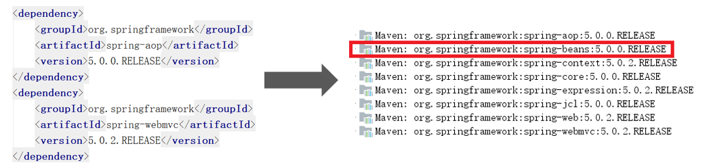

#### 结论：

​										通过上图可以看到，spring-aop和spring-webmvc都传递过来了spring-beans，但是因为spring-aop在前面，所							以最终使用的spring-beans是由spring-aop传递过来的，而spring-webmvc传递过来的spring-beans则被忽略了。

### 依赖调节原则——路径近者优先原则

​										在 pom 文件定义依赖，以路径近者为准。

​										还是上述情况，spring-aop 和 spring-webmvc 都会传递过来 spirng-beans，那如果直接把 spring-beans 的依赖						**直接写到 pom 文件中**，那么项目就不会再使用其他依赖传递来的 spring-beans，因为自己直接在 pom 中定义 spring-						beans要比其他依赖传递过来的路径要近。

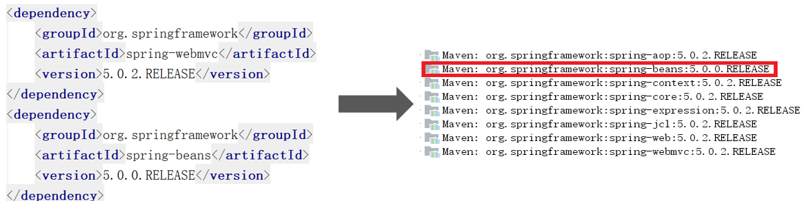

### 排除依赖

​							可以使用**exclusions**标签将传递过来的依赖排除出去。

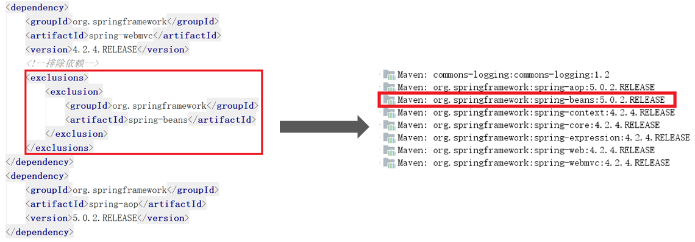

​						通过上图可以看到，spring-webmvc传递过来的4.2.4版本的spring-beans已经被排除出去了，项目中使用的为spring-aop			传递过来的5.0.2版本的spring-beans。

### 版本锁定

​								采用直接锁定版本的方法确定依赖jar包的版本，版本锁定后则不考虑依赖的声明顺序或依赖的路径，以锁定的版本为						准添加到工程中，此方法在企业开发中经常使用。

​								版本锁定的使用方式：

​										第一步：在dependencyManagement标签中锁定依赖的版本

​										第二步：在dependencies标签中声明需要导入的maven坐标


```xml
<!--依赖jar包版本锁定-->
<dependencyManagement>
    <dependencies>
        <dependency>
            <groupId>org.springframework</groupId>
            <artifactId>spring-beans</artifactId>
            <version>5.0.2.RELEASE</version>
        </dependency>
        <dependency>
            <groupId>org.springframework</groupId>
            <artifactId>spring-context</artifactId>
            <version>5.0.2.RELEASE</version>
        </dependency>
    </dependencies>
</dependencyManagement>
```

​								注意：pom文件中使用dependencyManagement标签进行依赖jar的版本锁定，**并不会真正将jar包导入到项目中**，只						是对这些jar的版本进行锁定。项目中使用哪些jar包，还需要在dependencies标签中进行声明。

```xml
<dependencies>
    <!--由于前面已经在dependencyManagement标签中锁定了
spring- beans和spring-context的版本,
此处只需要导入groupId和lartifactId即可，无须再指定version-->
    <dependency>
        <groupId>org.springframework</groupId>
        <artifactId>spring-beans</artifactId>
    </dependency>
    <dependency>
        <groupId>org.springframework</groupId>
        <artifactId>spring-context</artifactId>
    </dependency>
</dependencies>
```

​										注意：由于前面已经在dependencyManagement标签中**锁定了依赖jar包**的版本，后面需要导入依赖时只需要指							定groupId和artifactId，**无须再指定version。**

# maven项目构建 

​						①创建maven web项目

​						②配置pom.xml文件

​						③实现spring+mybatis整合

​								创建POJO类

​								持久层DAO接口编写

​								Mapper映射文件编写

​								业务层Service编写

​								spring配置文件applicationContext-dao.xml编写

​								spring配置文件applicationContext-service.xml编写

​						④加入springmvc相关配置

​								表现层Controller编写

​								springmvc.xml文件编写

​								 jsp页面编写

​								配置web.xml文件

# 分模块构建maven工程

## 分模块构建maven工程分析

​							在现实生活中，汽车厂家进行汽车生产时，由于整个生产过程非常复杂和繁琐，工作量非常大，所以车场都会将整个汽				车的部件**分开生产**，最终再将生产好的部件进行**组装**，形成一台完整的汽车。

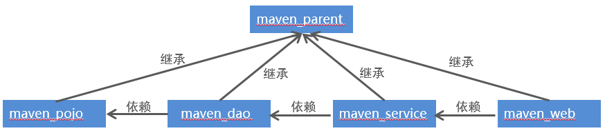

## maven工程的继承

​								在Java语言中，类之间是可以继承的，通过继承，子类就可以引用父类中非private的属性和方法。同样，在maven工					程之间也可以继承，子工程继承父工程后，就可以**使用在父工程中引入的依赖**。继承的目的是为了消除重复代码。

### 被继承的Maven项目中的POM的部分

​								被继承的maven工程通常称为**父工程**，父工程的**打包方式必须为pom**，所以我们区分某个maven工程是否为父工程就					看这个工程的打包方式是否为pom

```xml
<groupId>com.itheima</groupId>
<artifactId>parent</artifactId>
<version>1.0-SNAPSHOT</version>
<!--父工程的打包方式必须为pom-->
<packaging>pom</packaging>
```
### 继承的Maven项目中的POM的部分

​							继承其他maven父工程的工程通常称为子工程，在pom.xml文件中通过parent标签进行父工程的继承

```xml
<!--通过parent标签进行maven工程的继承-->
<parent>
    <artifactId>parent</artifactId>
    <groupId>com.itheima</groupId>
    <version>1.0-SNAPSHOT</version>
    <relativePath>../parent/pom.xml</relativePath>
</parent>
<artifactId>son</artifactId>
```

## maven工程的聚合

​					在maven工程的pom.xml文件中可以使用**<modules>**标签将其他maven工程聚合到一起，聚合的目的是为了进行**统一操作**。

​					例如拆分后的maven工程有多个，如果要进行打包，就需要针对每个工程分别执行打包命令，操作起来非常繁琐。这时就可			以使用<modules>标签将这些工程统一聚合到maven工程中，需要打包的时候，只需要在此工程中执行一次打包命令，其下被聚			合的工程就都会被打包了。

```xml
<!--用于聚合其他maven工程-->
<modules>
    <module>maven_pojo</module>
    <module>maven_service</module>
    <module>maven_dao</module>
    <module>maven_web</module>
</modules>
```

# maven私服

## 说明

​						maven仓库分为本地仓库和远程仓库，而远程仓库又分为maven中央仓库、其他远程仓库和**私服（私有服务器）**。其中，				中央仓库是由maven官方提供的，而私服就需要我们自己搭建了。

​						maven私服就是公司局域网内的maven远程仓库，每个员工的电脑上安装maven软件并且连接maven私服，程序员可以将				自己开发的项目打成jar并发布到私服，其它项目组成员就可以从私服下载所依赖的jar。私服还充当一个代理服务器的角色，当				私服上没有jar包时会从maven中央仓库自动下载。

​						nexus 是一个maven仓库管理器（其实就是一个软件），nexus可以充当maven私服，同时nexus还提供强大的仓库管理、				构件搜索等功能。

## 搭建maven私服

#### ①下载nexus

https://help.sonatype.com/repomanager2/download/download-archives---repository-manager-oss

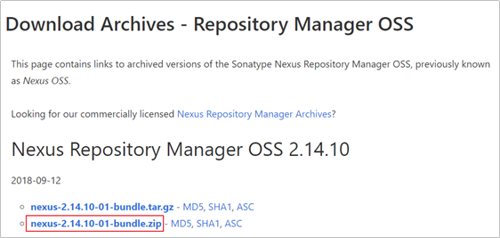

#### ②安装nexus

​										将下载的压缩包进行解压，进入bin目录

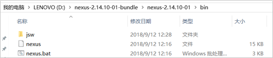

​									打开cmd窗口并进入上面bin目录下，执行nexus.bat install命令安装服务（注意需要以管理员身份运行cmd命令）

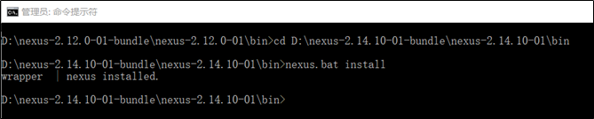

#### ③启动nexus

​										经过前面命令已经完成nexus的安装，可以通过如下两种方式启动nexus服务：

​										在Windows系统服务中启动nexus

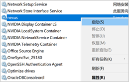

​										在命令行执行nexus.bat start命令启动nexus

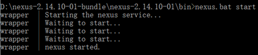

#### ④访问nexus

​										启动nexus服务后，访问http://localhost:8081/nexus

​										点击右上角LogIn按钮，进行登录。使用默认用户名admin和密码admin123登录系统

​										登录成功后点击左侧菜单Repositories可以看到nexus内置的仓库列表（如下图）

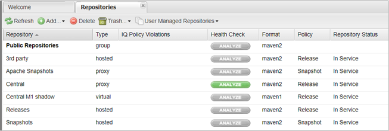

### nexus仓库类型

​									通过前面的仓库列表可以看到，nexus默认内置了很多仓库，这些仓库可以划分为4种类型，每种类型的仓库用于存						放特定的jar包，具体说明如下：

​								①hosted，宿主仓库，部署自己的jar到这个类型的仓库，包括Releases和Snapshots两部分，Releases为公司内部发						布版本仓库、 Snapshots为公司内部测试版本仓库 

​								②proxy，代理仓库，用于代理远程的公共仓库，如maven中央仓库，用户连接私服，私服自动去中央仓库下载jar包						或者插件

​								③group，仓库组，用来合并多个hosted/proxy仓库，通常我们配置自己的maven连接仓库组

​								④virtual(虚拟)：兼容Maven1版本的jar或者插件

### nexus仓库类型与安装目录对应关系

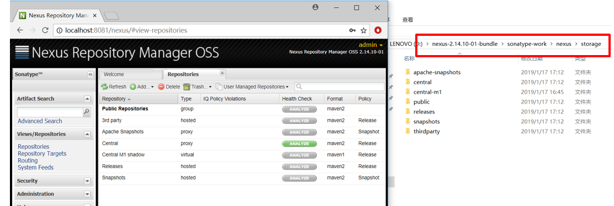

## 将项目发布到maven私服

maven私服是搭建在公司局域网内的maven仓库，公司内的所有开发团队都可以使用。例如技术研发团队开发了一个基础组件，就可以将这个基础组件打成jar包发布到私服，其他团队成员就可以从私服下载这个jar包到本地仓库并在项目中使用。


将项目发布到maven私服操作步骤如下：

配置maven的settings.xml文件

配置项目的pom.xml文件

执行mvn deploy命令